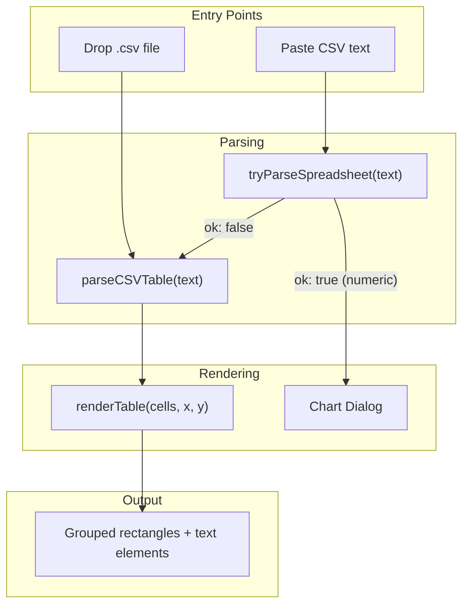

# CSV to Visual Table

## Context

Excalidraw already has infrastructure for parsing CSV/TSV data via `tryParseSpreadsheet` in [packages/excalidraw/charts/charts.parse.ts](packages/excalidraw/charts/charts.parse.ts), but it **requires numeric data columns** (designed for bar/line/radar charts). General CSVs like `demo.csv` (with text columns like names, emails, departments) fail parsing and fall through to plain text.

There is no native "table" element type. Tables are rendered as **grouped rectangles with text elements** -- the same pattern used by the chart rendering system (e.g., [charts.bar.ts](packages/excalidraw/charts/charts.bar.ts) creates `newElement({ type: "rectangle" })` + `newTextElement()` calls).

## Architecture

## Files changed

| File                                         | Change                                                                                   |
| -------------------------------------------- | ---------------------------------------------------------------------------------------- |
| `packages/excalidraw/charts/charts.table.ts` | **New file** -- `parseCSVTable` and `renderTable` functions                              |
| `packages/excalidraw/charts/index.ts`        | Added re-export of `parseCSVTable` and `renderTable`                                     |
| `packages/excalidraw/components/App.tsx`     | Added CSV handling in both `handleAppOnDrop` (drop) and `insertClipboardContent` (paste) |

## Implementation details

### 1. New file: `packages/excalidraw/charts/charts.table.ts`

Two exported functions:

`**parseCSVTable(text: string): string[][] | null`**

Parses delimiter-separated text into a 2D string array. Reuses the same delimiter-scoring heuristic as `tryParseSpreadsheet` (tab > comma > semicolon, prefer consistent column counts). Returns `null` if fewer than 2 rows, fewer than 2 columns, or inconsistent column counts. Unlike `tryParseSpreadsheet`, does NOT require numeric values -- accepts any text content.

`**renderTable(cells: string[][], x: number, y: number): ChartElements`**

Creates Excalidraw elements forming a visual table:

- Measures text in each column to compute auto-sized column widths (using `measureText` from `@excalidraw/element`), clamped between `TABLE_MIN_COL_WIDTH` (60px) and `TABLE_MAX_COL_WIDTH` (280px)
- Computes row heights per row based on the tallest cell content
- Creates a `rectangle` + `text` element pair per cell
- Header row (row 0) uses `FONT_FAMILY["Lilita One"]` with a solid blue background (`COLOR_PALETTE.blue[1]`) and white text
- Body rows use `DEFAULT_FONT_FAMILY` with transparent background and black text
- All elements share a common `groupIds` entry (via `randomId()` from `@excalidraw/common`) so the table moves as a single unit
- Uses a custom `tableProps` object for consistent styling (architect roughness, solid stroke, 1px stroke width)

### 2. Update `packages/excalidraw/charts/index.ts`

Added single re-export line: `export { parseCSVTable, renderTable } from "./charts.table";`

### 3. Update `packages/excalidraw/components/App.tsx` -- Drop handler

In `handleAppOnDrop`, after the image file handling block and before the library/excalidraw file handling:

- Detects CSV files from dropped items via `file.name.toLowerCase().endsWith('.csv')` or `file.type === 'text/csv'`
- Reads file content with `await csvFile.text()`
- Parses with `parseCSVTable`
- On success, calls `renderTable(csvCells, sceneX, sceneY)` and inserts via `this.addElementsFromPasteOrLibrary({ elements, position: event, files: null })`

### 4. Update `packages/excalidraw/components/App.tsx` -- Paste handler

In `insertClipboardContent`, inside the existing `if (!isPlainPaste && data.text)` block, immediately after `tryParseSpreadsheet` fails (falls through without returning):

- Tries `parseCSVTable(data.text)`
- On success, calls `renderTable` and inserts via `addElementsFromPasteOrLibrary` with position set to `"cursor"` on desktop or `"center"` on mobile (matching the pattern used by other paste handlers)
- Returns early to prevent falling through to plain text

## Validation

- TypeScript type-check passes (`yarn test:typecheck`)
- All 9 existing chart tests pass (`packages/excalidraw/tests/charts.test.tsx`)
- No lint errors introduced

