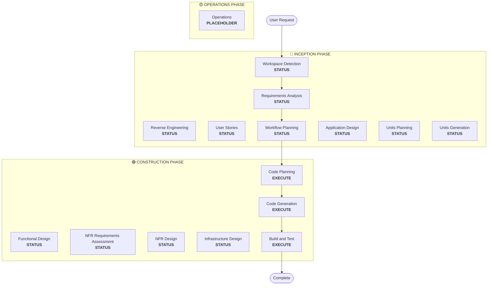

# Workflow Planning

**Purpose**: Determine which phases to execute and create comprehensive execution plan

**Always Execute**: This phase always runs after understanding requirements and scope

## Step 1: Load All Prior Context

### 1.1 Load Reverse Engineering Artifacts (if brownfield)
- architecture.md
- component-inventory.md
- technology-stack.md
- dependencies.md

### 1.2 Load Requirements Analysis
- requirements.md (includes intent analysis)
- requirement-verification-questions.md (with answers)

### 1.3 Load User Stories (if executed)
- stories.md
- personas.md

## Step 2: Detailed Scope and Impact Analysis

**Now that we have complete context (requirements + stories), perform detailed analysis:**

### 2.1 Transformation Scope Detection (Brownfield Only)

**IF brownfield project**, analyze transformation scope:

#### Architectural Transformation
- **Single component change** vs **architectural transformation**
- **Infrastructure changes** vs **application changes**
- **Deployment model changes** (Lambda→Container, EC2→Serverless, etc.)

#### Related Component Identification
For transformations, identify:
- **Infrastructure code** that needs updates
- **CDK stacks** requiring changes
- **API Gateway** configurations
- **Load balancer** requirements
- **Networking** changes needed
- **Monitoring/logging** adaptations

#### Cross-Package Impact
- **CDK infrastructure** packages requiring updates
- **Shared models** needing version updates
- **Client libraries** requiring endpoint changes
- **Test packages** needing new test scenarios

### 2.2 Change Impact Assessment

#### Impact Areas
1. **User-facing changes**: Does this affect user experience?
2. **Structural changes**: Does this change system architecture?
3. **Data model changes**: Does this affect database schemas or data structures?
4. **API changes**: Does this affect interfaces or contracts?
5. **NFR impact**: Does this affect performance, security, or scalability?

#### Application Layer Impact (if applicable)
- **Code changes**: New entry points, adapters, configurations
- **Dependencies**: New libraries, framework changes
- **Configuration**: Environment variables, config files
- **Testing**: Unit tests, integration tests

#### Infrastructure Layer Impact (if applicable)
- **Deployment model**: Lambda→ECS, EC2→Fargate, etc.
- **Networking**: VPC, security groups, load balancers
- **Storage**: Persistent volumes, shared storage
- **Scaling**: Auto-scaling policies, capacity planning

#### Operations Layer Impact (if applicable)
- **Monitoring**: CloudWatch, custom metrics, dashboards
- **Logging**: Log aggregation, structured logging
- **Alerting**: Alarm configurations, notification channels
- **Deployment**: CI/CD pipeline changes, rollback strategies

### 2.3 Component Relationship Mapping (Brownfield Only)

**IF brownfield project**, create component dependency graph:

```markdown
## Component Relationships
- **Primary Component**: [Package being changed]
- **Infrastructure Components**: [CDK/Terraform packages]
- **Shared Components**: [Models, utilities, clients]
- **Dependent Components**: [Services that call this component]
- **Supporting Components**: [Monitoring, logging, deployment]
```

For each related component:
- **Change Type**: Major, Minor, Configuration-only
- **Change Reason**: Direct dependency, deployment model, networking
- **Change Priority**: Critical, Important, Optional

### 2.4 Risk Assessment

Evaluate risk level:
1. **Low**: Isolated change, easy rollback, well-understood
2. **Medium**: Multiple components, moderate rollback, some unknowns
3. **High**: System-wide impact, complex rollback, significant unknowns
4. **Critical**: Production-critical, difficult rollback, high uncertainty

## Step 3: Phase Determination

### 3.1 User Stories - Already Executed or Skip?
**Already executed**: Move to next determination
**Not executed - Execute IF**:
- Multiple user personas
- User experience impact
- Acceptance criteria needed
- Team collaboration required

**Skip IF**:
- Internal refactoring
- Bug fix with clear reproduction
- Technical debt reduction
- Infrastructure changes

### 3.2 Application Design - Execute IF:
- New components or services needed
- Component methods and business rules need definition
- Service layer design required
- Component dependencies need clarification

**Skip IF**:
- Changes within existing component boundaries
- No new components or methods
- Pure implementation changes

### 3.3 Design (Units Planning/Generation) - Execute IF:
- New data models or schemas
- API changes or new endpoints
- Complex algorithms or business logic
- State management changes
- Multiple packages require changes
- Infrastructure-as-code updates needed

**Skip IF**:
- Simple logic changes
- UI-only changes
- Configuration updates
- Straightforward implementations

### 3.4 NFR Implementation - Execute IF:
- Performance requirements
- Security considerations
- Scalability concerns
- Monitoring/observability needed

**Skip IF**:
- Existing NFR setup sufficient
- No new NFR requirements
- Simple changes with no NFR impact

## Step 4: Determine Depth Levels

For each phase that will execute, determine depth:

### Depth Level Criteria

**Minimal** - Use when:
- Simple, well-defined change
- Low complexity and risk
- Clear requirements provided
- Single component impact

**Standard** - Use when:
- Normal complexity project
- Multiple components involved
- Standard requirements gathering needed
- Moderate risk level

**Comprehensive** - Use when:
- High complexity or risk
- Multiple stakeholders involved
- Significant architectural changes
- Critical production systems
- Unclear or evolving requirements

### Phase-Specific Depth
1. **User Stories**: Minimal (basic stories) | Standard (stories + personas) | Comprehensive (detailed journeys + acceptance criteria)
3. **Application Design**: Minimal (basic components) | Standard (full component design) | Comprehensive (detailed design + patterns)
4. **Design**: Minimal (basic design) | Standard (full design artifacts) | Comprehensive (detailed design + patterns)
5. **NFR**: Minimal (basic setup) | Standard (full NFR implementation) | Comprehensive (detailed NFR + monitoring)
6. **Code Planning**: Minimal (simple plan) | Standard (detailed plan) | Comprehensive (comprehensive plan + alternatives)
7. **Code Generation**: Minimal (core code only) | Standard (code + tests) | Comprehensive (code + tests + docs)

## Step 5: Multi-Package Change Sequence (Brownfield Only)

**IF brownfield with multiple packages**, determine sequence:

```markdown
## Package Update Sequence
1. **Shared Models** (if API changes)
2. **Application Code** (core transformation)
3. **Infrastructure Code** (CDK/Terraform updates)
4. **Client Libraries** (if interface changes)
5. **Test Packages** (integration test updates)
6. **Deployment Scripts** (pipeline updates)
```

Identify:
- **Parallel changes**: Independent packages
- **Sequential changes**: Dependent packages
- **Coordination points**: Shared infrastructure, APIs

## Step 6: Generate Workflow Visualization

Create Mermaid flowchart showing:
- All phases in sequence
- EXECUTE or SKIP decision for each conditional phase
- Proper styling for each phase state

**Styling rules** (add after flowchart):
```
style WD fill:#90EE90,stroke:#2d5016,stroke-width:3px
style CP fill:#90EE90,stroke:#2d5016,stroke-width:3px
style CG fill:#90EE90,stroke:#2d5016,stroke-width:3px
style BT fill:#90EE90,stroke:#2d5016,stroke-width:3px
style US fill:#f0f0f0,stroke:#999999,stroke-width:2px,stroke-dasharray: 5 5
style Start fill:#E6E6FA,stroke:#4B0082,stroke-width:2px
style End fill:#E6E6FA,stroke:#4B0082,stroke-width:2px
```

**Style Guidelines**:
- Completed/Always execute: `fill:#90EE90,stroke:#2d5016,stroke-width:3px`
- Conditional EXECUTE: `fill:#FFE4B5,stroke:#8B7355,stroke-width:2px,stroke-dasharray: 5 5`
- Conditional SKIP: `fill:#f0f0f0,stroke:#999999,stroke-width:2px,stroke-dasharray: 5 5`
- Start/End: `fill:#E6E6FA,stroke:#4B0082,stroke-width:2px`

## Step 7: Create Execution Plan Document

Create `aidlc-docs/inception/plans/execution-plan.md`:

```markdown
# Execution Plan

## Detailed Analysis Summary

### Transformation Scope (Brownfield Only)
- **Transformation Type**: [Single component/Architectural/Infrastructure]
- **Primary Changes**: [Description]
- **Related Components**: [List]

### Change Impact Assessment
- **User-facing changes**: [Yes/No - Description]
- **Structural changes**: [Yes/No - Description]
- **Data model changes**: [Yes/No - Description]
- **API changes**: [Yes/No - Description]
- **NFR impact**: [Yes/No - Description]

### Component Relationships (Brownfield Only)
[Component dependency graph]

### Risk Assessment
- **Risk Level**: [Low/Medium/High/Critical]
- **Rollback Complexity**: [Easy/Moderate/Difficult]
- **Testing Complexity**: [Simple/Moderate/Complex]

## Workflow Visualization



**Note**: Replace STATUS placeholders with actual phase status (COMPLETED/SKIP/EXECUTE) and apply appropriate styling

## Phases to Execute

### 🔵 INCEPTION PHASE
- [x] Workspace Detection (COMPLETED)
- [x] Reverse Engineering (COMPLETED/SKIPPED)
- [x] Requirements Elaboration (COMPLETED) - Depth: [Minimal/Standard/Comprehensive]
- [x] User Stories (COMPLETED/SKIPPED)
- [x] Execution Plan (IN PROGRESS)
- [ ] Application Design - [EXECUTE/SKIP] - Depth: [Minimal/Standard/Comprehensive]
  - **Rationale**: [Why executing or skipping]
- [ ] Units Planning - [EXECUTE/SKIP] - Depth: [Minimal/Standard/Comprehensive]
  - **Rationale**: [Why executing or skipping]
- [ ] Units Generation - [EXECUTE/SKIP] - Depth: [Minimal/Standard/Comprehensive]
  - **Rationale**: [Why executing or skipping]

### 🟢 CONSTRUCTION PHASE
- [ ] Functional Design - [EXECUTE/SKIP] - Depth: [Minimal/Standard/Comprehensive]
  - **Rationale**: [Why executing or skipping]
- [ ] NFR Requirements Assessment - [EXECUTE/SKIP] - Depth: [Minimal/Standard/Comprehensive]
  - **Rationale**: [Why executing or skipping]
- [ ] NFR Design - [EXECUTE/SKIP] - Depth: [Minimal/Standard/Comprehensive]
  - **Rationale**: [Why executing or skipping]
- [ ] Infrastructure Design - [EXECUTE/SKIP] - Depth: [Minimal/Standard/Comprehensive]
  - **Rationale**: [Why executing or skipping]
- [ ] Code Planning - EXECUTE (ALWAYS) - Depth: [Minimal/Standard/Comprehensive]
  - **Rationale**: Implementation approach needed
- [ ] Code Generation - EXECUTE (ALWAYS) - Depth: [Minimal/Standard/Comprehensive]
  - **Rationale**: Code implementation needed
- [ ] Build and Test - EXECUTE (ALWAYS)
  - **Rationale**: Build, test, and verification needed

### 🟡 OPERATIONS PHASE
- [ ] Operations - PLACEHOLDER
  - **Rationale**: Future deployment and monitoring workflows

## Package Change Sequence (Brownfield Only)
[If applicable, list package update sequence with dependencies]

## Estimated Timeline
- **Total Phases**: [Number]
- **Estimated Duration**: [Time estimate]

## Success Criteria
- **Primary Goal**: [Main objective]
- **Key Deliverables**: [List]
- **Quality Gates**: [List]

[IF brownfield]
- **Integration Testing**: All components working together
- **Operational Readiness**: Monitoring, logging, alerting working
```

## Step 8: Initialize State Tracking

Update `aidlc-docs/aidlc-state.md`:

```markdown
# AI-DLC State Tracking

## Project Information
- **Project Type**: [Greenfield/Brownfield]
- **Start Date**: [ISO timestamp]
- **Current Stage**: INCEPTION - Workflow Planning

## Execution Plan Summary
- **Total Stages**: [Number]
- **Stages to Execute**: [List]
- **Stages to Skip**: [List with reasons]

## Stage Progress

### 🔵 INCEPTION PHASE
- [x] Workspace Detection
- [x] Reverse Engineering (if applicable)
- [x] Requirements Analysis - Depth: [Minimal/Standard/Comprehensive]
- [x] User Stories (if applicable)
- [x] Workflow Planning
- [ ] Application Design - [EXECUTE/SKIP]
- [ ] Units Planning - [EXECUTE/SKIP]
- [ ] Units Generation - [EXECUTE/SKIP]

### 🟢 CONSTRUCTION PHASE
- [ ] Functional Design - [EXECUTE/SKIP]
- [ ] NFR Requirements Assessment - [EXECUTE/SKIP]
- [ ] NFR Design - [EXECUTE/SKIP]
- [ ] Infrastructure Design - [EXECUTE/SKIP]
- [ ] Code Planning - EXECUTE
- [ ] Code Generation - EXECUTE
- [ ] Build and Test - EXECUTE

### 🟡 OPERATIONS PHASE
- [ ] Operations - PLACEHOLDER

## Current Status
- **Lifecycle Phase**: INCEPTION
- **Current Stage**: Workflow Planning Complete
- **Next Stage**: [Next stage to execute]
- **Status**: Ready to proceed
```

## Step 9: Present Plan to User

```
"I've created a comprehensive execution plan based on:
- Your request: [Summary]
- Existing system: [Summary if brownfield]
- Requirements: [Summary if executed]
- User stories: [Summary if executed]

**Detailed Analysis**:
- Risk level: [Level]
- Impact: [Summary of key impacts]
- Components affected: [List]

**Execution Plan**:

I will execute [X] phases:
1. [Phase name] - [Depth] - [Rationale]
2. [Phase name] - [Depth] - [Rationale]
...

I will skip [Y] phases:
1. [Phase name] - [Rationale]
2. [Phase name] - [Rationale]
...

[IF brownfield with multiple packages]
**Package Update Sequence**:
1. [Package] - [Reason]
2. [Package] - [Reason]
...

**Estimated Timeline**: [Duration]

Review the detailed plan and workflow visualization in aidlc-docs/inception/plans/execution-plan.md

**Ready to proceed with this plan?** (You can request changes if needed)"
```

## Step 10: Handle User Response

- **If approved**: Proceed to next stage in execution plan
- **If changes requested**: Update execution plan and re-confirm
- **If user wants to force include/exclude stages**: Update plan accordingly

## Step 11: Log Interaction

Log in `aidlc-docs/audit.md`:

```markdown
## Workflow Planning - Approval
**Timestamp**: [ISO timestamp]
**AI Prompt**: "Ready to proceed with this plan?"
**User Response**: "[User's COMPLETE RAW response]"
**Status**: [Approved/Changes Requested]
**Context**: Workflow plan created with [X] stages to execute

---
```
