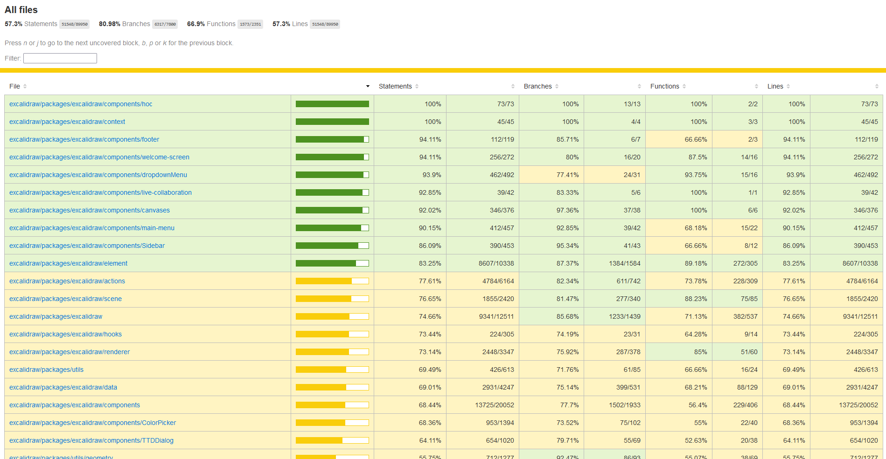
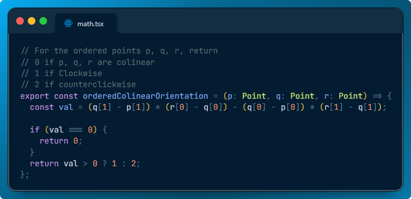
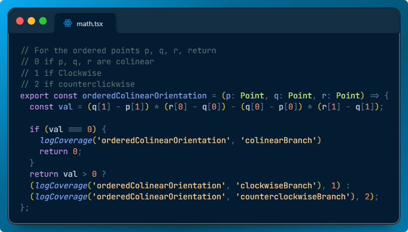
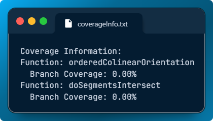
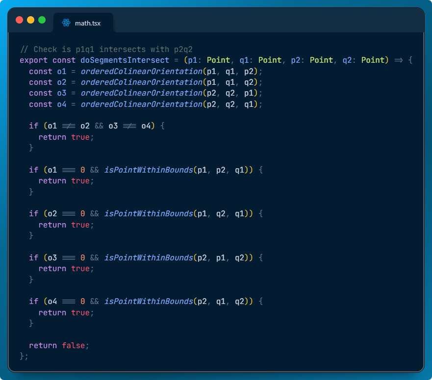
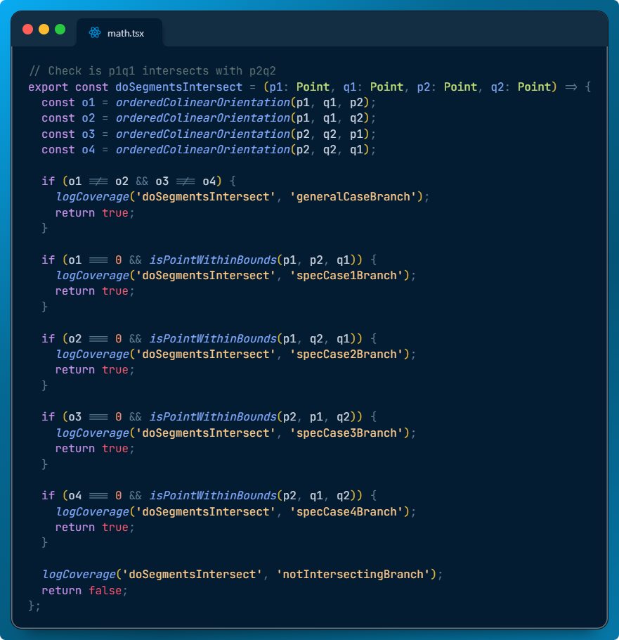
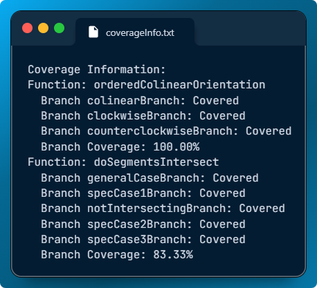
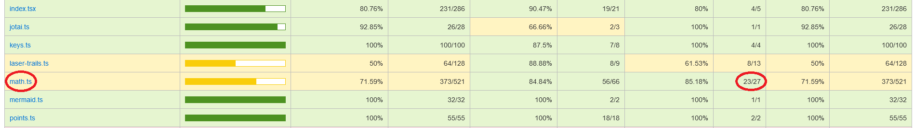
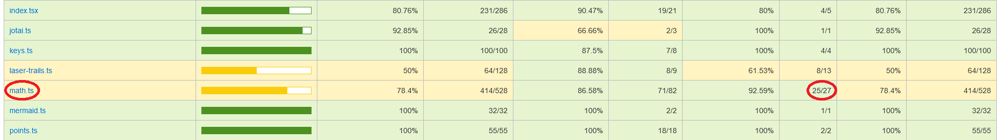

# Report for Assignment 1

## Project chosen

Name: **Excalidraw editor**

URL: https://github.com/excalidraw/excalidraw

Number of lines of code and the tool used to count it: **393,216** - counted with **Lizard**

Programming language: **TypeScript**

> *note: The main language core can be seen as either TypeScript (393 KLOC) or JavaScript (5,440 KLOC). We decided to highlight TypeScript, as the unit tests are written in a TypeScript React (.tsx) dialect.*

## Coverage measurement

### Existing tool

The tool for unit testing within the repository is **vitest**. A coverage submodule was helpfully provided as part of the existing suite, and could be ran using the following command:

```bash
yarn test:coverage
```

Which generates an **Istanbul.js** report of coverage for the application.

For more targeted testing, the same command was used, but with a glob as the third argument:

```bash
yarn test:coverage /path/to/tests/*
```

The following is the outcome of running the existing tool on an unchanged version of excalibur cloned from https://github.com/excalidraw/excalidraw/commit/22b39277f5f4a6b125e170ab14238b084719cb2d, or the most recent commit at time of writing.



### Your own coverage tool

Team member name: Kacper

#### Function 1: restoreLibraryItems

<table>
  <tr>
    <td>
    <div align="center">Pre-coverage restore</div>
    </td>
    <td>
    <div align="center">Post-coverage restore</div>
    </td>
  </tr>
</table>

#### Tool results 
<div align="center">
  
</div>


#### Function 2: shouldDiscardRemoteElement

<table>
  <tr>
    <td>
    <div align="center">Pre-coverage reconcile</div>
    </td>
    <td>
    <div align="center">Post-coverage reconcile</div>
    </td>
  </tr>
</table>

#### Tool results 
<div align="center">
  
</div>

#### Link to the files changes: 
https://github.com/excalidraw/excalidraw/pull/8150/commits/5cae8a6dad22785109211e5ae8b9b535cb26c27c

---

Team member name: Yassir

#### Function 1: orderedColinearOrientation

<div align="center">
<table>
  <tr>
    <td>
    <div align="center">Pre-coverage orientation</div>
    </td>
    <td>
    <div align="center">Post-coverage orientation</div>
    </td>
  </tr>
</table>
</div>

#### Tool results 
<div align="center">
  
</div>

#### Function 2: doSegmentsIntersect

<div align="center">
<table>
  <tr>
    <td>
    <div align="center">Pre-coverage intersect</div>
    </td>
    <td>
    <div align="center">Post-coverage intersect</div>
    </td>
  </tr>
</table>
</div>

#### Tool results 
<div align="center">
  
</div>

## Coverage improvement

### Individual tests

Team member name: Kacper

#### Test 1 restoreLibraryElements

<table>
  <tr>
    <td>
    <div align="center">Restore Tests P1</div>
    </td>
    <td>
    <div align="center">Restore Tests P2</div>
    </td>
  </tr>
</table>

<div>Restore Tests P3</div>


<div align="center">Before improvements</div>


<div align="center">After improvements</div>

The previous tests for these functions were not existing, so by writing new tests I was able to increase the overall coverage.

#### Test 2 shouldDiscardRemoteElement

<table>
  <tr>
    <td>
    <div align="center">Reconcile Tests P1</div>
    </td>
    <td>
    <div align="center">Reconcile Tests P2</div>
    </td>
  </tr>
</table>


<div align="center">Before improvements</div>


<div align="center">After improvements</div>

The previous tests were accounting that the function <i>shouldDiscardRemoteElement</i> was tested with other test cases. Nevertheless as it was visible with the custom coverage some branches of the function were not tested. By creating custom tests for each of the "if statement" conditions I was able to improve the coverage to 100%.

#### Link to the files changes: 
https://github.com/excalidraw/excalidraw/pull/8150/commits/f42b37c9a2c1418c71b0d81ff039d93983feaae1

---

Team member name: Yassir

There were no previous tests, so I wrote tests for both functions in a single file at the following path: `packages/excalidraw/tests/orientationAndIntersect.test.tsx`.

#### Link to the files changes: 
https://github.com/GacuGacu/excalidraw-SEP/commit/10ded5ce886048d3031609a093d3eef87db7ebb0

### Old coverage results vs new coverage results

<div align="center">
<table>
  <tr>
    <td>
    <div align="center">Old coverage results</div>
    </td>
    <td>
    <div align="center">New coverage results</div>
    </td>
  </tr>
</table>
</div>

The external tool also reflects the fact that the 2 functions have been covered.

<div align="center">

<div align="center">Old coverage results</div>

<div style="height: 40px;"></div>


<div align="center">New coverage results</div>
</div>

<div style="height: 40px;"></div>

The coverage improved by 100% for `orderedColinearOrientation` and by 83.33% for `doSegmentsIntersect`. For the first function, we added tests covering all three cases: colinear, clockwise, and counterclockwise points. For `doSegmentsIntersect`, coverage is limited to 83.33% because one branch is impossible to reach. The tests cover all other branches.


### Overall

Old coverage results:


New coverage results:

<Provide a screenshot of the new coverage results by running the existing tool using all test modifications made by the group>

## Statement of individual contributions

#### Kacper:
I was responsible for the functions restoreLibraryItem and shouldDiscardElement as described above.

#### Yassir:
I was responsible for the functions colinearOrderedOrientation and doSegmentsIntersect as described above.
