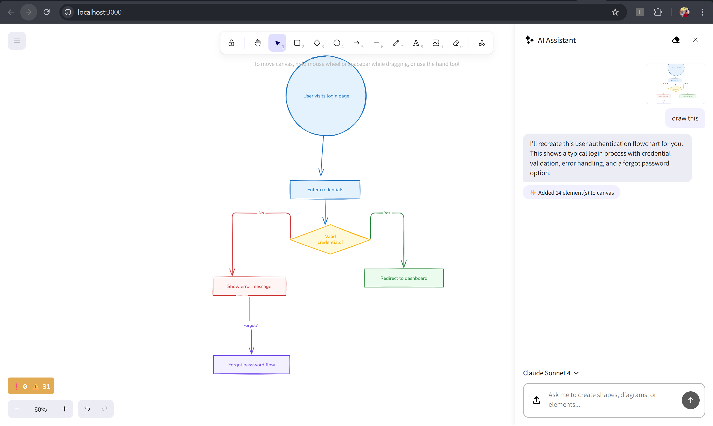

# Excalidraw with AI Features 🤖

<div align="center">
  
</div>

## Overview

This is a modified version of Excalidraw that includes a powerful **AI Chatbot Assistant** to help you create diagrams, flowcharts, and shapes using natural language. Simply describe what you want to create, and the AI will generate it on the canvas for you!

> **⭐ Built on top of the amazing [Excalidraw](https://github.com/excalidraw/excalidraw) project!**
> 
> This repository is a fork of the original [Excalidraw](https://github.com/excalidraw/excalidraw) by the Excalidraw team. All the core features, whiteboard functionality, and collaboration capabilities are from the original project. I've only added the AI Chatbot Assistant feature on top of it. **All credit for the base application goes to the original Excalidraw team!** 🙌
> 
> Check out the original project: [https://github.com/excalidraw/excalidraw](https://github.com/excalidraw/excalidraw)

## ✨ AI Features (What's New)

### 🤖 AI Chatbot Assistant

The AI Chatbot is your intelligent companion for creating diagrams and getting help with Excalidraw. It can:

- **Create diagrams and flowcharts** from text descriptions
- **Generate shapes and elements** based on your requests
- **Answer questions** about Excalidraw features and shortcuts
- **Modify existing elements** on the canvas
- **Support image attachments** for visual context
- **Maintain chat history** across sessions

### 🚀 How to Use

#### Opening the AI Assistant

There are two ways to open the AI Chatbot:

1. **Keyboard Shortcut**: Press the `C` key (without any modifiers)
2. **UI Button**: Click the AI button in the toolbar

#### Interacting with the AI

Once the chatbot is open, you can:

- **Type your request** in the input field
- **Attach images** by clicking the paperclip icon or dragging & dropping images
- **Paste images** directly into the input field using Ctrl+V / Cmd+V
- **Ask questions** about Excalidraw features and shortcuts
- **Request diagrams** like "Create a login flowchart" or "Draw a system architecture diagram"

#### Example Prompts

Here are some examples of what you can ask the AI:

```
"Create a user authentication flowchart"
"Draw a simple process diagram with 3 steps"
"Add a rectangle with the text 'Database'"
"Create a system architecture with microservices"
"How do I export my drawing?"
"What keyboard shortcuts are available?"
```

### 🎯 Keyboard Shortcuts

- `C` - Open/Close AI Assistant
- `Enter` - Send message
- `Shift + Enter` - New line in message
- `Escape` - Close AI Assistant

### 🤖 Available AI Models

The chatbot supports multiple AI providers and models:

#### OpenAI
- **GPT-5** (Default)

#### Google
- **Gemini 2.5 Pro** - Most capable model
- **Gemini 2.5 Flash** - Faster responses

#### Anthropic
- **Claude Sonnet 4.5** - Latest and most capable
- **Claude Opus 4** - High-quality responses
- **Claude Sonnet 4** - Balanced performance
- **Claude 3.7 Sonnet** - Previous generation

#### xAI
- **Grok 4** - Latest Grok model
- **Grok 3** - Previous generation

### 🔧 Configuration

To use the AI features, you need to set up API keys in your environment:

1. Create a `.env.development` file in the `excalidraw-app` directory
2. Add your API keys:

```bash
# OpenAI
VITE_OPENAI_API_KEY=your_openai_api_key_here

# Google
VITE_GOOGLE_API_KEY=your_google_api_key_here

# Anthropic
VITE_ANTHROPIC_API_KEY=your_anthropic_api_key_here

# xAI
VITE_XAI_API_KEY=your_xai_api_key_here
```

You only need to add keys for the providers you want to use.

### 📋 Features

- ✅ **Multi-model support** - Switch between different AI models
- ✅ **Image attachments** - Attach up to 5 images per message
- ✅ **Chat history** - Automatically saved to localStorage
- ✅ **Export chat** - Save your conversations
- ✅ **Canvas context awareness** - AI understands what's on your canvas
- ✅ **Smart element creation** - Automatically positions and sizes elements
- ✅ **Element updates** - Modify existing elements on the canvas
- ✅ **Flowchart generation** - Create complex flowcharts with arrows and labels
- ✅ **Error handling** - Clear error messages and fallbacks

### 🎨 What the AI Can Create

- Rectangles, circles, diamonds, and other shapes
- Text elements with custom styling
- Arrows with labels
- Complete flowcharts and diagrams
- System architecture diagrams
- Process flows
- Decision trees
- And much more!

## 🚀 Getting Started

1. Clone this repository
2. Install dependencies:
   ```bash
   yarn install
   ```

3. Set up your API keys in `.env.development` (see Configuration above)

4. Start the development server:
   ```bash
   yarn start
   ```

5. Open your browser and press `C` to open the AI Assistant!

## 💡 Tips

- The AI understands context from your existing canvas elements
- You can ask the AI to modify elements you've already created
- Use specific language for better results (e.g., "blue rectangle" instead of just "shape")
- The AI will automatically position new elements to avoid overlaps
- Chat history is saved automatically, but you can clear it anytime
- Switch between AI models to find the one that works best for you

## 📝 Notes

- The chatbot requires an active internet connection
- API usage is subject to the provider's rate limits and quotas
- Different models may produce different results - experiment to find what works best
- The AI is designed specifically for Excalidraw and understands its element types and styling

## 🎨 Original Excalidraw Features (Included)

All the amazing features from the original [Excalidraw](https://github.com/excalidraw/excalidraw) project are included:

- 💯 Free & open-source
- 🎨 Infinite, canvas-based whiteboard
- ✍️ Hand-drawn like style
- 🌓 Dark mode
- 🏗️ Customizable
- 📷 Image support
- 😀 Shape libraries support
- 🌐 Localization (i18n) support
- 🖼️ Export to PNG, SVG & clipboard
- 💾 Open format - export drawings as an `.excalidraw` json file
- ⚒️ Wide range of tools - rectangle, circle, diamond, arrow, line, free-draw, eraser...
- ➡️ Arrow-binding & labeled arrows
- 🔙 Undo / Redo
- 🔍 Zoom and panning support
- 📡 PWA support (works offline)
- 🤼 Real-time collaboration
- 🔒 End-to-end encryption
- 💾 Local-first support (autosaves to the browser)
- 🔗 Shareable links

For more details about these features, visit the [original Excalidraw repository](https://github.com/excalidraw/excalidraw).

---

## 🙏 Credits

This project is built on top of the amazing [**Excalidraw**](https://github.com/excalidraw/excalidraw) open-source project.

**Original Excalidraw:**
- Website: [excalidraw.com](https://excalidraw.com)
- GitHub: [github.com/excalidraw/excalidraw](https://github.com/excalidraw/excalidraw)
- License: MIT

**What I added:** AI Chatbot Assistant with multi-model support  
**Everything else:** Original Excalidraw features and functionality

---

**Built with ❤️ on top of [Excalidraw](https://github.com/excalidraw/excalidraw), React, and the latest AI models**