# Report for Assignment 1

## Project chosen

Name: **Excalidraw editor**

URL: https://github.com/excalidraw/excalidraw

Number of lines of code and the tool used to count it: **393,216** - counted with **Lizard**

Programming language: **TypeScript**

> *note: The main language core can be seen as either TypeScript (393 KLOC) or JavaScript (5,440 KLOC). We decided to highlight TypeScript, as the unit tests are written in a TypeScript React (.tsx) dialect.*

## Coverage measurement

### Existing tool

The tool for unit testing within the repository is **vitest**. A coverage submodule was helpfully provided as part of the existing suite, and could be ran using the following command:

```bash
yarn test:coverage
```

Which generates an **Istanbul.js** report of coverage for the application.

For more targeted testing, the same command was used, but with a glob as the third argument:

```bash
yarn test:coverage /path/to/tests/*
```

The following is the outcome of running the existing tool on an unchanged version of excalibur cloned from https://github.com/excalidraw/excalidraw/commit/22b39277f5f4a6b125e170ab14238b084719cb2d, or the most recent commit at time of writing.


### Your own coverage tool

Team member name: Jakub

> The created coverage tool functions on the basis of a global object with multiple branches. Whenever said branch is taken in a function, its value is set to 'true'. The objects exist inside of **packages/excalidraw/utils.ts** in the form of **[associatedFile]branches**, as seen here:
> <p align="center">
> 	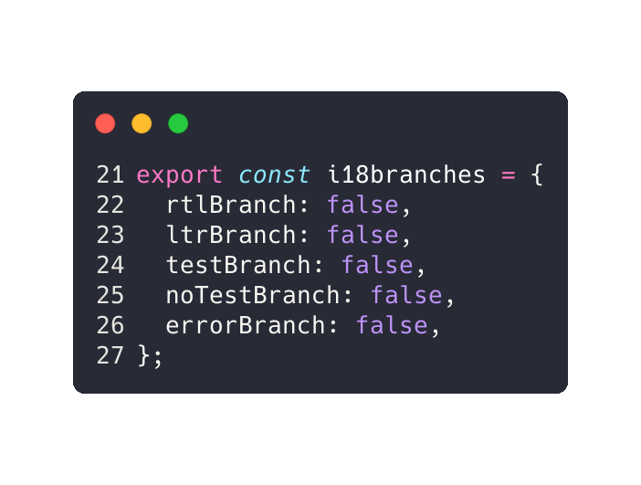
> </p>
>
> Printing this object is done within the ***.test.tsx** file associated with unit testing that specific function (here, **LanguageList.test.tsx** is shown):
> 
> <p align="center">
> 	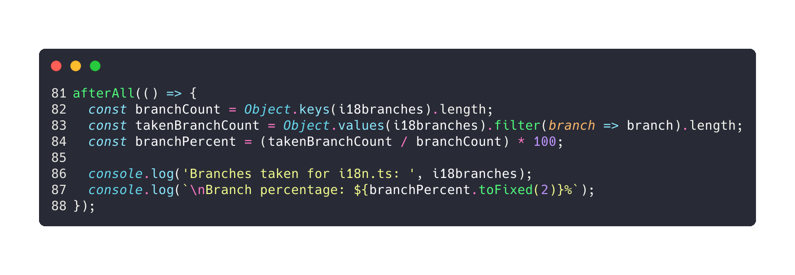
> </p>
>
> For the following functions, lines highlighted in gray have either been added or changed to contain an update to the corresponding branch within the global object.


#### Function 1: setLanguage

> path: **packages/excalidraw/i18n.ts::setLanguage**

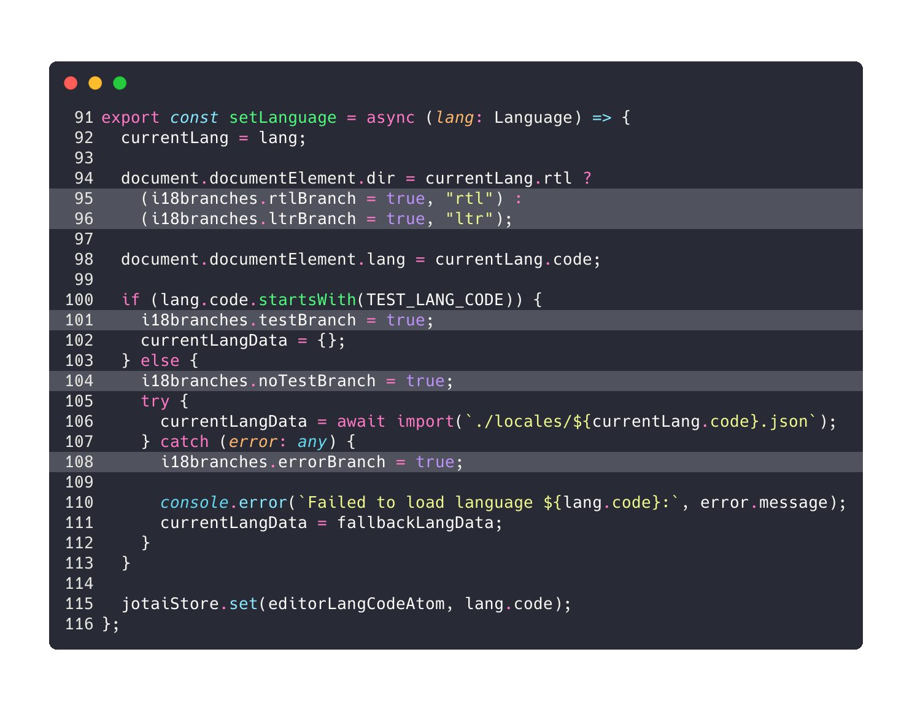

#### Tool results

<p align="center">
	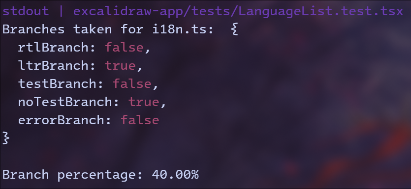
</p>

The link to the coverage test commit that generated these results can be found [here](https://github.com/GacuGacu/excalidraw-SEP/commit/ace05b9685e53ef6df59aaabdbbfac0472bcc14f).

#### Function 2: polygonBounds

> path: **packages/utils/geometry/geometry.ts::polygonBounds**

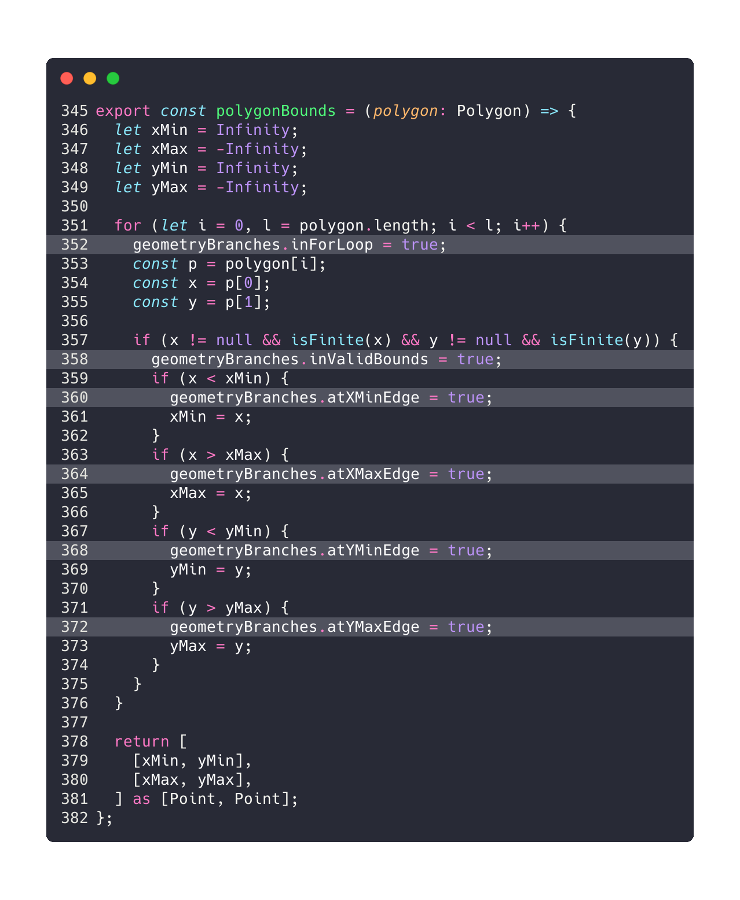

#### Tool results

<p align="center">
	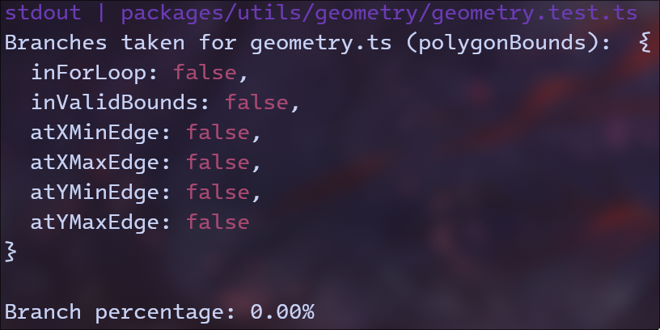
</p>

The link to the coverage test commit that generated these results can be found [here](https://github.com/GacuGacu/excalidraw-SEP/commit/a7bba101110cba548852932cbeb93e5dec37e66f).

Team member name: Kacper

#### Function 1: restoreLibraryItems

<table>
  <tr>
    <td>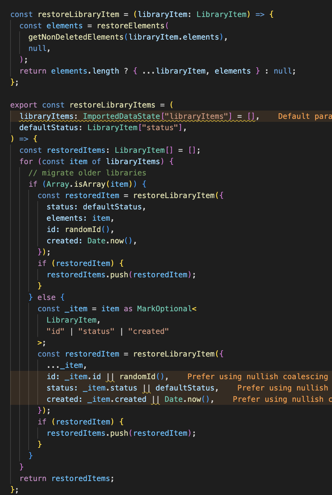
    <div align="center">Pre-coverage restore</div>
    </td>
    <td>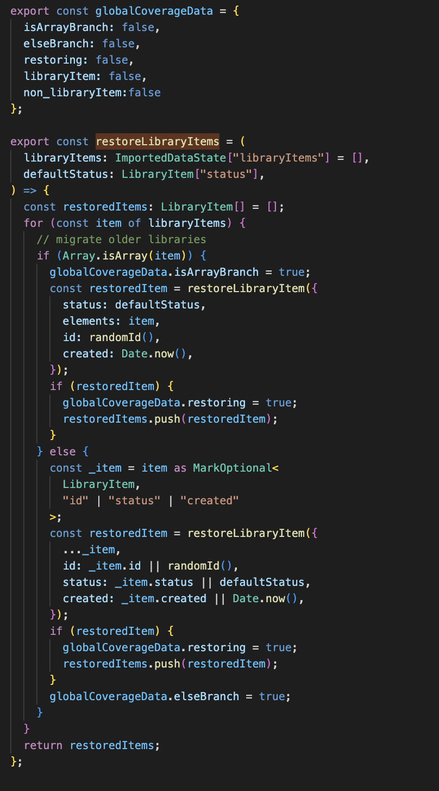
    <div align="center">Post-coverage restore</div>
    </td>
  </tr>
</table>

#### Tool results
<div align="center">
  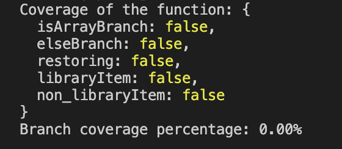
</div>


#### Function 2: shouldDiscardRemoteElement

<table>
  <tr>
    <td>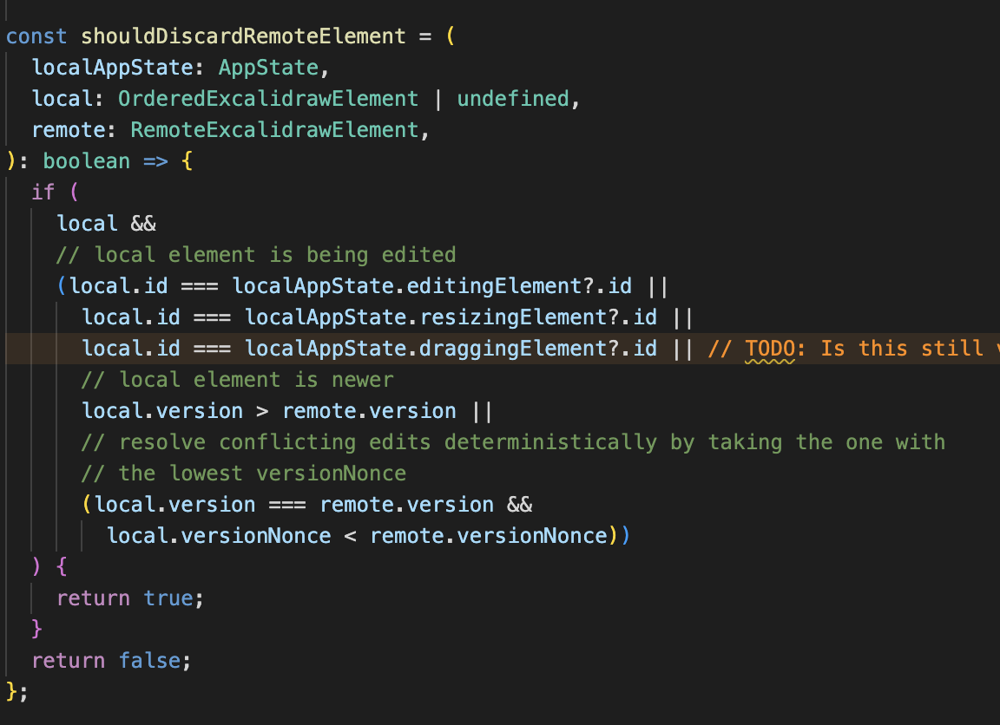
    <div align="center">Pre-coverage reconcile</div>
    </td>
    <td>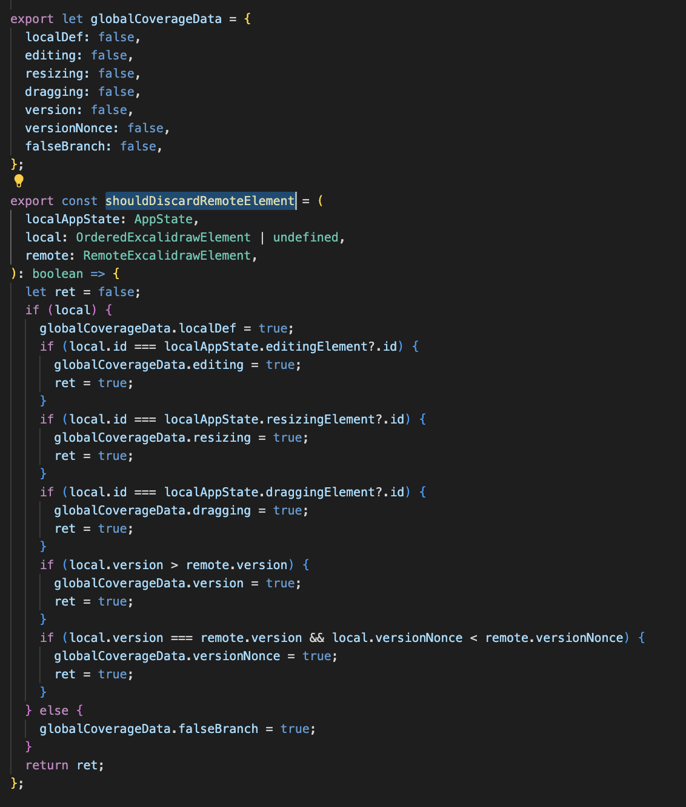
    <div align="center">Post-coverage reconcile</div>
    </td>
  </tr>
</table>

#### Tool results
<div align="center">
  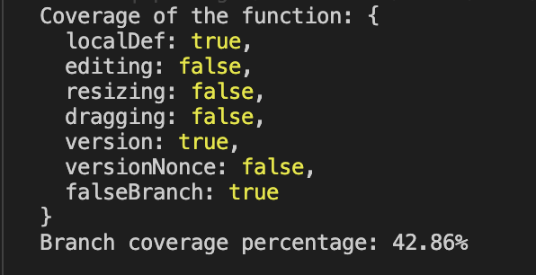
</div>

#### Link to the files changes:
https://github.com/excalidraw/excalidraw/pull/8150/commits/5cae8a6dad22785109211e5ae8b9b535cb26c27c

## Coverage improvement

### Individual tests

Team member name: Jakub

> To improve coverage, additional tests were created in the `it()` clauses from vitest's unit-testing suite. Additionally, some small changes were made to conform to code quality standards (for example, a local constant was `export`-ed to avoid multiple definitions).

#### Test 1: setLanguage

> path: **excalidraw-app/tests/LanguageList.test.tsx**

After the following two tests were implemented:

<p align="center">
	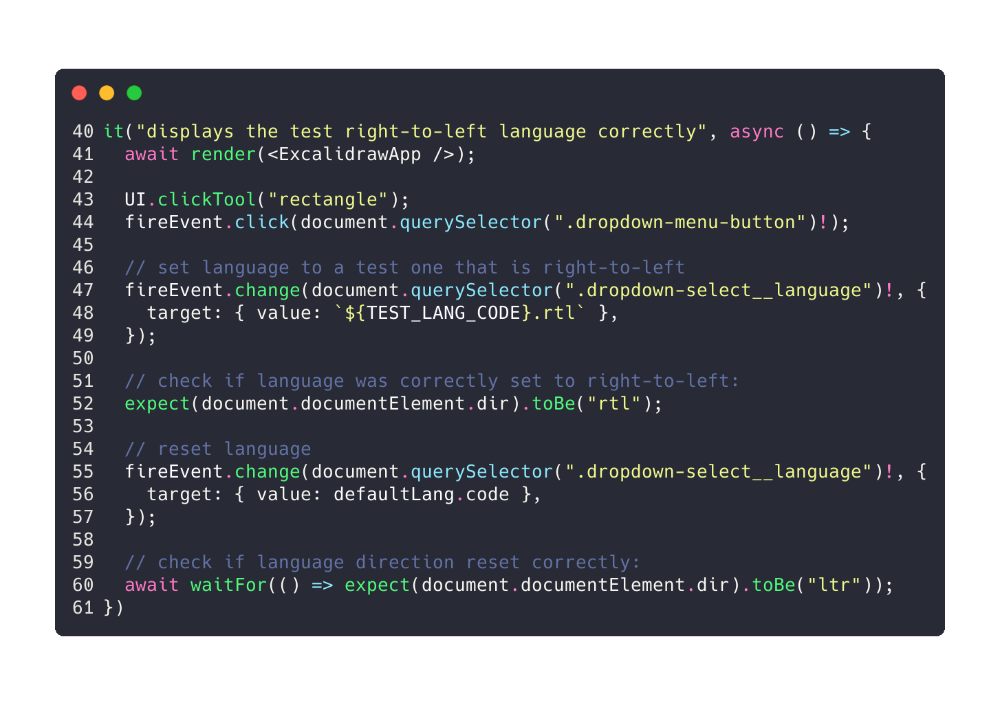
</p>

<p align="center">
	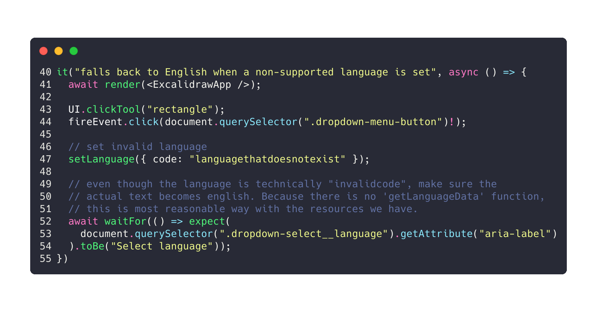
</p>

The code coverage results changed in the following way:

| | Before tests      | After tests      |
| -- | ------------- | ------------- |
| Self-made tool |  | 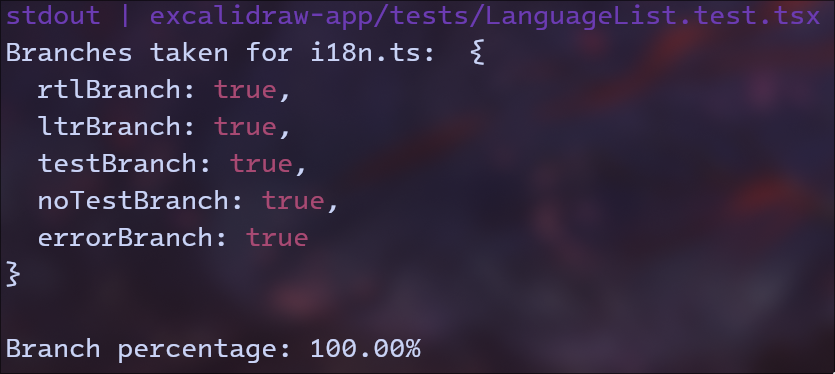  |
| Istanbul report* | 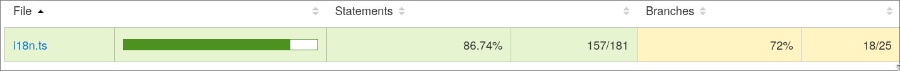 | 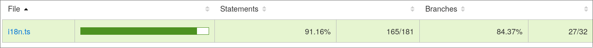  |

> **the ability to isolate functions (especially first-order ones) is not present in istanbul, however a visual inspection of the file itself shows a full coverage, consistent with the results found with the self-made tool.*

The link to the unit test commit that generated these results can be found [here](https://github.com/GacuGacu/excalidraw-SEP/commit/d6fc61657b6a7e69bd683085e76026cb101af7cb).

#### Test 2: ???

TODO

Team member name: Kacper

#### Test 1 restoreLibraryElements

<table>
  <tr>
    <td>
    <div align="center">Restore Tests P1</div>
    </td>
    <td>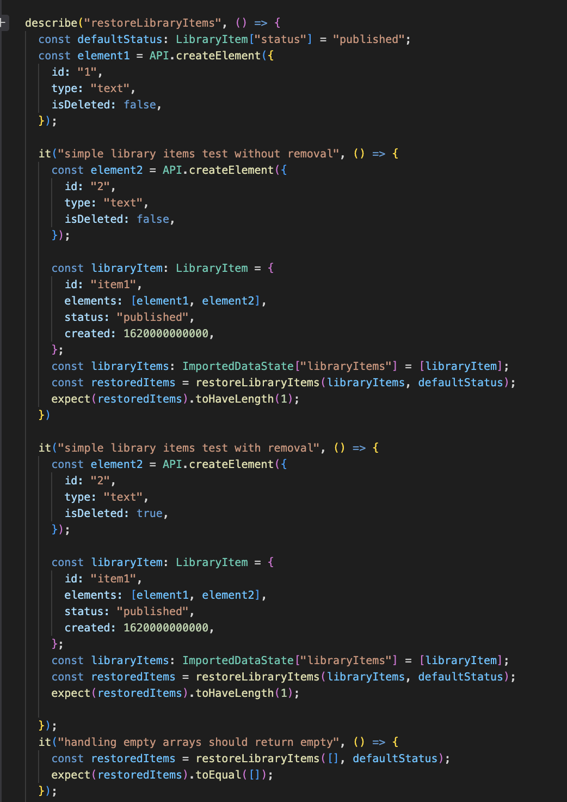
    <div align="center">Restore Tests P2</div>
    </td>
  </tr>
</table>

<div>Restore Tests P3</div>


<div align="center">Before improvements</div>


<div align="center">After improvements</div>

The previous tests for these functions were not existing, so by writing new tests I was able to increase the overall coverage.

#### Test 2 shouldDiscardRemoteElement

<table>
  <tr>
    <td>
    <div align="center">Reconcile Tests P1</div>
    </td>
    <td>
    <div align="center">Reconcile Tests P2</div>
    </td>
  </tr>
</table>


<div align="center">Before improvements</div>

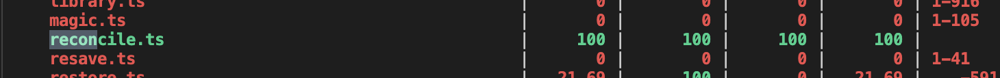
<div align="center">After improvements</div>

The previous tests were accounting that the function <i>shouldDiscardRemoteElement</i> was tested with other test cases. Nevertheless as it was visible with the custom coverage some branches of the function were not tested. By creating custom tests for each of the "if statement" conditions I was able to improve the coverage to 100%.

#### Link to the files changes:
https://github.com/excalidraw/excalidraw/pull/8150/commits/f42b37c9a2c1418c71b0d81ff039d93983feaae1

### Overall

Old coverage results:


New coverage results:

<Provide a screenshot of the new coverage results by running the existing tool using all test modifications made by the group>

## Statement of individual contributions

#### Kacper:
I was respobsible for the functions restoreLibraryItem and shouldDiscardElement as described above.
