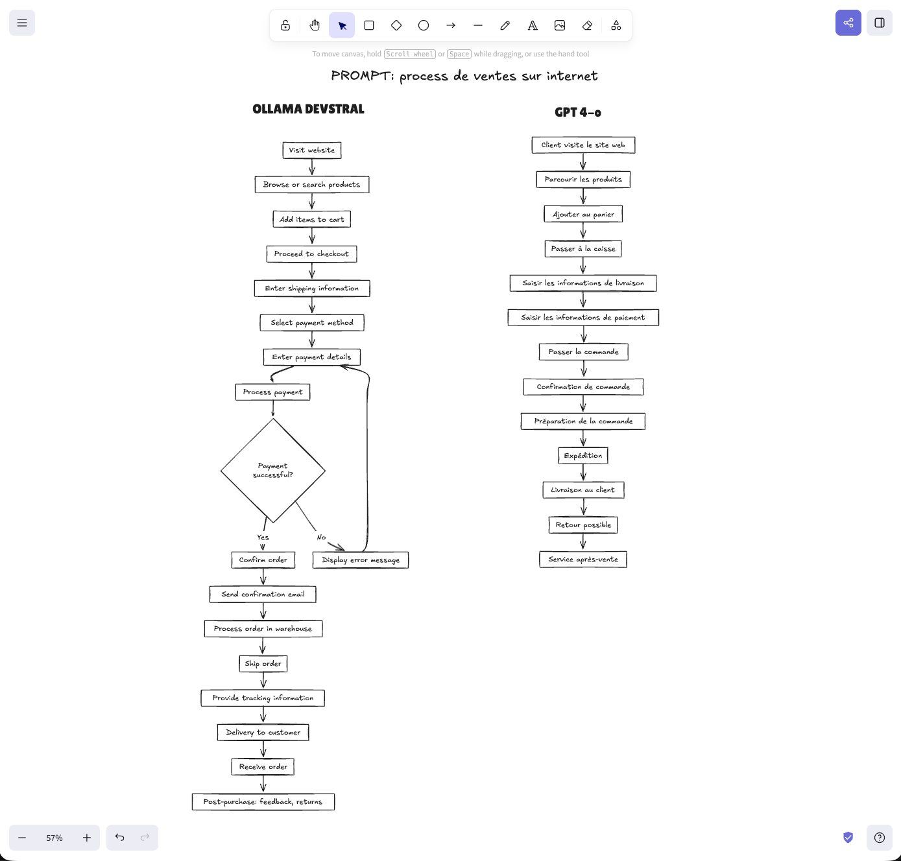
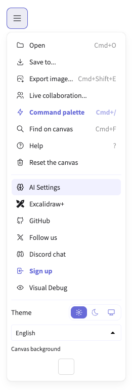
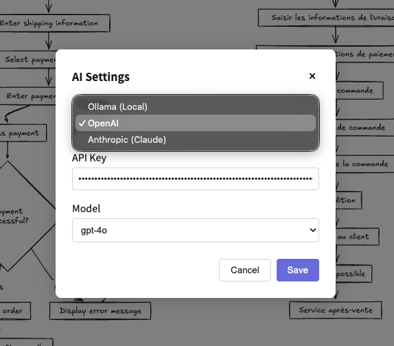

<div align="center">

```
    ███████╗██╗  ██╗ ██████╗ █████╗ ██╗     ██╗██████╗ ██████╗  █████╗ ██╗    ██╗
    ██╔════╝╚██╗██╔╝██╔════╝██╔══██╗██║     ██║██╔══██╗██╔══██╗██╔══██╗██║    ██║
    █████╗   ╚███╔╝ ██║     ███████║██║     ██║██║  ██║██████╔╝███████║██║ █╗ ██║
    ██╔══╝   ██╔██╗ ██║     ██╔══██║██║     ██║██║  ██║██╔══██╗██╔══██║██║███╗██║
    ███████╗██╔╝ ██╗╚██████╗██║  ██║███████╗██║██████╔╝██║  ██║██║  ██║╚███╔███╔╝
    ╚══════╝╚═╝  ╚═╝ ╚═════╝╚═╝  ╚═╝╚══════╝╚═╝╚═════╝ ╚═╝  ╚═╝╚═╝  ╚═╝ ╚══╝╚══╝
                 ██████╗ ██████╗  █████╗ ██╗██╗
                ██╔════╝ ██╔══██╗██╔══██╗██║██║
                ██║  ███╗██████╔╝███████║██║██║
                ██║   ██║██╔══██╗██╔══██║██║██║
                ╚██████╔╝██║  ██║██║  ██║██║███████╗
                 ╚═════╝ ╚═╝  ╚═╝╚═╝  ╚═╝╚═╝╚══════╝
```

  <p><strong>AI-Powered Whiteboard with Multi-LLM Support</strong></p>
  <p>OpenAI | Anthropic Claude | Ollama</p>
</div>

<br />

<div align="center">
  
  
  
</div>

<br />

<div align="center">
  
  <p><em>Text-to-Diagram: Same prompt, different models (Ollama Devstral vs GPT-4o)</em></p>
</div>

## What is ExcalidrawGrail?

ExcalidrawGrail is a fork of [Excalidraw](https://github.com/excalidraw/excalidraw) with **built-in AI support** for multiple LLM providers. No need for external proxies or backend services - configure your API keys directly in the app.

### Key Features

- **Multi-LLM Support** - Choose between OpenAI, Anthropic Claude, or Ollama
- **Text-to-Diagram** - Describe a diagram in natural language, get Mermaid output rendered as shapes
- **Diagram-to-Code** - Draw a wireframe, convert it to HTML/CSS with vision AI
- **Privacy-First** - Your API keys stay in your browser (localStorage)
- **Self-Hosted** - Run locally with Ollama, no external API calls required
- **Model Selection** - Pick any model available from your chosen provider

## Screenshots

<table>
  <tr>
    <td align="center">
      <br />
      <em>AI Settings in the menu</em>
    </td>
    <td align="center">
      <br />
      <em>Configure your provider and model</em>
    </td>
  </tr>
</table>

## Quick Start

```bash
git clone https://github.com/iamthemediagit/excalidrawgrail.git
cd excalidrawgrail
yarn install
yarn start
```

Open `http://localhost:5173` and click **Menu > AI Settings** to configure.

## AI Configuration

### Option 1: Ollama (Self-Hosted, Free)

1. Install [Ollama](https://ollama.ai)
2. Pull a model: `ollama pull llama3.2`
3. For vision features: `ollama pull llava`
4. In ExcalidrawGrail: Menu > AI Settings > Select "Ollama"
5. Models are fetched automatically from your local Ollama instance

### Option 2: OpenAI

1. Get an API key from [OpenAI Platform](https://platform.openai.com)
2. Menu > AI Settings > Select "OpenAI"
3. Enter your API key
4. Recommended models: `gpt-4o` (vision), `gpt-4o-mini` (fast)

### Option 3: Anthropic Claude

1. Get an API key from [Anthropic Console](https://console.anthropic.com)
2. Menu > AI Settings > Select "Anthropic"
3. Enter your API key
4. Recommended: `claude-sonnet-4-20250514`

## Usage

### Text-to-Diagram

1. Press `Shift + A` or click the AI wand icon
2. Describe your diagram: *"A flowchart showing user authentication flow"*
3. AI generates Mermaid code, rendered as Excalidraw shapes

### Diagram-to-Code

1. Draw a wireframe inside a frame
2. Click "Generate code" on the frame
3. AI analyzes the drawing and generates HTML/CSS

## Development

```bash
yarn test:typecheck  # TypeScript checks
yarn test:update     # Run tests
yarn fix             # Auto-fix linting
yarn build-node      # Build packages
```

## Architecture

```
excalidraw-app/
├── components/
│   ├── AI.tsx              # Multi-provider AI logic
│   ├── AISettingsDialog.tsx # Settings UI
│   └── AppMainMenu.tsx     # Menu with AI Settings
packages/
├── excalidraw/             # Core editor
├── common/                 # Shared constants
└── ...
```

## Credits

Based on [Excalidraw](https://excalidraw.com) - the amazing open-source whiteboard.

## License

MIT
