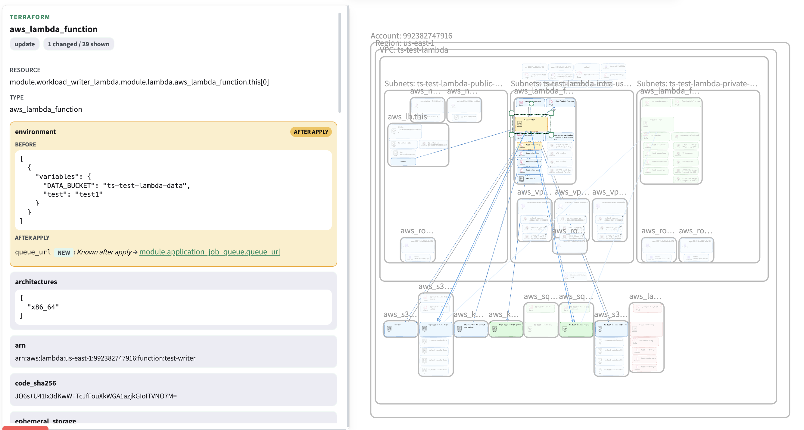

# tfdraw.dev

**A browser-only Terraform plan visualizer that turns plan output into an editable Excalidraw architecture canvas.**

Import Terraform/OpenTofu plan JSON and graph DOT files, review the generated infrastructure diagram, then edit, annotate, and export it like any other Excalidraw scene. Optionally add a [`.tfd` declared dataflow file](#declared-dataflow-tfd) to draw explicit app-level arrows on a separate layer. The app does not ask for cloud credentials, upload your files to a backend, or run Terraform for you.

<p align="center">
  <a href="https://github.com/TusharSariya/excalidraw-tf/blob/master/LICENSE">
    
  </a>
  <a href="https://github.com/TusharSariya/excalidraw-tf/actions/workflows/ci.yml">
    
  </a>
  
  <a href="https://master-ainur.tushar-sariya77.workers.dev/demo">
    
  </a>
</p>

<p align="center">
  <a href="https://master-ainur.tushar-sariya77.workers.dev/demo">Open live demo</a>
  |
  <a href="https://github.com/TusharSariya/excalidraw-tf">GitHub repository</a>
</p>



## How it works

1. You run Terraform or OpenTofu locally and export **plan JSON** (`terraform show -json`) and **graph DOT** (`terraform graph -type=plan`) from the same working directory.
2. You open the [hosted demo](https://master-ainur.tushar-sariya77.workers.dev/demo) or a local dev build and choose **Import Terraform** (`Ctrl/Cmd+Shift+K`).
3. The browser parses those files into Excalidraw elements: resource cards, dependency edges, module frames, and cloud hierarchy (account, region, VPC, subnets).
4. Optionally you attach a **`.tfd`** file to add **declared dataflow** arrows (blue) in a fixed order; IAM-inferred **data flow** (grey) still comes from the plan.
5. You edit, save locally, or export the scene like any other Excalidraw drawing.

## Quick start

**Hosted app:** [https://master-ainur.tushar-sariya77.workers.dev/demo](https://master-ainur.tushar-sariya77.workers.dev/demo)

**Local dev** (Node.js 22+, see [`.nvmrc`](./.nvmrc)):

```bash
yarn install
yarn start
```

Open the Vite URL (usually `http://localhost:3000/`), then **Import Terraform** from the menu or `Ctrl/Cmd+Shift+K`.

## Import Terraform plans

Generate exports from one Terraform or OpenTofu working directory, then import them together.

### 1. Generate plan JSON

```bash
# Terraform
terraform plan -out=tfplan
terraform show -json tfplan > plan.json

# OpenTofu
tofu plan -out=tfplan
tofu show -json tfplan > plan.json
```

### 2. Generate graph DOT

```bash
# Terraform
terraform graph -type=plan > graph.dot

# OpenTofu
tofu graph -type=plan > graph.dot
```

### 3. (Optional) Export raw state

```bash
# Terraform
terraform state pull > state.json

# OpenTofu
tofu state pull > state.json
```

State must be raw JSON with a top-level `resources` array (same shape as `terraform state pull`). Use it with plan+dot to enrich existing resources, or alone for a current-infrastructure snapshot (no plan diffs).

### 4. Import in the app

Open **Import Terraform** and pick a mode:

| Mode | What to upload |
| --- | --- |
| Plan + graph | One or more plan JSON + graph DOT pairs (one pair per stack/root) |
| Plan + graph + state | Plan pairs plus optional state file(s) to enrich nodes |
| Plan + graph + `.tfd` | Plan pairs plus optional [declared dataflow](#declared-dataflow-tfd) file(s) |
| State only | One or more raw state JSON files (semantic topology or module graph) |

| File | Source |
| --- | --- |
| Plan | `terraform show -json <planfile>` or `tofu show -json <planfile>` |
| Graph | `terraform graph -type=plan` or `tofu graph -type=plan` |
| State | `terraform state pull` or a `.tfstate` file |
| Dataflow links | Hand-authored `.tfd` text (optional; multiple files merged in upload order) |

### Multiple stacks

Use **Add plan + graph** in the import dialog for each Terraform or OpenTofu working directory (up to 10 bundles). Optionally add multiple state files and multiple `.tfd` overlays in one import.

If the same resource address appears in more than one file, the **last file wins** and a non-blocking warning is shown after import. Cross-stack diagrams work best when module paths do not collide.

### Sample fixtures

Example import bundles live under [`packages/backend/terraform/`](./packages/backend/terraform/) (`allplanmodules.json` / `.dot` / `.tfd`, staging `plan.json` + `graph.dot` per stack, etc.). Those files are **gitignored**; hydrate them locally with `yarn seed:terraform-presets` (see dev presets below) or generate plans from your own Terraform roots.

For state-only tests locally, generate `terraform_allplanmodules.tfstate` in that directory (also gitignored).

### Dev import presets (SQLite)

Local dev (`yarn start`) loads Terraform import **presets** from `terraform-import-presets.db` at the repo root (gitignored). The catalog is [`packages/backend/terraform/import-presets.catalog.json`](./packages/backend/terraform/import-presets.catalog.json) (staging multi-state, allplanmodules, cloudflare, add/del/new plans, AWS+Cloudflare combo, etc.).

After adding or updating plan/dot/state files under `packages/backend/terraform/`, re-seed the database:

```bash
yarn seed:terraform-presets
```

Copy `terraform-import-presets.db` to share presets with another machine. In the import dialog, use **Use preset manifest** or **Sync from disk** on a single preset; `POST /api/terraform-import-presets/seed-all` re-hydrates every built-in preset without restarting the dev server.

## Declared dataflow (`.tfd`)

A **`.tfd`** file is an optional overlay for **declared dataflow** — blue arrows on the **Declared data flow** layer in the Terraform layers menu. It does not replace plan JSON or graph DOT. Grey **Data flow** edges still come from IAM semantics in the plan.

Use it to document app-level flows in a fixed order (for example writer → S3 → SQS) without listing IAM actions in the file.

### Find addresses in your plan

Every `bind` line must use a **full Terraform resource address** from the plan you import (`resource_changes[].address`):

```bash
jq -r '.resource_changes[] | select(.mode == "managed") | .address' plan.json | sort
```

### Syntax

| Line | Meaning |
| --- | --- |
| `# …` | Comment |
| `bind alias = <full address>` | Short name for an exact plan address |
| `alias -> other` | Directed edge (`other` = alias or full address) |

**Order matters:** edges are drawn in file order.

### Example ([`allplanmodules.tfd`](./packages/backend/terraform/allplanmodules.tfd))

```tfd
bind writer = module.workload_writer_lambda.module.lambda.aws_lambda_function.this[0]
bind reader = module.workload_reader_lambda.module.lambda.aws_lambda_function.this[0]
bind bucket = module.application_data_bucket.module.bucket.aws_s3_bucket.this[0]
bind queue  = module.application_job_queue.module.queue.aws_sqs_queue.this[0]

writer -> bucket
writer -> queue
queue -> reader
bucket -> reader
```

### Import

Upload plan JSON + graph DOT, then attach the `.tfd` under **Dataflow links (.tfd)**. **Declared data flow** is enabled automatically when you provide a links file; toggle layers under **Terraform layers** in the menu.

## What you see on the canvas

- **AWS-style resource cards** for common services (IAM, Lambda, S3, SQS, VPC, CloudWatch, and more).
- **Dependency arrows** from Terraform graph relationships (toggle: **Dependency** layer).
- **Data flow** (grey) from IAM policy semantics in the plan.
- **Declared data flow** (blue) from an optional `.tfd` file.
- **Networking** edges for security-group peers where inferred.
- **Semantic boundaries** for account, region, VPC, and subnets (semantic view), with **provider boxes** (AWS, Cloudflare, GCP, Azure) for multi-cloud imports.
- **Module-aware layout** in module view.
- **Terraform metadata** on elements: diffs, known-after-apply hints, and selected fields.

Everything remains editable Excalidraw content.

## Views

| View | Best for |
| --- | --- |
| **Semantic** | AWS account / region / VPC / subnet topology plus sibling provider boxes for Cloudflare, GCP, and Azure. Plan+dot shows planned changes; state-only shows what is deployed now. |
| **Module** | Terraform module structure and nested resources. |

Production builds use a Terraform Canvas landing page with an embedded editor; dev mode opens the editor directly.

## Safety

- No AWS, Terraform Cloud, or other cloud credentials in the app.
- No `terraform` / `tofu` execution in the browser.
- Plan JSON and DOT are parsed locally; **Terraform files are not uploaded** for import.
- Optional email signup and **anonymous import success/fail counters** on the hosted app only (see [docs/privacy.md](./docs/privacy.md)).

Treat plan JSON as sensitive (names, ARNs, tags, sometimes secrets). Review before sharing diagrams or scenes.

## Limitations

- Plan-based import requires **plan JSON and graph DOT together**.
- `.tfd` is optional; it does not replace plan+dot.
- State-only semantic view has no create/update/delete diffs from a plan.
- Semantic view places AWS resources in account topology and other cloud providers in labeled provider boxes (Cloudflare groups by account, zone, Pages, and Workers).
- Strongest AWS semantic detail today; GCP/Azure use account/project grids until richer topology is added.
- Public mode hides collaboration, share links, Firebase share load, and some export/promo controls.

## FAQ

### Does tfdraw.dev need my AWS account?

No. Generate Terraform/OpenTofu outputs locally and import the files.

### Does the app apply changes?

No. It only visualizes files you provide.

### Can I edit the diagram after import?

Yes. Resources, labels, arrows, and containers are normal Excalidraw elements.

### Can I use OpenTofu?

Yes, with compatible `tofu show -json` and `tofu graph` output.

### Where does parsing run?

In the browser ([`terraformPlanParsing.tsx`](./packages/excalidraw/components/terraformPlanParsing.tsx)). [`packages/backend/`](./packages/backend/) holds sample Terraform and fixture tooling, not a required upload API.

## Development

```bash
yarn install
yarn start          # local app
yarn test           # Vitest (watch)
yarn test --watch=false
yarn test:typecheck
yarn test:code      # ESLint
yarn test:other     # Prettier
yarn test:prepush   # mirrors CI before push
yarn build:packages
yarn build:app
```

Parser tests: [`terraformPlanParsing.test.ts`](./packages/excalidraw/components/terraformPlanParsing.test.ts) using [`packages/backend/terraform/allplanmodules.*`](./packages/backend/terraform/).

### Fixture corpus (maintainers)

For regression testing, the repo can generate **100 real plan exports** from the sample stack in [`packages/backend/terraform/`](./packages/backend/terraform/). See [`packages/backend/README.md`](./packages/backend/README.md) for bootstrap, `yarn fixtures:*` commands, AWS prerequisites, and corpus debugging.

### Hosted telemetry (maintainers)

Pages Functions under [`functions/`](./functions/) provide `/api/subscribe` and `/api/event`. Setup: [docs/telemetry-setup.md](./docs/telemetry-setup.md).

## Deployment

Build the static public app:

```bash
yarn build:pages
```

Output: `excalidraw-app/build`. Optional tarball: `yarn bundle:whiteboard` → `releases/tfdraw-whiteboard-<version>-<sha>.tar.gz`.

### Cloudflare Pages

[`pages-deploy.yml`](./.github/workflows/pages-deploy.yml) deploys on pushes to `master` (or manual dispatch) with `yarn build:pages` and Wrangler.

| Kind     | Name                                                      |
| -------- | --------------------------------------------------------- |
| Secret   | `CLOUDFLARE_API_TOKEN`                                    |
| Secret   | `CLOUDFLARE_ACCOUNT_ID`                                   |
| Variable | `CF_PAGES_PROJECT_NAME` (optional; skips deploy if unset) |

Manual deploy after a local build (from repo root):

```bash
yarn deploy:pages -- --project-name=YOUR_PAGES_PROJECT_NAME
# or:
npx wrangler@4 pages deploy ./excalidraw-app/build --project-name=YOUR_PAGES_PROJECT_NAME
```

Use **`wrangler pages deploy`**, not `wrangler deploy`. [`wrangler.jsonc`](./wrangler.jsonc) is Pages-only (no `assets`); Workers static previews use [`wrangler.workers.jsonc`](./wrangler.workers.jsonc).

**Workers `*.workers.dev` previews do not run `/api/subscribe`** — use a **Pages** URL from GitHub Actions. Setup: [docs/cloudflare-deploy.md](./docs/cloudflare-deploy.md).

## Upstream Excalidraw

Built on [Excalidraw](https://github.com/excalidraw/excalidraw). This fork adds Terraform import and graph-to-canvas layout on top of the standard editor, tools, and export behavior.

- [Excalidraw](https://excalidraw.com) · [Docs](https://docs.excalidraw.com) · [MIT license](https://github.com/excalidraw/excalidraw/blob/master/LICENSE)

## License

MIT. See [`LICENSE`](./LICENSE).
