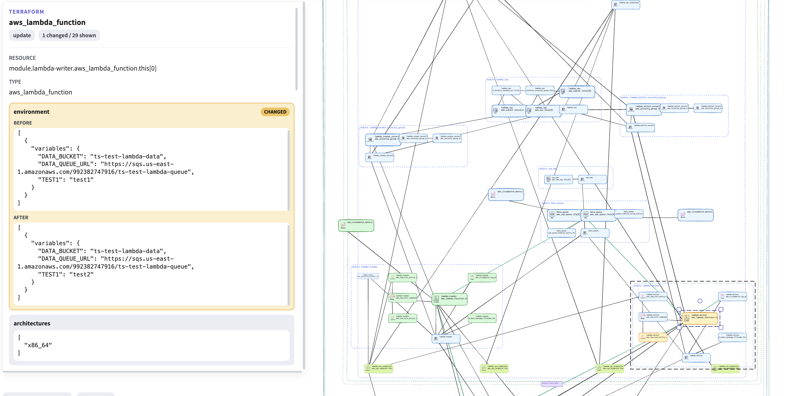

# Excalidraw Terraform

A **Terraform architecture visualizer**, originally built on [Excalidraw](https://excalidraw.com) and now with an experimental [tldraw](https://tldraw.dev) frontend as well.

Upload a Terraform plan JSON, graph DOT, and optionally `terraform.tfstate`; the backend enriches the graph and serves it through any registered frontend connector — today that's a fully-featured Excalidraw scene (AWS service icons, dependency arrows, module boxes, account/region/VPC/subnet boundaries) and a first-pass tldraw renderer.



<p align="center">
  <a href="https://github.com/excalidraw/excalidraw/blob/master/LICENSE">
    
  </a>
</p>

---

## What this fork adds

- **Terraform plan + graph import** — Upload plan JSON from `terraform show -json` and DOT from `terraform graph`; the backend builds resource nodes and dependency edges.
- **Optional state enrichment** — Upload `terraform.tfstate` to merge real deployed attributes, existing dependencies, ARNs, regions, accounts, VPC IDs, and subnet IDs into the rendered graph.
- **AWS architecture icons** — Resource cards use the bundled AWS architecture icon library, including IAM, Lambda, S3, SQS, RDS, VPC, CloudWatch, and many other services.
- **Module-aware layout** — Terraform modules are placed as layout units so sibling modules have space and module internals stay readable.
- **Nested infrastructure boundaries** — Account, region, VPC, subnet, and module containers are rendered with staggered padding so the ownership/context hierarchy is visible.
- **Lambda module preset** — Common Lambda module internals such as function, role, inline policies, log group, and package resources get stable relative placement.
- **Relationship rendering** — Planned dependencies and state-derived dependencies are drawn as arrows behind the resource cards.
- **Terraform details panel data** — Resource diffs, known-after-apply values, and selected state/config fields are stored on the Excalidraw elements for inspection.
- **Pluggable frontend connectors** — The backend exposes `GET /terraform/upload/:id/render/:renderer`. Today `:renderer` can be `excalidraw` (stable) or `tldraw` (beta); new frontends plug in via `packages/backend/connectors/`. A renderer-neutral `DiagramIR` is built once per request so future connectors don't need to re-derive node/edge/group structure.
- **Sibling tldraw app** — `tldraw-app/` mounts backend-rendered tldraw documents on a [tldraw](https://tldraw.dev) canvas via the `render/tldraw` connector route.

The rest is standard Excalidraw: hand-drawn style, zoom/pan, export to PNG/SVG, and the usual editor tools.

---

## Quick start

**Run the Excalidraw frontend + backend:**

```bash
yarn install
yarn start           # Excalidraw app (Vite dev server)
# In another terminal:
yarn start:backend   # Backend on http://localhost:3000
```

**Or try the experimental tldraw frontend:**

```bash
yarn install
yarn start:backend   # one terminal — :3000
yarn start:tldraw    # another terminal — :3001
```

The tldraw app talks to the same backend (`VITE_TERRAFORM_BACKEND_URL`, defaults to `http://localhost:3000`) and converts the Excalidraw scene to tldraw shapes client-side. See [`tldraw-app/README.md`](./tldraw-app/README.md) for details and known limitations of the first-pass converter.

Then use the **Terraform Import** flow in the app to upload:

1. **Plan file** — JSON from `terraform show -json <planfile>` (or your plan output saved as JSON).
2. **Graph file** — DOT output (e.g. from `terraform graph` or your plan’s graph representation).
3. **State file, optional** — `terraform.tfstate` for deployed-resource enrichment and existing dependency discovery.

The backend stores the upload, generates the enriched graph, and returns an Excalidraw scene that the app inserts into the canvas.

Import shortcut: `Ctrl/Cmd + Shift + K`.

---

## Generating Terraform Inputs

To import your infrastructure, you need to generate a plan JSON and a graph DOT file from your Terraform or OpenTofu project.

### 1. Generate Plan JSON
This provides the resource details, diffs, and attributes.
```bash
# Terraform
terraform plan -out=tfplan
terraform show -json tfplan > plan.json

# OpenTofu
tofu plan -out=tfplan
tofu show -json tfplan > plan.json
```

### 2. Generate Graph DOT
This provides the dependency relationship data.
```bash
# Terraform
terraform graph -type=plan > graph.dot

# OpenTofu
tofu graph -type=plan > graph.dot
```

### 3. State File (Optional)
You can also upload your `terraform.tfstate` file to enrich the diagram with real ARNs, VPC IDs, and existing resource attributes.

---

## Development

### Tests

Vitest runs from the **repository root** (`vitest.config.mts`, `jsdom`).

```bash
yarn test                         # watch mode (default)
yarn test --watch=false           # single run (CI-style)
yarn test:update                  # all Vitest tests + snapshot updates, no watch
```

Run a **subset** of tests by passing a filename fragment Vitest treats as a filter:

```bash
yarn test terraformPlanParsing.test --watch=false
```

That executes the **local Terraform plan parser** pipeline test ([`packages/excalidraw/components/terraformPlanParsing.test.ts`](./packages/excalidraw/components/terraformPlanParsing.test.ts)): it loads [`packages/backend/terraform/allplanmodules.json`](./packages/backend/terraform/allplanmodules.json) and [`packages/backend/terraform/allplanmodules.dot`](./packages/backend/terraform/allplanmodules.dot), runs `terraformPlanParsing`, and asserts the HTTP-style response and empty Excalidraw scene shape.

Additional suites:

- **Backend:** `yarn test:backend`
- **tldraw-app** (includes an allplanmodules-related smoke): `yarn test:tldraw`

### Other commands

- **Type checking:** `yarn test:typecheck`
- **Lint / format:** `yarn fix`
- **Build packages:** `yarn build:packages`
- **Build app:** `yarn build:app`
- **Build tldraw app:** `yarn build:tldraw`

See the main [Excalidraw documentation](https://docs.excalidraw.com) and [development guide](https://docs.excalidraw.com/docs/introduction/development) for the core editor.

---

## Upstream Excalidraw

This repo is built on [Excalidraw](https://github.com/excalidraw/excalidraw): an open-source, collaborative whiteboard with a hand-drawn look. We keep the existing Excalidraw features (canvas, tools, export, etc.) and add the Terraform import pipeline and graph-to-canvas flow on top.

- [Excalidraw](https://excalidraw.com) · [Docs](https://docs.excalidraw.com) · [License (MIT)](https://github.com/excalidraw/excalidraw/blob/master/LICENSE)
