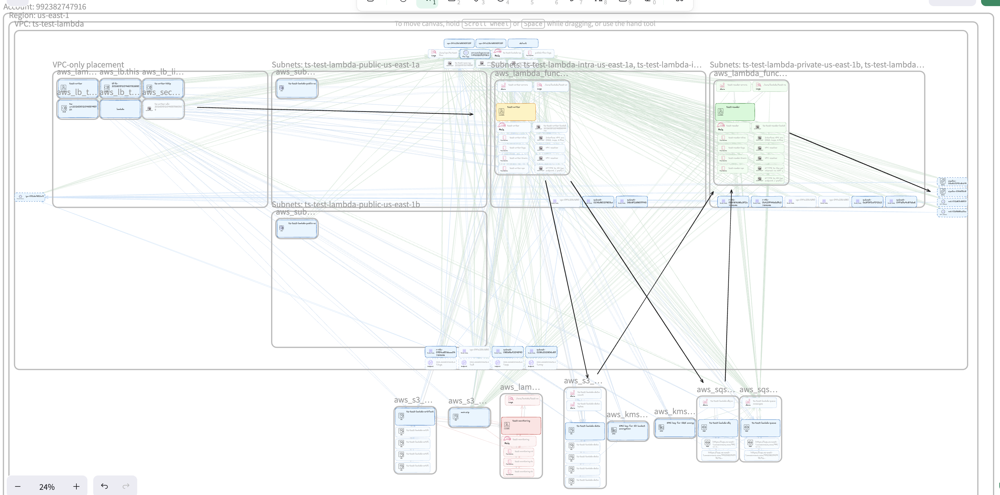

# tfdraw.dev

**A browser-only Terraform plan visualizer that turns plan output into an editable Excalidraw architecture canvas.**

Import Terraform/OpenTofu plan JSON and graph DOT files, review the generated infrastructure diagram, then edit, annotate, and export it like any other Excalidraw scene. The app does not ask for cloud credentials, upload your files to a backend, or run Terraform for you.

<p align="center">
  <a href="https://github.com/TusharSariya/excalidraw-tf/blob/master/LICENSE">
    
  </a>
  <a href="https://github.com/TusharSariya/excalidraw-tf/actions/workflows/lint.yml">
    
  </a>
  <a href="https://github.com/TusharSariya/excalidraw-tf/actions/workflows/test.yml">
    
  </a>
  
  <a href="https://master-ainur.tushar-sariya77.workers.dev/demo">
    
  </a>
</p>

<p align="center">
  <a href="https://master-ainur.tushar-sariya77.workers.dev/demo">Open live demo</a>
  |
  <a href="https://github.com/TusharSariya/excalidraw-tf">GitHub repository</a>
</p>



## What is tfdraw.dev?

tfdraw.dev is a Terraform architecture canvas built on [Excalidraw](https://excalidraw.com). It reads the files you already generate during a Terraform review:

- plan JSON from `terraform show -json`
- dependency graph DOT from `terraform graph`

Those files are parsed in the browser and converted into Excalidraw elements: resource cards, dependency arrows, module boundaries, cloud hierarchy containers, and Terraform metadata attached to elements for inspection.

The result is not a static screenshot. It is a normal Excalidraw scene you can rearrange, annotate, save locally, and export.

## Why use it?

- **Review planned changes visually.** Turn plan output into a diagram before applying infrastructure changes.
- **Keep the workflow local.** Import files directly in the browser; no app-side Terraform execution, cloud credentials, or backend upload service.
- **Edit the diagram after import.** Move resources, add notes, group systems, and export PNG/SVG using the familiar Excalidraw editor.
- **Understand relationships faster.** Dependency edges, module containers, account/region/VPC/subnet boundaries, and AWS-style cards make large plans easier to scan.
- **Use it with Terraform or OpenTofu.** The importer consumes standard JSON and DOT outputs rather than provider credentials.

## How it works

1. You run Terraform or OpenTofu locally to create a plan and graph.
2. You open the [hosted demo](https://master-ainur.tushar-sariya77.workers.dev/demo) or the local development app.
3. You select the plan JSON and graph DOT together in the **Import Terraform** dialog.
4. The browser parser builds an Excalidraw scene and replaces the current canvas.
5. You inspect, edit, save, or export the diagram locally.

The client-side import pipeline lives in [`packages/excalidraw/components/terraformPlanParsing.tsx`](./packages/excalidraw/components/terraformPlanParsing.tsx). [`packages/backend/`](./packages/backend/) currently holds fixtures and legacy reference scripts used for parity with the client pipeline; it is not required as an upload service for normal browser import.

## Quick start

Use the hosted app:

```text
https://master-ainur.tushar-sariya77.workers.dev/demo
```

Or run the project locally with **Node.js 22 or newer**. If you use `nvm`, the repo includes [`.nvmrc`](./.nvmrc).

```bash
yarn install
yarn start
```

Open the Vite URL printed by the command, usually `http://localhost:3000/`. In development, `/` opens directly into the Excalidraw editor for faster local work. Use **Import Terraform** from the menu or press **Ctrl/Cmd+Shift+K**.

## Import Terraform plan output

Generate both files from the same Terraform or OpenTofu working directory and select them together in the import dialog.

### 1. Generate plan JSON

```bash
# Terraform
terraform plan -out=tfplan
terraform show -json tfplan > plan.json

# OpenTofu
tofu plan -out=tfplan
tofu show -json tfplan > plan.json
```

### 2. Generate graph DOT

```bash
# Terraform
terraform graph -type=plan > graph.dot

# OpenTofu
tofu graph -type=plan > graph.dot
```

### 3. (Optional) Export raw state

```bash
# Terraform
terraform state pull > state.json

# OpenTofu
tofu state pull > state.json
```

You can also use a local `.tfstate` file. The importer expects raw state JSON with a top-level `resources` array (same shape as `terraform state pull`).

### 4. Import files

In the hosted app, open **Import Terraform** and choose one of:

| Mode | Files |
| --- | --- |
| Plan + graph (semantic or module view) | Plan JSON + graph DOT together |
| Plan + graph + state | Plan JSON + graph DOT + optional state (enriches existing resources) |
| State only | Raw state JSON alone (semantic topology or module / ELK graph) |

| File | Expected input |
| --- | --- |
| Plan file | JSON from `terraform show -json <planfile>` or `tofu show -json <planfile>` |
| Graph file | DOT from `terraform graph -type=plan` or `tofu graph -type=plan` |
| State file | Raw state from `terraform state pull` or a `.tfstate` file |

Try the included fixtures if you want a known-good pair: [`packages/backend/terraform/allplanmodules.json`](./packages/backend/terraform/allplanmodules.json) and [`packages/backend/terraform/allplanmodules.dot`](./packages/backend/terraform/allplanmodules.dot). For state-only or plan+state tests locally, generate `terraform_allplanmodules.tfstate` in that directory (gitignored).

## What you get on the canvas

- **AWS-style resource cards** for common services such as IAM, Lambda, S3, SQS, RDS, VPC, CloudWatch, and more.
- **Dependency arrows** rendered behind resource cards from Terraform graph relationships.
- **Semantic cloud boundaries** for account, region, VPC, subnet, and related topology.
- **Module-aware layout** so sibling modules get space and module internals stay readable.
- **Nested infrastructure containers** with staggered padding to make hierarchy visible.
- **Lambda module placement presets** for common Lambda internals such as functions, roles, inline policies, log groups, and packages.
- **Terraform details on elements**, including diffs, known-after-apply values, and selected fields.

Everything remains editable because the output is an Excalidraw scene.

## Safety model

tfdraw.dev is designed as a local-file review tool:

- The app does not request AWS, Terraform Cloud, or other cloud credentials.
- The app does not run `terraform`, `tofu`, provider plugins, or shell commands.
- Plan JSON and graph DOT are read by browser code during import.
- The normal workflow does not require uploading plans to a tfdraw backend.
- Excalidraw scenes can be saved to disk and exported from the browser.

You should still treat Terraform plan JSON as sensitive. It can contain resource names, ARNs, tags, environment data, outputs, and sometimes secrets if your configuration exposes them. Review what is in the generated files before sharing diagrams or imported scenes.

## Supported views

The import dialog supports two diagram modes:

- **Semantic view**: emphasizes account, region, VPC, subnet, and infrastructure topology. Works with plan JSON + graph DOT (planned changes) or state alone (current infrastructure snapshot).
- **Module view**: frames the graph around Terraform module structure.

Production/static builds open on a Terraform Canvas landing page with an embedded editor. Development mode opens the standard editor directly. In public mode, drawing, local persistence, load/save from disk, image export, and Terraform import remain available.

## Current limitations

- Terraform plan JSON and graph DOT must be selected together when using plan-based import.
- State-only semantic view shows deployed resources only (no create/update/delete diffs from a plan).
- The importer is strongest on AWS-shaped infrastructure today; other providers may render with generic cards or less semantic grouping.
- Public mode intentionally hides collaboration, share-link creation, Firebase-backed share loading, Excalidraw+ promotion/cloud export controls, and backend export actions.
- The special `/excalidraw-plus-export` route is preserved for the existing Excalidraw+ iframe export behavior.

## FAQ

### Does tfdraw.dev need access to my AWS account?

No. You generate Terraform/OpenTofu outputs locally and import those files in the browser.

### Does the app apply or modify infrastructure?

No. It does not run Terraform/OpenTofu and cannot apply changes. It visualizes files you provide.

### Is this a replacement for Terraform plan review?

No. It is a visual companion for review. Keep reading the plan, policy checks, CI output, and provider-specific details.

### Can I edit the imported diagram?

Yes. Imported resources, labels, arrows, and containers are regular Excalidraw elements.

### Can I use OpenTofu?

Yes, as long as you provide compatible JSON from `tofu show -json` and DOT from `tofu graph`.

### Is there a backend parser?

The active import flow is client-side. The backend package contains fixtures and legacy reference scripts used to compare behavior with the browser parser.

## Contributing / development

Install dependencies and run the app:

```bash
yarn install
yarn start
```

Useful commands:

| Command | Purpose |
| --- | --- |
| `yarn test` | Run Vitest in watch mode |
| `yarn test --watch=false` | Run Vitest once |
| `yarn test terraformPlanParsing.test --watch=false` | Run the Terraform plan parser test subset |
| `yarn test:typecheck` | Run TypeScript checks |
| `yarn test:code` | Run ESLint |
| `yarn test:other` | Run Prettier checks |
| `yarn test:update` | Run Vitest once and update snapshots |
| `yarn build:packages` | Build workspace packages |
| `yarn build:app` | Build the app |
| `yarn build:preview` | Preview the static app |

The parser test lives at [`packages/excalidraw/components/terraformPlanParsing.test.ts`](./packages/excalidraw/components/terraformPlanParsing.test.ts) and uses the fixture pair in [`packages/backend/terraform/`](./packages/backend/terraform/).

Core editor development still follows the upstream [Excalidraw documentation](https://docs.excalidraw.com) and [development guide](https://docs.excalidraw.com/docs/introduction/development).

## Deployment notes

Build the static public app:

```bash
yarn build:pages
```

The output is written to `excalidraw-app/build`. The `build:pages` script uses CI-friendly Vite settings: Sentry and product analytics are disabled, production source maps are omitted unless `VITE_PROD_SOURCEMAP=true` is set, and `vite-plugin-checker` is skipped during the Vite build. Typecheck and lint remain available through `yarn test:typecheck` and `yarn test:code`.

Create a static bundle tarball:

```bash
yarn bundle:whiteboard
```

That runs `yarn build:pages` and writes `releases/tfdraw-whiteboard-<appVersion>-<gitShortSha>.tar.gz` from `excalidraw-app/build/`. Use `yarn bundle:whiteboard:archive` if the build already exists. Pass options after `--`, for example `yarn bundle:whiteboard -- --profile=full`, `--out=dist`, or `--name=my-board`.

### Cloudflare Pages

[`pages-deploy.yml`](./.github/workflows/pages-deploy.yml) builds and deploys to Cloudflare Pages when a commit lands on `master`, or when the workflow is run manually. It runs:

```bash
yarn install --frozen-lockfile
yarn build:pages
npx wrangler@4 pages deploy excalidraw-app/build --project-name="$CF_PAGES_PROJECT_NAME"
```

Configure GitHub Actions with:

| Kind | Name | Purpose |
| --- | --- | --- |
| Secret | `CLOUDFLARE_API_TOKEN` | API token with Cloudflare Pages edit access |
| Secret | `CLOUDFLARE_ACCOUNT_ID` | Cloudflare account ID |
| Variable | `CF_PAGES_PROJECT_NAME` | Cloudflare Pages project name; if unset, CI builds and skips deploy |

For manual upload after `yarn build:pages`:

```bash
npx wrangler@4 pages deploy excalidraw-app/build --project-name=YOUR_PAGES_PROJECT_NAME
```

Use `wrangler pages deploy` for Cloudflare Pages. `wrangler deploy` targets Workers with static assets and different configuration semantics.

[`wrangler.jsonc`](./wrangler.jsonc) sets `pages_build_output_dir` to `./excalidraw-app/build` for Pages deploys and includes an `assets` block for Workers/static-assets SPA routing. The file does not run the Vite build by itself; CI or your local build must create `excalidraw-app/build` first.

If the Cloudflare Pages project is still Git-connected, disable Cloudflare automatic Git builds after GitHub Actions deploy is wired. Otherwise pushes may start a separate Cloudflare builder run in addition to the direct Wrangler upload.

## Upstream Excalidraw

This repository is built on [Excalidraw](https://github.com/excalidraw/excalidraw), the open-source whiteboard with a hand-drawn look. tfdraw.dev keeps the canvas, tools, local scene loading/saving, export behavior, and editor ergonomics, then adds the Terraform import pipeline and graph-to-canvas flow on top.

- [Excalidraw](https://excalidraw.com)
- [Excalidraw documentation](https://docs.excalidraw.com)
- [Upstream MIT license](https://github.com/excalidraw/excalidraw/blob/master/LICENSE)

## License

MIT. See [`LICENSE`](./LICENSE).
