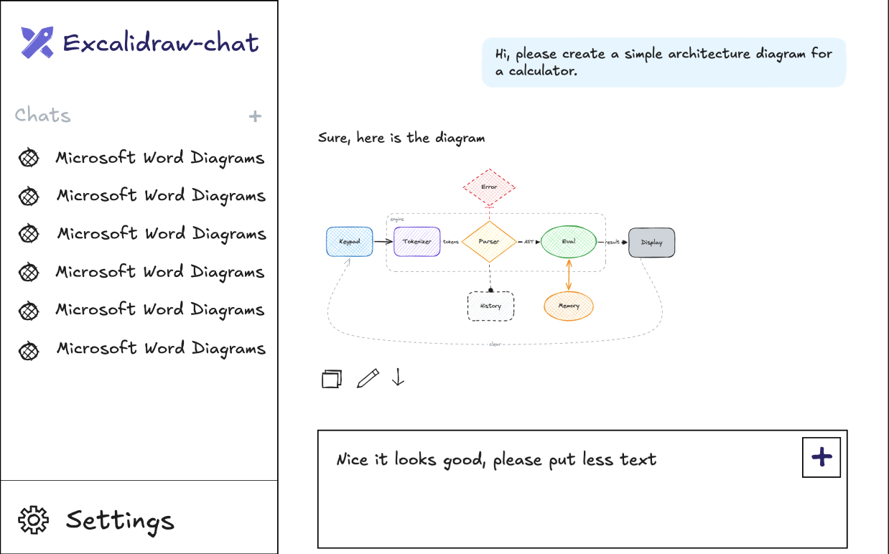
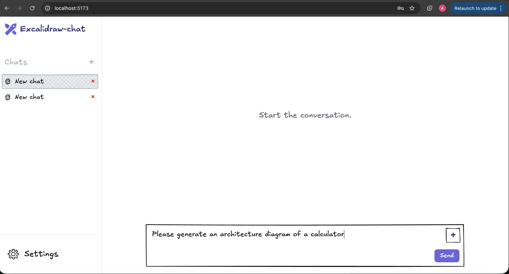
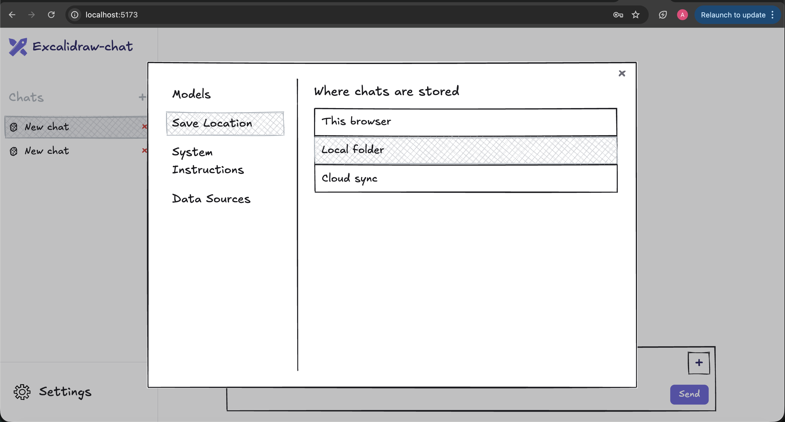

# Just a general idea of what this will look like:

This is the figma screen. We essentially want a harness that can generate accurate Excalidraw diagrams and allow users to edit them on Excalidraw.

We are almost done with the frontend, this is what the frontend looks rendered:

Currently designing the harness, stay tuned :)