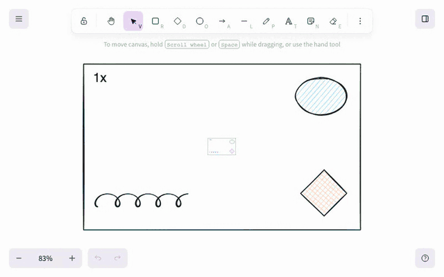
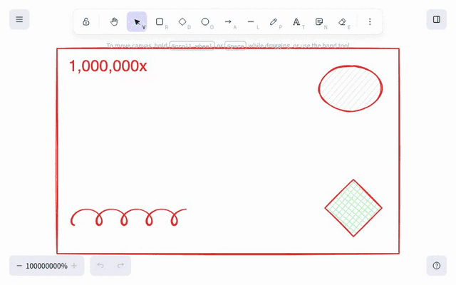
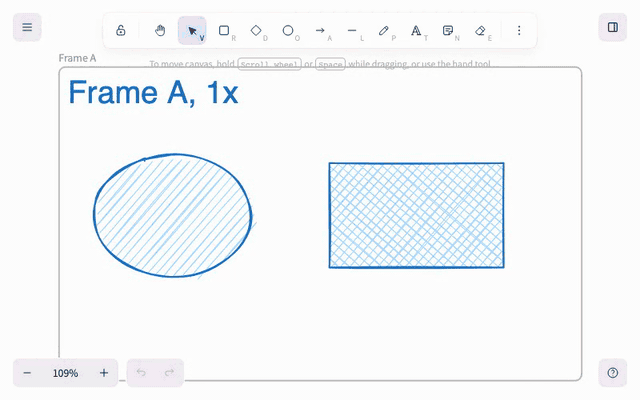
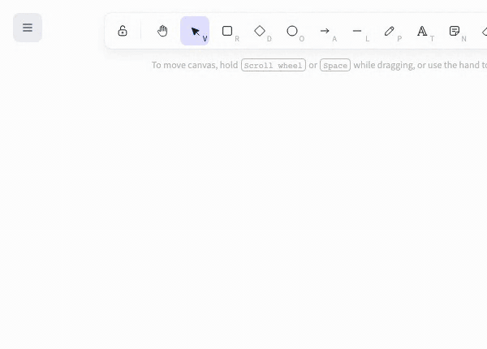

# redaphid/excalidraw

This is a fork of [Excalidraw](https://github.com/excalidraw/excalidraw) for [draw](https://draw.hypnodroid.com), a pen-first whiteboard that zooms far past upstream's 30x. It is upstream `master` at [`5a406e518`](https://github.com/excalidraw/excalidraw/commit/5a406e51875157bece389b9bc92d41ff241d5f3d) plus the fork's commits on this repo's `master`. It is not an upstream release and is not published to npm. Releases are tarballs attached to this repo's GitHub releases.

**[Try it](https://redaphid.github.io/excalidraw/)**: the fork's editor on a static page, with `authoringUnits="screen"`. The drawing stays in your browser's localStorage: there is no collaboration, sharing, AI or analytics, and the only requests are for the page's own scripts, styles and fonts. It redeploys on every push to `master` ([`playground/`](playground), [`playground.yml`](.github/workflows/playground.yml)); `yarn build:playground` builds it locally.

The fork changes four things:

- **Deep zoom.** The editor zooms from 0.1x to 1,000,000x, and the wheel and trackpad zoom by the same ratio per tick at any depth.
- **Rendering at depth.** Freehand strokes and text stay sharp at any zoom, including during animated camera moves, and zooming does not stall on rebuilding per-element bitmaps.
- **Zoom-relative authoring.** An opt-in mode where new work is sized in screen pixels, so a pen stroke or a rectangle made at 10,000x looks the same on screen as one made at 1x.
- **Pen size.** A continuous pen-size slider replaces the three freehand presets, and the presets that remain are thinner.

For everything else, see [upstream's README](https://github.com/excalidraw/excalidraw/blob/master/README.md) (or [the copy at the fork point](https://github.com/excalidraw/excalidraw/blob/5a406e51875157bece389b9bc92d41ff241d5f3d/README.md)).

| Wheel zoom from 0.83x to 1,000,000x and back | Drawing at 1,000,000x |
| --- | --- |
|  |  |
| **`setViewport` flight from 1x to 10,000x** | **Pen-size flyout** |
|  |  |

## Install

Each release attaches one tarball per package. From `0.19.0-draw.7` on, the `@excalidraw/excalidraw` tarball bundles `@excalidraw/common`, `element`, `math` and `fractional-indexing`, so it installs from its URL alone, with no package-manager overrides ([`eb9bcc33`](https://github.com/redaphid/excalidraw/commit/eb9bcc33)). The GIFs above were recorded from a page that installs `0.19.0-draw.10` with pnpm this way:

```json
"@excalidraw/excalidraw": "https://github.com/redaphid/excalidraw/releases/download/v0.19.0-draw.N/excalidraw-excalidraw-0.19.0-draw.N.tgz"
```

Replace `N` with a release number from [Releases](https://github.com/redaphid/excalidraw/releases). The versions are `0.19.0-draw.N` so they sort above upstream's npm `0.18.1` ([`a5e5b09f`](https://github.com/redaphid/excalidraw/commit/a5e5b09f)).

**Element format.** A release reads and writes upstream `master`'s element format, not npm `0.18.1`'s (freedraw `strokeOptions`, arrow bindings as `{ elementId, fixedPoint, mode }`, sticky notes). A `0.18.1` client misreads these elements, so every client sharing a scene has to move to the fork together. Elements made with `authoringUnits="screen"` away from 1x also carry an optional `authoringScale` field (see below).

## What the fork adds

Each item links the commit that made it. The commit messages hold the reasoning and any measurements.

### Zoom

- **`MAX_ZOOM` is 1,000,000** instead of 30 ([`954cf663`](https://github.com/redaphid/excalidraw/commit/954cf663)). Tests cover the clamp through the zoom-in action and a zoom set through `updateScene` ([`ed0b2fb7`](https://github.com/redaphid/excalidraw/commit/ed0b2fb7)).

  ```ts
  api.updateScene({ appState: { zoom: { value: 100_000 } } });
  ```

- **The wheel and trackpad zoom multiplicatively.** Each event scales the zoom by `exp(-delta / 100)`, so a pinch moves the same amount at 100% and at 1,000,000%. Upstream added a fixed step, which barely moved the zoom deep in ([`f74f90dd`](https://github.com/redaphid/excalidraw/commit/f74f90dd)).

### `setViewport` flights

An animated `setViewport` to a far-away target zooms out, pans across, and zooms back in, following van Wijk and Nuij's path (the one `d3.interpolateZoom` uses), instead of streaking across the scene at the current zoom ([`71673b5f`](https://github.com/redaphid/excalidraw/commit/71673b5f)).

```ts
api.setViewport({ target: frame, fit: "contain", animation: true });
api.setViewport({
  target: frame,
  animation: { path: "flight", duration: 3000 },
});
api.setViewport({ target: frame, animation: { path: "direct" } });
```

- With no `path`, a move flies when it covers more than about two views of pan or about 17x of zoom. Shorter moves keep upstream's straight blend and its 500 ms default.
- A flight's default duration grows with its length, clamped to 400 to 2,500 ms. An explicit `duration` wins.
- A flight never zooms out past `MIN_ZOOM` (0.1). A longer move pans across at 0.1x instead, and both ends land exactly on the target ([`88ef60a5`](https://github.com/redaphid/excalidraw/commit/88ef60a5)).
- Shapes stay sharp on the way in: a cached bitmap is redrawn once it would be shown at more than twice the size it was drawn at ([`88ef60a5`](https://github.com/redaphid/excalidraw/commit/88ef60a5)).

### Zoom-relative authoring: `authoringUnits`

```tsx
<Excalidraw authoringUnits="screen" />
```

`"scene"` (the default) is upstream's behavior. With `"screen"`, the sizes the user authors are measured in screen pixels and divided by the zoom when an element is written: stroke widths, font sizes, default element sizes, the corner radius, nudge and paste offsets, and the grid step. Tool tolerances follow the screen too: eraser reach, binding distance, drag thresholds. Existing elements keep their scene sizes, so they zoom with the rest of the board ([`cf286ffb`](https://github.com/redaphid/excalidraw/commit/cf286ffb)).

New elements made this way store `authoringScale` (`1 / zoom` at creation), so their arrowheads, dashes, rough.js wobble, label padding and binding gaps match their 1x size on screen. The field is omitted when it is 1, so scene authoring writes upstream's elements unchanged ([`e4d19428`](https://github.com/redaphid/excalidraw/commit/e4d19428)).

The full design, with every zoom-dependent size and the alternatives that were rejected, is in [docs/zoom-relative-authoring.md](docs/zoom-relative-authoring.md).

### Pen size

- **`freedrawStrokeWidth`** sets the pen's width in `authoringUnits` and hides the pen-size control ([`cf286ffb`](https://github.com/redaphid/excalidraw/commit/cf286ffb), which replaced draw.2's `freedrawScreenStrokeWidth` from [`479a1657`](https://github.com/redaphid/excalidraw/commit/479a1657)).

  ```tsx
  <Excalidraw authoringUnits="screen" freedrawStrokeWidth={0.5} />
  ```

- **Pen-size slider.** Picking the pen opens a flyout with a continuous, log-mapped slider from 0.05 to 4 (in `authoringUnits`) and a preview dot. The properties panel shows the same slider in place of the freedraw presets, and the phone toolbar has it too. The width is kept in `appState.currentItemFreedrawStrokeWidth` for the session ([`b1e00196`](https://github.com/redaphid/excalidraw/commit/b1e00196), [`21ffa58f`](https://github.com/redaphid/excalidraw/commit/21ffa58f), [`f74f7369`](https://github.com/redaphid/excalidraw/commit/f74f7369), [`214ae1e5`](https://github.com/redaphid/excalidraw/commit/214ae1e5)).
- **Thinner presets.** The freedraw presets are a quarter of upstream's: 0.125 / 0.25 / 0.5 instead of 0.5 / 1 / 2. Strokes saved at the old widths keep them ([`2642fd98`](https://github.com/redaphid/excalidraw/commit/2642fd98)).

### Rendering

- Freehand strokes, and text above 1x, draw straight onto the canvas instead of through a per-element bitmap rebuilt on every zoom change ([`6a1b2217`](https://github.com/redaphid/excalidraw/commit/6a1b2217)). Once the zoom has held still for 150 ms they get bitmaps in idle time, so pans at that zoom draw from bitmaps ([`d5146312`](https://github.com/redaphid/excalidraw/commit/d5146312)).
- Each freehand stroke's `Path2D` is cached and reused across frames ([`7489a610`](https://github.com/redaphid/excalidraw/commit/7489a610)), and its SVG path is cached across exports ([`06c5f394`](https://github.com/redaphid/excalidraw/commit/06c5f394)).
- Freehand path coordinates keep full precision instead of being cut to two decimals, which turned strokes drawn deep in a zoom into staircases or dots ([`426f6f60`](https://github.com/redaphid/excalidraw/commit/426f6f60)).
- perfect-freehand 1.2.0 is vendored with two changes so strokes a fraction of a unit wide keep their shape. Unpatched, the vendored copy matches the npm build's output ([`f95e168a`](https://github.com/redaphid/excalidraw/commit/f95e168a)).
- Text whose font is far under a pixel, which Chrome measures and draws as nothing, is measured and drawn at a readable size and scaled back down ([`33c0e91c`](https://github.com/redaphid/excalidraw/commit/33c0e91c)).
- An element's cache bitmap padding scales with its details, so a shape drawn at depth no longer allocates a bitmap many times its on-screen size ([`d12a81bf`](https://github.com/redaphid/excalidraw/commit/d12a81bf)).
- Viewport culling and frame export test where a stroke paints, not its centre line, so a thick stroke crossing an edge is not dropped ([`ffcd1e95`](https://github.com/redaphid/excalidraw/commit/ffcd1e95)).

### Export

`exportToCanvas` takes `restoreElements: false` to skip copying every element when they come straight from a scene that has already restored them. The default is unchanged ([`65dc6116`](https://github.com/redaphid/excalidraw/commit/65dc6116)).

```ts
const canvas = await exportToCanvas({
  elements,
  appState,
  files,
  restoreElements: false,
});
```

## Releasing

```sh
node scripts/pack-draw-release.js --version=0.19.0-draw.N
```

This sets the five packages (`common`, `fractional-indexing`, `math`, `element`, `excalidraw`) to one version, builds them, and writes the tarballs to `release/`, with the siblings bundled into the `excalidraw` tarball. The `chore: version the packages 0.19.0-draw.N` commits are these bumps, and each release is tagged `v0.19.0-draw.N` with the five tarballs attached.

## Keeping up with upstream

`master` is the fork's branch: changes and releases land there. To take upstream changes, merge them in with a merge commit. Never rebase the fork onto upstream: the release tags and the consumers pinned to them point at these commits.

```sh
git remote add upstream git@github.com:excalidraw/excalidraw.git   # once
git fetch upstream
git switch master
git merge upstream/master
```

This README replaces upstream's, so a merge that touches upstream's `README.md` conflicts here. Keep this file and follow the link above for upstream's.

## How the GIFs were made

Recorded from the `0.19.0-draw.10` release tarball mounted in a minimal Vite and React page with `authoringUnits="screen"`, in headless Chromium through Playwright's `recordVideo` at 800 x 500, then converted with ffmpeg (palette per clip, 12 to 15 fps, 600 to 640 px wide; the pen clip is cropped to the top-left 600 x 430). The scenes are built with `convertToExcalidrawElements` and driven with ctrl+wheel events, mouse drags and `setViewport` calls. The zoom readout in each GIF is the editor's own.

## License

MIT, as upstream. See [LICENSE](LICENSE).
