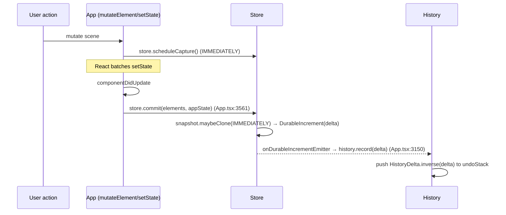
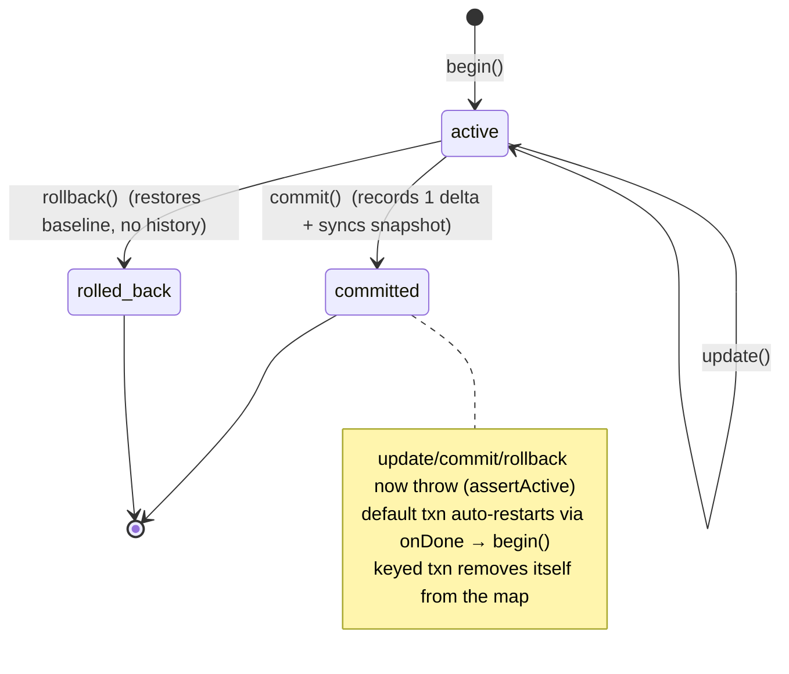
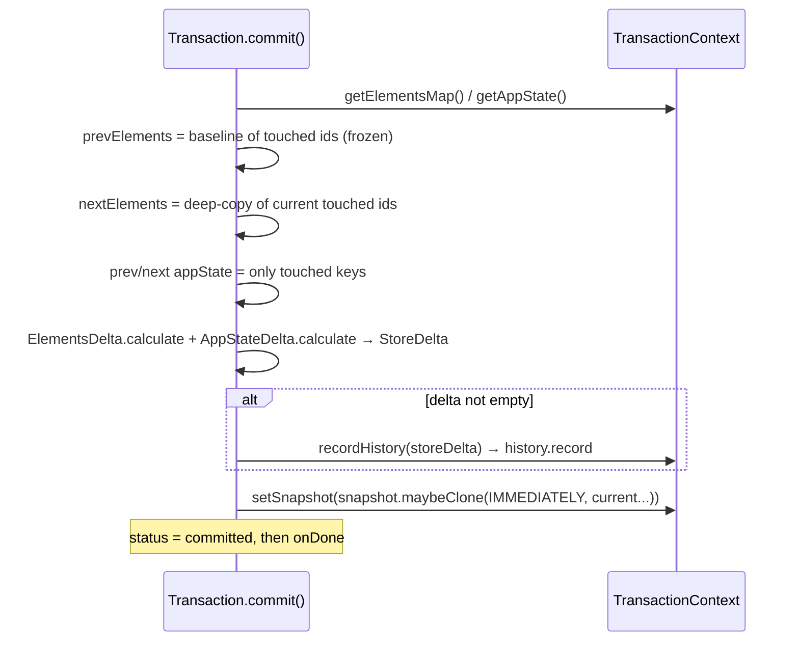
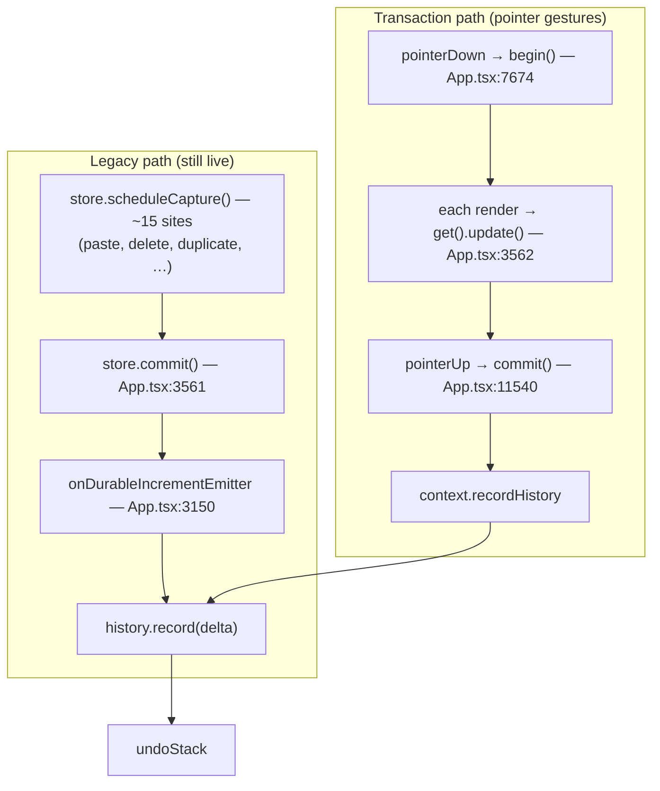

# Excalidraw Transaction System — Design Document

> Status: Design / WIP. Branch `transactions-v2` (commits `7ed99ab3` "adds transaction system", `c1833204` "Refactored transaction system"). Audience: editor contributors working on undo/redo, scene mutation, collaboration, and async/streaming features.

## Context

Excalidraw already has a mature **Store → History → Delta** stack that turns scene mutations into undoable increments. It works well for discrete actions, but it has two structural weaknesses:

1. **Capture is implicit and scattered.** To make a change undoable you must remember to call `store.scheduleCapture()` at the right place. There are ~15 such call sites in `App.tsx`. Forgetting one yields a non-undoable change; calling it twice (or alongside the render-cycle commit) risks splitting one logical action into several history entries.
2. **There is no first-class "scope".** A multi-step gesture (drag/resize/rotate spanning many render frames) or an async operation (AI streaming, image load) has no explicit begin/commit boundary and no way to _abort and revert_ cleanly. The old system leans on `CaptureUpdateAction.EVENTUALLY` to defer intermediate frames, which is subtle and easy to misuse.

The **Transaction system** introduces an explicit `begin → update → commit | rollback` scope layered _on top of_ the existing Store/History machinery. It batches everything touched between `begin()` and `commit()` into exactly **one** history entry, and offers `rollback()` to discard a scope without polluting history. It currently governs the **pointer-interaction lifecycle**; the legacy `scheduleCapture` path remains live for discrete actions. The intended outcome is a clearer, less error-prone capture model and native support for streaming/abortable operations.

## Goals

- Provide an explicit, scoped capture API: **one transaction = one undo/redo entry**, regardless of how many mutations or render frames it spans.
- Support **streaming / async** operations (e.g. many chunks arriving over time) that collapse into a single undoable unit, while remaining visible on-canvas as they arrive.
- Provide **rollback** that restores the transaction's touched elements/appState to their `begin()`-time baseline _without_ recording any history entry, while leaving untouched elements (incl. other concurrent transactions' committed work) intact.
- Support **concurrent** independent scopes (keyed transactions) plus an always-on **default** transaction for the common pointer-gesture case.
- Keep the system **decoupled and testable** — it depends on a narrow injected interface, not the whole `App`.
- Reuse the existing `Delta` / `StoreDelta` / `History` machinery rather than inventing a parallel undo stack.

## Non-Goals

- **Not** a rewrite or replacement of the Store/Delta model. Transactions _produce_ a `StoreDelta` and hand it to the existing `History`.
- **Not** (yet) a full migration of every `scheduleCapture()` site. Discrete actions still use the legacy path; the two coexist (see _Coexistence_).
- **Not** a transactional guarantee over the _scene mutation_ itself. The scene is mutated through the normal flow ("transparent" model); a transaction only **observes** and **batches** — it does not gate or roll back individual `mutateElement` calls atomically.
- **Not** a collaboration/CRDT conflict resolver. Remote sync still flows through `CaptureUpdateAction.NEVER`; transaction interaction with mid-gesture remote updates is an open edge case (see below).
- **Not** nested transactions under the same key (explicitly rejected — duplicate keys throw).

---

## Part 1 — Background: the existing Store / History / Delta system

### Data model

| Concept | Type | Meaning |
| --- | --- | --- |
| Snapshot | `StoreSnapshot` | Immutable `{ elements, appState(observed), metadata }`. The "last known committed" state. `maybeClone(action, els, appState)` returns the same instance if nothing changed. |
| Change | `StoreChange` | Reference-diff of changed elements + changed observed-appState props between two snapshots. |
| Delta | `StoreDelta` | `{ id, elements: ElementsDelta, appState: AppStateDelta }`. The _invertible_ description of a change. `calculate`, `inverse`, `applyTo`, `squash`, `isEmpty`. |
| Element delta | `ElementsDelta` | `{ added, removed, updated }`, each a `Record<id, Delta<ElementPartial>>`. |
| Increment | `StoreIncrement` | Emitted from `store.commit()`. `DurableIncrement` carries a `delta` (undoable); `EphemeralIncrement` does not. |

Files: `packages/element/src/store.ts`, `packages/element/src/delta.ts`, `packages/excalidraw/history.ts`.

### `CaptureUpdateAction` — the capture policy

`store.ts` defines three policies (`store.ts:38-72`):

- **`IMMEDIATELY`** — durable & undoable. `commit()` emits a `DurableIncrement` (with delta) **and** advances the snapshot. Used for ordinary user edits.
- **`NEVER`** — applied but never undoable. Emits an `EphemeralIncrement` and **advances the snapshot**. Used for remote/collab updates and initial scene load.
- **`EVENTUALLY`** — deferred. Emits an `EphemeralIncrement` and **does NOT advance the snapshot**, so the change is folded into the next `IMMEDIATELY`. Used for intermediate async states (freedraw strokes, etc.).

Precedence when several are scheduled in one cycle: `IMMEDIATELY > NEVER > EVENTUALLY`.

### How capture flows today



`history.record(delta)` (`history.ts:117`) ignores empty deltas and anything that is already a `HistoryDelta`, pushes the **inverse** onto `undoStack`, and clears `redoStack` only when _elements_ changed (so a bare click doesn't wipe redo).

### How undo/redo flows today

`History.undo/redo → perform()` (`history.ts:157`): pop a `HistoryDelta`, `applyTo` the current elements/appState (excluding `version`/`versionNonce` so each undo counts as a fresh action for collaboration), `scheduleMicroAction(IMMEDIATELY)` so the inverse is re-emitted for sync, then push the re-inverted entry to the opposite stack. The undo/redo _action_ itself returns `CaptureUpdateAction.NEVER` to avoid recording the undo as new history.

### Limitations (the motivation)

- `scheduleCapture()` is scattered across ~15 sites in `App.tsx` — easy to miss or double-fire.
- Granularity is coupled to the React commit cycle; multi-frame gestures and async pipelines need careful `EVENTUALLY` juggling to avoid producing several entries.
- No explicit scope ⇒ no clean **abort/rollback** primitive.

---

## Part 2 — The Transaction system

Files: `packages/excalidraw/transaction.ts` (implementation), `packages/excalidraw/tests/transaction.test.tsx` (tests), wiring in `packages/excalidraw/components/App.tsx`, public surface in `packages/excalidraw/types.ts`.

### Key concepts

- **Transparent capture.** The scene is mutated through the _normal_ flow (`mutateElement`, `setState`). The transaction is told _after the fact_ which elements/keys were touched via `update()`. `commit()` does **not** re-apply anything — the scene is already in its final state; commit only _computes the delta and records it_.
- **Frozen baseline.** At `begin()` the transaction **deep-copies** every scene element into `prevSnapshot` (`transaction.ts:75-82`). Because the scene mutates element objects _in place_, copying is required — otherwise the "before" would mutate into the "after" and the delta would be empty.
- **Consolidation.** Any number of `update()` calls across any number of frames collapse into one `StoreDelta` at `commit()`, hence one history entry.
- **Scoped, NEVER-based rollback.** `rollback()` reverts only the elements / observed-appState keys the transaction registered via `update()` — restoring their deep-copied `begin()`-time baselines _merged over the current scene_ — via `applyUpdate()`, and records **no** history entry. Because it is scoped (not whole-scene), work committed by other concurrent transactions is preserved.
- **Default vs keyed.** A single always-active **default** transaction (auto-restarts after each commit/rollback) handles the common pointer-gesture case. **Keyed** transactions are explicit, named, can run **concurrently**, and are used for longer/async scopes.

### API surface

`TransactionContext` (the injected dependency — keeps `store`/`history` private):

```ts
interface TransactionContext {
  getElementsMap: () => SceneElementsMap; // current scene, incl. deleted
  getAppState: () => AppState;
  getSnapshot: () => StoreSnapshot;
  setSnapshot: (snapshot: StoreSnapshot) => void; // keep store snapshot in sync on commit
  recordHistory: (delta: StoreDelta) => void; // = history.record
  applyUpdate: (d: { elements; appState }) => void; // = updateScene (rollback)
}
```

`Transaction`:

| Member | Behaviour |
| --- | --- |
| `id`, `status` | `"active" \| "committed" \| "rolled-back"` |
| `update(changes)` | Register touched element ids / appState keys; capture each one's baseline on first touch. **No scene side-effect.** Throws if not active. |
| `commit()` | Compute `StoreDelta` from frozen baseline → current; if non-empty `recordHistory(delta)`; **sync the store snapshot**; mark committed; run `onDone`. Throws if not active. |
| `rollback()` | Revert this transaction's touched ids to their frozen deep-copied baselines (ids it _added_ are dropped) merged over the _current_ scene, plus touched observed-appState keys, via `applyUpdate`; **no history**; mark rolled-back; run `onDone`. Throws if not active. |

`TransactionManager`:

| Method | Behaviour |
| --- | --- |
| `begin(key?)` | No key ⇒ (re)start the default transaction. With key ⇒ open a keyed transaction; **throws if that key is already active**. |
| `get()` / `get(key)` | Default transaction / keyed-or-`undefined`. |
| `commit(key?)` / `rollback(key?)` | Resolve then commit/rollback (default when no key). |
| `rollbackAll()` | Roll back every keyed transaction and the default (default auto-restarts). |

Exposed publicly as `transactionManager` on `ExcalidrawImperativeAPI` (`types.ts:1019`).

### Lifecycle



### Commit internals (`transaction.ts:125-186`)



**Why sync the snapshot?** The durable-increment path normally advances `store.snapshot` as a side effect of emitting. The transaction bypasses that path (it calls `history.record` directly), so it must advance the snapshot itself. Undo/redo re-base their inverse deltas against `store.snapshot`; a stale snapshot would make **redo** compute against the wrong baseline and fail to restore the change (`transaction.ts:170-182`).

> **Future direction.** This `setSnapshot` write-back is a coupling artifact of coexistence: while the legacy path still owns `store.snapshot`, the transaction has to keep it in sync. Once _all_ capture flows are migrated into the transaction system (so nothing else mutates `store.snapshot`), the baseline could be owned by the transaction/history layer instead — e.g. `History` (or a dedicated snapshot namespace) holds the canonical "last committed" snapshot, and undo/redo re-base against _that_ rather than reaching into `store.snapshot`. The transaction already deep-copies a frozen baseline at `begin()`, so promoting that to the authoritative snapshot is a natural next step. That would remove the dual-write coupling, drop the `getSnapshot`/`setSnapshot` members from `TransactionContext`, and make snapshot ownership a single, explicit responsibility.

---

## Part 3 — Integration & coexistence with the legacy path

The transaction system does **not** replace the Store/History path on this branch — it is wired into the **pointer-interaction lifecycle** while the legacy `scheduleCapture` path stays live for everything else. Both ultimately call `history.record()`.



Wiring summary (`App.tsx`):

- **Init** `App.tsx:839-849` — `new TransactionManager({ getElementsMap, getAppState, getSnapshot, setSnapshot, recordHistory: history.record, applyUpdate: updateScene })`.
- **pointerDown** `App.tsx:7674` — `transactionManager.begin()` restarts the default transaction.
- **componentDidUpdate** `App.tsx:3561-3565` — `store.commit(...)` **then** `transactionManager.get().update({ elements, appState })` every render.
- **pointerUp** `App.tsx:11540-11541` — `transactionManager.commit()`; the old `this.store.scheduleCapture()` here is **commented out** (this is the one site already migrated).

**Why this doesn't double-record:** during a pointer gesture the end-of-gesture `scheduleCapture()` is commented out, so `store.commit()` emits only _ephemeral_ increments (no history) and the transaction's `commit()` produces the single durable entry. For **discrete** actions (keyboard delete, paste) there is no `begin()`/`commit()` pair, so `scheduleCapture()` drives the legacy path normally; the default transaction's `update()` registers those changes but is never committed for them, and the next `pointerDown` restarts the default, discarding the stale registrations.

---

## Part 4 — Scenarios it solves

1. **Multi-frame pointer gesture → one entry.** Drag/resize/rotate emit `update()` every render; `commit()` at pointerUp yields a single undoable delta covering the whole gesture.
2. **Streaming / async collapse.** A keyed transaction spanning N async chunks: each chunk mutates the scene and calls `update()`, so it is _visible immediately_ but _not recorded_; a single `commit()` records all N as one entry. One undo removes all; one redo restores all. (Test: "collapses many async chunks into a single undoable/redoable unit".)
3. **Incremental in-place mutation.** A streamed element whose `width` ratchets `10 → 40 → 90 → 160 → 250` collapses to one entry; undo returns to `10`, redo to `250`. The frozen deep-copy baseline is what makes the in-place mutations detectable. (Test: "collapses incremental in-place mutations …".)
4. **Abortable gesture.** `rollback()` restores the elements/appState the transaction touched to their `begin()` baseline with no history pollution — e.g. Escape mid-drag, or an operation that fails partway.
5. **Concurrent scopes.** Multiple keyed transactions run alongside the default and each other; each commits/rolls back **independently** — a rollback reverts only its own touched elements, so it never undoes another transaction's already-committed work.
6. **Atomic abort-all.** `rollbackAll()` reverts every keyed transaction and the default in one call.

---

## Part 5 — Edge cases & known limitations

- **Empty commit is safe.** No `update()`, or a no-op net change ⇒ `StoreDelta.isEmpty()` ⇒ nothing recorded. (Test: "commit() without prior update() does not crash".)
- **In-place mutation visibility (commit).** Handled correctly: `prevSnapshot` is **deep-copied** at `begin()`, and `commit()` also deep-copies the _current_ touched elements into `nextElements`, freezing both ends before `ElementsDelta.calculate`.
- **Rollback is scoped & deep-copied.** `rollback()` reverts only the elements the transaction registered via `update()`, restoring the deep-copied `begin()` baselines held in `originalElementStates` (added ids are dropped) _merged over the current scene_. This (a) correctly reverts **in-place property mutations** — the baseline is a deep copy, not a live reference — and (b) preserves work committed by **other concurrent transactions**, since untouched elements are taken from the current scene rather than rewound to a whole-scene `begin()`-time snapshot. (This replaced the earlier whole-scene `captureRollbackState()` approach, which stored live references and clobbered concurrent commits.)
- **Shared-element write-write conflict (accepted).** If two concurrent transactions both register the _same_ element and one rolls back after the other committed it, the rollback still reverts that element to its own baseline, clobbering the committed value. This is an inherent write-write conflict and is out of scope — the system is not a CRDT conflict resolver (see _Non-Goals_).
- **State-machine guards.** `update`/`commit`/`rollback` after a transaction has finished throw via `assertActive`; duplicate keyed `begin(key)` throws. (Tests cover all four.)
- **Default auto-restart timing.** The default transaction restarts itself inside `onDone` (`begin()` with no key). Any uncommitted `update()`s registered on the default outside a pointer gesture are discarded on the next `pointerDown`.
- **`onIncrement` consumers bypassed (integration gap).** Transaction `commit()` calls `history.record` directly and does **not** emit through `onStoreIncrementEmitter`. External consumers subscribed via the `onIncrement` prop (used for persistence/collab sync) therefore do **not** receive the consolidated durable delta produced by a transaction. They still see the _ephemeral_ increments during the gesture. This needs attention before transactions drive collab-synced changes.
- **Double-record risk if both paths fire.** Any `scheduleCapture()` (IMMEDIATELY) that runs _during_ an active pointer transaction would produce its own durable increment recorded by the legacy path, in addition to the transaction's commit — two entries for one logical change. The migration commented out the pointerUp `scheduleCapture()` precisely to avoid this; new code must not reintroduce it inside a gesture.
- **Mid-gesture remote update (collaboration).** The baseline is frozen at `begin()`. If a remote `NEVER` update lands between `begin()` and `commit()`, the committed delta is computed against the frozen baseline and could fold remote changes into the local undo entry (or conflict). Transaction/remote interleaving is not yet specified.
- **Ordering in `componentDidUpdate`.** `store.commit()` runs _before_ `transactionManager.get().update()` (3561 → 3562). Legacy durable increments are therefore recorded before the transaction registers the same frame's touches; harmless given the no-double-record reasoning above, but the ordering is load-bearing.

---

## Appendix — File / symbol reference

| Symbol | Location |
| --- | --- |
| `Transaction`, `TransactionManager`, `TransactionContext` | `packages/excalidraw/transaction.ts` |
| `Transaction.commit()` snapshot-sync rationale | `packages/excalidraw/transaction.ts:170-182` |
| `Transaction.rollback()` (scoped, deep-copied baselines) | `packages/excalidraw/transaction.ts` |
| Tests (default / keyed / commit / rollback / concurrent / streaming) | `packages/excalidraw/tests/transaction.test.tsx` |
| TransactionManager init | `packages/excalidraw/components/App.tsx:839-849` |
| `begin()` on pointerDown | `packages/excalidraw/components/App.tsx:7674` |
| `store.commit` + `get().update` per render | `packages/excalidraw/components/App.tsx:3561-3565` |
| `commit()` on pointerUp (legacy `scheduleCapture` commented) | `packages/excalidraw/components/App.tsx:11540-11541` |
| Legacy durable-increment → history.record | `packages/excalidraw/components/App.tsx:3150-3151` |
| `Store`, `StoreSnapshot`, `StoreDelta`, `CaptureUpdateAction` | `packages/element/src/store.ts` |
| `Delta`, `ElementsDelta`, `AppStateDelta` | `packages/element/src/delta.ts` |
| `History`, `HistoryDelta`, undo/redo `perform()` | `packages/excalidraw/history.ts` |
