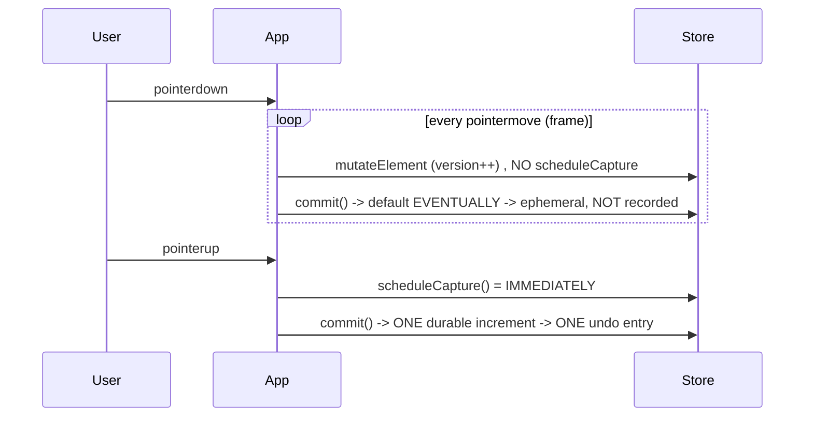
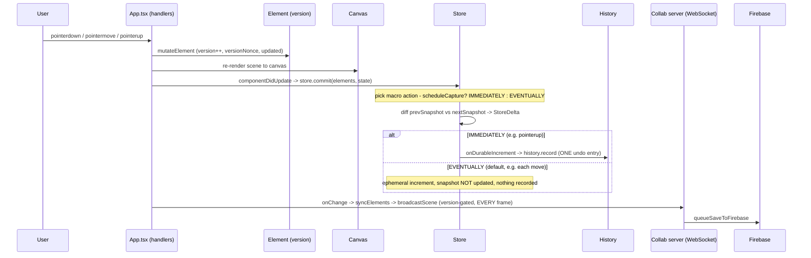
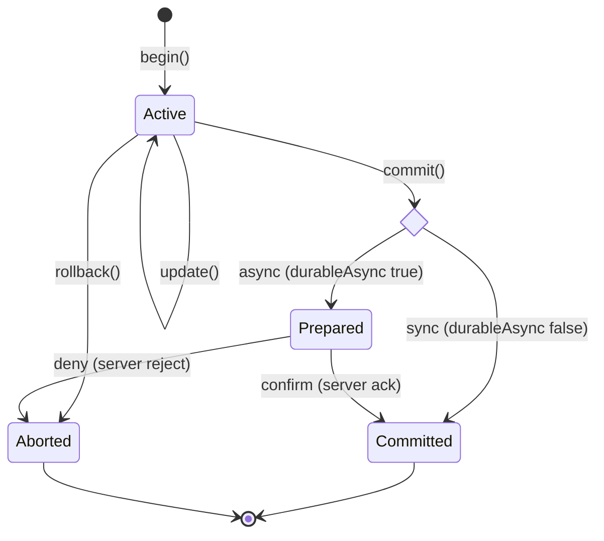
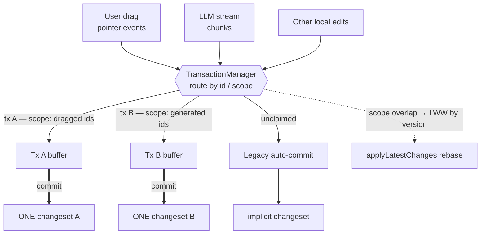
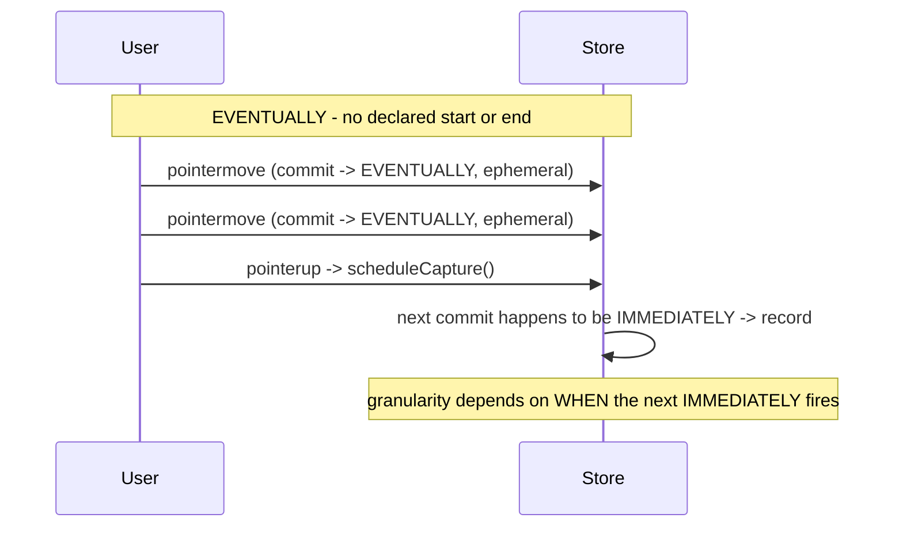
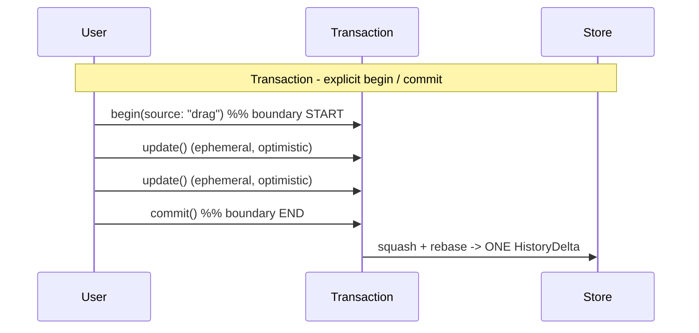
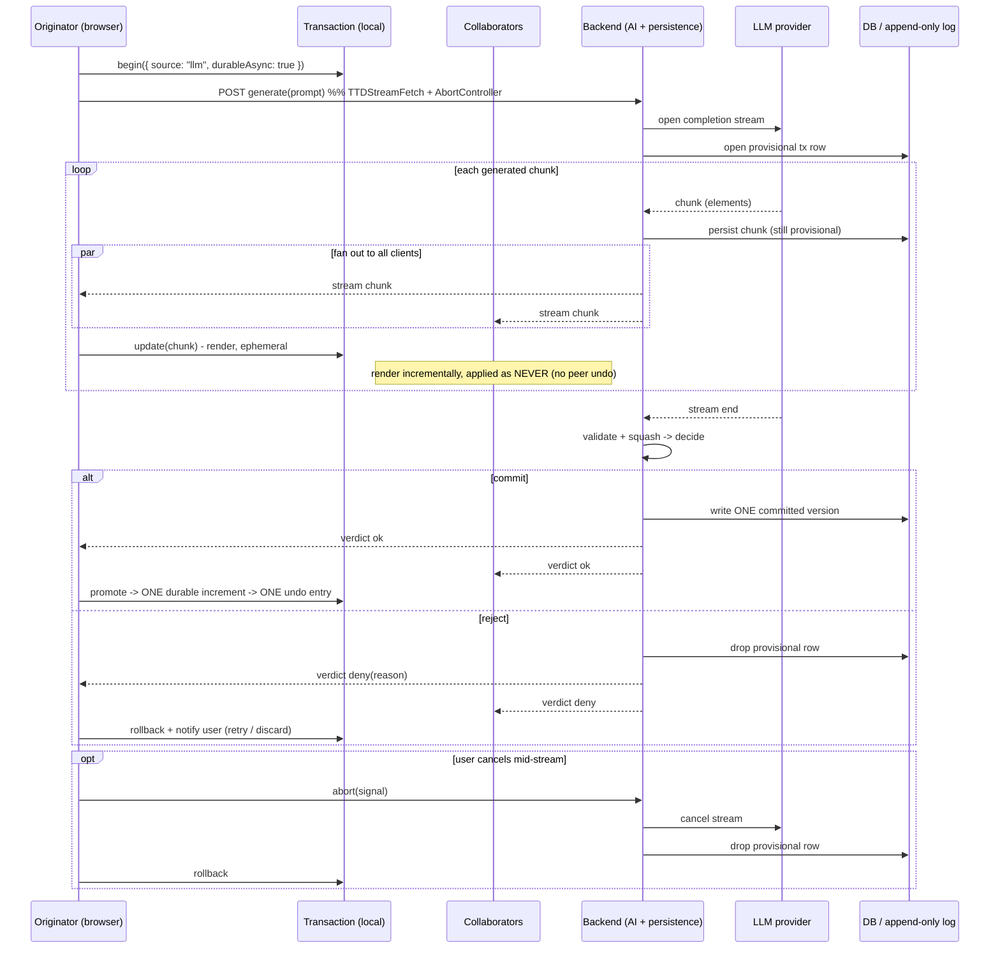
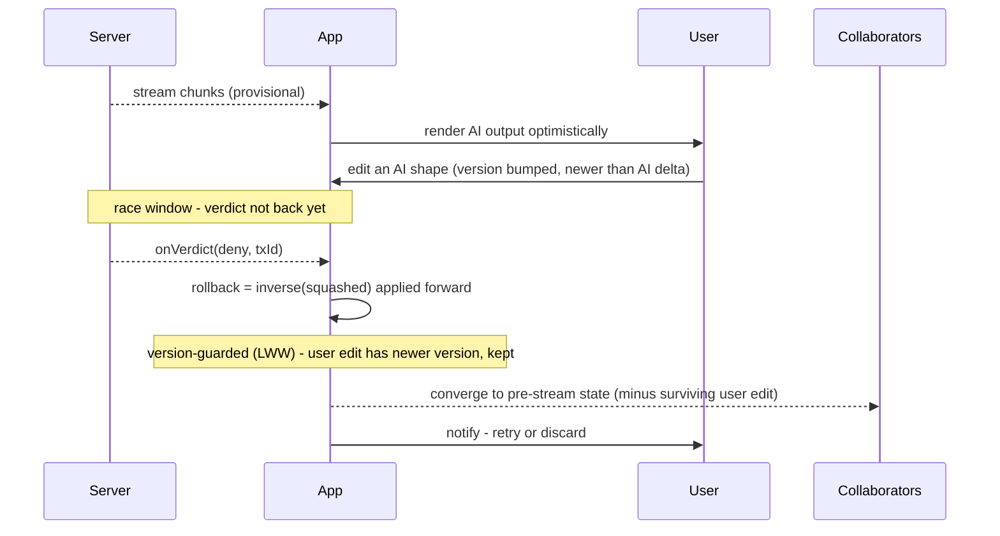
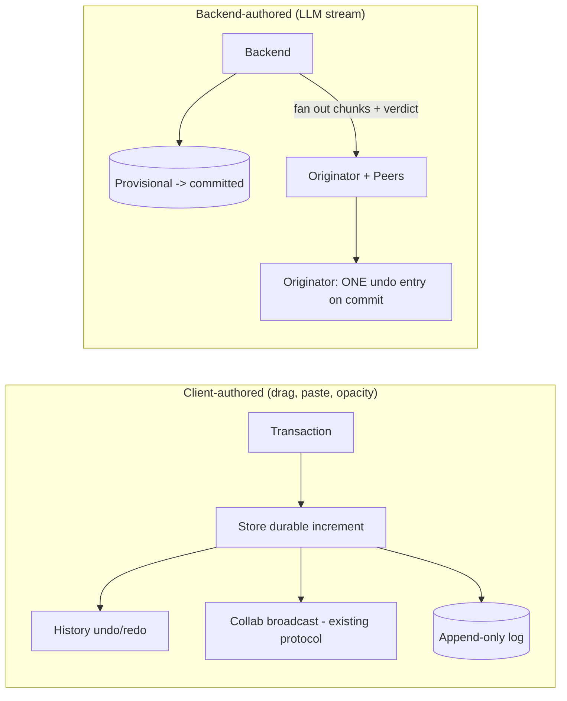

# Proposed Transaction - Volodymyr R.T

This is a not-so-short document as a test work for Excalidraw. My thoughts + LLM debating regarding the Transaction system and layer.

But before we start, I would like to highlight one thing I would also do: 

## 0. Small refactor of `delta.ts`

`delta.ts` repeats itself - `distinctKeysIterator`, `diffObjects`, `diffArrays` are small wrappers around the same diffing idea. I'd collapse them into side-effect-free pure functions. `commit`/`rollback` lean on exactly this diffing, and pure functions are easily to test - so on my view it's worth it.

---

## 0.5 Goals: 
So with this document we want to explain, show and highlights following goals: 
* solve "what counts as action"
* gradually remove "EVENTUALLY" to robust and sustainable transaction system
* make LLM stream and sync working and sustainable
* collaboration versioning is also counted / reused / improved

## 1. The `CaptureUpdateAction.EVENTUALLY` and it's logic

### The capture model today:

- `IMMEDIATELY` -> emit a **durable** increment -> becomes one undo entry.
- `NEVER` -> ephemeral only (remote updates, scene init); never undoable.
- `EVENTUALLY` -> deferred; does **not** update the snapshot; folds into the *next* `IMMEDIATELY`.

Nota bene:  `EVENTUALLY` is not only something code can explicitly schedule. It is also the  ***fallback behavior of the store***. If no macro action was scheduled, `commit()` behaves as `EVENTUALLY` by default.

### Dragging element example:



So `EVENTUALLY` "accomplishes" drag batching by **not recording intermediate frames** and letting the final `IMMEDIATELY` (on pointerup) capture the whole gesture as a single delta. Section 1.5 traces this same gesture all the way down to the canvas, store, and collab server; section 1.6 puts `EVENTUALLY` and the transaction side by side, event by event.

### Issues with `EVENTUALLY`:

- **No boundary.** It waits on a *later, unrelated* `IMMEDIATELY` to flush - the action's start and end are never declared.
- **Non-deterministic granularity.** Depending on when that next `IMMEDIATELY` fires, one action yields 0 entries, 1, or gets fused with an unrelated change.
- **No identity, no concurrency.** One global "pending" slot. An LLM stream and a user drag in flight at once can't be told apart - they fold into the same capture.
- **No rollback.** No clean way to discard an in-progress batch.
- **No async lifetime.** A seconds-long stream has no "still open" state; any stray `IMMEDIATELY` mid-stream captures half a drawing.
- **The code already knows.** `scheduleCapture` carries a `// TODO: Suspicious that this is called so many places. Seems error-prone.`

In short: `EVENTUALLY` is an *implicit, single-slot, fire-and-forget* batching workaround. It works for one short synchronous gesture at a time and nothing else.

---

## 1.5 End-to-end: from a user click to the server

One time to see than 100 times to read. So... "Change tracking" means two things:

1. Each element carries a `version` / `versionNonce` / `updated`. Any mutation bumps them (`packages/element/src/mutateElement.ts:139`). And it's used with collab mode.
2. The store keeps a `StoreSnapshot` and computes a `StoreDelta` by diffing the previous snapshot against the next one, keyed by element `id` and compared by `version` (`packages/element/src/store.ts:1018-1079`).

### The real call chain (one click that creates a rectangle)

- **Event** - a pointer handler in `packages/excalidraw/components/App.tsx` reacts to `pointerdown` / `pointermove` / `pointerup`.
- **Mutate** - the handler calls `mutateElement`, which bumps `version` / `versionNonce` / `updated` (`mutateElement.ts:139`). The scene re-renders to the canvas.
- **Commit** - on the React update, `componentDidUpdate` calls `this.store.commit(elementsMap, this.state)` (`App.tsx:3547`). This runs on *every* update, not once per action.
- **Pick the action** - `commit` reads the scheduled macro action: if some handler called `store.scheduleCapture()` it is `IMMEDIATELY`; otherwise the default is `EVENTUALLY` (`store.ts:437-452`).
- **Diff** - the store diffs `prevSnapshot` vs `nextSnapshot` into a `StoreDelta` (added / removed / updated) (`store.ts:1018-1079`).
- **Fan-out**:
  - durable (`IMMEDIATELY`) -> `onDurableIncrementEmitter` -> `history.record` (one undo entry).
  - collab broadcast rides `props.onChange` -> `collabAPI.syncElements(elements)` -> `portal.broadcastScene(WS_SUBTYPES.UPDATE, ...)` over the WebSocket (`excalidraw-app/App.tsx:683`, `excalidraw-app/collab/Collab.tsx:944-958`), then `queueSaveToFirebase` persists.



### The nuance the rest of this doc depends on

**Collab broadcast is version-gated on every frame - it is *not* gated on durable vs ephemeral.** `broadcastElements` only checks whether the scene version advanced (`Collab.tsx:944-953`), so peers see every intermediate drag frame live even though *nothing is recorded yet*. The thing `IMMEDIATELY` gates is **history recording**, not the broadcast. So "ephemeral" here means "not in undo history / not a durable version", not "invisible to peers". This is precisely the joint a transaction formalizes: keep the live broadcast, declare the boundary, record once.

---

## 2. Sticky notes & envelopes

To visualise easier:

- A **delta** is a sticky note: "circle moved here -> there", and it knows how to peel itself back off.
- **History** is two shoeboxes (stacks of clothes), *undo* and *redo*. Do something, a note drops in *undo*; Ctrl+Z moves it to *redo*.
- A **transaction** is an envelope. Open it, do a hundred things, seal it - one note comes out. Tear it up before sealing and it's as if nothing happened (rollback).

The LLM case is just a big, slow envelope: it stays open for seconds while chunks stream in, peers watch the contents move live, and only the *sealed* envelope becomes one undo step and one log row.

The hard part isn't the envelope per se -  it's **where we draw the line**. The edge cannot be guessed from timing (basically what`EVENTUALLY` does); it has to be *declared* - `begin` and `commit` are the edges. That's the rest of this doc.

---

## 3. Transaction layer. Why and what solves

A transaction replaces guessing with an **explicit, identified scope** that has a clear start and finish, so one logical action deterministically becomes **one** history changeset (or zero, if aborted).

### States

Read it as: `begin` opens the scope, `update` loops while it stays open, and the scope closes exactly one of two ways - `commit` (success) or `rollback` (abort). The only twist is `commit`: a **sync** transaction commits straight away, while an **async** one (LLM) waits in `Prepared` for the server's `confirm` / `deny`. Arrows are just the method names; what each one does is in the list below.




### Events and what they guarantee

- `begin` - declares a new scope with an `id`, an optional declared **scope** (grown as `update` touches more ids), and pins a base snapshot. Enables **identity** so concurrent actions stay separate (see *Multiple transactions at once* below).
- `update` - buffers a delta and applies it optimistically; intermediate steps are **ephemeral** (ride the existing collab broadcast, not recorded).
- `commit` - **finish**: squash the buffered deltas, rebase onto the current scene, record exactly **one** `HistoryDelta`.
- `rollback` - **abort**: pre-commit, discard the buffer (nothing recorded); post-commit, append a compensating inverse.
- `prepare` / `confirm` / `deny` - two-phase commit for async (LLM): content is durable only after the sink acknowledges.

This fix the `EVENTUALLY` issues: explicit boundary (begin/commit), deterministic 1-changeset-per-action, identity for concurrency, rollback for abort, and a defined async lifetime.

### Multiple transactions at once

More about  **attribution**, not **isolation**. One shared canvas, so transactions are *not* read-isolated from each other (explicit non-goal) - what we isolate is *which mutation belongs to which changeset*, so that separate user-initiated or API-initiated actions resolve to **different, atomic changesets**.

Two things make that deterministic:

- **Identity** - `begin` assigns an `id` and pins a base snapshot.
- **Scope** - the set of element ids (and appState keys) a transaction owns. Declared at `begin` and **grown** as `update` touches more (an LLM stream's scope grows chunk by chunk). A mutation routes to the transaction whose scope owns it; anything unowned falls through to the legacy auto-commit path, so untouched actions keep working.

**Concurrency rule:** any number of transactions may be open at once **as long as their scopes are disjoint** - each then commits into its own changeset. The single conflict is **scope overlap** (two transactions touch the same element), resolved by **last-writer-wins on `version`**: the same `StoreDelta.applyLatestChanges` rebase already used on `commit` and undo (section 6c), over the per-element `version` / `versionNonce` (`mutateElement.ts:139`). The later write (newer `version`) is preserved and the loser is superseded rather than silently dropped - no new locking concept.



Scenarios:

- **Drag + LLM stream** - scopes (dragged ids vs generated ids) are disjoint -> two clean, independently-undoable changesets.
- **Two interactive drags** - cannot physically coexist (one pointer), so interactive-vs-interactive overlap is not a real case.
- **API-initiated action** - its own `id` + scope, same rule as a user action.

This is why `TransactionManager.active` is a map keyed by `id` (section 4): the manager tracks every open transaction and routes each mutation by scope.

---


## 3.5 EVENTUALLY vs TRANSACTION, same user action

Lets see one user action: **drag a rectangle 50px to the right** (10 `pointermove` frames). Here is what each layer does, event by event.

### Per-event walkthrough

- **pointerdown**
  - *EVENTUALLY:* nothing scheduled. The interaction just starts; the store has no idea an "action" began.
  - *Transaction:* `tx = begin({ source: "drag" })` pins a base snapshot and assigns an `id`. The boundary is now declared.
- **each pointermove (x10)**
  - *EVENTUALLY:* `mutateElement` bumps `version`; `store.commit` runs with the default `EVENTUALLY` -> ephemeral increment, **snapshot is NOT updated**, broadcast to peers via the version-gated `broadcastScene`. Nothing recorded.
  - *Transaction:* `tx.update(...)` buffers the delta and applies it optimistically; same ephemeral, version-gated broadcast to peers. Still nothing recorded.
- **pointerup**
  - *EVENTUALLY:* a handler calls `store.scheduleCapture()` -> the next `store.commit` runs `IMMEDIATELY` -> one durable increment -> **one undo entry** for the whole gesture.
  - *Transaction:* `tx.commit()` squashes the buffered deltas, rebases onto the current scene, records **exactly one** `HistoryDelta`.
- **interrupted mid-gesture (e.g. an unrelated `IMMEDIATELY` fires, or the action fails)**
  - *EVENTUALLY:* a stray `IMMEDIATELY` flushes whatever is pending and captures **half the gesture**; there is no clean way to discard the in-progress batch.
  - *Transaction:* `tx.rollback()` discards the buffer (pre-commit, nothing recorded) and peers converge back to the pre-gesture state.

### The boundary, drawn two ways





### What the server sees

- *EVENTUALLY:* N broadcast frames (version-gated) followed by one durable scene version. The server has **no notion of the action as a unit** - it only ever sees a stream of element versions and, eventually, a saved scene. There is no provisional/abort concept; a failure mid-action just leaves whatever versions already broadcast.
- *TRANSACTION:* `open(txId)` writes a **provisional** record; each `appendChunk` persists progress (still provisional); `finalize(txId, squashed)` hands over one squashed delta, the server validates and writes **one committed version**, then **pushes** a `confirm` / `deny` verdict back over the socket (it can arrive seconds later or after a reconnect). The action is a first-class, recoverable unit end to end. *(This is the **client-authored** shape - the client produces the deltas. For **backend-authored** streams (LLM) the server is the producer and persists chunks itself, so there is no client `appendChunk` - see section 5.)*

---


## 4. Transaction layer - class, types, interfaces

The manager sits at the existing joint `onDurableIncrementEmitter -> history.record` (`App.tsx`). Today every durable increment becomes its own history entry; while a transaction is open, its increments are **buffered under the transaction id** instead, and exactly one `HistoryDelta` is recorded on commit.

```ts
type TransactionId = string;

type TransactionState =
  | "active"
  | "prepared"
  | "committed"
  | "aborted";

interface TransactionOptions {
  /** human-facing source, useful for debugging / UI ("llm", "drag", "opacity") */
  source: string;
  /** ids this tx owns up-front; grown as update() touches more (attribution).
   *  open transactions must stay disjoint; overlap reconciles via LWW (version). */
  scope?: { elementIds?: Set<string>; appStateKeys?: Set<keyof ObservedAppState> };
  /** async two-phase commit (LLM); when true, commit() goes through prepare() */
  durableAsync?: boolean;
  /** force a log flush before reporting committed (high-stakes async) */
  forceFlushOnCommit?: boolean;
}

interface Transaction {
  readonly id: TransactionId;
  readonly source: string;
  readonly state: TransactionState;

  /** buffer a change, apply optimistically, broadcast ephemerally (NOT recorded) */
  update(elements?: SceneElementsMap, appState?: Partial<AppState>): void;

  /** finish: squash + rebase -> exactly one HistoryDelta (or ./via pr÷≥epare for async) */
  commit(): Promise<void> | void;

  /** abort: pre-commit discard buffer; post-commit append compensating inverse */
  rollback(): void;

  /** async tier: hand squashed StoreDelta to the sink, await ack */
  prepare(): Promise<void>;
}

interface TransactionManager {
  begin(opts: TransactionOptions): Transaction;
  get(id: TransactionId): Transaction | undefined;
  /** all open transactions, keyed by id. The manager routes each mutation to the
   *  owning tx by scope: disjoint scopes commit independently, overlap reconciles
   *  via applyLatestChanges (LWW by version) - see "Multiple transactions at once". */
  readonly active: ReadonlyMap<TransactionId, Transaction>;
}

/**
 * Durable sink. Local/free tier = no-op (in-memory undo only).
 * Premium tier = Excalidraw+ append-only delta log, reached over a WebSocket,
 * server-authoritative. A long async tx is saved PROVISIONALLY while it streams,
 * then UPDATED to committed (or dropped) once the stream ends - the verdict is
 * PUSHED back over the socket, not a request/response (it can arrive seconds
 * later, or after a reconnect).
 */
interface TransactionStore {
  /** open a provisional, not-yet-durable record for this tx */
  open(txId: TransactionId, meta: { source: string }): Promise<void>;
  /** client-authored progressive saves only (e.g. a long client-side op).
   *  NOT used on the LLM path: there the backend is the producer and persists
   *  chunks internally as it generates them - the client never echoes them up. */
  appendChunk(txId: TransactionId, delta: StoreDelta): Promise<void>;
  /** prepare: hand the final squashed delta; server validates + writes commit */
  finalize(txId: TransactionId, squashed: StoreDelta): Promise<{ id: string }>;
  /** server -> client push (resolves prepare()):
   *   confirm -> promote provisional record to committed
   *   deny    -> drop provisional record; client rolls back + notifies user */
  onVerdict(cb: (v: { txId: TransactionId; ok: boolean; reason?: string }) => void): void;
  load(): Promise<StoreDelta[]>; // resume on reload
}
```

### Mapping onto existing primitives

- `update` -> `CaptureUpdateAction.EVENTUALLY` / `NEVER` (ephemeral; reuses today's broadcast).
- `commit` -> one `IMMEDIATELY`-equivalent durable increment; internally `StoreDelta.squash(...buffered)` then `StoreDelta.applyLatestChanges(prev, next)` (rebase) before `history.record`.
- `rollback` -> `StoreDelta.inverse(squashed)` applied forward (new versions, collab-safe).

---

## 5. Graphs - LLM streaming and collaboration

### LLM streaming as a single async transaction



Key properties: peers see every chunk live, the backend holds the partial work (provisionally) the whole time, but the **originator** gets exactly one undo entry and the **log gains exactly one committed version**.

 The backend is the  **producer + collect-and-decide layer + single fan-out source**: it generates the chunks, persists each one to a **provisional** record as it goes, and **streams the same chunks to every client** (originator and peers). The client never echoes chunks back up - it only *receives*, renders ephemerally via `tx.update`, and keeps the transaction open for its own local undo. When the stream ends the backend validates + squashes, writes **one** committed version, and **updates** the provisional record to committed - then pushes a `verdict` to all clients. This is the Google-Docs-with-AI shape: many clients collaborate live, an AI is one more author, and the canonical document is reconciled server-side.

**The edge case:** on `deny` (validation failed, quota, server rejected) the verdict can land *after* clients already rendered the result. The backend **fans the verdict out to everyone**, and recovery is the ordinary `rollback` (inverse applied forward, collab-safe), so every peer converges back to the pre-stream state with no special-casing. The originator surfaces a choice - **retry or discard** - rather than silently dropping the generation. A user-initiated cancel is the same path: the client aborts the stream (`AbortController`/`signal`), the backend stops the LLM and drops the provisional record.

### The race window:

 This is an **optimistic-concurrency timing window**, not a data-corruption bug. Think of it like clicking "like" in an app: the UI shows the like immediately, but the server still has to confirm whether it was accepted. If the server later rejects it, the UI undoes that optimistic change. Here the client shows the AI stream immediately, while the server's `confirm` / `deny` verdict arrives later over the socket (`onVerdict` on the `TransactionStore`, section 4). The exact timing can vary - the user may already see or edit the result before the verdict arrives - so the important requirement is that all clients reconcile to the same final state once the verdict is known. And that's leaves the open question: shall we allow user to edit during LLM stream.

**Potential issues:**

- **Deny-after-display.** The verdict lands after the user already sees the result on canvas (named above). The mildest case - nothing was built on top yet.
- **Edits-on-top.** The user (or a peer) edits or extends an AI-generated element *before* the deny arrives. A naive rollback that blindly inverts only the AI delta could revert or dangle that later edit. This is the genuinely subtle one.
- **Concurrent peer mutation.** A peer touches one of the streamed elements while the transaction is still provisional - overlapping scopes racing on the same element.
- **Duplicate / late / reordered verdict.** The verdict arrives twice, out of order, or only after a reconnect or reload, so the handler must not assume exactly-once, in-order delivery.

**How we handle it:**

- **Deterministic convergence.** Recovery is the ordinary `rollback` = `StoreDelta.inverse(squashed)` applied *forward* with new versions (section 4 mapping). No matter how the deny interleaves with rendering, every peer converges back to the pre-stream state.
- **Version-guarded rollback (edits-on-top).** Rollback reconciles per element by `version` (LWW) instead of blindly reverting - the same `StoreDelta.applyLatestChanges` rebase already used on `commit` (section 6c). A user edit layered on top has a newer `version`, so it is detected and preserved/superseded rather than silently dropped.
- **Idempotent verdict, keyed by `txId`.** `onVerdict` applies at most once per `txId` and ignores unknown or already-resolved ids. That makes duplicate, late, and reordered verdicts safe, and covers reconnect + `load()` resume on reload.
- **Optional soft-lock.** For high-value scopes, soft-locking the streamed elements while provisional avoids the edits-on-top hazard entirely (the alternative to per-element LWW - see open questions).
- **User-facing resolution.** On `deny`, surface **retry or discard** rather than silently dropping the generation: the timing window is made visible to the user, not hidden.



### Collaboration touch points (indirect)

There are two authoring paths, and they touch collaboration differently.



- **Client-authored** (drag / paste / opacity): unchanged. The transaction never talks to collab directly - intermediate steps ride the existing ephemeral element broadcast, and only `commit` produces the durable increment that reaches collab and the log.
- **Backend-authored** (LLM): the backend persists (provisional → committed) and **fans out the chunks + verdict** to originator and peers itself; the originator's local transaction yields one undo entry on commit. This is the one place the "collab protocol unchanged" claim is relaxed: AI streaming is a **server → room push**, so the AI backend and the collab server must cooperate (or be the same service). That coupling is the deliberate cost of the single-source fan-out.

---

## 6. Pseudo code - dragging, event streaming, undo/redo

### a) Dragging (replacing the implicit `EVENTUALLY`)

This is the code-level version of the event-by-event walkthrough in section 1.6 (`begin` on pointerdown, `update` per move, `commit` on pointerup).

```ts
function onDragStart(elements) {
  const tx = transactions.begin({ source: "drag" });
  dragTx = tx; // store on the interaction
}

function onDragMove(elements, delta) {
  // optimistic + ephemeral; peers see live movement; nothing recorded yet
  dragTx.update(applyTranslation(elements, delta));
}

function onDragEnd() {
  dragTx.commit(); // ONE undo entry for the whole gesture
  dragTx = null;
}

// opacity slider is identical: begin on grab, update on input, commit on release
```

Pseudo-test:

```ts
describe("drag transaction", () => {
  it("produces exactly one undo entry regardless of move count", () => {
    const tx = manager.begin({ source: "drag" });
    for (let i = 0; i < 50; i++) tx.update(moveBy(el, 1, 0));
    tx.commit();
    expect(history.undoStack.length).toBe(1);
    expect(history.undoStack.at(-1).elements.updated).toHaveProperty(el.id);
  });

  it("records nothing when rolled back", () => {
    const tx = manager.begin({ source: "drag" });
    tx.update(moveBy(el, 10, 0));
    tx.rollback();
    expect(history.undoStack.length).toBe(0);
    expect(scene.get(el.id).x).toBe(originalX);
  });
});
```

### b) Event streaming (LLM, two-phase async)

```ts
async function runLlmGeneration(prompt) {
  const tx = transactions.begin({ source: "llm", durableAsync: true });
  const controller = new AbortController(); // user can cancel mid-stream

  try {
    // the backend owns the LLM + persistence; the client only receives + renders.
    // chunks arrive via onChunk (TTDStreamFetch in excalidraw-app/components/AI.tsx).
    await TTDStreamFetch({
      url: `${AI_BACKEND}/v1/ai/text-to-diagram/chat-streaming`,
      messages: prompt,
      signal: controller.signal,
      onChunk: (chunk) => tx.update(convertToExcalidrawElements(chunk)), // ephemeral
    });

    // commit does NOT push a delta up - the backend already has it.
    // it awaits the server's verdict (onVerdict), then records ONE undo entry.
    await tx.commit();
  } catch (err) {
    controller.abort();  // cancel/error -> backend drops the provisional record
    tx.rollback();       // peers converge back to the pre-stream state
    notifyUser("Generation failed - retry or discard?");
  }
}
```

Pseudo-test:

```ts
describe("llm streaming transaction", () => {
  it("streams N chunks but commits one version + one undo entry", async () => {
    const tx = manager.begin({ source: "llm", durableAsync: true });
    chunks.forEach((c) => tx.update(c));
    backend.emitVerdict({ txId: tx.id, ok: true }); // server confirms
    await tx.commit();
    expect(txStore.committed.length).toBe(1);  // ONE committed version in the log
    expect(history.undoStack.length).toBe(1);  // ONE undo entry
  });

  it("on deny, leaves no history entry and reverts the scene", async () => {
    const tx = manager.begin({ source: "llm", durableAsync: true });
    chunks.forEach((c) => tx.update(c));
    backend.emitVerdict({ txId: tx.id, ok: false, reason: "quota" }); // server denies
    await expect(tx.commit()).rejects.toThrow();
    expect(txStore.committed.length).toBe(0);  // provisional row dropped, nothing committed
    expect(history.undoStack.length).toBe(0);
    expect(scene.size).toBe(sceneSizeBeforeStream);
  });
});
```

### c) Undo / redo (interaction with an open transaction)

Chosen behavior: undo acts on **prior committed history** while an open transaction keeps running.

```ts
function undo() {
  // does NOT touch any open transaction's buffer; pops the committed stack
  const entry = history.undoStack.pop();
  if (!entry) return;
  applyAndReEmit(entry);           // re-emits as a fresh durable increment (new versions, collab-safe)
  history.redoStack.push(inverse(entry));
}

// when an OPEN transaction later commits, it rebases onto the post-undo scene:
function commit(tx) {
  const squashed = StoreDelta.squash(...tx.buffer);
  const rebased  = StoreDelta.applyLatestChanges(squashed, tx.baseElements, scene.current);
  history.record(rebased);         // clears redoStack (element change) - documented side effect
  sink.append(rebased);
}
```

Pseudo-test:

```ts
describe("undo while a transaction is open", () => {
  it("undo affects committed history, transaction still commits", () => {
    commitEntry("A");                      // undoStack: [A]
    const tx = manager.begin({ source: "drag" });
    tx.update(moveBy(el, 5, 0));
    undo();                                // reverts A; tx still active
    expect(scene.has("A-element")).toBe(false);
    tx.commit();                           // rebased onto post-undo scene
    expect(history.undoStack.at(-1).source).not.toBe("A");
    expect(history.redoStack.length).toBe(0); // wiped by the commit (expected)
  });
});
```

### d) Multiple transactions at once (scope attribution + LWW)

Covers the §3 *Multiple transactions at once* claims: disjoint scopes resolve to separate, independently-undoable changesets, and scope overlap reconciles by `version` (the same `applyLatestChanges` rebase as in c), never a blind clobber.

```ts
describe("multiple transactions at once", () => {
  it("disjoint scopes resolve to separate, independent changesets", () => {
    const txA = manager.begin({ source: "drag", scope: { elementIds: new Set(["A"]) } });
    const txB = manager.begin({ source: "llm",  scope: { elementIds: new Set(["B"]) } });

    txA.update(moveBy("A", 5, 0));
    txB.update(addElement("B"));        // interleaved, different scope
    txB.commit();                       // B commits first
    txA.commit();

    expect(history.undoStack.length).toBe(2); // two atomic entries, not one fused

    undo();                             // undoes the most recent (A) only
    expect(scene.get("A").x).toBe(originalAx);
    expect(scene.has("B")).toBe(true);  // B untouched by A's undo
  });

  it("on overlap, reconciles by version (LWW), not blind revert", () => {
    const tx = manager.begin({ source: "drag", scope: { elementIds: new Set(["X"]) } });
    tx.update(setProp("X", { strokeColor: "red" }));      // X buffered at base version

    // a newer write lands on the same element before tx commits (peer / async tx)
    applyRemote(mutate("X", { strokeColor: "blue", backgroundColor: "yellow" })); // version++

    tx.commit(); // applyLatestChanges rebases the buffered delta onto the newer scene
    expect(scene.get("X").strokeColor).toBe("blue");      // newer version wins (LWW)
    expect(scene.get("X").backgroundColor).toBe("yellow"); // non-conflicting newer write kept
  });
});
---

## Open questions left

- Should we lock user interaction during LLM stream ? If not - should a denied AI commit's rollback preserve user edits layered on optimistic-but-unconfirmed content (version-guarded rollback)
- Should `prepare` force a flush before reporting `committed` for high-stakes LLM runs?
- Should an in-progress transaction surface in the UI (indicator / cancel) for long LLM runs?
