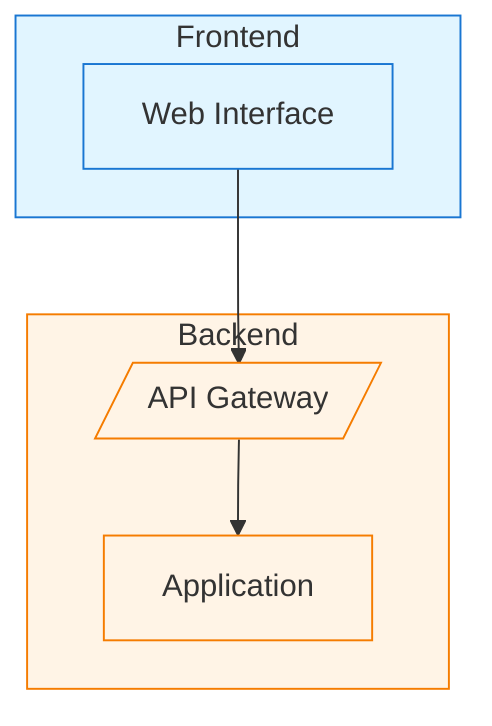

# Backend API Integration for Image-to-Diagram

## Overview

The frontend now calls a backend API for image-to-diagram conversion instead of doing it client-side. This provides:
- ✅ Professional Mermaid rendering with all features
- ✅ Better diagram quality with proper colors, shapes, and grouping
- ✅ Secure API key handling (keys stay on backend)
- ✅ Use of mature Mermaid.js libraries
- ✅ SVG generation for high-quality rendering

## Architecture

```
Frontend (Excalidraw)
  ↓ 1. User uploads image
  ↓ 2. Get AI config from localStorage
  ↓ 3. Convert image to base64
  ↓ 4. POST /api/image-to-diagram
Backend (Your FastAPI)
  ↓ 5. Receive image + API key + provider
  ↓ 6. Call Gemini/OpenAI to generate Mermaid
  ↓ 7. Use Mermaid.js to render SVG
  ↓ 8. Return Mermaid code + SVG
Frontend
  ↓ 9. Convert SVG to Excalidraw elements
  ↓ 10. Add to canvas with proper styling
```

## Frontend Changes (✅ COMPLETE)

### 1. Backend API Service (`excalidraw-app/data/backendApiService.ts`)

```typescript
export interface ImageToDiagramRequest {
  image: string; // base64 encoded
  apiKey: string;
  provider: string; // "google", "openai", "anthropic"
  model: string;
}

export interface ImageToDiagramResponse {
  mermaidCode: string;
  svg?: string; // Optional backend-rendered SVG
  error?: string;
}

export async function convertImageToDiagram(
  request: ImageToDiagramRequest
): Promise<ImageToDiagramResponse>
```

### 2. SVG to Excalidraw Converter (`excalidraw-app/data/svgToExcalidraw.ts`)

Converts backend-generated SVG to native Excalidraw elements with:
- Proper colors and styling
- Different shapes (rectangles, parallelograms, etc.)
- Grouped elements (subgraphs)
- Arrows and connections

### 3. Updated ConversionOrchestrationService

Now calls backend API instead of frontend LLM service:
- Gets AI config from localStorage
- Converts image to base64
- Calls backend endpoint
- Handles response

## Backend Implementation (TODO)

### Required Endpoint

**POST** `/api/image-to-diagram`

**Request Body:**
```json
{
  "image": "base64_encoded_image_data",
  "apiKey": "user_api_key",
  "provider": "google",
  "model": "gemini-2.0-flash-exp"
}
```

**Response:**
```json
{
  "mermaidCode": "graph TD\n  A[Start] --> B[End]",
  "svg": "<svg>...</svg>",
  "error": null
}
```

### Backend Implementation Steps

#### 1. Install Dependencies

```bash
pip install mermaid-py  # or use Node.js mermaid-cli
# OR
npm install @mermaid-js/mermaid-cli
```

#### 2. Create FastAPI Endpoint

```python
from fastapi import FastAPI, HTTPException
from pydantic import BaseModel
import base64
import subprocess
import tempfile
import os

app = FastAPI()

class ImageToDiagramRequest(BaseModel):
    image: str  # base64
    apiKey: str
    provider: str
    model: str

class ImageToDiagramResponse(BaseModel):
    mermaidCode: str
    svg: str | None = None
    error: str | None = None

@app.post("/api/image-to-diagram")
async def convert_image_to_diagram(request: ImageToDiagramRequest):
    try:
        # 1. Decode image
        image_data = base64.b64decode(request.image)
        
        # 2. Call Gemini/OpenAI to generate Mermaid code
        mermaid_code = await generate_mermaid_from_image(
            image_data,
            request.apiKey,
            request.provider,
            request.model
        )
        
        # 3. Render Mermaid to SVG using mermaid-cli
        svg_content = await render_mermaid_to_svg(mermaid_code)
        
        return ImageToDiagramResponse(
            mermaidCode=mermaid_code,
            svg=svg_content,
            error=None
        )
    except Exception as e:
        return ImageToDiagramResponse(
            mermaidCode="",
            svg=None,
            error=str(e)
        )

async def generate_mermaid_from_image(
    image_data: bytes,
    api_key: str,
    provider: str,
    model: str
) -> str:
    """Call LLM to generate Mermaid code from image"""
    
    if provider == "google":
        # Use Gemini API
        import google.generativeai as genai
        genai.configure(api_key=api_key)
        
        model_instance = genai.GenerativeModel(model)
        
        prompt = """Analyze this diagram image and generate Mermaid code that recreates it.

IMPORTANT:
- Use proper Mermaid syntax with subgraphs for grouping
- Include all colors, shapes, and styling
- Use different node shapes: [] for rectangles, () for rounded, {} for diamonds, [/ /] for parallelograms
- Add proper labels and connections
- Maintain the visual hierarchy

Return ONLY the Mermaid code, no explanations."""

        response = model_instance.generate_content([
            prompt,
            {"mime_type": "image/png", "data": image_data}
        ])
        
        return response.text.strip()
    
    elif provider == "openai":
        # Use OpenAI API
        import openai
        openai.api_key = api_key
        
        # Similar implementation for OpenAI
        pass
    
    else:
        raise ValueError(f"Unsupported provider: {provider}")

async def render_mermaid_to_svg(mermaid_code: str) -> str:
    """Render Mermaid code to SVG using mermaid-cli"""
    
    # Create temporary files
    with tempfile.NamedTemporaryFile(mode='w', suffix='.mmd', delete=False) as mmd_file:
        mmd_file.write(mermaid_code)
        mmd_path = mmd_file.name
    
    svg_path = mmd_path.replace('.mmd', '.svg')
    
    try:
        # Run mermaid-cli
        subprocess.run([
            'mmdc',  # mermaid-cli command
            '-i', mmd_path,
            '-o', svg_path,
            '-t', 'default',  # theme
            '-b', 'transparent'  # background
        ], check=True)
        
        # Read SVG content
        with open(svg_path, 'r') as svg_file:
            svg_content = svg_file.read()
        
        return svg_content
    finally:
        # Cleanup
        if os.path.exists(mmd_path):
            os.unlink(mmd_path)
        if os.path.exists(svg_path):
            os.unlink(svg_path)
```

#### 3. Alternative: Use Node.js for Mermaid Rendering

If you prefer Node.js for Mermaid rendering:

```javascript
const { exec } = require('child_process');
const fs = require('fs').promises;
const path = require('path');

async function renderMermaidToSVG(mermaidCode) {
  const tempDir = '/tmp';
  const mmdPath = path.join(tempDir, `diagram-${Date.now()}.mmd`);
  const svgPath = mmdPath.replace('.mmd', '.svg');
  
  try {
    // Write Mermaid code to file
    await fs.writeFile(mmdPath, mermaidCode);
    
    // Render with mermaid-cli
    await new Promise((resolve, reject) => {
      exec(`mmdc -i ${mmdPath} -o ${svgPath} -t default -b transparent`, 
        (error, stdout, stderr) => {
          if (error) reject(error);
          else resolve(stdout);
        }
      );
    });
    
    // Read SVG
    const svgContent = await fs.readFile(svgPath, 'utf-8');
    return svgContent;
  } finally {
    // Cleanup
    await fs.unlink(mmdPath).catch(() => {});
    await fs.unlink(svgPath).catch(() => {});
  }
}
```

### 4. Enhanced Prompt for Better Diagrams

Use this prompt when calling Gemini/OpenAI:

```
Analyze this architecture diagram image and generate Mermaid code that recreates it with high fidelity.

REQUIREMENTS:
1. Use subgraphs to group related components (with proper labels)
2. Apply different node shapes:
   - [Text] for rectangles
   - (Text) for rounded rectangles
   - {Text} for diamonds
   - [/Text/] for parallelograms (APIs)
   - [[Text]] for subroutines
3. Use proper styling:
   - classDef for colors (e.g., classDef frontend fill:#e1f5ff,stroke:#1976d2)
   - Apply classes to nodes (e.g., A:::frontend)
4. Include all arrows with labels where present
5. Maintain visual hierarchy and grouping
6. Use descriptive node IDs

EXAMPLE OUTPUT:


Return ONLY the Mermaid code between ```mermaid and ```, no other text.
```

## Environment Configuration

### Frontend (.env)

```bash
VITE_BACKEND_URL=http://localhost:8000
# OR for production
VITE_BACKEND_URL=https://your-backend.com
```

### Backend

```bash
# No API keys stored in backend!
# Keys are sent from frontend with each request
```

## Testing

### 1. Test Backend Endpoint

```bash
curl -X POST http://localhost:8000/api/image-to-diagram \
  -H "Content-Type: application/json" \
  -d '{
    "image": "base64_image_data_here",
    "apiKey": "your_gemini_api_key",
    "provider": "google",
    "model": "gemini-2.0-flash-exp"
  }'
```

### 2. Test Frontend Integration

1. Start backend: `uvicorn main:app --reload`
2. Start frontend: `cd excalidraw-app && npx vite`
3. Open http://localhost:3001/
4. Click "Image to diagram"
5. Upload your architecture diagram
6. Click "Convert to Diagram"
7. Verify: Diagram renders with proper colors, shapes, and grouping

## Benefits of Backend Approach

### ✅ Better Quality
- Professional Mermaid rendering
- All Mermaid features supported (subgraphs, styling, shapes)
- Consistent output

### ✅ Security
- API keys never exposed in frontend code
- Keys sent only with requests (can be encrypted)
- Backend can implement rate limiting

### ✅ Flexibility
- Easy to switch Mermaid rendering libraries
- Can add caching
- Can implement custom rendering logic

### ✅ Maintainability
- Separation of concerns
- Backend handles complex rendering
- Frontend focuses on UI/UX

## Next Steps

1. **Implement Backend Endpoint** (see code above)
2. **Install mermaid-cli**: `npm install -g @mermaid-js/mermaid-cli`
3. **Test with sample image**
4. **Deploy backend**
5. **Update frontend VITE_BACKEND_URL**
6. **Test end-to-end**

## Troubleshooting

### Backend not responding
- Check backend is running: `curl http://localhost:8000/health`
- Check CORS settings in FastAPI
- Verify VITE_BACKEND_URL is correct

### Mermaid rendering fails
- Check mermaid-cli is installed: `mmdc --version`
- Verify Mermaid syntax is valid
- Check temp directory permissions

### Poor diagram quality
- Enhance the prompt (see Enhanced Prompt section)
- Try different Gemini models (gemini-2.0-flash-exp, gemini-pro-vision)
- Adjust image preprocessing

## Current Status

✅ **Frontend**: Complete and ready
⏳ **Backend**: Needs implementation (see code above)
📝 **Documentation**: Complete

Once backend is implemented, you'll have professional-quality diagram rendering! 🎉
