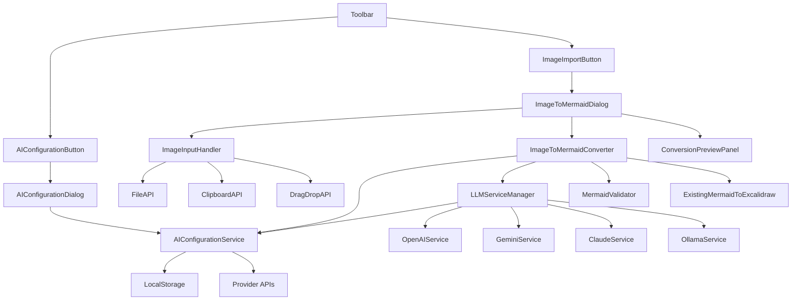

# Component Architecture

## Component Overview

The image-to-diagram conversion feature will integrate with Excalidraw's existing architecture through several new components and modifications to existing ones.

## New Components

### AIConfigurationDialog
**Purpose**: UI for configuring LLM provider credentials and selecting models
**Responsibilities**:
- Provide forms for entering credentials for each provider (OpenAI, Gemini, Claude, Ollama)
- Test credential validity with provider APIs
- Display available models after successful connection
- Allow users to select preferred model
- Manage credential storage and updates
- Show connection status for each configured provider

**Interfaces**:
```typescript
interface AIConfigurationDialogProps {
  isOpen: boolean;
  onClose: () => void;
  onConfigurationSaved: () => void;
}

interface ProviderConfigForm {
  provider: LLMProvider;
  credentials: ProviderCredentials;
  testStatus: 'idle' | 'testing' | 'success' | 'error';
  availableModels: ModelInfo[];
  selectedModel?: string;
}
```

**Component Structure**:
- Provider selection tabs (OpenAI, Gemini, Claude, Ollama)
- Credential input forms (provider-specific fields)
- Test connection button with status indicator
- Model selection dropdown (populated after successful test)
- Save/Cancel buttons
- Delete credentials option for configured providers

### AIConfigurationButton
**Purpose**: Toolbar button to open AI configuration dialog
**Responsibilities**:
- Display configuration status (configured/not configured)
- Open AIConfigurationDialog when clicked
- Show visual indicator when no provider is configured
- Integrate with existing toolbar

**Interfaces**:
```typescript
interface AIConfigurationButtonProps {
  isConfigured: boolean;
  onClick: () => void;
}
```

### ImageToMermaidConverter
**Purpose**: Core component that orchestrates the image-to-mermaid conversion pipeline
**Responsibilities**:
- Check if AI provider is configured before starting conversion
- Manage image input from multiple sources (paste, upload, drag & drop)
- Interface with configured LLM services via AIConfigurationService
- Handle mermaid code generation and validation
- Manage conversion state and error handling
- Coordinate with existing mermaid-to-excalidraw integration
- Prompt user to configure AI if no provider is set up

**Interfaces**:
```typescript
interface ImageToMermaidConverterProps {
  onConversionComplete: (mermaidCode: string) => void;
  onError: (error: Error) => void;
  onConfigurationRequired: () => void; // Opens AI configuration dialog
}
```

### ImageInputHandler
**Purpose**: Handle multiple image input methods
**Responsibilities**:
- Process clipboard paste events
- Handle file upload dialog
- Manage drag and drop functionality
- Validate image formats and size limits
- Convert images to appropriate format for LLM processing

**Interfaces**:
```typescript
interface ImageInputHandlerProps {
  onImageReceived: (imageData: ImageData) => void;
  supportedFormats: string[];
  maxFileSize: number;
}

interface ImageData {
  blob: Blob;
  dataUrl: string;
  format: string;
  size: number;
}
```

### LLMServiceManager
**Purpose**: Abstract interface for different LLM vision services
**Responsibilities**:
- Provide unified interface for multiple LLM providers
- Handle service-specific authentication and configuration
- Manage rate limiting and error handling
- Support both online and offline models

**Interfaces**:
```typescript
interface LLMServiceManager {
  analyzeImage(imageData: ImageData, prompt?: string): Promise<string>;
  validateMermaidCode(code: string): Promise<boolean>;
  refineMermaidCode(code: string, error: string): Promise<string>;
}

interface LLMServiceConfig {
  provider: 'openai' | 'ollama' | 'custom';
  apiKey?: string;
  endpoint?: string;
  model?: string;
  offline?: boolean;
}
```

### ImageToMermaidDialog
**Purpose**: UI dialog for the image-to-mermaid conversion workflow
**Responsibilities**:
- Provide image input interface
- Display conversion progress and status
- Show preview of generated mermaid code
- Allow editing of generated code before conversion
- Handle user preferences and configuration

**Interfaces**:
```typescript
interface ImageToMermaidDialogProps {
  isOpen: boolean;
  onClose: () => void;
  onConvert: (mermaidCode: string) => void;
  config: UserPreferences;
}
```

### ConversionPreviewPanel
**Purpose**: Preview and editing interface for generated mermaid code
**Responsibilities**:
- Display generated mermaid code with syntax highlighting
- Provide editing capabilities
- Show preview of converted excalidraw elements
- Handle accept/retry/edit actions

**Interfaces**:
```typescript
interface ConversionPreviewPanelProps {
  mermaidCode: string;
  onCodeChange: (code: string) => void;
  onAccept: () => void;
  onRetry: () => void;
  previewMode: 'code' | 'preview' | 'both';
}
```

## Modified Components

### Actions (Toolbar Integration)
**Modifications**: Add new "Import Image" action to the toolbar
**New Action**:
```typescript
const actionImportImage = register({
  name: "importImage",
  label: "Import Image to Diagram",
  icon: ImageImportIcon,
  trackEvent: { category: "import", action: "image" },
  perform: async (elements, appState, _, app) => {
    return {
      appState: {
        ...appState,
        openDialog: { name: "imageToMermaid" }
      },
      captureUpdate: CaptureUpdateAction.EVENTUALLY,
    };
  },
  keyTest: (event) => event[KEYS.CTRL_OR_CMD] && event.shiftKey && event.key === KEYS.I,
});
```

### App State
**Modifications**: Extend app state to support image-to-mermaid dialog
**New State Properties**:
```typescript
interface AppState {
  // ... existing properties
  openDialog: 
    | { name: "ttd"; tab: "text-to-diagram" | "mermaid" }
    | { name: "imageToMermaid" }
    | null;
  
  imageToMermaidConfig: {
    llmService: LLMServiceConfig;
    previewMode: 'direct' | 'preview';
    maxRetries: number;
  };
}
```

### TTDDialog Integration
**Modifications**: Extend existing TTD dialog to include image import tab
**New Tab**: Add "Image Import" tab alongside existing "Text to Diagram" and "Mermaid" tabs

## Component Dependencies



## Integration Points

### With Existing Mermaid System
- Reuse existing `@excalidraw/mermaid-to-excalidraw` package
- Integrate with existing TTDDialog structure
- Leverage existing mermaid validation and conversion logic

### With Action System
- Register new `actionImportImage` action
- Integrate with existing keyboard shortcuts system
- Follow existing action patterns for state management

### With File Handling
- Leverage existing `browser-fs-access` for file operations
- Use existing image processing utilities from `data/image.ts`
- Follow existing patterns for binary file handling

### With State Management
- Use existing Jotai atoms for state management
- Follow existing patterns for dialog state
- Integrate with existing app state structure

## Error Handling Strategy

### Component-Level Error Boundaries
- Each major component has its own error handling
- Graceful degradation when services are unavailable
- User-friendly error messages with actionable suggestions

### Service-Level Error Handling
- Retry logic for transient failures
- Fallback options when primary service fails
- Rate limiting and quota management

### User Experience Error Handling
- Clear progress indicators during processing
- Ability to cancel long-running operations
- Option to manually edit generated code when automatic generation fails