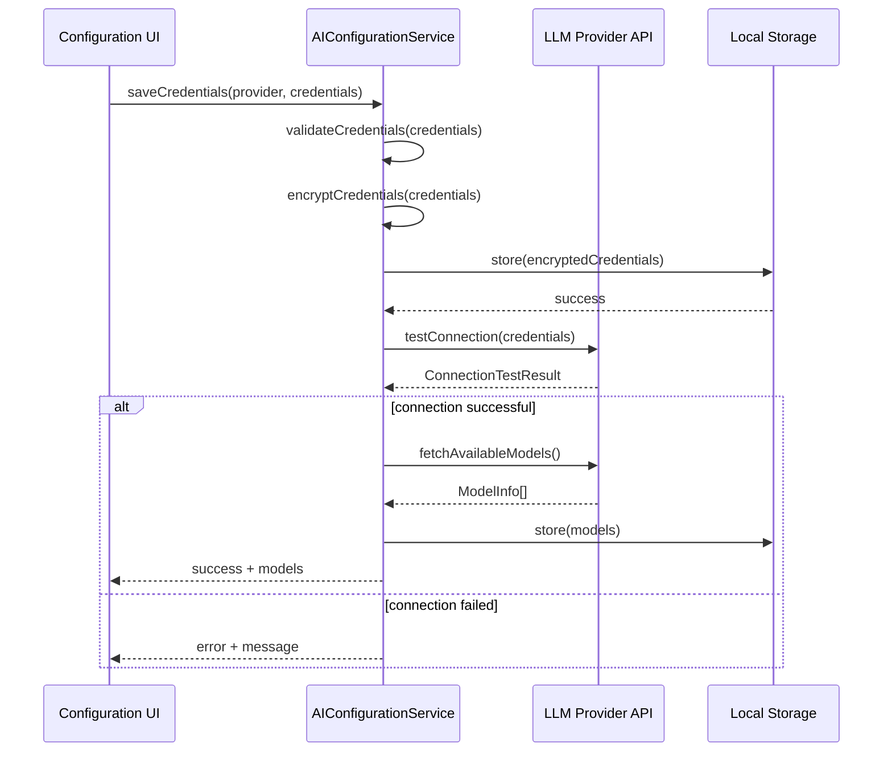
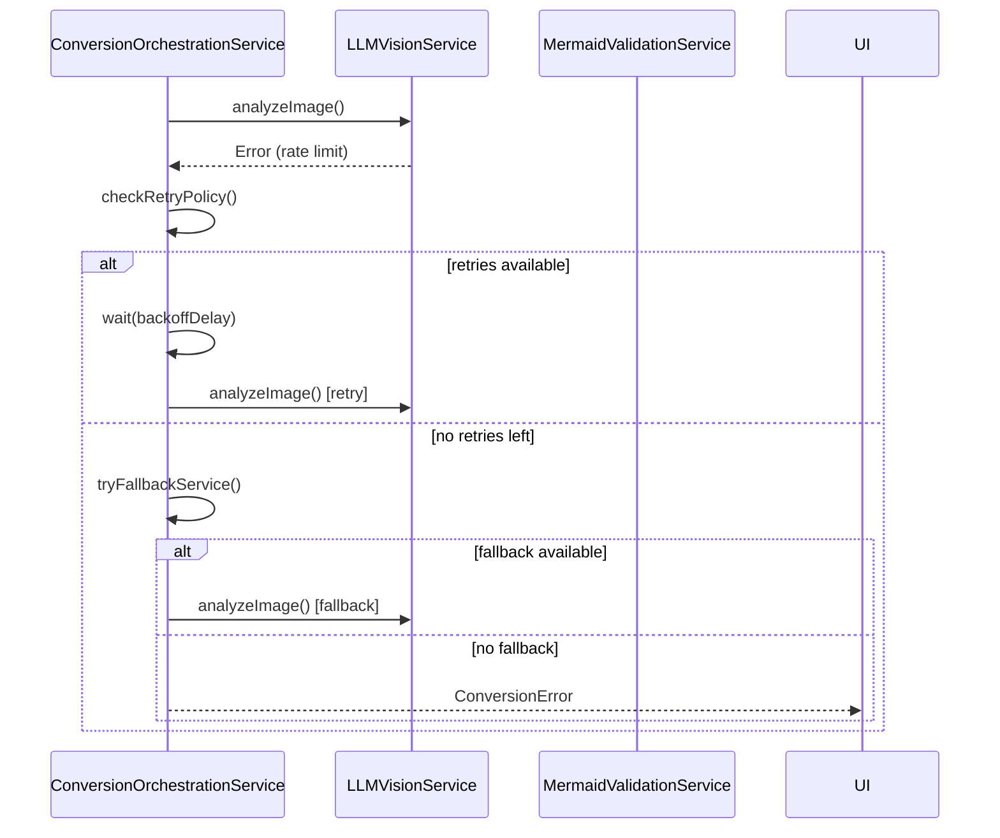

# Service Architecture

## Service Overview

The image-to-diagram conversion feature requires several services to handle different aspects of the conversion pipeline. These services are designed to be modular, testable, and easily configurable.

## Core Services

### AIConfigurationService
**Purpose**: Manage LLM provider credentials and model selection
**Responsibilities**:
- Store and retrieve LLM provider credentials securely in browser local storage
- Support multiple providers: OpenAI, GCP Gemini, AWS Claude, Ollama
- Test credential validity with provider APIs
- Fetch and display available models for configured providers
- Manage user's selected model preferences
- Provide credential encryption/decryption for local storage
- Handle credential updates and deletion

**Service Interface**:
```typescript
interface AIConfigurationService {
  // Credential Management
  saveCredentials(provider: LLMProvider, credentials: ProviderCredentials): Promise<void>;
  getCredentials(provider: LLMProvider): Promise<ProviderCredentials | null>;
  deleteCredentials(provider: LLMProvider): Promise<void>;
  listConfiguredProviders(): Promise<LLMProvider[]>;
  
  // Model Management
  testConnection(provider: LLMProvider): Promise<ConnectionTestResult>;
  fetchAvailableModels(provider: LLMProvider): Promise<ModelInfo[]>;
  setSelectedModel(provider: LLMProvider, modelId: string): Promise<void>;
  getSelectedModel(provider: LLMProvider): Promise<string | null>;
  
  // Configuration Status
  isConfigured(): Promise<boolean>;
  getConfigurationStatus(): Promise<ConfigurationStatus>;
}

interface ProviderCredentials {
  provider: LLMProvider;
  credentials: {
    // OpenAI
    apiKey?: string;
    // GCP Gemini
    geminiApiKey?: string;
    // AWS Claude
    awsClientId?: string;
    awsClientSecret?: string;
    awsRegion?: string;
    // Ollama
    ollamaEndpoint?: string;
  };
}

interface ConnectionTestResult {
  success: boolean;
  message: string;
  availableModels?: ModelInfo[];
  error?: string;
}

interface ModelInfo {
  id: string;
  name: string;
  description?: string;
  capabilities: string[];
  contextWindow?: number;
}

interface ConfigurationStatus {
  hasAnyProvider: boolean;
  configuredProviders: LLMProvider[];
  selectedProvider?: LLMProvider;
  selectedModel?: string;
  lastTested?: Date;
}

type LLMProvider = 'openai' | 'gemini' | 'aws' | 'claude' | 'ollama';
```

**Service Orchestration**:
- Encrypt sensitive credentials before storing in local storage
- Validate credential format before saving
- Implement secure credential retrieval with decryption
- Cache model lists to reduce API calls
- Provide credential migration for schema updates

### LLMVisionService
**Purpose**: Interface with various LLM vision models for image analysis
**Responsibilities**:
- Interface with configured LLM providers (OpenAI, GCP Gemini, AWS Claude, Ollama)
- Retrieve credentials from AIConfigurationService
- Process images and generate mermaid diagram descriptions
- Manage rate limiting and quota tracking
- Provide fallback mechanisms for service failures
- Support provider-specific API formats and requirements

**Service Interface**:
```typescript
interface LLMVisionService {
  analyzeImage(image: ImageBlob, options?: AnalysisOptions): Promise<AnalysisResult>;
  validateConnection(provider: LLMProvider): Promise<boolean>;
  getRateLimitStatus(provider: LLMProvider): Promise<RateLimitInfo>;
  getActiveProvider(): Promise<LLMProvider | null>;
}

interface AnalysisOptions {
  prompt?: string;
  maxTokens?: number;
  temperature?: number;
  retryAttempts?: number;
}

interface AnalysisResult {
  mermaidCode: string;
  confidence?: number;
  tokensUsed?: number;
  processingTime: number;
}
```

**Service Orchestration**:
- Automatically select best available service based on configuration
- Handle service failover when primary service is unavailable
- Aggregate results from multiple services for improved accuracy
- Cache successful results to reduce API calls

### ImageProcessingService
**Purpose**: Handle image input, validation, and preprocessing
**Responsibilities**:
- Accept images from multiple input sources (clipboard, file upload, drag & drop)
- Validate image formats and file sizes
- Convert images to optimal format for LLM processing
- Compress images while maintaining quality for analysis
- Extract metadata and provide image information

**Service Interface**:
```typescript
interface ImageProcessingService {
  processClipboardImage(clipboardData: DataTransfer): Promise<ProcessedImage>;
  processUploadedFiles(files: FileList): Promise<ProcessedImage[]>;
  processDragDropImage(dragData: DataTransfer): Promise<ProcessedImage[]>;
  validateImage(image: Blob): Promise<ValidationResult>;
  optimizeForAnalysis(image: ProcessedImage): Promise<OptimizedImage>;
}

interface ProcessedImage {
  blob: Blob;
  dataUrl: string;
  format: string;
  dimensions: { width: number; height: number };
  size: number;
  metadata: ImageMetadata;
}
```

**Service Orchestration**:
- Queue multiple image processing requests
- Provide progress callbacks for large image operations
- Handle concurrent processing of multiple images
- Maintain processing history for debugging

### MermaidValidationService
**Purpose**: Validate and refine generated mermaid code
**Responsibilities**:
- Parse mermaid syntax and identify errors
- Suggest corrections for common syntax issues
- Validate diagram semantics (proper connections, valid node types)
- Provide auto-correction for minor syntax errors
- Generate detailed error reports with line numbers

**Service Interface**:
```typescript
interface MermaidValidationService {
  validateSyntax(mermaidCode: string): Promise<ValidationResult>;
  suggestCorrections(code: string, errors: ValidationError[]): Promise<string[]>;
  autoCorrect(code: string): Promise<CorrectionResult>;
  getDiagramInfo(code: string): Promise<DiagramInfo>;
}

interface ValidationResult {
  isValid: boolean;
  errors: ValidationError[];
  warnings: ValidationWarning[];
  diagramType: string;
}

interface CorrectionResult {
  correctedCode: string;
  changes: CodeChange[];
  confidence: number;
}
```

**Service Orchestration**:
- Integrate with mermaid parser for syntax validation
- Provide real-time validation during code editing
- Cache validation results for performance
- Support multiple mermaid diagram types

### ConversionOrchestrationService
**Purpose**: Coordinate the entire image-to-diagram conversion pipeline
**Responsibilities**:
- Manage the complete conversion workflow
- Handle error recovery and retry logic
- Coordinate between different services
- Provide progress tracking and status updates
- Manage conversion sessions and state

**Service Interface**:
```typescript
interface ConversionOrchestrationService {
  startConversion(image: ProcessedImage, options: ConversionOptions): Promise<string>;
  getConversionStatus(sessionId: string): Promise<ConversionStatus>;
  cancelConversion(sessionId: string): Promise<void>;
  retryConversion(sessionId: string, options?: RetryOptions): Promise<string>;
}

interface ConversionOptions {
  llmService: LLMServiceConfig;
  validationLevel: 'strict' | 'lenient' | 'none';
  maxRetries: number;
  timeout: number;
  progressCallback?: (status: ConversionStatus) => void;
}

interface ConversionStatus {
  sessionId: string;
  stage: 'processing' | 'analyzing' | 'validating' | 'complete' | 'error';
  progress: number;
  message: string;
  result?: string;
  error?: Error;
}
```

**Service Orchestration**:
- Implement state machine for conversion workflow
- Handle parallel processing when beneficial
- Provide rollback capabilities for failed conversions
- Maintain audit trail of conversion attempts

## Service Interactions

### AI Configuration Flow


### Conversion Pipeline Flow
```mermaid
sequenceDiagram
    participant UI as User Interface
    participant CO as ConversionOrchestrationService
    participant AC as AIConfigurationService
    participant IP as ImageProcessingService
    participant LLM as LLMVisionService
    participant MV as MermaidValidationService
    participant ME as MermaidToExcalidraw
    
    UI->>CO: startConversion(image, options)
    CO->>AC: isConfigured()
    AC-->>CO: true/false
    
    alt not configured
        CO-->>UI: Error: No AI provider configured
    else configured
        CO->>AC: getSelectedModel()
        AC-->>CO: provider + model
        CO->>IP: processImage(image)
    IP-->>CO: ProcessedImage
    
    CO->>LLM: analyzeImage(processedImage)
    LLM-->>CO: mermaidCode
    
    CO->>MV: validateSyntax(mermaidCode)
    MV-->>CO: ValidationResult
    
    alt validation fails
        CO->>MV: autoCorrect(mermaidCode)
        MV-->>CO: correctedCode
        CO->>LLM: refineMermaidCode(correctedCode, errors)
        LLM-->>CO: refinedCode
    end
    
    CO->>ME: convertToExcalidraw(validatedCode)
    ME-->>CO: ExcalidrawElements
    
    CO-->>UI: ConversionResult
```

### Error Handling Flow


## Service Configuration

### Credential Storage Strategy

All LLM provider credentials are stored in browser local storage with encryption:

```typescript
// Storage key format
const STORAGE_KEYS = {
  CREDENTIALS: 'excalidraw_ai_credentials',
  SELECTED_PROVIDER: 'excalidraw_ai_selected_provider',
  SELECTED_MODEL: 'excalidraw_ai_selected_model',
  MODEL_CACHE: 'excalidraw_ai_model_cache'
};

// Encrypted storage format
interface StoredCredentials {
  version: string;
  providers: {
    [key in LLMProvider]?: {
      encrypted: string; // Encrypted credential data
      lastUpdated: string;
      lastTested?: string;
    };
  };
}
```

### LLM Service Providers

#### OpenAI Configuration
```typescript
interface OpenAICredentials {
  provider: 'openai';
  apiKey: string;
  endpoint?: string; // Optional custom endpoint
}

// Default models
const OPENAI_MODELS = [
  { id: 'gpt-4-vision-preview', name: 'GPT-4 Vision', capabilities: ['vision', 'code'] },
  { id: 'gpt-4o', name: 'GPT-4 Omni', capabilities: ['vision', 'code', 'fast'] }
];
```

#### GCP Gemini Configuration
```typescript
interface GeminiCredentials {
  provider: 'gemini';
  apiKey: string;
  projectId?: string;
}

// Default models
const GEMINI_MODELS = [
  { id: 'gemini-pro-vision', name: 'Gemini Pro Vision', capabilities: ['vision', 'code'] },
  { id: 'gemini-2.5-pro', name: 'Gemini 2.0 Pro', capabilities: ['vision', 'code', 'large-context'] }
];
```

#### AWS Claude Configuration
```typescript
interface ClaudeCredentials {
  provider: 'claude';
  awsClientId: string;
  awsClientSecret: string;
  awsRegion: string;
}

// Default models
const CLAUDE_MODELS = [
  { id: 'claude-3-opus', name: 'Claude 3 Opus', capabilities: ['vision', 'code', 'reasoning'] },
  { id: 'claude-3-sonnet', name: 'Claude 3 Sonnet', capabilities: ['vision', 'code', 'fast'] }
];
```

#### Ollama Local Configuration
```typescript
interface OllamaCredentials {
  provider: 'ollama';
  endpoint: string; // e.g., http://localhost:11434
}

// Models fetched dynamically from Ollama instance
// Common models: llava, bakllava, llava-phi3
```

### Service Registry
```typescript
class ServiceRegistry {
  private services = new Map<string, any>();
  
  register<T>(name: string, service: T): void;
  get<T>(name: string): T;
  configure(config: ServiceConfig): void;
}

// Usage
const registry = new ServiceRegistry();
registry.register('llmVision', new LLMVisionService());
registry.register('imageProcessing', new ImageProcessingService());
registry.register('mermaidValidation', new MermaidValidationService());
registry.register('conversionOrchestration', new ConversionOrchestrationService());
```

## Service Testing Strategy

### Unit Testing
- Mock external API calls for consistent testing
- Test error handling and retry logic
- Validate service configuration and validation
- Test service interactions and data flow

### Integration Testing
- Test with real LLM services in development environment
- Validate end-to-end conversion pipeline
- Test service failover and fallback mechanisms
- Performance testing with various image sizes and types

### Service Mocking
```typescript
class MockLLMVisionService implements LLMVisionService {
  async analyzeImage(image: ImageBlob): Promise<AnalysisResult> {
    // Return predictable test results
    return {
      mermaidCode: 'flowchart TD\n  A --> B',
      confidence: 0.95,
      processingTime: 1000
    };
  }
}
```

## Performance Considerations

### Caching Strategy
- Cache successful LLM analysis results by image hash
- Cache mermaid validation results
- Implement TTL-based cache expiration
- Use browser storage for offline caching

### Resource Management
- Limit concurrent LLM requests to prevent rate limiting
- Implement request queuing for high-volume usage
- Monitor memory usage during image processing
- Cleanup resources after conversion completion

### Optimization Techniques
- Compress images before sending to LLM services
- Use WebWorkers for CPU-intensive image processing
- Implement progressive loading for large images
- Batch multiple requests when possible