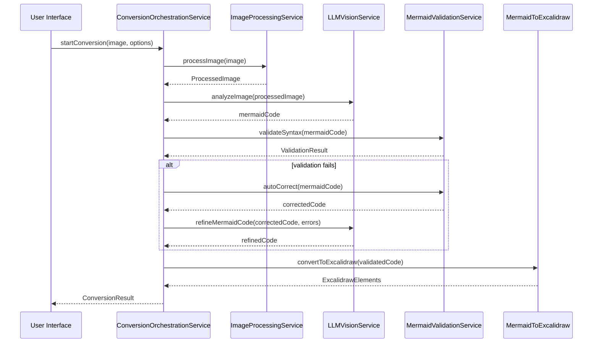
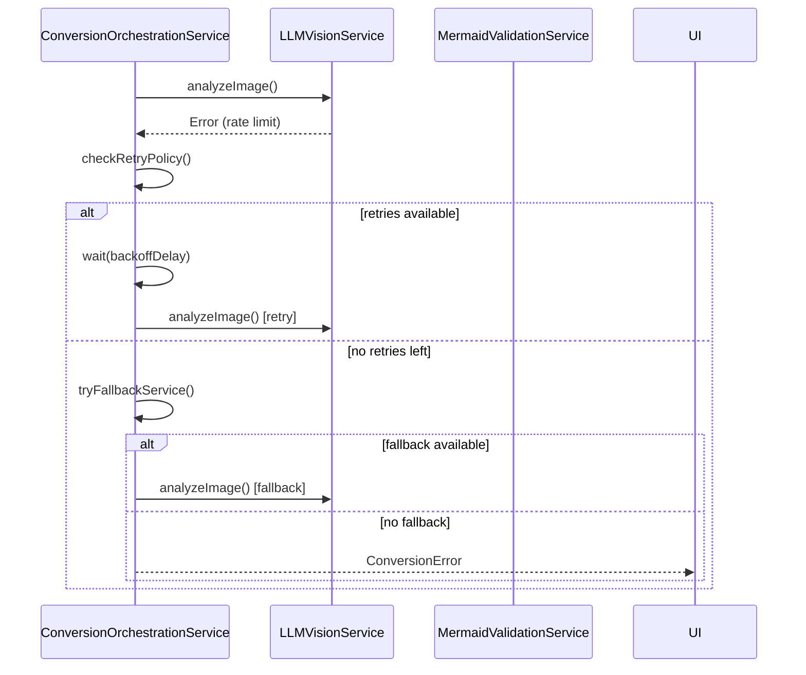

# Service Architecture

## Service Overview

The image-to-diagram conversion feature requires several services to handle different aspects of the conversion pipeline. These services are designed to be modular, testable, and easily configurable.

## Core Services

### LLMVisionService
**Purpose**: Interface with various LLM vision models for image analysis
**Responsibilities**:
- Manage connections to different LLM providers (OpenAI, Ollama, custom endpoints)
- Handle authentication and API key management
- Process images and generate mermaid diagram descriptions
- Manage rate limiting and quota tracking
- Provide fallback mechanisms for service failures

**Service Interface**:
```typescript
interface LLMVisionService {
  configure(config: LLMServiceConfig): Promise<void>;
  analyzeImage(image: ImageBlob, options?: AnalysisOptions): Promise<AnalysisResult>;
  validateConnection(): Promise<boolean>;
  getRateLimitStatus(): Promise<RateLimitInfo>;
}

interface AnalysisOptions {
  prompt?: string;
  maxTokens?: number;
  temperature?: number;
  retryAttempts?: number;
}

interface AnalysisResult {
  mermaidCode: string;
  confidence?: number;
  tokensUsed?: number;
  processingTime: number;
}
```

**Service Orchestration**:
- Automatically select best available service based on configuration
- Handle service failover when primary service is unavailable
- Aggregate results from multiple services for improved accuracy
- Cache successful results to reduce API calls

### ImageProcessingService
**Purpose**: Handle image input, validation, and preprocessing
**Responsibilities**:
- Accept images from multiple input sources (clipboard, file upload, drag & drop)
- Validate image formats and file sizes
- Convert images to optimal format for LLM processing
- Compress images while maintaining quality for analysis
- Extract metadata and provide image information

**Service Interface**:
```typescript
interface ImageProcessingService {
  processClipboardImage(clipboardData: DataTransfer): Promise<ProcessedImage>;
  processUploadedFiles(files: FileList): Promise<ProcessedImage[]>;
  processDragDropImage(dragData: DataTransfer): Promise<ProcessedImage[]>;
  validateImage(image: Blob): Promise<ValidationResult>;
  optimizeForAnalysis(image: ProcessedImage): Promise<OptimizedImage>;
}

interface ProcessedImage {
  blob: Blob;
  dataUrl: string;
  format: string;
  dimensions: { width: number; height: number };
  size: number;
  metadata: ImageMetadata;
}
```

**Service Orchestration**:
- Queue multiple image processing requests
- Provide progress callbacks for large image operations
- Handle concurrent processing of multiple images
- Maintain processing history for debugging

### MermaidValidationService
**Purpose**: Validate and refine generated mermaid code
**Responsibilities**:
- Parse mermaid syntax and identify errors
- Suggest corrections for common syntax issues
- Validate diagram semantics (proper connections, valid node types)
- Provide auto-correction for minor syntax errors
- Generate detailed error reports with line numbers

**Service Interface**:
```typescript
interface MermaidValidationService {
  validateSyntax(mermaidCode: string): Promise<ValidationResult>;
  suggestCorrections(code: string, errors: ValidationError[]): Promise<string[]>;
  autoCorrect(code: string): Promise<CorrectionResult>;
  getDiagramInfo(code: string): Promise<DiagramInfo>;
}

interface ValidationResult {
  isValid: boolean;
  errors: ValidationError[];
  warnings: ValidationWarning[];
  diagramType: string;
}

interface CorrectionResult {
  correctedCode: string;
  changes: CodeChange[];
  confidence: number;
}
```

**Service Orchestration**:
- Integrate with mermaid parser for syntax validation
- Provide real-time validation during code editing
- Cache validation results for performance
- Support multiple mermaid diagram types

### ConversionOrchestrationService
**Purpose**: Coordinate the entire image-to-diagram conversion pipeline
**Responsibilities**:
- Manage the complete conversion workflow
- Handle error recovery and retry logic
- Coordinate between different services
- Provide progress tracking and status updates
- Manage conversion sessions and state

**Service Interface**:
```typescript
interface ConversionOrchestrationService {
  startConversion(image: ProcessedImage, options: ConversionOptions): Promise<string>;
  getConversionStatus(sessionId: string): Promise<ConversionStatus>;
  cancelConversion(sessionId: string): Promise<void>;
  retryConversion(sessionId: string, options?: RetryOptions): Promise<string>;
}

interface ConversionOptions {
  llmService: LLMServiceConfig;
  validationLevel: 'strict' | 'lenient' | 'none';
  maxRetries: number;
  timeout: number;
  progressCallback?: (status: ConversionStatus) => void;
}

interface ConversionStatus {
  sessionId: string;
  stage: 'processing' | 'analyzing' | 'validating' | 'complete' | 'error';
  progress: number;
  message: string;
  result?: string;
  error?: Error;
}
```

**Service Orchestration**:
- Implement state machine for conversion workflow
- Handle parallel processing when beneficial
- Provide rollback capabilities for failed conversions
- Maintain audit trail of conversion attempts

## Service Interactions

### Conversion Pipeline Flow


### Error Handling Flow


## Service Configuration

### LLM Service Providers

#### OpenAI GPT-4 Vision
```typescript
const openAIConfig: LLMServiceConfig = {
  provider: 'openai',
  apiKey: process.env.OPENAI_API_KEY,
  model: 'gpt-4-vision-preview',
  endpoint: 'https://api.openai.com/v1/chat/completions',
  maxTokens: 1000,
  temperature: 0.1
};
```

#### Ollama Local Model
```typescript
const ollamaConfig: LLMServiceConfig = {
  provider: 'ollama',
  endpoint: 'http://localhost:11434/api/generate',
  model: 'llava:latest',
  offline: true
};
```

#### Custom LLM Service
```typescript
const customConfig: LLMServiceConfig = {
  provider: 'custom',
  endpoint: 'https://custom-llm-api.example.com/analyze',
  apiKey: 'custom-api-key',
  headers: {
    'Custom-Header': 'value'
  }
};
```

### Service Registry
```typescript
class ServiceRegistry {
  private services = new Map<string, any>();
  
  register<T>(name: string, service: T): void;
  get<T>(name: string): T;
  configure(config: ServiceConfig): void;
}

// Usage
const registry = new ServiceRegistry();
registry.register('llmVision', new LLMVisionService());
registry.register('imageProcessing', new ImageProcessingService());
registry.register('mermaidValidation', new MermaidValidationService());
registry.register('conversionOrchestration', new ConversionOrchestrationService());
```

## Service Testing Strategy

### Unit Testing
- Mock external API calls for consistent testing
- Test error handling and retry logic
- Validate service configuration and validation
- Test service interactions and data flow

### Integration Testing
- Test with real LLM services in development environment
- Validate end-to-end conversion pipeline
- Test service failover and fallback mechanisms
- Performance testing with various image sizes and types

### Service Mocking
```typescript
class MockLLMVisionService implements LLMVisionService {
  async analyzeImage(image: ImageBlob): Promise<AnalysisResult> {
    // Return predictable test results
    return {
      mermaidCode: 'flowchart TD\n  A --> B',
      confidence: 0.95,
      processingTime: 1000
    };
  }
}
```

## Performance Considerations

### Caching Strategy
- Cache successful LLM analysis results by image hash
- Cache mermaid validation results
- Implement TTL-based cache expiration
- Use browser storage for offline caching

### Resource Management
- Limit concurrent LLM requests to prevent rate limiting
- Implement request queuing for high-volume usage
- Monitor memory usage during image processing
- Cleanup resources after conversion completion

### Optimization Techniques
- Compress images before sending to LLM services
- Use WebWorkers for CPU-intensive image processing
- Implement progressive loading for large images
- Batch multiple requests when possible