# Execution Plan

## Detailed Analysis Summary

### Transformation Scope
- **Transformation Type**: Single component addition with new UI integration
- **Primary Changes**: Add image-to-diagram conversion pipeline to existing Excalidraw
- **Related Components**: Main toolbar, action system, mermaid integration, settings

### Change Impact Assessment
- **User-facing changes**: Yes - New toolbar button and conversion workflow
- **Structural changes**: No - Leverages existing architecture patterns
- **Data model changes**: No - Uses existing element types via mermaid conversion
- **API changes**: No - Internal feature addition only
- **NFR impact**: Yes - Performance considerations for image processing and LLM calls

### Component Relationships
**Primary Component**: New ImageToMermaidConverter component
**UI Components**: Toolbar button, conversion dialog, settings panel
**Integration Points**: Action system, mermaid-to-excalidraw package, file handling
**External Services**: Configurable LLM vision APIs

### Risk Assessment
- **Risk Level**: Medium
- **Rollback Complexity**: Easy - Feature can be disabled/removed without affecting core functionality
- **Testing Complexity**: Moderate - Requires mocking LLM services and testing various image inputs

## Workflow Visualization

```mermaid
flowchart TD
    Start(["User Request"])
    
    subgraph INCEPTION["🔵 INCEPTION PHASE"]
        WD["Workspace Detection<br/><b>COMPLETED</b>"]
        RE["Reverse Engineering<br/><b>COMPLETED</b>"]
        RA["Requirements Analysis<br/><b>COMPLETED</b>"]
        US["User Stories<br/><b>SKIP</b>"]
        WP["Workflow Planning<br/><b>IN PROGRESS</b>"]
        AD["Application Design<br/><b>EXECUTE</b>"]
        UP["Units Planning<br/><b>SKIP</b>"]
        UG["Units Generation<br/><b>SKIP</b>"]
    end
    
    subgraph CONSTRUCTION["🟢 CONSTRUCTION PHASE"]
        FD["Functional Design<br/><b>SKIP</b>"]
        NFRA["NFR Requirements Assessment<br/><b>SKIP</b>"]
        NFRD["NFR Design<br/><b>SKIP</b>"]
        ID["Infrastructure Design<br/><b>SKIP</b>"]
        CP["Code Planning<br/><b>EXECUTE</b>"]
        CG["Code Generation<br/><b>EXECUTE</b>"]
        BT["Build and Test<br/><b>EXECUTE</b>"]
    end
    
    subgraph OPERATIONS["🟡 OPERATIONS PHASE"]
        OPS["Operations<br/><b>PLACEHOLDER</b>"]
    end
    
    Start --> WD
    WD --> RE
    RE --> RA
    RA --> WP
    WP --> AD
    AD --> CP
    CP --> CG
    CG --> BT
    BT --> End(["Complete"])
    
    style WD fill:#90EE90,stroke:#2d5016,stroke-width:3px
    style RE fill:#90EE90,stroke:#2d5016,stroke-width:3px
    style RA fill:#90EE90,stroke:#2d5016,stroke-width:3px
    style WP fill:#FFE4B5,stroke:#8B7355,stroke-width:2px
    style AD fill:#FFE4B5,stroke:#8B7355,stroke-width:2px,stroke-dasharray: 5 5
    style US fill:#f0f0f0,stroke:#999999,stroke-width:2px,stroke-dasharray: 5 5
    style UP fill:#f0f0f0,stroke:#999999,stroke-width:2px,stroke-dasharray: 5 5
    style UG fill:#f0f0f0,stroke:#999999,stroke-width:2px,stroke-dasharray: 5 5
    style FD fill:#f0f0f0,stroke:#999999,stroke-width:2px,stroke-dasharray: 5 5
    style NFRA fill:#f0f0f0,stroke:#999999,stroke-width:2px,stroke-dasharray: 5 5
    style NFRD fill:#f0f0f0,stroke:#999999,stroke-width:2px,stroke-dasharray: 5 5
    style ID fill:#f0f0f0,stroke:#999999,stroke-width:2px,stroke-dasharray: 5 5
    style CP fill:#90EE90,stroke:#2d5016,stroke-width:3px
    style CG fill:#90EE90,stroke:#2d5016,stroke-width:3px
    style BT fill:#90EE90,stroke:#2d5016,stroke-width:3px
    style Start fill:#E6E6FA,stroke:#4B0082,stroke-width:2px
    style End fill:#E6E6FA,stroke:#4B0082,stroke-width:2px
```

## Phases to Execute

### 🔵 INCEPTION PHASE
- [x] Workspace Detection (COMPLETED)
- [x] Reverse Engineering (COMPLETED) 
- [x] Requirements Analysis (COMPLETED) - Depth: Standard
- [x] User Stories (SKIPPED) - Single feature addition, clear requirements
- [x] Workflow Planning (COMPLETED)
- [x] Application Design (COMPLETED) - Depth: Standard
  - **Rationale**: Component architecture, UI integration, and LLM service abstraction designed

### 🟢 CONSTRUCTION PHASE
- [x] Functional Design - SKIP
  - **Rationale**: Application Design covered component design sufficiently
- [x] NFR Requirements Assessment - SKIP
  - **Rationale**: NFR requirements already captured in requirements document
- [x] NFR Design - SKIP
  - **Rationale**: Performance and security patterns are straightforward for this feature
- [x] Infrastructure Design - SKIP
  - **Rationale**: No new infrastructure needed, uses existing browser APIs and external LLM services
- [x] Code Planning (COMPLETED) - Depth: Standard
  - **Rationale**: Implementation approach defined with 34 steps across 8 phases
- [ ] Code Generation (IN PROGRESS) - Depth: Standard
  - **Phase 1: Core Services** ✅ COMPLETED
    - AIConfigurationService, all 4 LLM adapters, LLMVisionService
    - ImageProcessingService, MermaidValidationService, ConversionOrchestrationService
  - **Phase 2: State Management** ✅ COMPLETED
    - Jotai atoms for AI configuration and conversion state
  - **Phase 3: UI Components** 🔄 IN PROGRESS
  - **Phase 4: Actions & Integration** ⏳ PENDING
  - **Phase 5: Mermaid Integration** ⏳ PENDING
  - **Phase 6: Error Handling & Polish** ⏳ PENDING
  - **Phase 7: Documentation** ⏳ PENDING
  - **Phase 8: Testing** ⏳ PENDING
- [ ] Build and Test - PENDING
  - **Rationale**: Build, test, and verification needed after code generation

### 🟡 OPERATIONS PHASE
- [ ] Operations - PLACEHOLDER
  - **Rationale**: Future deployment and monitoring workflows

## Estimated Timeline
- **Total Phases**: 4 (Application Design + Code Planning + Code Generation + Build & Test)
- **Estimated Duration**: 2-3 development cycles

## Success Criteria
- **Primary Goal**: Add image-to-diagram conversion feature that integrates seamlessly with Excalidraw
- **Key Deliverables**: 
  - New toolbar button and conversion UI
  - LLM service integration layer
  - Image processing pipeline
  - Mermaid code generation and validation
  - Integration with existing mermaid-to-excalidraw package
- **Quality Gates**: 
  - Feature works with common diagram screenshots
  - Configurable LLM service selection
  - Proper error handling and user feedback
  - No impact on existing Excalidraw functionality