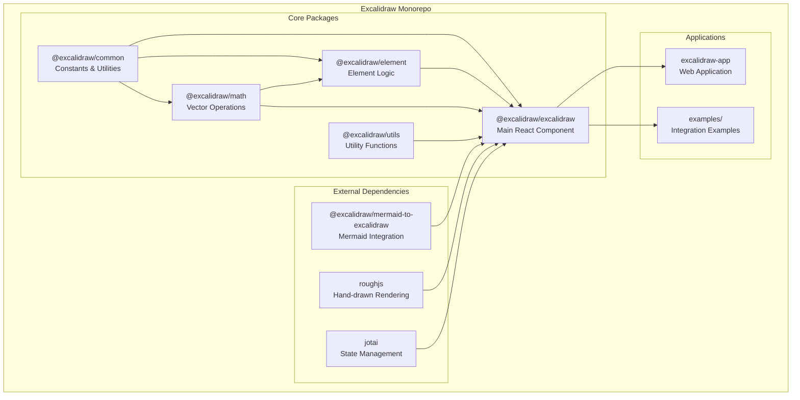
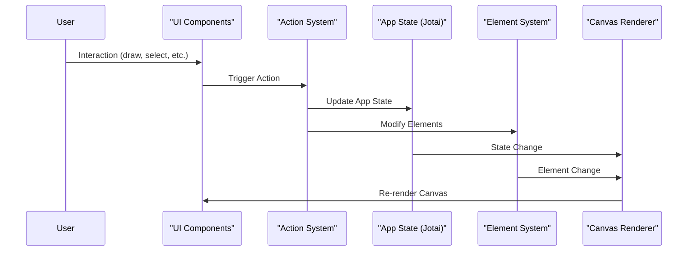

# System Architecture

## System Overview
Excalidraw is a React-based virtual whiteboard application with a monorepo architecture. It consists of a core drawing library and a web application, designed for creating hand-drawn style diagrams with real-time collaboration capabilities.

## Architecture Diagram

## Component Descriptions

### @excalidraw/common
- **Purpose**: Shared constants, enums, and basic utilities
- **Responsibilities**: Common types, constants, basic helper functions
- **Dependencies**: None (base package)
- **Type**: Foundation Package

### @excalidraw/math
- **Purpose**: Mathematical operations for 2D graphics
- **Responsibilities**: Vector operations, geometric calculations, transformations
- **Dependencies**: @excalidraw/common
- **Type**: Utility Package

### @excalidraw/element
- **Purpose**: Element manipulation and management
- **Responsibilities**: Element creation, bounds calculation, collision detection, text handling
- **Dependencies**: @excalidraw/common, @excalidraw/math
- **Type**: Core Logic Package

### @excalidraw/utils
- **Purpose**: Standalone utility functions
- **Responsibilities**: File handling, image processing, font management
- **Dependencies**: Various external libraries (browser-fs-access, pico, etc.)
- **Type**: Utility Package

### @excalidraw/excalidraw
- **Purpose**: Main React component library
- **Responsibilities**: UI components, canvas rendering, user interactions, state management
- **Dependencies**: All other packages + external libraries
- **Type**: Main Package

### excalidraw-app
- **Purpose**: Full-featured web application
- **Responsibilities**: Collaboration features, Firebase integration, PWA functionality
- **Dependencies**: @excalidraw/excalidraw
- **Type**: Application

## Data Flow

## Integration Points

### External APIs
- **Mermaid Integration**: `@excalidraw/mermaid-to-excalidraw` for diagram conversion
- **File System**: `browser-fs-access` for file operations
- **Firebase**: Real-time collaboration and data persistence (web app only)

### Databases
- **Local Storage**: Browser local storage for offline persistence
- **IndexedDB**: For larger data storage (images, libraries)
- **Firebase Firestore**: Real-time collaboration data (web app only)

### Third-party Services
- **Sentry**: Error tracking and monitoring
- **Vercel**: Hosting and deployment
- **Crowdin**: Internationalization management

## Infrastructure Components

### Build System
- **Primary**: Vite with esbuild for fast compilation
- **Package Manager**: Yarn workspaces for monorepo management
- **TypeScript**: Strict type checking across all packages

### Deployment Model
- **Library**: NPM package distribution
- **Web App**: Static site deployment on Vercel
- **Examples**: Separate deployments for integration demos

### Networking
- **CDN**: Static assets served via CDN
- **WebSockets**: Real-time collaboration (Socket.io)
- **PWA**: Service worker for offline functionality