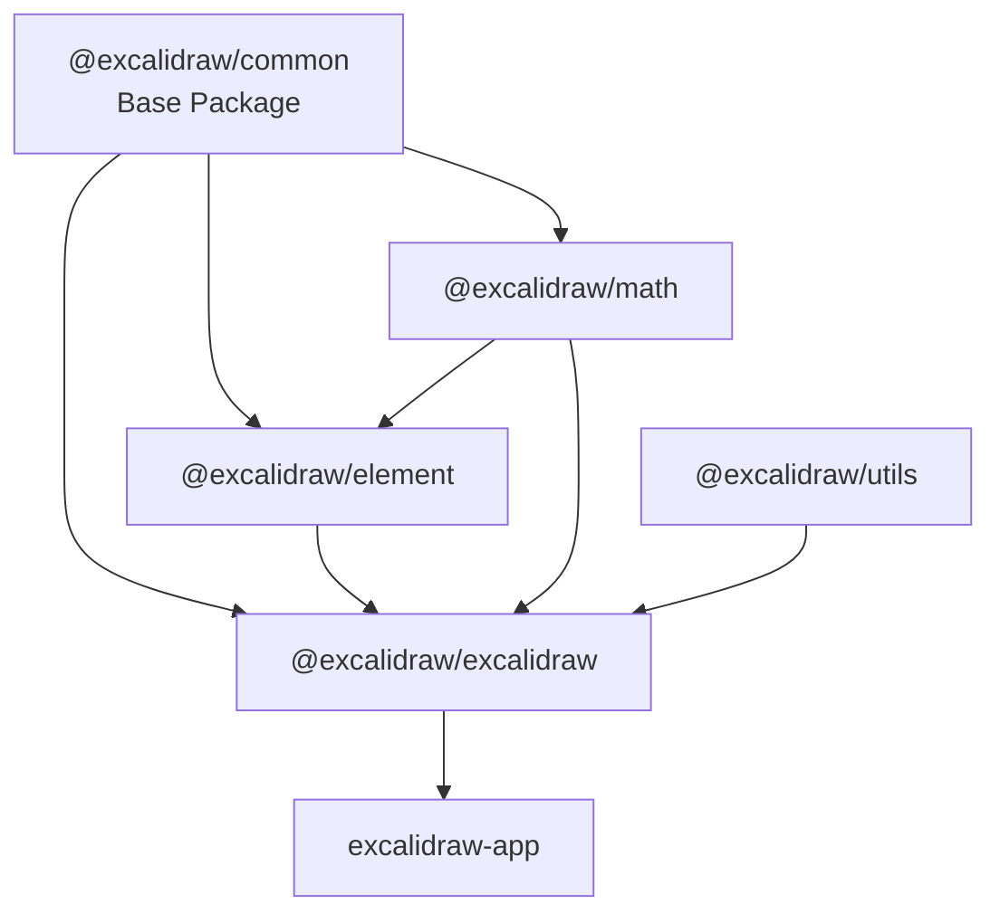

# Dependencies

## Internal Dependencies

### @excalidraw/math depends on @excalidraw/common
- **Type**: Compile/Runtime
- **Reason**: Uses shared constants and utility types

### @excalidraw/element depends on @excalidraw/common, @excalidraw/math
- **Type**: Compile/Runtime
- **Reason**: Element manipulation requires math operations and shared constants

### @excalidraw/excalidraw depends on all packages
- **Type**: Compile/Runtime
- **Reason**: Main package integrates all functionality

### excalidraw-app depends on @excalidraw/excalidraw
- **Type**: Compile/Runtime
- **Reason**: Web application uses the core drawing component

## External Dependencies

### Core Framework Dependencies
#### react (^17.0.2 || ^18.2.0 || ^19.0.0)
- **Purpose**: UI framework for component-based architecture
- **License**: MIT

#### react-dom (^17.0.2 || ^18.2.0 || ^19.0.0)
- **Purpose**: DOM rendering for React components
- **License**: MIT

### Drawing & Graphics Dependencies
#### roughjs (4.6.4)
- **Purpose**: Hand-drawn style rendering engine
- **License**: MIT

#### perfect-freehand (1.2.0)
- **Purpose**: Smooth freehand drawing algorithms
- **License**: MIT

#### points-on-curve (1.0.1)
- **Purpose**: Calculate points along curves for smooth drawing
- **License**: MIT

### State Management Dependencies
#### jotai (2.11.0)
- **Purpose**: Atomic state management for React
- **License**: MIT

#### jotai-scope (0.7.2)
- **Purpose**: Scoped state management for isolated contexts
- **License**: MIT

### File & Image Processing Dependencies
#### browser-fs-access (0.29.1)
- **Purpose**: Modern file system access API with fallbacks
- **License**: Apache-2.0

#### pica (7.1.1)
- **Purpose**: High-quality image resizing in browsers
- **License**: MIT

#### image-blob-reduce (3.0.1)
- **Purpose**: Image compression and optimization
- **License**: MIT

#### pako (2.0.3)
- **Purpose**: Zlib/gzip compression for data serialization
- **License**: MIT

### UI Component Dependencies
#### @radix-ui/react-popover (1.1.6)
- **Purpose**: Accessible popover components
- **License**: MIT

#### @radix-ui/react-tabs (1.1.3)
- **Purpose**: Accessible tab components
- **License**: MIT

### Utility Dependencies
#### lodash.throttle (4.1.1)
- **Purpose**: Function throttling for performance optimization
- **License**: MIT

#### lodash.debounce (4.0.8)
- **Purpose**: Function debouncing for input handling
- **License**: MIT

#### nanoid (3.3.3)
- **Purpose**: Unique ID generation for elements
- **License**: MIT

#### clsx (1.1.1)
- **Purpose**: Conditional CSS class name utility
- **License**: MIT

### Mermaid Integration Dependencies
#### @excalidraw/mermaid-to-excalidraw (1.1.3)
- **Purpose**: Convert Mermaid diagrams to Excalidraw elements
- **License**: MIT

### Build & Development Dependencies
#### vite (5.0.12)
- **Purpose**: Fast build tool and development server
- **License**: MIT

#### esbuild (0.19.10)
- **Purpose**: Fast JavaScript bundler
- **License**: MIT

#### typescript (4.9.4)
- **Purpose**: Type checking and compilation
- **License**: Apache-2.0

#### vitest (3.0.6)
- **Purpose**: Fast unit testing framework
- **License**: MIT

### Collaboration Dependencies (excalidraw-app only)
#### socket.io-client (4.7.2)
- **Purpose**: Real-time communication for collaboration
- **License**: MIT

#### firebase (11.3.1)
- **Purpose**: Backend services for data persistence and real-time sync
- **License**: Apache-2.0

### Font Processing Dependencies
#### fonteditor-core (2.4.1)
- **Purpose**: Font file processing and manipulation
- **License**: MIT

#### harfbuzzjs (0.3.6)
- **Purpose**: Text shaping for complex typography
- **License**: MIT