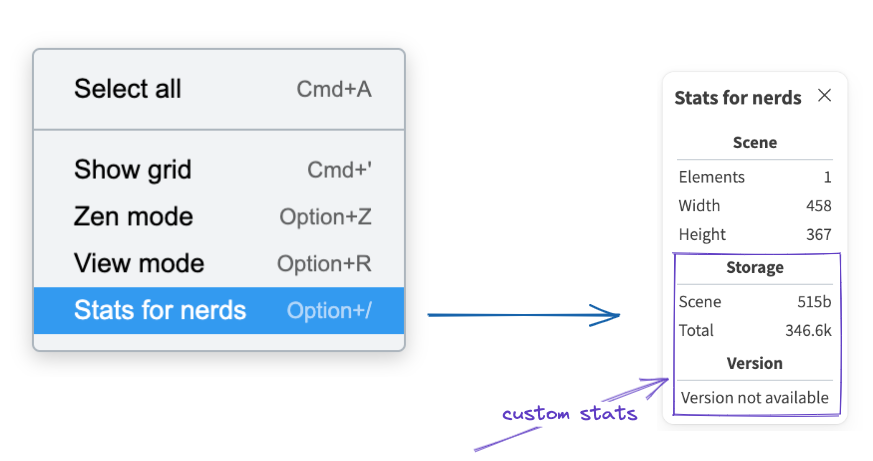

# Render Props

## renderTopRightUI

<pre>
  (isMobile: boolean, appState:
  <a href="https://github.com/excalidraw/excalidraw/blob/master/packages/excalidraw/types.ts#L95">
    AppState
  </a>) => JSX | null
</pre>

A function returning `JSX` to render `custom` UI in the top right corner of the app.

```jsx live
function App() {
  return (
    <div style={{ height: "500px" }}>
      <Excalidraw
        renderTopRightUI={() => {
          return (
            <button
              style={{
                background: "#70b1ec",
                border: "none",
                color: "#fff",
                width: "max-content",
                fontWeight: "bold",
              }}
              onClick={() => window.alert("This is dummy top right UI")}
            >
              Click me
            </button>
          );
        }}
      />
    </div>
  );
}
```

## renderCustomStats

A function that can be used to render custom stats (returns JSX) in the `nerd stats` dialog.



For example you can use this prop to render the size of the elements in the storage as do in [excalidraw.com](https://excalidraw.com).

```jsx live
function App() {
  return (
    <div style={{ height: "500px" }}>
      <Excalidraw
        renderCustomStats={() => (
          <p style={{ color: "#70b1ec", fontWeight: "bold" }}>
            Dummy stats will be shown here
          </p>
        )}
      />
    </div>
  );
}
```

## renderEmbeddable

<pre>
  (element: NonDeleted&lt;ExcalidrawEmbeddableElement&gt;, appState:{" "}
  <a href="https://github.com/excalidraw/excalidraw/blob/master/packages/excalidraw/types.ts#L95">
    AppState
  </a>
  ) => JSX.Element | null
</pre>

Allows you to replace the renderer for embeddable elements (which renders `<iframe>` elements).

| Parameter | Type | Description |
| --- | --- | --- |
| `element` | `NonDeleted<ExcalidrawEmbeddableElement>` | The embeddable element to be rendered. |
| `appState` | `AppState` | The current state of the UI. |
