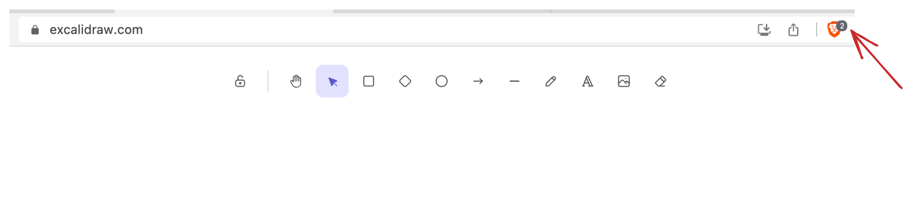
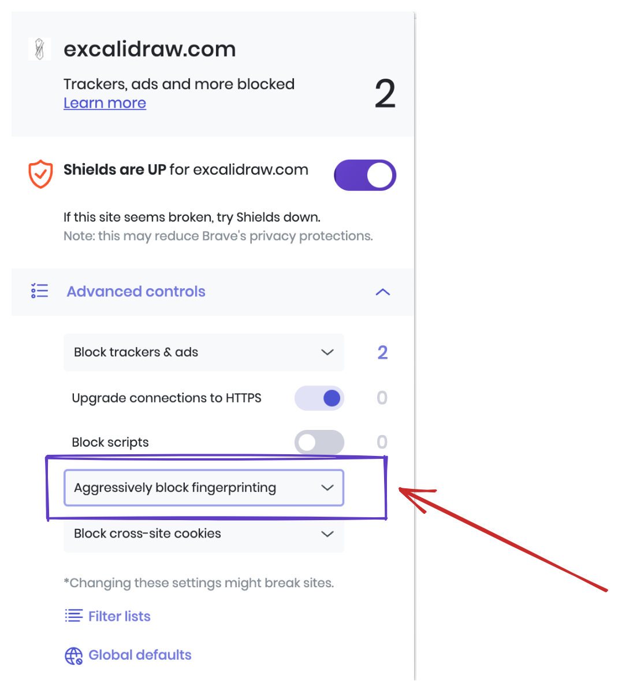
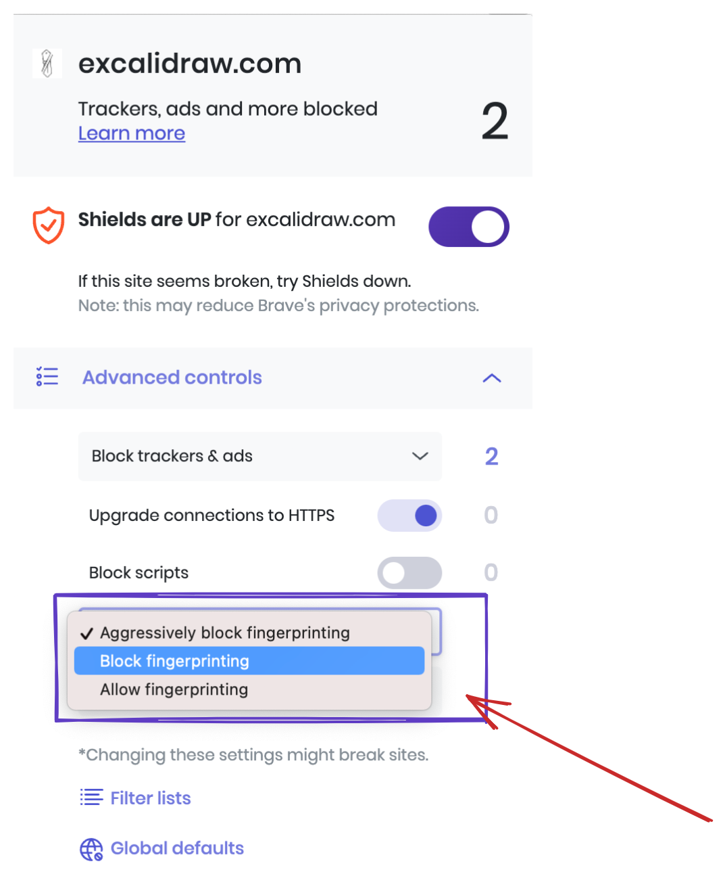

# FAQ

### Does this package support collaboration ?

No, Excalidraw package doesn't come with collaboration built in, since the implementation is specific to each host app. We expose APIs which you can use to communicate with Excalidraw which you can use to implement it. You can check our own implementation [here](https://github.com/excalidraw/excalidraw/blob/master/excalidraw-app/index.tsx). Here is a [detailed answer](https://github.com/excalidraw/excalidraw/discussions/3879#discussioncomment-1110524) on how you can achieve the same.

### Turning off Aggressive Anti-Fingerprinting in Brave browser

When *Aggressive Anti-Fingerprinting* is turned on, the `measureText` API breaks which in turn breaks the Text Elements in your drawings. Here is more [info](https://github.com/excalidraw/excalidraw/pull/6336) on the same.

We strongly recommend turning it off. You can follow the steps below on how to do so.


1. Open [excalidraw.com](https://excalidraw.com) in Brave and click on the **Shield** button


<div style={{width:'30rem'}}>

2. Once opened, look for **Aggressively Block Fingerprinting**


3. Switch to **Block Fingerprinting**


4. Thats all. All text elements should be fixed now 🎉

</div>

If disabling this setting doesn't fix the display of text elements, please consider opening an [issue](https://github.com/excalidraw/excalidraw/issues/new) on our GitHub, or message us on [Discord](https://discord.gg/UexuTaE).


### ReferenceError: process is not defined

When using `vite` or any build tools, you will have to make sure the `process` is accessible as we are accessing `process.env.IS_PREACT` to decide whether to use `preact` build.

Since Vite removes env variables by default, you can update the vite config to ensure its available :point_down:

```
 define: {
    "process.env.IS_PREACT": JSON.stringify("true"),
  },
```

## Need help?

Check out the existing [Q&A](https://github.com/excalidraw/excalidraw/discussions?discussions_q=label%3Apackage%3Aexcalidraw). If you have any queries or need help, ask us [here](https://github.com/excalidraw/excalidraw/discussions?discussions_q=label%3Apackage%3Aexcalidraw).
