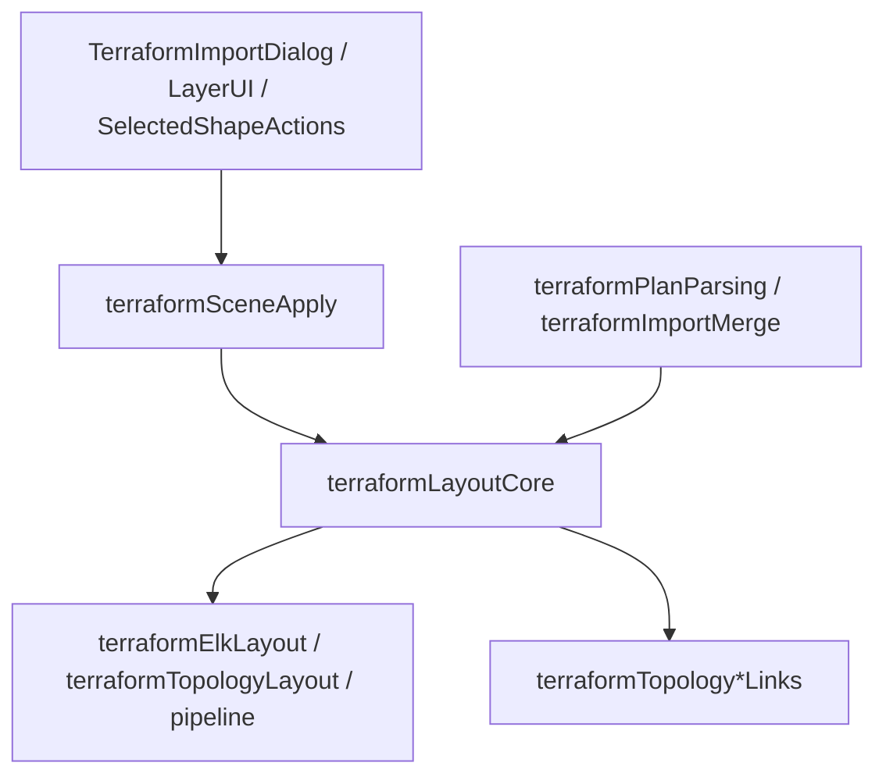

# Code quality tooling

This fork extends upstream Excalidraw cleanup checks (Knip, depcheck, Prettier, ESLint) with **terraform-scoped maintainability** gates and optional **SonarQube Community Build** analysis.

## Local commands

| Command | What it checks |
| --- | --- |
| `yarn health` | Format, typecheck, ESLint, architecture (`lint:arch`), Knip, depcheck |
| `yarn lint:arch` | [dependency-cruiser](https://github.com/sverweij/dependency-cruiser) import boundaries under `packages/excalidraw/components` |
| `yarn lint:oxlint` | [Oxlint](https://oxc.rs/docs/guide/usage/linter.html) on terraform components (report-only; exits 0) |
| `yarn lint:quality` | `lint:arch` + `lint:oxlint` |
| `yarn test:fast` | Vitest without slow terraform layout/import files (`VITEST_FAST=1`) |
| `yarn test:slow` | Only the slow terraform test files (`VITEST_SLOW_ONLY=1`) |
| `yarn test:prepush:fast` | Default **local** pre-push hook: same as prepush but `test:fast` instead of coverage |
| `yarn test:prepush` | Full pre-push chain with coverage (use before release; CI prepush on PRs) |
| `yarn sonar:up` / `yarn sonar:down` | Start/stop local SonarQube Community Build (port 9000) |
| `yarn sonar:scan` | Vitest coverage + `@sonar/scan` (requires running server + token) |

## Terraform layer model (dependency-cruiser)



Enforced rules (see [`.dependency-cruiser.cjs`](../.dependency-cruiser.cjs)):

- No `excalidraw-app` imports from terraform library modules (tests excluded).
- `terraformLayoutCore.ts` must not import UI modules.
- `terraformTopology*Links.ts` must not import `terraformTopologyLayout.ts`.

Circular dependency detection: use `yarn analyze:deps` (madge) for debugging; dep-cruiser circular rules are not enabled yet.

## ESLint: max-lines, SonarJS, type-checked TypeScript

### Max lines (800)

Applies to `packages/excalidraw/components/terraform*.{ts,tsx}` and `Terraform*.{ts,tsx}`.

**Megafile exemptions** (max-lines off): `terraformTopologyLayout.ts`, `terraformTopologyPlacement.ts`, `terraformElkLayout.ts`, `terraformVisibility.ts`, `terraformTopologySatelliteRenderers.ts`, `terraformTopologyEcsLinks.ts`, `terraformTopologySgLinks.ts`, `terraformPlanParsing.tsx`, `terraformDataFlowEdges.ts`, `terraformTopologyApiGatewayLinks.ts`, and related test files.

### SonarJS (cognitive complexity ≤ 25)

Enabled on **pipeline / refactored** modules only (see `.eslintrc.json`):

- `terraformLayoutCore.ts`, `terraformSceneApply.ts`, `terraformImportMerge.ts`
- `terraformImportDialogUtils.ts`, `terraformElementActionsSelection.ts`
- `useTerraformImportDialog.ts`, `useTerraformRelationshipFocusEffect.ts`
- `TerraformSelectedShapeActions.tsx`

`terraformDataFlowEdges.ts` uses type-checked rules only (megafile; complexity not gated).

### Type-checked `@typescript-eslint`

Same scoped file list as SonarJS, plus `terraformDataFlowEdges.ts`:

- `no-floating-promises`, `no-misused-promises`, `await-thenable` (errors)
- `no-unnecessary-type-assertion`, `restrict-template-expressions` (warnings; must pass `--max-warnings=0`)

## Oxlint

Configuration: [`.oxlintrc.json`](../.oxlintrc.json). Scoped via [`scripts/lint-oxlint.sh`](../scripts/lint-oxlint.sh).

**Week 1:** report-only (script always exits 0). CI uses `continue-on-error: true`. Flip to blocking once baseline warnings are cleared.

## SonarQube Community Build

### One-time local setup

1. `yarn sonar:up` → open http://localhost:9000
2. Login `admin` / `admin` → change password
3. Create project with key **`excalidraw-tf`** (must match [`sonar-project.properties`](../sonar-project.properties))
4. My Account → Security → Generate Token
5. `export SONAR_HOST_URL=http://localhost:9000 SONAR_TOKEN=<token>`
6. `yarn sonar:scan`
7. Quality Gates → use **Sonar way**; evaluate **New Code** only (avoids failing on upstream/fork legacy debt)
8. Optional: [SonarQube for VS Code](https://docs.sonarsource.com/sonarqube-for-vs-code/) connected mode

### CI (optional)

[`.github/workflows/sonarqube.yml`](../.github/workflows/sonarqube.yml) runs when the repo variable `SONAR_ENABLED` is set to `true` and these secrets are configured:

- `SONAR_HOST_URL` — e.g. `https://sonar.example.com`
- `SONAR_TOKEN` — analysis token (never commit)

In GitHub **Settings → Secrets and variables → Actions**, add variable `SONAR_ENABLED=true` when both secrets are present. Leave it unset (or not `true`) to skip the workflow.

Not part of pre-push (slow; needs server).

### eslint-plugin-sonarjs vs SonarQube server

| Tool | When | Scope |
| --- | --- | --- |
| eslint-plugin-sonarjs | Every commit / pre-push | 8 refactored terraform modules |
| SonarQube Community Build | PR / manual | Whole repo; gate on **new code** (`sonar.newCode.referenceBranch=master`) |

## Semgrep (optional, not wired in CI)

Example rules you can add locally:

```yaml
rules:
  - id: no-ts-nocheck
    pattern: "@ts-nocheck"
    message: Prefer typed boundaries over file-level nocheck
    languages: [typescript, javascript]
    severity: ERROR

  - id: no-app-import-in-library
    pattern: from "excalidraw-app"
    paths:
      include:
        - packages/excalidraw/**
    severity: ERROR
```

## Pre-push and CI order

Local pre-push (`.husky/pre-push` → `yarn test:prepush:fast`): typecheck → ESLint → Prettier → **lint:arch** → **lint:oxlint** → Knip → depcheck → **fast vitest** → ESM build → size limit.

CI on pull requests: **lint** + **test** (`yarn test:fast`) in parallel, then **prepush** (`yarn test:coverage` full suite + ESM + size limit). Static app build and PR previews are in [`pages-deploy.yml`](../.github/workflows/pages-deploy.yml). Bundle size comments come from [`size-limit.yml`](../.github/workflows/size-limit.yml).

## Terraform import performance

**Full agent handoff** (fixture, call graph, kept/reverted optimizations, measure commands, change log, **KV layout cache**): [`docs/terraform-import-performance-log.md`](terraform-import-performance-log.md).

Machine baseline: [`packages/excalidraw/test-fixtures/terraform-import-perf-baseline.json`](../packages/excalidraw/test-fixtures/terraform-import-perf-baseline.json).

Quick gate before a perf PR:

```bash
yarn vitest run packages/excalidraw/components/terraformLayoutSnapshot.test.ts
yarn vitest run packages/excalidraw/components/terraformLayoutWorkerParity.test.ts
yarn vitest run packages/excalidraw/components/terraformImportPrepCache.test.ts
VITEST_TERRAFORM_PROFILE=1 yarn vitest run packages/excalidraw/components/terraformImportPerf.views.test.ts
```

Do not run `yarn test:update` to mask a perf regression. Slow suite before commit: `yarn test:slow` or `yarn test:update`.
