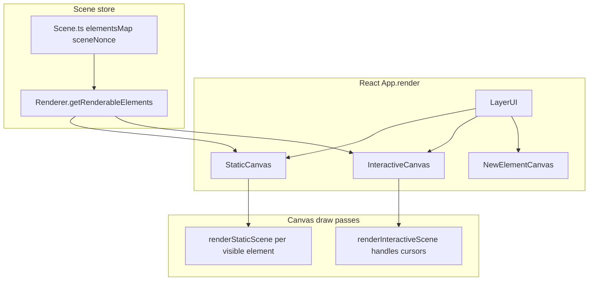
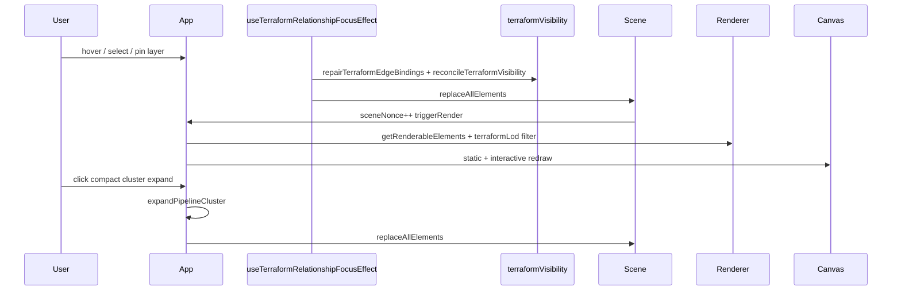
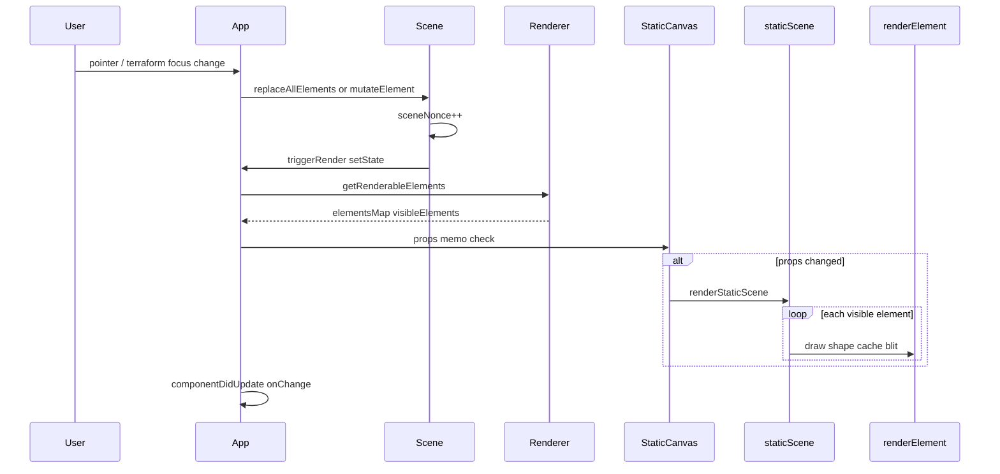

# Excalidraw canvas architecture and Terraform runtime performance

**Audience:** Agents and developers debugging **slow canvas** behavior (pan, zoom, hover, selection, pipeline expand) **after** Terraform import.

**Not covered here:** Import/layout wall-clock — see [terraform-import-performance-log.md](./terraform-import-performance-log.md).

---

## Executive summary

| Fact | Implication |
| --- | --- |
| Excalidraw draws with **imperative `<canvas>` layers**, not one DOM node per shape | React re-renders wrappers; pixel work happens in `useEffect` → renderer functions |
| The **Scene** holds all elements in memory | Terraform semantic scenes are ~9k elements; pipeline ~1.1k on `staging-multi-state-expanded` |
| **`sceneNonce`** bumps on every wholesale scene replace | Each `replaceAllElements` invalidates memo caches and can trigger full static + interactive redraws |
| **Terraform LOD** filters what gets **drawn** | It does **not** skip `repairTerraformEdgeBindings` / `reconcileTerraformVisibility` on hover — reconciliation still walks the full array |
| Most **runtime** slowness | Repeated `replaceAllElements` + edge repair + visibility reconcile, not layout workers |

---

## Canvas layer stack

Bottom → top in `App.render()`:

| Layer | React wrapper | Draw function | Role |
| --- | --- | --- | --- |
| Static | `packages/excalidraw/components/canvases/StaticCanvas.tsx` | `packages/excalidraw/renderer/staticScene.ts` | Committed shapes, text, images, frames, arrows |
| New element | `packages/excalidraw/components/canvases/NewElementCanvas.tsx` | `packages/excalidraw/renderer/renderNewElementScene.ts` | In-progress stroke/shape while creating |
| Interactive | `packages/excalidraw/components/canvases/InteractiveCanvas.tsx` | `packages/excalidraw/renderer/interactiveScene.ts` | Selection handles, snap lines, scrollbars, remote cursors |
| SVG overlay | `packages/excalidraw/components/SVGLayer.tsx` | — | Laser, eraser, lasso trails |
| DOM | `App.renderEmbeddables()` | — | Live iframes/embeddables positioned over canvas |
| React UI | `packages/excalidraw/components/LayerUI.tsx` | — | Toolbar, menus, **TerraformScenePanel** |



**Entry points:** `packages/excalidraw/components/App.tsx` wires canvases, owns `scene`, `renderer`, and `triggerRender`.

---

## Invalidation: what triggers a redraw

### `sceneNonce` (scene-wide)

On every `Scene.replaceAllElements` or version-changing `mutateElement`, `triggerUpdate()` assigns a new random `sceneNonce` and notifies subscribers:

```303:308:packages/element/src/Scene.ts
  triggerUpdate() {
    this.sceneNonce = randomInteger();

    for (const callback of Array.from(this.callbacks)) {
      callback();
    }
  }
```

`App` registers `this.scene.onUpdate(this.triggerRender)` → `setState({})` → React re-render → canvas `useEffect` runs if memo props changed.

`Renderer.getRenderableElements` is memoized on `sceneNonce`, viewport, and LOD settings.

### Element `version` / `versionNonce` (per-element)

Drives `ShapeCache` and `elementWithCanvasCache` invalidation in `packages/element/src/renderElement.ts` (geometry, zoom, theme, bound text, image crop).

### `selectionNonce`

Passed to interactive canvas so selection-box drags update the interactive layer even when `sceneNonce` is unchanged.

### Optional render throttling

Set in the browser console:

```js
window.EXCALIDRAW_THROTTLE_RENDER = true;
```

Requires React 18+. Coalesces static/new-element draws to one `requestAnimationFrame` per frame (`packages/excalidraw/reactUtils.ts`, `packages/common/src/utils.ts` `throttleRAF`).

---

## Render cost model (why pan/zoom feels slow)

Excalidraw does **not** use dirty-region rendering. Each static update repaints every **visible** element.

| Cost | Where | When it hurts |
| --- | --- | --- |
| Full static repaint | `staticScene.ts` `_renderStaticScene` | Any `sceneNonce` bump with many visible elements |
| Per-element offscreen cache | `renderElement.ts` `generateElementCanvas` | Zoom changes (cache regen per element) |
| RoughJS shape generation | `packages/element/src/shape.ts` `ShapeCache` | Cache miss on geometry change |
| Frame clipping | `renderElement.ts` | Nested pipeline frames (provider → account → region → VPC → cluster) |
| Arrows + bindings | Elbow routing, bound text, `boundElements` | Large edge counts in semantic view |
| Interactive pass | `interactiveScene.ts` (~2k lines) | Selection, handles, snap lines, search highlights |
| Grid lines | `staticScene.ts` | High zoom (many grid segments) |

**Terraform-specific:** Pipeline and semantic imports emit deep frame hierarchies and hundreds/thousands of arrows. LOD (below) reduces draw count at low zoom but all elements remain in the Scene.

---

## Terraform integration (runtime)

### Mental model

1. **Import** (async): layout workers / main thread → **one** `applyTerraformExcalidrawScene` → `replaceAllElements`.
2. **After import:** Most interactivity replaces the **entire** scene again rather than patching individual elements.

Terraform does **not** use `excalidrawAPI.setElements()` during normal import. The canonical mutation is `app.scene.replaceAllElements(nextElements)`.

### Import apply (one shot)

`packages/excalidraw/components/terraformSceneApply.ts`:

1. `restoreElements(..., { repairBindings: true })`
2. `applyTerraformRelationshipFocus`
3. `repairTerraformEdgeBindings` + `reconcileTerraformVisibility`
4. `app.scene.replaceAllElements(nextElements)`
5. `setAppState` (LOD flags, edge layer pins, etc.)
6. Session snapshot via `terraformImportSession.ts` (`structuredClone` of elements)

### Runtime paths that call `replaceAllElements`

| Trigger | File |
| --- | --- |
| Hover / selection / edge-layer pin changes | `useTerraformRelationshipFocusEffect.ts` |
| Pipeline cluster expand (click) | `App.tsx` pointer handler → `terraformPipelineLayoutExpand.ts` |
| Expand all / collapse all | `TerraformScenePanel.tsx` (sequential per cluster, then one replace) |
| Explode toggle (semantic/module) | `terraformVisibility.ts` via App action |
| Color mode toggle | `TerraformScenePanel.tsx` |
| Invalid terraform drag drop | `App.tsx` |
| Compact / refresh re-import | `runTerraformImportFromSources` (full layout + apply) |



### Edge repair and visibility (hot path)

`packages/excalidraw/components/terraformVisibility.ts`:

- **`repairTerraformEdgeBindings`** — builds indexed resource-rectangle and structural-pair maps, walks edges to recompute orbit bindings, then patches `boundElements` on cards. It performs several linear passes plus map/set lookups rather than a literal edges-by-rectangles nested scan.
- **`reconcileTerraformVisibility`** — soft-deletes edges/groups from visible resource keys, layer pins (`dependency`, `dataFlow`, `declaredDataFlow`, …), hover-peek key.

Both run at layout finalize, every `applyTerraformExcalidrawScene`, every focus/hover reconciliation, and every pipeline expand/collapse.

### Pipeline expand/collapse

`terraformPipelineLayoutExpand.ts`:

- **Expand:** Rebuilds full satellite skeleton from prep cache, `convertToExcalidrawElements`, AWS icon inject (async), repair + reconcile — **no full relayout** (neighbors do not move; overlap possible).
- **Collapse:** Soft-deletes satellites, snaps frame to compact size.
- **Expand all:** `TerraformScenePanel` loops `expandPipelineCluster` per card **sequentially**, then one `replaceAllElements` — worst interactive CPU path.

### Drag path

`App.tsx` `syncTerraformDetachedResourceLabelsWithDraggedCards` — `mutateElement` on detached labels during pointer move (per-frame while dragging terraform cards).

### LayerUI wiring

`LayerUI.tsx` mounts `TerraformScenePanel`, `TerraformImportDialog`, and `useTerraformRelationshipFocusEffect` alongside standard Excalidraw UI.

---

## Key files

| Concern | Path |
| --- | --- |
| Scene store + `replaceAllElements` | `packages/element/src/Scene.ts` |
| Viewport cull + Terraform LOD | `packages/excalidraw/scene/Renderer.ts` |
| Static / interactive render | `packages/excalidraw/renderer/staticScene.ts`, `interactiveScene.ts` |
| Per-element draw + cache | `packages/element/src/renderElement.ts` |
| Import apply | `packages/excalidraw/components/terraformSceneApply.ts` |
| Hover/selection focus | `packages/excalidraw/components/useTerraformRelationshipFocusEffect.ts` |
| Bindings + visibility | `packages/excalidraw/components/terraformVisibility.ts` |
| Pipeline expand | `packages/excalidraw/components/terraformPipelineLayoutExpand.ts` |
| Scene toolbar | `packages/excalidraw/components/TerraformScenePanel.tsx` |
| LOD thresholds | `packages/excalidraw/components/terraformLod.ts` |
| Runtime performance experiments | `packages/excalidraw/components/terraformRuntimePerformance.ts`, [terraform-canvas-runtime-performance.md](./terraform-canvas-runtime-performance.md) |
| App terraform hooks | `packages/excalidraw/components/App.tsx` |
| Session snapshot | `packages/excalidraw/components/terraformImportSession.ts` |

---

## Terraform LOD (render-only)

**File:** `packages/excalidraw/components/terraformLod.ts`

Enabled by default on apply (`terraformLodEnabled: true` in `terraformSceneApply.ts`). Toggle and preset live in **TerraformScenePanel** (`performance` | `balanced` | `detailed`).

### What LOD hides by zoom

Base thresholds (scaled by preset — lower preset multiplier = detail visible farther out):

| Tier | Base zoom constant | Hidden when zoomed out past threshold |
| --- | --- | --- |
| Detached labels | `TERRAFORM_LOD_LABEL_ZOOM` (0.35) | Resource name labels |
| AWS icons | `TERRAFORM_LOD_ICON_ZOOM` (0.4) | Icon glyphs |
| Tier-1 satellites | `TERRAFORM_LOD_SATELLITE1_ZOOM` (0.5) | Satellite clusters / tier-1 |
| Tier-2 satellites | `TERRAFORM_LOD_SATELLITE2_ZOOM` (0.65) | Tier-2 satellites |
| Pipeline frame names | `region` 0.2 … `primaryCluster` 0.65 | Frame title text |

Preset scale (`TERRAFORM_LOD_PRESET_SCALE`): `performance` 1.0, `balanced` 0.65, `detailed` 0.4.

### Where it runs

```158:171:packages/excalidraw/scene/Renderer.ts
        if (terraformLodEnabled && isTerraformLodScene(elements)) {
          visibleElements = filterTerraformLodVisibleElements(
            visibleElements,
            buildTerraformLodContext(
              terraformLodEnabled,
              zoom.value,
              selectedElementIds,
              terraformEdgeHoverPeekKey,
              elements,
              terraformLodPreset,
            ),
            elementsMap,
          );
        }
```

**LOD reduces draw count only.** Hover/focus/expand still process the full element array in visibility repair.

---

## Runtime debugging playbook

### Step 1 — Characterize

| Question          | Why                                                    |
| ----------------- | ------------------------------------------------------ |
| Which view?       | Pipeline ~1.1k vs semantic ~9.1k elements              |
| When slow?        | Idle pan/zoom vs hover vs expand vs drag vs pin toggle |
| LOD on?           | Scene panel → LOD toggle and preset                    |
| After expand-all? | Expect multi-second freeze on large presets            |

### Step 2 — Chrome Performance

1. Open DevTools → **Performance** → record while panning/zooming or hovering edges.
2. Look for long tasks in:
   - `renderStaticScene` / `_renderStaticScene`
   - `generateElementCanvas`
   - `renderInteractiveScene`
3. Optional: temporarily log `Scene.replaceAllElements` call count (should not fire every pointer move unless focus graph changes).

### Step 3 — Suspected hotspots (ranked)

1. **`useTerraformRelationshipFocusEffect`** — hover/selection/pin → full `repairTerraformEdgeBindings` + `reconcileTerraformVisibility` + `replaceAllElements`.
2. **Pipeline expand / expand-all** — per-cluster skeleton + icon inject + repair (expand-all is sequential).
3. **Large arrow count** — edge repair scales with edges × resource rects (semantic view).
4. **Zoom without LOD** — all labels, icons, satellites drawn.
5. **Drag** — per-move `mutateElement` on detached labels.

### Step 4 — Quick mitigations

- Enable **LOD**; try **performance** preset in TerraformScenePanel.
- Avoid **expand all** on large presets; expand one cluster at a time.
- Turn off **edge layer pins** you do not need (reduces focus-graph churn).
- Test `window.EXCALIDRAW_THROTTLE_RENDER = true` in console.
- Compare **pipeline** vs **semantic** view element counts.
- Wait for import to finish before profiling (import layout is a separate doc).

### Step 5 — Future optimization targets

- Incremental visibility updates instead of full `replaceAllElements` on hover.
- Debounce `useTerraformRelationshipFocusEffect`.
- Skip `repairTerraformEdgeBindings` when only visibility flags change (bindings unchanged).
- Batch expand-all without per-cluster full reconcile where safe.

---

## Render pipeline (sequence)



---

## Related docs and tools

| Doc / tool | Purpose |
| --- | --- |
| [terraform-import-performance-log.md](./terraform-import-performance-log.md) | Import/layout wall-clock, profiler spans, KV cache |
| [terraform-pipeline-import-agent-guide.md](./terraform-pipeline-import-agent-guide.md) | Pipeline toggles, compound/packed, expand behavior |
| [terraform-pipeline-compound-import-guide.md](./terraform-pipeline-compound-import-guide.md) | Compound frame hierarchy detail |
| [terraformImportProfiler.ts](../packages/excalidraw/components/terraformImportProfiler.ts) | Import-phase spans (not canvas frames) |
| [docs/code-quality.md](./code-quality.md) | CI perf budgets, terraform import perf tests |
| Chrome Performance + `EXCALIDRAW_THROTTLE_RENDER` | Canvas frame profiling |

---

## Anti-patterns when profiling

- Do not confuse **import** slowness (layout in `terraformLayoutCore.ts`) with **canvas** slowness (render after scene is loaded).
- Do not assume LOD fixes hover cost — reconciliation still walks all elements.
- Do not call `triggerRender(true)` in a tight loop from new code.
- Do not profile during active **expand-all** and blame pan/zoom — isolate interactions.
