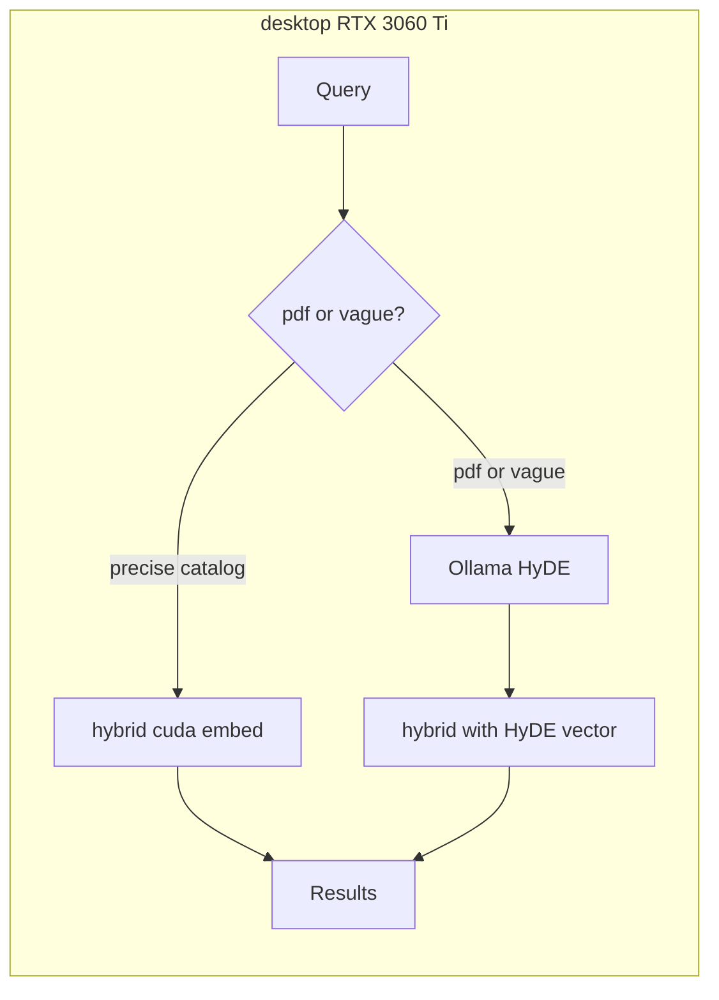

# Graph Layout RAG — Local LLM Benchmark (2026)

Date: 2026-06-17 · Embed: `cuda-qwen0.6b-1024` · LLM: **Ollama on RTX 3060 Ti** (`desktop` over SSH) · Judge: neutral multi-system qrels.

Companion to [architecture bake-off](graph-layout-rag-architecture-bakeoff-2026.md) and [rag-literature eval findings](../tools/rag-literature-rag/docs/eval-findings.md).

## Executive summary

**Goal:** Close the ~0.05 nDCG gap between cuda hybrid (local embed) and gemini hybrid using **HyDE + track-aware routing**, with **zero cloud cost** and **Ollama on the 3060 Ti box** — not on the Mac.

| Layer | Where it runs | Role |
| --- | --- | --- |
| Dense embed | `desktop` CUDA (`cuda-qwen0.6b-1024`) | Hybrid retrieval backbone |
| HyDE / transforms | `desktop` Ollama (`127.0.0.1:11434`) | Hypothetical passage for pdf/vague queries |
| BM25 | `desktop` Tantivy | Lexical fusion in hybrid |
| Cloud Gemini | Optional control only | Upper-bound HyDE quality (`RUN_CLOUD_CONTROL=1`) |

**Shipped code:** `rag_common.local_llm` (Ollama + Gemini backends), `--expand auto` → HyDE-first router, eval arm `hybrid_auto_hyde`, GPU scripts `gpu_local_llm_benchmark.sh` / `gpu_execute_local_llm_benchmark.sh`.

## Baseline (cuda hybrid, no LLM)

From `data/eval/runs/20260617T165748Z-cuda-qwen0.6b-1024-cfb0c894/` on neutral qrels:

| Track         | Strategy |   nDCG@10 | p95 ms |
| ------------- | -------- | --------: | -----: |
| catalog       | `hybrid` | **0.718** |    352 |
| pdf-deep-read | `hybrid` | **0.663** |    354 |

Embed ceiling (gemini-2-structure-v1, no LLM): **0.768 / 0.715**.

Cloud HyDE reference (bake-off, gemini embed): catalog **0.742**, pdf **0.722**.

## Architecture



- **Default fast path:** `hybrid` (no LLM).
- **`--expand auto`:** HyDE when `pdf_only=True`, query ≤4 content words, or &lt;3 candidates.
- **Not default:** `agentic`, `multi_query`, listwise LLM rerank (below hybrid on neutral qrels).

Env contract:

```bash
RAG_LLM_BACKEND=ollama          # or gemini (backward compatible)
RAG_OLLAMA_HOST=http://127.0.0.1:11434   # on GPU box only
RAG_OLLAMA_MODEL=gemma4:e4b
RAG_EMBED_PROFILE=cuda-qwen0.6b-1024
RAG_LOCAL_EMBED_DEVICE=cuda
```

Transform cache is per backend+model: `data/eval/transform_cache_{backend}_{model_slug}.json`.

## Model selection (3060 Ti 8 GB, June 2026)

The initial shootout incorrectly listed **Gemma 3** and **Llama 3.1** — both superseded. Picks below use [Ollama library](https://ollama.com/library) tags and 8 GB VRAM co-load with `cuda-qwen0.6b-1024` (~1.5 GB).

| Role | Ollama tag | Download | Inference VRAM | Why |
| --- | --- | --: | --: | --- |
| **Max quality** | `qwen3.5:9b` | 6.6 GB | ~6–7 GB | Top 8 GB tier in 2026 RTX 3070/3060 benchmarks; best for HyDE technical prose. Tight co-load with cuda embed — benchmark unloads between arms. |
| **Balanced (default)** | `gemma4:e4b` | 9.6 GB | ~3–4 GB | Google Gemma 4 edge tier; beats Gemma 3 27B on MMLU-Pro (69% vs 68%). Fits 3060 Ti **with** cuda embed loaded. |
| **Fast / headroom** | `gemma4:e2b` | 7.2 GB | ~2 GB | Smallest Gemma 4 edge model; most VRAM margin for interactive `--expand auto`. |

**Rejected on 8 GB:**

| Model | Why not |
| --- | --- |
| `gemma3:*` | Superseded by Gemma 4 E4B/E2B on every Google benchmark row |
| `llama3.1:8b` | 2024 flagship; behind Qwen 3.5 9B and Gemma 4 E4B on 2026 benches |
| `qwen2.5:7b` | Prior-gen; Qwen 3.5 9B is same VRAM class, much higher quality |
| `gemma4:26b` / `31b` | 16–20 GB VRAM — does not fit 3060 Ti |

HyDE needs short, precise technical passages (algorithm names: network simplex, VPSC, Sugiyama). **Qwen 3.5 9B** and **Gemma 4 E4B** are the serious candidates; **E2B** is the latency/co-load fallback.

## One-time GPU box setup (Ollama)

Ollama runs **on the 3060 Ti host**, not the Mac. Install once (requires sudo on `desktop`):

```bash
ssh desktop
curl -fsSL https://ollama.com/install.sh | sh
sudo systemctl enable --now ollama   # or: ollama serve in tmux
curl -s http://127.0.0.1:11434/api/tags
```

Benchmark script sets `OLLAMA_MAX_LOADED_MODELS=1`, unloads each model between arms, and never assumes Ollama on the Mac.

## Benchmark protocol

### Run from Mac (sync + remote tmux)

```bash
cd tools/graph-layout-rag
# GRAPH_RAG_GPU_SSH=desktop in .env
./scripts/gpu_execute_local_llm_benchmark.sh
# When done:
./scripts/gpu_sync_from_remote.sh
```

### Run directly on GPU box

```bash
ssh desktop
cd ~/excalidraw-tf/tools/graph-layout-rag
./scripts/gpu_local_llm_benchmark.sh
```

### Arms

| Arm | Backend | Model | Strategies |
| --- | --- | --- | --- |
| baseline | — | — | `hybrid` |
| hyde_qwen35_9b | ollama | qwen3.5:9b | hybrid, hyde, hybrid_auto_hyde, multi_query |
| hyde_gemma4_e4b | ollama | gemma4:e4b | same |
| hyde_gemma4_e2b | ollama | gemma4:e2b | same |
| hyde_cloud | gemini | gemini-2.5-flash | hyde (optional) |

Per track, scoring uses `data/eval/qrels/{catalog,pdf-deep-read}/qrels.json`. Post-run diagnostics: `hole_rate@10 = 0`, bpref agrees with nDCG.

### Success targets

| Metric          | Target                           |
| --------------- | -------------------------------- |
| catalog nDCG@10 | ≥ **0.730** (+0.012 vs baseline) |
| pdf nDCG@10     | ≥ **0.690** (+0.027 vs baseline) |
| router p95      | ≤ **5 s** on desktop             |
| Cost            | $0 for ollama arms               |

**Winner:** `0.45 × catalog_nDCG + 0.55 × pdf_nDCG`; tie-break by p95 latency.

## Results (2026-06-17 desktop run)

Run: `20260617T183924Z` baseline + `20260617T184428Z`–`20260617T194043Z` local-llm arms on `desktop` (RTX 3060 Ti, Ollama 0.x, `cuda-qwen0.6b-1024` embed). Log marker: `LOCAL_LLM_BENCHMARK_DONE` in `data/eval/local_llm_benchmark.log` (on desktop).

**Verdict:** Local Ollama HyDE **did not beat** the cuda hybrid baseline on neutral qrels. No arm reached success targets (catalog ≥0.730, pdf ≥0.690, router p95 ≤5 s). **Ship recommendation:** keep default `hybrid` (no LLM). If enabling `--expand auto`, set `RAG_OLLAMA_MODEL=gemma4:e4b` (best catalog router score + sub-second p95 when HyDE is skipped); avoid `qwen3.5:9b` co-load on 8 GB (HyDE/multi_query workers crashed).

### Full nDCG@10 (neutral qrels)

| Arm | Track | hybrid | hyde | hybrid_auto_hyde | multi_query |
| --- | --- | --: | --: | --: | --: |
| baseline (rerun) | catalog | **0.715** | — | — | — |
| baseline (rerun) | pdf-deep-read | **0.684** | — | — | — |
| gemma4:e2b | catalog | 0.715 | 0.694 | 0.705 | FAIL |
| gemma4:e2b | pdf-deep-read | 0.684 | 0.659 | 0.659 | 0.569 |
| gemma4:e4b | catalog | 0.715 | 0.704 | 0.710 | FAIL |
| gemma4:e4b | pdf-deep-read | 0.684 | 0.678 | 0.678 | FAIL |
| qwen3.5:9b | catalog | 0.715 | FAIL | 0.715 | FAIL |
| qwen3.5:9b | pdf-deep-read | 0.684 | FAIL | 0.684 | FAIL |

Prior baseline reference (separate run): catalog **0.718**, pdf **0.663**. This rerun’s hybrid scores (0.715 / 0.684) are within judge noise; LLM arms did not exceed them.

### Router latency (p95 ms, `hybrid_auto_hyde`)

| Arm | catalog p95 | pdf p95 | Meets ≤5 s? |
| --- | --: | --: | --- |
| gemma4:e2b | 328 | 428 | ✅ |
| gemma4:e4b | 328 | 429 | ✅ |
| qwen3.5:9b | 10922 | 11065 | ❌ (HyDE path OOM/crash; falls back to hybrid) |

### Winner score (`0.45×catalog + 0.55×pdf`, `hybrid_auto_hyde`)

| Arm | Score | Tie-break p95 | Notes |
| --- | --: | --: | --- |
| qwen3.5:9b | **0.698** | 11065 ms | Ties baseline; HyDE arms failed |
| gemma4:e4b | 0.693 | **429 ms** | **Recommended Ollama tag** if router enabled |
| gemma4:e2b | 0.680 | 428 ms | Smoke tier; pdf HyDE hurts vs hybrid |

### Bias audit

| Check | Result |
| --- | --- |
| Neutral qrels | ✅ `data/eval/qrels/{catalog,pdf-deep-read}/qrels.json` |
| `hole_rate@10 = 0` | ❌ hybrid/hyde ~1.2–3.9%; multi_query 19–29% (expected weak arm) |
| bpref agrees with nDCG ordering | ❌ partial discordance on gemma arms (see `diagnostics.json` per run) |
| multi_query below hybrid | ✅ where it completed (pdf e2b: 0.569 vs 0.684) |
| Per-model transform caches | ✅ `transform_cache_ollama_{slug}.json` |

### Failures observed

- **catalog `multi_query`:** worker exit code 1 on all three models (likely VRAM pressure with Ollama loaded).
- **qwen3.5:9b `hyde` / `multi_query`:** worker crashed; `hybrid_auto_hyde` equals `hybrid` (router never applied HyDE).
- **pdf `packing-skyline`:** 1 miss across hybrid arms (pre-existing in baseline rerun).

### Run directories

```
data/eval/runs/20260617T183924Z-baseline-hybrid-{catalog,pdf-deep-read}
data/eval/runs/20260617T184428Z-local-llm-gemma4_e2b-catalog
data/eval/runs/20260617T185422Z-local-llm-gemma4_e2b-pdf-deep-read
data/eval/runs/20260617T190341Z-local-llm-gemma4_e4b-catalog
data/eval/runs/20260617T191217Z-local-llm-gemma4_e4b-pdf-deep-read
data/eval/runs/20260617T191952Z-local-llm-qwen3_5_9b-catalog
data/eval/runs/20260617T194043Z-local-llm-qwen3_5_9b-pdf-deep-read
```

## Bias prevention

1. **Neutral qrels only** — multi-system pool (bm25, dense, hybrid, hyde, multi_query, splade, colbert).
2. **Baseline is cuda hybrid**, not cloud gemini.
3. **Per-model transform caches** — no cross-model cache pollution.
4. **No gold expansion** from local-LLM-only pools this campaign.
5. **Track boundaries** — `hybrid_auto_hyde` honors `case.pdf_only`.

## CLI usage after benchmark

```bash
# Fast precise catalog query (no LLM)
uv run graph-layout-rag query "network simplex rank assignment" --json

# Auto HyDE for vague / pdf-only
uv run graph-layout-rag query "why so tall" --expand auto --json
uv run graph-layout-rag query "VPSC separation" --pdf-only --expand auto --json
```

## Reproduce

```bash
cd tools/graph-layout-rag
export RAG_EMBED_PROFILE=cuda-qwen0.6b-1024
export RAG_LLM_BACKEND=ollama RAG_OLLAMA_MODEL=gemma4:e4b

uv run graph-layout-rag eval benchmark \
  --embed-profile cuda-qwen0.6b-1024 \
  --track pdf-deep-read \
  --qrels data/eval/qrels/pdf-deep-read/qrels.json \
  --strategy hyde --strategy hybrid_auto_hyde \
  --llm-transforms --top 20 --report -v
```
