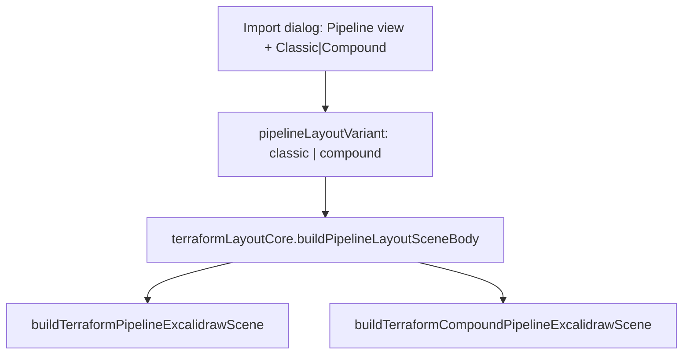
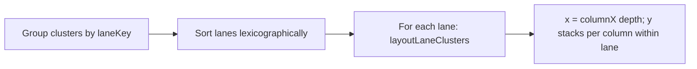

# Pipeline Compound Layout — agent handoff

Deep reference for another agent working on **Terraform pipeline import → Compound layout variant**. Covers algorithm design, code map, invariants, Classic vs Compound differences, and what is intentionally not implemented yet.

**Start here for a unified import + compound overview:** [terraform-pipeline-compound-import-guide.md](./terraform-pipeline-compound-import-guide.md)

Related docs:

- [terraform-pipeline-import-debug-handoff.md](./terraform-pipeline-import-debug-handoff.md) — end-to-end import flow, debugging pipeline failures
- [pipeline-layout-improvement-agent-prompt.md](./pipeline-layout-improvement-agent-prompt.md) — future height optimization (cross-lane column slack packing)
- [staging-extended-localstack-pipeline-handoff.md](./staging-extended-localstack-pipeline-handoff.md) — largest preset for manual/visual validation

---

## Product intent

Pipeline view lays out Terraform resources as a **declared dataflow diagram** driven by `.tfd` `->` edges (hop columns left-to-right). Topology (account / region / VPC / subnet) provides **grouping context** via nested Excalidraw frames.

Two layout variants exist under **Pipeline view** in the import dialog:

| Variant | User-facing label | Purpose |
| --- | --- | --- |
| `classic` | Classic | TFD-first global grid + topology hull frames (original behavior) |
| `compound` | Compound | Same TFD placement + topology hulls, plus hierarchical metadata and arrow parenting so **topology groups drag together** (resources + in-group TFD arrows) |

**Design principle (clustered level graph):** children positions are primary; compound topology frames are **derived geometry** (hull around laid-out clusters), not preset boxes that resources are fitted into.

Literature touchpoints (local RAG corpus in `tools/graph-layout-rag/`):

- Forster — clustered level graphs; clusters span levels their children occupy
- ELK layered survey — minimum compound size from laid-out children
- Brandes-Köpf — global horizontal coordinates given layer assignment

---

## Two semantics that must not fight

Pipeline layout combines two independent dimensions:

| Dimension | Source | Controls |
| --- | --- | --- |
| **TFD (horizontal)** | `computeDepths` on collapsed `.tfd` edges | Hop columns: `A -> B` ⇒ `B` strictly right of `A` (or same column for fan-out) |
| **Topology (grouping)** | `laneKey` / `buildPlacementMap` | Which account/region/VPC/subnet lane and frame ancestry a resource belongs to |

**Historical bug (fixed):** an earlier Compound prototype laid out topology boxes first and fitted TFD columns inside each box with local offsets. That caused cumulative `FRAME_PAD` drift, misaligned global columns, and resources visually fighting their parent frames.

**Current approach:** both Classic and Compound use **TFD-first global placement**; topology frames are bottom-up hulls around already-placed clusters. Compound adds a post-pass for group-drag semantics only.

---

## End-to-end routing



| Step | Module | Notes |
| --- | --- | --- |
| UI toggle | `TerraformImportDialog.tsx` | Classic / Compound sub-buttons under Pipeline view |
| Session / import | `useTerraformImportDialog.ts`, `terraformImportSession.ts`, `terraformPresetImport.ts`, `terraformSceneApply.ts` | `pipelineLayoutVariant` threaded through |
| Layout router | `terraformLayoutCore.ts` | `ctx.pipelineLayoutVariant === "compound"` picks builder |
| Classic builder | `terraformPipelineLayout.ts` | `buildTerraformPipelineExcalidrawScene` |
| Compound builder | `terraformPipelineLayoutCompound.ts` | `buildTerraformCompoundPipelineExcalidrawScene` |

URL param: `pipelineVariant=classic|compound` via `terraformDemoUrlParams.ts`.

---

## Shared prep (Phase 0) — both variants

**Entry:** `preparePipelineLayout(nodes, plan, compact)` in `terraformPipelineLayoutShared.ts`

### Inputs

- `nodes[DECLARED_DATAFLOW_ORDERED_KEY]` — resolved `.tfd` edges (required; empty ⇒ throw)
- Terraform plan JSON — placement, resource attributes, provider config
- `compact` (default `true`) — primary card only per cluster; satellites on expand

### Steps

1. **Satellite collapse** — `buildSatelliteOwnerMap` maps listener/TG/etc. to primary owner (e.g. ALB)
2. **Edge collapse** — `.tfd` endpoints collapsed to primary cluster ids; self-loops dropped
3. **Depth assignment** — `computeDepths` — Kahn topological sort with longest-path depth; cycle fallback sets `pipeline_cycle` warning
4. **Cluster build** — one `PipelineCluster` per collapsed endpoint:
   - `id` / `primaryAddress` — cluster key (resource address)
   - `depth` — TFD hop column index
   - `placement` — from `buildPlacementMap` → `topologyAddressPlacementMap`
   - `build` — `buildCompactPipelinePrimaryCluster` or `buildTopologyPrimaryClusterSkeletonForPipeline`
5. **Global columns** — `computeGlobalColumnX` — per-depth max cluster width, `columnX[depth]` shared across all lanes

### Key types

```typescript
type PipelineCluster = {
  id: string;
  primaryAddress: string;
  firstSequence: number;
  depth: number;
  placement: PipelinePlacement; // TopologyAddressPlacement
  build: PipelinePrimaryClusterBuildResult; // skeleton, width, height, clusterFrameId
};

type PipelineLayoutPrep = {
  clusters: PipelineCluster[];
  collapsedEdges: CollapsedPipelineEdge[];
  maxDepth: number;
  columnX: number[];
  depthResult: { depths: Map<string, number>; hasCycle: boolean };
};
```

### Lane identity

```typescript
laneKey(p) = [
  providerFamily,
  accountId,
  region,
  vpcId ?? "",
  subnetSignature ?? "",
].join("\0");
```

Each unique `laneKey` becomes a horizontal band (lane) stacked vertically.

### Layout constants

| Constant | Value | Role |
| --- | --- | --- |
| `PIPELINE_MARGIN` | 50 | Scene margin |
| `PIPELINE_FRAME_PAD` | 28 | Topology frame padding |
| `PIPELINE_COLUMN_GAP` | 150 | Gap between TFD columns |
| `PIPELINE_CLUSTER_GAP_Y` | 36 | Vertical gap between clusters in same column/lane |
| `PIPELINE_LANE_GAP_Y` | 96 | Gap between lanes |

---

## Phase 1 — TFD global grid (shared)

**Entry:** `placeClustersClassicGrid(prep)` in `terraformPipelineLayoutShared.ts`



`layoutLaneClusters`:

- Sort clusters in lane by `depth`, then `firstSequence`, then `id`
- Place at `(columnX[depth], colY[depth])`
- Push translated cluster skeleton elements
- Record `layoutBoxes` for `clusterFrameId` and cluster `id`
- Advance `colY[depth]` downward per cluster

**Invariants preserved:**

- `columnX[depth]` is **global** across all lanes
- `A -> B` ⇒ `x(A) < x(B)` (or equal column for fan-out from same source)
- Topology affects **Y-band only** via lane stacking, not X

---

## Phase 2 — Topology hull frames (shared math)

**Entry:** `emitTopologyContextFrames` / alias `buildCompoundFramesFromLayoutBoxes` in `terraformPipelineTopologyFrames.ts`

Bottom-up over `PIPELINE_TOPOLOGY_LEVELS` (innermost → outermost):

```
subnetZone → vpc → region → account → provider
```

For each level:

1. Group clusters by `level.keyOf(cluster)`
2. Resolve child frame ids via `childKeyForLevel` (maps cluster to immediate inner frame/cluster id)
3. `bbox = boundsOf(childIds, layoutBoxes)`
4. Emit frame skeleton at `bbox ± PIPELINE_FRAME_PAD` with `children: uniqueChildIds`
5. Register frame id in `childIdsByKey` for parent level

**Frame skeleton id pattern:**

```
tf-pipeline:{role}:{encodeURIComponent(key)}
```

**Regional / VPC-direct:** no extra `regionalBucket` wrapper — regional clusters are direct children of `region`; VPC-direct clusters attach under `vpc` or `region` per `childKeyForLevel`.

**customData** via `pipelineFrameCustomData`:

- `terraformTopologyRole` — `subnetZone` | `vpc` | `region` | `account` | `provider` | `primaryCluster`
- `terraformTopologyKey` — frame skeleton id
- `terraformTopologyPath` — string array ancestry

---

## Classic path (Phase 3 classic)

**File:** `terraformPipelineLayout.ts`

```
prep → placeClustersClassicGrid → emitTopologyContextFrames → finalizePipelineScene
```

`finalizePipelineScene` (`terraformPipelineLayoutFinalize.ts`):

1. `appendPipelineEdgeSkeletons` — TFD arrows from `layoutBoxes` (root-level; no frame parent)
2. `convertPipelineSkeletonToElements` — `convertToExcalidrawElements`, mirror labels, AWS icons, visibility, z-order

**Meta:** `pipelineVariant: "classic"`

---

## Compound path (Phase 3 compound) — hierarchical post-pass

**File:** `terraformPipelineLayoutCompound.ts`

```
prep
→ placeClustersClassicGrid
→ buildCompoundFramesFromLayoutBoxes   // same as emitTopologyContextFrames
→ applyCompoundHierarchicalLayout      // compound-only
→ appendPipelineEdgeSkeletons
→ assignCompoundEdgeFrameParents       // compound-only
→ convertPipelineSkeletonToElements
```

**Meta:** `pipelineVariant: "compound"`, `pipelineCompoundHierarchical: true`

### Phase 3a — `applyCompoundHierarchicalLayout`

**File:** `terraformPipelineLayoutCompoundHierarchy.ts`

For each **provider** frame:

1. **Re-anchor** — compute `dx, dy` to move provider origin to `(PIPELINE_MARGIN, providerY)`
2. **Uniform translate** — apply delta to all descendant skeleton ids (via frame `children` BFS) and matching `layoutBoxes` entries
3. **Stamp local metadata** — `stampCompoundLocalOnSubtree` walks frame tree and sets on each child:

```typescript
customData: {
  terraformCompoundLayout: true,
  terraformCompoundParentKey: string,   // parent's terraformTopologyKey
  terraformCompoundLocal: { x, y },   // offset from parent content origin
}
```

Parent content origin = `parentFrame.x + PIPELINE_FRAME_PAD`, same for Y.

**Important:** Excalidraw still stores **global absolute** `x/y` on elements. `terraformCompoundLocal` is metadata for future re-layout/re-import; drag uses native Excalidraw frame semantics, not local coord replay.

**Side effect:** initial diagram position may shift slightly vs Classic (re-anchor at margin). TFD column **ordering** is preserved (uniform translate per subtree).

### Phase 3b — `assignCompoundEdgeFrameParents`

After TFD arrow skeletons are appended:

1. For each `declaredDataFlow` arrow, read `relationship.source` / `relationship.target` (collapsed cluster ids)
2. `topologyPathForCluster` → path arrays e.g. `[aws, accountId, region, vpcId, subnetSig]`
3. `lcaTopologyPath(sourcePath, targetPath)` → longest common prefix
4. Map LCA path to frame skeleton id via `topologyRoleAndKeyFromPath` + `topologyFrameSkeletonId`
5. Append arrow skeleton `id` to that frame's `children` array

**LCA examples:**

| Edge endpoints                    | LCA frame  |
| --------------------------------- | ---------- |
| Same region, different VPC/subnet | `region`   |
| Same account, different regions   | `account`  |
| Cross-account                     | `provider` |

`convertToExcalidrawElements` assigns `frameId` to direct `children`; `getFrameDescendants` then includes arrows when dragging the parent frame.

---

## Classic vs Compound comparison

| Aspect | Classic | Compound |
| --- | --- | --- |
| TFD grid placement | `placeClustersClassicGrid` | **Same** |
| Topology hull frames | `emitTopologyContextFrames` | **Same** (`buildCompoundFramesFromLayoutBoxes`) |
| Subtree re-anchor | No | Yes (`applyCompoundHierarchicalLayout`) |
| `terraformCompoundLocal` metadata | No | Yes |
| TFD arrows `frameId` | Root (none) | LCA topology frame |
| Drag region frame | Resources move | Resources **+ in-group arrows** move |
| Pixel parity with Classic | Baseline | May shift (re-anchor); roleChain matches |
| `meta.pipelineCompoundHierarchical` | — | `true` |

---

## Excalidraw frame model (runtime)

- Skeleton frames declare `children: [childId, ...]`
- `convertToExcalidrawElements` (`packages/element/src/transform.ts`) sets `frameId` on direct children
- Nested frames: child frame's `frameId` = parent frame id
- Dragging a frame: `getFrameDescendants` recursively collects all nested children
- Compound arrow parenting relies on this — arrows must be in LCA frame's `children` before convert

---

## File map

| File | Responsibility |
| --- | --- |
| `terraformPipelineLayoutShared.ts` | Prep, depths, lanes, grid placement, constants, `pipelineFrameCustomData` |
| `terraformPipelineTopologyFrames.ts` | Hull frame emission, topology path helpers, LCA |
| `terraformPipelineLayout.ts` | Classic builder |
| `terraformPipelineLayoutCompound.ts` | Compound builder orchestration |
| `terraformPipelineLayoutCompoundHierarchy.ts` | Re-anchor, local metadata, arrow parenting |
| `terraformPipelineLayoutFinalize.ts` | Edge append, convert, classic `finalizePipelineScene` wrapper |
| `terraformPipelineLayoutExpand.ts` | Cluster expand/collapse (compact mode) |
| `terraformTopologyPlacementBuild.ts` | `buildPlacementMap`, enriched topology |
| `terraformLayoutCore.ts` | Routes `pipelineLayoutVariant` to correct builder |

### Tests

| File | Covers |
| --- | --- |
| `terraformPipelineLayout.test.ts` | TFD columns, fan-out, Classic/Compound roleChain parity |
| `terraformPipelineLayoutCompound.test.ts` | Local metadata, arrow parenting, TFD order after re-anchor, cross-region LCA |
| `terraformPipelineLaneDebug.test.ts` | Preset height diagnostics (packed flag only; packing not implemented) |
| `TerraformImportDialog.test.tsx` | UI passes `pipelineLayoutVariant` |

---

## Hard constraints (do not violate)

1. **TFD precedence** — column order from `.tfd` edges, not plan IAM edges alone
2. **Acyclic hops** — `depth(B) >= depth(A) + 1` for `A -> B` (fan-out exception: same next column allowed)
3. **Truthful topology** — placement from `buildPlacementMap`; do not invent account/region/VPC
4. **Compact mode** — default; compound changes must work compact + full
5. **Pipeline requires TFD** — ≥1 resolved edge or 400 error

---

## Not implemented yet (do not assume exists)

| Feature | Status | Notes |
| --- | --- | --- |
| `pipelinePacked` cross-lane column slack | **Flag only** | `TerraformPlanParsingOptions.pipelinePacked` sets meta; no layout change yet. See `pipeline-layout-improvement-agent-prompt.md` |
| Local coord replay on re-import | **Metadata only** | `terraformCompoundLocal` written at import; not read back |
| Custom drag handler using local coords | **No** | Native Excalidraw frame drag |
| True parent-relative rendering `(0,0)` children | **No** | All elements global absolute |
| Topology-first nested placement (old Compound) | **Removed** | Intentionally replaced by co-layout |

---

## Debugging checklist

1. **Wrong columns** — inspect `computeDepths` + `collapsedEdges` in prep; verify `.tfd` bind resolution
2. **Wrong box / lane** — inspect `placement` on cluster; `laneKey` grouping
3. **Arrows don't move with frame** — Compound only; verify arrow in LCA frame `children` before convert; check `frameId` on arrow element
4. **Missing provider/account frames** — hull emission order; `childKeyForLevel` mapping
5. **`regionalBucket` frames** — should **not** appear; if seen, regression in hull logic
6. **Classic vs Compound roleChain** — should match; x/y may differ due to re-anchor

### Useful test commands

```bash
yarn vitest run packages/excalidraw/components/terraformPipelineLayout.test.ts
yarn vitest run packages/excalidraw/components/terraformPipelineLayoutCompound.test.ts
VITEST_TERRAFORM_VERBOSE=1 yarn vitest run packages/excalidraw/components/terraformPipelineLaneDebug.test.ts
```

---

## Suggested next work (for downstream agents)

1. **Column slack packing** (`pipelinePacked`) — reassign depth within `[minDepth, maxDepth]` per cluster while respecting TFD partial order; goal: wider, less tall diagrams
2. **Re-import from `terraformCompoundLocal`** — preserve user drag offsets relative to topology parent on re-layout
3. **Staging preset visual validation** — `staging-extended-localstack-v2` with Compound toggle; compare bounding box and drag behavior
4. **Graph-layout RAG** — query `tools/graph-layout-rag` for Brandes-Köpf blocks, IPSep-CoLa, ELK compound minimum-size when implementing packing

---

## Commit reference

Implemented on branch `terraform-feature` (commit message: _Add compound pipeline layout with TFD co-layout and hierarchical group drag_).
