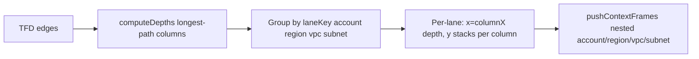

# Pipeline layout improvement — agent prompt

Copy everything below **BEGIN PROMPT** into another LLM session to give it full context for improving Terraform pipeline layout (wider, less tall, same TFD semantics).

Repo: `excalidraw-tf` (Excalidraw Terraform import / pipeline view).

---

## BEGIN PROMPT

# Mission: Improve Terraform pipeline layout (wider, less tall, same semantics)

You are improving the **pipeline view** layout in the Excalidraw Terraform import stack. The goal is to reduce **unnecessary vertical height** while preserving **declared dataflow semantics** from `.tfd` files.

## Problem statement (product intent)

Pipeline diagrams are often **too tall** because every unique **account × region × VPC × subnet** combination becomes its own **lane** (horizontal band), stacked vertically with nested context frames (account → region → VPC → subnet zone).

**Key optimization the team wants:** Many resources could be placed **one or more columns earlier** (smaller depth / further left) if they can **slot in vertically behind** resources already placed in other lanes at that column — using horizontal space instead of adding another tall lane stack.

**Concrete examples to study in the UI and tests:**

- **Region placement:** A resource in `us-west-2` at hop column 4 might fit at column 2 if `us-east-1` lanes at column 2 are shorter and leave room below them.
- **DB / private subnet placement:** DB subnets in a separate lane often sit alone at deep columns; moving them **back** a few columns can tuck them **behind** API/trunk lanes at the same hop without breaking `.tfd` edge order.

The layout should become **wider but equally semantic** — not shorter by hiding or mis-ordering dataflow.

## Hard constraints (do not violate)

1. **TFD-driven hops:** Column order comes from resolved `.tfd` `bind` + `->` edges (`nodes[DECLARED_DATAFLOW_ORDERED_KEY]`). Edges define **precedence** (source left of target), not Terraform plan IAM edges alone.
2. **Acyclic hop semantics:** If `A -> B` in TFD, `A` must be in a column **strictly left of** `B` (or same column only where fan-out already allows it — see existing test “keeps fanout targets in the same next column”).
3. **Lane identity:** Context frames (account/region/VPC/subnet) must remain truthful — placement comes from `buildPlacementMap` in `packages/excalidraw/components/terraformPipelineLayout.ts` / `topologyAddressPlacementMap` in `packages/excalidraw/components/terraformTopologyPlacementBuild.ts`.
4. **Compact mode:** Default `pipelineCompact: true` shows primary cards only; changes must work for compact and full modes.
5. **No breaking import:** Pipeline still requires ≥1 resolved TFD edge (400 if none).

## Current algorithm (read first)

| Step | Location | Behavior |
| --- | --- | --- |
| Depth columns | `computeDepths()` in `packages/excalidraw/components/terraformPipelineLayout.ts` | Longest-path depths from collapsed TFD edges |
| Lane grouping | `laneKey()` | `provider\0account\0region\0vpc\0subnetSignature` |
| XY placement | ~L655–708 | Global `columnX[depth]`; per-lane `colY[depth]` stacks downward |
| Context frames | `pushContextFrames()` | Nested frames per lane hierarchy |
| Constants | `LANE_GAP_Y=96`, `CLUSTER_GAP_Y=36`, `FRAME_PAD=28` | See also `packages/excalidraw/components/terraformPipelineLaneDebug.test.ts` |

**Gap:** Depths are computed once and never **reassigned** to use slack in other lanes. There is no **2D packing** across lanes at a given column.



## Suggested algorithm directions (research-backed)

Use local RAG + web search to pick approaches; cite sources in your design.

| Idea | Graph layout analogy | RAG query starters |
| --- | --- | --- |
| **Column reassignment with slack** | dot network simplex rank assignment | `layer reassignment network simplex slack edges` |
| **Vertical compaction per column** | Sugiyama coordinate assignment / vertical alignment | `Sugiyama framework hierarchical layout` |
| **Treat region/VPC/subnet as compound groups** | Compound / clustered layered graphs | `compound graph grouping port constraints ELK` |
| **Crossing-aware reorder within column** | Sifting / barycenter | `crossing minimization sifting layered` |
| **Constraint-based stress** | Dig-CoLa / separation constraints | `separation constraint graph layout` |

**Local RAG (required reading):**

1. Read skill: `.agents/skills/graph-layout-rag/SKILL.md`
2. Read query pack: `docs/pipeline-rag-queries.md`
3. Search: `yarn graph-rag:query "<topic>" --category <slug> --pdf-only --top 8 --json` from repo root
4. Deep-read PDFs via `doc_id` + manifest `localPath` (skill section “Reading full papers”)

Example queries:

```bash
yarn graph-rag:query "network simplex rank assignment layered digraph" --category layer-assignment --pdf-only --json
yarn graph-rag:query "compound graph nested multi-layer groups" --category compound --pdf-only --json
yarn graph-rag:query "left edge algorithm channel routing" --category packing --pdf-only --json
yarn graph-rag:query "VPSC separation constraints" --category constraints --pdf-only --json
```

You may also search the **public web** (Graphviz dot, ELK layered, Sugiyama surveys, dagre, Mermaid layout) for algorithms not in the corpus.

## Codebase map

**Start here:**

- `packages/excalidraw/components/terraformPipelineLayout.ts` — main layout engine
- `docs/terraform-pipeline-import-debug-handoff.md` — import flow, debugging
- `docs/staging-extended-localstack-v2-pipeline-handoff.md` — multi-region + multi-account preset (stress test)

**Tests to extend:**

- `packages/excalidraw/components/terraformPipelineLayout.test.ts` — column order, fan-out, placement map
- `packages/excalidraw/components/terraformPipelineLaneDebug.test.ts` — lane height diagnostics (`VITEST_TERRAFORM_VERBOSE=1`)
- `packages/excalidraw/components/terraformPipelineTfdBind.test.ts` — bind resolution per preset

**Repro presets (local):**

```bash
yarn seed:terraform-presets && yarn start
# Import dialog or /demo?preset=staging-extended-localstack-v2&view=pipeline
```

## Your workflow

1. **Baseline:** Run lane debug test on `staging-extended-localstack-v2`; record `pipelineColumnCount`, lane count, canvas height.
2. **RAG + web:** Formulate 2–3 candidate algorithms; read TSE93 / handbook hierarchical / ELK port-constraints papers as needed.
3. **Design:** Propose a **phase** inserted after `computeDepths` and before lane Y placement, e.g.:
   - `reassignDepthsWithSlack(clusters, edges, laneOccupancy)`
   - or column-wise **skyline / shelf packing** across lanes at each depth
   - Document invariants and failure modes (cycles, fan-out, single-cluster lanes).
4. **Implement** minimal change in `terraformPipelineLayout.ts` (avoid unrelated refactors).
5. **Test:** Unit tests for reassignment + preset bind tests; compare bounding box height before/after on extended presets.
6. **Report:** Before/after metrics, algorithm citations, tradeoffs (crossing edges, readability).

## Success criteria

- **Measurable:** Total scene height ↓ (or lane count effectively compressed) on `staging-extended-localstack` / `v2` presets.
- **Semantic:** All TFD edges still flow left-to-right; no hop violations.
- **Visual:** Region/subnet resources can sit **behind** other lanes at earlier columns where slack exists.
- **Maintainable:** New logic covered by tests; constants tunable.

## Out of scope unless asked

- Changing TFD syntax or preset topology
- Replacing pipeline with full ELK runtime (ideas from ELK literature are in scope; embedding ELK is not required)
- Semantic/overview layout modes (pipeline only)

## END PROMPT
