# RFC: Recursive Compound Layered Layout (RCLL) for Terraform Pipeline View

| Field | Value |
| --- | --- |
| **Status** | Draft RFC — open for peer + agent review |
| **Version** | 0.6 |
| **Date** | 2026-06-18 |
| **Author** | Layout design working session (Claude + Tushar Sariya) |
| **Reviewers** | _(pending — peer + agent)_ |
| **Supersedes** | The `Stacked / Packed / Packed+pull-left / Semantic` placement-toggle stack (proposed) |
| **Scope** | Placement algorithm for **Pipeline view** only (Semantic and Module views unchanged) |
| **Implementation** | **In progress — shipped behind `pipelineLayoutVariant:"rcll"`:** M0a/M0b (seam + measurement), M1 (model), M2 (layering), M3a (+ 2 hardening passes) / M3b (hull-aware cyclic placement, default on), M4 (swimlane lane-rise — A/B toggle, default OFF), M6 (crossing-min reorder — A/B toggle, default OFF), M5 (gate-fix `3313c2d52` + A1 Brandes–Köpf straightener `b91a4d77a` — toggle, default OFF; Axis-2 de-densify probed + PAUSED), and the ancillary "All resources" honest-toggle (UI-only; the feature itself is DEFERRED, [§8.1](#81-rcll-ancillary-all-resources--reserved-band-deferred)). **Default-on behaviour is M3a/M3b** (M4/M5/M6 are default-OFF A/B toggles). **Build/run order ≠ milestone number** — see the [§24.2](#242-milestone-table) banner. This document is the source of truth; it is kept in lockstep with the code (see Document discipline). |

## Document discipline (NORMATIVE)

This RFC is not a one-time proposal — it is the **living, authoritative description of the as-built code**. The following are hard rules (RFC-2119 MUST/MUST NOT), on the same footing as the [hard constraints (CON-\*)](#4-requirements-catalogue):

- **DOC-1 — Faithful correspondence.** The RFC **MUST** describe the RCLL pipeline code with **no ambiguity**. Every normative statement here **MUST** match the code as shipped. If prose and code disagree, that is a defect in exactly one of them and **MUST** be reconciled; a _deliberate, not-yet-closed_ gap is recorded in [§34.2](#342-implemented-vs-specified-delta-as-built-m3a-hardening) (the implemented-vs-specified delta) and nowhere else — silent drift is forbidden.
- **DOC-2 — Append on every change.** A change to the RCLL pipeline code **MUST**, in the **same change-set**, update this RFC: a **change-log** row (the narrative), a **[§34.1](#341-implementation-decision-log-di--per-milestone-as-built) DI-\*** row per settled decision, the **[§34.3](#343-commit-map-what-each-commit-implemented--decided--amended) commit map** (decision ↔ commit; the hash is backfilled in the immediately-following docs commit), and any new **[§34.4](#344-decision-dependency-graph-blast-radius) dependency edges**. A code change that leaves this doc untouched is **incomplete** unless it is a pure no-op (refactor with identical behaviour AND identical decisions).
- **DOC-3 — Supersede, never delete.** A reversed or replaced decision **MUST** be marked `superseded` (naming the superseding ID), **MUST NOT** be removed. The supersession lineage is the audit trail ([§34.4](#344-decision-dependency-graph-blast-radius) draws it).
- **DOC-4 — Findings vs choices.** A decision premised on a **measurement** (e.g. a Step-0 probe result) **MUST** record that premise. If the measurement later changes, every decision downstream of it in [§34.4](#344-decision-dependency-graph-blast-radius) **MUST** be re-evaluated before relying on it.
- **DOC-5 — Decisions are auditable.** Every settled decision is traceable end-to-end: change-log → DI-\* (rationale + revisitability) → commit map (hash) → dependency graph (blast radius). A reviewer **MUST** be able to answer "why is the code this way, what did it replace, and what breaks if we change it" from this document alone.

## Abstract

Pipeline view renders Terraform declared-dataflow (`.tfd`) graphs as Excalidraw diagrams. The current engine produces diagrams that are **far too tall** and **hard to read as dataflow** because it performs graph _layering_ (columns) and a vertical _packing_ pass but omits the **ordering** and **coordinate-assignment** phases that the graph-drawing literature treats as mandatory for a compound layered graph. This RFC specifies **Recursive Compound Layered Layout (RCLL)**: a single algorithm that runs the classic **Sugiyama hierarchical pipeline** (_layer → order → center → compact_) **recursively inside every topology hull**, governed by an explicit **priority lattice** that makes hard structure (TFD order, hull nesting, fan-out columns) and human readability (hub centering) **senior** to height/width compaction. It reads left-to-right, centers hubs over their fan-outs, keeps fan-outs column-aligned, pushes _free_ nodes right to reclaim vertical space, and packs left so the diagram does not sprawl horizontally. The design is grounded in primary literature (Sugiyama, Gansner, Brandes–Köpf, Sander, Doğrusöz, Rüegg, Jünger–Mutzel–Spisla, Dwyer–Marriott, Domrös, and others), and every constraint, requirement, preference, flexibility, decision, and rejected alternative is recorded here so the design can be evolved without losing context.

## Change log

| Version | Date | Change |
| --- | --- | --- |
| 0.1 | 2026-06-16 | Initial RFC consolidating nine clarifying decisions and the literature survey. |
| 0.2 | 2026-06-16 | Added §22 (modular "Lego" pipeline architecture) and §23 (human-factors readability principles, engine practice, optional extras EXT-1…EXT-12, references R21–R30, harvest candidates). |
| 0.3 | 2026-06-16 | Added §24 (implementation order & build sequence — milestones M0–M12, each shippable behind the flag, with a decision gate + acceptance criteria; dependency graph; minimum-viable-readable cut). |
| 0.4 | 2026-06-16 | Robustness pass: added §25 assumptions/preconditions, §26 edge cases & degenerate inputs, §27 failure modes & fallback ladder, §28 configuration & module API surface, §29 observability & debugging, §30 determinism spec (normative), §31 interactions with existing editor features, §32 backward compatibility & migration, §33 risk register, §34 consolidated decision log, §35 test fixture matrix. Surfaced DEC-7 (huge fan-out) and DEC-8 (SCC cycle handling). |
| 0.5 | 2026-06-16 | Visual pass: inline Mermaid diagrams in §5/§7/§22/§24/§27; added **§36 Appendix C — Visual glossary** (structural Mermaid, geometric ASCII before/after, and a decision card with a figure for every DEC-1…8, D1…12, EXT-1…12, and tiers T1…7). Repaired §1/§13/§26 table rendering. |
| 0.6 | 2026-06-18 | **Reconciliation + source-encoding governance (architect review).** Brought the header **Implementation** field current — M4 (swimlane lane-rise), M6 (crossing-min reorder), M5 (gate-fix `3313c2d52` + A1 straightener `b91a4d77a`), and the ancillary honest-toggle had all shipped while the summary still read only "M3a/M3b" (a DOC-2 lapse); bumped Version/Date. Redrew the **[§24.3](#243-dependency-graph--reordering-freedom) dependency graph to the as-built shape** (M4 = swimlane lane-rise, **not** a spine ruler; M6 ordering shipped **before** M5; M7 push-right **skipped** on v2) and added a **[§24.2](#242-milestone-table) "milestone number ≠ build/run order" banner**. Added a normative **[§30](#30-determinism-specification-normative) source-encoding rule** (rule 8 — composite-key delimiters MUST use the `\0` / `\u0001` **escape**, never a raw control byte) + an enforcing guard test (`terraformSourceHygiene.test.ts`); cleaned up the **9 raw NUL + 2 raw `0x01` bytes** that had made four RCLL files (`…LayoutRcll`, `…RcllModel`, `…RcllLayering`, `…V2Structure`, `…RcllPlacement`) read as **binary** to `grep`/`git diff`/`file(1)` — byte-identical runtime strings, a DOC-2 no-op refactor. **No engine/geometry change.** |
| — | 2026-06-19 | **Subnet de-band — the FIRST lever to break v2's height wall (the "change _what_ is drawn" round the option-C terminal finding called for). BUILT (Phase 1a placement + 1b membership visual + Phase 2 UI toggle), default OFF, NOT yet committed at time of writing.** After the option-C conclusion ("no _structure-preserving_ lever reduces v2's height"), the user proposed changing the structure: stop drawing each subnet as its own boxed Y-lane; collapse a VPC's subnets so its resources share **one** column stack, and show subnet membership as a lighter annotation. Planned through `plan-eng-review` (Codex high-reasoning + its own corpus research: MapSets, BubbleSets/LineSets/KelpFusion). **Codex verdict BUILD-WITH-CHANGES**, 4 folded findings: (1) probe the **real rendered `maxDepthPx`** via the full scene export, not a Σ-lane-heights proxy; (2) dropping the subnet frame has a real parenting blast radius (VPC child construction, edge-LCA topology-path, aggregate sibling connectors); (3) split the gate (resource non-overlap stays 0, subnet-annotation overlap allowed); (4) the corpus **disfavours overlapping group boxes** → defer + decide the membership visual after the de-banded layout is visible. **The crux (settled by reading code):** on v2's cyclic-provider swimlane path `layoutLanesOnAxis` (`terraformPipelineRcllPlacement.ts`) stacks each subnet **lane** into its own disjoint Y band (`cursorY += lane.box.height + GAP`) while _bare leaves_ on the same axis already share one `colCursor`; so `height ≈ Σ(subnet bands)` and the merged floor is the max-column-occupancy. **Phase-0 throwaway probe (real `maxDepthPx`, ON vs OFF, v2): DECISIVE GO — Compact 14 374 → 10 147 (−29.4 %), Full 27 763 → 20 091 (−27.6 %); width −0.5 % (X / `colByCluster` untouched ⇒ CON-12-safe); placement gates 0.** **Phase 1a (placement de-band + frame suppression):** a pre-pass `collapseSubnetsForDeBand(root)` in `layoutPlacement` (after `cloneNode`, before `sizeAndArrange`) lifts each `vpc` node's subnet-zone clusters to **direct** VPC children (re-sorted `(mds,key)`); the existing leaf path then merges them into one stack. The whole frame/parenting system is driven by **cluster topology metadata**, not the placement tree, so the entire blast radius reduced to **one lever**: skip the `subnetZone` level in `emitTopologyContextFrames` (the VPC's child lookup falls back to `?? cluster.build.clusterFrameId` → VPC parents the cluster frames directly) + `topologyPathForCluster(cluster, subnetDeBand)` truncates the path to drop `subnetSignature` (same-subnet edges' LCA = VPC, dangling sibling connectors don't emit). The optional `subnetDeBand` (default false → compound path untouched) threads `topologyPathForCluster`/`emitTopologyContextFrames`/`assignCompoundEdgeFrameParents`/`appendCompoundTopologyFrameEdgeSkeletons`/`buildSceneFromBoxedTree`. **Simplification of Codex #3:** because the pre-pass _removes_ the subnet nodes (vs keep-and-exempt), the existing `containmentViolations`/`siblingOverlapViolations` already measure the correct merged cluster-in-VPC geometry — **no gate exemption / replacement gates needed** (0 on v2). Rendered collisions **12 → 0** (the 12 were exactly the overlapping subnet _frames_ before suppression). **Phase 1b (membership visual — user chose per-card chip + legend after viewing the de-banded layout, over the dotted overlap box the corpus warns against):** new pure `terraformPipelineSubnetAnnotation.ts` adds a thin tier-colored **rail** (public=green / private=violet / intra=pink via `getContextFrameColorForTopologyRole("subnetZone",…)`) in the gap _left_ of each subnet card + a **tier legend**; tagged `customData.terraformSubnetChip` with **no** `terraformTopologyRole`, so the gates and `diagnosePipelineScene` (which key off topology-role frames) ignore them. **Phase 2 (UI):** threaded `subnetDeBand`/`pipelineSubnetDeBand` through the 14-file import chain (mirroring `pipelineReorder`); dialog control **"Subnets · Boxed / De-banded"** (RCLL-only `!showVariant`, default OFF) + URL `?subnetDeBand=1` + two `OPTION_HELP` entries + session round-trip. `rcllMilestone` → `"M7s"`, `rcllSubnetDeBand` meta. Tests: `terraformPipelineSubnetAnnotation.test.ts` (5 unit) + `terraformPipelineSubnetDeBand.test.ts` (v2 integration — height win, gates 0, X preserved, deterministic, subnet frames suppressed + VPC frames intact + no dangling parent, rails + legend present + gate-invisible, OFF byte-identical) + dialog toggle + URL round-trip; all green, typecheck + lint:arch clean. §8.2 as-built; DEC-11; plan `resilient-meandering-wren.md`. **DEFERRED:** VPC/region/account de-band (same mechanism one level up); BubbleSets/Kelp boundaries (a richer set-membership render). |
| — | 2026-06-18 | **RCLL ancillary ("All resources") — investigated, feature DEFERRED, toggle made honest.** User report: in the RCLL view, switching Resources → "All resources" does nothing (the unconnected resources never appear). Confirmed root cause (NOT a regression): the `includeAncillary` flag threads end-to-end but the RCLL model is dataflow-only — a **documented M3a limitation** (`terraformPipelineLayoutRcll.ts:176`, since `c25f0b2a1`); reproduced (ancillary ON==OFF, 1333 els). Three architectures were designed + measured (campaign discipline): **(1) column-leaf model injection** — REJECTED by code analysis: a strip as a `role:"primaryCluster"` leaf reflows the dataflow columns (a wide strip widens its column → `columnOffsetsFromWidths`), lands beside column-1+ not below the scope (`placePackedColumns`), and pollutes model metrics (`primaryClusterCount` + the `MAX_SAFE_INTEGER` sentinel). **(2) export-phase placement** — IMPLEMENTED + MEASURED on v2, then REJECTED: strips drew with **zero model pollution** (`primaryClusterCount` 123/123) and no column reflow, but **90 collisions (compact) / 86 (full)** — because RCLL positions accounts/regions/VPCs in the model phase and the export phase (`applyCompoundHierarchicalLayout`) only re-stacks **providers** (v2 has one), so a strip grows a region hull into the next region with nothing re-stacking regions. **(3) model-phase reserved band** (the correct design) — a per-container bottom band placed in the placement engine like the `mixed`-VPC policy (`placeForcedBands` then a disjoint-Y region below), so the container **footprint** reserves the space (no collision), placed below the columns (no reflow), typed with a distinct `ancillaryBand` role (no pollution). Codex flagged that (3) is a real placement-engine milestone (role-blindness across `collectClusterLeaves` + the cyclic `arrangeByHullMatrix` engine; inject-before-`runRcllPipeline`; determinism re-sort; a mandatory band-width cap since the container footprint width still feeds the parent's `columnWidths`; the empty-`normalKids` case). **Decision: DEFER the feature** (a scoped future milestone, design + Step-0 evidence recorded here) and **make the toggle honest now** — under RCLL the "All resources" option is **disabled** (greyed, with a "not in this layout / planned" note) and "Dataflow only" reads active, so the control reflects reality instead of silently no-op'ing. UI-only change (`TerraformImportPipelineSettings.tsx` `option()` gains a `disabled` arm gated on `!showVariant`; SCSS `:disabled`; help entry `resources.allRcll`); no engine/model change. Tests: dialog asserts "All resources" disabled + "Dataflow only" active + import keeps `pipelineIncludeAncillary:false` under RCLL. Eng-review + 2 Codex rounds drove the three-architecture investigation. DI-ANC-1..3; §34.2 deferred-delta row. |
| — | 2026-06-19 | **[ROUND 3 — SUPERSEDED by the 2026-06-20 round-4 GO above; retained for the failure record.]** **`rankSeparate` — sibling-separation ranking (the GLOBAL single-frame stagger DEC-12/DI-DEB-4 left UNTESTED) — BUILT behind a default-OFF flag + PROBED on v2; NO-GO, the open question is now CLOSED.** The prior re-probe ended with "a GLOBAL single-frame stagger (keep only mutually-bidirectional pairs co-axial) is UNTESTED — the NO-GO is NOT closed." This is that mechanism, formulated as canonical **Sugiyama Phase-1 layer assignment on the SCC condensation** (the reframe at the top of the plan): collapse each two-way hull cycle (e.g. `0002⇄0003`) into one co-axial quotient node, add a precedence edge `maxRank(A)+1 ≤ minRank(B)` for every one-way quotient-sibling edge, then rank by **augmented longest-path** — feeding separated ranks into the consumed axis (`colByCluster` via `buildLaneContext`). Built as a real default-OFF milestone candidate, not a throwaway: a pure module `terraformPipelineRcllRankSeparate.ts` (`buildSeparationConstraintGraph` SCC-quotient + separation-only edges + a cycle **infeasibility detector** that rejects + falls back; `computeSeparatedRanks` recursive shift-accumulation over `longestPath` topo order), **14/14 unit tests green** (chain / diamond / independent / 2-way co-axial / nested / long-edge / determinism + the infeasibility detector), threaded `rankSeparate` through `RcllOptions`/`PlaceCtx`/`buildLaneContext`/`terraformPipelineLayoutRcll` (the same template as `subnetDeBand`). **Separation FIRED** (per-container SCC quotients computed; `shifted=81` of 103 leaves). **v2 Compact 4-config measurement (base / m4-rise-only / rankSep / rankSep+m4):** base **H=14 374 W=11 790**, gates 0, cross 250; m4 14 067 / 11 790, gates 0, cross 250; **rankSep 16 222 / 12 782**, bwd **7** sameCol **1**, cross **456**; **rankSep+m4 14 761 / 12 782**, bwd **7** sameCol **1**, cross **445**. **NO-GO on three independent failures:** **(1) height went the WRONG way** — target was a ≳10–15 % _drop_; even with the M4 rise composed in, rankSep+m4 is **+2.7 % vs base** and **+4.9 % vs m4-alone**, while width rose **+8.4 %** (lose-lose, not the intended width-for-height trade — separating one-way siblings in X did not let them rise in Y because the lanes stay too cross-wired to share rows). **(2) the iron rule broke** — `acyclicBackwardEdges=7`, `acyclicSameColumnEdges=1` (must be 0). **(3) readability worse** — crossings **250 → 445 (+78 %)**. **CAUSE of the 7+1 (instrumented `backwardEdgeGate`, dedup set identical across both rankSep configs) — and a CORRECTION to the earlier "cross-cycle" claim:** these are **NOT** cycle-induced; `D` is acyclic and the gate logs them all in the `!isCyclic` branch (singleton SCCs of `D`). An LCA tracer over the 8 offenders found the dominant mechanism: **7 of 8 are CROSS-ACCOUNT leaf edges between accounts `0002` and `0003`** — the **two-way SCC pair** the ranker (correctly) keeps **co-axial** (members start at shift 0; no separation between them). The directions run _both_ ways, which is the 2-way bundle itself: `consumer_lambda…→sqs.ingest_fifo` is `0002→0003`; `lake["curated"]→lake_replica_west_1`, `lake["archive"]→lake_replica_east_2`, `api8/9/10/11.aws_api_gateway_rest_api.private→…ecs/lambda` are `0003→0002` (the `api*` modules **span** both accounts — _not_ the intra-module convergence an earlier draft of this row claimed; that sub-claim is withdrawn). **Co-axiality of the two account hulls does NOT prevent the backward edges:** `placeSeparated` re-ranks **each account's interior independently**, so a cross-account leaf edge links a deeply-shifted leaf in one account to a differently-shifted leaf in the other and inverts — and because `0002⇄0003` is genuinely bidirectional, _some_ cross-account edge must read backward no matter which interior leads. The lone same-column (`consumer_lambda→sqs`, dx=−56) is the un-shifted member of that same cross-account set. **The 8th** (`dynamodb.regional_events_east→regional_aurora_east_2`, dx=−936) is the only intra-account case — account `0003`, regions `us-east-1→us-east-2`, which the tracer confirms are **one-way** (`TWO_WAY=false`); its inversion is a shift-magnitude/densification artifact, not a two-way issue. **So the structural fix is NOT "keep the two-way hulls co-axial" (already done) — it is rank the two co-axial hulls' interiors in ONE shared global frame** (the Codex #2 global-cascade point), a strictly bigger leaf-granular re-rank. **In principle repairable**, but it does **not** rescue the lever: the height failure is independent (height rose even with the rise), so the NO-GO stands on the height criterion regardless. **This CLOSES the DEC-12 open question:** the global single-frame stagger is now tested → still NO-GO, but for a **new** reason (ranking-granularity mismatch + height does not drop), not the old cross-cycle reason. §9.5 item 8 (sub-finding); DEC-12 (status → CLOSED); DI-DEB-5; plan `resilient-meandering-wren.md`. |
| — | 2026-06-20 | **Expose the internal RCLL toggles on the import dialog + footgun guards.** Surfaced the four internal/measurement RCLL flags as RCLL-only inline rows in `TerraformImportPipelineSettings.tsx` (the `subnetDeBand` 9-file threading pattern: URL param → `TerraformDemoAutoImport` → `useTerraformImportDialog` → `TerraformImportDialog` → settings → `terraformPresetImport` → `terraformSceneApply` → `terraformImportSession` → `terraformLayoutCore`): **Separation** (`rankSeparate`), **Straighten** (`straighten`), **De-densify** (`deDensify`), **Cycle bands** (`staircaseBandOverlap`, default Risen/on). Decisions (user, AskUserQuestion): **expose all with honest help** (the no-op-on-v2 toggles `straighten`/`deDensify` ship with help text that says so, rather than as silent dead controls); **rankSeparate gated** (its "On" is disabled until Swimlanes = Risen, since solo it is taller/+28% width/+45% crossings — the −42% win is only composed with M4); **inline rows** (no Advanced disclosure). **Footgun guards = one pure helper** `terraformPipelineToggleGuards.ts` (`rankSeparateAvailable` / `applyRcllToggleGuards`), the single source of truth for the coupling, used by three defense layers: (1) UI `disabled` arm on Separation·On; (2) turning Swimlanes→Stacked clears a set Separation; (3) `terraformLayoutCore` backstop drops `rankSeparate` without rise on the URL/programmatic path and records `pipelineRankSeparateSuppressed` in meta (the RCLL **engine stays literal** — `buildV2` measurement tests unaffected). The helper also defaults the `deDensify` width dial to 2 (inert without it). `staircaseBandOverlap` is passthrough (undefined ⇒ engine `!== false` default true ⇒ OFF byte-identical); only an explicit Stacked threads `false`. Tests: `terraformPipelineToggleGuards.test.ts` (8), dialog gating/coupling + 4 thread-through cases in `TerraformImportDialog.test.tsx`, 4 URL round-trips in `terraformDemoUrlParams.test.ts`; typecheck + lint:arch clean (core does not import UI). Milestone `"M8r"` + `rcllRankSeparate`/`rcllRankSeparate*` meta already shipped (round 4). NOT yet committed. |
| — | 2026-06-20 | **RCLL dialog UX — pipeline-order grouping + one vocabulary + side-panel schematics (display-only, no engine/URL/state change).** Follow-up to the toggle-exposure row above: the exposed RCLL rows were in an arbitrary order, mixed metaphors, and had no visual. Grounded in the RFC's own framing (the Sugiyama pipeline `layer → order → center → compact`) + `graph-layout-rag` (ELK's canonical `layer-assignment → ordering → coordinate-assignment → routing`). Three user decisions (AskUserQuestion): **(1) group + reorder** the RCLL controls under phase sub-headers **Content → Structure → Columns → Ordering → Vertical** so the menu reads top-to-bottom as the engine applies the passes (X-passes, the model transform, and Y-passes were previously interleaved); **(2) side-panel schematics** — a decorative before/after `<svg>` per geometry option, rendered in the existing help `aside` and swapped off the existing `hoverKey ?? stickyKey`; **(3) one vocabulary** — rename the rows so the two Y-rise levers read as parallel: Separation→**Lane split**, De-densify→**Column spread**, Swimlanes→**Lane height**, Cycle bands→**Cycle height** (button labels Off/On · Stacked/Risen kept; Cycle-height button order normalized to `[Stacked][Risen]` to match Lane height). `OPTION_HELP` keys renamed in lockstep (`laneheight.*`/`cycleheight.*`/`lanesplit.*`/`columnspread.*`) so keys, titles, and the figures map share ONE vocabulary. New `terraformPipelineSettingsFigures.tsx` = a single config-driven `<MiniDiagram>` primitive (≈14 before/after schematics, no bespoke per-option SVG; `aria-hidden` so the `aria-live` help never announces them). Planned via `/plan-eng-review` + Codex (6 concerns absorbed); two folded a11y fixes: the Lane-split prerequisite stays visible in the inline sub-label (not just hover), and the gated arm switched from native `disabled` (not keyboard-focusable → its "why off?" help was unreachable) to **`aria-disabled`** + suppressed onClick (focusable, help reachable; SCSS `:disabled, [aria-disabled="true"]`). The footgun coupling is preserved verbatim (Lane split On gated on lane-rise; Lane height→Stacked clears it). Tests: four `getByRole("group")` aria-label renames + Lane-split gating assertion switched to `aria-disabled` + no-flip-on-click + a new figure-render assertion in `TerraformImportDialog.test.tsx` (30 green); typecheck + lint:arch clean (figures file UI-only, no core→UI import). NOT yet committed. |
| — | 2026-06-20 | **`rankSeparate` ROUND 4 — REBUILT as whole-model-global Sander layering; the round-3 NO-GO is REVERSED → GO (CON-12 forward, −42 % height composed with M4).** The round-3 ranker (the row below) re-ranked each container's interior in its OWN local frame, so the co-axial `0002⇄0003` pair's cross-account leaf edges linked differently-shifted interiors and inverted (7 backward + 1 same-column). The corpus named the fix unambiguously (`graph-layout-rag`): **Sander, _Layout of Compound Directed Graphs_** — rank EVERY base (leaf) node in ONE global pass; a container's span is _derived_ from its leaves, never assigned independently (the dagre/ELK construction). Re-planned through `/plan-eng-review` + Codex (10 findings; 3 drove decisions). **Decisions (user, via AskUserQuestion):** (1) **whole-model-global** pre-pass, not lane-local (a lane-local pass still loses boundary edges to source/sink accounts — Codex #1/#6/#9); (2) **all-to-all** leaf separation `a→b ∀ a∈leaves(A),b∈leaves(B)` per one-way pair (one edge between preselected reps does NOT enforce `all-A<all-B` — Codex #2/#3/#10); (3) **strengthened correctness-first** bar — separation must FIRE (`pairCount>0 ∧ changedRankCount>0 ∧ fallbackReason=none`), since 0/0 is also satisfiable by the no-op fallback (Codex #4/#8); observable meta replaces `null`. **Rebuilt** `terraformPipelineRcllRankSeparate.ts`: `computeGlobalSeparatedFloor(tree, baseFloor, leafAdjacency, hullEdges)` collects ALL leaves, builds the whole-model leaf DAG (`lattice.fanout`), walks every container running the kept `buildSeparationConstraintGraph` (SCC quotient → one-way condEdges; mutual cycle → one quotient → co-axial), adds all-to-all sep edges, runs ONE `longestPath` over (leaf edges ∪ sep edges) → the separated floor. **Observable fallbacks:** `pairCount===0` returns the base floor verbatim (OFF byte-identical, no re-rank); an augmented-graph cycle keeps the base floor with `fallbackReason="augmented-cycle"` (never a silent expansion). Deleted the round-3 `computeSeparatedRanks`/`placeSeparated`/`solveSeparationShifts` per-container recursion. Wired once in `placementStage` (computes the floor, places with it, surfaces `rcllStageMeta.placement.rankSeparate*` scalars); `buildLaneContext` reverted to the plain floor. Milestone `"M8r"`, `rcllRankSeparate` meta. **Probe-first GO (v2 Compact, throwaway 4-config):** rankSep **bwd 0** (was 7), **sameCol 0** (was 1), pairs **80**, changedRanks **112**, fallback none; rankSep+M4 **H 14 374→8 377 (−42 %)**. **v2 integration test (`terraformPipelineRankSeparate.test.ts`, Compact + Full):** CON-12 gates 0/0, separation fires, the composed M4 config drops height below base, containment/siblingOverlap/collision 0, OFF byte-identical, deterministic. **18 ranker unit tests** (the original 14 + 4 adversarial: nested one-way composes across levels, shared fan-in sink-after-all, _nested_ augmented-cycle through a deeper container, unbounded-width-by-design). **Costs (opt-in, default OFF):** width +28 %, crossings 250→362 (+45 %) — cross-container crossing-min is a separate milestone; border-nodes+minlen (T6) deferred unless width regresses further. **Key correction to round 3:** the EXISTING M4 lane-rise delivers the win unchanged — the round-3-planned "M4 occupied-set-disjointness" modification is **unnecessary and was NOT built** (rankSeparate alone is _taller_; M4 does the Y reclamation). §9.5 item 8 (round-4 reversal); §9.6 (DEC-13); DEC-12 (status → GO for the global form); DI-DEB-6; plan `resilient-meandering-wren.md`. NOT yet committed at time of writing. |
| — | 2026-06-19 | **Hull X-stagger — RE-PROBED ×2; NO-GO REOPENED (D is acyclic — there is no real cycle; the local probe just never built the global cascade).** The user pushed back on the NO-GO with a sharper model (`A→B→C` / `A→D→E→C`: the reconvergence point can sit in another VPC, so the cascade must be cleverer) and asked specifically why pushing `us-east-2`/`us-west-1/2`/DB-subnets behind their siblings fails. A **topology census of v2** vindicated the framing: at the **account** level the region sibling-hull DAG is **acyclic** (mutual=0; indep 4 / one-way 2 of 6 pairs) — so the original "44 backward" came from staggering **leaf-level lane interiors**, NOT the user's rigid-hull lever. A **second throwaway probe** (`staggerLanesIntoBands` in `layoutLanesOnAxis`) staggered **rigid region hulls into disjoint X-bands by the account DAG's topological order** (every one-way edge forward by construction): **height −58 % (Compact 14 374→5 917, Full 27 763→11 712), deterministic — but still illegal: 18 backward / 31 containment / 15 collisions / +300 % width.** The 18 backward are a **fixed structural set identical Compact↔Full = the cross-account edges.** **Root cause (corrected once more — there is NO real cycle):** the resource graph `D` is **acyclic** (`depthResult.hasCycle=false`). The provider swimlane is a **projection 2-cycle in the account-hull graph: `0002→0003` (6 edges) ∧ `0003→0002` (7 _different_ edges)** — opposite-direction one-way bundles (Sander/Forster artifact; accounts `0001`/`0004` = pure source/sink, in no cycle). The 18 backward came from staggering each account in its **own local frame** (the global cascade Codex #2 flagged was never built), **not** an inherent illegality. **Withdraws "legal only with DEC-5":** since `D` is acyclic a globally-consistent zero-backward rank exists; DEC-5 was never the blocker. Genuine constraint is local — only the **bidirectional pair `0002⇄0003`** can't be rigid-disjoint-banded; `0001`/`0004` + non-bidirectional hulls stagger freely. **Corrected principle:** a hull is band-staggerable iff it has no _bidirectional_ cross-band flow with a sibling. **A GLOBAL single-frame stagger (keep only mutually-bidirectional pairs co-axial) is UNTESTED — the NO-GO is NOT closed.** Both probes + wiring reverted (engine at HEAD). §9.5 item 8 correction; DEC-12 (B/C/status rewritten); DI-DEB-4. |
| — | 2026-06-19 | **Hull X-stagger + Y-rise (containment-preserving height lever) — PROBED + NO-GO; proves the wall for the band-stacking height axis.** After subnet de-band (−28 %, the first lever to move v2 height by _dissolving_ a hull box), the user proposed the gentler dual: **keep** the hull box and slide a one-way / independent sibling hull to greater X until it clears, then **rise** it to share Y rows (trade width for height — the RFC's aspect target prefers width). Planned through `plan-eng-review` (Codex high-reasoning + own corpus research: Sander, Forster, Eiglsperger, Handbook min-width); **Codex BUILD-WITH-CHANGES — corrected Phase-0 probe only**, 7 findings folded (load-bearing: stagger the **consumed** axis `colByCluster`/`buildLaneContext`, not `localColumn` → else the M4-reframe no-op; cascade is **global** not per-container; gate readability + a hull-edge forwardness gate; 4-config compose-with-de-band matrix). **Two-stage throwaway probe (v2):** (a) **critical-path census** found **~19–22 % reclaimable** (Compact 3 158/14 208, Full 5 284/27 597), **one-way-dominated** (independent-only ~3 %, off-critical — so the win is the user's "one-way edge → slot the child behind" case), concentrated in **one `account` of 3 region swimlane-lanes**; (b) **real 4-config matrix** built the stagger on the swimlane lane interior (`layoutLanesOnAxis`) and measured **height −73 % (14 374→3 840 / 27 763→7 810) BUT the iron rule SHATTERED — 44 `acyclicBackwardEdges`, 95 `acyclicSameColumnEdges`, 75 containment, width +304 %, crossings 250→619.** The lanes share one `colByCluster` axis _because_ their resources are densely cross-connected; separating the hulls in X makes those edges read backward. The CON-12-safe subset (truly independent lanes) is only the ~3 % off-critical no-op. **Conclusion: the band-stacking height is reachable only by breaking CON-12, legal only with DEC-5 dummy-node routing** — so **DEC-5 is the prerequisite for this lever** (and the same foundation cross-container crossing-min needs). Same density wall as M4/de-density/option-C, now proven for the _band-stacking_ axis: de-band works (merges _within_ a shared axis, no new backward edges); stagger fails (separates cross-connected hulls). **Decision (user): STOP — record, don't build;** DEC-5 is its own scoped decision (even with it, +304 % width / 2.5× crossings cast doubt vs de-band's clean −28 %). Probe deleted (numbers are the artifact). §9.5 item 8; DEC-12; DI-DEB-4; plan `resilient-meandering-wren.md`. |
| — | 2026-06-19 | **Option C · fan-out junctions / edge concentration — PROBED + NOT BUILT (the campaign's terminal structure-preserving finding).** Planned through `plan-eng-review` (Codex high-reasoning + its own corpus research: Handbook §13.4 edge concentration, Confluent Layered Drawings, Improving Layered Graph Layouts with Edge Bundling, Newbery/biclique complexity). Codex verdict **BUILD-WITH-CHANGES** with five folded corrections, the load-bearing ones being: the target-spread must rewrite **`colByCluster` inside `buildLaneContext`** (a layering-pass T4-relax is a v2 no-op — `columnsForContainer` skips T4 on cyclic containers, `terraformPipelineRcllLayering.ts:84`, and v2's whole provider is cyclic), and **an invisible waypoint alone is mere edge-bundling** — height only drops if the placement pass lowers per-column occupancy. Gated the build behind a **Phase-0 throwaway movability probe** (Codex's "cheap proof"): run the real layering+placement pipeline on v2, read placed `box.x` as the true column, and for every fan-out target in a star of ≥4 count how many can spread to a forward column while keeping all in-axis predecessors strictly left + successors strictly right. **v2 result (Compact + Full identical): 8 stars / 39 targets, 27 nominally movable, 0 cross-axis-blocked, 11 blocked by a near successor — BUT max column occupancy drops only 11 → 10.** The decisive breakdown: the **bottleneck column is 11 cards deep and contains exactly 1 movable fan target — the other 10 are immovable** (their own downstream dependency sits one column to the right, so moving creates a same-column CON-12 violation). Junctions concentrate fan-**outs**; v2's tallest column is a deep **convergence/chain** region, not a fan-out crowd. **Decision (user): STOP — record, don't build.** This is the campaign-level conclusion: **no structure-preserving lever can reduce v2's height** because its critical column is 10 cards of genuinely-pinned dependency depth (same wall that capped M4 −2% / M6 −3 / A1 0 / de-density 0). Moving v2's height now requires changing _what is drawn_ (visible junctions that MERGE convergence cards, accepting v2 is genuinely tall, or a non-column layout) — a new design round, deferred. Probe deleted (numbers are the artifact); §9.5; plan `resilient-meandering-wren.md`. |
| — | 2026-06-19 | **M5b · de-density (Axis-2 B) — SAFE version BUILT + measured NO-OP on v2; committed `23b52fd5e` (correct, tested, default-OFF/dial-gated infra).** A new de-density plan went through `plan-eng-review` (Codex high-reasoning + its **own** graph-layout-rag corpus research). **Codex verdict on the first (aggressive) draft = DON'T-BUILD-YET**, on two decisive code findings: (1) the A1 straightener aligns neighbours at **`col±1` only** (`terraformPipelineStraighten.ts:196`; no dummies, DEC-5 deferred) — so spreading a fan-out target more than one column converts its edge into a long edge the straightener **ignores** (Y-room created, arrow hidden from the tool meant to use it); (2) a **cap-vs-CON-12 trilemma** in naïve "promote-then-relax". Corpus (Column-Based Graph Layouts; Confluent Layered Drawings; Handbook edge-concentration) backs **preserving columns** + junctions (not scattering) for fan density. **Pivoted to the SAFE form** (column-preserving, single-column, slack-bounded, measure-first, no UI): new pure `terraformPipelineDeDensify.ts` (`deDensifyColumns`) promotes a leaf `c→c+1` only when its neighbourhood is in-axis + purely forward + has no neighbour at `c-1`/`c+1` + doesn't split a fan group + the move is toward a sparser column within a hard `maxExtraCols` bound. Rules 2-4 make it **CON-12-safe by construction → no relax pass → the trilemma dissolves**. Wired internal `deDensify`/`deDensifyMaxCols` through `RcllOptions`/`RcllBuildOptions`/`PlaceCtx`→`buildLaneContext` (applied on the swimlane/cyclic path where v2 density lives); `rcllMilestone`→`"M5b"`, `rcllDeDensify` meta; **not** threaded to the UI (Codex #7, no UI before proof). **v2 result (maxCols=4, Compact + Full): NO-OP — ON == OFF byte-identical on every metric** (height 27 763 / width 13 354 / nearStraight 0.10 / fanoutColumnRate 0.27 / crossings 274; `deDensify+straighten` == `straighten`-alone); all structural gates 0, deterministic, dial-off (`maxCols:0`) byte-identical. **Why:** v2's dataflow is cross-container-dominated, so within any one swimlane SCC group almost every leaf has an out-of-axis neighbour (rule 1) or an adjacent in-axis neighbour (rules 3/4) — the SAFE set is empty (the same density wall that caps M4 −2% / M6 −3 / A1 no-op). **Decision (measure-first rule): STOP — record, don't build the UI;** keep as correct, gated, default-OFF infra (parallel to A1) that would help a sparser preset. Re-confirms that **only option C (junctions) moves v2's density.** §9.5 as-built; plan `resilient-meandering-wren.md`. |
| — | 2026-06-18 | **A1 Brandes–Köpf straightener committed (`b91a4d77a`); Axis-2 de-densify PROBED + PAUSED (option C reframed to de-densify-first, then stopped).** Closing the M5 straightness arc: (1) **A1 committed `b91a4d77a`** (`terraformPipelineStraighten.ts` + test + the `straighten` default-OFF wiring) — reduced two-sided no-dummy size-aware Brandes–Köpf, Y-only/single-pass/pure (CON-8/9/12); 52 RCLL+placement+straighten tests + typecheck + lint:arch green; OFF byte-identical. (2) The "go big / option C (metro junctions)" direction went through a full **plan-eng-review ceremony** (gstack + Codex outside voice, 13 Codex findings) which **reframed it to de-densify-first** on a decisive code finding: **relaxing REQ-3/T4 ("fan-out targets share a column") is a v2 NO-OP** — fan-out pinning runs only on acyclic containers, but v2's provider is cyclic → the swimlane path columns by `denseRank(LB)` with no pinning to relax. The real lever is splitting **independent same-rank cards into intra-rank sub-lanes** (rank stays A1's alignment unit; Codex caught that the headroom must be measured per real `colCursor` stacking set, not global rank). (3) A throwaway **Step-0 probe** (pipeline called directly, leaves grouped by `box.x` = the real stacking set) measured v2: 25 dense sets, max occupancy 11, **53/114 (46%) of dense cards independent, ~54% fan-concentration** (junction territory). (4) **Decision (user): STOP — record, don't build.** De-densify is only a partial v2 lever (half the density needs junctions), so the campaign pauses with the density characterized; A1 ships default-OFF; **option C (junction / edge-concentration)** remains the deferred escalation that addresses the dominant fan-concentrated half. DI-M5b-1 (supersedes DI-M5-6); §34.3 `b91a4d77a`. Research captured for option C: Handbook §13.4 intersection cover, Newbery greedy heuristic (CON-8-safe), Confluent §4.1 barycenter junction placement, Onoue 2016 edge concentration. |
| — | 2026-06-18 | **M5 reframed: centering → STRAIGHTNESS (train/metro reading); A1 Brandes–Köpf built + measured NO-OP on v2 (density-capped); metro/option-C chosen as the de-densifier.** §9 was rewritten to a **two-axis model**: Axis-1 = Y-straightener (Brandes–Köpf [R10] / [R11] flow — both assign Y only); Axis-2 = X-room (de-densify / metro). The load-bearing correction: **[R11] "prescribed width" = our prescribed _height_** ("their width = our height") — a height-budgeted Axis-1 straightener, **not** an X-spreader; the pre-pivot §9 conflated the two, and the earlier "T6 = 3/123 free-slack → SKIP" measured the wrong lever. **Sequence of work:** (1) a first M5 cut (median hub-centering + down-only `separateY1D`) was built and **measured to REGRESS** on v2 (hubCenteringRate up 0.07→0.11 **but** crossings 247→274 and near-straight HALVED 0.16→0.08) — hub-centering is a weak proxy that buys its own metric by spending straightness — so it was **PARKED**; the acceptance gate flips to **near-straight ↑ / edge-length ΔY ↓** (PREF-3). (2) The **gate-fix shipped (commit `3313c2d52`)**: tagging RCLL's emitted primary-cluster frames with `terraformTopologyRole`/`terraformPrimaryAddress` (emit-path only, geometry-invisible) + a deterministic model metric `hubCenteringOverBoxes` in `placementMeta` + shared `median` (DRY) — this **un-blinds ALL Full-mode rendered metrics** (hubCount 0→57), paying down the M0b full-mode debt, not just centering. (3) **A1 · Brandes–Köpf, two-sided, size-aware** ([R10]+[R12]) was **built** as the cheap measuring stick — `terraformPipelineStraighten.ts`, reduced no-dummy form (adjacent-column alignment + median rule + crossing guard, both directions, average, deterministic down-separation), Y-only/single-pass/pure (CON-8/9/12 hold), behind the `straighten` toggle default OFF, replacing the `colCursor` stack at both leaf sites. **Measured NO-OP on v2** (near-straight 0.16→0.16 / 0.11→0.12; median ΔY −12% Compact; gates 0). An **edge-span diagnostic settles WHY:** 123/145 edges (85%) are adjacent-column, only 22 long — so the no-op is **not** the long-edge tail and **not** optimizer quality; it is **column DENSITY** (~11 cards/column, no Y-room). Therefore **A2 ([R11], a better Axis-1 optimizer) is RULED OUT** (it would also be room-starved) — the branch condition "Axis-2 only on a measured density stall, not optimizer quality" is met by data. **Decision (user): escalate to Axis-2 metro / option C** — relax **REQ-3/T4** ("fan-out targets share a column") + **edge concentration** [Onoue 2016] (explicit fan-out junctions; confluent layered drawings for the shared-track look) so targets spread across columns, de-densifying **and** straightening at once (spreading to _distinct forward_ columns is iron-rule-safe). A1 is kept as correct, gated, default-OFF infrastructure (the straightener half of metro). Metro is a new architectural milestone (design pending; its own ceremony). DI-M5-1..6 + DI-M6-1..3; §9 rewrite; CON-9 relaxation hook; §24.2 M5 retitle; §34.3 commits `a6770f9d9`/`b169b2980`/`3313c2d52`. _(Spec recorded ahead of the metro build so the decision + every branch point is reversible.)_ |
| — | 2026-06-18 | **Run-order resequencing + M6 (crossing-minimization / ordering) — engine shipped.** Before building M5 (centering), a measurement caught that the RFC milestone _numbers_ (M5 center · M6 order · M7 push-right) are the **reverse of the run order**: ELK Layered (P3 crossing-min → P4 node placement), Brandes–Köpf/Rüegg (coordinate assignment **takes a fixed order as input**), and the RFC's own §7.2 (`1a layer → 1b push-right → 1c order → 1d center`) all run **push-right → order → center** — each phase consumes the prior's output, so building out of run order forces re-runs. graph-layout-rag confirmed. **A throwaway Step-0 probe measured all three levers on v2 (Compact+Full):** **T6 push-right = 3/123 free-slack leaves → v2 no-op, SKIPPED** (the swimlane-forced `denseRank(LB)` axis pins everything); **M6 ordering = 250/274 crossings, 25 reorderable columns → built first**; **M5 centering = 59-66/71 model-centerable hubs → next** (most headroom). **Two probe findings:** (1) the rendered `hubCenteringRate`/`fanoutColumnRate` gate is **blind on RCLL geometry** (Full `hubCount` 0; Compact resolves only 57/71 at rate 0.02) because RCLL's emitted primary-cluster frames don't carry `terraformPrimaryAddress`/role consistently (the M0b full-mode debt) — but **crossings is arrow-keyed and reliable in both modes**, so M6 builds on it and the frame-address fix + a model-level centering gate bundle into M5; (2) the real centering baseline is **≈0.02 Compact, not 0.04** (0.04 was M0b compound-geometry-era). **M6 built:** new pure `terraformPipelineOrdering.ts` — `barycenterReorder` (bounded 4-sweep, geometric `countContainerCrossings` over in-container edge pairs, **strict-improve gate** so it never regresses, deterministic `(firstSequence,key)` tiebreak) — wired into the two leaf sites (`placePackedColumns` + `layoutLanesOnAxis` colCursor) via `reorderRankByKey`/`laneLeafOrder`; `fanout`/`fanin`/`reorder` added to `PlaceCtx`+`LaneContext`; `pipelineReorder` URL param + demo auto-import path threaded. **v2 result (ON vs OFF): crossings 250 → 247 (Compact) / 274 → 270 (Full); all gates 0 (collision/containment/siblingOverlap/iron-rule both halves); deterministic; OFF byte-identical; `rcllMilestone` → "M6" + `rcllReorder` meta.** **Finding:** the win is modest because v2's crossings are dominated by **cross-container long edges**; the per-container (§7.2c Sugiyama-per-hull) reorder only reaches crossings between leaves sharing an immediate parent — the bulk are cross-container, which need dummy-node chains (DEC-5, deferred) or a global pass (departs from the per-container model). Its run-order job — settling the within-container order so M5 centering runs on a locally-minimized base — is done. **Dialog A/B toggle ("Ordering · Off / On") deferred to the M5 UI batch** (same React prop-chain files; URL `?reorder=true` works now). Tests: `terraformPipelineOrdering.test.ts` (9) + v2 integration (crossings ON ≤ OFF, gates 0, M6 milestone, determinism) + URL round-trip; typecheck + lint:arch clean. Eng-review (gstack, 14 findings) + Codex (12, 9 folded). DI-M6-1..n + §7.2c/§11.2 prose to follow with the M5 batch. |
| — | 2026-06-18 | **M4 — swimlane interior lane-rise (DEC-1 extended; CON-12-safe), behind a front-end A/B toggle.** M4's original framing ("global top-spine alignment") had **no v2 leverage** (v2 has one provider, and M3b already staircases its accounts), so it was reframed twice, each gated by measurement: **(reframe 1)** "route every container through the hull-placement matrix" — a Step-0 probe proved it **byte-identical to M3b on v2** (the M3a forced/packed/mixed policies already equal the matrix: both use longest-path columns, and the width-aware staircase makes the DEC-1 rise degenerate to per-column stacking on acyclic containers), so it was **reverted** (no-op, adds blast radius); **(reframe 2, shipped)** the one place the matrix does NOT reach on v2 is a swimlane's interior (`arrangeSubtreeOnAxis` lays nested lanes as a pure Y-stack). **`swimlaneLaneRise`** extends the **DEC-1 Y-rise into swimlane interiors**: each nested lane's frame is tightened to its content shared-column range while **leaf X is preserved** — so X-disjoint lanes RISE to share Y rows, but cross-member edges keep the shared `denseRank(LB)` axis and read forward (**CON-12-safe by construction**). **v2 result (Compact + Full): height −2.1% / −2.0%; collision 0, containment 0, siblingOverlap 0, iron rule (both halves) 0, deterministic.** The win is capped because almost every lane contains a column-0 source (the "everything starts at column 0" structure), so few lanes are X-disjoint enough to rise. Shipped behind the **front-end A/B toggle** "Swimlanes · Stacked / Risen" (dialog + `swimlaneRise` URL param); default OFF (== M3b), so blast radius is zero until flipped. `rcllMilestone` → `"M4"` when active. DI-M4-1..6; **DEC-10** (independence gap — parked); the edge-length **reorder** that was scoped here is **deferred to M6** (it is structurally Sugiyama's ordering phase and couples to the rise). The "global cross-provider spine ruler" is deferred (§34.2) until a multi-provider preset exists. Tests: swimlane lane-rise unit suite (`terraformPipelineRcllPlacement.test.ts`, 30) + v2 integration (rise ON shorter, all gates 0, M4 milestone) + dialog toggle + URL round-trip. Eng-review + 2 Codex rounds; Codex caught the swimlane-bypass + the no-op (both folded). |
| — | 2026-06-18 | **M3b — hull-aware cyclic placement: 2-way → swimlane, 1-way → staircase + DEC-1 Y-rise.** M3b's original framing ("turn on the X-disjoint forced-band Y-rise") was killed by a **Step 0 measurement**: on `staging-extended-localstack-v2` the whole `provider` is ONE cyclic container, so its 4 accounts all dissolve onto a single shared column-0 axis (no forced site reached, no X-disjoint lane) — the literal DEC-1 lever is a v2 no-op (height 16,165 compact / 29,405 full). **User reframing (the real fix):** place hulls by **edge directionality**, and never let a hull cycle force resource columns. A cyclic container's `D_H` is decomposed into its **strongly-connected components**: a **multi-hull SCC** (a genuine mutual 2-way cycle) becomes ONE **swimlane** (shared `denseRank(LB)` axis, members as Y-lanes — flatten _required_ so cross-member resource edges read forward); the **condensation** (one-way edges between SCC groups) is a DAG placed as a **staircase** (greater X, width-aware `columnOffsetsFromWidths`, CON-6) with a **DEC-1 Y-rise** (`placeRiseStack` — X-disjoint groups share rows). Singleton SCCs recurse via `sizeAndArrange` (full policy + nested cycles). This **refines DEC-8(C)**: the swimlane axis is scoped **per SCC group**, not the whole container (corrects M3a-h2's global dissolve). New `arrangeCyclicContainer`/`arrangeSwimlaneGroup`/`placeRiseStack`; `stronglyConnectedComponents` **extracted to shared** (reused by layering + the gate). **The iron-rule gate is RE-BASED** (`backwardEdgeGate`): excusal now keys off genuine **cluster-graph `D`** SCCs, NOT "the LCA container is cyclic" — after the redesign most edges have the cyclic provider as LCA, so the old LCA-keyed excusal would go blind. `D` acyclic on v2 ⇒ 0 excused ⇒ the hard gate covers every edge. `forcedBandViolations` → **`siblingOverlapViolations`** (true 2D overlap among ANY container's children, policy-agnostic — the legitimate X-disjoint Y-rise no longer false-positives). **v2 result (Compact + Full): height 16,165 → 14,285 (−12%) / 29,405 → 27,674 (−6%); collision 0, containment 0, siblingOverlap 0, iron rule (both halves, re-based) 0, deterministic.** Mirror-width (mutually-dependent hulls grow X to mirror) parked as an optional spec addition; DEC-3 region toggle deferred. DI-M3b-1..6. Tests: rewritten swimlane suite + new staircase/rise + re-based gate (`terraformPipelineRcllPlacement.test.ts`, 25) + v2 integration. |
| — | 2026-06-17 | **M0b gate decision (DEC-6) — measurement harness complete.** Chose the **polyline-aware crossing counter** (de-dupe per arrow pair; 2-point ⇒ old chord count); extended ΔY/near-straight to the **polyline vertical extent** so elbow jogs read as deviating. Added `fanoutColumnRate`/`hubCenteringRate`/`aspect` + companion counts `fanoutSetCount`/`hubCount` (rate 0 on empty denominator, never a vacuous 1.0). Dials: **ε = 36px** (full `PIPELINE_CLUSTER_GAP_Y`), fan-out column tolerance **75px** (`PIPELINE_COLUMN_GAP`/2). Hub-centering measures **both directions** (fan-out + convergence, per §13). Baseline (`staging-extended-localstack-v2`, Compact): fanoutColumnRate 0.76, **hubCenteringRate 0.04** — the centering gap M5 closes. (Full mode reads 0/0: compound full-mode cluster frames carry no `terraformPrimaryAddress`; companion counts make that observable.) All in `terraformPipelineCollisionDiagnostics.ts`. |
| — | 2026-06-17 | **M1 — prep + compound tree & lattice (Stage 0); DEC-2 settled.** New `terraformPipelineRcllModel.ts` (`buildRcllModel`) builds the `CompoundNode` tree + `Lattice` (`LB`/`UB`/`slack`, fan-out/fan-in, per-container `D_H`, `cyclicContainers`) from the shared prep; **no geometry change** (still delegates to compound, geometry ≡ compound verified). **DEC-2:** cross-hull fan-out evaluated at the **LCA** — realized by up-projecting each collapsed edge to its LCA container via `lcaTopologyPath`. Key decisions: leaf nodes keyed by **`cluster.id`** (topology path excludes the resource, so same-subnet siblings would collide and drop their `D_H` edge); declared box edges merged into `D_H` by `(from,to)` without double-counting weight; `UB` clamped `≥ LB`; import **unguarded** (degenerate-input no-throw tests are the control). Compound builder takes optional `prep` so the skeleton build runs once (no ~2× regression). **v2 finding:** `D_H` has **6 cyclic containers** even though the cluster graph `D` is acyclic — up-projection of a DAG is not a DAG (Sander/Forster). M1 flags them; the localized fallback (CON-2/DEC-8) **will fire on v2 at M3**, not just in theory. Model resolves fully in **both** Compact and Full (123 clusters / 37 fan-out sets / 99 hull edges), closing M0b's Full-mode 0/0 gap at the model level. `rcllMilestone:"M1"` + scalar `rcllModel` meta block. Tests: `terraformPipelineRcllModel.test.ts` (23) + extended `terraformPipelineRcll.test.ts`. |
| — | 2026-06-17 | **M3a-hardening-2 — extended iron rule (no SAME-column edge) + swimlanes for spurious hull cycles (DEC-8(C)).** User report: in `staging-extended-localstack-v2` a VPC's public/private/intra subnet zones rendered **in one column** though their resources depend on each other. Root cause = **the previous hardening's own fix**: DI-M3a-12 cured _backward_ edges by SCC-condensing each spurious hull cycle to **one shared column** — which made the sibling hulls read **same-column**. The cluster graph `D` is acyclic (verified); the 6 cyclic containers are **spurious** (an acyclic `D` up-projects to a cyclic `D_H` — already recorded at M1). Fix (user's design, validated against the RFC — it pulls back to the **Sander [R6]** compound model the RFC already cites): stop atomizing a cyclic container into one column; **dissolve it onto a shared cluster column axis** (`arrangeLaneSubtree`: `column = denseRank(LB)`, so a TFD edge always crosses a column) with its sub-hulls as **Y-lanes** spanning column ranges — a subnet is one contiguous frame **over multiple columns**, and `A→B→A` reads as forward steps across lanes. Extended **CON-12** with a second half (_no TFD edge shares a column_), scoped **CON-6** to spine hulls, added **DEC-8(C)** (supersedes DEC-8(B)/DI-M3a-12), §8 swimlane policy, §11 lane boundary. `backwardEdgeGate` now keys off the box **left edge** (not `centerX`, which is width-ambiguous) and returns `acyclic/cyclicSameColumnEdges`; `policyForContainer` is role-only (cyclic routed to lanes upstream). **v2 result (Compact + Full): `acyclicBackwardEdges = acyclicSameColumnEdges = 0`, collision still 0, deterministic; 0 back-edges left to style** (the prior 11/22 were an artifact of DEC-8(B), not real cycles). EXT-12 styling retained as the defensive path for a _genuine_ `D` cycle. DI-M3a-16/17. Tests: new swimlane unit suite (`terraformPipelineRcllPlacement.test.ts`, 22) + extended v2 integration. |
| — | 2026-06-17 | **M3a-hardening — the iron rule (CON-12) + cyclic DEC-8(B) + spec delta.** Checkpoint review found the backward-edge metric was **doubly-defined** and the "M4 drives it down" plan was unsound. Empirical classification of v2's 35 compact backward edges: **100% have a cyclic LCA; 0 acyclic.** Proof: the width-aware staircase (`columnOffsetsFromWidths`) already places column k+1 fully right of column k's right edge, so for an **acyclic** LCA `col(A)<col(B)` ⇒ B's whole box (and every resource in it) is right of A's — forward by construction. Made it a **hard constraint CON-12** (no edge renders backward except within a cyclic container) and a **model-level gate** (`backwardEdgeGate` on placed boxes: `acyclicBackwardEdges` MUST be 0; `cyclicBackwardEdges` excused + counted), which works in **Compact AND Full** (boxes exist regardless of frame tagging — curing the rendered metric's full-mode blindness). **Cyclic = DEC-8(B) SCC condensation** (replaces M2's sequential-column strip, which spread cycle members across X and caused ~half the backward reads): `columnsForContainer` now condenses each cyclic container's SCCs, giving cycle members one shared column (M3a packed stacks them in Y at one X) while the container's acyclic members keep forward columns. **v2 result: acyclicBackwardEdges = 0 (Compact + Full); backward edges 35 → 11 (compact) / 22 (full), all genuine intra-SCC cycle wrap-edges (the irreducible floor; drawn as back-edges via EXT-12, deferred).** Also surfaced: dataflow arrows are `isDeleted` in the scene (diagnostics counts them; callers that pre-filter `!isDeleted` read a false 0). DI-M3a-11..15; new §34.2 implemented-vs-specified delta. |
| — | 2026-06-17 | **M3a — first geometry: placement (Stage 1d/2); collision gate met.** New `terraformPipelineRcllPlacement.ts` (`placementStage`, pure, no UI) turns M2's `localColumn` into a global `box` per node: per-container local `columnX` (shared `columnOffsetsFromWidths` kernel, also routes `computeGlobalColumnX`), **forced bands** (root passthrough / provider+account forced / region+subnetZone packed / vpc mixed), **packed column-stack** (un-centered Sugiyama Y — centering is M5, row-share is M7), cyclic containers via M2's sequential columns (RFC §26/DEC-8(B) shared-band stack **deferred**), each container footprint **reserves its own frame-title** so the four collision classes hold by construction. Export rewired: branches on `runRcllPipeline().ran.includes("placement")` → `buildSceneFromBoxedTree` (reuses `emitTopologyContextFrames` / `applyCompoundHierarchicalLayout` / edge+parenting/convert verbatim) else compound fallback (§27). **Provider Y owned solely by the reanchor** (placement never bands providers). **Retires the "geometry ≡ compound" invariant.** **v2 result (Compact + Full): collision gate = 0, containment = 0, forced bands disjoint = 0, deterministic, geometry ≠ compound**; compact RCLL is collision-free where compound had 2 collisions. `semanticEdgeViolations` is **observed not gated** (35 compact: cross-container edges read backward under local columns — the M4 top-spine drives it down). New `pipeline_cycle_container` warning. `rcllMilestone:"M3a"`; gate metrics under `rcllStageMeta.placement`. Tests: `terraformPipelineRcllPlacement.test.ts` (16) + `columnOffsetsFromWidths`/`computeGlobalColumnX` regression + extended `terraformPipelineRcll.test.ts` (§27 fallback, cycle warning). |
| — | 2026-06-17 | **M2 — layering (Stage 1a); gate "fan-out shared column = max LB" met.** First real stage registered in `RCLL_STAGES`: `terraformPipelineRcllLayering.ts` (`layeringStage`) writes `CompoundNode.localColumn` per container from `D_H[H]` (M1's per-container child DAG): longest-path floors (T1/CON-1) + hull staircase (T3/CON-6) + **fan-out column pinning** (T4 — raise each fan-out set's targets to the set's max column, then forward-relax to restore CON-1). **Model-only** decision: no geometry change (geometry ≡ compound verified); M3 turns columns into pixels. **Cyclic containers** (the 6 on v2) get sequential columns `0,1,2…` and are **excused** from the CON-1/CON-6 gate (longest-path undefined on a loop; smarter handling deferred to M3). **T1 > T4:** a fan-out target internally preceded by another keeps its later column (precedence senior to co-columning). DRY: extracted a shared `longestPath(nodeKeys, edges, rankOf) → {column, hasCycle, unresolved}` into `terraformPipelineLayoutShared.ts`; `computeDepths` routes through it (byte-identical, regression-tested), each caller keeps its own cyclic fallback. Builder rewired to consume `runRcllPipeline().tree` (closes the latent "builder drops the pipeline tree" gap M3+ would inherit). **v2 result (Compact + Full): model fan-out-column rate = 1.0 over 37 sets, CON-1/CON-6 violations = 0**, geometry ≡ compound, deterministic. `rcllMilestone:"M2"`; layering gate metrics under `rcllStageMeta.layering`. Tests: `terraformPipelineRcllLayering.test.ts` (16) + `longestPath`/`computeDepths` regression in `terraformPipelineLayoutPacked.test.ts` + extended `terraformPipelineRcll.test.ts`. |

---

## Table of contents

1. [Glossary & notation](#1-glossary--notation)
2. [Motivation](#2-motivation)
3. [Goals and non-goals](#3-goals-and-non-goals)
4. [Requirements catalogue](#4-requirements-catalogue)
5. [The priority lattice](#5-the-priority-lattice)
6. [Inputs & data model](#6-inputs--data-model)
7. [Algorithm specification](#7-algorithm-specification)
8. [Per-level placement policy](#8-per-level-placement-policy)
9. [Coordinate assignment (centering)](#9-coordinate-assignment-centering)
10. [Compaction (push-right & pack-left)](#10-compaction-push-right--pack-left)
11. [Hybrid column model](#11-hybrid-column-model)
12. [Edge routing & compound frame parenting](#12-edge-routing--compound-frame-parenting)
13. [Invariants & acceptance gates](#13-invariants--acceptance-gates)
14. [Open design decisions](#14-open-design-decisions)
15. [Alternatives considered (whole-approach)](#15-alternatives-considered-whole-approach)
16. [Complexity, performance & determinism budget](#16-complexity-performance--determinism-budget)
17. [Verification & metrics](#17-verification--metrics)
18. [Migration, rollout & toggle consolidation](#18-migration-rollout--toggle-consolidation)
19. [References](#19-references)
20. [Appendix A — worked example: the v2 org spine](#20-appendix-a--worked-example-the-v2-org-spine)
21. [Appendix B — implementation file map](#21-appendix-b--implementation-file-map)
22. [Modular ("Lego") pipeline architecture](#22-modular-lego-pipeline-architecture)
23. [Human-factors readability — principles, engine practice & optional extras](#23-human-factors-readability--principles-engine-practice--optional-extras)
24. [Implementation order & build sequence (milestones)](#24-implementation-order--build-sequence-milestones)
25. [Assumptions & preconditions](#25-assumptions--preconditions)
26. [Edge cases & degenerate inputs](#26-edge-cases--degenerate-inputs)
27. [Failure modes & graceful degradation](#27-failure-modes--graceful-degradation)
28. [Configuration & module API surface](#28-configuration--module-api-surface)
29. [Observability & debugging](#29-observability--debugging)
30. [Determinism specification (normative)](#30-determinism-specification-normative)
31. [Interactions with existing editor features](#31-interactions-with-existing-editor-features)
32. [Backward compatibility & migration](#32-backward-compatibility--migration)
33. [Risk register](#33-risk-register)
34. [Consolidated decision log](#34-consolidated-decision-log)
35. [Test fixture matrix](#35-test-fixture-matrix)
36. [Appendix C — Visual glossary](#36-appendix-c--visual-glossary)

---

## 1. Glossary & notation

Precise definitions used throughout. Where a term already exists in code, the symbol is given.

| Term | Definition |
| --- | --- |
| **TFD** | "Terraform dataflow" — declared `A -> B` edges parsed from `.tfd` files, resolved to plan node keys. The semantic dataflow the diagram exists to show. Stored under `DECLARED_DATAFLOW_ORDERED_KEY`. |
| **Cluster** (`PipelineCluster`) | A primary resource node after _satellite collapse_ (e.g. an ALB plus its listeners/target groups collapses to one cluster). The atomic placeable leaf. Carries `id`, `primaryAddress`, `firstSequence`, `depth`, `placement`, `build` (skeleton + width/height). |
| **Collapsed edge** (`CollapsedPipelineEdge`) | A TFD edge after its endpoints are mapped to their owning clusters; self-loops dropped. |
| **TFD DAG** `D` | The directed graph over clusters formed by collapsed edges. Assumed acyclic (cycles trigger fallback, [CON-2](#4-requirements-catalogue)). |
| **Topology / hull hierarchy** | The nesting `root → provider → account → region → vpc → subnetZone → cluster`, from `buildPlacementMap` / `topologyAddressPlacementMap`. Truthful; never invented ([CON-7](#4-requirements-catalogue)). |
| **Hull** (a.k.a. context frame, container) | An Excalidraw frame drawn around a topology group. A **derived** rectangle = bounding box of its laid-out children + padding. Roles: `root`, `provider`, `account`, `region`, `vpc`, `subnetZone`, `primaryCluster`. |
| **Lane** (legacy) | The current engine's unit of vertical stacking: one unique `laneKey = provider\0account\0region\0vpc\0subnetSignature`. RCLL replaces lane-stacking with recursive packing; the term is retained only for comparison. |
| **Band** | A vertical (Y) interval reserved for one sibling under a _forced_ policy. "Forced bands" ⇒ sibling hulls occupy disjoint Y intervals (subject to the staircase exception, [DEC-1](#14-open-design-decisions)). |
| **Column / layer** | A discrete TFD hop index along **X**. `columnX[d]` maps a column index to an X pixel offset. Our layering axis is **horizontal**; our cross-axis is **vertical (Y)** — the transpose of the usual graph-drawing convention (note this when reading cited papers, whose "horizontal coordinate" = our **Y**). |
| **Column floor** `LB(v)` | The minimum legal column of cluster `v` = longest-path distance from a TFD source. Enforces [CON-1](#4-requirements-catalogue). |
| **Slack** | `slack(v) = UB(v) − LB(v)`, where `UB(v)` is the rightmost column `v` may occupy without forcing any successor past its own floor. A node with `slack > 0` _may_ be pushed right. |
| **Fan-out set** | `out(u) = {v : u→v}`. When it has ≥ 2 members, the targets form a fan-out set subject to [T4](#5-the-priority-lattice) (shared column) and `u` is a **hub** subject to [T5](#5-the-priority-lattice) (centered over them). |
| **Fan-in set** | `in(w) = {u : u→w}`. When it has ≥ 2 members, `w` is centered over its sources ([T5](#5-the-priority-lattice)); sources are **not** forced to share a column ([decided](#4-requirements-catalogue), `PREF`/`FLEX-4`). |
| **Pinned vs free** | A node/hull is **pinned** if it belongs to any fan-out set, or if moving it would break a [T4](#5-the-priority-lattice)/[T5](#5-the-priority-lattice) relation. Otherwise **free**. Only free nodes are push-right candidates ([T6](#5-the-priority-lattice)); pack-left ([T7](#5-the-priority-lattice)) moves free nodes individually and fan-out groups as rigid units. |
| **Hull→hull edge** | A TFD dependency between two sibling hulls. Either _declared_ (e.g. `organization_root -> workload_account`) or _up-projected_ (a cluster→cluster edge whose endpoints sit in two different child subtrees of a container). Drives [T3](#5-the-priority-lattice). |
| **Staircase** | The visual result of [T3](#5-the-priority-lattice): a dependent hull placed down-and-right of the hull it depends on. |
| **LCA** | Lowest common ancestor in the topology tree. A cross-hull edge or fan-out set is evaluated at the LCA container where its endpoints first become siblings. |
| **Centering / balance** | Placing a node at the **median** cross-axis position of its connected neighbors (Brandes–Köpf). "Balanced" variant averages candidate alignments. |
| **VPSC** | Variable Placement with Separation Constraints — a deterministic 1-D quadratic projection that moves points minimally to satisfy ordered separation constraints (Dwyer–Marriott). Used once on Y to enforce bands + non-overlap + clamp centering. |
| **Aspect target** | The desired width:height ratio that defines "horizontal but not excessive" ([FLEX-3](#4-requirements-catalogue), [DEC-4](#14-open-design-decisions)). |

Spacing constants (existing; tunable, [FLEX-8](#4-requirements-catalogue)): `PIPELINE_MARGIN=50`, `PIPELINE_FRAME_PAD=28`, `PIPELINE_COLUMN_GAP=150`, `PIPELINE_CLUSTER_GAP_Y=36`, `PIPELINE_LANE_GAP_Y=96`, `PIPELINE_FRAME_TITLE_HEIGHT = FRAME_STYLE.nameFontSize × FRAME_STYLE.nameLineHeight + nameOffsetY`.

---

## 2. Motivation

### 2.1 What's wrong today (measured)

From `docs/pipeline-semantic-placement-audit.md` and the lane-debug tests, canonical preset `staging-extended-localstack-v2`:

| Config | W × H (px) | Cols | TFD arrows | Crossings | Near-straight | Median ΔY | Region band-share |
| --- | --- | --- | --- | --- | --- | --- | --- |
| defaults (classic+compact+stacked) | 8,038 × **18,522** | 16 | 145 | 249 | 14 % | 1,221 | 0 |
| compound+compact+packed+pullLeft | 12,466 × **7,520** | 23 | 145 | 142 | 17 % | 353 | 6 |
| canonical (compound+full+packed+pullLeft+ancillary) | 15,255 × **25,387** | 24 | 145 | 137 | 12 % | 931 | 7 |

Three structural problems:

1. **Too tall.** Every `account × region × vpc × subnet` becomes its own vertically stacked lane. Height is dominated by lane count, not by content.
2. **Not legible as dataflow.** Only 12–17 % of arrows are near-straight; median vertical deviation is 350–1,221 px. There is no crossing-reduction phase and no coordinate-assignment phase, so a node's Y is an accident of pack order. Hubs are **not** centered over their fan-outs.
3. **Confusing controls.** `Stacked / Packed / Packed+pull-left / Semantic` are four code paths on a single conceptual axis (how aggressively to convert vertical stacking into readable horizontal flow), each with subtly different cache and invariant behavior.

### 2.2 Why it matters

The diagram's purpose is to let a human **read the dataflow**. Humans read **left to right**, expect a **parent centered over the things it fans out to** (not aligned to the first child), expect **siblings of a fan-out to line up in a column**, and tolerate some extra height to get that alignment. They are frustrated by excessive scrolling in either axis. The current engine optimizes geometry (height, then width) but not _reading_. RCLL reframes the problem as **readability-first hierarchical layout with compaction subordinate to readability**.

### 2.3 Why a redesign rather than a patch

The audit's own conclusion: the missing pieces are the **ordering** and **coordinate-assignment** phases — i.e. half of the Sugiyama framework. Bolting them onto the current two-pass packer (which is itself two greedy passes fighting each other, §[3 of the design plan]) is more fragile than running the standard framework recursively. The user has authorized a full rewrite of the pipeline import layout.

---

## 3. Goals and non-goals

### Goals

- **G1.** Read left-to-right; TFD order is always visually honored.
- **G2.** Hubs centered over fan-outs; fan-out targets column-aligned.
- **G3.** Reduce vertical height by pushing _free_ nodes/hulls right (using TFD slack), then pack left to avoid excessive width — "horizontal but not excessive."
- **G4.** Preserve a clean, truthful hull hierarchy (nested, non-overlapping; forced bands where configured).
- **G5.** Replace four placement toggles with one algorithm plus a small set of meaningful dials.
- **G6.** Deterministic, single-pass, runs inline at import (no iterative solver, no UI dependency in layout core).
- **G7.** Keep Compound group-drag (drag a hull → its resources and in-group arrows move).

### Non-goals

- **N1.** Changing `.tfd` syntax or the topology placement map.
- **N2.** Embedding a full external layout engine (ELK) at runtime (we borrow its algorithms, not its binary).
- **N3.** Touching Semantic or Module views.
- **N4.** Edge bundling / orthogonal routing beyond what's needed for legibility (future work).
- **N5.** Zoom/scale-based detail hiding (explicitly rejected — see [§15](#15-alternatives-considered-whole-approach)).

---

## 4. Requirements catalogue

Tagging: **CON** = hard constraint (never violated); **REQ** = functional requirement; **PREF** = soft preference (optimized, may yield to higher tiers); **FLEX** = flexibility/tunable. Each item: statement · rationale · source · enforcement. "Source" cites a user decision, a paper ([§19](#19-references)), or the audit.

### Hard constraints (CON)

| ID | Statement | Rationale | Source | Enforced by |
| --- | --- | --- | --- | --- | --- | --- |
| **CON-1** | For every collapsed TFD edge `u→v`, `column(u) < column(v)`; fan-out targets from one source **may** share a column. | TFD precedence is the semantic spine of the diagram. | User; existing invariant; Sugiyama [R1] | Layering ([§7.2a](#7-algorithm-specification)); verified per-container and globally. |
| **CON-2** | A cycle in `D` (or in any container's hull-edge DAG) triggers a **localized** fallback (flatten that subtree to model-order stacking) — not a global flatten. | Correctness without nuking the whole scene (current code aborts globally). | User; §3.3 of design plan | `computeDepths` cycle flag, per-subtree. |
| **CON-3** | Hull frames are properly nested; every child lies inside its parent's content box. | Truthful containment; group-drag. | Existing; Sander [R6] | Hull = derived bbox + pad; VPSC containment ([§9](#9-coordinate-assignment-centering)). |
| **CON-4** | No two **non-ancestor** hull frames overlap (rectangles or title areas). | Clean hierarchy reading. | User; REGION_SUBNET plan | Final-scene categorized collision diagnostic = 0 ([§13](#13-invariants--acceptance-gates)). |
| **CON-5** | At levels whose policy is _forced_, sibling hulls occupy **distinct vertical bands** (subject to the [DEC-1](#14-open-design-decisions) staircase exception). | Ownership clarity ("which account am I in"). | User (forced bands) | Forced-stack placement ([§8](#8-per-level-placement-policy)). |
| **CON-6** | A one-way hull→hull TFD edge `A→B` ⇒ `A` strictly left of `B`, **width-aware**: `B.left ≥ A.right + gap` (not merely a lower column index). The `columnOffsetsFromWidths` kernel places column k+1 at `columnX[k] + maxWidth[k] + gap`, so a higher column is fully right of every box in a lower column — this is what makes local per-container columns ([§11](#11-hybrid-column-model)) globally-monotonic along every edge ([CON-12](#4-requirements-catalogue)). **Scope: the SPINE hulls** (provider/account/region) — the atomically-positioned containers. It does **NOT** govern a subnet zone's hull→hull edge: those hull edges can be **spurious** (an acyclic `D` up-projects to a cyclic `D_H`, [§26](#26-edge-cases--degenerate-inputs)), so a subnet zone is NOT positioned as one atomic column — it is dissolved into a **swimlane** ([DEC-8(C)](#14-open-design-decisions)) whose interior clusters carry the real L→R order. | The org spine must read L→R at the hull level; the width-aware form is what guarantees no backward edge. | User | Hull staircase layering ([§7.2a](#7-algorithm-specification), [§11](#11-hybrid-column-model)); `columnOffsetsFromWidths`. |
| **CON-7** | Topology (account/region/vpc/subnet) comes from the placement map; never fabricated. | Diagram must reflect reality. | Existing | `buildPlacementMap`. |
| **CON-8** | Layout is **deterministic**: identical inputs ⇒ byte-identical output across runs. | Stable diffs, caching, reproducibility. | Existing | Stable sort keys `(firstSequence, topology key, id)`; tie-broken everywhere. |
| **CON-9** | Layout runs **single-pass on the main thread**, with **no iterative force loop**, and `terraformLayoutCore` imports **no UI**. | Import latency; dependency-cruiser boundary. | Existing; `yarn lint:arch` | Greedy phases + one-shot VPSC projection only. **Relaxation hook (2026-06-18):** the _single-pass / no-iterative-solve_ clause **MAY be relaxed for the [R11] A2 flow solver** ([§9.4](#9-coordinate-assignment-centering)) **if** A1's ceiling is measured to be **optimizer-limited** (not Axis-2 density-limited — on v2 it is density-limited, so A2 is not built). CON-8 (determinism) and the **no-UI-import** clause are **NOT** relaxed. This is the recorded "we can change our mind" branch. |
| **CON-10** | Pipeline import requires ≥1 resolved TFD edge, else HTTP-style 400. | Pipeline is defined by TFD. | Existing | Prep guard. |
| **CON-11** | The algorithm works in both **Compact** (primary card only) and **Full** (satellites inline) detail modes. | Content toggle is orthogonal to placement. | Existing | Size-driven packing (hull size varies; algorithm unchanged). |
| **CON-12** | **The iron rule — no backward edge AND no same-column edge.** For every collapsed TFD edge `u→v`, `v`'s box reads a **full column to the right** of `u`'s (measured on the **box left edge** `x`, the column indicator — `centerX` is ambiguous because cards in one column have different widths): `x(v) ≥ x(u) + ε` with `ε = gap/2`. Two halves: (a) **no backward** — `v` never left of `u`; (b) **no same column** — `u` and `v` never share a column (` | x(v) − x(u) | < ε`). The **only** exception is a **genuine `D`cycle** (CON-2), where no L→R order exists and the wrap-edge is drawn as an explicit back-edge ([EXT-12](#23-human-factors-readability--principles-engine-practice--optional-extras)). A **spurious** hull cycle (the up-projection of an acyclic`D`, [§26](#26-edge-cases--degenerate-inputs)) is **not** an exception — it is dissolved into a swimlane ([DEC-8(C)](#14-open-design-decisions)) so its edges read strictly forward. Implied by [CON-1](#4-requirements-catalogue) + the **width-aware** staircase ([CON-6](#4-requirements-catalogue)) + the shared lane axis. | User (hard rule); `D` is acyclic, so a valid L→R order always exists at the cluster level. | User | `backwardEdgeGate` on placed boxes ([§13](#13-invariants--acceptance-gates)): `acyclicBackwardEdges = 0` **and** `acyclicSameColumnEdges = 0` (Compact **and** Full); `cyclic*` counted + excused (= 0 on v2: no genuine `D` cycle). |

### Functional requirements (REQ)

| ID | Statement | Source |
| --- | --- | --- |
| **REQ-1** | Layout is a **recursive pass over the compound tree**: each container lays out its children, is sized, then is treated as one box by its parent. | Doğrusöz [R8]; Sander [R6]; ELK recursive [R9] |
| **REQ-2** | **Layering** assigns each cluster a column ≥ `LB(v)` (longest-path floor), honoring CON-1/CON-6. | Sugiyama [R1]; Gansner [R2] |
| **REQ-3** | **Fan-out targets share a column** (the deepest required among them) — applies to clusters **and** hulls (recursively, at the LCA). | User; Sugiyama aesthetic |
| **REQ-4** | **Free nodes with slack are pushed right** to share rows, reducing height. Pinned (fan-out) members are never pushed. | User; Gansner `balance()` [R2]; MinWidth [R3] |
| **REQ-5** | An **ordering phase** sequences nodes within each column to reduce crossings (barycenter, deterministic tiebreak). | Forster [R7]; Sugiyama [R1] |
| **REQ-6** | A **coordinate-assignment phase** centers every node on the median Y of its connected neighbors (both directions), clamped to its band. | Brandes–Köpf [R10]; Rüegg size-aware [R12] |
| **REQ-7** | **Hybrid columns:** the `root→provider→account` spine is aligned on one global grid; columns inside each hull are local. | User |
| **REQ-8** | A **pack-left** width pass pulls free nodes and whole fan-out groups left (groups as rigid units), adjusting Y, toward the aspect target; it never opens a new row. | User; Domrös [R13] |
| **REQ-9** | Build, per container, a **hull-edge DAG** by up-projecting cross-subtree TFD edges and adding declared hull→hull edges. | User; this RFC |
| **REQ-10** | Emit TFD arrows and hull→hull connectors; **parent each arrow to its LCA topology frame** so group-drag moves it. | Existing Compound; Excalidraw frame model |
| **REQ-11** | Instrument **readability metrics** (fan-out column rate, hub-centering rate, median ΔY, near-straight %, aspect) and the categorized collision diagnostic. | Audit; this RFC |

### Soft preferences (PREF) — optimized within higher tiers

| ID | Statement | Source |
| --- | --- | --- |
| **PREF-1** | Center hubs over fan-outs (T5). Strong, but yields to band clamp + non-overlap (CON-3/4/5). | User; Brandes–Köpf [R10] |
| **PREF-2** | Minimize edge crossings. | Sugiyama [R1]; Forster [R7] |
| **PREF-3** | Maximize near-straight edges (minimize ΔY). | Brandes–Köpf [R10]; Jünger–Mutzel–Spisla [R11] |
| **PREF-4** | Keep aspect ratio near the target (not excessively wide or tall). | Rüegg [R4]; Jabrayilov et al. [R5] |
| **PREF-5** | Minimize height (within readability). | User; Gansner [R2] |
| **PREF-6** | Minimize width (within readability + height). | User; Domrös [R13] |
| **PREF-7** | Stability / mental-map preservation across re-imports and on expand. | Dwyer–Marriott–Wybrow [R14] |

### Flexibilities (FLEX) — tunables exposed for reviewers / future change

| ID | Knob | Default | Notes |
| --- | --- | --- | --- |
| **FLEX-1** | Per-level placement policy (forced vs packed) | forced at provider/account/region/vpc; packed at subnetZone interior & region-direct resources | [§8](#8-per-level-placement-policy) |
| **FLEX-2** | Forced-band staircase Y-overlap | **on (recommended)** | [DEC-1](#14-open-design-decisions) |
| **FLEX-3** | Aspect target (ratio / viewport / height-first) | height-first then pack-left | [DEC-4](#14-open-design-decisions) |
| **FLEX-4** | Fan-in handling | center target, **do not** force source column | chosen; symmetric column-forcing available |
| **FLEX-5** | Centering tolerance ε | TBD ([DEC-6](#14-open-design-decisions)) | for metrics + acceptance |
| **FLEX-6** | Dummy nodes for long edges | off (v1) | [DEC-5](#14-open-design-decisions) |
| **FLEX-7** | Cross-hull fan-out evaluation | at LCA container | [DEC-2](#14-open-design-decisions) |
| **FLEX-8** | Spacing constants (`PIPELINE_*`) | as today | tune for density |
| **FLEX-9** | `.tfd`-authored edge weights (spine emphasis) | none | [DEC-4](#14-open-design-decisions) |

---

## 5. The priority lattice

The lattice is the central design device. **Higher tiers are satisfied first and are never violated by lower tiers; each lower tier optimizes only within the freedom the tiers above leave.** This converts a "delicate balance of many rules" into a deterministic resolution order.

| Tier | Rule | Kind | Maps to |
| --- | --- | --- | --- |
| **T1** | TFD precedence (`u→v ⇒ col(u) < col(v)`; fan-out may share a column) | Hard | CON-1 |
| **T2** | Hull nesting + forced bands where configured | Hard | CON-3, CON-4, CON-5 |
| **T3** | Hull→hull dependency staircase (`A→B ⇒ A` left of `B`) | Hard | CON-6 |
| **T4** | Fan-out shared column (resources **and** hulls) | Readability-hard | REQ-3 |
| **T5** | Centering / balance (median; both directions; hub over fan-out, convergence over sources) | Readability (senior to compaction; yields to T2 clamp) | REQ-6, PREF-1/2/3 |
| **T6** | Height compaction — push **free** nodes right to share rows | Optimize within T1–T5 | REQ-4, PREF-5 |
| **T7** | Width compaction (pack-left) — pull free nodes & whole fan-out groups left, adjust Y, toward aspect | Optimize within T1–T6 | REQ-8, PREF-4/6 |

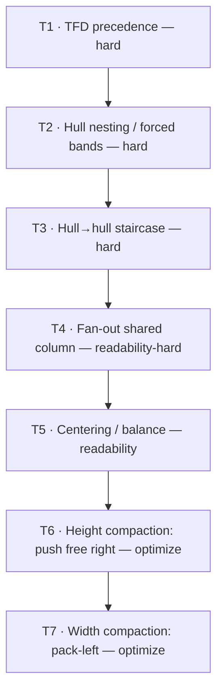

_Read top→down as "senior to": a lower tier may use only the freedom the tiers above leave, and may never violate a higher one._

**Free vs pinned (the operative rule for T6/T7):** a node/hull is _pinned_ iff it is a member of some fan-out target set (T4) or moving it would break a T4/T5 relation; else _free_. T6 moves only free nodes. T7 moves free nodes individually and **fan-out groups as rigid units** (translating a group preserves its shared column and its hub's centering offset).

**Conflict-resolution examples (each user statement → tier interaction):**

- "Fan-out should stay in the same column _even though we are taller than we need to be_" → **T4 > T6**.
- "Center A on C, not inline with B" → **T5** (median, not first-child alignment).
- "Move free resources/hulls right to reduce vertical height" → **T6**, free only.
- "Post-pass, pack left and adjust Y so we are not excessively wide" → **T7**.
- "Apply fan-out + centering recursively to hulls" → T3/T4/T5 evaluated at the **LCA** at every level.
- "If one hull depends on another (one-way edge), place it deeper" → **T3** (hard).

---

## 6. Inputs & data model

### 6.1 Inputs (unchanged from today)

- `plan.json` (+ optional state) → resource nodes, types, attributes.
- `.tfd` → `bind` aliases + `A -> B` declared edges → `nodes[DECLARED_DATAFLOW_ORDERED_KEY]`.
- `graph.dot` → carried in bundles; not used for hop order.
- Topology placement via `buildPlacementMap` / `topologyAddressPlacementMap`.

### 6.2 Core types

```ts
type TopologyRole =
  | "root"
  | "provider"
  | "account"
  | "region"
  | "vpc"
  | "subnetZone"
  | "primaryCluster";

type PipelineCluster = {
  id: string;
  primaryAddress: string;
  firstSequence: number; // min TFD declaration order touching this cluster (tiebreak)
  depthFloor: number; // LB(v): longest-path column floor (CON-1)
  placement: PipelinePlacement; // topology path
  build: { skeleton; width; height; clusterFrameId };
};

type CompoundNode = {
  // a node in the compound tree T
  key: string;
  role: TopologyRole;
  level: number;
  minDescendantSequence: number; // min firstSequence over descendants (forced-stack ordering)
  cluster?: PipelineCluster; // set iff role === "primaryCluster"
  children: CompoundNode[];
  // filled during layout:
  box?: { x: number; y: number; width: number; height: number }; // local then global
  localColumn?: number;
};

type HullEdge = { from: string; to: string; weight: number; declared: boolean };
```

### 6.3 Derived structures (new)

- **Per-container hull-edge DAG** `D_H` (REQ-9):
  - _Up-projection:_ for each collapsed edge `u→v`, find the LCA container `H`; let `Cu`, `Cv` be the child subtrees of `H` containing `u`, `v`. If `Cu ≠ Cv`, add `Cu→Cv` to `D_H` (accumulate weight = count of underlying edges).
  - _Declared:_ add any `.tfd` edge already expressed between container addresses (the org spine) at the level where both endpoints are children of the same container.
  - `D_H` must be acyclic; a cycle triggers CON-2 localized fallback for `H`.
- **Fan-out / fan-in sets:** `out(u)`, `in(w)` over `D` (clusters) and over each `D_H` (hulls).
- **Slack:** `LB` from longest-path on `D`; `UB(v) = min over successors s of (col(s) − 1)`, with `UB = maxColumn` for sinks. `slack(v) = UB(v) − LB(v)`.

---

## 7. Algorithm specification

RCLL is one recursive procedure over the compound tree `T`. Each container runs four Sugiyama phases locally (layer → order → center → compact-Y via policy), is sized, and bubbles up. Two global passes follow (top-spine alignment, pack-left), then finalize. For each phase below: **Purpose · I/O · Options considered (papers) · Chosen · Why · How · Determinism · Complexity.**

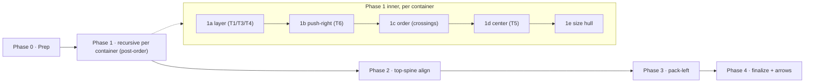

### 7.1 Phase 0 — Prep (reuse + extend)

**Purpose.** Build placeable clusters, the TFD DAG, slack, the compound tree, fan-out sets, and the per-container hull-edge DAGs.

**I/O.** In: plan + `.tfd` + placement map. Out: `{ clusters, D, LB/UB/slack, tree T, fanout sets, D_H per container }`.

**How.** Reuse `preparePipelineLayout` (satellite collapse, edge collapse, skeleton build, `computeDepths` for `LB`). **Add:** `UB`/`slack` computation; compound-tree construction with explicit `root`/`primaryCluster` roles (per REGION_SUBNET `PackedTreeNode`); fan-out/fan-in sets; hull-edge up-projection (REQ-9). Cycle handling per CON-2 (localized).

**Determinism.** All maps iterated in `(firstSequence, key)` order. **Complexity.** `O(V + E)` for DAG/longest-path; `O(E · depth(T))` for up-projection (LCA via precomputed paths).

### 7.2 Phase 1 — Recursive container layout (post-order)

Visit `T` bottom-up. For container `H` with children `C₁…Cₖ` (each already sized with `box`):

#### (a) Layering — assign each child a **local column** (T1, T3, T4)

**Purpose.** Horizontal positions honoring TFD, the hull staircase, and fan-out column sharing.

**Options considered.**

- _Longest-path (ALAP/ASAP)._ Simple, `O(V+E)`; gives tight floors but no balancing. (Sugiyama [R1].)
- _Coffman–Graham width-bounded._ Bounds layer width; classic for "not too wide." ([R16].)
- _Network simplex (dot)._ Minimizes weighted total edge length; supports edge weights/min-lengths; enables `balance()`. ([R2].)
- _MinWidth / node promotion._ Explicit width control + dummy-node reduction. ([R3].)

**Chosen.** **Longest-path floors `LB` (T1/CON-1)** + **hull staircase from `D_H` (T3/CON-6)** + **fan-out pinning (T4):** every fan-out set's targets get a shared column = `max LB` over the set. Network-simplex/`balance()` is folded into Phase 1(b) as the slack-distribution mechanism rather than the base layering (keeps the base deterministic and edge-weight-free unless [FLEX-9](#4-requirements-catalogue) is set).

**Why.** Floors are the minimal structure that satisfies CON-1; the staircase satisfies CON-6; fan-out pinning is REQ-3. Deferring balancing to a separate, clearly-scoped step keeps the base layering trivially deterministic and lets T6 own all height optimization.

**How.** Longest-path on `D` restricted to `H`'s children for local columns; longest-path on `D_H` for the staircase order; union the two column constraints; for each `out(u)` with `≥2` targets in `H`, set all targets to `max LB`. Record `localColumn` per child.

**Determinism.** Longest-path is order-independent; ties broken by `firstSequence`. **Complexity.** `O(kH + EH)` per container.

#### (b) Free-node push-right — height compaction in X (T6)

**Purpose.** Use slack to let free children land in columns where they can **share a row** with others (fewer rows ⇒ less height), without disturbing pinned fan-out members.

**Options considered.**

- _Gansner `balance()`._ Move a node with slack to the **least-crowded** column among its feasible range. ([R2].)
- _MinWidth promotion._ Promote nodes to reduce the widest layer / dummy count. ([R3].)
- _Current group-uniform depth shift._ Coarse, moves whole units; overshoots (rejected, §3.2/§3.1).

**Chosen.** **`balance()`-style per-node slack distribution**, restricted to _free_ nodes, with the objective "minimize resulting row count of `H`" (estimated by the packing in (d)).

**Why.** Per-node (not per-group) granularity (fixes §3.2); single placement (no overshoot/undo, fixes §3.1); directly serves PREF-5 while respecting T1–T5.

**How.** For each free child in ascending `LB`, evaluate candidate columns in `[LB, UB]`; pick the one minimizing the incremental row count of the container's packing (d). This is a local, greedy, deterministic choice; pinned members are skipped.

**Determinism.** Candidate scan in fixed order; ties → smallest column then `firstSequence`. **Complexity.** `O(kH · slackMax)` candidate evaluations, each an incremental skyline test.

#### (c) Ordering — within-column sequence (PREF-2)

**Purpose.** Reduce crossings by sequencing nodes within each column (and ordering forced bands).

**Options considered.**

- _Barycenter / median heuristic._ Standard, fast, effective. ([R1].)
- _Sifting._ Better quality, slower. (Crossing literature.)
- _Forster compound crossing reduction._ Each crossing owned by a unique hierarchy node ⇒ minimize locally per container, sum globally. ([R7].)

**Chosen.** **Per-container barycenter** of cross-column neighbors, applied **only when it strictly reduces a measured crossing count**, else **model order** (`firstSequence`).

**Why.** Forster proves locality (this is the right scope); the "only if it reduces a measured count, else model order" rule keeps it deterministic and prevents the instability that disabled `balance()` in the current code (§3.5).

**How.** Compute barycenters from already-placed neighbor Y (available bottom-up); count crossings with a polyline-aware counter ([DEC-6](#14-open-design-decisions)); accept the reorder iff strictly fewer.

**Determinism.** Strict-improvement gate + stable tiebreak. **Complexity.** `O(kH log kH)` per column.

#### (d) Coordinate assignment in Y — centering + policy (T5, T2)

This is the phase the current engine lacks. Two sub-cases by the container's policy ([§8](#8-per-level-placement-policy)):

- **Forced-band children** → distinct bands, stacked top→down in `(D_H topological order, minDescendantSequence, key)`. A dependency staircase that makes two forced siblings X-disjoint **may** let the deeper one rise into the predecessor's Y-range ([DEC-1](#14-open-design-decisions)).
- **Packed children** → **center** each on the median Y of its connected neighbors (Brandes–Köpf, two-sided, size-aware), then **clamp** to `H`'s band and remove overlaps with a **single deterministic VPSC projection**.

Full detail in [§9](#9-coordinate-assignment-centering).

#### (e) Size the hull

`H.box = boundingBox(children) + PIPELINE_FRAME_PAD (+ title height)`. `H` now behaves as one box for its parent (Doğrusöz cart-on-cart [R8]; Sander [R6]).

### 7.3 Phase 2 — Top-spine global alignment (REQ-7)

**Purpose.** Make `root→provider→account` hops read as aligned columns across the whole diagram while keeping sub-hull columns local.

**Chosen / How.** After recursion, recompute a single global `columnX[]` for the spine levels from the org hull-edge DAG (longest-path on declared hull edges), translate each account subtree to its global spine column, preserve intra-account local columns. See [§11](#11-hybrid-column-model).

**Determinism/Complexity.** Longest-path on a small DAG; `O(#accounts)`.

### 7.4 Phase 3 — Pack-left width compaction (T7, REQ-8)

Detailed in [§10.2](#10-compaction-push-right--pack-left). Pull free nodes and whole fan-out groups left, adjust Y, toward the aspect target; never opens a row; never violates T1–T5.

### 7.5 Phase 4 — Finalize & compound semantics (reuse)

Translate local→global per subtree (`applyCompoundHierarchicalLayout`, normalization-only); emit hull frames as derived bboxes; append TFD arrows + hull→hull connectors; parent each arrow to its LCA frame; `convertToExcalidrawElements`; mirror labels, icons, visibility, z-order. See [§12](#12-edge-routing--compound-frame-parenting).

### 7.6 Reference pseudocode

```text
RCLL(H):
  for c in H.children: RCLL(c)                          # bottom-up sizing (7.2e gives H boxes)
  D_H   = upproject(H) ∪ declared_hull_edges(H)         # 6.3 / REQ-9
  cols  = longestPath(D restricted to H) ⋈ longestPath(D_H)   # 7.2a  T1+T3
  pin_fanout_columns(cols, fanoutSets(H))               # 7.2a  T4
  for c in freeChildren(H) by ascending LB:             # 7.2b  T6
      c.localColumn = argmin_{col in [LB,UB]} rowCount(pack(H | c@col))
  orderWithinColumns(H)                                 # 7.2c  PREF-2 (strict-improve gate)
  if policy(H.role) == FORCED:                          # 7.2d  T2
      placeForcedBands(H)        # staircase Y-overlap per DEC-1
  else:                                                 # 7.2d  T5
      centerY_median(H.children) ; clampToBand(H) ; vpscProject(H)
  H.box = bbox(H.children) + pad                        # 7.2e

# after the recursion returns to root:
alignTopSpineGlobal(root..account)                      # Phase 2  REQ-7
packLeft(aspectTarget)                                  # Phase 3  T7 (groups as units)
finalizeAndParentArrows()                               # Phase 4  REQ-10
```

---

## 8. Per-level placement policy

Each topology level has a **policy** selecting how its _children_ are placed in Y. Policy is chosen by the **parent role** (REGION_SUBNET plan convention), and each level is independently toggleable ([FLEX-1](#4-requirements-catalogue)).

| Parent role | Children placed | **Default policy** | Notes |
| --- | --- | --- | --- |
| `root` | providers | **forced band** | usually 1 provider |
| `provider` | accounts | **forced band** | org spine; staircase by hull edges (CON-6) |
| `account` | regions | **forced band** | dominant height driver on sparse graphs ([DEC-3](#14-open-design-decisions)) |
| `region` | VPCs + region-direct resources | **packed** (row-share) | center + VPSC |
| `vpc` | subnet zones + VPC-direct resources | **forced band** (subnet zones) + packed (direct resources) — **OR `swimlane`** when the VPC's `D_H` is cyclic (DEC-8(C)) | same-VPC subnets distinct Y bands; when cyclic, the bands become lanes over a **shared cluster column axis** so cross-subnet dataflow reads L→R |
| `subnetZone` | primary clusters | **packed** (row-share); a cyclic-VPC subnet is a **Y-lane** spanning its clusters' column range | center + VPSC |

**Forced policy semantics.** Children get disjoint vertical bands, ordered by `(topological order on D_H, minDescendantSequence, key)`; band advance uses the **title-aware** collision hull (`topologyFrameCollisionHull`). X position follows the staircase (CON-6). Y-overlap between X-disjoint staircase siblings is governed by [DEC-1](#14-open-design-decisions).

**Packed policy semantics.** Children are row-packed (push-right [§10.1](#10-compaction-push-right--pack-left) already chose columns) and centered ([§9](#9-coordinate-assignment-centering)); two children share a Y band only when their pad-inflated X spans are disjoint with clearance.

**Swimlane / staircase policy semantics (cyclic container, [DEC-8(C)](#14-open-design-decisions) refined, M3b).** When a container's hull graph `D_H` is **cyclic**, the forced/packed split is replaced by an **SCC decomposition** of the container's children (`arrangeCyclicContainer`):

- A **multi-hull SCC** — sibling hulls that are mutually dependent (a genuine 2-way cycle) — becomes one **swimlane**: its descendant clusters share **one** column axis (column = dense rank of their `LB` floor, so a TFD edge always crosses a column — CON-1/CON-12), and each member hull is a **Y-lane**. A subnet is therefore one contiguous frame **over multiple columns**, and cross-member dataflow `A→B→A` reads as forward column steps across vertically-separated lanes. Flattening the members onto the shared axis is **required** — only there do cross-member resource edges read forward. This is the **Sander [R6]** compound model.
- The **condensation** of the SCC groups (the one-way edges between them) is a DAG, laid out as a **staircase**: a dependent group gets a greater X (width-aware `columnOffsetsFromWidths`, CON-6) and its Y **rises** ([DEC-1](#14-open-design-decisions), `staircaseBandOverlap` default true) to share rows with X-disjoint groups — the height lever.
- A **singleton** SCC (no mutual cycle) recurses through the normal forced/packed policy (and re-enters this branch if it is itself cyclic), so the refinement is fully recursive — the axis is scoped **per SCC group**, never the whole container (this corrects M3a-h2's global dissolve, which put every account on one column-0 axis). The cluster graph `D` is acyclic, so hull cycles never force resource columns; the iron-rule gate excuses only genuine `D`-SCC edges ([§13](#13-invariants--acceptance-gates)).

**Why this default split.** Forced bands at provider/account/region/vpc give the clean ownership reading the user asked for; packed interiors (region resources, subnets, clusters) are where most height can be reclaimed without harming hierarchy reading. The split is the user's explicit "forced + packed" decision. [DEC-3](#14-open-design-decisions) flags that **region** is the highest-leverage level to _consider_ flipping to packed on tall/sparse graphs.

### 8.1 RCLL ancillary ("All resources") — reserved band (DEFERRED)

> **Status: DEFERRED, design + measurements recorded** (2026-06-18; DI-ANC-1..3, [§34.2](#342-implemented-vs-specified-delta-as-built-m3a-hardening)). RCLL draws the **dataflow only**; the unconnected ("Unconnected") resources that the compound/classic views render are omitted. The toggle is **disabled under RCLL** so it does not silently no-op (DI-ANC-1). This subsection is the build recipe for whoever lifts the limitation — including the two cheaper designs already **measured and rejected**, so they are not re-attempted.

**The target.** When "All resources" is on, render the unconnected resources as per-scope **"Unconnected" strips** scoped to their region/VPC — the existing `buildAncillaryStrips` / `layoutAncillaryStrip` / `ancillaryStripAsPseudoCluster` / `countAncillaryCards` primitives (in `terraformPipelineLayoutAncillary.ts` / `terraformPipelineLayoutShared.ts`) produce the strip skeleton + dims; only _placement into the RCLL geometry_ is new.

**Dead ends (do not re-attempt — both measured/analysed on `staging-extended-localstack-v2`):**

1. **Column-leaf model injection** — inject each strip as a `role:"primaryCluster"` leaf into `buildRcllModel`. Rejected by code analysis: a strip is then a placement **column member**, so a wide strip widens its column (`columnWidths` → `columnOffsetsFromWidths`) and **reflows the dataflow**; it lands at the **bottom of column 0, beside** the downstream columns (not below the scope, `placePackedColumns`); and it **pollutes model metrics** — every leaf with `cluster` is counted as a `primaryCluster` (`summarizeRcllModel`), and `firstSequence: MAX_SAFE_INTEGER` leaks a sentinel into ordering.
2. **Export-phase placement** — keep strips out of the model; after `emitLeaves` places the dataflow, drop each strip below its scope's content in `buildSceneFromBoxedTree`, feed strip pseudo-clusters to `buildCompoundFramesFromLayoutBoxes` only. **Implemented and measured: zero model pollution, no column reflow, but 90 collisions (Compact) / 86 (Full).** Root cause: RCLL positions accounts/regions/VPCs in the **model phase**; the export phase (`applyCompoundHierarchicalLayout`) only re-stacks **providers** (v2 has one), so a strip grows a region hull into the next region and nothing re-stacks regions. The collisions were all among **connected** frames (`frame-title-primary-cluster`, `non-ancestor-topology-frame`, `region-region`), i.e. the unreserved-space failure.

**The correct design — model-phase reserved bottom band.** Add a new `RcllTopologyRole` value `"ancillaryBand"`. A band node is a leaf carrying the strip pseudo-cluster on `cluster`. Attach it under its container in the tree (region/VPC container key `==` `regionScopeKey`/`vpcScopeKey`); synthesize the container chain for an ancillary-only scope (mirror `buildCompoundTree`). In `sizeAndArrange`, split `ancillaryKids` from `normalKids`, run `columnWidths` + the policy over `normalKids` only, then place each band **full-width below the `normalKids` bbox in a disjoint Y region** — exactly the `mixed`-VPC pattern (`placeForcedBands` then `placePackedColumns` below). The container **footprint** (children bbox + pad) then spans the band, so the parent's stacking **reserves the space** → no collision; the band is not a column → no reflow; the role is distinct → `primaryClusterCount` stays clean.

**The interaction points a build MUST handle** (Codex, 2026-06-18) — these are why it is a real placement-engine milestone, not a "compose helpers" change:

- **Role-blindness.** Several placement paths treat _any_ leaf with `cluster` as a dataflow leaf — `collectClusterLeaves` and the whole cyclic `arrangeByHullMatrix` engine (`denseClusterColumns`/`laneMinColumn`/`layoutLanesOnAxis`). A band inside a **cyclic** container would join an SCC group and participate in `colWidth`/`riseStackY`. Either exclude `ancillaryBand` everywhere a leaf-with-`cluster` is collected, or (smaller surface) **skip ancillary inside cyclic containers** as a documented sub-limitation.
- **Injection timing.** Inject band nodes **before `runRcllPipeline`** — layering and placement each `cloneNode` the tree (`cloneNode` already copies `role`+`cluster` generically). Inject after, and placement never reserves the space.
- **Determinism.** Re-run the bottom-up `finalizeTreeOrder` (or insert in canonical `(minDescendantSequence, key)` position) after injection.
- **Mandatory band-width cap.** The container footprint width still feeds the **parent's** `columnWidths`, so a band wider than its scope's dataflow widens the container and shifts siblings. Cap the band's `wrapWidth` to the scope's dataflow content width — then dataflow X is preserved and only **Y grows** (a band makes a container taller; downstream siblings shift down). "Strips appear" and "dataflow pixel-identical" cannot both hold; the accepted bar is **Y-growth + X-preserved**.
- **Empty `normalKids`.** For an ancillary-only container, place the band at `areaY` (not `bbox.maxY + gap`).

**Gate (when built):** collision 0 (Compact + Full, rendered `diagnostics.collisionCount` + `placementMeta`); `rcllModel.primaryClusterCount` identical ON vs OFF; dataflow column X unchanged; frame-parent chains correct (each card frame → strip "Unconnected" frame → region/VPC hull frame); determinism ×2; OFF byte-identical to the dataflow-only baseline.

### 8.2 Subnet de-band — merge subnet lanes, annotate membership (BUILT, default OFF)

> **Status: BUILT, behind `subnetDeBand`, default OFF** (2026-06-19; [DEC-11](#14-open-design-decisions), [§34.1](#341-implementation-decision-log-di--per-milestone-as-built) DI-DEB-1..3). The **first lever to materially reduce v2's height** after the structure-preserving levers all capped at noise ([§9.5](#95-as-built--measured-v2-2026-06-18); M4 −2 %, de-density 0, junctions 0). It changes _what is drawn_ — the direction option-C's terminal finding named.

**Problem.** On the swimlane / cyclic path a subnet is a **Y-lane** ([§8](#8-per-level-placement-policy) swimlane policy): `layoutLanesOnAxis` stacks each subnet lane into its **own disjoint Y band** (`cursorY += lane.box.height + PIPELINE_CLUSTER_GAP_Y`), recursively per nesting level, so `height(VPC) ≈ Σ(subnet lane heights)`. The merged floor — placing every resource of a VPC in **one** column stack — is the per-column max-occupancy, far below that sum (v2: tallest column ≈ 11 cards vs ≈ 27 763 px rendered).

**Policy.** When `subnetDeBand` is on, a VPC's subnet level is **dissolved**: each subnet's primary clusters become **direct VPC children** placed on the same shared column axis (one `colCursor` stack), so resources from different subnets share Y rows. Non-overlap drops from the **box** level (sibling subnet frames) to the **resource** level (the single stack keeps cards disjoint). **X (`colByCluster` / `localColumn`) is untouched ⇒ CON-12 holds by construction** (measured width Δ −0.5 %). The subnet **frame** is suppressed (it would now overlap a sibling's), and membership is re-encoded as a per-card **tier rail** + legend ([§8.2](#82-subnet-de-band--merge-subnet-lanes-annotate-membership-built-default-off) render half) — _not_ an overlapping box (the corpus, MapSets / BubbleSets / LineSets, disfavours overlapping group regions).

**As-built (two halves).**

- **Placement (load-bearing).** `collapseSubnetsForDeBand(root)` runs in `layoutPlacement` (after `cloneNode`, before `sizeAndArrange`): for each `vpc` node it lifts every subnet-zone descendant cluster to a direct child and re-sorts `(minDescendantSequence, key)` (CON-8). The existing swimlane leaf path then merges them — **no new placement engine**.
- **Frame / parenting.** The frame system is driven by **cluster topology metadata**, not the placement tree, so the entire blast radius is one lever: `emitTopologyContextFrames` **skips** the `subnetZone` level (the VPC's child lookup falls back to `cluster.build.clusterFrameId`, so the VPC frame parents the cluster frames directly), and `topologyPathForCluster(cluster, subnetDeBand)` **truncates** the path to drop `subnetSignature` — so a same-subnet TFD edge's LCA resolves to the existing **VPC** frame (no lost parent), and two clusters in different subnets of one VPC get equal truncated paths so the aggregate sibling connector does not emit a dangling reference. `subnetDeBand` (default false ⇒ compound path untouched) threads through `assignCompoundEdgeFrameParents` / `appendCompoundTopologyFrameEdgeSkeletons` / `buildSceneFromBoxedTree`.
- **Membership render.** `terraformPipelineSubnetAnnotation.ts` appends, per subnet card, a thin **rail** rectangle in the margin _left_ of the card (a card _frame_ draws over a same-position sibling, so the rail sits in the gap over the VPC background), colored by subnet **tier** (`getContextFrameColorForTopologyRole("subnetZone", { subnetTier })` — public/private/intra/default), plus a compact **tier legend** above the scene. Rails + legend carry `customData.terraformSubnetChip` and **no** `terraformTopologyRole`, so the placement gates and `diagnosePipelineScene` ignore them (annotation, not containment).

**Gate-split note ([§13](#13-invariants--acceptance-gates)).** Because the pre-pass _removes_ the subnet nodes from the tree (rather than keeping them and exempting a gate), `containmentViolations` / `siblingOverlapViolations` already measure the correct **merged** cluster-in-VPC geometry — **0 on v2, no exemption needed**. The annotation rails are gate-invisible by their missing topology role.

**Measured (v2, `subnetDeBand` ON vs OFF, real `rcllStageMeta.placement.maxDepthPx`):** height **14 374 → 10 147 (−29.4 %) Compact / 27 763 → 20 091 (−27.6 %) Full**; width −0.5 %; containment 0, siblingOverlap 0, `acyclicBackwardEdges`/`acyclicSameColumnEdges` 0; rendered collisions **12 → 0** (the 12 were the overlapping subnet frames before suppression); deterministic ×2; OFF byte-identical. `rcllMilestone` → `"M7s"`, `rcllSubnetDeBand` meta. Dialog "Subnets · Boxed / De-banded" (RCLL-only, default OFF) + URL `?subnetDeBand=1`.

**Deferred.** VPC / region / account de-band (the same mechanism one level up); a richer set-membership boundary (BubbleSets / LineSets / Kelp low-opacity hull) instead of the rail.

---

## 9. Coordinate assignment (centering)

> **Retitled (2026-06-18): "coordinate assignment / _straightening_".** The heading text is kept verbatim so the `#9-coordinate-assignment-centering` anchor and its inbound links survive; the **content is the straightening model below.** The readability goal is a **train/metro reading** — edges run flat (horizontal / clean diagonal), fan-outs explicit — not hub-centering. Hub-centering (PREF-1) is a _weak proxy_ for straightness and was measured to **trade it away** (§9.5); the live target is **near-straight ↑ / edge-length ΔY ↓** (PREF-3). Our cross-axis is **Y** (transpose of the cited papers' "horizontal coordinate"; our layers are **columns**, drawn L→R).

### 9.1 Goal

Assign each leaf a **Y** so that dataflow-connected leaves in **adjacent columns land at the same Y** and their edge reads flat — replacing the dumb `colCursor` stack (`y += height + gap`, which ignores edges). Within-column **order** (M6) and column membership **X** are inputs, never touched here, so the iron rule (CON-12) holds by construction. Hub-centering falls out of straightening but is no longer the target.

### 9.2 The two-axis model (the framing that drives §9)

Straightening has **two independent axes of freedom** — earlier drafts (and the "options" below) blurred them:

- **Axis-1 — Y-assignment (the _straightener_):** within a column, which Y does each card get? Straightening = pull connected cards to the **same Y** so their edge reads flat. **Both Brandes–Köpf ([R10]) and the flow formulation ([R11]) operate ONLY here** — they assign Y; neither spreads X.
- **Axis-2 — X-structure (the _room-maker_):** which column each card sits in / how wide the layout is. Dense columns leave no Y-room, so even a perfect Axis-1 straightener cannot co-align two chains without overlap. **X-spread / de-densify creates the Y-room** Axis-1 needs. A **separate lever** from Axis-1.

**Correction recorded here (the load-bearing one):** [R11]'s "**prescribed width**" = **our prescribed _height_** (their layers are rows, ours are columns; their cross-axis is X, ours is Y — "their width = our height"). So [R11] is a **height-budgeted Axis-1 straightener**, **NOT** an X-spreader. The "increase-X to buy straightness" intuition lives entirely in **Axis-2**. The pre-pivot §9 conflated the two.

### 9.3 Options considered (split by axis)

**Axis-1 — straighteners (assign Y):**

| Option | Source | Trade-off |
| --- | --- | --- |
| **Brandes–Köpf** median alignment (align up/down × pack L/R, then balance = average), size-aware | [R10]+[R12] | Linear, deterministic; builds vertical **alignment chains** (the spine), size-aware for real cards. **The standard; CHOSEN as A1.** |
| **Flow formulation, prescribed (height) budget** | [R11] | Min-cost flow → **optimal** Σ wᵢ·\|Δy\| under a height budget; iterative solve. Branch **A2** (deterministic with stable tie-breaking, so CON-8 holds; needs the CON-9 single-pass relaxation — §9.5). |
| **Network-simplex x-coord (dot)** | [R2] | Higher quality, heavier; not obviously deterministic at our scale. |
| **Priority method (classic Sugiyama)** | [R1] | Simple iterative; lower quality than BK. |
| **Median hub-centering** (degenerate proxy) | — | _Tried + measured + superseded_ (§9.5). Centers isolated hubs on their fan-out median; **not** chain-alignment. |

**Axis-2 — room-makers (change X / width), deferred until an Axis-1 density stall is measured:**

| Option | Source | Trade-off |
| --- | --- | --- |
| **B · de-densify columns** — split same-`denseRank(LB)` independent cards into adjacent X sub-columns (within forwardness, CON-12) | — | The cheap X-spread; makes Y-room without a model change. |
| **C · metro / edge concentration** — relax REQ-3/T4 ("fan-out targets share a column") + insert explicit fan-out/concentrator junctions | [Onoue 2016] (`onoue-edge-concentration`); confluent layered drawings [Eppstein/Goodrich/Meng] | Biggest model change; the most direct train-map (de-densifies **and** straightens at once). **Chosen escalation** after A1 measured density-capped (§9.5). |

### 9.4 Chosen + branch (record so a future reader can re-branch)

- **A1 · Brandes–Köpf, two-sided, size-aware ([R10]+[R12]) — BUILT** (`terraformPipelineStraighten.ts`, behind `straighten`, default OFF). Reduced **no-dummy** form: alignment considers neighbours **one column away** only (DEC-5 dummies deferred), runs both directions, **averages**, then a single deterministic per-column down-separation removes overlap. Replaces the `colCursor` stack at the two leaf sites. **Y-only**, single-pass, pure/deterministic → CON-8/CON-9/CON-12 hold. This was the cheap **measuring stick**.
- **A2 · [R11] flow, height-budgeted — RECORDED BRANCH, ruled out by measurement (§9.5), not built.** Build A2 **iff** A1's ceiling left material straightness on the table _because of optimizer quality_ — it did **not** (the stall is Axis-2 density, which a better Axis-1 optimizer cannot fix). Kept as a documented branch: revisit only on a preset where A1 is optimizer-limited, not room-limited, and accept the **CON-9 single-pass relaxation** ([§9.5](#9-coordinate-assignment-centering); the no-UI-import clause + CON-8 stay).
- **Axis-2 · B then C — the live direction.** Median hub-centering (the old §9.3 "Chosen") is **superseded**: tried, measured to trade crossings + near-straight for hub-centering on v2, parked. The VPSC projection described in the old §9.5 is **not the §9 implementation** (it was the centering-proxy finisher); A1's per-column down-separation is the deterministic de-overlap step.

### 9.5 As-built + measured (v2, 2026-06-18)

1. **Median hub-centering proxy (built first, parked).** des(v) + a down-only `separateY1D` projection. Measured ON vs OFF on `staging-extended-localstack-v2`: hubCenteringRate **up** (Compact 0.07→0.11, Full 0.04→0.09) **but crossings up** (247→274 Compact) and **near-straight HALVED** (0.16→0.08). It buys its own metric by spending straightness — the centering-vs-edge-length tension, concrete on v2's tight columns. **Superseded by A1.**
2. **A1 Brandes–Köpf — NO-OP on v2; blocker = DENSITY (Axis-2), not optimizer quality.** straighten ON vs the M6 base: nearStraightPct 0.16→0.16 (Compact) / 0.11→0.12 (Full); median ΔY 574→507 (−12%) Compact, 1696→1696 Full; crossings ~flat; height unchanged; all gates 0. BK is correct (unit tests chain-straighten + hub-center); it is **room-starved** here. An **edge-span diagnostic settles WHY:** of 145 TFD edges, **123 (85%) are adjacent-column** (\|Δfloor\|=1), only 22 long (max span 13) — so the no-op is **not** the long-edge tail (15%, DEC-5 territory) and **not** optimizer quality; it is **column density** (≈11 cards/column leave no Y-room to co-align even adjacent edges without violating separation). **Implication:** A2 ([R11]) would **also** be room-starved → **A2 ruled out**; the branch condition "Axis-2 only if A1/A2 stall on DENSITY, not optimizer quality" is **met by measurement.** This is v2 swimlane-domination capping yet another lever (cf. M4 −2%, M6 −3 crossings).
3. **A1 committed `b91a4d77a`** (default-OFF `straighten` toggle) as correct, gated infrastructure — it helps sparser presets and would straighten any de-densified result.
4. **Axis-2 B de-density — SAFE form BUILT + measured NO-OP on v2 (2026-06-19, M5b).** After the pause, the de-densify lever was built in its **safe, column-preserving** form (`terraformPipelineDeDensify.ts`, `deDensifyColumns`, behind `deDensify`/`deDensifyMaxCols`, default OFF, **internal/measurement-only — not wired to the UI**). A leaf at column `c` is promoted to `c+1` **only** when its neighbourhood is entirely in-axis, purely forward (no cycle / no same-column), has **no neighbour at `c-1` or `c+1`** (so every incident edge stays within `col±1` — straightenable; this is the binding constraint, the A1 straightener aligns adjacent columns only), does not split a fan group, and the move is toward a sparser column within a hard `maxExtraCols` bound. These rules make the move **CON-12-safe by construction**, so there is **no forward-relax pass** and the cap-vs-CON-12 conflict never arises. **v2 result (maxCols=4, Compact + Full): byte-identical to OFF on every metric** (all structural gates 0, deterministic, dial-off identical). The safe set is **empty** on v2 because the dataflow is cross-container-dominated — within any single swimlane SCC group almost every leaf has either an out-of-axis neighbour or an adjacent in-axis neighbour, so nothing is safely movable. This is the same density wall that capped M4 / M6 / A1. **Decision: STOP — record, don't graduate to a UI toggle;** keep as correct, gated, default-OFF infrastructure (parallel to A1) for a future sparser preset. The dominant fan-concentration half still needs **option C (junctions)**.
5. **Option C (fan-out junctions / edge concentration) — PROBED + NOT BUILT; the terminal structure-preserving finding (2026-06-19).** Planned (architecture B: rewrite swimlane `colByCluster` in `buildLaneContext` + an invisible emit-time arrow waypoint; stars only; Codex-reviewed). A Phase-0 throwaway movability probe (run the real pipeline on v2, read placed `box.x` as the true column) measured: **8 fan-out stars ≥4, 39 targets, 27 nominally movable — but max column occupancy drops only 11 → 10.** The bottleneck column is **11 deep with just 1 movable fan target; the other 10 are immovable** (each has a successor one column right ⇒ moving it violates CON-12). v2's tallest column is a deep convergence/chain region, not a fan-out crowd, so the lever that de-densifies fan-outs cannot touch it. **Conclusion: no structure-preserving lever reduces v2's height** (the wall behind M4/M6/A1/de-density, now quantified for junctions too). Reducing it requires changing _what is drawn_ (visible junctions that MERGE cards, accept-tall, or a non-column layout) — a separate design round. STOP, recorded.
6. **Axis-2 escalation: probed + PAUSED (user, 2026-06-18 — DI-M5b-1).** "Go big / option C (metro junctions)" went through a plan-eng-review ceremony that **reframed it to de-densify-first**: relaxing **REQ-3/T4 is a v2 no-op** (fan-out pinning runs only on acyclic containers; v2's cyclic provider columns by `denseRank(LB)` with no pinning to relax), so the real Axis-2 B lever is **splitting independent same-rank cards into intra-rank sub-lanes** (rank stays A1's alignment unit; an _independent_ fork, not "after A1"). A Step-0 probe (leaves grouped by `box.x` = the real `colCursor` stacking set) measured v2 density as **~46% independent / ~54% fan-concentration** — so de-densify is only a _partial_ lever and was **NOT built**; the dominant fan-concentrated half needs **option C (junction / edge-concentration)**, the deferred escalation. See DI-M5b-1 (§34.1) + the milestone table (§24.2).
7. **Hull X-stagger + Y-rise (the _containment-preserving_ height lever) — PROBED + NO-GO; the wall is now proven for the SECOND height axis (2026-06-19).** Distinct from every Axis-1/Axis-2 lever above (all _within_ a shared column axis), this targets the **band-stacking** cost: where subnet de-band _dissolves_ a hull box, hull-stagger **keeps** it — slide a one-way / independent sibling hull to greater X until it clears its sibling, then **rise** it in Y so siblings share rows (trade width for height). Planned through `plan-eng-review` (Codex high-reasoning + its own corpus research: Sander _Layout of Compound Directed Graphs_, Forster _Crossing Reduction in Layered Compound Graphs_, Eiglsperger _Efficient Sugiyama_, Handbook _Minimum-Width Layering_); **Codex verdict BUILD-WITH-CHANGES — corrected Phase-0 probe only**, 7 findings folded (the load-bearing two: stagger must mutate the **consumed** axis `colByCluster`/`buildLaneContext`, not `localColumn`, or it repeats the M4-reframe no-op; the cascade is **global**, not per-container). **Two-stage throwaway probe on v2:** (a) a **critical-path census** — counting _eligible_ (independent OR one-way) sibling sub-hull pairs that currently X-overlap **and** Y-stack **and** sit on the `maxDepthPx` chain — found **~19–22% reclaimable** (Compact 3 158 px / 14 208; Full 5 284 px / 27 597), one-way-dominated, concentrated in **one `account` of 3 region sub-hulls** (the independent-only subset was ~3%, off-critical — so the win is the _one-way_ "slot the child behind" case, exactly the user's framing). (b) The **real-geometry 4-config matrix** (baseline / stagger / de-band / both) built the actual stagger on the **swimlane lane interior** (`layoutLanesOnAxis`, the consumed axis — the forced-band and `arrangeByHullMatrix` hooks fired but were geometry-identical: the account's regions are swimlane **lanes** on one shared `colByCluster`, already at distinct longest-path columns). **Result: the height is real but ILLEGAL** — staggering lanes to distinct X cut height **−73 % (14 374 → 3 840 Compact / 27 763 → 7 810 Full)** but **shattered the iron rule: 44 `acyclicBackwardEdges`, 95 `acyclicSameColumnEdges`, 75 containment violations, width +304 %, crossings 250 → 619.** The lanes share one axis _precisely because_ their resources are densely cross-connected; pulling the hulls apart in X makes those cross-lane edges read backward. The CON-12-safe subset (truly independent lanes, no cross-edge) is only the ~3 % off-critical case ⇒ no-op. **Conclusion: the big band-stacking height is reachable only by BREAKING CON-12, which is legal only with DEC-5 dummy-node routing** (re-route the manufactured long cross-lane edges forward). So **DEC-5 is not optional for this lever — it is the prerequisite**, and it is the _same_ foundation cross-container crossing-min needs (Sander/Eiglsperger: raw span>1 edges break the bilayer model). This is the **same density wall** as M4 / de-density / option C, now proven for the _band-stacking_ axis too: subnet de-band works (−28 %) because it merges _within_ a shared axis (no new backward edges); hull-stagger fails because it _separates_ cross-connected hulls. **Decision (user): STOP — record, don't build;** DEC-5 becomes its own scoped decision, not bolted onto this lever (and even with DEC-5, the +304 % width / 2.5× crossings raise real doubt hull-stagger beats subnet de-band's clean −28 %). Probe deleted (numbers are the artifact); plan `resilient-meandering-wren.md`; DEC-12 + DI-DEB-4 (§34.1).

   **CORRECTION (2026-06-19, second probe — the first measured the WRONG operation).** The "−73 % but 44 backward" above came from staggering **leaf-level lane interiors**, which is _not_ the user's lever. A second throwaway probe staggered **rigid region hulls into disjoint X-bands by the topological order of the account's child hull-edge DAG** (`staggerLanesIntoBands` in `layoutLanesOnAxis`; the account DAG is acyclic — census **mutual=0**, indep 4 / one-way 2 of 6 region pairs). With topo column order **every one-way region edge reads forward by construction.** Measured on v2: **height −58 % (Compact 14 374→5 917, Full 27 763→11 712), deterministic — but still illegal: 18 `acyclicBackwardEdges` / 31 containment / 15 collisions / +300 % width.** The 18 backward are a **fixed structural set, identical Compact↔Full** = the **cross-account** edges. **Why (corrected AGAIN — there is NO real cycle):** the resource graph `D` is **acyclic** (`depthResult.hasCycle = false`). The provider swimlane exists only because of a **projection 2-cycle in the _account-hull_ graph: `0002 → 0003` (6 edges) ∧ `0003 → 0002` (7 _different_ edges)** — two disjoint bundles of one-way cross-account flow in opposite directions (Sander/Forster: up-projecting a DAG manufactures hull cycles; accounts `0001`/`0004` are a pure source/sink, in no cycle). The 18 backward came from staggering each account in its **own local coordinate frame** — the global cascade (Codex #2) was never built — so cross-account edges between independently-staggered frames reverse. **This withdraws the earlier "cycle-induced / legal only with DEC-5" conclusion:** since `D` is acyclic a globally-consistent zero-backward rank provably exists; DEC-5 was never the blocker. The genuine constraint is local: forcing the **bidirectional pair `0002⇄0003`** into rigid disjoint X-bands must reverse one of its two flows — but `0001`/`0004` and any non-bidirectional hull stagger freely. **Corrected principle:** a hull is band-staggerable iff it has no _bidirectional_ cross-band flow with a sibling; only mutually-bidirectional pairs must stay co-axial. A **global** single-frame stagger keeping only such pairs co-axial is **untested** (not closed). Both probes + wiring reverted (engine at HEAD).

   **CLOSED (2026-06-19, third probe — `rankSeparate`, the global single-frame stagger built and measured).** The "untested / not closed" global mechanism above is the **sibling-separation ranking**: canonical Sugiyama Phase-1 layer assignment on the SCC condensation — collapse each two-way hull cycle (`0002⇄0003`) into one co-axial quotient node, add `maxRank(A)+1 ≤ minRank(B)` for every one-way quotient-sibling edge, rank by **augmented longest-path**, feed the separated ranks into the consumed axis (`colByCluster` via `buildLaneContext`). Built behind a default-OFF `rankSeparate` flag as a real milestone candidate (pure `terraformPipelineRcllRankSeparate.ts`: SCC-quotient separation graph + cycle infeasibility detector + recursive shift-accumulation ranker; **14/14 unit tests**), threaded like `subnetDeBand`. **Separation fired** (`shifted=81`/103 leaves). **v2 Compact 4-config (base / m4 / rankSep / rankSep+m4):** base **14 374 / 11 790** (gates 0, cross 250); m4 **14 067 / 11 790** (gates 0, cross 250); rankSep **16 222 / 12 782** (bwd 7, sameCol 1, cross 456); rankSep+m4 **14 761 / 12 782** (bwd 7, sameCol 1, cross 445). **NO-GO — three independent failures:** (1) **height ROSE** — even with the M4 rise composed in, rankSep+m4 is **+2.7 % vs base / +4.9 % vs m4-alone**, width **+8.4 %** (separating one-way siblings in X did not let them rise in Y — the lanes stay too cross-wired to share rows); (2) **iron rule broke** — `acyclicBackwardEdges=7`, `acyclicSameColumnEdges=1`; (3) crossings **250 → 445 (+78 %)**. **CAUSE of the 7+1 (instrumented `backwardEdgeGate` + an LCA tracer) — and a CORRECTION:** these are **not** cycle-induced (`D` is acyclic; all logged in the `!isCyclic` branch). Tracing each offender to its lowest common container: **7 of 8 are CROSS-ACCOUNT leaf edges between accounts `0002` and `0003`** — the **two-way SCC pair** the ranker (correctly) keeps **co-axial** (shift 0 between the members). The directions run _both_ ways (the 2-way bundle): `consumer_lambda→sqs.ingest_fifo` = `0002→0003`; `lake→lake_replica_*` and `api8/9/10/11.gateway.private→…ecs/lambda` = `0003→0002` (the `api*` modules **span** both accounts — _not_ an intra-module convergence; that earlier sub-claim is withdrawn). **Co-axiality of the account hulls does NOT prevent the backward edges:** `placeSeparated` re-ranks **each account's interior independently**, so a cross-account leaf edge links a deeply-shifted leaf in one account to a differently-shifted leaf in the other and inverts — and because `0002⇄0003` is genuinely bidirectional, _some_ cross-account edge must invert regardless of which interior leads. The lone same-column (`consumer_lambda→sqs`, dx=−56) is the un-shifted member of that set. **The 8th** (`dynamodb.regional_events_east→regional_aurora_east_2`, dx=−936) is the only intra-account case — account `0003`, regions `us-east-1→us-east-2`, **one-way** (`TWO_WAY=false`); a shift-magnitude/densification artifact, not a two-way issue. **The structural fix is NOT "keep the two-way hulls co-axial" (already done) — it is rank both co-axial interiors in ONE shared global frame** (Codex #2 global cascade), a strictly bigger leaf-granular re-rank. **In principle repairable, but it does not rescue the lever** — the height failure is independent (height rose even with the rise), so the NO-GO stands on the height criterion alone. **This closes the DEC-12 open question:** the global single-frame stagger is now tested → still NO-GO, for a **new** reason (granularity mismatch + height does not drop), not the old cross-cycle reason. DEC-12 status → CLOSED; DI-DEB-5 (§34.1).

   **REVERSED → GO (2026-06-20, round 4 — `rankSeparate` REBUILT as the whole-model-global Sander pass).** The round-3 NO-GO above was a property of the _construction_, not the lever: "rank both co-axial interiors in ONE shared global frame" (its own stated fix) was implemented. The corpus (`graph-layout-rag` → Sander, _Layout of Compound Directed Graphs_) prescribes ranking **every base (leaf) node in ONE global pass**, deriving each container's span from its leaves. The rebuilt `computeGlobalSeparatedFloor` does exactly that: collect ALL leaves, take the whole-model leaf DAG (`lattice.fanout`), add **all-to-all** separation `a→b ∀ a∈leaves(A),b∈leaves(B)` for each one-way quotient pair (mutual cycles stay co-axial via the kept `buildSeparationConstraintGraph`), then ONE `longestPath` over (leaf edges ∪ sep edges). Because every real leaf edge — **including the cross-account `0002⇄0003` edges that inverted in round 3** — is a constraint in the SAME frame, none can read backward by construction. **Probe-first GO (v2 Compact):** `acyclicBackwardEdges` **7→0**, `acyclicSameColumnEdges` **1→0**, pairs 80, changedRanks 112, fallback none; composed with the **unmodified** M4 lane-rise, **H 14 374→8 377 (−42 %)** — the height that round 3 reported _rising_ now drops, because the global ranks make the lanes genuinely X-disjoint so M4 can share their Y rows (the round-3-planned M4 occupied-set change proved **unnecessary**). The correctness lock is the v2 integration suite (`terraformPipelineRankSeparate.test.ts`, Compact + Full: gates 0/0, separation fires, composed-M4 height < base, OFF byte-identical, deterministic) + 18 ranker unit tests (incl. the cross-account round-3-fix oracle + observable augmented-cycle fallback + 4 adversarial). **Costs (opt-in, default OFF):** width +28 %, crossings +45 % — deferred to a cross-container crossing-min milestone. DEC-12 status → **GO for the global form**; DI-DEB-6 (§34.1); DEC-13 (§9.6 below).

### 9.6 How (A1 Brandes–Köpf, as built) · plus DEC-13 (rankSeparate, the global form)

**DEC-13 — `rankSeparate` whole-model-global sibling-separation ranking (BUILT round 4, default OFF).** Mechanism + GO measurement recorded in §9.5 item 8 (REVERSED → GO) and the 2026-06-20 change-log row; the pure module is `terraformPipelineRcllRankSeparate.ts` (`computeGlobalSeparatedFloor` + the kept `buildSeparationConstraintGraph`). Invariants: one `longestPath` over the whole-model leaf DAG ∪ all-to-all separation edges ⇒ CON-12 forward by construction; co-axial cycles stay co-axial; `pairCount===0` ⇒ base floor verbatim (OFF byte-identical); augmented-graph cycle ⇒ observable `fallbackReason` fallback to the base floor; pure + deterministic (`(rank,key)` tiebreak, model + container-walk edge order). Deferred (T6): border-nodes + `longestPath` minlen to bound the +28 % width if it regresses; cross-container crossing-min for the +45 % crossings.

1. **Vertical alignment → blocks.** Per column (both directions: align-to-left-neighbours ascending, align-to-right-neighbours descending), each node aligns to the **median** of its adjacent-column neighbours (the BK median rule), with a **crossing guard** (never align past the last-aligned neighbour's order). Aligned nodes form a **block** that will share a Y — favouring the inner segments of edges = the spine.
2. **Size-aware compaction** (`place_block` / sink-and-shift class graph, transposed to Y): each block placed respecting within-column **order** + `height + gap` separation (real card heights, [R12]).
3. **Average** the two directional assignments (unbiased two-sided centering).
4. **Final per-column ordered down-separation** from `segmentTop`: keep order, pull toward the averaged Y, push **down only** to satisfy `height + gap`; normalize so the topmost leaf sits at `segmentTop`. This removes any residual overlap the averaging introduced (the deterministic, single-shot de-overlap — no force loop, CON-9).
5. **Acceptance gate = STRAIGHTNESS:** model-level near-straight / edge-length over placed boxes (beside the kept `hubCenteringOverBoxes`), cross-checked by the now-un-blinded rendered `nearStraightPct` / `medianDeltaYPx` (gate-fix `3313c2d52`). Gate: near-straight ↑ vs OFF (both modes), crossings ≤ OFF, all structural gates 0, determinism ×2, OFF byte-identical.

### 9.7 Determinism & complexity

A1 BK is `O(V+E)` with fixed iteration orders, a stable median tiebreak, and no RNG (CON-8); single pass, no force loop (CON-9); Y-only (CON-12). The [R11] A2 branch is iterative but deterministic under stable flow tie-breaking — its only constraint cost is the **CON-9 single-pass relaxation**, recorded at [CON-9](#4-requirements-catalogue) and gated on a measured optimizer-limited stall (§9.4).

---

## 10. Compaction (push-right & pack-left)

Compaction is **subordinate** to T1–T5. Two distinct, single-purpose passes (replacing the current two-passes-that-fight design, §3.1).

### 10.1 Push-right (T6, height) — Phase 1(b)

Already specified in [§7.2b](#7-algorithm-specification). Key properties: per-node (not per-group); free nodes only; chooses each node's final column once (no overshoot); objective = minimize container row count. This is `balance()` ([R2]) restricted to free nodes with a packing-aware objective.

### 10.2 Pack-left (T7, width) — Phase 3

**Purpose.** After everything is placed, the diagram may be wider than necessary. Pull things left to approach the aspect target without re-introducing height.

**Options considered.**

- _Current separate pull-left pass._ Leftmost-feasible per cluster; geometric only; runs after a group-uniform push that overshoots (rejected as a pair, §3.1).
- _Order-preserving rectpacking (Domrös)._ Reading-direction, whitespace-elimination, model-order preserving. ([R13].)
- _Left-edge / FFDH level packing._ The concrete primitive. ([R15], [R16].)

**Chosen.** A single **order-preserving left-pack** ([R13]) that moves **free nodes individually** and **fan-out groups as rigid units** (a group translates with its shared column and centering intact), **never opening a new row**, toward the aspect target.

**Why.** "Never opens a row" guarantees it cannot fight T6 (height) — the two compaction passes are now orthogonal, not adversarial. Moving fan-out groups as units preserves T4/T5 (the user's explicit "move whole fan-out group as a unit" decision). Domrös gives the order-preserving guarantee that keeps the result readable.

**How.** Sweep columns left→right; for each free node / group, decrease its column to the minimum `≥ LB` that keeps it in its current row(s) without overlap and respects T1–T5; recompute `columnX`; stop when the aspect target is met or no move helps.

**Determinism & complexity.** Fixed sweep order; `O(V)` moves each with an `O(row)` overlap check.

---

## 11. Hybrid column model

**Decision (REQ-7):** _align the top spine globally; keep columns local below._

- **Global (spine):** `root → provider → account`. A single `columnX[]` is computed from the **declared org hull-edges** (`organization_root -> OUs -> accounts`) by longest-path; each account hull is translated so its left edge sits at its global spine column. Effect: account hops line up across the whole diagram (the org spine reads as a clean L→R staircase).
- **Local (interior):** inside each account, regions/VPCs/subnets/resources use the **local columns** computed during recursion (Phase 1a/b). A resource at "local hop 3" in account A need not share an X with "local hop 3" in account B.
- **Lane / staircase axis (cyclic interior, [DEC-8(C)](#14-open-design-decisions) refined, M3b):** when an interior container's `D_H` is **cyclic**, the container is SCC-decomposed (§8). Each **multi-hull SCC** gets ONE shared, container-local column axis (its members read L→R across that axis); the **condensation** staircases the SCC groups, each group keeping its own local axis. So the local-column boundary moves up to the **SCC group**, not the whole container — narrower than a single global axis (only mutually-cyclic hulls share). Still **local** (group-scoped), not global — REQ-7's hybrid model holds; the §3.4 width cost is bounded by the per-group distinct `LB` depths plus the staircase steps.

**Why not fully global (current design).** A single diagram-wide grid forces a deep narrow hull to reserve a full-width column everywhere, wasting space and capping packing (§3.4).

**Why not fully local.** Then the org spine would not read as aligned hops — losing the single most important top-level reading cue.

**Cross-account edges.** A resource→resource edge across accounts is drawn as a connector parented to the LCA (provider/root); the _account-level_ dependency (if any) is what drives the spine staircase (CON-6), not the individual resource edge.

**Swimlane interior lane-rise (M4, `swimlaneLaneRise`, DI-M4-3).** Inside a swimlane the members share one `denseRank(LB)` axis; their nested sub-hulls are **lanes**. By default (M3b) the lanes pure-Y-stack. With `swimlaneLaneRise` ON, each lane's frame is **tightened to its content shared-column range** (its descendant leaves' `[minCol, maxCol]`) — the lane's interior is counter-shifted so **every leaf keeps its absolute shared-column X** — and X-disjoint lanes then **rise to share Y rows** (the DEC-1 rise, applied to lanes). Because leaf X is preserved, the shared axis (hence CON-12 cross-member forwardness) is untouched; only Y compacts. The gain is bounded by how many lanes are X-disjoint — a lane containing a column-0 source spans from column 0 and cannot rise (the "everything starts at column 0" structure). Front-end A/B toggle "Swimlanes · Stacked / Risen", default OFF (== M3b). The global cross-provider ruler (above) stays deferred (§34.2).

---

## 12. Edge routing & compound frame parenting

- **TFD arrows:** one per collapsed edge, routed from source cluster box to target cluster box (center or binding point). Carry `relationship` with collapsed endpoints + original pre-collapse source/target/sequence (as today).
- **Hull→hull connectors:** for an edge whose endpoints diverge as siblings under their LCA, emit one aggregated connector between the two **hull frames**, stroke width scaled by aggregated **weight** (REQ-10; audit R5). Deduped per `(parentFrame, sourceFrame, targetFrame)`.
- **Frame parenting (group-drag, REQ-10/G7):** append each arrow id to the `children` of its **LCA topology frame** before `convertToExcalidrawElements`, so `getFrameDescendants` moves arrows with the frame. Cross-provider edges (empty LCA path) stay at scene root.
- **Centering for hubs uses binding points** where available ([R12] port-aware), so the arrow leaves the hub centered.

---

## 13. Invariants & acceptance gates

All must hold for every preset, in **Compact and Full**, on repeated runs. Each maps to a CON/REQ and a test.

| Gate | Assertion | Maps to |
| --- | --- | --- |
| **TFD order** | `col(u) < col(v)` for every collapsed edge (per-container and global). | CON-1 |
| **Hull staircase** | `col(A) < col(B)` for every hull→hull edge `A→B`; account order matches org `.tfd`. | CON-6 |
| **Containment** | Every child rectangle ⊆ parent content box. | CON-3 |
| **No overlap** | Final-scene categorized collision count = 0: `region-region`, `same-vpc-subnet-subnet`, `frame-title-primary-cluster`, `non-ancestor-topology-frame` (ancestor containment excluded). | CON-4 |
| **No sibling overlap** | At EVERY container, no two children **2D-overlap** (X∧Y): `siblingOverlapViolations = 0`. Policy-agnostic — covers forced bands, packed columns, swimlane lanes, AND risen SCC groups. The DEC-1 Y-rise is legal because risen groups stay X-disjoint (an X-disjoint Y-overlap is NOT a violation). | CON-4/CON-5 |
| **Fan-out columns** | Every fan-out set's targets share a column. | REQ-3/T4 |
| **Centering** | hub within ε of its fan-out median; convergence node within ε of its sources' median (post-clamp). | REQ-6/T5 |
| **Iron rule (no backward AND no same-column edge)** | `acyclicBackwardEdges = 0` **and** `acyclicSameColumnEdges = 0` (Compact **and** Full) — measured on placed **boxes** (`backwardEdgeGate`, on the box **left edge**). Excusal is **RE-BASED off the cluster graph `D`** (M3b, DI-M3b-3): `cyclic*` counts an edge only if its two clusters share a strongly-connected component of `D` (a genuine resource cycle) — NOT because their LCA _container_ is cyclic (which would go blind once a whole provider is one cyclic container). `cyclic*` drawn via EXT-12; both **0 on v2** (`D` acyclic). | CON-12 |
| **Determinism** | Two builds byte-identical. | CON-8 |
| **Acyclic guard** | Cluster graph `D` cycles localized + excused (CON-2, gate keys off `D`-SCC). A per-container **`D_H` cycle is decomposed into SCCs** (DEC-8(C) refined, M3b): mutual 2-way SCC → swimlane, one-way condensation → staircase, so the interior reads strictly L→R. | CON-1/2 |

**On `semanticEdgeViolations` (two distinct notions — disambiguated).** The §13 _iron-rule_ gate above is the normative one. The **rendered** `semanticEdgeViolations` metric in `terraformPipelineCollisionDiagnostics.ts` counts non-aggregated TFD arrows whose **target frame center-X reads left of the source** — a _backward-reading_ count, NOT the CON-1/2 acyclic guard. It is **observed, not gated**, because it (a) goes blind in Full (primary-cluster frames carry no `terraformPrimaryAddress` ⇒ `frameByAddress` empty), and (b) in Compact double-counts the excused cyclic wrap-edges. The box-level `backwardEdgeGate` is authoritative; the rendered metric is a cross-check. ⚠️ The diagnostics counts arrows **regardless of `isDeleted`** (dataflow arrows are flagged `isDeleted` for visibility); a caller that pre-filters `!isDeleted` before `diagnosePipelineScene` reads a **false 0**.

Diagnostic instrument: port the REGION_SUBNET plan's `FinalSceneCollision` classifier + the audit's `terraformPipelineCollisionDiagnostics.ts`/`terraformPipelineSemanticAudit.test.ts`.

---

## 14. Open design decisions

Each: question · options · recommendation · reversal cost.

### DEC-1 — Forced-band Y-overlap on a staircase (largest height lever)

When a hull→hull dependency makes two forced siblings X-disjoint (the deeper one pushed right past the predecessor), may the deeper one rise to **overlap the predecessor's Y-range**?

- **(A) No** — bands never overlap in Y (literal "each its own band"). Tallest; simplest.
- **(B) Yes, on dependency only (recommended)** — a deeper, X-disjoint, dependent sibling may rise. Without this, hull-level push-right buys _no_ height (it only adds width), contradicting the height lever (T6/G3).
- **Reversal cost:** low — a single predicate in `placeForcedBands`.
- **Status: IMPLEMENTED at the HULL level (M3b, DI-M3b-6), default on (`staircaseBandOverlap`).** Step 0 showed v2's forced-band sites are all absorbed into one provider swimlane, so the lever was rebuilt where it actually bites: inside `arrangeCyclicContainer`, the X-disjoint **SCC groups** of the condensation staircase rise to share rows (`placeRiseStack`). `false` ⇒ sequential stack (taller). v2: −12% / −6% height, collision 0.

### DEC-2 — Cross-hull fan-out clamping

A hub whose fan-out targets live in different forced bands (e.g. `organization_root → workload / ingestion / security`) cannot be centered inside one band.

- **Recommended:** evaluate T4/T5 at the **LCA container**; center the hub on the child-hulls' median; clamp to the hub's own band.
- **Reversal cost:** low — affects only `des()` computation for cross-band hubs.

### DEC-3 — Default region policy (density tension)

On sparse presets, forced-band stacking of near-empty regions dominates height; RCLL's interior packing cannot touch it.

- **Options:** region **forced** (cleanest ownership, tallest) vs region **packed** (shorter, regions may share Y bands when X-disjoint).
- **Recommended:** keep **forced** as default but treat region as the first knob to flip ([FLEX-1](#4-requirements-catalogue)) on tall graphs; pair with [DEC-1](#14-open-design-decisions)(B).
- **Reversal cost:** trivial — it is a per-level toggle.
- **Status: DEFERRED (post-M3b).** On v2 the regions sit inside swimlane/staircase cyclic containers, not forced bands, so the region toggle has no v2 leverage yet. The `levelPolicy` wiring is deferred until a preset shows a reachable forced region level.

### DEC-9 — Mirror-width for a 2-way hull pair (optional, parked)

When two hulls share a genuine **2-way** edge, instead of stacking them as Y-lanes on a shared axis, they could **grow their X width to mirror each other** (symmetric, so the bidirectional flow reads as a reflection). Optional, **not built** (M3b parks it). Trigger only if a 2-way swimlane reads less clearly than a mirror on real data; local to the swimlane-group placement. Reversal cost: low.

### DEC-10 — Independence gap between co-column hulls (optional, parked)

When two **independent** sibling hulls (no edge between them) share a column under the decision matrix, an extra blank row could be inserted between them to **visually signal "no dependency"** (vs a coupled swimlane, which packs tight). Optional, **not built** (M4 parks it — independents pack tight for now). Trigger only if users misread independent co-column hulls as related; local to the lane/group placement. Reversal cost: low (a per-pair gap predicate). Companion to the M4 swimlane lane-rise (DI-M4-3/DI-M4-6).

### DEC-4 — Aspect target & authority

What is "horizontal but not excessive"?

- **Options:** fixed ratio (~16:9); viewport-fit; **height-first then pack-left** (the literal user phrasing).
- **Recommended:** **height-first then pack-left** for v1 (matches the user's words), with a Jünger–Mutzel–Spisla-style width budget ([R11]) available as a later knob ([FLEX-3](#4-requirements-catalogue)).
- **Reversal cost:** medium — changes the T7 stopping criterion and possibly the centering weight.

### DEC-5 — Dummy nodes for column-skipping edges

BK straightens long edges best with dummy-node chains (element-count cost).

- **Recommended:** **off in v1** ([FLEX-6](#4-requirements-catalogue)); revisit if straightness targets aren't met.
- **Reversal cost:** medium — adds a dummy-insertion step + element bookkeeping.

### DEC-6 — Centering ε and crossing metric fidelity

- **Recommended:** choose ε (e.g. ≤ ½ `PIPELINE_CLUSTER_GAP_Y`) and a **polyline-aware** crossing counter before trusting absolute readability numbers (current metric is a straight chord).
- **Reversal cost:** low — metric/threshold only.

### DEC-7 — Huge fan-out handling (surfaced by §26)

A single source fanning out to many targets (e.g. `1 → 200`) makes the shared fan-out column (T4) extremely tall.

- **Options:** (A) keep one tall column (faithful, may need scrolling); (B) **wrap** the fan-out into a multi-column grid block within the hop (compact, but breaks the "one clean column" reading); (C) wrap only past a threshold `N`.
- **Recommended:** (C) one column until `|out(u)| > N` (e.g. 24), then grid-wrap inside the hop band; expose `N` as a tunable.
- **Reversal cost:** low — local to the fan-out placement module.

### DEC-8 — Cycle handling within a strongly-connected component (surfaced by §27)

CON-2 says cycles fall back **locally**, but not _how_ the SCC's internal order is drawn.

- **First, classify the cycle.** A `D_H` cycle is almost always **spurious**: the cluster graph `D` is acyclic (Terraform forbids resource cycles), but up-projecting `D`'s edges to coarse hulls can make two sibling hulls mutually depend (e.g. a NAT `public→private` + a reverse SG `private→public`). A **genuine** `D` cycle (a real resource SCC) is the rare case. v2 has **6 cyclic containers, all spurious; 0 genuine.**
- **Options:** (A) **break the cycle** with a minimum feedback-arc-set heuristic and draw one edge as a visible back-edge; (B) collapse the SCC and **model-order stack** its members in a shared column band (one shared `localColumn`), marking a `pipeline_cycle` warning; **(C) for a SPURIOUS cycle, promote the interior to a shared cluster column axis** ("swimlane"): the container's descendant clusters are columned by their global `LB` floor and its sibling hulls become **Y-lanes** spanning column ranges, so every (acyclic, cluster-level) edge reads strictly L→R.
- **Status: (C) IMPLEMENTED + REFINED per-SCC (M3b, DI-M3b-1); (B) SUPERSEDED; (A) reserved for a genuine `D` cycle.** M3a-h2 dissolved the _whole_ cyclic container onto one shared axis (`arrangeLaneSubtree`). **M3b decomposes the container's `D_H` into SCCs** (`arrangeCyclicContainer`): a **multi-hull SCC** (mutual 2-way cycle) → one swimlane on a shared `denseRank(LB)` axis (flatten required for CON-12); the **one-way condensation** → a staircase (greater X) + DEC-1 Y-rise. The axis is scoped **per SCC group**, not the whole container — so genuinely-independent sub-hulls separate in X and the Y-stack collapses (v2: −12%/−6%). The iron-rule gate is re-based off cluster-graph `D` SCCs (DI-M3b-3) so it stays honest when most edges sit under a cyclic container. **Why (B) was wrong here:** collapsing the spurious SCC to one column made the sibling hulls read **same-column** (the user's extended iron rule, CON-12, forbids two TFD-related resources sharing a column) — it cured backward edges by introducing same-column edges. (C) dissolves the spurious cycle instead of accepting it. **v2 result: `acyclicBackwardEdges = acyclicSameColumnEdges = 0`, both modes; 0 wrap-edges remain to style** (the previous 11/22 backward reads are gone — they were an artifact of (B), not real cycles). For a **genuine** `D` cycle, lane mode still runs (cluster `LB` falls back to `firstSequence`), any residual wrap-edge surfaces as an excused `cyclic*` count and is styled via EXT-12; (A) feedback-arc-set is the path to a single designated back-edge if desired. The M2 SCC condensation (DI-M3a-12) is retained as the deterministic per-container layering contract but **no longer drives placement**.
- **Reversal cost:** medium — changes the placement of the affected subtree (behind the `pipelineLayoutVariant` flag).

### DEC-11 — Subnet de-band: dissolve subnet lanes vs keep boxed subnets

A VPC's subnets are drawn as stacked boxed Y-lanes, so `height(VPC) ≈ Σ(subnet bands)` — the dominant remaining height cost on a swimlane-heavy preset ([§8.2](#82-subnet-de-band--merge-subnet-lanes-annotate-membership-built-default-off)). Should the subnet tier keep its own containment box, or dissolve into the VPC?

- **(A) Keep boxed subnets (default).** Cleanest subnet ownership; tallest. The `subnetZone` frame is a real containment box; resources stack within their subnet's band.
- **(B) De-band + per-card tier rail + legend (recommended, BUILT default-OFF).** Merge subnets into one VPC column stack (−≈28 % v2 height); show membership as a colored rail per card + a tier legend; suppress the subnet frame. Non-overlap moves from box level to resource level; X untouched (CON-12-safe).
- **(C) De-band + overlapping dotted subnet box.** The user's first idea; **rejected for the default** by the corpus (MapSets / BubbleSets disfavour overlapping group regions) — recorded as a future option if a boundary is wanted (a low-opacity hull / Kelp path, gated on an overlap metric).
- **Status: (B) IMPLEMENTED behind `subnetDeBand`, default OFF (DI-DEB-1..3); (A) is the default; (C) deferred.** Phase-0 probe gated the build on a measured real-height win (−29.4 %/−27.6 %); membership visual chosen after viewing the de-banded layout. **Reversal cost:** low — `subnetDeBand` is a single dial; OFF is byte-identical to (A).

### DEC-12 — Hull X-stagger + Y-rise: separate cross-connected hulls in X to reclaim band-stacking height

The _containment-preserving_ dual of DEC-11: instead of dissolving a hull box, **keep** it and slide a one-way / independent sibling hull to greater X until it clears its sibling, then rise it to share Y rows (trade width for height). Targets the **band-stacking** cost (`Σ` stacked sibling hulls), not single-column density. Should we separate cross-connected sibling hulls in X?

- **(A) Keep hulls on the shared swimlane axis (default).** Sibling lanes share one `colByCluster` axis; cross-lane resource edges read forward by construction (CON-12). Tallest where many lanes stack, but legal and dense.
- **(B) Stagger sibling hulls to distinct X + rise (PROBED ×2, NO-GO — corrected 2026-06-19).** Distinct columns make hulls X-disjoint so they rise to share Y. **Re-probed at the correct granularity** (the first probe staggered _leaf-level lane interiors_ — 44 backward — which is NOT this lever): a second probe staggers **rigid region hulls into disjoint X-bands by the topological order of the account's child hull-edge DAG** (acyclic — census mutual=0), so every one-way region edge reads forward _by construction_. **Measured −58 % height (Compact 14 374→5 917, Full 27 763→11 712), deterministic — but still illegal: 18 backward / 31 containment / 15 collisions / +300 % width** ([§9.5](#95-as-built--measured-v2-2026-06-18) item 8). The 18 backward are a **fixed structural set, identical across Compact/Full** = the **cross-account** edges. **The root cause (corrected AGAIN 2026-06-19 — there is no real cycle):** the resource graph `D` is **acyclic** (`depthResult.hasCycle = false`). The provider swimlane exists only because of a **projection 2-cycle in the _account-hull_ graph: `0002 → 0003` (6 edges) and `0003 → 0002` (7 _different_ edges)** — two disjoint bundles of one-way cross-account flow pointing opposite ways (Sander/Forster: up-projecting a DAG manufactures hull cycles). The probe staggered each account in its **own local coordinate frame**, so cross-account edges between two independently-staggered frames read backward — a _probe_ limitation (the global cascade Codex #2 flagged was never built), **not** an inherent illegality.
- **(C) The real obstruction is the bidirectional account pair, not a cycle (corrected) → a global stagger keeping only that pair co-axial is UNTESTED.** Because `D` is acyclic, a globally-consistent rank with **zero** backward edges provably exists — so the earlier "legal only with DEC-5 / no X-assignment makes a cyclic edge forward" is **wrong**. The genuine constraint: forcing the **mutually-bidirectional pair `0002⇄0003`** into two _rigid disjoint X-bands_ must reverse one of its two flow directions (whichever account is left, the other's flow into it reverses) — true regardless of `D`'s acyclicity, but **localized to that one pair**. Accounts **0001** (pure source) and **0004** (pure sink) and any hull not entangled in a both-ways flow are **freely staggerable**. **General principle (corrected):** a hull is X-staggerable into a rigid disjoint band iff it has no _bidirectional_ cross-band flow with a sibling; the only co-axial requirement is between mutually-bidirectional pairs. The untested lever: a **global** stagger (one rank frame) that keeps only mutually-bidirectional pairs on a shared axis and bands everything else — could reclaim the height carried by the non-mutual accounts.
- **(C-SCOPE) The design rule for that lever (user, 2026-06-19).** (1) **Two-way ⇒ co-axial:** a hull with a _bidirectional_ flow to a sibling stays in the **same swimlane/shared-column block** as that sibling — never pulled into its own X-band. (2) **Sibling-only, within-parent:** the X-increase + Y-rise relocates **siblings relative to each other inside one container** (provider→accounts, account→regions, region→VPCs, VPC→subnets) — it is **not a cross-hierarchy move** (no reparenting, no crossing levels). (3) **Refinement — legality is GLOBAL, not local:** a cross-container edge runs between _deep descendants_ of two sibling hulls, so keeping the siblings co-axial at their own level is _not sufficient_ on its own; their descendants' X must still respect one **global** longest-path rank. So the operational test is: **stagger two siblings into disjoint X-bands iff their subtrees occupy disjoint _global-column_ ranges** (⇔ no two-way flow ∧ one-way direction matches band order); evaluate in the single global frame (well-defined since `D` is acyclic). This is exactly the step the LOCAL probe (B) skipped — it banded within per-account frames, so deep cross-account edges between two independently-staggered frames reversed.
- **(C-RESULT) The global stagger is now BUILT + TESTED (`rankSeparate`, 2026-06-19) → NO-GO, for a NEW reason.** Mechanism (C) was implemented as **sibling-separation ranking** behind a default-OFF `rankSeparate` flag (pure `terraformPipelineRcllRankSeparate.ts`: SCC-quotient separation graph collapsing `0002⇄0003` to one co-axial node + cycle infeasibility detector + augmented-longest-path shift-accumulation ranker; 14/14 unit tests), feeding separated ranks into `colByCluster`/`buildLaneContext`. Separation fired (`shifted=81`/103). **v2 Compact:** rankSep+m4 **14 761 / 12 782** vs base **14 374 / 11 790** — **height +2.7 %**, width +8.4 %, `acyclicBackwardEdges=7`, `acyclicSameColumnEdges=1`, crossings 250→445 ([§9.5](#95-as-built--measured-v2-2026-06-18) item 8). **The C-SCOPE rule-3 "global longest-path rank" was honored at the _quotient_ level but not at the _leaf_ level.** An LCA tracer over the 8 offenders found **7 of 8 are CROSS-ACCOUNT edges between `0002` and `0003`** — the two-way SCC pair the ranker already keeps **co-axial**, with directions running _both_ ways (`consumer_lambda→sqs` = 0002→0003; `lake→lake_replica_*`, `api8-11.gateway.private→ecs/lambda` = 0003→0002; the `api*` modules **span** both accounts). **Co-axiality does not prevent the inversions** because each account's interior is re-ranked **independently** — a cross-account leaf edge links differently-shifted interiors and inverts, and the bidirectional pair guarantees some such edge must. The 8th (`dynamodb→aurora_east_2`) is intra-`0003`, one-way regions (`TWO_WAY=false`) — a shift/densification artifact. Not cycle-induced — `D` is acyclic. **This sharpens C-SCOPE rule 3:** keeping the two-way hulls co-axial is necessary but **not sufficient** — their _interiors_ must be ranked in ONE shared global frame (the Codex #2 global cascade). **In principle repairable** (a leaf-granular global re-rank) but the **height failure is independent** (height ROSE even with the rise — the lanes stay too cross-wired to share Y rows), so the lever is dead regardless.
- **(C-RESULT-2) The leaf-granular global re-rank C-RESULT called for is now BUILT + TESTED (`rankSeparate` round 4, 2026-06-20) → GO.** The round-3 NO-GO's own diagnosis ("rank both co-axial interiors in ONE shared global frame") was the fix. The rebuilt `computeGlobalSeparatedFloor` ranks **every leaf in one `longestPath`** over the whole-model leaf DAG (`lattice.fanout`) ∪ all-to-all separation edges (`a→b ∀ a∈leaves(A),b∈leaves(B)` per one-way quotient pair; mutual cycles stay co-axial). The 7 cross-account `0002⇄0003` inversions and the 1 same-column are now **impossible by construction** — those edges are constraints in the same frame. **v2 Compact:** `acyclicBackwardEdges` **7→0**, `acyclicSameColumnEdges` **1→0**, pairs 80, changedRanks 112, fallback none; composed with the **unmodified** M4 rise, **height 14 374→8 377 (−42 %)** — the height that rose in round 3 now drops, because globally-disjoint ranks let M4 share the lanes' Y rows. C-SCOPE rule 3 ("legality is GLOBAL, evaluate in the single global frame") is now literally how the ranker works. Costs (opt-in): width +28 %, crossings +45 % (cross-container crossing-min = separate milestone). Locked by `terraformPipelineRankSeparate.ts` (v2 Compact+Full integration) + 18 ranker unit tests. DI-DEB-6; DEC-13 (§9.6).
- **Status: (A) is the default; (B) per-account LOCAL stagger illegal; (C) GLOBAL stagger — round-3 per-container form NO-GO, round-4 WHOLE-MODEL-GLOBAL form (`rankSeparate`, Sander base-node layering) → GO.** The global single-frame stagger DEC-12 left open is BUILT in its correct (leaf-granular, one-frame) form: CON-12 forward by construction, −42 % v2 height composed with M4, behind a default-OFF flag. Subnet de-band (−28 %, structure-changing) and `rankSeparate` (−42 % with M4, containment-preserving) are now both available height levers; the round-3 "all containment-preserving height levers exhausted" conclusion is **withdrawn**. **Open follow-ons:** the +28 % width (border-nodes+minlen, T6, if it regresses) and +45 % crossings (cross-container crossing-min, a new milestone). **Reversal cost:** n/a — `rankSeparate` is a default-OFF dial; not yet UI-threaded (Phase-2 toggle gated on this surviving review).

---

## 15. Alternatives considered (whole-approach)

Each with its literature, so the design can pivot.

| Alternative | Description | Papers | Why not chosen |
| --- | --- | --- | --- |
| **Merge current push/pull sweeps** | Keep the two-pass packer but unify sweeps. | (internal) | Still global-grid-bound (§3.4), group-uniform (§3.2), no ordering/centering — doesn't reach the readability goal. |
| **Full constraint solver (stress / IPSep-CoLa)** | Treat the whole scene as one constrained optimization, iterate to convergence. | IPSep-CoLa [R17]; stress majorization | Non-deterministic / slow at v2 scale; violates CON-8/CON-9. We borrow only the **one-shot VPSC projection** ([R14]) as a finisher. |
| **Top-down scaling compound** | Fix parent sizes, scale children to fit; hide detail by zoom. | Kasperowski–von Hanxleden [R9]; ELK `topdownLayout` | Hides detail via scale; we need full-detail static (N5). Cited as recursion precedent only. |
| **Network-simplex reassignment alone** | Re-rank with dot's network simplex + balance, keep current packer. | Gansner [R2] | A _component_ of RCLL (Phase 1a/b), not a whole solution — no nesting recursion, no centering, no fan-out columns. |
| **Treemap / squarified packing** | Pack hulls as a treemap for area efficiency. | treemap literature | Destroys L→R dataflow reading; topology becomes area, not flow. |
| **Pure tidy-tree (Reingold–Tilford/Walker)** | Treat as a tree, contour-pack. | [R18][r19][R20] | The graph is a DAG, not a tree; but its **contour-merge + parent-centering** ideas are reused inside packed containers. |
| **Bounded-span upward-planar** | Bound edge span to compact. | Span literature | Requires edge reversal/relaxations incompatible with hard TFD order. |
| **RCLL (chosen)** | Recursive compound Sugiyama + priority lattice + hybrid columns. | [R1][r2][R6][r7][R8][r10][R11][r12][R13][r14] | Matches the user's mental model exactly; deterministic; localizes failure; per-node + per-hull granularity; one algorithm + a few dials. |

---

## 16. Complexity, performance & determinism budget

- **Complexity.** Phase 0 `O(V+E)`. Phase 1 per container `O(kH log kH + EH + kH·slack)`; summed over the tree `≈ O((V+E) log V)` for realistic slack. Phase 2 `O(#accounts)`. Phase 3 `O(V·row)`. No super-linear blowups; comparable to the current packer.
- **Performance.** Pipeline layout runs on the main thread (CON-9). On v2 (~145 edges, ~hundreds of clusters) the constant factors are small; the VPSC projection runs on tiny per-container constraint sets. Target: no worse than today's packed path (which already does multiple relaxation sweeps).
- **Determinism (CON-8).** Every ordering uses `(firstSequence, topology key, id)`; barycenter reorder is gated on strict improvement; VPSC active-set is deterministic. No RNG, no time-dependent state.
- **Caching.** Like packed/semantic today, RCLL output should **skip** (or extend the key of) the KV layout cache until the cache key includes the new dials ([FLEX-1..9](#4-requirements-catalogue)).

---

## 17. Verification & metrics

Extend the existing harness (no browser for core checks).

**New readability metrics (REQ-11):**

- Fan-out column rate (target ~100 %).
- Hub-centering rate within ε (target high; pick ε per [DEC-6](#14-open-design-decisions)).
- Median edge ΔY (target ↓ from 350–1,221 px).
- Near-straight % (target ↑ from 12–17 %).
- Aspect ratio W:H vs target.

**Geometry / correctness:**

- `terraformPipelineLaneDebug.test.ts` (`VITEST_TERRAFORM_VERBOSE=1`): before/after height/width on v2 vs baselines (stacked ~18.5k px; packed ~7.5k px).
- Final-scene categorized collision diagnostic = 0, `semanticEdgeViolations = []` (Compact **and** Full).
- Order invariants: `col(u)<col(v)` for clusters and hull edges; org staircase matches `.tfd`; fan-out column equality.

**Determinism:** build twice; compare geometry byte-for-byte.

**Kernel unit tests:** push-right shares a row only when X-disjoint; free vs pinned classification; pack-left never opens a row and moves fan-out groups as units; centering within ε; cycle → localized fallback.

**Manual:** `yarn seed:terraform-presets && yarn start`; import v2; verify L→R spine staircase, hubs centered over fan-outs, fan-outs column-aligned, drag a hull moves contents + arrows.

Commands:

```bash
VITEST_TERRAFORM_VERBOSE=1 yarn vitest run \
  packages/excalidraw/components/terraformPipelineLaneDebug.test.ts -t "staging-extended-localstack-v2"
yarn vitest run packages/excalidraw/components/terraformPipelineLayout.test.ts
yarn vitest run packages/excalidraw/components/terraformPipelineLayoutCompound.test.ts
yarn vitest run packages/excalidraw/components/terraformPipelineLayoutPacked.test.ts   # replaced/retired
```

---

## 18. Migration, rollout & toggle consolidation

- **Build behind a flag** (e.g. `pipelineLayoutVariant: "rcll"`), keeping the existing builders until RCLL passes the gates on all presets.
- **Consolidation target:** RCLL supersedes `Stacked / Packed / Packed+pull-left / Semantic`. The surviving dials become: **per-level forced/packed policy** ([FLEX-1](#4-requirements-catalogue)), **aspect target** ([FLEX-3](#4-requirements-catalogue)), and the [DEC-1](#14-open-design-decisions) staircase toggle. `Compact/Full` (detail) and `Dataflow-only/All` (which resources) remain orthogonal **content** toggles. `Classic/Compound` collapses: RCLL always produces compound frame parenting (group-drag) — "Classic" (arrows at root) becomes unnecessary.
- **Cache:** extend the KV layout cache key with the RCLL dials, or skip cache for RCLL until then.
- **Docs:** update `terraform-pipeline-import-agent-guide.md` and `terraform-pipeline-compound-import-guide.md` to describe RCLL and retire the four-toggle matrix.

---

## 19. References

Corpus IDs are local `graph-layout-rag` `doc_id`s (deep-read via the skill: resolve `localPath` from `data/manifest.json`, then extract). Public links/DOIs given where known. Tier/role annotations show where each is used (or why an alternative is listed).

**Core framework**

- **[R1] Sugiyama, Tagawa, Toda — _Methods for Visual Understanding of Hierarchical System Structures_**, IEEE SMC 1981. doi:10.1109/TSMC.1981.4308636. — The four-phase framework (layer/order/coordinate) RCLL runs recursively. _(T1, PREF-2/3)_
- **[R2] Gansner, Koutsofios, North, Vo — _A Technique for Drawing Directed Graphs_ (dot)**, IEEE TSE 1993. doi:10.1109/32.221135 · https://graphviz.org/documentation/TSE93.pdf · corpus `gansner-tse93`. — Network-simplex ranks; `balance()` slack distribution. _(T1, T6)_
- **[R3] Nikolov, Tarassov, Branke — minimum-width layering / node promotion** (and Kiel _Minimum-Width Layerings_ revisit). corpus `kiel-minimum-width-layering`, `openalex-10-21941-bii-1701`. — Width control + dummy-node reduction at layering. _(T6, alternative for 7.2a)_
- **[R4] Rüegg — _Sugiyama Layouts for Prescribed Drawing Areas_**, KCSS 2018/1 (dissertation). corpus `forward-10-21941-kcss-2018-1`. — Fitting layered drawings to a prescribed area / aspect. _(PREF-4, DEC-4)_
- **[R5] Jabrayilov, Mallach, Mutzel, Rüegg, von Hanxleden — _Compact Layered Drawings of General Directed Graphs_**, GD 2016, LNCS 9801. doi:10.1007/978-3-319-50106-2*17 · arXiv:1609.01755 · corpus `forward-10-48550-arxiv-1609-01755`. — Bounding one axis to fix aspect (they reverse arcs; we use slack + recursion since TFD is hard). *(PREF-4/5)\_

**Compound / recursive**

- **[R6] Sander — _Layout of Compound Directed Graphs_**, Tech. Report A/03/96, Univ. des Saarlandes, 1996. corpus `sander-compound-directed-graphs`. — Clusters span the contiguous level range of their children; hulls derived. _(T2, REQ-1)_
- **[R7] Forster — _Applying Crossing Reduction Strategies to Layered Compound Graphs_**, GD 2002, LNCS 2528. doi:10.1007/3-540-36151-0*26 (see also Forster, \_Crossings in Clustered Level Graphs*, dissertation 2005). — Crossing ownership per hierarchy node ⇒ minimize locally per container. _(PREF-2, 7.2c)_
- **[R8] Doğrusöz, Giral, Çetintaş, Çivril, Demir — _A Compound Graph Layout Algorithm for Biological Pathways_ (CoSE)**, GD 2004, LNCS 3383. doi:10.1007/978-3-540-31843-9*45 · corpus `s2-10-1007-978-3-540-31843-9-45`. — Recursive "cart-on-cart" nested layout. *(REQ-1)\_
- **[R9] Kasperowski, von Hanxleden — _Top-Down Drawings of Compound Graphs_**, 2023. arXiv:2312.07319 · corpus `openalex-10-48550-arxiv-2312-07319`. Plus ELK `topdownLayout` / `hierarchyHandling=INCLUDE_CHILDREN` / `aspectRatio` — https://eclipse.dev/elk/reference. — Recursive compound precedent; **rejected scaling** (N5). _(alternative, §15)_

**Coordinate assignment / centering**

- **[R10] Brandes, Köpf — _Fast and Simple Horizontal Coordinate Assignment_**, GD 2001, LNCS 2265. doi:10.1007/3-540-45848-4*3 · corpus `brandes-koepf-horizontal-coordinate-assignment`. Erratum: arXiv:2008.01252 · corpus `forward-10-48550-arxiv-2008-01252`. — Median alignment → centers hub over fan-out; our axis is Y. *(T5, REQ-6)\_
- **[R11] Jünger, Mutzel, Spisla — _A Flow Formulation for Horizontal Coordinate Assignment with Prescribed Width_**, GD 2018, LNCS 11282. doi:10.1007/978-3-030-04414-5*13 · corpus `forward-10-1007-978-3-030-04414-5-13`, `jgaa-2417`. — Straightness vs cross-axis extent under a budget (their width = our height). *(PREF-3/4, T5-vs-T6/T7, DEC-4)\_
- **[R12] Rüegg, Schulze, Carstens, von Hanxleden — _Size- and Port-Aware Horizontal Node Coordinate Assignment_**, GD 2015, LNCS 9411. doi:10.1007/978-3-319-27261-0*12 · corpus `doi-10-1007-978-3-319-27261-0-12`. — BK with real node sizes + ports. *(T5, REQ-6, §12)\_

**Constraints / packing**

- **[R13] Domrös — _Model Order_ (rectpacking in ELK)**, KCSS 2025/3. doi:10.21941/kcss/2025/3 · corpus `openalex-10-21941-kcss-2025-3`. — Order-preserving rectangle packing, reading-direction, whitespace elimination. _(T7, REQ-8, §10.2)_
- **[R14] Dwyer, Marriott, Stuckey — _Fast Node Overlap Removal_ (VPSC)**, GD 2005, LNCS 3843. doi:10.1007/11618058*15. And \*\*Dwyer, Marriott, Wybrow — \_Topology-Preserving Constrained Graph Layout*\*_, GD 2008, LNCS 5417. doi:10.1007/978-3-642-00219-9_22 · corpus `doi-10-1007-978-3-642-00219-9-22`. — Deterministic 1-D separation/containment projection used once on Y. _(T2 enforce, §9.5)\*
- **[R15] Freivalds, Doğrusöz, Kikusts — _Disconnected Graph Layout and the Polyomino Packing Approach_**, GD 2001, LNCS 2265. doi:10.1007/3-540-45848-4*30 · corpus `doi-10-1007-3-540-45848-4-30`. — FFDH level packing primitive. *(§10)\_
- **[R16] Coffman, Graham — _Optimal Scheduling for Two-Processor Systems_**, Acta Informatica 1972. doi:10.1007/BF00288685. (Width-bounded layering = transposed scheduling; see also Healy & Nikolov, _Hierarchical Drawing Algorithms_, Handbook of Graph Drawing & Visualization, CRC 2013, corpus `handbook-hierarchical`.) _(7.2a/b alternative)_
- **[R17] Dwyer, Koren, Marriott — _IPSep-CoLa: An Incremental Procedure for Separation Constraint Layout of Graphs_**, IEEE TVCG 2006. doi:10.1109/TVCG.2006.156. _(alternative, §15)_

**Tree packing (reused inside packed containers)**

- **[R18] Reingold, Tilford — _Tidier Drawings of Trees_**, IEEE TSE 1981. doi:10.1109/TSE.1981.234519 · corpus `doi-10-1109-tse-1981-234519`. _(parent-centering aesthetic)_
- **[R19] Buchheim, Jünger, Leipert — _Improving Walker's Algorithm to Run in Linear Time_**, GD 2002. doi:10.1007/3-540-36151-0*32 · corpus `doi-10-1007-3-540-36151-0-32`. *(contour merge)\_
- **[R20] van der Ploeg — _Drawing Non-Layered Tidy Trees in Linear Time_**, SPE 2013. doi:10.1002/spe.2213 · corpus `doi-10-1002-spe-2213`. — Variable node sizes; the analog for packing variable-size hulls. _(§10, REQ-1)_

---

## 20. Appendix A — worked example: the v2 org spine

`pipeline.tfd` declares (abbreviated):

```text
organization_root -> workloads_ou, data_platform_ou, security_ou      # fan-out (hub)
workloads_ou      -> workload_account
data_platform_ou  -> ingestion_account
security_ou       -> security_account
workload_account  -> ecs_producer, queue_consumer, ecs_alb            # fan-out inside account
ingestion_account -> ingest_fifo_queue, kinesis_*, eks_cluster, ...
security_account  -> cloudtrail_org, config_recorder, audit_bucket, ops_topic
```

RCLL behavior:

1. **Hull-edge up-projection** (REQ-9) at `root`/`provider`: `organization_root` fans out to three **account hulls** → `D_root` has `org → {workload, ingestion, security}` (hull→hull, declared).
2. **T4 at root:** the three account hulls **share a column** (one→many). **T3/CON-6:** each is right of `organization_root`'s column. **Phase 2** aligns these on the global spine grid (REQ-7).
3. **T5 / DEC-2:** `organization_root` is **centered** on the median Y of the three account hulls (centered on `ingestion`, the middle one — _not_ aligned to `workload`).
4. **Forced bands (CON-5):** the three accounts occupy distinct Y bands; with [DEC-1](#14-open-design-decisions)(B), because they're X-disjoint from the org root they may rise beside it, shortening the spine.
5. **Inside each account (recursion):** e.g. `workload_account → {ecs_producer, queue_consumer, ecs_alb}` is a fan-out → those three share a **local** column and `workload_account`'s entry is centered on them; the long `api1..api16` cascade lays out as L→R hops; **free** resources (e.g. `ops_topic`, forced deep by a single late edge) are **pushed right** only if free, then **packed left** as a group/individual to trim width.

Result: a left-to-right org staircase, hubs centered over fan-outs, fan-outs column-aligned, accounts in clean bands, height reclaimed where slack exists, width trimmed by pack-left.

---

## 21. Appendix B — implementation file map

Rewrite-friendly (per the user). Likely touched:

| File | Change |
| --- | --- |
| `terraformPipelineLayoutShared.ts` | Prep extensions: `UB`/`slack`, compound tree with `root`/`primaryCluster` roles, fan-out sets, hull-edge up-projection; layering (7.2a). |
| `terraformPipelineLayoutPacked.ts` | **Retired/replaced** by the RCLL kernel (push-right 7.2b, pack-left §10.2). |
| `terraformPipelineTopologyFrames.ts` | Hull-edge DAG helpers; role additions; derived hull boxes. |
| **new** `terraformPipelineCoordinateAssignment.ts` | Brandes–Köpf size-aware centering + VPSC projection (§9). |
| `terraformPipelineLayoutCompoundHierarchy.ts` | Stays normalization-only (local→global translate, metadata stamp). |
| `terraformPipelineLayoutFinalize.ts` | Arrows + hull→hull connectors + LCA frame parenting (§12). |
| `terraformLayoutCore.ts` | Route `pipelineLayoutVariant: "rcll"`; thread the new dials. |
| `terraformPipelineCollisionDiagnostics.ts` / audit test | Final-scene categorized collision gate (§13) + readability metrics (REQ-11). |
| `TerraformImportDialog.tsx` / session / URL params | Consolidated dials (§18). |

---

## 22. Modular ("Lego") pipeline architecture

RCLL is deliberately built as a sequence of **stages**, each implemented by a swappable **module**. The goal is that pieces — the layering strategy, the router, the compaction passes, the visual encoding — can be replaced or adjusted independently ("like Lego") without breaking correctness or one another.

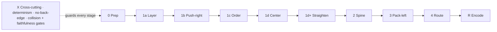

_Each stage is a pluggable module; the priority lattice (§5) is the interface contract every module must honor (§22.1)._

### 22.1 The module contract — the priority lattice _is_ the interface

The thing that makes the pieces composable is the **priority lattice (§5)**. It is not just a conflict-resolution device; it is the **contract every module must honor**:

- **Input:** the partially-laid-out compound tree + lattice state (column floors `LB`/`UB`/slack, fan-out/fan-in sets, per-container hull-edge DAGs, current boxes).
- **Output:** an updated tree that **still satisfies every tier at or above the module's own tier**, and is **deterministic** (CON-8).
- **Rule:** a module may optimize only tiers at or below its own; it must **never violate a higher tier**. (E.g. a compaction module — tier T6/T7 — may move free nodes but must not break a fan-out column (T4) or a forced band (T2).)

Because the contract is the lattice, **any** module that preserves T1–T5 can be dropped in. This is why every item in §23 can be expressed as a pluggable module (or an additional pass) rather than a rewrite.

### 22.2 Stage / strategy registry

| Stage | Default module | Swappable alternatives | Tiers it may touch |
| --- | --- | --- | --- |
| **0 Prep** | satellite + edge collapse; compound tree; floors `LB`; slack `UB`; fan-out sets; hull-edge up-projection | _(fixed)_ | builds T1/T3/T4 inputs |
| **1a Layering** | longest-path floors + hull staircase + fan-out pinning | network-simplex (Gansner [R2]); Coffman–Graham [R16]; MinWidth / node promotion [R3] | T1, T3, T4 |
| **1b Height compaction** | `balance()` push-right of _free_ nodes | off; MinWidth promotion [R3] | T6 (within T1–T5) |
| **1c Ordering** | barycenter w/ strict-improvement gate | sifting; off | PREF-2 (crossings) |
| **1d Coordinate (Y)** | forced-band placement OR Brandes–Köpf size-aware centering + VPSC clamp [R10][r12][R14] | priority method [R1]; network-simplex x-coord [R2] | T5 (clamped by T2) |
| **1d+ Path straightening** | off | spine-scoped whole-path straightening (± dummy nodes) [R10] | PREF-3 (within T5) |
| **2 Spine alignment** | hybrid (global top spine, local below) | fully global; fully local | T3 / REQ-7 |
| **3 Width compaction** | order-preserving pack-left, fan-out groups as units [R13] | off; aspect-targeted [R4][r11] | T7 |
| **4 Routing** | straight arrows + LCA frame parenting | orthogonal + ports [R29]; edge-path bundling [R27] | rendering (no tier) |
| **R Encoding (render)** | current styling | hull tinting + spine color + legend; salience / focus+context; grid-snap | rendering (no tier) |
| **X Cross-cutting** | determinism, no-back-edge, collision gate | mental-map preservation [R26]; faithfulness metric [R28]; aspect/viewport target [R4][r11] | guards T1–T5 |

> Implementation note: model each stage as a function `(tree, lattice, options) → tree` with the contract above; register strategies in a small table keyed by `options`. The new dials in §18 select modules; defaults reproduce the recommended RCLL behavior.

---

## 23. Human-factors readability — principles, engine practice & optional extras

This section catalogues readability enhancements. Most are **optional extras** (pluggable modules per §22). Each carries **Pros / Cons / Fit / Default / Rec** so reviewers can include, defer, or drop it. The corpus already contains nearly all the underlying research (IDs below).

### 23.1 Principles ranked by evidence

| Rank | Principle | Evidence (corpus `doc_id`) | RCLL action |
| --- | --- | --- | --- |
| 1 | **Minimize edge crossings** — by far the strongest comprehension factor. | Purchase `doi-10-1007-bfb0021827`, `doi-10-1016-s0953-5438-00-00032-1`, `s2-10-1007-3-540-44541-2-2` | EXT-1 (Stage 1c primary objective). |
| 2 | **Support path-tracing** — people read along geodesic paths; smooth, monotone paths read faster. | Huang/Eades/Hong `doi-10-1109-pacificvis-2009-4906848`, `doi-10-1057-ivs-2009-10` | EXT-2 (whole-path straightening). |
| 3 | **Few bends + one consistent direction.** | Purchase (bends); layered core [R1] | EXT-12; routing (Stage 4). |
| 4 | **Symmetry / alignment / equal spacing** — weaker but positive; isomorphic substructures identical. | Purchase; Ware `doi-10-1057-palgrave-ivs-9500013` | EXT-7. |
| 5 | **Preserve the mental map** across expand / re-import. | Archambault & Purchase `openalex-10-1007-978-3-642-36763-2-42`, `openalex-10-1007-978-3-540-70904-6-19` | EXT-9. |
| 6 | **Faithfulness** — geometry must not imply false relationships. | `crossref-10-1007-978-3-642-36763-2-55`, `arxiv-2208-14095v1`, `s2-10-1109-pacificvis60374-2024-00029` | EXT-10. |
| 7 | **Manage clutter via level-of-detail** — overcrowding is the #1 practitioner complaint. | LOD `openalex-10-1109-tvcg-2012-238`; fisheye `graphviz-fisheye`; overview+detail `doi-10-1109-tvcg-2008-130` | EXT-8. |

### 23.2 How the engines organize for readability

| Engine | Mechanisms worth borrowing |
| --- | --- |
| **Graphviz / dot** | Network-simplex ranks; crossing min by **median + transpose**; **spline** routing; `rankdir=LR`; `weight`/`constraint`/`group`/`samerank`; `nodesep`/`ranksep`; `subgraph cluster_*`. |
| **ELK Layered** | Brandes–Köpf placement; orthogonal/polyline/spline `edgeRouting`; **port constraints/sides** (dataflow ports); `hierarchyHandling=INCLUDE_CHILDREN`; **`considerModelOrder`** (stability); `aspectRatio`; rich `spacing`. (`elk-eclipse-layout-kernel-arxiv`, `elk-dagre-engine-docs`.) |
| **Mermaid (dagre / ELK)** | dagre = simple layered default; ELK for complex graphs; `direction LR`; subgraph containers. |
| **D2 / TALA** | **TALA is purpose-built for software-architecture readability**: container-aware, near-orthogonal, grid-like, keeps related things together; D2 `grid` layouts. (Product — see harvest.) |
| **Structurizr / C4** | **Level-of-abstraction discipline** (Context→Container→Component); auto-layout + manual nudges; **auto-generated legend**. (Simon Brown.) |
| **Ilograph** | Interactive **perspectives** + hierarchy navigation (LOD / overview+detail). |
| **Cloudcraft / Hava** | Auto-group by **account/region/VPC/subnet**; explicit boundary containers; consistent vendor icons. |
| **draw.io / vendor guides** | Containers/swimlanes for boundaries; **color = environment** paired with pattern; compact legend (solid=sync, dashed=async). |

### 23.3 Optional extras catalogue

Each maps to a stage/module in §22.2.

**Edge & path (Stages 1c / 1d+ / 4)**

- **EXT-1 — Crossing-reduction as a first-class objective.** Promote crossing minimization from a strict-improvement tiebreak to a primary objective (allow modest extra height/width to cut crossings).
  - _Pros:_ Crossings are empirically the #1 readability factor (Purchase) — biggest legibility win per unit effort.
  - _Cons:_ Can fight compaction (crossing-free layouts are sometimes larger); needs a **polyline-aware** crossing counter (today's straight-chord metric mis-counts elbow arrows); adds compute.
  - _Fit:_ Stage 1c (ordering). _Default:_ **on**. _Rec:_ **yes** — highest ROI.
- **EXT-2 — Whole-path straightening (geodesic continuity).** Straighten an entire TFD chain (org→account→trunk→api→datastore) into one smooth, monotone line, not edge-by-edge.
  - _Pros:_ People trace _paths_, not edges (Huang/Eades/Hong); a straight spine is far easier to follow.
  - _Cons:_ Straightening column-skipping edges needs **dummy nodes** (extra elements/bookkeeping); straightening one path can bend others (must choose which paths win — the spine).
  - _Fit:_ Stage 1d+. _Default:_ **off** (spine-scoped opt-in). _Rec:_ **yes, scoped** to spine/critical paths; dummy nodes are a separate decision (DEC-5).
- **EXT-3 — Orthogonal routing + ordered ports.** Right-angle routing leaving source-right, entering target-left, with ports ordered to avoid near-node crossings.
  - _Pros:_ Reads like a **pipeline/circuit** — the exact mental model here; this _is_ a dataflow diagram; ELK and D2/TALA default to it; aligns with the column structure. Ports = Excalidraw binding points.
  - _Cons:_ Adds **bends** (Purchase: bends hurt, less than crossings); routing + port assignment is real engineering (channel/track assignment); can look busy if overused.
  - _Fit:_ Stage 4 (routing). _Default:_ **toggle** (orthogonal vs smooth). _Rec:_ **strong yes** for this domain — the pipeline metaphor is the point.
- **EXT-4 — Edge-Path bundling.** Bundle near-parallel cross-hull / fan-out edge families along actual graph paths (low-ambiguity variant).
  - _Pros:_ Cuts clutter on dense graphs (the #1 complaint); the "Edge-Path" variant stays unambiguous.
  - _Cons:_ **Any** bundling trades individual-edge traceability for cleanliness; adds routing complexity; can clash visually with EXT-3.
  - _Fit:_ Stage 4, aggregated cross-hull connectors only (keep within-hull fan-outs crisp). _Default:_ **off**. _Rec:_ **optional / later** — only if density hurts; ambiguity risk.

**Encoding & salience (Stage R — rendering, no placement risk)**

- **EXT-5 — Nested hull tinting + spine color + auto-legend.** Tint hull backgrounds by role/account, color the spine, auto-generate a legend.
  - _Pros:_ Gestalt "common region" makes nesting readable at a glance; color is the fastest "which account" channel; legend removes guesswork. Pure rendering — no placement risk.
  - _Cons:_ Must be accessibility-safe (pair color with outline/pattern; don't rely on hue alone); too many tints become noise; legend takes canvas space.
  - _Fit:_ Stage R. _Default:_ **on**. _Rec:_ **yes** — cheap, big perceived-quality gain.
- **EXT-6 — Salience (focus + context).** Heavier strokes on the spine/critical path, dim the periphery, highlight a full path on hover.
  - _Pros:_ Directs the eye to the story; complements EXT-2; builds on existing weighted connectors (R5)
    - multi-hop hover (R4).
  - _Cons:_ Needs spine/importance detection; interactive highlighting is runtime work, not layout.
  - _Fit:_ Stage R + runtime. _Default:_ **partial** (extend existing). _Rec:_ **yes, incremental**.
- **EXT-7 — Symmetry / grid-snap / uniform fan-outs.** Snap to a grid, equalize within-column gaps, draw repeated structures (api1..16) identically.
  - _Pros:_ Tidy, professional, predictable; symmetry is a (weaker) validated aesthetic; uniform combs read as "same kind of thing."
  - _Cons:_ Grid-snap can waste space or fight tight packing; lowest legibility payoff here.
  - _Fit:_ Stage R / post-coordinate finishing pass. _Default:_ **off**. _Rec:_ **low priority** polish.
- **EXT-8 — Progressive disclosure / level-of-detail.** Make "collapsed overview, expand on demand" the explicit core model (Compact default + click-to-expand + degree-of-interest hover).
  - _Pros:_ The single most effective clutter remedy (C4; cloud best-practice "don't draw a dozen boxes"); largely already built (Compact + expand + R4 hover).
  - _Cons:_ Mostly a stance/doc commitment, not new math; expand-overlap still needs EXT-9.
  - _Fit:_ Product/UX + EXT-9. _Default:_ **on** (Compact default). _Rec:_ **yes** — formalize what exists.

**Stability & correctness (Stage X — cross-cutting)**

- **EXT-9 — Mental-map-preserving expand + stable re-import.** On expand, push neighbors _minimally_ (constrained) instead of overlapping; on re-import reuse prior positions (`terraformCompoundLocal` is already written but unused).
  - _Pros:_ Preserving positions measurably aids orientation (Archambault/Purchase); fixes today's "expand overlaps siblings" wart; makes re-imports diff-friendly.
  - _Cons:_ Constrained neighbor-pushing is real work (topology-preserving move); re-import anchoring has edge cases when the graph changed shape.
  - _Fit:_ expand path + finalize (reuses the VPSC projection). _Default:_ **on**. _Rec:_ **yes** — fixes a known defect.
- **EXT-10 — Faithfulness guardrail.** A metric/check ensuring geometry never implies a relationship that isn't there (accidental alignment/clusters); geometric clusters == real hulls.
  - _Pros:_ Prevents "lies" in the diagram; cluster-faithfulness is a current (2024) metric; cheap as a gate.
  - _Cons:_ A guardrail, not a visible feature; thresholds need care.
  - _Fit:_ metrics / acceptance gates (§13, §17). _Default:_ **on (as a test)**. _Rec:_ **yes** — low cost, prevents regressions.
- **EXT-11 — Aspect-ratio / viewport fit.** Target a specific width:height (e.g. the screen) explicitly rather than "shortest then trim width."
  - _Pros:_ Best matches "horizontal but not excessive"; ARCOL (2026) is exactly aspect-ratio-constrained orthogonal layout; fits a viewport without dual-axis scrolling.
  - _Cons:_ Adds a real objective/knob (which ratio? whose viewport?); can conflict with forced-band height.
  - _Fit:_ Stage 3 / this is DEC-4. _Default:_ **decide the target** (screen-ish ratio recommended). _Rec:_ **yes** — pick the target.
- **EXT-12 — No-back-edge routing.** Guarantee nothing ever _looks_ like it flows backward/up-left; route long column-spanning edges cleanly.
  - _Pros:_ Cheap; reinforces L→R reading; TFD order already guarantees the logical direction.
  - _Cons:_ Essentially none — a routing constraint.
  - _Fit:_ Stage 4. _Default:_ **on**. _Rec:_ **yes** — free.

### 23.4 References added (R21–R30)

- **[R21] Purchase, Cohen, James — _Validating Graph Drawing Aesthetics_**, GD 1995. doi:10.1007/BFb0021827 · `doi-10-1007-bfb0021827`. _(crossings ≫ bends > symmetry)_
- **[R22] Purchase — _Effective information visualisation: a study of graph drawing aesthetics and algorithms_**, Interacting with Computers 2000. doi:10.1016/S0953-5438(00)00032-1 · `doi-10-1016-s0953-5438-00-00032-1`.
- **[R23] Purchase, Allder, Carrington — _User Preference of Graph Layout Aesthetics: A UML Study_**, GD 2000. `s2-10-1007-3-540-44541-2-2`.
- **[R24] Ware, Purchase, Colpoys, McGill — _Cognitive Measurements of Graph Aesthetics_**, Information Visualization 2002. doi:10.1057/palgrave.ivs.9500013 · `doi-10-1057-palgrave-ivs-9500013`.
- **[R25] Huang, Eades, Hong — _A Graph Reading Behavior: Geodesic-Path Tendency_**, PacificVis 2009 (`doi-10-1109-pacificvis-2009-4906848`); and **_Measuring Effectiveness of Graph Visualizations: A Cognitive Load Perspective_**, Information Visualization 2009 (doi:10.1057/ivs.2009.10 · `doi-10-1057-ivs-2009-10`).
- **[R26] Archambault, Purchase — _Mental Map Preservation Helps User Orientation in Dynamic Graphs_**, GD 2012. `openalex-10-1007-978-3-642-36763-2-42`. (See also _How Important Is the "Mental Map"?_ `openalex-10-1007-978-3-540-70904-6-19`.)
- **[R27] Wallinger et al. — _Edge-Path Bundling: A Less Ambiguous Edge Bundling Approach_**, IEEE TVCG 2022. doi:10.1109/TVCG.2021.3114795 · `doi-10-1109-tvcg-2021-3114795`. (Confluent: Bach et al. `doi-10-1109-tvcg-2016-2598958`; power-confluent `doi-10-1109-tvcg-2019-2944619`.)
- **[R28] Faithfulness — _On the Faithfulness of Graph Visualizations_** `crossref-10-1007-978-3-642-36763-2-55`; **_Shape-Faithful Graph Drawings_** `arxiv-2208-14095v1`; **_Cluster-Faithful Graph Visualization_**, PacificVis 2024 `s2-10-1109-pacificvis60374-2024-00029`.
- **[R29] Orthogonal / dataflow routing — Spönemann et al. _Port Constraints in Hierarchical Layout of Data Flow Diagrams_** `elk-10-1007-978-3-642-11805-0-14`; **Wybrow, Marriott, Stuckey _Orthogonal Hyperedge Routing_** doi:10.1007/978-3-642-31223-6\*10 · `doi-10-1007-978-3-642-31223-6-10`; \*\*Hegemann, Wolff \_A Simple Pipeline for Orthogonal Graph Drawing**\* arXiv:2309.01671 · `arxiv-2309-01671v2`; **ARCOL: _Aspect Ratio Constrained Orthogonal Layout_\*\* (2026) `openalex-w7148176492`.
- **[R30] Engines — _The Eclipse Layout Kernel_** arXiv:2311.00533 · `elk-eclipse-layout-kernel-arxiv`; ELK/dagre docs `elk-dagre-engine-docs`; LOD rendering `openalex-10-1109-tvcg-2012-238`; topological fisheye `graphviz-fisheye`; overview+detail constraint layout `doi-10-1109-tvcg-2008-130`.

### 23.5 Harvest candidates

The corpus is already strong; these are the gaps worth adding for full context.

- **HOLA — _Human-like Orthogonal Network Layout_** (Kieffer, Dwyer, Marriott, Wybrow), IEEE TVCG 2016, doi:10.1109/TVCG.2015.2467451. **Harvest** — most on-point missing academic source; pairs with EXT-3 (ARCOL, by overlapping authors, is already in-corpus).
- **Practitioner / product docs (harvest selectively as doc entries; precedent: `elk-dagre-engine-docs`).** D2 / TALA (https://d2lang.com, https://terrastruct.com); C4 (https://c4model.com) / Structurizr (https://structurizr.com); Ilograph (https://www.ilograph.com); Cloudcraft (https://www.cloudcraft.co); Hava (https://www.hava.io); Azure Well-Architected diagrams (https://learn.microsoft.com/azure/well-architected/architect-role/design-diagrams); Graphviz attrs (https://graphviz.org/doc/info/attrs.html); ELK reference (https://eclipse.dev/elk/reference.html); Mermaid (https://mermaid.js.org); dagre wiki (https://github.com/dagrejs/dagre/wiki). Highest value: **D2/TALA** and **C4/Structurizr**.
- **GraphMaps — _Browsing Large Graphs as Interactive Maps_**, arXiv:1506.06745. **Optional** — the LOD theme is already covered by `openalex-10-1109-tvcg-2012-238` + `graphviz-fisheye`.
- **Ware — _Information Visualization: Perception for Design_** (book). **Context reference** — abstract only if harvested; read directly for perception foundations.

---

## 24. Implementation order & build sequence (milestones)

This is the **careful, piece-by-piece build order** — the assembly instructions for the Lego pieces of §22. It is not the runtime phase order (§7); it is the _construction_ order, sequenced by dependency and risk so each step is small, verifiable, and reversible, with a real decision made before the next piece is added.

### 24.1 Rules of the build

1. **Everything ships behind the `pipelineLayoutVariant: "rcll"` flag.** The existing builders stay intact until the core (M0–M8) passes the gates; nothing user-facing changes until then.
2. **Correctness first, readability second, optional extras last.** Hard tiers (T1–T3) and clean hulls (T2) before centering (T5), before compaction (T6/T7), before EXT-\*.
3. **Measure before you change.** M0 stands up the metrics so every later milestone is a _measured_ decision, not a guess.
4. **Each milestone ends with a decision gate** — it resolves a specific `DEC-*` / `FLEX-*` / `EXT-*` choice using the M0 metrics — **and acceptance criteria** (an invariant or metric that must hold).
5. **Each milestone is reversible** (a module/flag toggle per §22). A milestone that regresses a gate is reverted, not patched over.

### 24.2 Milestone table

> **Milestone numbers are RFC-DESIGN order, not BUILD or RUN order.** The numbers below were assigned when this RFC was written (correctness → centering → ordering → compaction). As-built, the **build order was resequenced to the run order** (push-right → order → center; [DI-M6-1](#341-implementation-decision-log-di--per-milestone-as-built)): **M6 (ordering) shipped before M5 (straightening)**; **M4** became the _swimlane lane-rise_ (the global spine ruler had no v2 leverage and is deferred, [§34.2](#342-implemented-vs-specified-delta-as-built-m3a-hardening)); and **M7 (push-right) was SKIPPED** on v2 (3/123 free-slack leaves — no leverage). M4 / M5 / M6 are **independent, default-OFF A/B toggles** — they compose; the `rcllMilestone` meta string is a **precedence rollup** (straighten ⇒ "M5" > reorder ⇒ "M6" > rise ⇒ "M4" > baseline "M3a"), **not** a cumulative stack. The change log and [§34.1](#341-implementation-decision-log-di--per-milestone-as-built)/[§34.3](#343-commit-map-what-each-commit-implemented--decided--amended) are the authoritative as-built record.

| # | Milestone | Adds (stage/EXT) | Decision gate | Acceptance criteria |
| --- | --- | --- | --- | --- |
| **M0** | Scaffolding + measurement harness | `rcll` flag routing (delegates to old builder); collision diagnostic + readability metrics (§13/§17) | Pick the **polyline-aware crossing counter** ([DEC-6](#14-open-design-decisions)) | Flag routes; all metrics compute; **v2 baselines recorded**; existing tests green |
| **M1** | Prep + compound tree (Stage 0) | compound tree (`root`/`primaryCluster`), `UB`/slack, fan-out/fan-in sets, hull-edge up-projection `D_H`, localized cycle fallback | Cross-hull fan-out at the **LCA** ([DEC-2](#14-open-design-decisions)) | `D_H` acyclic or localized fallback; fan-out sets + slack correct on v2; deterministic. _No placement change yet._ |
| **M2** | Layering (Stage 1a) | longest-path floors (CON-1) + hull staircase (CON-6) + **fan-out column pinning** (T4) | Fan-out shared column = `max LB` over the set | CON-1, CON-6 hold; **fan-out-column rate = 100 %** on v2; deterministic |
| **M3** | Recursion + forced bands + hull frames (Stages 1d-forced / 2-frames) | recursive container layout; forced-band policy; derived hull boxes; collision gate (CON-3/4/5) | [DEC-1](#14-open-design-decisions) staircase Y-overlap; [DEC-3](#14-open-design-decisions) default region policy | **Collision count = 0** (compact **and** full); forced bands disjoint; containment holds |
| **M4** | ~~Hybrid top-spine alignment~~ → **swimlane interior lane-rise** (DEC-1 extended; `swimlaneLaneRise` A/B toggle) | **As-built:** original spine-alignment had no v2 leverage (one provider). Two measured reframes; shipped: X-disjoint swimlane lanes rise to share Y (CON-12-safe). The **global cross-provider spine ruler** is deferred (§34.2). | swimlane-bypass + no-op (Codex); reorder→M6; default OFF == M3b | **rise ON shorter than OFF** + all 4 gates 0 (incl. mixed-VPC unaffected) + determinism + toggle wired; v2 −2.1% / −2.0% |
| — | **▸ Checkpoint A — "correct skeleton":** TFD-correct, hierarchy-clean, frames correct. Can replace `Stacked`/`Packed` _correctness_. Readability not yet improved. First internally-shippable cut. |  |  |  |
| **M5** | Coordinate assignment / **straightening** (Stage 1d) — _retitled from "centering"_ ([§9](#9-coordinate-assignment-centering)) | **A1 · Brandes–Köpf, two-sided, size-aware** Y-assignment (BUILT, `straighten` toggle); the no-dummy reduced form aligns adjacent-column neighbours, averages, deterministic down-separation. **Branches:** A2 ([R11] flow) on an optimizer-limited stall + CON-9 relaxation; **Axis-2 (B de-densify / C metro)** on a density stall. Median-centering proxy **superseded**. | **Goal = straightness, not centering.** A1→A2 ([§9.4](#9-coordinate-assignment-centering)) gated on A1 ceiling + CON-9 relaxation; Axis-2 (B/C) gated on a measured **density** stall (not optimizer quality) | **near-straight ↑** + **median ΔY ↓** vs OFF (both modes); crossings ≤ OFF; 0 overlaps; determinism ×2; OFF byte-identical. **v2 result: A1 NO-OP (density-capped, §9.5) → escalate to Axis-2 metro.** |
| **M6** | Ordering / crossing reduction (Stage 1c) — **EXT-1**; **+ edge-length median reorder** (deferred from M4) | barycenter + strict-improve gate; the **median reorder** (Eades–Wormald [EW94] / Gansner [R-TSE93]) permutes hulls within a column to minimize inter-hull edge length (bounded sweeps for CON-8) | [EXT-1](#23-human-factors-readability--principles-engine-practice--optional-extras) on/off; size-vs-crossings budget; reorder couples to the DEC-1 rise (order-dependent) | **crossings ↓** + **edge length ↓** vs baseline; deterministic; no higher-tier regression |
| **M7** | Height compaction: free-node **push-right** (Stage 1b) — T6 | `balance()` push-right of _free_ nodes; re-center after | free/pinned classification; re-center vs not | **container height ↓** where slack exists; T4/T5 preserved |
| **M8** | Width compaction: **pack-left** + aspect (Stage 3) — T7, **EXT-11** | order-preserving pack-left, fan-out groups as units; aspect target | [DEC-4](#14-open-design-decisions) aspect target value | **width ↓**, height not regressed, **aspect near target** |
| — | **▸ Checkpoint B — "v1 RCLL":** full core (correct + centered + compact). Replaces all four placement toggles. This is the candidate to flip the default / retire `Stacked/Packed/pull-left/Semantic`. |  |  |  |
| **M9** | Routing: **orthogonal + ports** + no-back-edge (Stage 4) — **EXT-3, EXT-12** | right-angle routing, source-right→target-left ports; back-edge guard | [EXT-3](#23-human-factors-readability--principles-engine-practice--optional-extras) default (orthogonal vs smooth toggle) | ports consistent; **0 visual back-edges**; bends bounded; group-drag intact |
| **M10** | Encoding: hull tinting + spine color + legend + salience (Stage R) — **EXT-5, EXT-6** | nested tints, colored spine, auto-legend; heavy-spine/dim-periphery + hover path-highlight | palette + accessibility (color **paired with outline**) | legend present; contrast AA; **no placement change**; salience reads |
| **M11** | Stability: mental-map expand + re-import + faithfulness — **EXT-9, EXT-10** | minimal-push expand; wire `terraformCompoundLocal`; faithfulness metric | re-import anchoring policy | expand no longer overlaps siblings; **faithfulness metric green**; re-import diff-minimal |
| **M12** | Remaining extras (independent) — **EXT-2, EXT-4, EXT-7, EXT-8** | whole-path straightening (±dummy [DEC-5](#14-open-design-decisions)); edge-path bundling; symmetry/grid-snap; progressive-disclosure formalization | per-extra: [DEC-5](#14-open-design-decisions) dummy nodes; [EXT-4](#23-human-factors-readability--principles-engine-practice--optional-extras) ambiguity acceptance | each extra improves its metric **without regressing M0–M8 invariants** |
| — | **▸ M-ANC — RCLL ancillary ("All resources"): reserved bottom band** (DEFERRED; independent of M5–M12). Render the unconnected resources RCLL omits today. **Recipe + the dead ends already measured** are in [§8.1](#81-rcll-ancillary-all-resources--reserved-band-deferred); DI-ANC-1..3; §34.2. | a new `ancillaryBand` role placed as a disjoint-Y band below each container's dataflow (model-phase, like the `mixed`-VPC policy) | accept Y-growth (a band makes a container taller); **band-width cap** so dataflow X is preserved | **collision 0** (Compact + Full) + `primaryClusterCount` unchanged vs OFF + dataflow column X unchanged + determinism |

### 24.3 Dependency graph & reordering freedom

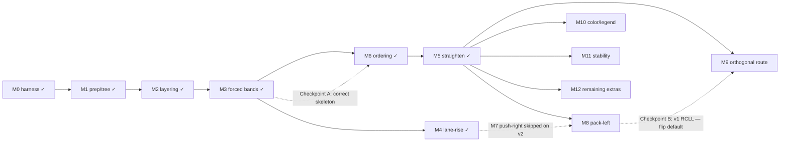

_As-built shape (v0.6): M4 = swimlane **lane-rise** (not spine ruler); **M6 ordering runs before M5 straightening** (DI-M6-1 resequencing — ordering needs only a placed skeleton, not a straightened one); **M7 push-right skipped** on v2 (density is column-count-capped, not optimizer-driven). M9–M12 are mutually independent extras._

- **Core M0–M3** is strictly linear. **M4 (lane-rise) and M6 (ordering) both depend on M3** and are independent of each other; M5 (straighten) follows M6 in run order.
- **M7 (push-right) is skipped on v2** — measured as a NO-OP because the density ceiling is column-count-governed, not optimizer-quality-driven. Revisit if a future variant lifts the cap.
- **M9–M12 are mutually independent** optional extras; each depends only on M0 (metrics) + a real placement (≥ M5). Pick the order by value: typically **M9 (orthogonal) then M10 (color/legend)** give the biggest additional human-readability per unit risk.
- Every milestone is a module toggle (§22), so any can be disabled to bisect a regression.

### 24.4 Minimum-viable-readable cuts

- **M0–M5** already a large readability jump: correct hierarchy + **fan-out columns** + **centered hubs** (fixes the two things the current engine most visibly lacks).
- **M0–M8** = full core RCLL; the line at which to consider flipping the default.
- **+ M9 + M10** = the biggest additional readability bump (pipeline routing + color/legend) for comparatively low risk; recommended fast-follows after the core.

### 24.5 Per-milestone deliverables (definition of done)

For **every** milestone: (a) the module(s) behind the `rcll` flag; (b) unit tests for the new module honoring the §22 contract (preserves higher tiers, deterministic); (c) the relevant gate added to the acceptance suite (§13/§17); (d) a one-line entry in the change log recording the decision made at its gate. No milestone is "done" until its acceptance criteria pass on `staging-extended-localstack-v2` in **both** Compact and Full.

---

## 25. Assumptions & preconditions

What must hold of the inputs for RCLL to behave as specified. Each is checked; a violated assumption routes to the named handling, never a crash.

| ID | Assumption | If violated |
| --- | --- | --- |
| **A1** | ≥1 resolved TFD edge (CON-10). | 400 (pipeline undefined without dataflow). |
| **A2** | Every cluster resolves to a topology path rooted at a provider. | Attach to a synthetic `unknown` bucket at the nearest known level; never invent a real account/region (CON-7). §26. |
| **A3** | Cluster addresses are unique within a bundle; multi-state uses the `stackId::` namespace. | Existing loader rule; duplicates are namespaced, not merged. |
| **A4** | Each cluster's skeleton build returns positive width/height. | `buildFallbackCluster` (existing): labeled rectangle. |
| **A5** | Node and hull sizes are known before placement (bottom-up sizing needs leaf sizes first). | Sizing is post-order; a missing size uses the fallback box. |
| **A6** | TFD edges are directed and, after cycle handling (CON-2/DEC-8), form a DAG per container. | SCC handling per DEC-8. |
| **A7** | Topology depth is bounded (`root…subnetZone`, 6 levels). | Extra levels (if ever added) extend the role enum + policy table; algorithm is level-count-agnostic. |
| **A8** | Spacing/geometry constants are positive and title height is finite. | Constants are validated at load; non-finite ⇒ defaults. |

---

## 26. Edge cases & degenerate inputs

The robustness core: every degenerate input has a defined, tested behavior. "Fallback" references the ladder in §27.

| Input | Expected behavior | Authority |
| --- | --- | --- |
| Empty graph / 0 resolved edges | HTTP-style 400. | CON-10 |
| Single cluster | One card + its hull chain; no edges; no band/centering math. | trivial |
| Two clusters, no edge between them, but ≥1 edge elsewhere | Both placed; the unconnected one is a disconnected component (below). | §26 disconnected |
| **Cycle in `D`** | Localized fallback; SCC drawn per **DEC-8** (default: model-order stack in a shared column band + `pipeline_cycle` warning). Never a global flatten (CON-2). | CON-2, DEC-8 |
| Self-loop | Dropped at edge-collapse (existing). | prep |
| Parallel / multi-edges | Collapsed to one edge with `weight = count`; weight feeds connector stroke + spine emphasis. | §6.3 |
| **Disconnected components** | Each component laid out independently, then placed as siblings under their LCA via region packing (Domrös order-preserving), ordered by `firstSequence`. | REQ-8 |
| **Huge fan-out** (`1 → many`) | One shared column until out-degree > N; beyond, grid-wrap within the hop band. | **DEC-7** |
| Deep chain (very long linear path) | Wide by nature; accepted (TFD is linear). Pack-left/aspect trim only non-chain slack. | PREF-4/6 |
| **Missing topology** (no account/region) | Synthetic `unknown` bucket at the nearest known level; truthful (no invented real topology). | A2, CON-7 |
| Cluster whose edges span inconsistent paths | Cluster placed by **its own** placement path; each edge up-projects to its own LCA. | §6.3 |
| Satellite with no primary owner | Promoted to its own primary cluster. | prep |
| Duplicate addresses across bundles | Namespaced `stackId::` (existing). | A3 |
| Hull with a single child | Hull = child bbox + pad; no band/stack logic. | §7.2e |
| Fan-out targets in different forced bands | Cross-hull centering at the LCA (hub centered on child-hull medians, clamped to its band). | DEC-2 |
| No edges create depth (all column 0) | Degenerate single column; render as a vertical stack (still valid; signals "no flow"). | T1 |
| Wider than viewport after pack-left | Accepted — flow is genuinely wide; aspect is a preference, not a hard cap. | PREF-4 |
| Module emits non-finite / overlapping coordinates | Output rejected; module skipped; prior tree kept; recorded in `rcllDegraded`. | §27, §30 |

---

## 27. Failure modes & graceful degradation

**The fallback ladder (normative).** Each rung is a valid layout by the induction "the previous rung satisfied the higher tiers." If a stage cannot satisfy its §22 contract (throws, times out, or emits an invalid tree — overlap, non-finite, higher-tier violation), it is **skipped** and the previous tree is kept; the scene meta's `rcllDegraded` lists every skipped module so degradation is observable, not silent.

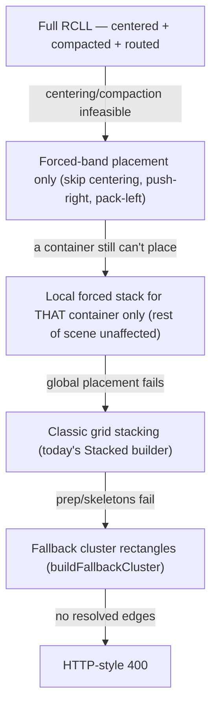

**Properties:**

- **Locality (CON-2).** A failure inside one container degrades only that container; siblings keep the full treatment.
- **Per-module guard.** Every stage is wrapped: validate output is finite, non-overlapping (per its tier), and tier-preserving before accepting it.
- **Timeouts.** `perStageTimeoutMs` (§28) bounds each stage; a timeout = skip = fall back one rung.
- **Determinism preserved on fallback.** Each rung is itself deterministic, so a degraded layout is still byte-identical on re-run (CON-8).

---

## 28. Configuration & module API surface

The concrete contract implementers and reviewers share. Options are additive; defaults reproduce the recommended RCLL behavior.

```ts
type RcllOptions = {
  // policy (FLEX-1, §8)
  levelPolicy: Partial<Record<TopologyRole, "forced" | "packed">>; // default §8 table
  staircaseBandOverlap: boolean; // DEC-1, default true

  // objective (FLEX-3 / DEC-4)
  aspect:
    | { mode: "height-first" } // default
    | { mode: "ratio"; ratio: number }
    | { mode: "viewport" };

  // modules — each "off" or a strategy id (§22.2 registry)
  layering: "longest-path" | "network-simplex" | "coffman-graham"; // default longest-path
  ordering: "barycenter" | "off"; // default barycenter
  centering: "brandes-koepf" | "priority" | "off"; // default brandes-koepf
  heightCompaction: "balance-pushright" | "off"; // default balance-pushright
  widthCompaction: "pack-left" | "off"; // default pack-left
  routing: "straight" | "orthogonal-ports"; // default straight (EXT-3 toggle)

  // optional extras (EXT-*) — booleans, defaults per §23.3
  pathStraightening: boolean; // EXT-2 (default off)
  edgeBundling: boolean; // EXT-4 (default off)
  hullTinting: boolean; // EXT-5 (default on)
  salience: boolean; // EXT-6 (default partial/on)
  gridSnap: boolean; // EXT-7 (default off)
  mentalMapExpand: boolean; // EXT-9 (default on)
  noBackEdge: boolean; // EXT-12 (default on)
  faithfulnessCheck: boolean; // EXT-10 (default on)

  // limits & tolerances (§16, §30, DEC-6/DEC-7)
  maxClusters?: number; // bail to classic grid above this
  perStageTimeoutMs?: number; // per-module timeout (§27)
  centeringEpsilonPx?: number; // ε for "centered" (DEC-6)
  hugeFanoutThreshold?: number; // N for DEC-7 grid-wrap
  coordRoundingPx?: number; // determinism snap (§30), default 1
};

// §22 module contract
type Lattice = {
  /* LB/UB/slack, fanout/fanin sets, hull-edge DAGs, boxes */
};
type StageResult = { tree: CompoundNode; meta: Record<string, unknown> };
type Stage = (
  tree: CompoundNode,
  lattice: Lattice,
  opts: RcllOptions,
) => StageResult;
// registry: Record<string, Stage>; selection driven by RcllOptions; each Stage honors §22.1.
```

**Dialog / URL mapping (extends §18):** each geometry-affecting option maps to a demo URL param and a dialog control; the consolidated dial set is `levelPolicy`, `aspect`, `routing`, plus the staircase/extras toggles. Content toggles (Compact/Full, Dataflow-only/All) remain separate.

---

## 29. Observability & debugging

So a bad layout is diagnosable from artifacts, not guesswork.

**Scene meta (extends existing `[terraform:local-parse]` `pipelineLayout.meta`):**

```ts
{
  layoutEngine: "pipeline",
  pipelineVariant: "rcll",
  rcllModules: { layering, ordering, centering, heightCompaction, widthCompaction, routing },
  rcllDegraded: string[],          // modules skipped via the fallback ladder (§27)
  counts: { clusters, edges, columns, fanoutSets },
  readability: { crossings, hubsCenteredPct, medianDeltaYPx, nearStraightPct, aspect },
  gates: { collisions, semanticEdgeViolations },   // must be 0 / []
  warnings: string[],              // e.g. "pipeline_cycle", "unknown_topology_bucket"
}
```

**Profiler spans (extends `terraformImportProfile`):** `rcll.prep`, `rcll.layer`, `rcll.order`, `rcll.center`, `rcll.pushright`, `rcll.spine`, `rcll.packleft`, `rcll.route`, `rcll.finalize`.

**Debug toggles (localStorage):** dump per-container boxes; overlay the column grid; draw band boundaries; log each decision-gate choice. (Mirror the existing `terraformImportProfile` pattern.)

**Diagnosis playbook (symptom → look here):**

| Symptom | Inspect |
| --- | --- |
| Arrows diagonal / hubs off-center | `centering` ran? `readability.hubsCenteredPct`, `medianDeltaYPx`; `rcllDegraded`. |
| Overlap / collision | `gates.collisions`; which module is in `rcllDegraded`; band policy (§8). |
| Wrong column / back-edge | `layering`; the container's hull-edge DAG `D_H`; `gates.semanticEdgeViolations`. |
| Too tall | region policy (DEC-3); `staircaseBandOverlap` (DEC-1); `counts.columns` vs forced bands. |
| Too wide | `widthCompaction` ran? `aspect`; deep-chain edge case (§26). |
| Non-deterministic diff | §30; check tie-break keys + `coordRoundingPx`. |

---

## 30. Determinism specification (normative)

CON-8 in detail. **All** layout-affecting ordering MUST follow these rules; this is the single source for tie-breaking.

1. **Canonical sort key (everywhere a set is ordered):** `(primaryStructuralKey, firstSequence, topologyKey, id)` where `primaryStructuralKey` is the stage-relevant order (e.g. `LB`/column for layering; topological order on `D_H` for forced stacks; barycenter for ordering). Lower wins; the final `id` guarantees total order.
2. **No incidental iteration order.** Never let `Map`/`Set`/object-key iteration decide geometry; copy to an array and sort by rule 1 first.
3. **Explicit comparators only.** No locale-dependent or default string sort; use a fixed comparator.
4. **No nondeterministic sources.** No RNG, `Date.now`, identity hashing, or floating wall-clock in layout. (Element `id`/`versionNonce` come from the existing deterministic convert path keyed by stable identity, so reconciliation is stable.)
5. **Float discipline.** Snap emitted coordinates to `coordRoundingPx` (default 1 px); snap VPSC outputs before use. Prefer integer/rational arithmetic where feasible to avoid cross-platform drift.
6. **Re-run guarantee.** Build twice → byte-identical element arrays (positions, ids, order). Enforced by a determinism test (§17, §35).
7. **Fallback determinism.** Every rung of the §27 ladder is itself deterministic.
8. **Source-encoding discipline.** Composite-key delimiters MUST use an escape for C0 control bytes — NUL as `\0` (backslash-zero in a string literal), `0x01` as `\u0001` — never a raw literal control byte. Raw control bytes make a source file read as binary to `grep`/`git diff`/`file(1)`, breaking tooling and agent search. Enforced by `terraformSourceHygiene.test.ts`.

---

## 31. Interactions with existing editor features

RCLL must not break features that already work. Each is specified.

| Feature | Interaction |
| --- | --- |
| **Compact→Full expand** | EXT-9 mental-map: rebuild the cluster, push neighbors minimally; because RCLL is deterministic, untouched regions don't jump. Expand is its own history entry. |
| **Multi-hop hover focus (R4)** | Unaffected; EXT-6 salience extends it (path highlight). |
| **Compound group-drag (REQ-10)** | Preserved: arrows parented to LCA topology frame; `getFrameDescendants` moves them. |
| **Export (SVG/PNG/canvas)** | Pure geometry; tinting/legend (EXT-5) are real elements, so they export. No RCLL-only export path. |
| **Collaboration / reconciliation** | Deterministic ids + stable z-order + fractional index. A re-layout is an element-update diff; note a full re-import is a **large** diff — fine for import, not intended for live multi-user re-layout. |
| **Undo/redo** | Import = one history entry (existing); expand/collapse = their own entries. |
| **KV layout cache** | Cache key MUST include every geometry-affecting `RcllOptions`; otherwise skip cache (as packed/semantic do today). Recommend: include and cache. |
| **Z-order / nesting** | hull frames behind children; tint behind frames; connectors above frames; legend top-most. |

---

## 32. Backward compatibility & migration

| Concern | Position |
| --- | --- |
| **`customData` fields** | Keep all existing (`terraformTopologyRole/Key/Path`, `terraformCompoundLayout/ParentKey/Local`, `terraformPipelineExpandable/Expanded/Placement`). RCLL adds only **additive** fields; old readers ignore unknown keys. |
| **Already-imported scenes** | Static; no migration. Re-import to obtain an RCLL layout. |
| **`terraformCompoundLocal`** | Previously written-but-unread; EXT-9 begins reading it — implementation MUST tolerate its absence (old scenes) and shape drift. |
| **Scene meta** | Additive keys only; old consumers unaffected. |
| **Default flip** | The only user-visible change (Checkpoint B); flag-gated and reversible (§18, §36-style kill switch in §33). |
| **`.tfd` syntax** | Unchanged (N1). Optional FLEX-9 edge weights are additive and ignored if absent. |
| **Public API / re-exports** | No changes to `packages/excalidraw` public exports; RCLL lives in the terraform layout core. |

---

## 33. Risk register

| Risk | Likelihood | Impact | Mitigation | Early warning |
| --- | --- | --- | --- | --- |
| Forced bands still too tall on sparse graphs | Med | High | DEC-3 region-packed toggle + DEC-1 staircase overlap | `readability.aspect`, height vs baseline |
| Centering ↔ compaction instability/thrash | Med | Med | Strict-improve gates; single-pass; determinism test | non-deterministic diff; oscillating metrics |
| VPSC infeasible / pathological constraints | Low | High | Fallback ladder to forced-only; finite-check | `rcllDegraded` contains `center` |
| Performance on very large plans | Med | Med | `perStageTimeoutMs`, `maxClusters` bail to classic; profiler spans | span durations; bail count |
| Orthogonal routing looks cluttered | Med | Med | EXT-3 is a toggle; default smooth until M9 proven | bend count; review |
| Crossing counter inaccuracy misguides M6/M8 | Med | Med | Polyline-aware counter before trusting numbers (DEC-6) | counter vs visual spot-check |
| Re-layout diff too large for collab | Low | Med | Import-only context; documented (§31) | n/a |
| Scope creep across 12 extras | High | Med | Milestone gates (§24), each reversible; checkpoints A/B | milestone slippage |
| Determinism breaks across platforms | Low | High | Coord rounding, explicit comparators, CI determinism test | cross-platform diff |
| Packing introduces misleading alignments | Low | High | Faithfulness gate EXT-10 | faithfulness metric |
| **Kill switch** | — | — | The `pipelineLayoutVariant` flag reverts to the existing builders instantly; RCLL ships off by default until Checkpoint B. | — |

---

## 34. Consolidated decision log

The single registry of **settled** decisions. Open items live in §14 (DEC-1…DEC-8); per-extra defaults in §23.3. **Design-time** decisions (the algorithm itself) are **D1–D12** below; **as-built implementation** decisions made at each milestone's gate/eng-review are **§34.1 (DI-\*)**. The change log (top of doc) is the narrative; §34.1 is the structured registry.

### 34.0 Design-time decisions (D-\*)

| ID | Decision | Rationale | Set | Revisitable? |
| --- | --- | --- | --- | --- |
| **D1** | Design the one algorithm now; rollout decided at review (report-first). | User scope answer. | v0.1 | n/a |
| **D2** | Forced vertical bands at chosen levels (no X-disjoint sibling band-sharing). | Ownership clarity. | v0.1 | via FLEX-1 |
| **D3** | Hybrid columns: global top spine, local below. | Aligned org hops without space waste. | v0.1 | yes (§11) |
| **D4** | Height lever = push **free** nodes right, then pack left. | User's literal height/width model. | v0.1 | tunable |
| **D5** | Forced + packed policy split across levels. | Clarity at containers, compaction inside. | v0.1 | via FLEX-1 |
| **D6** | Per-level forced toggle; one-way hull→hull edge ⇒ dependent hull deeper/right. | Per-density control + hull-level L→R. | v0.1 | toggle |
| **D7** | Fan-out targets share a column even when it costs height. | Human expectation. | v0.1 | no (core) |
| **D8** | Center on median in both directions; forced shared **column** for fan-out only (not fan-in). | Hub-over-children reading; keep fan-in free for compaction. | v0.1 | no (core) |
| **D9** | Readability senior to compaction; move fan-out groups as rigid units; apply fan-out+centering recursively to hulls. | The priority lattice. | v0.1 | no (core) |
| **D10** | Modular "Lego" pipeline; the priority lattice is the module contract. | Swap/adjust pieces safely. | v0.2 | no (architecture) |
| **D11** | Build order M0–M12, each behind the flag with a gate. | Careful incremental build. | v0.3 | yes (sequence) |
| **D12** | Robustness contract: defined behavior for every degenerate input + a fallback ladder. | Resilience. | v0.4 | no (core) |

### 34.1 Implementation decision log (DI-\*, per-milestone, as built)

Every settled build decision, in the order made. `Origin` cites the eng-review finding ID (`F#`/`Issue #`) or clarifying question (`Q#`) it came from. These are the ground-truth record behind the change-log rows; the git commit for each milestone carries the same decisions in prose.

| ID | Milestone | Decision | Rationale | Revisitable? |
| --- | --- | --- | --- | --- |
| **DI-M0a-1** | M0a | Export `runRcllPipeline` + take `stages` as a default param. | Lets the §27 fallback guard be unit-tested end-to-end (Issue 1). | no |
| **DI-M0a-2** | M0a | `runRcllPipeline` collects `StageResult.meta` (was a dead field). | §28 contract; M1+ stages surface diagnostics. | no |
| **DI-M0a-3** | M0a | `rcll` skips the KV layout cache; dialog hides the Layout-variant control; stale `view:"experimental"` migrates to `"semantic"`. | The view forces `rcll`; cache/UI must not fight it. | no |
| **DI-M0b-1** | M0b | Polyline-aware crossing counter; de-dupe per arrow **pair**; a 2-point arrow reduces to the old chord count. | DEC-6; future orthogonal routing (M9) must measure honestly without regressing today's numbers. | no |
| **DI-M0b-2** | M0b | ΔY / near-straight use the polyline **vertical extent** (`max_y − min_y`), not endpoint Δy. | An elbow jog with equal endpoints must read as deviating. | no |
| **DI-M0b-3** | M0b | Every rate carries a companion count; rate = 0 on an empty denominator (never a vacuous 1.0). | Honest metrics when nothing resolves (Full-mode 0/0). | no |
| **DI-M0b-4** | M0b | Gate dials: ε = 36px (`PIPELINE_CLUSTER_GAP_Y`), fan-out column tol = 75px (`PIPELINE_COLUMN_GAP`/2), near-straight ≤ 24px. | Tuned to the card grid; local consts in the diagnostics leaf (arch-clean). | tunable (FLEX-5) |
| **DI-M0b-5** | M0b | Hub-centering measured in **both** directions (fan-out hubs + fan-in convergence). | §13 centering gate is two-sided; `hubCount ≠ fanoutSetCount`. | no |
| **DI-M1-1** | M1 | Leaf `CompoundNode`s keyed by **`cluster.id`**, not the topology-path prefix. | Path excludes the resource, so same-subnet siblings would collide and drop their `D_H` edge (F2 — was a P1 correctness bug). | no (core) |
| **DI-M1-2** | M1 | Declared box→box edges merged into `D_H` by `(from,to)` **without** summing weight. | Avoids double-counting when a declared edge coincides with an up-projected one (F1). | no |
| **DI-M1-3** | M1 | Inline the successor map in `computeUpperBounds` (declined a shared helper). | Smallest diff; only the 3rd consumer. **Superseded by DI-M2-4** when a 4th appeared. | superseded |
| **DI-M1-4** | M1 | Import is **unguarded** (no try/catch around `buildRcllModel`). | A model-build bug should surface loudly, not silently blank the view; degenerate-input no-throw tests are the compensating control (F3). | revisit if real inputs prove fragile |
| **DI-M1-5** | M1 | `UB` clamped `≥ LB` so `slack ≥ 0`. | A cycle artifact in `computeDepths` can otherwise yield negative slack that would mislead the M7 push-right. | no |
| **DI-M1-6** | M1 | DEC-2 realized: cross-hull fan-out up-projected to the **LCA container** via `lcaTopologyPath`. | Evaluate fan-out/centering where both ends are visible. | no (core) |
| **DI-M1-7** | M1 | Compound builder takes an optional `prep`; RCLL shares its prep with the fallback. | Skeleton build runs once, not twice (no ~2× regression). | no |
| **DI-M1-8** | M1 | Container cycles in `D_H` are **detected + flagged only**; the localized fallback is M3. | Nothing to act on without a placement; v2 has 6 such containers (up-projecting a DAG is not a DAG). | M3 acts |
| **DI-M2-1** | M2 | Layering is **model-only**: write `localColumn`, change no geometry; the gate is asserted on the model. | Keeps M3 the first-geometry boundary; ships no collisions mid-campaign (collision gate is M3). (Q1) | no (campaign rule) |
| **DI-M2-2** | M2 | Cyclic containers get **sequential columns** `0,1,2…` and are **excused** from the CON-1/CON-6 gate. | Longest-path is undefined on a loop; M2 only needs sane numbers, smarter handling is M3. (Q2) | M3 refines |
| **DI-M2-3** | M2 | Fan-out pinning is **junior to precedence (T1 > T4)**: a target internally preceded by another keeps its later column. Algorithm = pin to set-max → forward-relax → **measure** (assert rate = 1.0, an un-aligned set is a documented finding, never a silent weakening). | Precedence is hard; co-columning is readability-hard. v2 hit 1.0, so no union-find column-classes needed. (Issue 3) | escalate to column-classes only if a preset misses 1.0 |
| **DI-M2-4** | M2 | Extracted shared `longestPath(nodeKeys, edges, rankOf) → {column, hasCycle, unresolved}`; `computeDepths` routes through it (byte-identical, regression-tested); each caller keeps its own cyclic fallback. | The 4th consumer appeared (**supersedes DI-M1-3**); kept minimal to avoid an over-parameterized helper. (Issue 2) | no |
| **DI-M2-5** | M2 | Layering stage is a **pure transform** (clones the tree); the builder is rewired to consume `runRcllPipeline().tree`. | Honors the §22.1 contract and threads the tree forward for M3+ placement; closes the latent "builder drops the pipeline tree" gap. (Issue 1) | no |
| **DI-M3a-1** | M3a | **M3 is split into M3a + M3b.** M3a = correct geometry (placement + forced bands + frames + collision gate); M3b = DEC-1 staircase Y-overlap + DEC-3 region policy knob. | Smallest reversible step that draws first geometry; the height levers layer on top and stay measurable in isolation. (Q1) | no |
| **DI-M3a-2** | M3a | **Packed containers use column-stack** (each child at its column X; same-column children stacked in Y by `(mds,key)`); **no** centering, **no** row-sharing. | The honest un-centered Sugiyama coordinate; centering is M5 (T5), row-share is M7 (T6). Keeps M3a's only job "turn columns into boxes." (Q2) | M5/M7 refine |
| **DI-M3a-3** | M3a | **Structural gates only**: collision = 0 + containment (CON-3) + forced bands disjoint (CON-5) + determinism, Compact **and** Full. `semanticEdgeViolations` is **observed, not gated**; the "geometry ≡ compound" net is **retired**. | M3a's whole point is new geometry; cross-container edge straightness is the M4 spine's job (REQ-7), not a structural-correctness gate. RCLL may be taller than compound until M7. (Q3) | M4 drives semantic-edge down |
| **DI-M3a-4** | M3a | **DEC-1 OFF**: forced bands strictly disjoint in Y (no staircase rise). | Makes collision = 0 hold by construction for forced levels; DEC-1(B) rise-beside is M3b. | M3b enables |
| **DI-M3a-5** | M3a | **Cyclic containers placed via M2's sequential columns** (a left-to-right strip), `pipeline_cycle_container` warning; **DEC-8(B) shared-band stack deferred** — a deliberate divergence from §26. | M2's columns are already collision-free + deterministic + read L→R, so the gate passes without a second placement codepath; the learning "M3 must implement the fallback" is satisfied by _placing_ them correctly. (eng-review A1) | M3b/M5 revisit DEC-8(B) |
| **DI-M3a-6** | M3a | Export **branches on `ran.includes("placement")`**, not a `box`-presence sniff. | Stays in lockstep with the §27 guard's bookkeeping; a degraded placement can never take the boxes path. (eng-review A2) | no |
| **DI-M3a-7** | M3a | **Provider Y stacking owned solely by `applyCompoundHierarchicalLayout`** — placement lays out _within_ each provider subtree (X only at root), never bands providers (root policy = `passthrough`). | One owner, matches compound's proven behavior, multi-provider works for free later. (eng-review A3) | no |
| **DI-M3a-8** | M3a | Each container footprint **reserves its own frame-title** (`PIPELINE_FRAME_TITLE_HEIGHT` for titled roles) at the top. | Title lives inside the footprint ⇒ stacking siblings with any positive gap keeps derived frame rects + title strips disjoint; removes per-gap title arithmetic and makes all four collision classes hold by construction. | no |
| **DI-M3a-9** | M3a | Leaf emit **pre-compensates the skeleton origin**: translate by `(box - frameLocal)` so the cluster frame lands exactly at the placed box; `layoutBoxes` = the frame's true box. | Cluster skeletons are NOT origin-normalized (frame at local e.g. `(-18,+233)`); without this the rendered card sits below its derived hull and pokes into the next band's title (a real `frame-title-primary-cluster` collision caught on v2 Full). | no |
| **DI-M3a-10** | M3a | Extracted shared `columnOffsetsFromWidths(widths, startX, gap)`; `computeGlobalColumnX` routes through it (regression-guarded). | DRY: same cumulative-offsets kernel as the global grid (eng-review CQ1); mirrors M2's `longestPath` extraction. | no |
| **DI-M3a-11** | M3a-hardening | **The iron rule is a hard constraint (CON-12) + a model-level gate**, not an "M4 will fix it" goal. `backwardEdgeGate` runs on placed **boxes** (Compact **and** Full): `acyclicBackwardEdges` MUST be 0, `cyclicBackwardEdges` excused + counted. | Empirically 100% of v2's backward edges had a cyclic LCA; the acyclic case is already forward by the width-aware staircase. Box-level measurement cures the rendered metric's Full-mode blindness. **Supersedes DI-M3a-3** (semanticEdgeViolations observed-not-gated → the iron rule IS gated; the rendered metric stays observed). | no (core) |
| **DI-M3a-12** | M3a-hardening | **Cyclic containers → DEC-8(B) SCC condensation** (iterative Tarjan + longest-path on the condensation): SCC members share one `localColumn`; acyclic members stay forward. **[SUPERSEDED by DI-M3a-16.]** | Replaces M2's sequential-column strip. A shared column ⇒ M3a packed stacks members in Y at one X ⇒ no intra-SCC _backward_ render. **Supersedes DI-M2-2.** ⚠️ But a shared column makes the sibling hulls read **same-column** — which the _extended_ iron rule (DI-M3a-16) forbids. Retained only as M2's per-container layering contract; **no longer drives placement**. | superseded (DI-M3a-16) |
| **DI-M3a-13** | M3a-hardening | The residual intra-SCC wrap-edges (11 compact / 22 full on v2) are **excused + styled as explicit back-edges (EXT-12)** via `styleRcllBackEdges` (dashed + `#e8590c` + `terraformBackEdge`); count in `meta.gates.backEdgesStyled`. **[MOOT on v2 after DI-M3a-16.]** | Under DEC-8(B) a cycle of width-bearing members had no fully-forward drawing. Under DEC-8(C) the _spurious_ cycles are dissolved into lanes ⇒ **0 wrap-edges on v2**; EXT-12 styling is retained as the **defensive path for a genuine `D` cycle** (where lane mode still leaves a real wrap-edge). | genuine-cycle path |
| **DI-M3a-14** | M3a-hardening | **`semanticEdgeViolations` precisely defined + disambiguated** from the §13 "acyclic guard": it is the _rendered_ backward-reading count (frame center-X), observed-not-gated (blind in Full; double-counts cyclic wrap-edges in Compact). | Two different notions shared one name (H1). The box-level gate is authoritative. | no |
| **DI-M3a-15** | M3a-hardening | Documented that dataflow arrows are `isDeleted` in the scene and `diagnosePipelineScene` counts them regardless; a caller that pre-filters `!isDeleted` reads a **false 0**. | Caught while classifying the 35 (a pre-filtering probe read 0). The existing `terraformPipelineRcll.test.ts` `layout()` helper pre-filters — its rendered dataflow metrics are vacuous; the box-level gate is not affected. | flag for test cleanup |
| **DI-M3a-16** | M3a-hardening-2 | **The iron rule gains a second half: no TFD edge shares a column** (CON-12), and **spurious hull cycles are dissolved into swimlanes** (DEC-8(C)), replacing DI-M3a-12's SCC-shared-column. `arrangeLaneSubtree` columns a cyclic container's descendant clusters by `denseRank(LB)` (a TFD edge always crosses a column) and lays its sub-hulls as **Y-lanes** spanning column ranges; `backwardEdgeGate` now also returns `acyclic/cyclicSameColumnEdges`, both gated 0 (acyclic) on the box **left edge**. | The user's rule: resources in the TFD must not occupy the same column. DI-M3a-12 cured backward edges by making sibling hulls **share** a column — which violates exactly that. The cluster graph `D` is acyclic, so dissolving the spurious cycle onto a shared cluster axis makes every edge read strictly forward; **v2: acyclicBackward = acyclicSameColumn = 0, both modes; 0 back-edges to style.** | no (core) |
| **DI-M3a-17** | M3a-hardening-2 | **`backwardEdgeGate` keys off the box LEFT EDGE, not `centerX`**, with threshold `ε = PIPELINE_COLUMN_GAP/2` read **inside** the function. | `centerX` is ambiguous (same-column cards have different widths ⇒ different centers). The left edge is the column indicator. The threshold is read at call time because a module-top-level `const ε = PIPELINE_COLUMN_GAP/2` binds during a **circular-import dead zone** → `NaN` (every edge misclassified as same-column — caught in test). | no |
| **DI-M3b-1** | M3b | **A cyclic container is decomposed into `D_H` SCCs**, NOT dissolved whole: multi-hull SCC → swimlane (shared `denseRank(LB)` axis), one-way condensation → staircase + DEC-1 Y-rise (`arrangeCyclicContainer`). **Supersedes DI-M3a-16's** global dissolve (the axis is now scoped per SCC group). | Hulls placed by edge directionality; the global dissolve put all of v2's accounts on one column-0 axis (Step 0: 16,165/29,405 px Y-stack, no separable lever). Per-group local axes + staircase is the only model that separates accounts that each contain a source. | no (core) |
| **DI-M3b-2** | M3b | **Multi-hull SCC flatten is REQUIRED, not optional.** A genuine mutual cycle's cross-member resource edges only read forward on ONE shared axis (CON-12), so members lose independent banding by necessity; singletons keep full `sizeAndArrange` structure + nested recursion. | The asymmetry Codex flagged is intentional: a 2-way mutual cycle IS one interwoven dataflow; a singleton is not. | no |
| **DI-M3b-3** | M3b | **The iron-rule gate (`backwardEdgeGate`) is RE-BASED**: an edge is excused only if its two clusters share a strongly-connected component of the **cluster graph `D`** — NOT because their LCA topology container is cyclic. Signature dropped the `cyclicContainers` param. | After the redesign most resource edges have the cyclic provider as their LCA, so the old LCA-keyed excusal would silently excuse every cross-group edge and go blind (Codex). `D` acyclic on v2 ⇒ 0 excused ⇒ the hard gate covers every edge. Also fixes a latent pre-M3b blind spot. | no (core) |
| **DI-M3b-4** | M3b | **`forcedBandViolations` → `siblingOverlapViolations`** — true **2D** overlap (X∧Y) among ANY container's children, policy-agnostic. | The old forced-only **Y-overlap** check false-positived the legitimate DEC-1 rise (3 on v2: X-disjoint risen accounts share Y, which is legal). 2D-overlap counts only real collisions; the rendered diagnostic gives the typed region/subnet/frame breakdown. | no |
| **DI-M3b-5** | M3b | Groups are **normalized rigid boxes** (`[0,w]×[0,h]`, one translation) placed in **canonical order** `(groupCol, minSeq, rep)`; the Y-rise (`placeRiseStack`) packs on **title-inflated footprints** (DI-M3a-8). `stronglyConnectedComponents` **extracted to shared** (reused by layering + the `D`-level gate). | Codex: a multi-hull SCC bbox may have `minX>0`; un-normalized translation breaks widths/collisions. Canonical order + the rigid-box contract preserve determinism (CON-8). DRY: one Tarjan, mirrors the `longestPath` extraction. | no |
| **DI-M3b-6** | M3b | **DEC-1 default `staircaseBandOverlap = true`** (X-disjoint groups rise to share rows); `false` = sequential stack (taller, the off-switch). Threaded `RcllBuildOptions → RcllOptions → PlaceCtx`. Internal only (no dialog/URL). **Mirror-width** parked; **DEC-3** region toggle deferred. | The height lever, now at the hull/group level where it bites. v2: rise on = 14,285/27,674 (−12%/−6%), collision 0. | no |
| **DI-M4-1** | M4 (Step 0) | **M4's "global top-spine alignment" has no v2 leverage** and is **deferred** (recorded §34.2): v2 has one provider, so "align accounts across providers" has nothing to act on, and M3b already staircases the accounts. | v2 is the only real preset; a single-provider org makes the global ruler identical to M3b's per-provider staircase. The win must come from a lever that bites on v2. (Step-0 measurement; the M3b discipline.) | superseded-by-reframe (DI-M4-3) |
| **DI-M4-2** | M4 (Step 0) | The reframe "**route every non-root container through the hull matrix**" (`placementMatrix`) was built behind a flag, measured, and **reverted**: on v2 it is **byte-identical to M3b** (full positional geometry, Compact + Full). | Proven no-op: the M3a forced/packed/mixed policies already equal the matrix — both use longest-path columns (M2's `localColumn` IS longest-path), and the width-aware staircase makes the DEC-1 rise degenerate to per-column stacking on acyclic containers; the swimlane branch only fires for cyclic containers, which already route through the matrix. Shipping a no-op adds blast radius (Codex #10) for zero value. | no (reverted) |
| **DI-M4-3** | M4 | **Shipped: `swimlaneLaneRise`** — extend the **DEC-1 Y-rise into swimlane interiors** (`layoutLanesOnAxis`). Each nested lane's frame is tightened to its content shared-column range (shift the lane's direct children by `−columnX[minCol]`, reposition the box); X-disjoint lanes then RISE via `riseStackY` instead of pure Y-stacking. | The one place the matrix does NOT reach on v2 is a swimlane's interior (`arrangeSubtreeOnAxis`, NOT `sizeAndArrange` — Codex #1). The pure Y-stack there is the reclaimable height. v2: −2.1% / −2.0%. | no (core) |
| **DI-M4-4** | M4 | **CON-12-safe by construction:** the rise changes only Y; **leaf absolute X is preserved** (the lane-box move is countered by the child shift), so leaves keep the shared `denseRank(LB)` column ⇒ cross-member edges still read forward. Gate unchanged; `acyclicBackwardEdges = acyclicSameColumnEdges = 0` under rise ON (verified). | The shared axis is what makes a 2-way swimlane's cross-edges forward; the rise must not break it. Tightening + counter-shift keeps leaf X identical (unit-tested ON==OFF leaf X). | no |
| **DI-M4-5** | M4 | **Front-end A/B toggle**, default **OFF** (== M3b): dialog control "Swimlanes · Stacked / Risen" (RCLL-only, `TerraformImportPipelineSettings`) + `swimlaneRise` URL param; threaded `pipelineSwimlaneLaneRise` through the import chain → `RcllBuildOptions.swimlaneLaneRise`. `rcllMilestone` → `"M4"` + `rcllSwimlaneLaneRise` meta when active (Codex #9: metadata must reflect the global placement change). | The user asked to A/B-test before committing a default; OFF == M3b means zero blast radius until flipped. URL param enables shareable side-by-side links. | no |
| **DI-M4-6** | M4 | The **edge-length median reorder** originally scoped for M4 is **deferred to M6**; the `edgeLength` metric is dropped from M4 (no consumer). **DEC-10** (independence gap) parked. | Eng-review A1: reordering hulls within a column by median-Y is structurally Sugiyama's _ordering_ phase (M6), and it couples to the Y-rise (a group's Y depends on placement order), so "minimize edge length at fixed height" is an order-dependent proxy — it belongs in M6, not here. | no |
| **DI-ANC-1** | Ancillary | **Shipped (UI-only): the RCLL "All resources" option is disabled** (greyed + a "not in this layout / planned" note via the `resources.allRcll` help entry) and "Dataflow only" reads active. `TerraformImportPipelineSettings.option()` gains a `disabled` arm gated on `!showVariant` (RCLL view); SCSS `:disabled`. No engine/model change. | The toggle threaded end-to-end but RCLL is dataflow-only, so it silently no-op'd — a lying control. Disabling it (rather than hiding) keeps the feature discoverable as "coming soon" while reflecting reality. | reconciled when reserved band ships |
| **DI-ANC-2** | Ancillary | **The correct design is a model-phase reserved bottom band** per container (a distinct `ancillaryBand` role placed in `sizeAndArrange` below the dataflow columns in a disjoint-Y region, like the `mixed`-VPC policy), so the container **footprint reserves the space** (no collision), it is not a column (no `columnWidths` reflow), and it is not a `primaryCluster` (no metric pollution). | Two cheaper approaches were eliminated by measurement/analysis: **column-leaf injection** reflows columns + pollutes `primaryClusterCount` (code analysis); **export-phase placement** measured **90/86 collisions on v2** (export only re-stacks providers, so a strip grows a region into the next region). Only model-phase space reservation holds the gate. | future milestone |
| **DI-ANC-3** | Ancillary | **Feature DEFERRED** (not built now). Codex showed the reserved band is a real placement-engine milestone with ~5 interaction points: role-blindness in `collectClusterLeaves` + the cyclic `arrangeByHullMatrix` engine; inject **before** `runRcllPipeline` (layering + placement both clone); a determinism re-sort after tree injection; a **mandatory band-width cap** (the container footprint width still feeds the parent's `columnWidths`, so a wide band shifts siblings); the empty-`normalKids` case. | User chose to defer the feature and ship the honest toggle (DI-ANC-1) after the scope grew across three architectures. Adding ancillary necessarily grows/shifts the diagram (a band makes a container taller), so a future build must accept Y-growth + cap band width to preserve dataflow X. | future milestone |
| **DI-M6-1** | M6 | **Build order ≠ milestone number: M6 (ordering) shipped BEFORE M5 (straightening).** A measurement caught that the RFC numbers (M5 center · M6 order · M7 push-right) are the **reverse of the run order** — ELK (P3 crossing-min → P4 placement), Brandes–Köpf/Rüegg (coordinate assignment **takes a fixed order as input**), and §7.2 (`1c order → 1d center`) all run **order → center**. A throwaway 3-lever probe on v2 then **SKIPPED T6 push-right** (3/123 free-slack leaves — the swimlane-forced `denseRank(LB)` axis pins everything) and built **M6 first**. | Each downstream phase consumes the prior's output, so building out of run order forces re-runs + stale shipped numbers; M5 straightening must run on a settled (locally crossing-min) order. graph-layout-rag confirmed. | no (campaign rule) |
| **DI-M6-2** | M6 | **Per-container barycenter reorder with a STRICT-IMPROVE gate** (`terraformPipelineOrdering.ts`): `barycenterReorder` (bounded 4-sweep) accepted **only when it strictly reduces** a geometric `countContainerCrossings` (segment-intersection over in-container edge pairs), else model order; deterministic `(firstSequence,key)` tiebreak. Wired into the two leaf sites (`placePackedColumns` + `layoutLanesOnAxis` colCursor) via `reorderRankByKey`/`laneLeafOrder`; `fanout`/`fanin`/`reorder` added to `PlaceCtx`+`LaneContext`. **X (columns) untouched → iron rule unaffected.** | §7.2c Sugiyama-per-hull ordering; strict-improve makes a per-container regression impossible (CON-8/CON-9). | no |
| **DI-M6-3** | M6 | **v2 win is MODEST and that is structural, not a bug:** crossings 250→247 (Compact) / 274→270 (Full); all gates 0; OFF byte-identical; `rcllMilestone "M6"` + `rcllReorder` meta. | v2's crossings are dominated by **cross-container long edges**; the per-container reorder only reaches crossings between leaves sharing an immediate parent. Cross-container reduction needs dummy-node chains (DEC-5, deferred) or a global pass (departs from the per-container model) — not pursued. Its run-order job (settle the order for M5) is done. | escalate only via DEC-5 / global pass |
| **DI-M5-1** | M5 | **Gate-fix shipped first (commit `3313c2d52`) — un-blinds ALL Full-mode rendered metrics, not just centering.** Tag RCLL's emitted primary-cluster frames' `customData` with `terraformTopologyRole: "primaryCluster"` + `terraformPrimaryAddress` (emit-path only, geometry-invisible); add a deterministic, mode-independent **model** metric `hubCenteringOverBoxes` over placed leaf boxes to `placementMeta`; extract+share `median` (DRY with the diagnostic). | The probe found the **rendered** `hubCenteringRate`/`fanoutColumnRate`/near-straight gate **blind on RCLL geometry** (Full `hubCount` 0) — the M0b full-mode debt: frames carried the `primaryCluster` role but no address. The fix repairs near-straight/crossings/fanout alike; the model metric is immune to model≠rendered skew. | no (core) |
| **DI-M5-2** | M5 | **Reframe: the readability goal is STRAIGHTNESS (train/metro reading), not centering** (user, 2026-06-18). The first M5 cut — median des(v) + down-only `separateY1D` — was built, **measured to REGRESS** on v2 (hubCenteringRate up 0.07→0.11 but crossings up 247→274 and near-straight HALVED 0.16→0.08), and **PARKED**. Acceptance gate flips to **near-straight ↑ / edge-length ΔY ↓**. | Hub-centering is a weak proxy that buys its own metric by spending straightness (the centering-vs-edge-length tension, concrete on v2's tight columns). §9 rewritten to the two-axis model; PREF-1 demoted to proxy. | no (goal) |
| **DI-M5-3** | M5 | **Two-axis model + the [R11] correction.** Axis-1 = Y-straightener (BK / [R11] both assign Y only); Axis-2 = X-room (de-densify / metro). **[R11] "prescribed width" = our prescribed HEIGHT** ("their width = our height") → a **height-budgeted Axis-1 straightener, NOT an X-spreader**; the pre-pivot §9 conflated the two. The earlier "T6 = 3/123 free-slack → SKIP" measured the wrong lever (T6 relocates free nodes between existing columns; Axis-2 X-spread to buy straightness was never measured). | Untangles "options" that blurred Y-assignment vs X-structure; corrects the load-bearing mislabel so future readers pick the right lever. | no (framing) |
| **DI-M5-4** | M5 | **A1 · Brandes–Köpf BUILT as the measuring stick** (`terraformPipelineStraighten.ts`, `straighten` toggle default OFF): reduced two-sided no-dummy size-aware BK — adjacent-column alignment + median rule + crossing guard, both directions, average, deterministic per-column down-separation. **Y-only, single-pass, pure** → CON-8/9/12 hold. **A2 · [R11] flow = RECORDED BRANCH** (optimal Axis-1 under a height budget), gated on a measured **optimizer-limited** A1 ceiling + the **CON-9 single-pass relaxation** (CON-8 + no-UI-import stay). | BK is ~5× less code than the flow solver and this campaign has swimlane-capped every lever — measure cheap before investing in [R11]. Branch recorded so we can change our mind. | A2 if optimizer-limited |
| **DI-M5-5** | M5 | **A1 measured NO-OP on v2; blocker = DENSITY (Axis-2), so A2 is RULED OUT.** straighten ON vs M6 base: near-straight ~flat (0.16→0.16 / 0.11→0.12), median ΔY −12% Compact, gates 0. **Edge-span diagnostic:** 123/145 edges (85%) adjacent-column, only 22 long → the no-op is **not** the long-edge tail and **not** optimizer quality; it is column density (~11 cards/column, no Y-room). A better Axis-1 optimizer ([R11]) would also be room-starved. | The branch condition "Axis-2 only on a DENSITY stall, not optimizer quality" is **met by measurement.** v2 swimlane-domination capping yet another lever (cf. M4 −2%, M6 −3). A1 kept as correct, gated, default-OFF infra (helps sparser presets; the straightener half of metro). | no (data-settled) |
| **DI-M5-6** | M5 | **Escalation chosen: Axis-2 metro / option C** (user, 2026-06-18 — "go big") — relax **REQ-3/T4** ("fan-out targets share a column") + **edge concentration** [Onoue 2016] (explicit fan-out/concentrator junctions; confluent layered drawings [Eppstein/Goodrich/Meng] for the shared-track aesthetic) so targets **spread across columns**, de-densifying **and** straightening at once (the most direct train-map). Spreading targets to **different** columns is iron-rule-safe (CON-12 wants col(u)<col(v), no same-column edge — distinct forward columns satisfy both). **Superseded by DI-M5b-1** (the ceremony reframed to de-densify-first). | A1 proved the stall is density; B (cheap de-densify) or C (metro) are the only levers that add Y-room. User chose to go big (C) for the most direct train-map. Cheaper de-densify (B) remains the fallback if C's scope is too large. | **superseded (DI-M5b-1)** |
| **DI-M5b-1** | M5b (Axis-2 B) | **De-densify (sub-lane independent same-rank cards) is the REAL v2 lever — but PROBED + PAUSED, not built (user, 2026-06-18).** The plan-eng-review ceremony (gstack + Codex) reframed "go big / option C" to **de-densify FIRST**, because relaxing **REQ-3/T4 is a v2 NO-OP by construction**: fan-out pinning runs only on _acyclic_ containers (`terraformPipelineRcllLayering.ts:104`), but v2's provider is cyclic → the swimlane path, where a leaf's column = `denseRank(LB)` (`denseClusterColumns`) with no pinning to relax. The real de-densifier is splitting **independent same-rank cards** into intra-rank **sub-lanes** (rank stays A1's alignment unit; sub-lane = an X-offset _inside_ the rank band, so A1's adjacent-column reach is preserved and CON-12 holds). A throwaway Step-0 probe (call the pipeline directly, group placed leaves by `box.x` = the real per-`colCursor` stacking set — Codex's fictional-headroom catch) measured v2: **123 leaves, 25 dense sets (K≥2), max occupancy 11; of 114 dense-set cards, 53 (46%) are independent** (no shared fan-in source / fan-out target), **~54% are fan-concentration** (e.g. a 1→5 fan; the K=11 column is 9/11 constrained). Projected free-card height saved: Full ~16–22k px against a 27.7k px height. **Decision: STOP — record, don't build.** Half of v2's density is junction-territory that sub-laning cannot touch, so de-densify is only a partial lever; pause with the density characterized. | Measure-before-build (campaign DNA). The decisive finding is that REQ-3 relaxation can't bite v2 and that v2 density splits ~50/50 independent vs fan-concentration — so the _partial_ sub-lane lever and the _dominant_ junction lever (option C) are now separated by data. A1 (`b91a4d77a`) stays as the default-OFF straightener. | revisit on appetite for **option C (junctions)** or a preset where independent-card density dominates |
| **DI-DEB-1** | Subnet de-band | **Dissolve a VPC's subnet lanes into one shared column stack** ([§8.2](#82-subnet-de-band--merge-subnet-lanes-annotate-membership-built-default-off)) via a pre-pass `collapseSubnetsForDeBand(root)` that lifts each subnet's clusters to direct VPC children; the existing swimlane leaf path then merges them. X (`colByCluster`) untouched ⇒ CON-12-safe. Behind `subnetDeBand`, default OFF. | The first lever to materially cut v2 height (−≈28 %) after the structure-preserving levers capped at noise (DI-M5b-1, option-C finding). Phase-0 probe gated the build on real `maxDepthPx`, not a proxy (Codex #1). A pre-pass on the cloned tree reuses the whole placement engine — no new engine. | revisit to extend up a level (VPC/region de-band) |
| **DI-DEB-2** | Subnet de-band | **Frame/parenting handled by metadata, not a tree exemption:** suppress the `subnetZone` frame in `emitTopologyContextFrames` (VPC then parents cluster frames directly) + truncate `topologyPathForCluster` to VPC under `subnetDeBand` (same-subnet edge LCA = VPC; no dangling sibling connector). Because the pre-pass _removes_ the subnet nodes, the existing containment/sibling-overlap gates already measure the merged geometry — **no replacement gates** (simplifies Codex #2/#3). | The frame system is metadata-driven, so the whole parenting blast radius Codex flagged reduces to two metadata levers; removing nodes (vs keep-and-exempt) keeps the gates honest with zero new gate code. | — |
| **DI-DEB-3** | Subnet de-band | **Membership visual = per-card tier rail + legend, NOT an overlapping box** (`terraformPipelineSubnetAnnotation.ts`): a colored rail (public/private/intra) in the margin left of each card + a tier legend; tagged `terraformSubnetChip`, no `terraformTopologyRole`, so gates/diagnostics ignore it. The user chose this after viewing the de-banded layout; the dotted overlap box (the original idea) is deferred. | Codex's own corpus research (MapSets, BubbleSets/LineSets) disfavours overlapping group regions; the rail restores the subnet tier the merge hid without re-introducing the boxes the merge removed. Rail sits in the gap (a card frame draws over a same-position sibling). | (C) low-opacity hull / Kelp boundary if a boundary is later wanted |
| **DI-DEB-4** | Hull X-stagger | **Hull X-stagger + Y-rise PROBED ×2 + NO-GO (DEC-12); reason corrected.** Probe 1 (leaf-level lane interior) = −73 % / 44 backward — _wrong operation_. Probe 2 (`staggerLanesIntoBands`: rigid region hulls into disjoint X-bands by the account DAG's topological order, every one-way edge forward by construction) measured **−58 % height (Compact 14 374→5 917, Full 27 763→11 712), deterministic, but 18 backward / 31 containment / 15 collisions / +300 % width**. The 18 backward are identical Compact↔Full = the cross-account edges. CON-12-safe subset (no cross-cycle hulls) ≈ 3 %, off-critical. Both probes reverted; not built. | **No real cycle:** `D` is acyclic (`depthResult.hasCycle=false`). The provider swimlane is a **projection 2-cycle in the account-hull graph** (`0002→0003` 6 edges ∧ `0003→0002` 7 edges — opposite-direction bundles; `0001`/`0004` are source/sink). The 18 backward came from per-account **local** frames (the global cascade was never built), not an inherent illegality. **Withdraws "legal only with DEC-5"** — a global zero-backward rank exists. Genuine constraint: only the **bidirectional pair `0002⇄0003`** can't be rigid-disjoint-banded. Principle: a hull is band-staggerable iff it has no _bidirectional_ cross-band flow with a sibling. | A **global** single-frame stagger keeping only mutually-bidirectional pairs co-axial is **untested / not closed**; subnet de-band holds the height (−28 %) meanwhile |
| **DI-DEB-5** | rankSeparate | **The GLOBAL single-frame stagger DI-DEB-4 left open — BUILT behind default-OFF `rankSeparate` + PROBED → NO-GO; question CLOSED.** Sibling-separation ranking (Sugiyama Phase-1 layer assignment on the SCC condensation): SCC-quotient collapses `0002⇄0003` to one co-axial node, `maxRank(A)+1 ≤ minRank(B)` per one-way quotient-sibling edge, augmented-longest-path ranks → `colByCluster`. Pure `terraformPipelineRcllRankSeparate.ts` (separation graph + cycle infeasibility detector + shift-accumulation ranker), **14/14 unit tests**, threaded like `subnetDeBand`. Separation fired (`shifted=81`/103). **v2 Compact: rankSep+m4 14 761 / 12 782 vs base 14 374 / 11 790 — height +2.7 %, width +8.4 %, bwd 7, sameCol 1, crossings 250→445 (+78 %).** | **NOT cycle-induced (corrects DI-DEB-4's framing):** `D` acyclic; the 7+1 logged in `backwardEdgeGate`'s `!isCyclic` branch. **LCA tracer: 7 of 8 are CROSS-ACCOUNT edges between `0002` and `0003`** — the two-way SCC pair the ranker keeps **co-axial** (shift 0 between members), directions running _both_ ways (`consumer_lambda→sqs` = 0002→0003; `lake→lake_replica_*`, `api8-11.gateway.private→ecs/lambda` = 0003→0002; the `api*` modules **span** both accounts — _not_ intra-module convergence, that sub-claim withdrawn). **Co-axiality does NOT prevent the inversions:** each account's interior is re-ranked **independently**, so a cross-account leaf edge links differently-shifted interiors and inverts; the bidirectional pair guarantees some such edge inverts. The 8th (`dynamodb→aurora_east_2`) is intra-`0003`, one-way regions (`TWO_WAY=false`) — a shift/densification artifact. **Fix = rank both co-axial interiors in ONE global frame** (Codex #2 cascade), a bigger leaf-granular re-rank; but **height rose regardless** ⇒ independent failure ⇒ lever dead. | Engine disposition pending (park the correct module + tests for a future leaf-granular re-rank or DEC-5 routing, vs full revert). Subnet de-band remains the only shipped height lever. |
| **DI-DEB-6** | rankSeparate (round 4) | **The leaf-granular global re-rank DI-DEB-5 named as the fix — BUILT as the whole-model-global Sander base-node layering → GO; DI-DEB-5's NO-GO REVERSED.** Corpus (`graph-layout-rag` → Sander, _Layout of Compound Directed Graphs_): rank every base (leaf) node in ONE global pass; container span derived from leaves. Rebuilt `computeGlobalSeparatedFloor(tree, baseFloor, leafAdjacency, hullEdges)`: collect ALL leaves; whole-model leaf DAG = `lattice.fanout`; per one-way quotient pair add **all-to-all** `a→b ∀ a∈leaves(A),b∈leaves(B)` (kept `buildSeparationConstraintGraph`; mutual cycle → one quotient → co-axial); ONE `longestPath` over (leaf ∪ sep) edges. Observable fallbacks: `pairCount===0` → base floor verbatim (OFF byte-identical); augmented-graph cycle → `fallbackReason="augmented-cycle"`, base floor. Deleted round-3 `computeSeparatedRanks`/`placeSeparated`/`solveSeparationShifts`. Wired once in `placementStage`; `buildLaneContext` reverted to plain floor. Milestone `"M8r"`, `rcllRankSeparate` meta. Re-planned via `/plan-eng-review`+Codex (10 findings; 3 → decisions: whole-model-global, all-to-all, strengthened observable bar). | **The 7 cross-account `0002⇄0003` inversions + 1 same-column are impossible by construction** — every real leaf edge (incl. cross-account) is a constraint in the SAME global frame. **v2 Compact: bwd 7→0, sameCol 1→0, pairs 80, changedRanks 112, fallback none; rankSep+M4 14 374→8 377 (−42 %).** The height that ROSE in round 3 now DROPS — globally-disjoint ranks let the **unmodified** M4 lane-rise share the lanes' Y rows ⇒ the round-3-planned M4 occupied-set change is **unnecessary, not built**. Locked: `terraformPipelineRankSeparate.ts` (v2 Compact+Full: gates 0/0, separation fires, composed-M4 height<base, OFF byte-identical, deterministic) + 18 ranker unit tests (14 original + 4 adversarial: nested one-way, shared fan-in, nested augmented-cycle, unbounded-width-by-design). | Costs (opt-in, default OFF): width +28 % (border-nodes+minlen, T6, if it regresses), crossings 250→362 +45 % (cross-container crossing-min = separate milestone). Phase-2 UI toggle gated on this surviving review. Not yet committed. |

### 34.2 Implemented-vs-specified delta (as-built, M3a-hardening)

Where the **normative prose elsewhere in this RFC describes an intent the code does not (yet) match**, so a future agent reading a section in isolation is not misled. Each row: spec says · code does · why.

| Topic | Spec says | As-built (M3a) | Why / when reconciled |
| --- | --- | --- | --- |
| **Root policy** ([§8](#8-per-level-placement-policy)) | `root → providers = forced band` | `root = passthrough` (children get column X only; provider **Y** owned solely by `applyCompoundHierarchicalLayout`'s reanchor). | One owner for provider Y; matches compound's proven behavior (DI-M3a-7). |
| **Staircase Y-overlap** ([§28](#28-configuration--module-api-surface) `staircaseBandOverlap`, [FLEX-2](#4-requirements-catalogue)) | default `true` (DEC-1 "on") | behaves as **`false`** — forced bands strictly disjoint. | DEC-1(B) rise-beside is M3b (DI-M3a-4); makes collision = 0 hold by construction meanwhile. |
| **`coordRoundingPx`** ([§28](#28-configuration--module-api-surface), [§30](#30-determinism-specification-normative)) | tunable, default 1 | **accepted but unread** — hard-coded `Math.round` (1px). | Default matches; wire to the option when a non-1 caller appears. |
| **`hugeFanoutThreshold`** ([§28](#28-configuration--module-api-surface), [DEC-7](#14-open-design-decisions)) | grid-wrap past N | **accepted but unread** — DEC-7 unimplemented; a `1→N` fan-out shares one tall column. | No v2 preset hits it; guard/grid-wrap is a robustness follow-up. |
| **Cyclic placement** ([§26](#26-edge-cases--degenerate-inputs)/[DEC-8](#14-open-design-decisions)) | "model-order stack in a shared column band" | **DEC-8(C) swimlane** — a _spurious_ hull cycle is dissolved onto a shared cluster column axis; sibling hulls become Y-lanes (DI-M3a-16). The earlier DEC-8(B) SCC-shared-column (DI-M3a-12) is **superseded** (it made sibling hulls read same-column). | Implemented at M3a-hardening-2; matches Sander [R6]. Genuine `D`-cycle path = lane + EXT-12. |
| **`emitTopologyContextFrames`** ([§21](#21-appendix-b--implementation-file-map)) | named reuse target | code calls **`buildCompoundFramesFromLayoutBoxes`** (an alias of the same function). | Rename drift; same behavior. |
| **`semanticEdgeViolations`** ([§13](#13-invariants--acceptance-gates)) | listed as an acyclic-guard gate (`= []`) | the **iron rule** (`backwardEdgeGate`, CON-12) is the gate; the rendered `semanticEdgeViolations` is observed-only (DI-M3a-14). | Disambiguated at M3a-hardening. |
| **Ancillary strips** ("All resources") | the unconnected resources render as per-scope "Unconnected" strips (compound/classic behavior) | **NOT drawn in RCLL** (model is dataflow-only). Investigated 2026-06-18: **export-phase placement measured 90/86 collisions on v2** (RCLL positions accounts/regions/VPCs in the model phase; export only re-stacks providers, so a strip grows a region hull into the next region). The correct design — a **model-phase reserved bottom band** per container (like the `mixed`-VPC policy: a disjoint-Y region below the columns, so the footprint reserves the space) — is a real placement-engine milestone (DI-ANC-2). | **Feature DEFERRED** (DI-ANC-3) — design + Step-0 evidence recorded; the inert toggle was **disabled under RCLL** so it can't mislead (the honest interim, DI-ANC-1). Reconciled when the reserved-band milestone is built. |
| **Global top-spine ruler** ([§11](#11-hybrid-column-model), [REQ-7](#4-requirements-catalogue), M4) | a single diagram-wide `columnX[]` aligns `root→provider→account` across the whole diagram | **NOT built** — M4 found it has no v2 leverage (one provider; accounts already staircased by M3b). The interior is still **local/group-scoped** (§11). | Deferred (DI-M4-1) until a **multi-provider preset** exists to exercise + justify it. M4 shipped the swimlane lane-rise instead. |

### 34.3 Commit map (what each commit implemented · decided · amended)

Retroactive audit trail: every RCLL commit linked to the work it carries. `Implemented` = code/tests shipped; `Decided` = the DI/DEC/CON records settled; `Amended` = what it changed or superseded in this RFC or a prior milestone. Resolve a hash with `git show <hash>`.

| Commit | Milestone | Implemented | Decided | Amended |
| --- | --- | --- | --- | --- |
| `497450e72` | RFC v0.5 | The design doc itself (§1–§36: lattice, algorithm, milestones, glossary). | D1–D12, DEC-1…8, the priority lattice T1–T7, the M0–M12 build plan. | — (initial RFC). |
| `ff77beac4` | M0a | RCLL top-level view; ELK-style **import→pipeline→export** seam with **zero** stages; compound builder wired as the §27 fallback rung; §28 contract types (`terraformPipelineRcllTypes.ts`). | DI-M0a-1..3 (export `runRcllPipeline` + `stages` param; collect `StageResult.meta`; `rcll` skips KV cache + dialog hides variant). | **Retired the Experimental view** (took its slot). |
| `be46f7c76` | M0b | Polyline-aware crossing counter; readability metrics (`fanoutColumnRate`/`hubCenteringRate`/`aspect`) + companion counts; §35 adversarial fixtures. | DI-M0b-1..5 (de-dupe per arrow **pair**; ΔY = polyline vertical extent; rate 0 on empty denom; ε=36px / tol=75px dials; two-sided hub-centering). | Crossing metric: straight-chord → **polyline-aware**. |
| `acaa4ead4` | M1 | `buildRcllModel` → compound tree + lattice (UB/slack, fan-out/fan-in, `D_H` LCA up-projection, container-cycle flags); shared prep threaded into the fallback. | DI-M1-1..8 (leaf keyed by `cluster.id`; `UB ≥ LB`; declared-edge merge without double-count; **detect-only** cycles; unguarded import). | **DEC-2 settled** (cross-hull fan-out at the LCA). |
| `651d87dfd` | M2 | `layeringStage` writing `localColumn` (longest-path floors + hull staircase + fan-out pinning); extracted shared `longestPath`. | DI-M2-1..5 (model-only; **cyclic → sequential columns** [*superseded — see hardening*]; T1 > T4; extract `longestPath`; pure transform). | `computeDepths` routed through shared `longestPath` (byte-identical). |
| `e6f367723` | docs | §34.1 implementation decision log (backfill DI-M0a…M2). | Standing practice: every settled decision is mirrored to §34.1. | Restructured §34 into §34.0 (design-time D*) + §34.1 (as-built DI-*). |
| `c25f0b2a1` | M3a | `placementStage` — **first geometry**: forced bands + packed column-stack + derived hull frames; collision gate = 0 (Compact + Full); shared `columnOffsetsFromWidths`. | DI-M3a-1..10 (split M3a/M3b; packed = column-stack; structural gates only; DEC-1 off; provider-Y via reanchor; footprint reserves title; skeleton-origin pre-compensation). | **Retired the "geometry ≡ compound" invariant.** |
| `ee0e44e93` | **M3a-hardening** | **CON-12 iron-rule gate** (`backwardEdgeGate` on placed boxes, Compact + Full); **cyclic DEC-8(B) SCC condensation** (Tarjan + condensation longest-path); **EXT-12 back-edge styling** (dashed + `#e8590c` + `terraformBackEdge`); §27 finite-check; empty-subnetZone mixed-vpc fix; height anchor; fan-out sort key. | DI-M3a-11..15 (iron rule **gated, not deferred**; SCC condensation; wrap-edges excused + styled; `semanticEdgeViolations` disambiguated; `isDeleted` false-0 finding). | **Supersedes DI-M3a-3** (semanticEdgeViolations now _gated_ via CON-12) and **DI-M2-2** (cyclic sequential strip → SCC condensation); restated **CON-6** as the width-aware pixel guarantee; added §34.2 delta + this §34.3 map. |
| `9393013dc` | docs | §34.3 commit-map hash backfill. | — | Filled `ee0e44e93` into the M3a-hardening row above (its own hash was unknowable when written). |
| `68fa65398` | **M3a-hardening-2** | **Extended iron rule (no same-column edge) + swimlane placement for spurious hull cycles.** `arrangeLaneSubtree` dissolves a cyclic container onto a shared `denseRank(LB)` cluster axis with sub-hulls as Y-lanes; `backwardEdgeGate` keys off the box **left edge** + adds `acyclic/cyclicSameColumnEdges`; `policyForContainer` is role-only (cyclic routed to lanes upstream). Swimlane unit suite + v2 integration asserts (`acyclicBackward = acyclicSameColumn = 0`, both modes). | DI-M3a-16/17 (no-same-column half of CON-12; spurious cycle → swimlane, **supersedes DI-M3a-12/DEC-8(B)**; left-edge gate + circular-import threshold fix). | **Supersedes DI-M3a-12** (SCC-shared-column → swimlane) and makes **DI-M3a-13** moot on v2 (0 wrap-edges); scoped **CON-6** to spine hulls; extended **CON-12** (no same-column); added **DEC-8(C)**; §8 swimlane row; §11 lane boundary. |
| `e62a9e46b` | **M3b** | **Hull-aware cyclic placement.** `arrangeCyclicContainer` decomposes a cyclic container's `D_H` into SCCs — multi-hull SCC → swimlane (`arrangeSwimlaneGroup`, shared axis), one-way condensation → staircase + DEC-1 Y-rise (`placeRiseStack`); `stronglyConnectedComponents` extracted to `terraformPipelineLayoutShared`; `backwardEdgeGate` re-based off cluster-graph `D` SCCs (dropped `cyclicContainers` param); `forcedBandViolations` → `siblingOverlapViolations` (2D); `staircaseBandOverlap` default true, threaded through the builder. v2: −12%/−6% height, collision 0, iron rule 0. | DI-M3b-1..6 (SCC decompose; flatten required; gate re-base; 2D overlap metric; normalized rigid box + canonical order + Tarjan extract; DEC-1 default on / mirror-width parked / DEC-3 deferred). | **Refines DEC-8(C)** (per-SCC axis, supersedes DI-M3a-16's global dissolve); **DI-M3a-4** moot (DEC-1 now on at the hull level); marks `rcll-m3a-cyclic-dec8-deferred` superseded. |
| `956d387a0` | **M4** | **Swimlane interior lane-rise** (`swimlaneLaneRise`). `layoutLanesOnAxis` tightens each lane to its content shared-column range (child counter-shift preserves leaf X) + `riseStackY` lifts X-disjoint lanes (CON-12-safe); `arrangeCyclicContainer` renamed `arrangeByHullMatrix`; option threaded `RcllBuildOptions → RcllOptions → PlaceCtx → LaneContext` + the import chain (`pipelineSwimlaneLaneRise`); front-end "Swimlanes · Stacked / Risen" control + `swimlaneRise` URL param; `rcllMilestone` → `"M4"`. v2: −2.1%/−2.0% height, all gates 0. | DI-M4-1..6 (spine ruler deferred; universal-matrix dispatch built-then-**reverted** as a v2 no-op; swimlane lane-rise shipped; CON-12-safe; A/B toggle default OFF; reorder→M6, DEC-10 parked). | Deferred the **global spine ruler** (§34.2); **DI-M4-1/-2** record the two reframes; the M6 row gains the edge-length reorder; **DEC-10** added. |
| `ca4effe25` | **Ancillary** | **RCLL "All resources" made honest (UI-only).** `TerraformImportPipelineSettings.option()` gains a `disabled` arm; under RCLL (`!showVariant`) "All resources" is disabled + "Dataflow only" forced active; `resources.allRcll` help entry; SCSS `:disabled`. Dialog test asserts disabled + active + `pipelineIncludeAncillary:false`. No engine/model change. | DI-ANC-1..3 (honest toggle shipped; reserved-band is the correct design; feature deferred after column-leaf [rejected] + export-phase [measured 90/86 collisions] eliminated). | Updated §34.2 "Ancillary strips" row (export-phase collision finding + reserved-band design); no prior decision superseded. |
| `a6770f9d9` | **M6** | **Crossing-minimization reorder (engine).** New pure `terraformPipelineOrdering.ts` — `barycenterReorder` (bounded 4-sweep) + geometric `countContainerCrossings` (segment-intersection over in-container edge pairs) + **strict-improve gate**; deterministic `(firstSequence,key)` tiebreak. Wired into `placePackedColumns` + `layoutLanesOnAxis` colCursor via `reorderRankByKey`/`laneLeafOrder`; `fanout`/`fanin`/`reorder` added to `PlaceCtx`+`LaneContext`; `pipelineReorder` URL param + demo auto-import path. v2: crossings 250→247 / 274→270, gates 0, OFF byte-identical, `rcllMilestone "M6"`. | DI-M6-1..3 (build-order≠number: M6 before M5 per run-order resequencing; T6 push-right SKIPPED [3/123 free-slack]; strict-improve gate; modest win = cross-container long edges out of per-container reach). | Resequenced the build to **run order** (push-right → order → center); recorded the **T6 push-right SKIP** (no v2 leverage); the M4 edge-length reorder folded in here. |
| `b169b2980` | **M6** | **M6 dialog A/B toggle (UI).** "Ordering · Off / On" control (`TerraformImportPipelineSettings`, RCLL-only) + the `reorder`/`pipelineReorder` thread through the import chain (`TerraformImportDialog`, `useTerraformImportDialog`, `terraformImportSession`, `terraformSceneApply`, `TerraformScenePanel`) + dialog tests. No engine change. | DI-M6-2 (the toggle deferred from the engine commit, mirroring `swimlaneRise`). | — (UI follow-up to `a6770f9d9`). |
| `3313c2d52` | **M5 (gate-fix)** | **Full-mode frame addressing + model readability metric.** `terraformTopologyLayout.ts` tags emitted primary-cluster frames' `customData` with `terraformTopologyRole`/`terraformPrimaryAddress` (emit-path only, geometry-invisible); new `terraformPipelineCoordinateAssignment.ts` exports shared `median` (DRY — the private one in `…CollisionDiagnostics.ts` removed + re-imported) + `hubCenteringOverBoxes`; `placementMeta` computes the deterministic model metric. Un-blinds Full rendered metrics (hubCount 0→57, rate 0→0.02 matching Compact). All suites green; OFF byte-identical. | DI-M5-1 (gate-fix un-blinds ALL Full rendered metrics, not just centering; model metric immune to model≠rendered skew). | Pays down the **M0b full-mode blindness** the 3-lever probe exposed; lead-in to M5 straightening. The centering **proxy** built alongside was **parked** (DI-M5-2), not committed. |
| `b91a4d77a` | **M5 (A1)** | **Brandes–Köpf leaf straightening (Axis-1, Stage 1d).** New pure `terraformPipelineStraighten.ts` — reduced two-sided no-dummy size-aware BK (median-rule alignment + crossing guard both directions, size-aware block compaction, two-sided average, deterministic per-column down-separation). `applyStraightening` rewrites leaf `box.y` at both leaf sites (`placePackedColumns` + `layoutLanesOnAxis`); `straighten`/`fanin` threaded `RcllBuildOptions → RcllOptions → PlaceCtx → LaneContext`; milestone precedence straighten ⇒ "M5" + `rcllStraighten` meta. Y-only/single-pass/pure (CON-8/9/12). v2: **NO-OP** (near-straight ~flat, median ΔY −12% Compact, gates 0) — room-starved, not optimizer-limited (85% edges adjacent-column). 52 RCLL+placement+straighten tests; typecheck + lint:arch clean; OFF byte-identical. | DI-M5-3/-4/-5 (two-axis model + [R11]=height correction; A1 built as measuring stick; A1 no-op ⇒ blocker is Axis-2 density ⇒ A2 ruled out). | Implements RFC §9.4/§9.6 A1; **supersedes the median-centering proxy** as the §9 straightener. Sets up the **Axis-2 de-densify fork** (DI-M5-6). |

### 34.4 Decision dependency graph (blast radius)

The change-log is the **narrative**, [§34.1](#341-implementation-decision-log-di--per-milestone-as-built) the **registry**, [§34.3](#343-commit-map-what-each-commit-implemented--decided--amended) the **commit↔decision** map. This section adds the missing axis: **what depends on what**, so a reversal's blast radius is explicit (DOC-4/DOC-5). Two relations:

- **Depends-on** — `A → B` means **"B rests on A; reverting/changing A forces re-deciding B."** B's premises are A.
- **Supersession** — `A ⊟ B` means **B replaced A** (drawn dashed). The superseded row is retained (DOC-3); its dependents move to the superseding row.

**Premise roots** (not themselves DI-decisions): the design-time decisions **D1–D12** + the priority lattice **T1–T7** (the algorithm), the hard constraints **CON-\***, the open decisions **DEC-\***, and **measured findings** (e.g. the M1 "`D_H` has 6 cyclic containers" probe, the M3b Step-0 "v2 provider is one cyclic container" probe). A finding root that changes invalidates everything below it (DOC-4).

#### Complete dependency table (every DI-\*)

| DI | Depends on (premises) | Supersession |
| --- | --- | --- |
| **DI-M0a-1** | §28 seam contract | — |
| **DI-M0a-2** | DI-M0a-1 | — |
| **DI-M0a-3** | §18/§32 view routing | — |
| **DI-M0b-1** | DEC-6 | — |
| **DI-M0b-2** | DEC-6 | — |
| **DI-M0b-3** | DEC-6 | — |
| **DI-M0b-4** | DEC-6, FLEX-5 | tunable |
| **DI-M0b-5** | DEC-6, §13 centering | — |
| **DI-M1-1** | §6.2 compound tree | — |
| **DI-M1-2** | DI-M1-1 | — |
| **DI-M1-3** | `computeUpperBounds` | ⊟ by **DI-M2-4** |
| **DI-M1-4** | — (unguarded import) | revisit |
| **DI-M1-5** | `computeDepths` | — |
| **DI-M1-6** | DEC-2, DI-M1-1 | — |
| **DI-M1-7** | DI-M0a-1 | — |
| **DI-M1-8** | DI-M1-6 (`D_H`), finding "DAG up-projects to non-DAG" | acted on by DI-M2-2, DI-M3a-5/12/16, DI-M3b-1 |
| **DI-M2-1** | DI-M1-1, DI-M1-6 | — |
| **DI-M2-2** | DI-M1-8 | ⊟ by **DI-M3a-12** |
| **DI-M2-3** | DI-M2-1, T1>T4 | — |
| **DI-M2-4** | DI-M1-3 (4th consumer) | supersedes **DI-M1-3** |
| **DI-M2-5** | DI-M0a-1 | — |
| **DI-M3a-1** | DI-M2-1 | — |
| **DI-M3a-2** | DI-M2-1 | M5/M7 refine |
| **DI-M3a-3** | DI-M3a-1 | ⊟ by **DI-M3a-11** |
| **DI-M3a-4** | DI-M3a-1, DEC-1 | moot after **DI-M3b-6** |
| **DI-M3a-5** | DI-M1-8, DI-M2-2 | ⊟ by **DI-M3a-12** |
| **DI-M3a-6** | DI-M2-5 | — |
| **DI-M3a-7** | reanchor (compound) | — |
| **DI-M3a-8** | footprint/title model | used by DI-M3b-5 |
| **DI-M3a-9** | DI-M3a-8 | — |
| **DI-M3a-10** | DI-M2-4 (extract pattern) | used by DI-M3b-1 |
| **DI-M3a-11** | DI-M3a-3, CON-1, CON-6, finding "100% of v2 backward edges are cyclic-LCA" | supersedes **DI-M3a-3** |
| **DI-M3a-12** | DI-M3a-11, DI-M3a-5, DI-M2-2 | supersedes **DI-M2-2**; ⊟ by **DI-M3a-16** |
| **DI-M3a-13** | DI-M3a-12, EXT-12 | moot after **DI-M3a-16** |
| **DI-M3a-14** | DI-M3a-11 | — |
| **DI-M3a-15** | finding (`isDeleted` false-0) | flag |
| **DI-M3a-16** | DI-M3a-11, DI-M1-8, CON-12, user report (same-column subnets) | supersedes **DI-M3a-12**; ⊟ refined by **DI-M3b-1** |
| **DI-M3a-17** | DI-M3a-11 | — |
| **DI-M3b-1** | **Step-0 finding (M3b)**, DI-M3a-16, DI-M1-8, DI-M1-1, DI-M2-4, DI-M3a-10, DEC-8(C) | refines **DI-M3a-16** (per-SCC vs global) |
| **DI-M3b-2** | DI-M3b-1, CON-12 | — |
| **DI-M3b-3** | DI-M3b-1, DI-M3a-11, CON-1, CON-12 | supersedes DI-M3a-16's LCA-keyed excusal |
| **DI-M3b-4** | DI-M3b-1, DI-M3a-3 | supersedes the forced-only Y-overlap metric |
| **DI-M3b-5** | DI-M3b-1, DI-M2-4, DI-M3a-8 | — |
| **DI-M3b-6** | DI-M3b-1, DEC-1, DI-M3a-4 | moots **DI-M3a-4** |
| **DI-M4-1** | **Step-0 finding (M4)**, REQ-7, DI-M3b-1 | deferred → §34.2; superseded-by-reframe **DI-M4-3** |
| **DI-M4-2** | DI-M4-1, Step-0 probe, DI-M2-1 (longest-path == localColumn), DI-M3b-6 (rise degenerates) | reverted (no-op) |
| **DI-M4-3** | DI-M4-2 (the no-op pointed here), DI-M3b-1, DI-M3b-6, DEC-1, CON-12 | extends DEC-1 into swimlane interiors |
| **DI-M4-4** | DI-M4-3, CON-12, DI-M3a-16 (shared axis) | — |
| **DI-M4-5** | DI-M4-3, DI-M3b-6 (option-threading pattern) | — |
| **DI-M4-6** | DI-M4-3, EXT-1/M6, DEC-1 | reorder deferred → M6; DEC-10 parked |

#### Lineage — cyclic placement (the most-evolved chain)

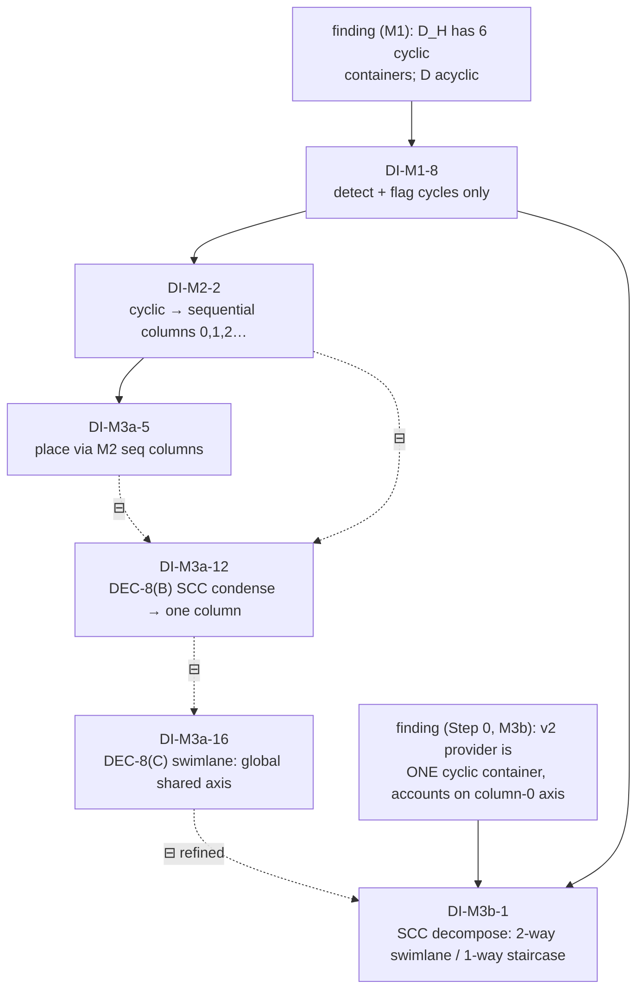

#### Lineage — the iron rule (CON-12)

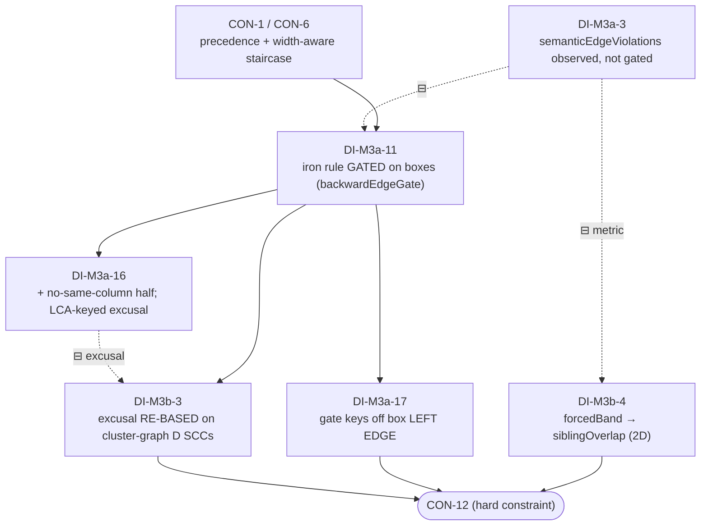

**Worked examples (blast radius).**

- Revert **DI-M3b-1** (stop SCC-decomposing) → its dependents **DI-M3b-2/3/4/5/6 all collapse**, and placement falls back to **DI-M3a-16** (global dissolve): v2's column-0 Y-stack returns (−12%/−6% lost) and **DI-M3b-3**'s re-based gate is moot, so **CON-12** loses its honest verifier on real data.
- Change the **Step-0 finding** (a future preset's provider is _not_ one cyclic container) → by DOC-4, re-evaluate **DI-M3b-1** and everything below it; the swimlane/staircase split may no longer be the right shape.
- **DI-M3b-3** (gate re-base) is load-bearing for **CON-12** _independent_ of the placement: even if the geometry changed again, the gate MUST key off cluster-graph `D` SCCs or it goes blind once most edges sit under a cyclic container.

---

## 35. Test fixture matrix

Synthetic minimal fixtures (fast, no preset DB) exercise one behavior each; the real preset is the integration backstop. Each asserts the named invariant/metric.

| Fixture | Exercises | Asserts | Edge case |
| --- | --- | --- | --- |
| `fanout-column` | one source → 3 targets | targets share a column (T4); rate 100 % | §26 fan-out |
| `hub-centering` | hub over even/odd fan-out | hub Y within ε of median (T5) | DEC-2/DEC-6 |
| `forced-bands` | 2 regions, 1 account | distinct Y bands; containment | CON-5 |
| `staircase` | hull A→B dependency | B deeper than A; (DEC-1) Y-overlap behavior | CON-6 |
| `cross-hull-fanout` | root → 3 accounts | LCA centering; spine aligned | DEC-2 |
| `cycle` | A→B→A | localized fallback; `pipeline_cycle`; no global flatten | CON-2/DEC-8 |
| `disconnected` | 2 components | both placed; order by firstSequence | §26 disconnected |
| `missing-topology` | cluster w/o account | `unknown` bucket; no invented topology | A2/CON-7 |
| `huge-fanout` | 1 → N>threshold | grid-wrap; no runaway column | DEC-7 |
| `deep-chain` | 30-hop linear | width accepted; no false compaction | §26 deep chain |
| `degenerate-no-depth` | nodes, no depth-creating edges | single column vertical stack, still valid | §26 |
| `determinism` | any of the above ×2 | byte-identical builds | CON-8/§30 |
| `module-failure` (inject) | force a stage to throw | falls back one rung; `rcllDegraded` set | §27 |
| `staging-extended-localstack-v2` | full integration | gates 0; readability ↑ vs baseline; both Compact & Full | §17 |

Run via the existing `terraformPipeline*` test harness; the determinism and collision gates are wired into the acceptance suite (§13, §17).

---

## 36. Appendix C — Visual glossary

A figure for every concept and every decision, so the whole design can be understood visually. **Structural** diagrams use Mermaid; **geometric** diagrams use ASCII "before/after" sketches that show real relative position. Convention throughout: **X = TFD/column axis, increasing →**; **Y = cross/row axis, increasing ↓**. Captions tie each figure to its section/ID.

### C.1 Structural concepts (Mermaid)

**C.1.1 Compound topology tree** (§6) — the nesting every hull/cluster lives in.

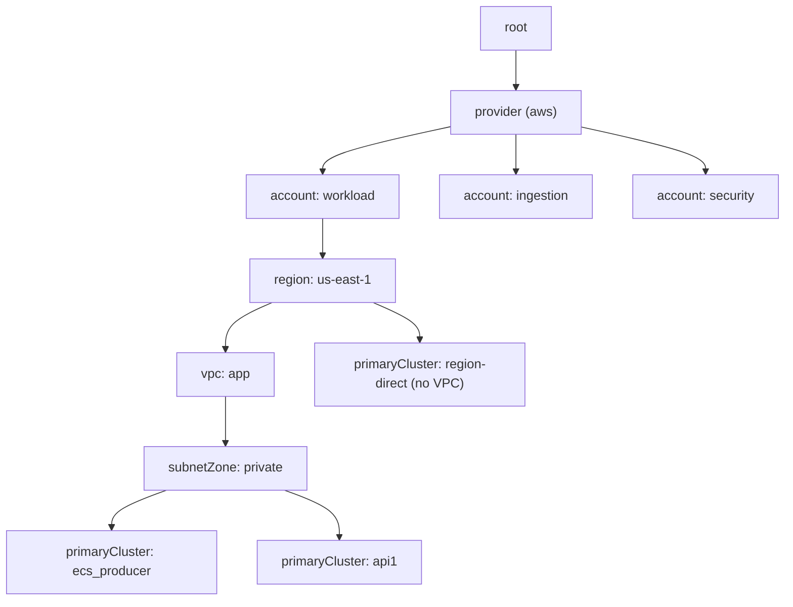

**C.1.2 TFD DAG `D` vs hull-edge up-projection `D_H`** (§6.3) — cluster edges roll up to sibling-hull edges at their LCA container.

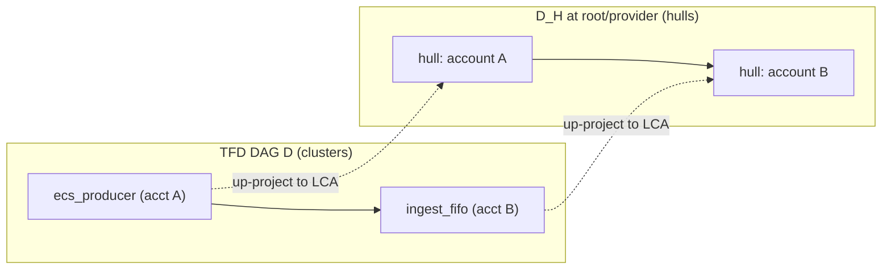

**C.1.3 Fan-out & fan-in sets** (§6, T4/T5) — hubs and convergence nodes.

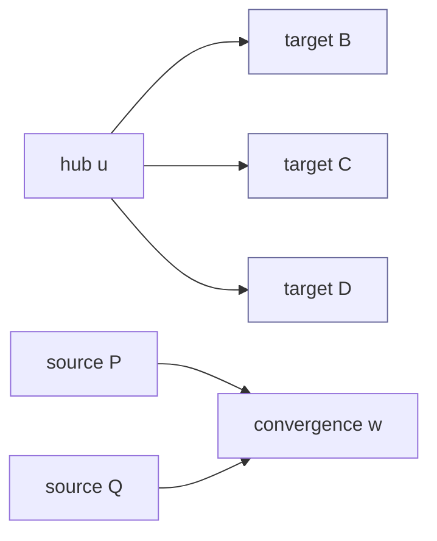

_Fan-out targets B/C/D (shaded) are **pinned** to a shared column (T4); the hub is centered on their median (T5). Sources P/Q are **not** column-forced (FLEX-4), but `w` is centered on them._

**C.1.4 Data model (ER)** (§6.2) — the objects passed between stages.

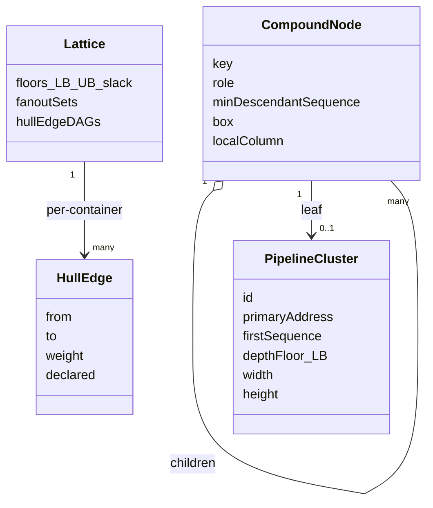

**C.1.5 Decision → stage map** (§22/§24) — which decision tunes which module.

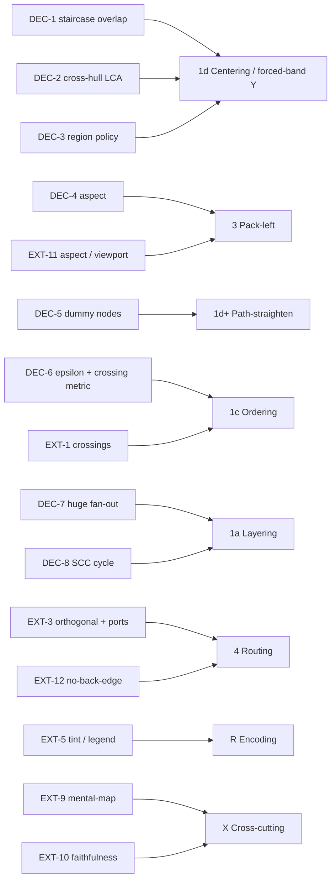

### C.2 Geometric concepts (ASCII before/after)

**C.2.1 Fan-out centering — D7/D8, T5.** Hub centered on the median child, not inline with the first.

```text
  BAD (inline with first child)        GOOD (centered on median)
  A ── B                                      ┌─ B
       C                               A ──────┼─ C
       D                                      └─ D
  (A aligned to B; reads lopsided)     (A centered over B/C/D)
```

**C.2.2 Hull staircase — CON-6 / D6.** A one-way hull→hull edge puts the dependent hull deeper (→) and lower (↓).

```text
   col0        col1
  ┌───────┐
  │ hull A│──────┐
  └───────┘      ▼
              ┌───────┐
              │ hull B│      (A → B  ⇒  B is right of and below A)
              └───────┘
```

**C.2.3 Forced bands vs packed row-share — D2 / D5 / §8.**

```text
  FORCED (each sibling its own band)     PACKED (X-disjoint siblings share a row)
  ┌─ region us-east-1 ───────┐           ┌─ region us-east-1 ─┐ ┌─ region us-west-2 ┐
  │ ...                      │           │ ...                │ │ ...               │
  └──────────────────────────┘          └────────────────────┘ └───────────────────┘
  ┌─ region us-west-2 ───────┐            (side-by-side; shorter)
  │ ...                      │
  └──────────────────────────┘
  (distinct rows; taller, cleanest ownership)
```

**C.2.4 Push-right → row-share — T6 (height ↓).** A _free_ node with slack moves right into an existing row instead of opening a new one.

```text
  BEFORE (free node F at its floor)     AFTER (F pushed right to share a row)
  col0   col1   col2                    col0   col1   col2
  A      B                              A      B      F
  F                                     (F joined row 0; one fewer row)
  (F alone on row 1 → taller)
```

**C.2.5 Pack-left — T7 (width ↓), fan-out group moves as a unit.**

```text
  BEFORE (slack on the left)            AFTER (pulled left, group intact)
  col0        col2   col3               col0   col1   col2
  A                  ┌B                  A      ┌B
                     │C                         │C
                     └D                         └D
  (gap at col1; too wide)               (B/C/D kept its shared column + centering)
```

**C.2.6 Hybrid columns — D3 / §11.** Spine columns align globally; columns inside an account are local.

```text
  GLOBAL spine grid:   col0      col1        col2
                       root ──> account ──> account ...   (aligned across whole diagram)
  LOCAL inside acctA:  [ hop0  hop1  hop2 ]  (its own column origins)
  LOCAL inside acctB:  [ hop0 hop1 ]         (need not match acctA's hop X)
```

**C.2.7 DEC-1 — forced-band Y-overlap on a staircase.**

```text
  OPTION A (no overlap; taller)         OPTION B (recommended; X-disjoint may rise)
  ┌A┐                                   ┌A┐ ┌B┐
  └─┘                                   └─┘ └─┘   (B rose beside A; shorter)
      ┌B┐
      └─┘
```

**C.2.8 DEC-2 — cross-hull fan-out at the LCA.** Hub centers on child-hull medians, clamped to its band.

```text
  org_root ─┬─> [account: workload ]
            ├─> [account: ingestion]   (hub centered on the 3 hull centers,
            └─> [account: security ]    evaluated at the LCA = provider/root)
```

**C.2.9 DEC-7 — huge fan-out.**

```text
  OPTION A (one tall column)            OPTION B (grid-wrap past N)
  u ─ t1                                u ─ t1 t5 t9
      t2                                    t2 t6 t10
      t3   ... (200 rows)                   t3 t7 t11
      tN                                    t4 t8 ...   (bounded height)
```

### C.3 Decision cards

Every decision is represented. Open decisions show **A vs B**; settled decisions (D-series) and extras (EXT-series) show the chosen behavior. Figures are reused where one drawing covers several IDs.

**C.3.1 Open decisions (DEC-1…DEC-8)**

| ID | Figure | One-line |
| --- | --- | --- |
| DEC-1 | C.2.7 | Forced-band staircase: no-overlap (A) vs rise-beside (B, rec). |
| DEC-2 | C.2.8 | Cross-hull fan-out centered at the LCA. |
| DEC-3 | C.2.3 | Region **forced** (taller, cleanest) vs **packed** (shorter). |
| DEC-4 | below | Aspect target: `height-first` \| `ratio` \| `viewport`. |
| DEC-5 | below | Dummy nodes for column-skipping edges: off (v1) vs on (straighter). |
| DEC-6 | C.1.5 | ε tolerance + polyline-aware crossing counter (feeds 1c). |
| DEC-7 | C.2.9 | Huge fan-out: tall column (A) vs grid-wrap past N (B, rec). |
| DEC-8 | below | SCC cycle: break with back-edge vs model-order stack (rec). |

```text
DEC-4 aspect modes:
  height-first → [tall? then pull width]      ratio 16:9 → [ ■■■■■ ]      viewport → fit screen box

DEC-5 dummy nodes (edge skips col1):
  OFF:  A ─────────────▶ C   (diagonal over col1)
  ON:   A ─▶ (•) ─▶ C        (• = dummy in col1 ⇒ straight, costs an element)

DEC-8 cycle A→B→A:
  BREAK:  A ─▶ B ╌╌▶ A   (one visible back-edge)
  STACK:  [ A  B ]  one shared column band, model order  (recommended; no back-edge)
```

**C.3.2 Settled decisions (D1…D12)**

| ID | Figure | Decision (settled) |
| --- | --- | --- |
| D1 | — (process) | Report-first; rollout at review. |
| D2 | C.2.3 | Forced sibling bands (no X-share) at chosen levels. |
| D3 | C.2.6 | Hybrid columns: global spine, local below. |
| D4 | C.2.4 + C.2.5 | Push free right (height), then pack left (width). |
| D5 | C.2.3 | Forced + packed policy split by level. |
| D6 | C.2.2 | Per-level forced toggle; hull→hull dep ⇒ deeper/right. |
| D7 | C.2.9 / C.1.3 | Fan-out shares a column even if taller. |
| D8 | C.2.1 | Center on median both ways; column-force fan-out only. |
| D9 | C.3.3 | Readability senior to compaction; groups move as units; recursive to hulls. |
| D10 | C.1.5 + §22 fig | Modular Lego; the lattice is the module contract. |
| D11 | §24 fig | Build order M0–M12 behind the flag. |
| D12 | §27 fig | Robustness contract + fallback ladder. |

**C.3.3 The priority lattice (T1…T7)** — the senior→junior order that D9 encodes (also inline at §5).

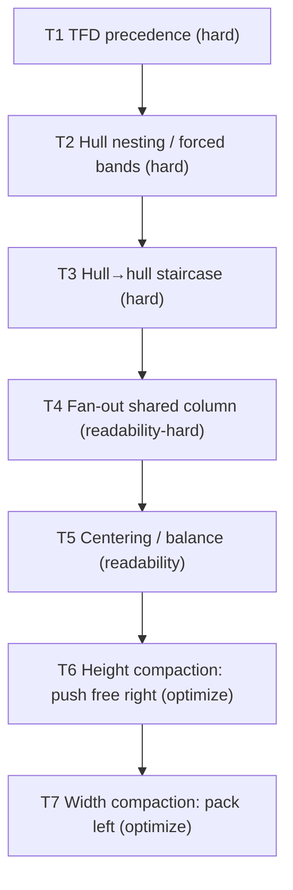

_Read top→down as "senior to": a lower tier may optimize only within the freedom the tiers above leave; it must never violate a higher one. This single rule is the module contract (D10)._

**C.3.4 Optional extras (EXT-1…EXT-12)** — on/off or before/after for each.

```text
EXT-1  crossings      X X   →   ⫝ ⫝   (untangle; #1 readability factor)
EXT-2  path-straight  zig-zag spine  →  ──────── straight spine
EXT-3  orthogonal     ╲ diagonal     →  └─┐ right-angle + ports (src-right→tgt-left)
EXT-4  bundling       ╳╳╳ many lines →  ═══ one bundle (cross-hull only)
EXT-5  tint+legend    plain hulls    →  shaded by account + [legend]
EXT-6  salience       flat strokes   →  heavy spine, dim periphery, hover-path
EXT-7  grid-snap      jittery gaps   →  even grid, uniform combs
EXT-8  LOD/expand     all open       →  [collapsed] → click → [expanded]
EXT-9  mental-map     expand overlaps→  neighbors pushed minimally (stable)
EXT-10 faithfulness   accidental row →  guarded: geometry == real clusters
EXT-11 aspect/view    very tall      →  fit toward target ratio
EXT-12 no-back-edge   A◀──B (up-left)→  A──▶B (always forward)
```

_Defaults per §23.3: on by default — EXT-1, EXT-5, EXT-9, EXT-10, EXT-12 (and EXT-6 partial); toggle — EXT-3; off until proven — EXT-2, EXT-4, EXT-7; EXT-8 already largely present; EXT-11 target per DEC-4._

---

_End of RFC 0.5. This document is the agreed source of truth for the RCLL design discussion; amend via the change log._
