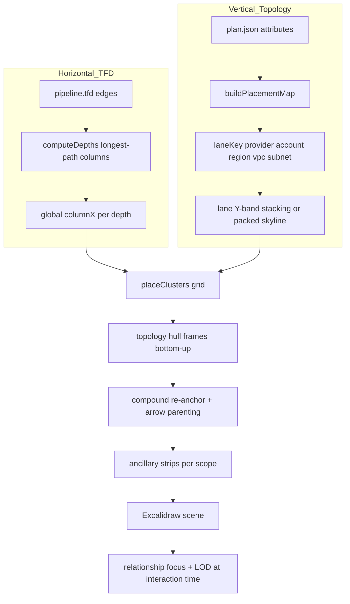

# Pipeline semantic placement — agent handoff

Copy this document (or link it) into another agent session to direct a **deep research mission** on Terraform pipeline layout semantics. The goal is to understand how resources are placed within the **nested topology hierarchy** and the **TFD hop hierarchy**, then identify concrete ways to improve **semantic clarity**, **canvas coherence**, and **relationship salience**.

This is a **research-first** handoff. You are not asked to implement layout changes unless explicitly requested later. You may recommend changes at any layer: layout code, packing policy, `.tfd` authoring, topology framing, satellite slots, or runtime focus behavior.

**Related docs (read as needed, do not duplicate their content here):**

| Doc | Scope |
| --- | --- |
| [staging-extended-localstack-v2-pipeline-handoff.md](./staging-extended-localstack-v2-pipeline-handoff.md) | v2 preset export, TFD binds, multi-account model |
| [terraform-pipeline-import-agent-guide.md](./terraform-pipeline-import-agent-guide.md) | Four pipeline toggles, import flow |
| [pipeline-compound-layout-agent-handoff.md](./pipeline-compound-layout-agent-handoff.md) | Compound algorithm phases + invariants |
| [pipeline-layout-improvement-agent-prompt.md](./pipeline-layout-improvement-agent-prompt.md) | Height/column-slack optimization (narrower scope) |
| [pipeline-rag-queries.md](./pipeline-rag-queries.md) | RAG query pack mapped to code modules |
| [REGION_SUBNET_VERTICAL_BANDS_PLAN.md](../REGION_SUBNET_VERTICAL_BANDS_PLAN.md) | Planned packing policy for region/subnet isolation |

---

## Mission

### Primary objective

Semantically place resources within:

1. **Nested topology hierarchy** — provider → account → region → VPC → subnet zone
2. **TFD hop hierarchy** — declared dataflow columns from `pipeline.tfd` `->` edges

…so that **relationships read clearly** on the canvas without the viewer having to trace every arrow.

### Secondary objective

Identify concrete improvements to semantics — layout algorithm, packing policy, `.tfd` edge ordering, topology framing, ancillary placement, satellite slot conventions, or runtime salience — **without breaking declared dataflow invariants**.

### Non-goals

- Do **not** optimize for height alone. Shorter diagrams that hide or mis-order relationships are failures.
- Do **not** simplify visual semantics to make layout easier. See [terraform-canvas-deep-architecture-handoff.md](./terraform-canvas-deep-architecture-handoff.md) (visual parity constraint for focus/dimming).
- Do **not** replace pipeline view with full ELK runtime unless explicitly asked. Ideas from ELK literature are in scope; embedding ELK is not required.

### Vocabulary (mission terms → code)

These terms are not used literally in source code but define what this mission cares about:

| Term | Maps to in code/docs |
| --- | --- |
| **Semantics** | TFD hop order (`computeDepths`, `DECLARED_DATAFLOW_ORDERED_KEY`) + truthful topology placement (`buildPlacementMap`) + frame ancestry (`terraformTopologyRole`, `terraformTopologyPath`) |
| **Coherence** | Compound group-drag (arrow parenting to LCA topology frame), consistent global TFD columns across lanes, hull frames that do not fight cluster positions |
| **Salience** | Which relationships dominate visually: TFD declared-dataflow arrows, sibling topology frame edges, hover focus dimming (`terraformRelationshipFocus.ts`), edge layering, ancillary vs dataflow distinction |

---

## Canonical study configuration

Study **one stress configuration** first. All semantic audit questions below assume this baseline unless you are explicitly contrasting toggles.

| Toggle | UI label | Required value | Why |
| --- | --- | --- | --- |
| Preset | — | `staging-extended-localstack-v2` | Multi-account org lanes + extended platform; largest single-plan parity target |
| Detail | Detail | **Full** (`pipelineCompact: false`) | All satellite slots inline — richest semantic surface |
| Layout | Layout | **Compound** (`pipelineLayoutVariant: "compound"`) | Nested frames + arrow parenting; tests group-drag coherence |
| Height | Height | **Packed + pull-left** (`pipelinePacked: true`, `pipelinePackedPullLeft: true`) | Most aggressive cross-lane compaction; reveals semantic tension |
| Resources | Resources | **All resources** (`pipelineIncludeAncillary: true`) | Unconnected ancillary strips per VPC/region |

### Reproduction

**Browser (partial — Full is not in demo URL):**

```bash
yarn seed:terraform-presets   # if dev DB stale
yarn start                    # not yarn build:preview — preset API required
```

Open:

```text
/demo?preset=staging-extended-localstack-v2&view=pipeline&pipelineVariant=compound&packedPullLeft=1&ancillary=1
```

Then in the import dialog: **Detail → Full**.

Or: Import Terraform → Staging Extended LocalStack v2 → Pipeline → set all five toggles manually.

**Programmatic / Vitest (full control):**

```ts
import { getTerraformImportPresetSourcesFromDb } from "../../../excalidraw-app/dev/terraformImportPresetDb.mjs";
import { layoutTerraformViaWorkers } from "./terraformLayoutWorkerClient";

const sources = getTerraformImportPresetSourcesFromDb(
  "staging-extended-localstack-v2",
);

const scene = await layoutTerraformViaWorkers(sources, {
  semanticLayout: false,
  layoutMode: "pipeline",
  pipelineLayoutVariant: "compound",
  pipelineCompact: false,
  pipelinePacked: true,
  pipelinePackedPullLeft: true,
  pipelineIncludeAncillary: true,
});
```

**Contrast runs (required):** Also import the same preset with defaults (Compact + Classic + Stacked + Dataflow only) and with single-toggle changes so you can attribute semantic effects to each dimension. See the combination matrix in [terraform-pipeline-import-agent-guide.md](./terraform-pipeline-import-agent-guide.md).

---

## Mental model

Pipeline layout combines **two independent axes**. Do not conflate them.

```text
┌─────────────────────────────────────────────────────────────┐
│  HORIZONTAL (TFD)          │  VERTICAL (topology)          │
│  computeDepths on .tfd       │  laneKey from placement map   │
│  → column index per cluster │  → stacked/packed Y bands     │
│  A -> B ⇒ B right of A      │  account/region/VPC/subnet    │
└─────────────────────────────────────────────────────────────┘
```

**Design principle:** resource positions are computed on a **global TFD grid** first; topology frames are **hulls drawn around** already-placed clusters (not preset boxes that constrain placement).



---

## Deep-read curriculum

Complete this reading list **before** proposing changes. Skipping straight to code edits produces shallow recommendations.

### A. Preset + TFD semantics (~2–3 hours)

1. [staging-extended-localstack-v2-pipeline-handoff.md](./staging-extended-localstack-v2-pipeline-handoff.md) — org lanes, bind prefix `staging-extended-localstack-v2::`, `pipeline.tfd` structure (especially lines 230–287: org/account entry points)
2. `packages/backend/terraform/staging-extended-localstack-v2/pipeline.tfd` — on disk after hydrate, or from preset SQLite DB / test fixture
3. [`terraformDeclaredDataFlow.ts`](../packages/excalidraw/components/terraformDeclaredDataFlow.ts) — bind resolution, hop sentinels, cycle/orphan validation

**Key v2 TFD spine to trace visually:**

- `organization_root → workloads_ou, data_platform_ou, security_ou`
- OU → account entry: `workload_account`, `ingestion_account`, `security_account`
- Account fan-out: workload trunk/APIs, ingestion lake/streams/EKS, security audit/observability

### B. Layout algorithm (core)

4. [terraform-pipeline-import-agent-guide.md](./terraform-pipeline-import-agent-guide.md) — four toggles, phase order, two-axis model
5. [`terraformPipelineLayoutShared.ts`](../packages/excalidraw/components/terraformPipelineLayoutShared.ts) — `preparePipelineLayout`, `computeDepths`, `laneKey`, `placeClustersClassicGrid`, constants (`PIPELINE_LANE_GAP_Y`, `PIPELINE_COLUMN_GAP`, etc.)
6. [`terraformPipelineLayoutPacked.ts`](../packages/excalidraw/components/terraformPipelineLayoutPacked.ts) — `computePackedDepthShifts`, skyline packing, `computePackedPullLeftShifts`
7. [`terraformPipelineLayoutCompound.ts`](../packages/excalidraw/components/terraformPipelineLayoutCompound.ts) + [`terraformPipelineLayoutCompoundHierarchy.ts`](../packages/excalidraw/components/terraformPipelineLayoutCompoundHierarchy.ts) — re-anchor, `terraformCompoundLocal`, arrow LCA parenting
8. [`terraformPipelineLayoutAncillary.ts`](../packages/excalidraw/components/terraformPipelineLayoutAncillary.ts) — `collectAncillaryAddresses`, per-scope unconnected strips
9. [`terraformPipelineLayoutExpand.ts`](../packages/excalidraw/components/terraformPipelineLayoutExpand.ts) — expand/collapse without relayout (overlap tradeoff)

### C. Topology truth + satellite semantics

10. [`terraformTopologyPlacementBuild.ts`](../packages/excalidraw/components/terraformTopologyPlacementBuild.ts) — `buildEnrichedTopologyPlacements`, `topologyAddressPlacementMap`
11. [`packages/excalidraw/assets/terraform-topology-primary-layouts/`](../packages/excalidraw/assets/terraform-topology-primary-layouts/) — per-primary-type JSON slot configs (tiers, anchors, satellite kinds). Full pipeline mode uses `buildTopologyPrimaryClusterSkeletonForPipeline`; compare to Semantic view placement.
12. [REGION_SUBNET_VERTICAL_BANDS_PLAN.md](../REGION_SUBNET_VERTICAL_BANDS_PLAN.md) — planned role-aware packing (forced vertical bands for provider/account/region/subnet). Assess whether current packed behavior violates this intent.

### D. Canvas runtime (relationship salience)

13. [`terraformRelationshipFocus.ts`](../packages/excalidraw/components/terraformRelationshipFocus.ts) — hover dimming levels (`TERRAFORM_RELATED_LEVEL`, ambient edge level)
14. [`terraformPipelineLayoutFinalize.ts`](../packages/excalidraw/components/terraformPipelineLayoutFinalize.ts) — `customData.relationship` on TFD arrows (`source`, `target`, `sequence`, `parentFrameId`)
15. [excalidraw-canvas-architecture.md](./excalidraw-canvas-architecture.md) — element counts (pipeline ~1.1k vs semantic ~9k), LOD, focus cost

---

## Literature research (graph-layout-rag + web)

### Local RAG (required)

1. Read skill: [`.agents/skills/graph-layout-rag/SKILL.md`](../.agents/skills/graph-layout-rag/SKILL.md)
2. Read query pack: [pipeline-rag-queries.md](./pipeline-rag-queries.md)
3. Run queries from repo root:

```bash
cd tools/graph-layout-rag && uv sync
yarn graph-rag:query "<query>" --category <slug> --pdf-only --top 8 --json
```

4. **Deep-read** at least one paper per relevant category via `doc_id` + manifest `localPath` (skill section “Reading full papers”). Query excerpts are ~400 chars — insufficient for algorithm design.

**Starter queries:**

```bash
yarn graph-rag:query "network simplex rank assignment layered digraph" --category layer-assignment --pdf-only --json
yarn graph-rag:query "compound directed graph layout global ranking cluster borders" --category compound --pdf-only --json
yarn graph-rag:query "skyline strip packing bottom-left heuristic" --category packing --pdf-only --json
yarn graph-rag:query "VPSC separation constraints cluster containment" --category constraints --pdf-only --json
yarn graph-rag:query "layout adjustment mental map overlap removal" --category overlap --pdf-only --json
yarn graph-rag:query "sifting k-layer straightline crossing minimization" --category crossing --pdf-only --json
yarn graph-rag:query "left edge algorithm channel routing track assignment" --category routing --pdf-only --json
```

### Research threads → code hooks

| Research thread | RAG category | Code hook | Question for you |
| --- | --- | --- | --- |
| Hop column assignment | `layer-assignment` | `computeDepths` | Is longest-path depth optimal for semantic reading order, or should slack/reassignment improve salience? |
| Compound/nested graphs | `compound` | hull frames + compound hierarchy | Do clustered level-graph papers suggest different parent-child placement than bottom-up hulls? |
| Cross-lane packing | `packing`, `compaction` | `terraformPipelineLayoutPacked.ts` | When is vertical sharing semantically safe vs when does it hide account/region boundaries? |
| Separation / overlap | `constraints`, `overlap` | frame padding, expand overlap | How to preserve mental map when packing aggressively? |
| Within-column ordering | `crossing`, `coordinate-assignment` | fan-out same-column sharing | Can crossing reduction improve TFD arrow readability? |
| Edge routing | `routing` | elbow arrows, sibling frame edges | Does channel assignment literature apply to dense multi-lane scenes? |

### Web research (when RAG is insufficient)

Search and cite primary sources for: Graphviz dot rank assignment (TSE93), ELK layered compound layout, Sugiyama framework surveys, dagre, Mermaid/ELK port constraints, IPSep-CoLa / VPSC separation constraints, PRISM / mental-map layout adjustment.

Map each source to a specific code module or open question. Do not treat blog posts as authoritative without tracing to papers.

---

## Semantic audit checklist

Answer every section below for the **canonical configuration** on `staging-extended-localstack-v2`. Support answers with screenshots, bounding-box metrics, Vitest console output, or specific element/frame IDs.

### TFD hierarchy

- Does the org → OU → account spine read as the intended entry before workload/ingestion/security fan-out?
- Are deep-hop resources (lake tiers, Kinesis, EKS, Glue, regional persistence, CloudTrail, Config, ops alarms) discoverable without tracing every arrow?
- Does pull-left place clusters in columns that **look** earlier in the flow but are semantically downstream (salience confusion)?
- Do fan-out targets from the same source share a column appropriately, or does packing obscure which branch is which?

### Topology hierarchy

- Are the four accounts (management, workload, ingestion, security) visually separable?
- Do org-management resources compete visually with workload lanes?
- In **Full** mode, do satellite slots (IAM, SG, CloudWatch, KMS, etc.) reinforce or clutter the primary dataflow story?
- Does packed skyline interleave regions or subnets in ways that violate [REGION_SUBNET_VERTICAL_BANDS_PLAN.md](../REGION_SUBNET_VERTICAL_BANDS_PLAN.md) intent?
- Do topology hull frames (account/region/VPC/subnet) align with cluster positions, or do padding/title boxes create false boundaries?

### Ancillary / all-resources

- Where do unconnected strips land relative to their VPC/region frames?
- Do ancillary cards dilute TFD arrow salience?
- Are ancillary resources semantically grouped (by type, by module, by tag) or only by topology scope?

### Coherence at interaction time

- **Compound drag:** drag a region or VPC frame — do in-group TFD arrows move coherently with resources?
- **Hover focus:** does dimming surface the right relationship neighborhood for multi-hop paths (org → account → trunk → API → datastore)?
- **Expand (contrast run):** in Compact mode, expand a cluster — where does overlap break coherence? Is that acceptable?

### Automated diagnostics

Run before writing findings:

```bash
# Lane height / column count diagnostic
VITEST_TERRAFORM_VERBOSE=1 yarn vitest run \
  packages/excalidraw/components/terraformPipelineLaneDebug.test.ts \
  -t "staging-extended-localstack-v2"

# Packed + pull-left regression
yarn vitest run packages/excalidraw/components/terraformPipelineLayoutPacked.test.ts \
  -t "staging-extended-localstack-v2"

# TFD bind resolution smoke
yarn vitest run packages/excalidraw/components/terraformPipelineTfdBind.test.ts \
  -t "staging-extended-localstack-v2"

# Catalog / preset presence
yarn vitest run packages/excalidraw/components/terraformImportPresets.test.ts
```

Record: `pipelineColumnCount`, lane count, scene bounding box (width × height), collision/overlap observations if you add diagnostic helpers.

---

## Improvement design space (in scope)

You may recommend changes at **any** of these layers. Tag each recommendation accordingly.

| Layer | Tag | Examples |
| --- | --- | --- |
| Layout algorithm | `layout` | Role-aware packing (region/subnet bands), column reassignment with slack, within-column barycenter ordering, ancillary strip placement policy |
| `.tfd` authoring | `tfd` | Re-order hops, split/merge binds, intermediate semantic waypoints, org-spine restructuring on v2 |
| Topology framing | `topology` | Frame padding, title placement, sibling connector edges, hull vs container semantics |
| Full-mode satellite slots | `layout` / `preset` | Borrow/adapt semantic-view JSON slot configs for pipeline Full clusters |
| Runtime salience | `runtime` | Relationship focus weights, edge layering, LOD thresholds — only if layout cannot solve readability |
| Preset Terraform | `preset` | Module grouping, resource naming, tags that affect placement map or lane identity |

### Hard invariants (do not violate)

1. **TFD required:** ≥1 resolved `.tfd` dataflow edge or import fails with 400.
2. **Hop order:** If `A -> B` in TFD, `B` must not be left of `A` (same column allowed for documented fan-out cases — see `terraformPipelineLayout.test.ts`).
3. **Topology truth:** Placement from `buildPlacementMap` / plan attributes — no fabricated region or account assignment.
4. **Compound group-drag:** In Compound mode, in-group TFD arrows must remain parented to LCA topology frames.
5. **Determinism:** Repeated imports with same inputs produce same layout (stable sort keys: `firstSequence`, `id`, topology keys).

---

## Expected deliverable

Produce a **semantic audit report** (markdown). Research-first; code changes only if explicitly requested afterward.

### Required sections

1. **Executive summary** — top 3 semantic wins and top 3 failures on the canonical config
2. **Configuration matrix** — what each toggle changed (Full vs Compact, Compound vs Classic, Packed vs Stacked, Ancillary vs Dataflow-only)
3. **Literature synthesis** — 5–10 cited papers/posts, each mapped to a specific code module or open question
4. **Findings** — answers to every checklist section above, with evidence
5. **Recommendations** — prioritized list; each tagged `layout` | `tfd` | `topology` | `runtime` | `preset`; include tradeoffs and invariant risks
6. **Open questions** — what you could not resolve without user input or A/B prototypes

### Optional (only if asked later)

- Implementation PR sketch
- Vitest assertions for new invariants
- `.tfd` diff proposal for v2 org spine

---

## Quick reference

### Preset commands

```bash
yarn seed:terraform-presets
yarn hydrate:terraform-preset staging-extended-localstack-v2
yarn export:terraform-presets-test-db
yarn benchmark:terraform-canvas   # default: compound + packedPullLeft + ancillary on v2
```

LocalStack re-export (when plan/dot/tfd drift):

```bash
cd packages/backend/terraform/staging-extended-localstack-v2
./scripts/start-localstack.sh    # port 4568
./scripts/apply-and-export.sh
yarn hydrate:terraform-preset staging-extended-localstack-v2
```

### Key source files

| Area | Path |
| --- | --- |
| Layout router | `packages/excalidraw/components/terraformLayoutCore.ts` |
| Shared prep + grid | `packages/excalidraw/components/terraformPipelineLayoutShared.ts` |
| Classic builder | `packages/excalidraw/components/terraformPipelineLayout.ts` |
| Compound builder | `packages/excalidraw/components/terraformPipelineLayoutCompound.ts` |
| Packed passes | `packages/excalidraw/components/terraformPipelineLayoutPacked.ts` |
| Topology hulls | `packages/excalidraw/components/terraformPipelineTopologyFrames.ts` |
| TFD overlay | `packages/excalidraw/components/terraformDeclaredDataFlow.ts` |
| Ancillary strips | `packages/excalidraw/components/terraformPipelineLayoutAncillary.ts` |
| Relationship focus | `packages/excalidraw/components/terraformRelationshipFocus.ts` |
| Satellite slot JSON | `packages/excalidraw/assets/terraform-topology-primary-layouts/` |
| v2 Terraform root | `packages/backend/terraform/staging-extended-localstack-v2/` |
| v2 pipeline.tfd | `.../staging-extended-localstack-v2/pipeline.tfd` |
| Test fixture DB | `packages/excalidraw/test-fixtures/terraform-import-presets.db` |

### Demo URLs

```text
# Canonical partial (toggle Full in dialog)
/demo?preset=staging-extended-localstack-v2&view=pipeline&pipelineVariant=compound&packedPullLeft=1&ancillary=1

# Defaults baseline for contrast
/demo?preset=staging-extended-localstack-v2&view=pipeline
```

### RAG + repo search

| Tool | Command / path |
| --- | --- |
| Graph layout RAG skill | `.agents/skills/graph-layout-rag/SKILL.md` |
| Query | `yarn graph-rag:query "…" --top 8 --json` |
| Repo code RAG skill | `.agents/skills/repo-rag/SKILL.md` |
| Pipeline query pack | `docs/pipeline-rag-queries.md` |

---

## Suggested workflow (summary)

1. **Reproduce** canonical config in browser + programmatic layout.
2. **Contrast** default toggles to isolate semantic effects.
3. **Read** curriculum sections A–D in order.
4. **Run** Vitest diagnostics; record metrics.
5. **Query** graph-layout-rag; deep-read papers for 2–3 highest-impact threads.
6. **Web search** gaps RAG does not cover; cite sources.
7. **Audit** using checklist; capture evidence.
8. **Write** deliverable report with tagged, prioritized recommendations.

Do not skip steps 3–6 and jump to code changes. The value of this mission is a literature-grounded semantic audit, not a quick layout tweak.
