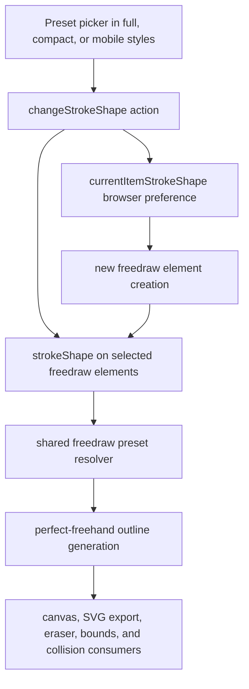

# feat: Add freedraw brush personalities

## Summary

Add five named freedraw presets to Excalidraw's existing pencil tool. Each stroke stores its chosen preset, renders through one shared preset resolver, and uses real pressure for pen input while preserving today's rendering for legacy drawings.

---

## Problem Frame

Every freedraw element currently passes the same hardcoded `perfect-freehand` options from `packages/element/src/shape.ts`. The editor already exposes a dormant `changeStrokeShape` action slot in the selected-shape panel, so the missing work is a typed element property, a registered style action, preset previews, and consistent rendering across the editor's existing geometry consumers.

The feature must deepen the pencil without adding another toolbar tool or a modal workflow. Existing `.excalidraw` files must retain their current appearance.

---

## Requirements

### Preset behavior

- R1. The freedraw style controls offer Pencil, Marker, Brush, Technical, and Calligraphy presets with distinct, recognizable stroke previews.
- R2. Pencil preserves today's balanced pressure response; Marker is broad and nearly uniform; Brush is pressure-sensitive with tapered ends; Technical is crisp and uniform with no thinning; Calligraphy has the strongest width contrast and expressive tapering.
- R3. Choosing a preset changes future freedraw strokes and updates selected freedraw elements through the normal undoable style-action path.
- R4. Preset changes affect only freedraw elements when a mixed selection is active.
- R5. The current preset preference persists in browser state but is not exported as document app state.

### Rendering and compatibility

- R6. Every freedraw element stores its preset so canvas rendering, SVG export, erasing, collision checks, and later sessions use the same geometry.
- R7. Freedraw elements without a preset restore as Pencil and render with the exact option profile used before this feature.
- R8. Pen pointer events record real pressure even when the initial pressure is `0.5`; mouse and touch input continue to use simulated pressure.
- R9. Preset definitions have one typed source of truth for names and `perfect-freehand` options.

### Interface quality

- R10. The controls appear in full, compact, and mobile style surfaces whenever the pencil is active or a freedraw element is selected.
- R11. Every preset control has a localized accessible label, visible selected state, and a stable test identifier.

---

## Assumptions

- The existing `changeStrokeShape` action name and panel call are intentional extension points for this feature.
- A dedicated `strokeShape` field on `ExcalidrawFreeDrawElement` is preferable to `customData` because rendering and restoration require a stable, typed public contract.
- Preset parameter tuning may change during visual verification, but the five names and Pencil's backward-compatible profile are fixed.
- Pressure-sensitive behavior is keyed to `PointerEvent.pointerType === "pen"`; non-pen input keeps velocity-based simulation.

---

## Key Technical Decisions

- **Keep one pencil tool:** Presets are style choices inside the existing freedraw workflow, preserving Excalidraw's toolbar simplicity.
- **Persist the semantic preset, not raw options:** Elements store a small preset identifier while a central resolver owns the rendering parameters. This keeps files readable and lets implementation details evolve deliberately.
- **Make Pencil the compatibility default:** Missing or invalid preset values resolve to the current hardcoded configuration, so old drawings do not visually migrate.
- **Use existing action infrastructure:** The new action follows stroke width and stroke style patterns for app-state defaults, selection updates, undo capture, mixed-value controls, and panel rendering.
- **Use pointer type for pressure mode:** Pen input always records pressure samples. Mouse and touch retain simulated pressure to avoid depending on their browser-default pressure values.

---

## High-Level Technical Design

The element-layer resolver is authoritative. UI previews communicate each personality but do not define rendering behavior independently.

---

## Scope Boundaries

### In scope

- Five built-in presets and their previews.
- Editing the preset on existing freedraw selections.
- Browser persistence for the current preset.
- Backward-compatible element restoration.
- Correct pen-pressure capture and focused tests.

### Deferred to Follow-Up Work

- User-authored presets, numeric advanced controls, or import/export of preset packs.
- Stylus tilt, azimuth, barrel-button, or nib-angle modeling.
- A new brush engine or a dependency upgrade beyond the repository's current `perfect-freehand` version.

### Out of scope

- New toolbar tools or new persisted element types.
- Changes to line, arrow, laser, lasso, or eraser personalities.
- Rewriting historical freedraw elements with a non-Pencil preset.

---

## Implementation Units

### U1. Define the freedraw preset contract

- **Goal:** Introduce the typed preset identifier, centralized preset resolver, construction default, and restoration fallback.
- **Requirements:** R6, R7, R9.
- **Dependencies:** None.
- **Files:** `packages/element/src/types.ts`, `packages/element/src/newElement.ts`, `packages/element/src/freedraw.ts`, `packages/element/src/index.ts`, `packages/excalidraw/data/restore.ts`, `packages/element/src/__tests__/freedraw.test.ts`, `packages/excalidraw/tests/data/restore.test.ts`.
- **Approach:** Define the five identifiers in the element layer. Keep Pencil equivalent to the existing `getStroke` option profile. Normalize unknown or missing values to Pencil at construction and restore boundaries.
- **Patterns to follow:** Typed element-specific fields in `packages/element/src/types.ts`; restoration defaults in `packages/excalidraw/data/restore.ts`; focused element helpers exported through `packages/element/src/index.ts`.
- **Test scenarios:**
  - Creating a freedraw element without an explicit preset stores Pencil.
  - Each valid identifier resolves to the named behavior in R2 and a distinct, bounded `perfect-freehand` option profile.
  - Restoring a legacy freedraw payload without `strokeShape` produces Pencil without changing points or pressures.
  - Restoring an unknown preset value falls back to Pencil.
- **Verification:** New and restored elements expose a valid preset, and Pencil produces the same outline coordinates as the pre-feature configuration for a fixed path.

### U2. Route rendering and pen pressure through the preset

- **Goal:** Apply the stored personality to every freedraw outline and reliably capture real stylus pressure.
- **Requirements:** R2, R6, R7, R8, R9.
- **Dependencies:** U1.
- **Files:** `packages/element/src/shape.ts`, `packages/excalidraw/components/App.tsx`, `packages/element/src/__tests__/freedraw.test.ts`, `packages/excalidraw/tests/freedraw.test.tsx`.
- **Approach:** Replace hardcoded outline options with the shared resolver while retaining element stroke width as the user's size multiplier. Determine pressure simulation from pointer type when a stroke begins, then keep the existing pressure-array flow for move and up events.
- **Patterns to follow:** `getFreedrawOutlinePoints()` as the shared geometry entry point; existing pointer lifecycle in `packages/excalidraw/components/App.tsx`.
- **Test scenarios:**
  - A fixed point path produces visibly different outlines for Pencil, Marker, Brush, Technical, and Calligraphy.
  - A legacy/Pencil path matches the prior outline geometry.
  - A pen pointer beginning at pressure `0.5` records pressure instead of enabling simulation.
  - Mouse input enables simulated pressure and does not append physical pressure samples.
  - SVG-path and eraser consumers receive the same preset-derived outline through `getFreedrawOutlinePoints()`.
- **Verification:** Drawing with each preset changes the canvas geometry, pen pressure changes stroke thickness, and existing Pencil strokes remain visually stable.

### U3. Implement the preset style action and controls

- **Goal:** Surface the five personalities through Excalidraw's established property-action system.
- **Requirements:** R1, R2, R3, R4, R5, R10, R11.
- **Dependencies:** U1.
- **Files:** `packages/excalidraw/actions/actionProperties.tsx`, `packages/excalidraw/actions/index.ts`, `packages/excalidraw/appState.ts`, `packages/excalidraw/types.ts`, `packages/excalidraw/components/Actions.tsx`, `packages/excalidraw/components/icons.tsx`, `packages/excalidraw/locales/en.json`, `packages/excalidraw/tests/freedraw.test.tsx`, `packages/excalidraw/tests/data/restore.test.ts`.
- **Approach:** Register `changeStrokeShape`, update only selected freedraw elements, store the current choice in browser-scoped app state, and render a five-option `RadioSelection` using compact stroke-preview icons. Add the action to compact and mobile property groupings as well as the existing full-panel slot.
- **Patterns to follow:** `actionChangeStrokeWidth`, `actionChangeStrokeStyle`, `getFormValue()`, `RadioSelection`, and `APP_STATE_STORAGE_CONF`.
- **Test scenarios:**
  - Activating the pencil shows five labeled preset controls with Pencil selected by default.
  - Selecting Marker updates `currentItemStrokeShape`; the next freedraw element stores Marker.
  - Selecting Brush on an existing freedraw element updates it and creates an undo history entry.
  - Applying Technical to a mixed rectangle/freedraw selection changes only the freedraw element.
  - A mixed freedraw selection with different presets renders no falsely selected option until the user chooses one.
  - Restoring browser app state preserves a valid current preset and defaults an absent value to Pencil.
  - Restoring browser app state with an unknown preset value falls back to Pencil.
  - Compact and mobile property surfaces expose the same action.
- **Verification:** The preset picker is keyboard-accessible, visually selected, responsive across style-panel modes, and changes both current defaults and selected strokes.

### U4. Protect integration contracts and snapshots

- **Goal:** Cover serialization, style editing, and repository-wide compatibility before handoff.
- **Requirements:** R3, R5, R6, R7, R11.
- **Dependencies:** U1, U2, U3.
- **Files:** `packages/excalidraw/tests/freedraw.test.tsx`, `packages/excalidraw/tests/data/restore.test.ts`, affected snapshots under `packages/excalidraw/tests/__snapshots__/` and `packages/excalidraw/tests/data/__snapshots__/`.
- **Approach:** Add focused behavioral assertions first, then update only snapshots whose app-state or freedraw element shape legitimately gains the new property.
- **Patterns to follow:** Test helpers in `packages/excalidraw/tests/helpers/api.ts` and `packages/excalidraw/tests/helpers/ui.ts`; repository guidance in `CLAUDE.md`.
- **Test scenarios:**
  - Local browser state retains `currentItemStrokeShape`, while exported/server app state strips it.
  - Serialized freedraw elements retain `strokeShape` and restore it after a round trip.
  - Undo and redo restore the prior selected-stroke preset.
  - Existing freedraw fixtures without the field continue to restore and render.
  - Action and app-state snapshots change only where the new field is part of the public state.
- **Verification:** Focused tests, type checking, formatting, linting, and the repository test suite pass with reviewed snapshot changes.

---

## Risks & Dependencies

- **Visual presets may feel insufficiently distinct:** Tune against a shared gesture in the running editor while keeping Pencil frozen for compatibility.
- **A new element field expands many snapshots:** Prefer targeted assertions and review snapshot churn for accidental unrelated state changes.
- **Five controls may crowd compact layouts:** Use icon-only controls with tooltips and verify phone-width rendering in the browser.
- **Pressure behavior varies by browser and hardware:** Unit-test pointer semantics and use browser testing for simulated pen events; physical-device nuance remains a follow-up risk.
- **Public element schema compatibility matters:** Restore missing and invalid values defensively, and avoid storing raw library-specific option objects.

---

## Sources & Research

- The supplied ideation artifact ranks Stroke & Pen Presets first and calls for five named presets, per-stroke persistence, real stylus pressure, and no new tool: `https://15974a20.ht-ml.app/#i1`.
- `packages/element/src/shape.ts` currently hardcodes `thinning`, `smoothing`, `streamline`, pressure simulation, and easing in `getFreedrawOutlinePoints()`.
- `packages/excalidraw/components/Actions.tsx` and `packages/excalidraw/actions/types.ts` already reserve the `changeStrokeShape` action name without registering an implementation.
- `packages/excalidraw/components/App.tsx` currently chooses simulated pressure from the initial numeric pressure value rather than pointer type.
- Perfect Freehand's `getStroke` API supports the required preset dimensions through size, thinning, smoothing, streamline, pressure simulation, easing, taper, and cap options: `https://github.com/steveruizok/perfect-freehand/blob/main/README.md`.
