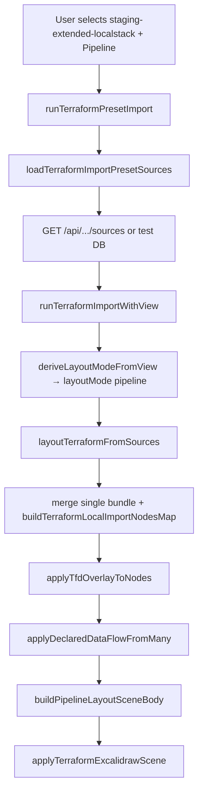

# staging-extended-localstack — agent handoff (pipeline view)

Handoff for another agent working on the **third built-in Terraform import preset**, its **pipeline.tfd** declared dataflow, or **pipeline layout** in tfdraw.dev.

For shared preset DB mechanics, compact fixture format, and the generic import pipeline, see [`terraform-import-presets-agent-handoff.md`](./terraform-import-presets-agent-handoff.md).

---

## What this preset is

| Field | Value |
| --- | --- |
| **Preset ID** | `staging-extended-localstack` |
| **Display name** | Staging Extended LocalStack |
| **Terraform root** | `packages/backend/terraform/staging-extended-localstack/` |
| **Stack model** | **Single root** (same as `staging-localstack`, not multi-state) |
| **Default view** | `pipeline` |
| **Submodule** | Lives in `packages/backend/terraform` git submodule (`main`) |

**Purpose:** A large **render-first** LocalStack staging stack that extends the base `staging-localstack` topology with extra platform lanes:

- Multi-region API ingestion (api1–api16, same fanout pattern as base localstack)
- **Lake + streams:** S3 lake tiers, Kinesis (provisioned + on-demand), Firehose, SNS event bus, FIFO/standard SQS variants
- **EKS processing:** `aws_eks_cluster.stream_processors`, node groups, Fargate profiles, IRSA roles, addons
- **Regional persistence:** cross-region writers, DynamoDB/RDS/Aurora replicas
- **Security / audit / observability:** CloudTrail, Config, GuardDuty/Security Hub log groups, WAF, ops SNS + CloudWatch dashboard/alarms

It is **not** a 25-stack multi-state layout. One `terraform apply` produces one monolithic `plan.json` + `graph.dot` at the preset root.

---

## Catalog entry

Source: [`packages/excalidraw/assets/import-presets.catalog.json`](../packages/excalidraw/assets/import-presets.catalog.json) (mirrored in terraform submodule `import-presets.catalog.json`).

```json
{
  "id": "staging-extended-localstack",
  "name": "Staging Extended LocalStack",
  "view": "pipeline",
  "rootPath": "packages/backend/terraform/staging-extended-localstack",
  "stacks": [
    {
      "id": "staging-extended-localstack",
      "label": "staging-extended-localstack",
      "planPath": "plan.json",
      "dotPath": "graph.dot"
    }
  ],
  "tfdPaths": ["pipeline.tfd"]
}
```

**Path rule (critical):** Because `stack.id` equals the last segment of `rootPath` and paths are root-level (`plan.json`, not `staging-extended-localstack/plan.json`), disk/API loaders must **not** double-prefix. See `fullPathForPresetFile()` → `isRootLevelArtifact` in [`terraformImportPresetLoader.ts`](../packages/excalidraw/components/terraformImportPresetLoader.ts).

---

## Terraform layout (on disk)

Committed under `staging-extended-localstack/`:

| File | Domain |
| --- | --- |
| `main.tf` | Providers (AWS → LocalStack endpoints), core locals |
| `contract.tf` | Regions, VPC CIDRs, shared naming contract |
| `network.tf` | Four-region VPC modules (east / west / west-1 / east-2) |
| `trunk.tf` | ECS edge ingress/egress, SQS trunk, producer/consumer |
| `apis.tf` | api1–api16 modules (API Gateway + Lambda or ECS + stores) |
| `datastores.tf` | Shared datastore modules for API tiers |
| `lake-and-streams.tf` | S3 lake buckets, Kinesis, Firehose, ingest queues |
| `eks-processing.tf` | EKS cluster, node groups, IRSA, stream processors |
| `regional-persistence.tf` | Regional writers, cross-region RDS/Dynamo/Aurora |
| `security-observability.tf` | CloudTrail, Config, WAF, alarms, dashboard |
| `extended-locals.tf` | Lake bucket families, replica regions, extended tags |
| `pipeline.tfd` | **Committed** — pipeline declared dataflow (267 lines) |
| `scripts/apply-and-export.sh` | LocalStack apply + export `plan.json` / `graph.dot` |

**Gitignored** (generate locally): `plan.json`, `graph.dot`, `terraform.tfstate`, `.terraform/`, `build/`.

Only `pipeline.tfd` is tracked at the artifact level (same policy as `staging-localstack`).

---

## pipeline.tfd — bind conventions

File: [`packages/backend/terraform/staging-extended-localstack/pipeline.tfd`](../packages/backend/terraform/staging-extended-localstack/pipeline.tfd)

### Stack qualifier

Every bind target uses the **single stack prefix**:

```text
staging-extended-localstack::module.api1.aws_api_gateway_rest_api.private
staging-extended-localstack::aws_s3_bucket.lake["raw"]
staging-extended-localstack::aws_eks_cluster.stream_processors
```

Plan node keys in a single-bundle import are **unqualified** (e.g. `aws_s3_bucket.lake["raw"]`). Resolution maps `staging-extended-localstack::…` → bare keys via `resolveTerraformPlanNodeKey` (same mechanism as `staging-localstack`).

### Structure (high level)

1. **Lines 1–92** — Base topology binds (hub IGW/NAT, ECS trunk, api1–api16 gateways/compute/stores) — parallel to `staging-localstack/pipeline.tfd`.
2. **Lines 93–153** — **Extended-only** binds: lake buckets, Kinesis/Firehose, EKS, regional writers, CloudTrail/Config/WAF/alarms.
3. **Lines 155–220** — Base dataflow edges (trunk → APIs → cascade).
4. **Lines 222–267** — **Extended dataflow** lanes:
   - `queue_consumer → ingest_fifo_queue → lake_ingestor_lambda → kinesis_* → eks_cluster → …`
   - Glue curation state machine, S3 replication across regions
   - Audit chain: `raw_lake_bucket → cloudtrail_org → audit_bucket → config/security/guardduty`
   - Alarm fan-in to `ops_topic → platform_dashboard`

### Pipeline hard requirement

Pipeline view **fails** if `.tfd` contains `->` edges but **zero** resolve to plan nodes. Extended preset must keep binds aligned with exported plan addresses (including quoted map keys like `lake["raw"]`).

---

## Preset DB and commands

| Artifact | Notes |
| --- | --- |
| Test fixture (committed) | `packages/excalidraw/test-fixtures/terraform-import-presets.db` — **3 presets**, gzip-compacted (~4.5 MB with extended plan) |
| Dev DB (gitignored) | `terraform-import-presets.db` at repo root |

```bash
# Apply + export on disk (requires LocalStack)
cd packages/backend/terraform/staging-extended-localstack
./scripts/apply-and-export.sh

# Seed all 3 catalog presets into dev DB + compact
yarn seed:terraform-presets

# Hydrate only this preset after re-exporting plan/dot
yarn hydrate:terraform-preset staging-extended-localstack

# Refresh committed CI fixture
yarn export:terraform-presets-test-db

# Push to Cloudflare D1 (hosted previews / prod)
yarn push:terraform-presets-d1:preview   # and/or :prod
```

**CI / Vitest** read plan+dot+tfd from the **SQLite fixture**, not gitignored `plan.json`.

---

## End-to-end import pipeline (pipeline view)

Focused path from preset selection → Excalidraw scene for **`view: pipeline`**.



### Key differences for this preset

| Step | Behavior |
| --- | --- |
| **Merge** | Single `planDotBundle` → **no** `namespacePlanDotBundles` stack prefixing on plan keys |
| **TFD binds** | Still use `staging-extended-localstack::` in `pipeline.tfd`; overlay resolves to unqualified nodes |
| **Layout** | `layoutMode: "pipeline"` → **main thread only** (workers used for semantic, not pipeline) |
| **Layout engine** | `buildTerraformPipelineExcalidrawScene` — columns/hops from declared `.tfd` edges |
| **Framing** | Large resources (EKS, lake buckets) get pipeline frames (`primaryCluster`, `vpc`, `region`, `account`) |

### Correct layout options in tests

Use **`layoutMode: "pipeline"`**, not `pipelineLayout: true` (ignored).

```ts
await layoutTerraformViaWorkers(sources, {
  semanticLayout: false,
  layoutMode: "pipeline",
});
```

---

## Reproduction

### UI (dev)

1. `yarn seed:terraform-presets` (or use committed fixture via tests)
2. `yarn start` — **not** `yarn build:preview` (static preview has no preset API)
3. Import Terraform → **Staging Extended LocalStack** → **Pipeline** → Load preset & import

### Demo URL

```text
/demo?preset=staging-extended-localstack
/demo?preset=staging-extended-localstack&view=pipeline
```

Semantic view works but is **very slow** on this monolithic plan; use pipeline for smoke tests.

### Automated checks

```bash
# Preset DB has 3 builtins with content
yarn vitest run excalidraw-app/dev/terraformImportPresetDb.test.mjs

# Extended pipeline TFD binds + layout smoke
yarn vitest run packages/excalidraw/components/terraformPipelineTfdBind.test.ts \
  -t "staging-extended-localstack"
```

Regression test: **`resolves extended lake Kubernetes and security paths`** in [`terraformPipelineTfdBind.test.ts`](../packages/excalidraw/components/terraformPipelineTfdBind.test.ts).

Asserts:

- Zero TFD bind errors/warnings
- `edges.length > 30`
- Plan contains `aws_s3_bucket.lake["raw"]`, `aws_eks_cluster.stream_processors`, `aws_cloudtrail.organization`, `aws_cloudwatch_log_group.guardduty_findings`
- Pipeline layout produces elements; EKS cluster has frame roles `primaryCluster`, `vpc`, `region`, `account`

---

## Comparison with sibling presets

|  | `staging-multi-state-expanded` | `staging-localstack` | `staging-extended-localstack` |
| --- | --- | --- | --- |
| Stacks | 25 | 1 | 1 |
| Plan shape | 25 sharded JSON files | 1 large JSON | 1 larger JSON (+ lake/EKS/security) |
| TFD prefix | `{stack-id}::` per stack | `staging-localstack::` | `staging-extended-localstack::` |
| pipeline.tfd | Multi-stack `use` blocks in DB | ~74 edges, base APIs | ~90+ binds, extended lanes |
| Pipeline elements (approx.) | Similar topology | ~722 | Larger (exact count varies with plan export) |
| Primary use | Multi-state layout regression | LocalStack parity w/ multi-state | Render-first extended platform stress test |

Extended stack **includes** the base API/trunk topology and **adds** lake/stream/EKS/regional/security subgraphs declared in the extra `.tf` files and the bottom half of `pipeline.tfd`.

---

## Common failures

| Symptom | Likely cause | Fix |
| --- | --- | --- |
| Preset missing in UI | `yarn build:preview` / no API | Use `yarn start` or `wrangler pages dev` after `yarn build:pages` |
| Missing file `.../staging-extended-localstack/staging-extended-localstack/plan.json` | Double path prefix | Confirm `isRootLevelArtifact` in loader |
| Pipeline 400: no resolved `.tfd` edges | Bind address mismatch vs plan | Re-export plan; align `pipeline.tfd` binds; run TFD bind test |
| Bind fails on `lake["raw"]` | Quoted map key in plan vs TFD | Match exact Terraform address syntax in binds |
| CI fails, local passes | Stale test fixture DB | `yarn hydrate:terraform-preset staging-extended-localstack && yarn export:terraform-presets-test-db` |
| Empty pipeline canvas | Wrong test option `pipelineLayout: true` | Use `layoutMode: "pipeline"` |

---

## Key files (quick index)

| Area | Path |
| --- | --- |
| Catalog | `packages/excalidraw/assets/import-presets.catalog.json` |
| Terraform root | `packages/backend/terraform/staging-extended-localstack/` |
| pipeline.tfd | `.../staging-extended-localstack/pipeline.tfd` |
| Export script | `.../staging-extended-localstack/scripts/apply-and-export.sh` |
| Preset DB | `excalidraw-app/dev/terraformImportPresetDb.mjs` |
| Loader / paths | `packages/excalidraw/components/terraformImportPresetLoader.ts` |
| TFD overlay | `packages/excalidraw/components/terraformDeclaredDataFlow.ts` |
| Pipeline layout | `packages/excalidraw/components/terraformPipelineLayout.ts` |
| Layout core | `packages/excalidraw/components/terraformLayoutCore.ts` |
| Regression test | `packages/excalidraw/components/terraformPipelineTfdBind.test.ts` |
| Test fixture DB | `packages/excalidraw/test-fixtures/terraform-import-presets.db` |

---

## Changelog (2026-06-03)

- Added `staging-extended-localstack` to catalog, terraform submodule, and test fixture DB (3rd builtin preset).
- Committed `pipeline.tfd` with extended lake/EKS/security binds and dataflow lanes.
- Added pipeline TFD bind + layout smoke test in `terraformPipelineTfdBind.test.ts`.
