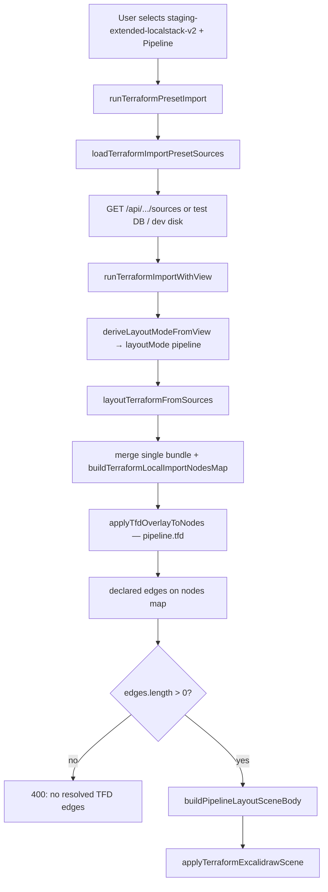

# staging-extended-localstack-v2 — agent handoff (pipeline view)

Handoff for another agent working on the **fourth built-in Terraform import preset**, its **`pipeline.tfd`** declared dataflow (especially Organizations / multi-account lanes), or **pipeline layout** in tfdraw.dev.

**Start here for v2.** For generic pipeline import mechanics (phases, profiler, Vitest playbook), see [`terraform-pipeline-import-debug-handoff.md`](./terraform-pipeline-import-debug-handoff.md). For preset DB / catalog / compact fixtures, see [`terraform-import-presets-agent-handoff.md`](./terraform-import-presets-agent-handoff.md). For the prior single-account extended preset (v1), see [`staging-extended-localstack-pipeline-handoff.md`](./staging-extended-localstack-pipeline-handoff.md).

---

## What this preset is

| Field | Value |
| --- | --- |
| **Preset ID** | `staging-extended-localstack-v2` |
| **Display name** | Staging Extended LocalStack v2 |
| **Terraform root** | `packages/backend/terraform/staging-extended-localstack-v2/` |
| **Stack model** | **Single root** (one `plan.json` + `graph.dot`, same import shape as `staging-localstack` / `staging-extended-localstack`) |
| **Default view** | `pipeline` |
| **Design intent** | **Single-state parity** with `staging-multi-state-expanded` (25 stacks), plus **multi-account** topology for pipeline diagrams |

**Purpose:** One monolithic LocalStack apply that folds the expanded staging platform into a **single Terraform root**, while modeling **four LocalStack accounts** (management, workload, ingestion, security) via provider `access_key` aliases and Organizations resources. Pipeline view should show:

- **Org / guardrails:** `aws_organizations_*`, SCPs, delegated admins
- **Account-scoped lanes:** workload trunk/APIs, ingestion lake/streams/EKS, security audit/observability
- **Same extended platform** as v1: multi-region APIs, lake tiers, Kinesis/Firehose, EKS, regional persistence, CloudTrail/Config/WAF/alarms

**Not** multi-state: one bundle, unqualified plan node keys, TFD binds prefixed with `staging-extended-localstack-v2::`.

---

## Catalog entry

Source: [`packages/excalidraw/assets/import-presets.catalog.json`](../packages/excalidraw/assets/import-presets.catalog.json) (mirrored in `packages/backend/terraform/import-presets.catalog.json`).

```json
{
  "id": "staging-extended-localstack-v2",
  "name": "Staging Extended LocalStack v2",
  "view": "pipeline",
  "rootPath": "packages/backend/terraform/staging-extended-localstack-v2",
  "stacks": [
    {
      "id": "staging-extended-localstack-v2",
      "label": "staging-extended-localstack-v2",
      "planPath": "plan.json",
      "dotPath": "graph.dot"
    }
  ],
  "tfdPaths": ["pipeline.tfd"]
}
```

Builtin order in tests: index **3** (4th preset) after `staging-multi-state-expanded`, `staging-localstack`, `staging-extended-localstack` — see [`terraformImportPresets.test.ts`](../packages/excalidraw/components/terraformImportPresets.test.ts).

**Path rule (critical):** `stack.id` equals the last segment of `rootPath`, and artifacts live at the root (`plan.json`, not `staging-extended-localstack-v2/plan.json`). Loader must not double-prefix — `fullPathForPresetFile()` → `isRootLevelArtifact` in [`terraformImportPresetLoader.ts`](../packages/excalidraw/components/terraformImportPresetLoader.ts).

---

## Terraform layout (on disk)

| File | Domain |
| --- | --- |
| `main.tf` | Providers per account alias (`aws`, `aws.west`, …, `aws.management`, `aws.ingestion`, `aws.security`) → LocalStack |
| `contract.tf` | Account IDs `000000000001`–`004`, regions, VPC CIDRs (workload + ingestion VPC families) |
| `organization.tf` | Organizations org, OUs, member accounts, delegated admins, SCPs |
| `network.tf` | Workload four-region VPC modules |
| `ingestion-network.tf` | Ingestion-account VPC modules (separate CIDR space) |
| `trunk.tf` | ECS edge ingress/egress, SQS trunk, producer/consumer |
| `apis.tf` | api1–api16 (api13 omitted in topology) |
| `datastores.tf` | Per-API datastore modules |
| `lake-and-streams.tf` | S3 lake, Kinesis, Firehose, ingest queues |
| `eks-processing.tf` | EKS cluster, node groups, IRSA, addons |
| `regional-persistence.tf` | Regional writers, DynamoDB/RDS/Aurora |
| `security-observability.tf` | CloudTrail, Config, WAF, ops SNS, dashboard/alarms |
| `extended-locals.tf` | Lake families, replica regions, tags |
| `pipeline.tfd` | Declared dataflow (~287 lines) — **on disk**, gitignored (see below) |
| `scripts/apply-and-export.sh` | LocalStack apply + export `plan.json` / `graph.dot` |
| `scripts/start-localstack.sh` | Dedicated container, default edge **port 4568** |
| `scripts/parity-check.sh` | Compare managed resource **type counts** vs 25× `staging-multi-state` plans |

**Gitignored:** `plan.json`, `graph.dot`, `terraform.tfstate`, `.terraform/`, `build/`, and `**/*.tfd` except `staging-multi-state/pipeline.tfd` and `staging-localstack/pipeline.tfd`. v2 `pipeline.tfd` is loaded from disk during **hydrate/seed** and stored in the preset SQLite DB / test fixture — not necessarily committed in git.

---

## Multi-account model (v2 vs v1)

|  | `staging-extended-localstack` (v1) | `staging-extended-localstack-v2` |
| --- | --- | --- |
| Accounts | Implicit single account (`000000000002`) | **Four** LocalStack accounts in `contract.tf` |
| Organizations | None | `organization.tf` + management provider |
| Ingestion VPCs | Shared workload CIDRs | Separate `ingestion_*` VPC CIDRs (`ingestion-network.tf`) |
| Pipeline org lanes | No | `organization_root → OU → account → …` in `pipeline.tfd` |
| LocalStack port | Often 4566 | Default **4568** (`LOCALSTACK_EDGE_PORT`) |
| Parity target | Base localstack / multi-state loosely | `parity-check.sh` vs **combined 25-stack** plans |

Providers use `access_key = local.accounts.{management|workload|ingestion|security}` with the same LocalStack endpoint. Organizations resources use `provider = aws.management`.

---

## pipeline.tfd — bind conventions

File: `packages/backend/terraform/staging-extended-localstack-v2/pipeline.tfd` (generate/maintain on disk; hydrate into DB).

### Stack qualifier

Every bind uses the single stack prefix:

```text
staging-extended-localstack-v2::aws_organizations_organization.this
staging-extended-localstack-v2::aws_s3_bucket.lake["raw"]
staging-extended-localstack-v2::module.api1.aws_api_gateway_rest_api.private
```

Plan node keys in a single-bundle import are **unqualified** (e.g. `aws_organizations_organization.this`). `resolveTerraformPlanNodeKey` strips the `staging-extended-localstack-v2::` prefix when resolving binds.

### Structure (high level)

1. **Lines 1–92** — Hub network, ECS trunk, api1–api16 gateways/compute/stores (same fanout pattern as v1 / multi-state pipeline).
2. **Lines 93–161** — **v2-specific** binds: Organizations, accounts, SCPs, lake/stream/EKS/regional/security resources.
3. **Lines 163–228** — Base dataflow (trunk → APIs → cascade).
4. **Lines 230–237** — **Organization dataflow** (new vs v1):
   - `organization_root → workloads_ou, data_platform_ou, security_ou`
   - `workloads_ou → workload_account`, `data_platform_ou → ingestion_account`, `security_ou → security_account`
   - `security_account → securityhub_delegate, guardduty_delegate`
   - SCP edges to OUs
5. **Lines 239–287** — Extended lanes + **account entry points**:
   - `workload_account -> ecs_producer, queue_consumer, ecs_alb`
   - `ingestion_account -> ingest_fifo_queue, kinesis_*, eks_cluster, …`
   - `security_account -> cloudtrail_org, config_recorder, audit_bucket, ops_topic`
   - Lake → stream → EKS → Glue → regional persistence → audit → alarm fan-in

### Pipeline hard requirement

Pipeline view **fails with 400** if `.tfd` has `->` edges but **zero** resolve to plan nodes:

```text
Pipeline view requires at least one resolved .tfd dataflow edge.
```

Keep binds aligned with exported plan addresses (quoted map keys: `lake["raw"]`, `audit["audit"]`).

---

## Preset DB and commands

| Artifact | Notes |
| --- | --- |
| Test fixture (committed) | `packages/excalidraw/test-fixtures/terraform-import-presets.db` — **4 builtins** after v2 hydrate + export |
| Dev DB (gitignored) | `terraform-import-presets.db` at repo root |

```bash
# LocalStack (v2 uses port 4568 by default)
cd packages/backend/terraform/staging-extended-localstack-v2
./scripts/start-localstack.sh
./scripts/apply-and-export.sh

# Optional: verify resource-type parity vs 25-stack multi-state
./scripts/parity-check.sh

# Seed all catalog presets into dev DB + compact
yarn seed:terraform-presets

# Hydrate only v2 after re-exporting plan/dot/tfd on disk
yarn hydrate:terraform-preset staging-extended-localstack-v2

# Refresh committed CI fixture
yarn export:terraform-presets-test-db

# Hosted previews / prod
yarn push:terraform-presets-d1:preview   # and/or :prod
```

**CI / Vitest** read plan+dot+tfd from the **SQLite fixture**, not gitignored `plan.json` on disk.

---

## End-to-end import pipeline (pipeline view)

Focused path from preset selection → Excalidraw scene for **`view: pipeline`** on this preset.



### Entry points (code)

| Step | Module | Function |
| --- | --- | --- |
| Preset import | `terraformPresetImport.ts` | `runTerraformPresetImport` |
| View → mode | same | `deriveLayoutModeFromView` → `"pipeline"` when view is pipeline and plan exists |
| Load sources | `terraformImportPresetLoader.ts` | `loadTerraformImportPresetSources` |
| Scene + cache | `terraformSceneApply.ts` | `runTerraformImportFromSources` |
| Layout router | `terraformLayoutWorkerClient.ts` | `layoutTerraformViaWorkers` — **pipeline always main thread** |
| Merge + TFD + pipeline branch | `terraformLayoutCore.ts` | `layoutTerraformFromSources` |
| Pipeline scene | `terraformPipelineLayout.ts` | `buildTerraformPipelineExcalidrawScene` |
| TFD overlay | `terraformDeclaredDataFlow.ts` | `applyTfdOverlayToNodes` / `applyDeclaredDataFlowFromMany` |
| Apply canvas | `terraformSceneApply.ts` | `applyTerraformExcalidrawScene` |

Profiler spans for pipeline: `prep.cache` → `merge.plans` → `parse.nodes` → `parse.tfd` → `layout.pipeline`. Details: [`terraform-pipeline-import-debug-handoff.md`](./terraform-pipeline-import-debug-handoff.md).

### Key behavior for this preset

| Step | Behavior |
| --- | --- |
| **Merge** | One `planDotBundle` → plan keys **not** stack-prefixed |
| **TFD binds** | Use `staging-extended-localstack-v2::`; overlay resolves to bare keys |
| **Layout** | `layoutMode: "pipeline"` only (do **not** use `pipelineLayout: true` in tests) |
| **Layout engine** | Columns/hops from resolved `.tfd` edges |
| **Framing** | EKS → `primaryCluster`, `vpc`, `region`, `account`; CloudTrail → `primaryCluster`, `account` |

### Correct test options

```ts
await layoutTerraformViaWorkers(sources, {
  semanticLayout: false,
  layoutMode: "pipeline",
});
```

---

## Reproduction

### UI (dev)

1. `yarn seed:terraform-presets` (or rely on committed fixture in Vitest)
2. `yarn start` — **not** `yarn build:preview` (no preset API on static preview)
3. Import Terraform → **Staging Extended LocalStack v2** → **Pipeline** → Load preset & import

### Demo URL

```text
/demo?preset=staging-extended-localstack-v2
/demo?preset=staging-extended-localstack-v2&view=pipeline
```

Semantic view works but is **very slow** on this plan (~11 MB JSON); use pipeline for smoke tests.

### Automated checks

```bash
# Catalog lists 4 builtins
yarn vitest run packages/excalidraw/components/terraformImportPresets.test.ts

# v2 TFD binds + pipeline layout smoke
yarn vitest run packages/excalidraw/components/terraformPipelineTfdBind.test.ts \
  -t "staging-extended-localstack-v2"
```

Regression test: **`resolves multi-account Organizations ingestion and security paths`** in [`terraformPipelineTfdBind.test.ts`](../packages/excalidraw/components/terraformPipelineTfdBind.test.ts).

Asserts:

- `errors` / `warnings` empty from `applyDeclaredDataFlowFromMany`
- `edges.length > 40`
- Plan contains org resources, `lake["raw"]`, EKS, Dynamo regional table, audit bucket, CloudTrail, Config, ops SNS
- Declared edges include org → OU, ingestion account → `ingest_fifo`, security account → CloudTrail
- `layoutTerraformViaWorkers(..., { layoutMode: "pipeline" })` → `elements.length > 0`
- Frame roles on EKS and CloudTrail

### Fast TFD-only debug (no browser)

```ts
import { getTerraformImportPresetSourcesFromDb } from "../../../excalidraw-app/dev/terraformImportPresetDb.mjs";
import { buildTerraformLocalImportNodesMap } from "./terraformPlanParsing";
import { applyDeclaredDataFlowFromMany } from "./terraformDeclaredDataFlow";

const sources = getTerraformImportPresetSourcesFromDb(
  "staging-extended-localstack-v2",
);
const bundle = sources.planDotBundles[0];
const nodes = buildTerraformLocalImportNodesMap(
  bundle.plan,
  bundle.graph,
  [],
  {},
);
const { edges, errors } = applyDeclaredDataFlowFromMany(
  nodes,
  sources.tfdTexts,
  sources.tfdLabels,
);
console.log({ edgeCount: edges.length, errors });
```

---

## Comparison with sibling presets

|  | `staging-multi-state-expanded` | `staging-extended-localstack` | `staging-extended-localstack-v2` |
| --- | --- | --- | --- |
| Stacks | 25 | 1 | 1 |
| Accounts in plan | Per-stack implied | Single | **4 (Organizations)** |
| Plan shape | 25 sharded JSON | 1 large JSON | 1 larger JSON (multi-state parity target) |
| TFD prefix | `{stack-id}::` | `staging-extended-localstack::` | `staging-extended-localstack-v2::` |
| Org lanes in TFD | Per-stack if any | No | **Yes** (lines 230–242) |
| LocalStack | N/A (real/sharded plans) | 4566 typical | **4568** default |
| Primary use | Multi-state layout regression | Extended single-account stress | **Multi-account + single-plan parity** |

---

## Common failures

| Symptom | Likely cause | Fix |
| --- | --- | --- |
| Preset missing in UI | No API / stale DB | `yarn start`; `yarn seed:terraform-presets` |
| Missing `.../staging-extended-localstack-v2/staging-extended-localstack-v2/plan.json` | Double path prefix | `isRootLevelArtifact` in loader |
| Pipeline 400: no resolved `.tfd` edges | Bind mismatch vs plan | Re-export plan; fix `pipeline.tfd`; run TFD bind test |
| Org binds fail | Organizations not in plan export | Apply with management provider; re-hydrate |
| `parity-check.sh` fails | Plan drift vs 25-stack | Align `.tf` with multi-state modules or update expectations |
| CI fails, local passes | Stale test fixture | `yarn hydrate:terraform-preset staging-extended-localstack-v2 && yarn export:terraform-presets-test-db` |
| Empty canvas in test | `pipelineLayout: true` | Use `layoutMode: "pipeline"` |
| Apply fails on 4566 | Wrong LocalStack instance | Use v2 `start-localstack.sh` (4568) or set `TF_VAR_localstack_endpoint` |

---

## Key files (quick index)

| Area | Path |
| --- | --- |
| Catalog | `packages/excalidraw/assets/import-presets.catalog.json` |
| Terraform root | `packages/backend/terraform/staging-extended-localstack-v2/` |
| pipeline.tfd | `.../staging-extended-localstack-v2/pipeline.tfd` |
| Export / LocalStack | `.../scripts/apply-and-export.sh`, `start-localstack.sh`, `parity-check.sh` |
| Preset DB tooling | `excalidraw-app/dev/terraformImportPresetDb.mjs`, `hydrateTerraformImportPreset.mjs` |
| Loader | `packages/excalidraw/components/terraformImportPresetLoader.ts` |
| Pipeline layout | `packages/excalidraw/components/terraformPipelineLayout.ts` |
| Layout core | `packages/excalidraw/components/terraformLayoutCore.ts` |
| TFD overlay | `packages/excalidraw/components/terraformDeclaredDataFlow.ts` |
| Regression test | `packages/excalidraw/components/terraformPipelineTfdBind.test.ts` |
| Test fixture DB | `packages/excalidraw/test-fixtures/terraform-import-presets.db` |
| Pipeline debug guide | `docs/terraform-pipeline-import-debug-handoff.md` |

---

## Changelog

- **2026-06-04** — Initial v2 pipeline handoff (4th builtin, multi-account org lanes, single-plan parity with multi-state).
