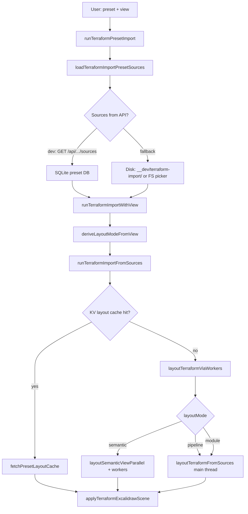

# Terraform import presets — agent handoff

Handoff doc for another agent working on **built-in Terraform import presets**, **layout (semantic / pipeline)**, or **staging-localstack** vs **staging-multi-state-expanded**.

---

## Built-in presets (catalog)

Source of truth: [`packages/excalidraw/assets/import-presets.catalog.json`](../packages/excalidraw/assets/import-presets.catalog.json)

| Preset ID | Terraform root | Stacks | Default view | `pipeline.tfd` |
| --- | --- | --- | --- | --- |
| `staging-multi-state-expanded` | `packages/backend/terraform/staging-multi-state/` | 25 (one root per stack dir) | `pipeline` | `pipeline.tfd` (committed) |
| `staging-localstack` | `packages/backend/terraform/staging-localstack/` | 1 (single root) | `pipeline` | `pipeline.tfd` (committed) |

**Multi-state** — each stack has `plan.json` + `graph.dot` under `{stack-id}/` (e.g. `00-east-network/plan.json`). TFD binds use stack-qualified addresses: `40-east-api-1::module.api.aws_...`.

**LocalStack** — monolithic apply: `plan.json`, `graph.dot`, `pipeline.tfd` at the **root** of `staging-localstack/`. TFD binds use `staging-localstack::module.api1...`. Stack id in the catalog equals the folder name but artifacts are **not** under a `staging-localstack/` subfolder.

Plan/dot exports are **gitignored** except `pipeline.tfd`. Generate locally (LocalStack: `packages/backend/terraform/staging-localstack/scripts/apply-and-export.sh`).

---

## Preset databases and commands

| Artifact | Path | Purpose |
| --- | --- | --- |
| Dev DB (gitignored) | `terraform-import-presets.db` (repo root) | Used by `yarn start` + Vite dev API |
| Test fixture DB (committed) | `packages/excalidraw/test-fixtures/terraform-import-presets.db` | Vitest / CI read plan+dot+tfd from SQLite |
| D1 (production) | `tfdraw-presets` / preview | Pages deploy; push via `yarn push:terraform-presets-d1:*` |

```bash
# Seed all catalog builtins into dev DB (reads disk under each rootPath)
yarn seed:terraform-presets

# Hydrate one preset after updating plan/dot on disk
yarn hydrate:terraform-preset staging-multi-state-expanded
yarn hydrate:terraform-preset staging-localstack

# Copy dev DB → committed test fixture (run after hydrate when fixtures change)
yarn export:terraform-presets-test-db

# Verify test DB has all catalog presets with plan+dot
node excalidraw-app/dev/verifyTerraformPresetsTestDb.mjs
```

**CI / tests** do not read gitignored `plan.json` on disk; they use the committed SQLite fixture. After catalog or fixture changes, re-export the test DB.

### Compact fixture format (~3 MB)

The committed test fixture and local dev DB are **gzip-compacted** after every seed/hydrate/export:

| Storage | Format | Notes |
| --- | --- | --- |
| `terraform_import_preset_stacks.plan_text` / `dot_text` / `state_text` | `gz:b64:…` inline or `gz:b64:chunks:N` pointer | Decompressed via [`loadPresetBlobTextSqlite`](../../excalidraw-app/dev/loadPresetBlobTextSqlite.mjs) |
| `terraform_import_preset_blob_chunks` | gzip base64 shards | Large plans (e.g. staging-localstack ~8 MB raw) overflow inline 32 KB limit |
| `terraform_import_preset_tfd.content` | same as stacks | Small files usually inline |
| `terraform_import_artifacts` | — | **Stripped on compact** (dev-only duplicate; not in committed fixture) |
| `terraform_import_compositions` | — | **Stripped on compact** (regenerated on seed/hydrate, then removed) |

Implementation: [`compactTerraformImportPresetDb.mjs`](../../excalidraw-app/dev/compactTerraformImportPresetDb.mjs) — called from `seedAllBuiltinsFromCatalog`, `upsertAndHydratePresetFromCatalog`, and `exportTerraformPresetsTestDb`.

Expected sizes after `yarn seed:terraform-presets` + `yarn export:terraform-presets-test-db`:

- **~3 MB** fixture file (was ~73 MB before compact: duplicate artifacts + raw UTF-8 + SQLite freelist)
- **~80 blob chunks** for current two-preset catalog

To check fixture size: `ls -lh packages/excalidraw/test-fixtures/terraform-import-presets.db` (expect ~3 MB).

---

## Reproduction steps (human or agent)

### Prerequisites

1. Repo deps installed (`yarn`).
2. For disk-based import: run `terraform apply` + export `plan.json` / `graph.dot` under the preset root (or use hydrated DB).
3. For dev UI: `yarn seed:terraform-presets` so `terraform-import-presets.db` exists.

### UI — Import dialog

1. `yarn start`
2. Open **Import Terraform** (`Ctrl/Cmd+Shift+K`).
3. Select preset:
   - **Staging multi-state (expanded)** — `staging-multi-state-expanded`
   - **Staging LocalStack** — `staging-localstack`
4. Choose view: **Pipeline**, **Semantic**, or **Module** (see pipeline section below).
5. **Load preset & import** — should finish without “Missing required preset file” or empty canvas.

### Demo URLs

| URL | Expected |
| --- | --- |
| `/demo?preset=staging-multi-state-expanded` | Pipeline (default) |
| `/demo?preset=staging-multi-state-expanded&view=semantic` | Semantic topology |
| `/demo?preset=staging-localstack` | Pipeline, ~722 elements |
| `/demo?preset=staging-localstack&view=semantic` | Semantic (large; slow) |

### Automated checks (no browser)

```bash
# Preset DB integrity
yarn vitest run excalidraw-app/dev/terraformImportPresetDb.test.mjs

# Single-root path resolution (staging-localstack disk fallback)
yarn vitest run packages/excalidraw/components/terraformImportPresetLoader.test.ts

# Multi-state pipeline.tfd bind resolution
yarn vitest run packages/excalidraw/components/terraformPipelineTfdBind.test.ts

# Layout golden snapshots (multi-state only today)
yarn vitest run packages/excalidraw/components/terraformLayoutSnapshot.test.ts
```

### Vitest — layout smoke (add or use ad-hoc test)

Load sources from test DB and call `layoutTerraformViaWorkers` with **`layoutMode: "pipeline"`** (not `pipelineLayout: true` — that option is ignored).

```ts
import { getTerraformImportPresetSourcesFromDb } from "../../../excalidraw-app/dev/terraformImportPresetDb.mjs";
import { layoutTerraformViaWorkers } from "./terraformLayoutWorkerClient";

const sources = getTerraformImportPresetSourcesFromDb("staging-localstack");
await layoutTerraformViaWorkers(
  {
    planDotBundles: sources.planDotBundles,
    states: [],
    stateLabels: [],
    tfdTexts: sources.tfdTexts,
    tfdLabels: sources.tfdLabels,
  },
  { layoutMode: "pipeline" },
);
// Expect elements.length > 0 (pipeline ~722 for current fixture)
```

---

## End-to-end import pipeline (presets → canvas)

High-level flow from preset selection to Excalidraw scene:



### Entry points (code)

| Step | Module |
| --- | --- |
| Preset import | [`terraformPresetImport.ts`](../packages/excalidraw/components/terraformPresetImport.ts) — `runTerraformPresetImport` |
| Load plan/dot/tfd | [`terraformImportPresetLoader.ts`](../packages/excalidraw/components/terraformImportPresetLoader.ts) |
| View → layout mode | `deriveLayoutModeFromView` in `terraformPresetImport.ts` |
| Scene + session | [`terraformSceneApply.ts`](../packages/excalidraw/components/terraformSceneApply.ts) — `runTerraformImportFromSources` |
| Layout orchestration | [`terraformLayoutWorkerClient.ts`](../packages/excalidraw/components/terraformLayoutWorkerClient.ts) — `layoutTerraformViaWorkers` |
| Core merge + layouts | [`terraformLayoutCore.ts`](../packages/excalidraw/components/terraformLayoutCore.ts) — `layoutTerraformFromSources` |

### Loading preset sources

1. **API (preferred in dev)** — `GET /api/terraform-import-presets/{id}/sources` (Vite plugin reads `terraform-import-presets.db`).
2. **Disk fallback** — `GET /__dev/terraform-import/{encodedPath}` when API has no embedded content or `hasContent: false`.
3. **Path resolution** — `fullPathForPresetFile()` in `terraformImportPresetLoader.ts`:
   - Multi-state: `planPath` already includes stack dir → `staging-multi-state/00-east-network/plan.json`.
   - Single-root: when `stack.id ===` last segment of `rootPath` and path has no `/`, use root-level file → `staging-localstack/plan.json` (**not** `staging-localstack/staging-localstack/plan.json`).

Hydration on disk uses `joinRootRelative(rootPath, stack.planPath)` directly in [`terraformImportPresetDb.mjs`](../excalidraw-app/dev/terraformImportPresetDb.mjs) (no double prefix).

### TFD handling

- Catalog lists `tfdPaths: ["pipeline.tfd"]`.
- DB may inject `use {stackId} { plan ... dot ... }` blocks when serving sources (`ensureTfdHasUseBlocks` in preset DB).
- At layout time: `resolveSourcesWithTfdComposition` → `applyTfdCompositionToSources` (optional `use` blocks pulling artifacts from catalog).
- Overlay: `applyTfdOverlayToNodes` → `applyDeclaredDataFlowFromMany` — binds `staging-localstack::...` resolve to bare plan keys via `resolveTerraformPlanNodeKey` (stack prefix matching).

**Pipeline hard requirement:** at least one resolved declared dataflow edge; otherwise HTTP 400: _"Pipeline view requires at least one resolved .tfd dataflow edge."_

---

## Shared layout pipeline (`layoutTerraformFromSources`)

Both **semantic** and **pipeline** run through the same preparation unless semantic parallel path short-circuits prep:

| Phase | Profiler span (typical) | What happens |
| --- | --- | --- |
| TFD composition | — | `resolveSourcesWithTfdComposition` |
| Prep cache | `prep.cache` | `buildTerraformImportPrepCache` — merge plans, adjacency, fingerprint |
| Merge plans | `merge.plans` | `namespacePlanDotBundles` **only if** `planDotBundles.length > 1`; else single bundle, `stackIds: []` |
| Validate | — | Managed resources required for semantic/pipeline |
| Parse graph | `parse.nodes` | `buildTerraformLocalImportNodesMap(plan, graph, states, { adjacency, stackIds })` |
| TFD overlay | `parse.tfd` | `applyTfdOverlayToNodes` |
| TFD edge check | — | Fail if `.tfd` has `->` but zero resolved edges |
| **Layout branch** | see below |  |

**Multi-bundle naming:** `namespacePlanDotBundles` prefixes addresses with `stackId::` and sets `stackIds` / `addressToStack`. **Single bundle (localstack):** no namespace; TFD still uses `staging-localstack::` in binds; resolution maps qualified binds to unqualified node keys.

---

## Pipeline view

### When it runs

- Preset `view: "pipeline"` or user selects **Pipeline** in import dialog.
- `deriveLayoutModeFromView` → `layoutMode === "pipeline"`.
- Passed to layout as `options.layoutMode: "pipeline"` (and `semanticLayout: false`).

### Worker behavior

[`layoutTerraformViaWorkers`](../packages/excalidraw/components/terraformLayoutWorkerClient.ts): **pipeline always uses main thread** (`runSequential` → `layoutTerraformFromSources`). Workers are **not** used for pipeline layout (only for semantic parallel jobs).

### Layout implementation

- `buildPipelineLayoutSceneBody` → `buildTerraformPipelineExcalidrawScene(nodes, plan)`.
- Meta includes `layoutEngine: "pipeline"`, `pipelineClusterCount`, `pipelineEdgeCount`, `pipelineColumnCount`.
- Declared dataflow edges from `.tfd` drive column/hop layout; IAM/dataflow grey edges still come from plan semantics elsewhere.

### Expected scale (current fixtures)

| Preset | Bundles | Pipeline elements (approx.) | Notes |
| --- | --- | --- | --- |
| `staging-multi-state-expanded` | 25 | Similar topology to localstack | Sharded plans |
| `staging-localstack` | 1 | ~722 | One large plan (~4.5MB JSON) |

---

## Semantic view

### When it runs

- `view=semantic` or preset default semantic (builtins default to pipeline).
- `layoutMode === "semantic"` → `semanticLayout: true`.

### Worker behavior

1. `layoutSemanticViewParallel` in [`terraformLayoutSemanticParallel.ts`](../packages/excalidraw/components/terraformLayoutSemanticParallel.ts).
2. `prepareSemanticAwsLayoutPrep` — same merge/TFD prep as core path.
3. **Parallel jobs** via worker pool:
   - `semanticAws` — AWS topology (VPC, subnets, regional primaries, route tables, etc.).
   - `semanticProvider` — one job per non-AWS provider family in plan.
4. Results composed in `composeMultiProviderTopologyScene` / `buildSemanticLayoutSceneBody` path on main thread after workers return.

### Layout implementation

- `buildSemanticLayoutSceneBody` — `extractTerraformTopologyFromPlan`, zone placement, ELK-style topology scene (`buildTerraformTopologyExcalidrawScene`).
- Meta: `layoutEngine: "topology"`, `accountCount`, `regionCount`, `vpcCount`, etc.
- **Much slower** for 25-stack or monolithic localstack plans; CI budgets in `terraformImportPerf*.test.ts` (minutes).

### TFD in semantic

Same overlay as pipeline; declared dataflow layer can be enabled when importing with `.tfd`. If TFD has edge syntax but nothing resolves → same 400 as pipeline.

---

## Module view (brief)

- Default when view is **Module** or semantic/pipeline preconditions fail (`canUseSemanticView` false).
- `layoutTerraformFromSources` → `buildModuleLayoutSceneBody` → ELK module graph (`buildTerraformElkExcalidrawScene`).
- Demo: `&view=module&pack=box`.

---

## Common failures (troubleshooting)

| Symptom | Likely cause | Fix |
| --- | --- | --- |
| Missing preset file `.../staging-localstack/staging-localstack/plan.json` | Old `fullPathForPresetFile` double-prefix | Ensure fix in `terraformImportPresetLoader.ts` (`isRootLevelArtifact`) |
| Pipeline: no resolved `.tfd` edges | Bad binds vs plan addresses | Check `pipeline.tfd` stack qualifiers match plan keys; run `terraformPipelineTfdBind.test.ts` pattern for localstack |
| Empty canvas, no error | Wrong layout option in tests: `pipelineLayout: true` | Use `layoutMode: "pipeline"` |
| Preset list works, import empty | Dev DB not seeded | `yarn seed:terraform-presets` |
| Tests pass locally, fail in CI | Stale `terraform-import-presets.db` fixture | Re-hydrate + `yarn export:terraform-presets-test-db` |
| Semantic timeout | Large monolithic plan | Expected; use pipeline for localstack smoke tests |

---

## Key files checklist for agents

| Area | Path |
| --- | --- |
| Catalog | `packages/excalidraw/assets/import-presets.catalog.json` |
| Compact export | `excalidraw-app/dev/compactTerraformImportPresetDb.mjs` |
| Types / builtins | `packages/excalidraw/components/terraformImportPresetsTypes.ts` |
| Preset DB (Node) | `excalidraw-app/dev/terraformImportPresetDb.mjs` |
| Dev API plugin | `excalidraw-app/dev/terraformImportPresetDevPlugin.mjs` |
| Merge / namespace | `packages/excalidraw/components/terraformImportMerge.ts` |
| TFD parse/overlay | `packages/excalidraw/components/terraformDeclaredDataFlow.ts` |
| Pipeline layout | `packages/excalidraw/components/terraformPipelineLayout.ts` |
| Semantic layout | `packages/excalidraw/components/terraformTopologyLayout.ts`, `terraformLayoutSemanticParallel.ts` |
| Perf / regression | `docs/terraform-import-performance-log.md`, `packages/excalidraw/test-fixtures/terraform-import-perf-baseline.json` |

---

## Related docs

- [README.md — Terraform import & presets](../README.md#declared-dataflow-tfd)
- [docs/cloudflare-deploy.md](./cloudflare-deploy.md) — D1 preset push, demo smoke URLs
- [docs/terraform-import-performance-log.md](./terraform-import-performance-log.md) — semantic perf work on `staging-multi-state-expanded`
- [packages/backend/README.md](../packages/backend/README.md) — terraform submodule layout

---

## Changelog note (2026-06-03)

**staging-localstack** preset added to catalog + test fixture DB. **Bug fix:** single-root presets must not prefix `stack.id/` onto root-level `plan.json` / `graph.dot` when loading from disk; regression test in `terraformImportPresetLoader.test.ts` (_"resolves root-level plan paths for single-root staging-localstack preset"_).

**Preset DB slim-down:** committed fixture gzip-compacts stack/TFD blobs, strips duplicate `artifacts`/`compositions` rows, and VACUUMs (~73 MB → ~3 MB). Seed/hydrate/export call `compactTerraformImportPresetDb`; tests read blobs via `loadPresetBlobTextSqlite`.
