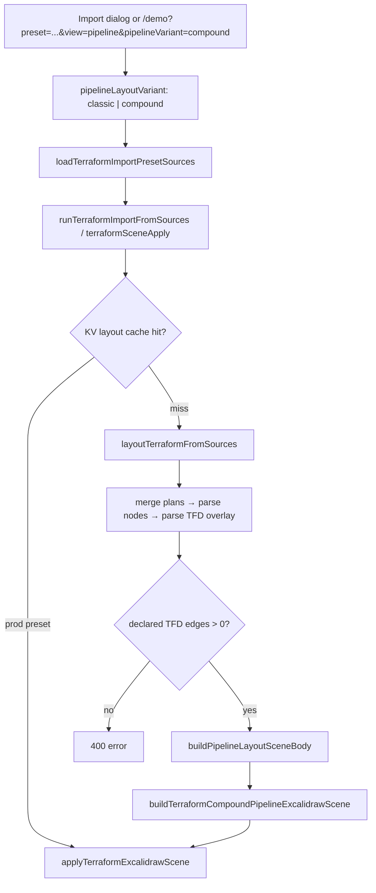
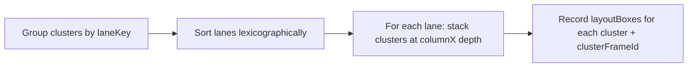

# Terraform import pipeline + Compound layout — agent guide

**Pipeline overview (all toggles: Compact/Full, Classic/Compound, Stacked/Packed):** [terraform-pipeline-import-agent-guide.md](./terraform-pipeline-import-agent-guide.md)

Start here if you need **Compound layout algorithm detail** — phases, hull frames, arrow parenting. For the full import flow and toggle matrix, read the overview above first.

---

## What you are looking at

**tfdraw** imports Terraform plan JSON (+ optional state, graph DOT, `.tfd` files) and renders an Excalidraw diagram. Three layout modes exist:

| View | Engine | Primary input |
| --- | --- | --- |
| Semantic | Topology layout | Plan graph + AWS placement rules |
| Module | ELK | Module tree from plan |
| **Pipeline** | TFD hop columns | **`.tfd` `->` edges** + plan for cards/topology |

Within **Pipeline view**, two variants:

| Variant | Label | Difference |
| --- | --- | --- |
| `classic` | Classic | TFD grid + topology hull frames; arrows stay at scene root |
| **`compound`** | **Compound** | Same placement math, plus hierarchical metadata and **arrow parenting** so dragging a region/VPC frame moves resources **and in-group TFD arrows** together |

**Compound does not change TFD column assignment.** It adds a post-pass for Excalidraw frame semantics (group drag).

---

## Hard requirements (pipeline view)

1. **At least one resolved `.tfd` dataflow edge** — otherwise import fails with 400:
   ```text
   Pipeline view requires at least one resolved .tfd dataflow edge.
   ```
2. **TFD drives horizontal columns** — plan IAM edges alone do not define hop order.
3. **Topology is truthful** — account/region/VPC/subnet come from `buildPlacementMap`, not invented.

Inputs per bundle:

- `plan.json` — resource addresses, types, attributes
- `pipeline.tfd` (or other `.tfd`) — `bind` aliases + `A -> B` declared dataflow
- `graph.dot` — carried in bundles; pipeline layout uses plan + TFD more than DOT topology

---

## End-to-end import flow



### Code path (in order)

| Step | File | Function / note |
| --- | --- | --- |
| UI toggle | `TerraformImportDialog.tsx` | Pipeline view + Classic/Compound sub-buttons |
| Session state | `useTerraformImportDialog.ts`, `terraformImportSession.ts` | `pipelineLayoutVariant` threaded through |
| Preset import | `terraformPresetImport.ts` | `runTerraformPresetImport` |
| Load sources | `terraformImportPresetLoader.ts` | plan + dot + tfd from D1/disk |
| Scene apply | `terraformSceneApply.ts` | cache lookup, worker dispatch |
| Layout core | `terraformLayoutCore.ts` | `layoutTerraformFromSources` |
| Variant router | `terraformLayoutCore.ts` | `buildPipelineLayoutSceneBody` picks builder |
| **Compound builder** | `terraformPipelineLayoutCompound.ts` | `buildTerraformCompoundPipelineExcalidrawScene` |
| Canvas | `terraformSceneApply.ts` | `applyTerraformExcalidrawScene` |

**Pipeline layout always runs on the main thread** (not sharded like semantic topology).

URL params: `view=pipeline`, `pipelineVariant=compound` via `terraformDemoUrlParams.ts`.

---

## Inside `layoutTerraformFromSources` (pipeline mode)

Profiler spans run in this order:

| Span | What happens |
| --- | --- |
| `prep.cache` | Fingerprint for merge metadata |
| `merge.plans` | Merge bundles; multi-state namespaces addresses as `stackId::` |
| `parse.nodes` | `buildTerraformLocalImportNodesMap` from plan |
| `parse.tfd` | `applyTfdOverlayToNodes` → `nodes[DECLARED_DATAFLOW_ORDERED_KEY]` |
| `layout.pipeline` | Compound or Classic builder |

TFD overlay attaches resolved edges to the nodes map under `DECLARED_DATAFLOW_ORDERED_KEY`. Pipeline layout reads that key exclusively for hop ordering.

---

## Two dimensions (do not conflate)

Pipeline layout combines **independent** horizontal and vertical semantics:

```text
┌─────────────────────────────────────────────────────────────┐
│  HORIZONTAL (TFD)          │  VERTICAL (topology)             │
│  computeDepths on .tfd     │  laneKey from placement map    │
│  → column index per cluster│  → stacked horizontal bands    │
│  A -> B ⇒ B right of A     │  account/region/VPC/subnet lane  │
└─────────────────────────────────────────────────────────────┘
```

| Dimension | Source | Controls |
| --- | --- | --- |
| **TFD columns** | `.tfd` `->` edges, collapsed to primary clusters | `depth`, global `columnX[]` |
| **Topology lanes** | `buildPlacementMap` → `laneKey` | Which Y-band a cluster sits in |

**Design principle:** resource positions are computed first on a **global TFD grid**; topology frames are **hulls drawn around** already-placed clusters (not boxes that resources are squeezed into).

An older Compound prototype laid out topology boxes first and fitted TFD inside them — that caused column drift and was **removed**. Current Compound = Classic placement + hierarchical post-pass.

---

## Compound layout algorithm (phases)

**Entry:** `buildTerraformCompoundPipelineExcalidrawScene` in `terraformPipelineLayoutCompound.ts`

```text
Phase 0  preparePipelineLayout          (shared)
Phase 1  placeClustersClassicGrid        (shared)
Phase 2  buildCompoundFramesFromLayoutBoxes   (shared hull math)
Phase 3a applyCompoundHierarchicalLayout    (compound only)
Phase 3b appendPipelineEdgeSkeletons          (TFD arrows)
Phase 3c appendCompoundTopologyFrameEdgeSkeletons  (sibling frame connectors)
Phase 3d assignCompoundEdgeFrameParents       (compound only)
Phase 4  convertPipelineSkeletonToElements
```

### Phase 0 — Shared prep

**File:** `terraformPipelineLayoutShared.ts` → `preparePipelineLayout(nodes, plan, compact)`

1. Read `nodes[DECLARED_DATAFLOW_ORDERED_KEY]` — throw if empty
2. **Satellite collapse** — listeners, target groups, etc. map to primary owner (e.g. ALB)
3. **Edge collapse** — TFD endpoints → primary cluster ids; drop self-loops
4. **`computeDepths`** — Kahn topological sort, longest-path depth; cycle → warning
5. **Build clusters** — one `PipelineCluster` per collapsed endpoint:
   - `depth` — TFD column index
   - `placement` — from `buildPlacementMap`
   - `build` — compact primary card skeleton (default) or full topology skeleton
6. **`computeGlobalColumnX`** — per-depth max width → shared `columnX[depth]` **across all lanes**

**Lane key** (vertical band identity):

```typescript
laneKey(p) = [
  providerFamily,
  accountId,
  region,
  vpcId ?? "",
  subnetSignature ?? "",
].join("\0");
```

**Layout constants:**

| Constant                 | Value | Role                       |
| ------------------------ | ----- | -------------------------- |
| `PIPELINE_MARGIN`        | 50    | Scene margin               |
| `PIPELINE_FRAME_PAD`     | 28    | Topology frame padding     |
| `PIPELINE_COLUMN_GAP`    | 150   | Gap between TFD columns    |
| `PIPELINE_CLUSTER_GAP_Y` | 36    | Vertical gap within column |
| `PIPELINE_LANE_GAP_Y`    | 96    | Gap between lanes          |

### Phase 1 — TFD global grid

**File:** `terraformPipelineLayoutShared.ts` → `placeClustersClassicGrid(prep)`



Per cluster in a lane:

- `x = columnX[depth]` (global — same depth = same X in every lane)
- `y` stacks downward within the lane/column
- Push translated primary-card skeleton elements

**Invariants:**

- `A -> B` ⇒ `x(A) < x(B)` (or same column for fan-out from same source)
- Topology affects **Y via lane stacking only**, never X column assignment

### Phase 2 — Topology hull frames

**File:** `terraformPipelineTopologyFrames.ts` → `buildCompoundFramesFromLayoutBoxes`

Bottom-up over topology levels (inner → outer):

```text
subnetZone → vpc → region → account → provider
```

For each level:

1. Group clusters by topology key at that level
2. Bounding box of child cluster/frame ids from `layoutBoxes`
3. Emit frame skeleton at `bbox ± PIPELINE_FRAME_PAD` with `children: [childIds]`
4. Register frame for parent level

Frame id pattern: `tf-pipeline:{role}:{encodeURIComponent(key)}`

Frame `customData` includes `terraformTopologyRole`, `terraformTopologyKey`, `terraformTopologyPath`.

### Phase 3a — Compound hierarchical re-anchor

**File:** `terraformPipelineLayoutCompoundHierarchy.ts` → `applyCompoundHierarchicalLayout`

For each **provider** subtree:

1. Compute translation to re-anchor provider origin at `(PIPELINE_MARGIN, providerY)`
2. **Uniform translate** all descendant skeleton ids (BFS over frame `children`) and `layoutBoxes`
3. Stamp on each child:

```typescript
customData: {
  terraformCompoundLayout: true,
  terraformCompoundParentKey: string,
  terraformCompoundLocal: { x, y },  // offset from parent content origin
}
```

Elements still store **global absolute** `x/y`. Local coords are metadata for future re-import; drag uses native Excalidraw frame semantics.

**Side effect:** diagram may shift slightly vs Classic (re-anchor). TFD **column order** is preserved (uniform translate per subtree).

### Phase 3b — TFD dataflow arrows

**File:** `terraformPipelineLayoutFinalize.ts` → `appendPipelineEdgeSkeletons`

Blue declared-dataflow arrows from `collapsedEdges`, routed using `layoutBoxes` center points.

### Phase 3c — Sibling topology frame edges (compound only)

**File:** `terraformPipelineLayoutCompoundSiblingEdges.ts` → `appendCompoundTopologyFrameEdgeSkeletons`

When a TFD edge connects clusters in **sibling** topology boxes (same parent role, e.g. two VPCs under one region), draw connector arrows between the **frame boxes** themselves (not just resource cards). Uses `resolveSiblingTopologyFramePair` + LCA path divergence.

Meta: `pipelineTopologyFrameEdgeCount`.

### Phase 3d — Arrow frame parenting (compound only)

**File:** `terraformPipelineLayoutCompoundHierarchy.ts` → `assignCompoundEdgeFrameParents`

For each TFD arrow skeleton:

1. Get source/target cluster topology paths
2. `lcaTopologyPath(source, target)` → longest common prefix
3. Map LCA to frame skeleton id
4. Append arrow id to that frame's `children`

| Endpoints                      | Typical LCA frame |
| ------------------------------ | ----------------- |
| Same region, different VPC     | `region`          |
| Same account, different region | `account`         |
| Cross-account                  | `provider`        |

After `convertToExcalidrawElements`, arrows get `frameId` → they move when parent frame is dragged.

### Phase 4 — Finalize

**File:** `terraformPipelineLayoutFinalize.ts` → `convertPipelineSkeletonToElements`

- `convertToExcalidrawElements` — skeleton → elements, frame parent assignment
- Mirror resource labels, AWS icons, visibility, z-order

**Scene meta (compound):**

```typescript
{
  layoutEngine: "pipeline",
  pipelineVariant: "compound",
  pipelineCompoundHierarchical: true,
  pipelineCompact: true,
  pipelineClusterCount, pipelineEdgeCount, pipelineColumnCount,
  pipelineTopologyFrameEdgeCount,
}
```

---

## Classic vs Compound (summary)

| Aspect | Classic | Compound |
| --- | --- | --- |
| Prep + grid + hull frames | ✓ | ✓ (identical) |
| Subtree re-anchor + local metadata | — | ✓ |
| TFD arrows parent frame | root | LCA topology frame |
| Sibling frame connector edges | — | ✓ |
| Drag region frame | resources only | resources + in-group arrows |
| Pixel parity with Classic | baseline | x/y may shift; roleChain matches |

---

## Excalidraw frame model (why Compound works)

1. Skeleton frames declare `children: [id, ...]`
2. `convertToExcalidrawElements` sets `frameId` on direct children
3. Nested frames: child frame's `frameId` = parent frame id
4. Dragging a frame: `getFrameDescendants` collects all nested children recursively

Compound arrow parenting **must** add arrows to LCA frame `children` **before** convert.

---

## File map

| File | Role |
| --- | --- |
| `terraformLayoutCore.ts` | Import orchestration; routes `pipelineLayoutVariant` |
| `terraformPipelineLayoutShared.ts` | Prep, depths, lanes, grid, constants |
| `terraformPipelineTopologyFrames.ts` | Hull frames, topology paths, LCA |
| `terraformPipelineLayout.ts` | Classic builder |
| `terraformPipelineLayoutCompound.ts` | **Compound orchestration** |
| `terraformPipelineLayoutCompoundHierarchy.ts` | Re-anchor, local metadata, arrow parenting |
| `terraformPipelineLayoutCompoundSiblingEdges.ts` | Sibling topology frame connectors |
| `terraformPipelineLayoutPacked.ts` | Packed mode: depth slack shifts + Y re-packing |
| `terraformPipelineLayoutFinalize.ts` | Edge append, convert, decorations |
| `terraformPipelineLayoutExpand.ts` | Compact expand/collapse |
| `terraformDeclaredDataFlow.ts` | TFD parse + `DECLARED_DATAFLOW_ORDERED_KEY` |
| `terraformTopologyPlacementBuild.ts` | `buildPlacementMap` |
| `terraformSceneApply.ts` | Cache + apply to canvas |

---

## Debugging checklist

| Symptom | Check |
| --- | --- |
| 400 no TFD edges | `.tfd` binds resolve to plan addresses? `parse.tfd` span |
| Wrong column order | `computeDepths`, `collapsedEdges` in prep |
| Wrong lane/box | cluster `placement`, `laneKey` grouping |
| Arrows don't move with frame | Compound: arrow in LCA frame `children` before convert |
| Missing account/region frames | hull emission order, `childKeyForLevel` |
| `regionalBucket` frames appear | regression — should not exist in pipeline hulls |
| Classic vs Compound mismatch | `roleChain` should match; x/y may differ |

### Tests

```bash
yarn vitest run packages/excalidraw/components/terraformPipelineLayout.test.ts
yarn vitest run packages/excalidraw/components/terraformPipelineLayoutCompound.test.ts
```

### Repo search (before reading 100 files)

```bash
yarn repo-rag:query "compound pipeline layout sibling columns" --top 8 --json
yarn repo-rag:query "terraformPipelineLayoutCompound" --source-type terraform --json
```

See [.agents/skills/repo-rag/SKILL.md](../.agents/skills/repo-rag/SKILL.md).

---

## Packed mode (`pipelinePacked`, opt-in, default off)

**File:** `terraformPipelineLayoutPacked.ts` · works for **both** Classic and Compound · toggle: import dialog "Height: Stacked/Packed", demo URL `&packed=1`.

Two extra passes between prep and frame emission, replacing `placeClustersClassicGrid`:

1. **`computePackedDepthShifts` + `applyPackedDepthShifts`** — group-uniform rightward depth shifts, processed **bottom-up** (lanes under VPC → VPCs/VPC-less lanes under region → regions under account → accounts under provider) so a unit's interval is final before siblings react to it. A unit whose TFD edges arrive from a sibling is pushed just past all of those siblings' columns. When an outgoing edge has no slack (e.g. API hops ping-ponging between two accounts in one region), the target's unit joins a **closure** that shifts as one block. Edge direction `A -> B ⇒ depth(A) < depth(B)` always holds; cycles ⇒ no shifts; used depths are **compacted to contiguous columns** afterwards so hollow columns cost no width; packed scenes use a wider column gap (`PACKED_COLUMN_GAP`) so sibling region hulls can share a Y band.
2. **`placeClustersPackedGrid`** — hierarchical Y re-packing. Lanes keep classic intra-lane placement and global `columnX`; sibling boxes at every topology level are skyline-packed in Y, and boxes with horizontally disjoint **inflated** rects (content + `PIPELINE_FRAME_PAD` per wrapping frame level) share a Y band instead of stacking. The inflation is what guarantees the hull frames emitted afterwards cannot overlap.

Consequences: scene gets shorter and somewhat wider (staging-extended-localstack-v2: −58% height, +96% width — receiver regions sit beside their source region instead of below); fan-out targets in different lanes may land in different columns (the flag-off invariant "fan-out shares a column" does not apply); packed preset imports skip the KV layout cache. Meta: `pipelinePacked`, `pipelinePackedApplied`, `pipelinePackedDepthShiftCount`, `pipelinePackedGroupShiftCount`.

Tests: `terraformPipelineLayoutPacked.test.ts` (unit + preset no-overlap/height/direction), `terraformPipelineLaneDebug.test.ts` (packed < stacked height).

---

## Constraints (do not violate)

1. **TFD precedence** for column order
2. **Acyclic hops** — `depth(B) >= depth(A) + 1` for `A -> B` (fan-out may share column)
3. **Truthful topology** from placement map
4. **Compact mode default** — compound must work in compact + full
5. **`terraformLayoutCore` must not import UI** — dependency-cruiser enforced

---

## Not implemented yet

| Feature | Status |
| --- | --- |
| Re-import from `terraformCompoundLocal` | metadata written, not read back |
| Topology-first nested placement (old Compound) | removed intentionally |
| Packed flag in KV layout cache key | packed imports skip the preset layout cache instead |
| Sibling nudge on cluster expand in packed scenes | expand grows in place (same as classic) |

---

## Related docs

| Doc | When to read |
| --- | --- |
| [terraform-pipeline-import-debug-handoff.md](./terraform-pipeline-import-debug-handoff.md) | Import failures, profiler spans, preset URLs |
| [pipeline-compound-layout-agent-handoff.md](./pipeline-compound-layout-agent-handoff.md) | Deeper compound algorithm + literature refs |
| [pipeline-layout-improvement-agent-prompt.md](./pipeline-layout-improvement-agent-prompt.md) | Future height optimization (column slack packing) |
| [terraform-import-presets-agent-handoff.md](./terraform-import-presets-agent-handoff.md) | Preset DB, hydrate commands |
| [REGION_SUBNET_VERTICAL_BANDS_PLAN.md](../REGION_SUBNET_VERTICAL_BANDS_PLAN.md) | Vertical band constraints for regions/subnets |
| [tools/repo-rag/README.md](../tools/repo-rag/README.md) | Code search over this repo |

For graph-drawing **literature** (Sugiyama, ELK compound sizing), use `yarn graph-rag:query` and [.agents/skills/graph-layout-rag/SKILL.md](../.agents/skills/graph-layout-rag/SKILL.md).
