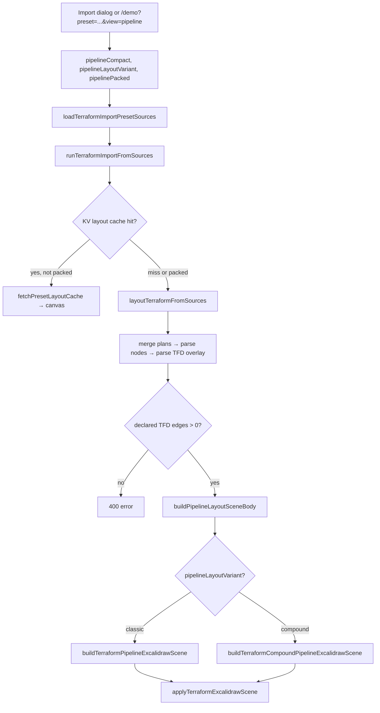

# Terraform pipeline import — agent guide

Start here if you need to understand **how Terraform import works in Pipeline view** and how the **Compact/Full**, **Classic/Compound**, and **Stacked/Packed** toggles combine. This doc is written for another model or agent working in this repo without prior context.

**Deeper dives (read after this):**

| Doc | When |
| --- | --- |
| [terraform-pipeline-compound-import-guide.md](./terraform-pipeline-compound-import-guide.md) | Compound algorithm phases, hull frames, arrow parenting |
| [terraform-pipeline-import-debug-handoff.md](./terraform-pipeline-import-debug-handoff.md) | Import failures, profiler spans, demo URLs |
| [terraform-import-presets-agent-handoff.md](./terraform-import-presets-agent-handoff.md) | Preset DB, source loading, multi-state bundles |
| [staging-extended-localstack-v2-pipeline-handoff.md](./staging-extended-localstack-v2-pipeline-handoff.md) | v2 preset: multi-account TFD, LocalStack export, parity |
| [pipeline-compound-layout-agent-handoff.md](./pipeline-compound-layout-agent-handoff.md) | Compound layout code map + literature refs |

---

## What Pipeline view is

**tfdraw** imports Terraform plan JSON (+ optional state, graph DOT, `.tfd` files) and renders an Excalidraw diagram. Three top-level **views** exist:

| View | Engine | Primary input |
| --- | --- | --- |
| Semantic | Topology layout | Plan graph + AWS placement rules |
| Module | ELK | Module tree from plan |
| **Pipeline** | TFD hop columns | **`.tfd` `->` edges** + plan for resource cards |

**Pipeline view** is a **declared-dataflow layout mode**:

1. **Plan JSON** (+ optional state) → resource nodes, types, attributes
2. **`.tfd` files** → `bind` aliases + `A -> B` declared dataflow edges
3. **Graph.dot** → carried in bundles; pipeline layout uses plan + TFD more than DOT topology

Resources are placed in **horizontal columns (hops)** from resolved `.tfd` edges (blue declared-dataflow arrows). IAM/plan dependency edges may exist but **do not drive column order**.

### Hard requirement

At least one `.tfd` dataflow edge must resolve to plan node keys. Otherwise import fails with HTTP-style **400**:

```text
Pipeline view requires at least one resolved .tfd dataflow edge.
```

---

## Three independent pipeline toggles

When the user selects **Pipeline** in the import dialog (or `view=pipeline` on `/demo`), three sub-options appear. They are **orthogonal** — any combination is valid.

| UI label | Session / code field | Values | Default |
| --- | --- | --- | --- |
| **Detail** | `pipelineCompact` | `true` = Compact, `false` = Full | **Compact** (`true`) |
| **Layout** | `pipelineLayoutVariant` | `classic` \| `compound` | **Classic** |
| **Height** | `pipelinePacked` (+ `pipelinePackedPullLeft`) | Stacked \| Packed \| Packed + pull-left | **Stacked** (`false`) |

**Default import:** Compact + Classic + Stacked.

### Detail: Compact vs Full

Controls **what each pipeline cluster renders at import time**.

| Mode | `pipelineCompact` | Cluster skeleton | Satellites (listeners, target groups, etc.) |
| --- | --- | --- | --- |
| **Compact** | `true` (default) | Primary resource card only via `buildCompactPipelinePrimaryCluster` | Hidden until user clicks cluster → `expandPipelineCluster` |
| **Full** | `false` | Full topology cluster via `buildTopologyPrimaryClusterSkeletonForPipeline` | Rendered inline at import |

Both modes share the same TFD column assignment, lane stacking, and frame hull logic. Compact is the performance/default path for large presets.

**Expand:** `terraformPipelineLayoutExpand.ts` — click a compact primary card to inject satellites in-place without re-running full layout.

### Layout: Classic vs Compound

Controls **Excalidraw frame hierarchy and arrow parenting** after placement. **Does not change TFD column math.**

| Mode | `pipelineLayoutVariant` | Builder | Key difference |
| --- | --- | --- | --- |
| **Classic** | `classic` (default) | `buildTerraformPipelineExcalidrawScene` | TFD grid + topology hull frames; arrows stay at scene root |
| **Compound** | `compound` | `buildTerraformCompoundPipelineExcalidrawScene` | Same placement, plus hierarchical re-anchor, arrow parenting to LCA topology frame, sibling frame connector edges — dragging a region/VPC frame moves resources **and in-group arrows** |

Compound = Classic placement + post-pass for Excalidraw compound semantics. See [terraform-pipeline-compound-import-guide.md](./terraform-pipeline-compound-import-guide.md) for phase-by-phase detail.

### Height: Stacked vs Packed

Controls **vertical compaction** and optional **column slack reuse**. Works for **both** Classic and Compound.

| Mode | `pipelinePacked` | Grid placement | Effect |
| --- | --- | --- | --- |
| **Stacked** | `false` (default) | `placeClustersClassicGrid` | Lanes stack vertically; fan-out targets from the same source share a column |
| **Packed** | `true` | `computePackedDepthShifts` → `applyPackedDepthShifts` → `placeClustersPackedGrid` | Push receive-only groups right; skyline-pack sibling topology boxes in Y; shorter diagram, somewhat wider |
| **Packed + pull-left** | `true` + `pipelinePackedPullLeft: true` | Packed passes + `computePackedPullLeftShifts` between depth shifts and the packed grid | After group shifts, pull each slack cluster to its leftmost TFD-feasible column without growing scene height or width |

Packed (and pull-left) skips the KV layout cache (cache key does not include these flags yet). See **Packed mode** section below.

---

## Combination matrix (2 × 2 × 2)

All eight combinations route through the same import prep, then diverge at `buildPipelineLayoutSceneBody`:

```text
                    ┌──────────── Compact ────────────┐   ┌──────────── Full ─────────────┐
                    │ Classic          Compound       │   │ Classic          Compound      │
Stacked (default)   │ buildTerraform…  buildCompound…  │   │ same builders, compact=false  │
Packed              │ + packed passes  + packed passes │   │ + packed passes               │
```

Scene **meta** records the active flags, e.g.:

```typescript
{
  layoutEngine: "pipeline",
  pipelineVariant: "classic" | "compound",
  pipelineCompact: true | false,
  pipelinePacked?: true,           // when packed
  pipelinePackedApplied?: true,   // when packed layout ran
  pipelinePackedPullLeft?: true,  // when pull-left requested
  pipelinePackedPullLeftApplied?: true, pipelinePackedPullLeftCount?,
  pipelinePackedPullLeftCapped?: true,  // eval budget hit (pulls truncated)
  pipelineClusterCount, pipelineEdgeCount, pipelineColumnCount,
  pipelineTopologyFrameEdgeCount?, // compound only
}
```

---

## End-to-end import flow



**Pipeline layout always runs on the main thread** — not sharded like semantic topology (`layoutTerraformViaWorkers` → `runSequential` for pipeline).

### Code path (in order)

| Step | File | Function / note |
| --- | --- | --- |
| UI toggles | `TerraformImportDialog.tsx` | Detail / Layout / Height sub-buttons when Pipeline selected |
| Session state | `useTerraformImportDialog.ts`, `terraformImportSession.ts` | Options persisted for re-import / view switches |
| View → mode | `terraformPresetImport.ts` | `deriveLayoutModeFromView` → `"pipeline"`; `runTerraformImportWithView` passes pipeline options |
| Load sources | `terraformImportPresetLoader.ts` | plan + dot + tfd from D1 API or disk |
| Scene apply | `terraformSceneApply.ts` | cache lookup; `runTerraformImportFromSources` |
| Layout core | `terraformLayoutCore.ts` | `layoutTerraformFromSources` |
| Variant router | `terraformLayoutCore.ts` | `buildPipelineLayoutSceneBody` picks classic vs compound builder |
| Classic builder | `terraformPipelineLayout.ts` | `buildTerraformPipelineExcalidrawScene` |
| Compound builder | `terraformPipelineLayoutCompound.ts` | `buildTerraformCompoundPipelineExcalidrawScene` |
| Shared prep | `terraformPipelineLayoutShared.ts` | `preparePipelineLayout`, grid placement |
| Packed passes | `terraformPipelineLayoutPacked.ts` | depth shifts + `placeClustersPackedGrid` |
| Canvas | `terraformSceneApply.ts` | `applyTerraformExcalidrawScene` |

### Demo URL params

Parsed by `terraformDemoUrlParams.ts` → `TerraformDemoAutoImport.tsx`:

```text
/demo?preset=staging-extended-localstack-v2&view=pipeline&pipelineVariant=compound&packed=1
```

| Param | Maps to | Notes |
| --- | --- | --- |
| `view=pipeline` | layout mode pipeline | Required for pipeline |
| `pipelineVariant=classic\|compound` | `pipelineLayoutVariant` | Optional; default classic |
| `packed=1\|true` | `pipelinePacked: true` | Optional; default stacked |
| `packedPullLeft=1\|true` | `pipelinePackedPullLeft: true` | Optional; implies `packed=1` unless `packed=0` given |
| _(no param)_ | `pipelineCompact: true` | Compact/Full **not** exposed in demo URL; always compact unless user toggles in dialog |

---

## Inside `layoutTerraformFromSources` (pipeline mode)

Profiler spans run in this order:

| Span | What happens |
| --- | --- |
| `prep.cache` | Fingerprint for merge metadata |
| `merge.plans` | Merge bundles; multi-state namespaces addresses as `stackId::` |
| `parse.nodes` | `buildTerraformLocalImportNodesMap` from plan |
| `parse.tfd` | `applyTfdOverlayToNodes` → `nodes[DECLARED_DATAFLOW_ORDERED_KEY]` |
| `layout.pipeline` | `buildPipelineLayoutSceneBody` → classic or compound builder |

TFD overlay attaches resolved edges under `DECLARED_DATAFLOW_ORDERED_KEY`. Pipeline layout reads that key exclusively for hop ordering.

---

## Two placement dimensions (do not conflate)

Pipeline layout combines **independent** horizontal and vertical semantics:

```text
┌─────────────────────────────────────────────────────────────┐
│  HORIZONTAL (TFD)          │  VERTICAL (topology)          │
│  computeDepths on .tfd       │  laneKey from placement map   │
│  → column index per cluster │  → stacked/packed Y bands     │
│  A -> B ⇒ B right of A      │  account/region/VPC/subnet    │
└─────────────────────────────────────────────────────────────┘
```

| Dimension | Source | Controls |
| --- | --- | --- |
| **TFD columns** | `.tfd` `->` edges, collapsed to primary clusters | `depth`, global `columnX[]` |
| **Topology lanes** | `buildPlacementMap` → `laneKey` | Which Y-band a cluster sits in |

**Design principle:** resource positions are computed on a **global TFD grid** first; topology frames are **hulls drawn around** already-placed clusters.

---

## Shared layout phases (all variants)

Both Classic and Compound builders follow this skeleton:

```text
Phase 0  preparePipelineLayout(nodes, plan, compact)
         ├─ satellite collapse, edge collapse, computeDepths
         ├─ build clusters (compact or full skeleton per cluster)
         └─ computeGlobalColumnX

Phase 0b (packed only)
         computePackedDepthShifts → applyPackedDepthShifts

Phase 1  placeClustersClassicGrid  OR  placeClustersPackedGrid

Phase 2  Topology hull frames
         Classic: emitTopologyContextFrames
         Compound: buildCompoundFramesFromLayoutBoxes

Phase 3  (compound only)
         applyCompoundHierarchicalLayout
         appendPipelineEdgeSkeletons
         appendCompoundTopologyFrameEdgeSkeletons
         assignCompoundEdgeFrameParents

Phase 4  finalizePipelineScene / convertPipelineSkeletonToElements
         mirror labels, AWS icons, visibility, z-order
```

### Lane key (vertical band identity)

```typescript
laneKey(p) = [
  providerFamily,
  accountId,
  region,
  vpcId ?? "",
  subnetSignature ?? "",
].join("\0");
```

---

## Packed mode (detail)

**File:** `terraformPipelineLayoutPacked.ts` · **Default:** off · **UI:** Height → Packed · **URL:** `&packed=1`

Two extra passes between prep and frame emission, replacing `placeClustersClassicGrid` (plus an opt-in third — see **Pull-left** below):

1. **`computePackedDepthShifts` + `applyPackedDepthShifts`** — group-uniform rightward depth shifts, processed bottom-up (lanes under VPC → VPCs under region → regions under account → accounts under provider). Targets with TFD edges from siblings shift past those siblings' columns. Outgoing edges with no slack join a **closure** that shifts as one block. Edge direction `A -> B ⇒ depth(A) < depth(B)` always holds; used depths are compacted to contiguous columns; wider column gap (`PACKED_COLUMN_GAP`) so sibling region hulls can share a Y band.

2. **`placeClustersPackedGrid`** — hierarchical Y re-packing. Sibling boxes at every topology level are skyline-packed in Y; boxes with horizontally disjoint inflated rects share a Y band.

**Consequences:**

- Shorter, somewhat wider diagram (staging-extended-localstack-v2: ~−58% height, ~+96% width)
- Fan-out targets in different lanes may land in different columns (stacked invariant "fan-out shares a column" does not apply)
- Packed preset imports **skip KV layout cache**

**Meta when packed:** `pipelinePacked`, `pipelinePackedApplied`, `pipelinePackedDepthShiftCount`, `pipelinePackedGroupShiftCount`

### Pull-left (opt-in pass 1.5 inside packed)

**Flag:** `pipelinePackedPullLeft` · **UI:** Height → "Packed + pull-left" · **URL:** `&packedPullLeft=1` · **Default:** off (packed output is byte-identical unless enabled)

The group-uniform shifts above move whole units, so members whose own TFD predecessors are shallow get dragged right of their lower bound (`max(depth(pred)) + 1`). Example: `aws_sns_topic.ops` in v2 has lower bound ~10 (forced by `ingest_dlq_alarm_ext -> ops_topic`) but the security-account unit shift carries it much deeper.

`computePackedPullLeftShifts` (runs after `applyPackedDepthShifts`, before `placeClustersPackedGrid`):

1. Sweeps clusters in ascending depth, lower bound computed at visit time — pulls cascade through `A -> B -> C` chains and fan-outs within one sweep.
2. For each slack cluster, scans candidate columns leftmost-first; a candidate is accepted only if a skeleton-free re-measure of the pack tree (`measurePackedSceneForDepths` — same lane cursor math + skyline pack, no element work) does not grow global width **and no pack node grows in height** (`fitsWithinBaseline` — every lane/vpc/region/account/provider node, not just the root). The per-node check matters: a root-only guard lets local regressions hide inside band slack — a region whose sibling pins the account band can double in height (receiver lanes pulled back over sibling lanes' spans and stacked) without moving the global bounds.
3. Up to 4 sweeps (later sweeps catch pulls that become feasible after earlier accepts); eval budget scales with clusterCount × columnCount, `pipelinePackedPullLeftCapped: true` in meta if hit.
4. Contiguous depth re-compaction + the same `depth(source) < depth(target)` invariant check as the shift pass (violation ⇒ pass returns no shifts).

v2 result (compound + packed): 41 pulls, no topology frame grows in height, `aws_sns_topic.ops` x 13,712 → 6,666 px.

**Tests:** `terraformPipelineLayoutPacked.test.ts`, `terraformPipelineLaneDebug.test.ts`

---

## Classic vs Compound vs Packed (summary)

| Aspect | Classic + Stacked | Compound + Stacked | Either + Packed |
| --- | --- | --- | --- |
| TFD column assignment | ✓ | ✓ (identical) | May shift depths right |
| Topology hull frames | ✓ | ✓ | ✓, Y-skyline packed |
| Drag frame moves in-group arrows | — | ✓ | Compound only |
| Sibling topology frame connectors | — | ✓ | Compound only |
| KV layout cache | ✓ | ✓ | Skipped |
| Default | **yes** | no | no |

---

## File map

| File | Role |
| --- | --- |
| `terraformLayoutCore.ts` | Import orchestration; `buildPipelineLayoutSceneBody` routes variant + options |
| `terraformPipelineLayout.ts` | Classic builder |
| `terraformPipelineLayoutCompound.ts` | Compound builder |
| `terraformPipelineLayoutShared.ts` | Prep, depths, lanes, classic grid, constants |
| `terraformPipelineLayoutPacked.ts` | Packed depth shifts + packed grid |
| `terraformPipelineLayoutExpand.ts` | Compact expand/collapse on click |
| `terraformPipelineTopologyFrames.ts` | Hull frames, topology paths, LCA |
| `terraformPipelineLayoutCompoundHierarchy.ts` | Compound re-anchor, arrow parenting |
| `terraformPipelineLayoutCompoundSiblingEdges.ts` | Sibling topology frame connectors |
| `terraformPipelineLayoutFinalize.ts` | Edge append, convert, decorations |
| `terraformDeclaredDataFlow.ts` | TFD parse + `DECLARED_DATAFLOW_ORDERED_KEY` |
| `terraformSceneApply.ts` | Cache + apply to canvas |
| `terraformPresetImport.ts` | Preset import entry; threads pipeline options |

---

## Reference preset: `staging-extended-localstack-v2`

Use this preset as the **primary pipeline stress test**. It is the largest single-root builtin (~11 MB plan), models **four LocalStack accounts** (management, workload, ingestion, security) via Organizations, and ships a ~287-line `pipeline.tfd` with org lanes plus extended platform dataflow (lake, Kinesis, EKS, audit). Layout changes should be validated here before smaller presets.

**Full preset detail:** [staging-extended-localstack-v2-pipeline-handoff.md](./staging-extended-localstack-v2-pipeline-handoff.md)

### What you should see on the canvas

| Region of diagram | TFD / plan source | Layout behavior |
| --- | --- | --- |
| **Left — org column** | `organization_root → OU → account` binds (lines 230–242 in `pipeline.tfd`) | Management account; OUs fan out to workload / ingestion / security account entry points |
| **Workload trunk** | ECS producer, SQS, api1–api16 cascade | Classic TFD hop columns; resources in workload-account VPC lanes |
| **Ingestion lane** | `ingestion_account →` lake, Kinesis, EKS, Glue | Separate account + ingestion VPC CIDRs (`ingestion-network.tf`) |
| **Security / audit** | `security_account →` CloudTrail, Config, audit bucket, ops SNS | Often fewer hops; may share Y bands with packed layout |
| **Blue arrows** | Resolved `.tfd` `->` edges | Declared dataflow layer (on when TFD imported) |
| **Hull frames** | `buildPlacementMap` topology | Nested account → region → VPC → subnetZone boxes around clusters |

**Single-bundle rule:** plan node keys are **unqualified** (`aws_organizations_organization.this`). TFD binds use prefix `staging-extended-localstack-v2::`; overlay strips the prefix at resolve time.

### View layouts in the browser

**Prerequisites:** dev server with preset API (not static preview).

```bash
yarn seed:terraform-presets   # once, if dev DB empty
yarn start
```

**Import dialog:**

1. `Ctrl/Cmd+Shift+K` → Import Terraform
2. Select **Staging Extended LocalStack v2**
3. View: **Pipeline**
4. Toggle **Detail** (Compact/Full), **Layout** (Classic/Compound), **Height** (Stacked/Packed/Packed + pull-left)
5. **Load preset & import**

After import, enable **declared dataflow** in edge layer controls if blue TFD arrows are hidden. With Compound, drag an account or region frame — in-group resources and TFD arrows should move together.

**Demo deep links** (auto-import on load):

| URL | Layout |
| --- | --- |
| `/demo?preset=staging-extended-localstack-v2` | Default pipeline (Compact + Classic + Stacked) |
| `/demo?preset=staging-extended-localstack-v2&view=pipeline` | Same (explicit) |
| `/demo?preset=staging-extended-localstack-v2&view=pipeline&pipelineVariant=compound` | Compound frames + arrow parenting |
| `/demo?preset=staging-extended-localstack-v2&view=pipeline&packed=1` | Packed height compaction |
| `/demo?preset=staging-extended-localstack-v2&view=pipeline&pipelineVariant=compound&packed=1` | Compound + Packed (common layout experiment) |
| `/demo?preset=staging-extended-localstack-v2&view=pipeline&pipelineVariant=compound&packedPullLeft=1` | Compound + Packed + pull-left compaction |

Compact/Full is **dialog-only** (no demo URL param); default is Compact.

Avoid `yarn build:preview` for preset testing — static preview has no `/api/terraform-import-presets`.

### Read scene meta after import

In dev, filter console for `[terraform:local-parse]` phase `pipelineLayout`. The `meta` object records layout choices and counts:

```typescript
{
  layoutEngine: "pipeline",
  pipelineVariant: "classic" | "compound",
  pipelineCompact: true | false,
  pipelineClusterCount,      // collapsed TFD clusters
  pipelineEdgeCount,         // declared dataflow edges used
  pipelineColumnCount,       // max depth + 1
  pipelineTopologyFrameEdgeCount?,  // compound sibling frame connectors
  pipelinePackedApplied?,    // when Height = Packed
  pipelinePackedDepthShiftCount?,
  pipelinePackedGroupShiftCount?,
}
```

**Baseline canvas bounds** (from lane debug tests, Compact + Classic):

| Mode | Approx height | Approx width | Notes |
| --- | --- | --- | --- |
| Stacked | ~18,500 px | ~8,000 px | Tall: many single-cluster lanes (account×region×VPC×subnet) |
| Packed | ~7,750 px (−58%) | ~15,700 px (+96%) | Receiver regions sit beside sources |

Use these as regression anchors when changing layout code.

### Debug workflow (fastest → slowest)

#### 1. Lane height diagnostic (no browser)

Prints lane breakdown, scene bounds, frame counts, and interpretation:

```bash
VITEST_TERRAFORM_VERBOSE=1 yarn vitest run \
  packages/excalidraw/components/terraformPipelineLaneDebug.test.ts \
  -t "staging-extended-localstack-v2"
```

Look for console block `[pipeline:lane-height-diagnostic]`:

- `heightDrivers.laneCount` — unique account+region+VPC+subnet lanes (main height driver)
- `heightDrivers.singleClusterLaneCount` — lanes with one cluster (often inflate height)
- `heightDrivers.approxLaneStackOverheadPx` — minimum Y overhead from lane gaps
- `topLanesByClusterCount` — which topology bands hold the most clusters
- `regionFramesTopToBottom` — region hull Y order

Compare stacked vs packed:

```bash
VITEST_TERRAFORM_VERBOSE=1 yarn vitest run \
  packages/excalidraw/components/terraformPipelineLaneDebug.test.ts \
  -t "packed layout option"
```

#### 2. TFD bind resolution (no layout)

Verifies `pipeline.tfd` binds match the committed plan in the test fixture DB:

```bash
yarn vitest run packages/excalidraw/components/terraformPipelineTfdBind.test.ts \
  -t "staging-extended-localstack-v2"
```

Regression test **`resolves multi-account Organizations ingestion and security paths`** asserts:

- Zero `errors` / `warnings` from `applyDeclaredDataFlowFromMany`
- `edges.length > 40`
- Org → OU, ingestion → `ingest_fifo`, security → CloudTrail edges present
- Full pipeline layout produces elements with correct frame roles on EKS and CloudTrail

If binds fail after re-exporting plan, fix `packages/backend/terraform/staging-extended-localstack-v2/pipeline.tfd` and re-hydrate.

#### 3. Packed / compound regression

```bash
yarn vitest run packages/excalidraw/components/terraformPipelineLayoutPacked.test.ts \
  -t "staging-extended-localstack-v2"

yarn vitest run packages/excalidraw/components/terraformPipelineLayoutCompound.test.ts
```

#### 4. Browser console trace

In `yarn start` (DEV), filter console:

```text
terraform:local-parse
```

Phases: `init` → `planParsed_through_moduleTree` → `pipelineLayout` (includes `elementCount`, `meta`).

Enable hierarchical profiler:

```js
localStorage.setItem("terraformImportProfile", "1");
// reload, import v2 preset, filter console for [terraform:profile]
```

Sort spans by `selfMs`; pipeline bottlenecks are usually `parse.nodes` (large plan) and `layout.pipeline`.

#### 5. Inspect preset sources API

```bash
curl -sS http://localhost:3000/api/terraform-import-presets/staging-extended-localstack-v2/sources \
  | jq '{bundles: (.sources.planDotBundles | length), tfd: (.sources.tfdTexts | length)}'
```

Expect **1** plan bundle and **1** TFD text block.

#### 6. Re-export plan + hydrate (when Terraform changes)

v2 `plan.json` / `graph.dot` are gitignored; CI uses the committed SQLite fixture.

```bash
cd packages/backend/terraform/staging-extended-localstack-v2
./scripts/start-localstack.sh          # default edge port 4568
./scripts/apply-and-export.sh
./scripts/parity-check.sh              # optional: vs 25-stack multi-state

yarn hydrate:terraform-preset staging-extended-localstack-v2
yarn export:terraform-presets-test-db  # refresh CI fixture
```

Then re-run TFD bind + lane debug tests.

### Understand `pipeline.tfd` for v2

File: `packages/backend/terraform/staging-extended-localstack-v2/pipeline.tfd` (on disk → hydrated into preset DB).

| Section | Lines (approx) | Content |
| --- | --- | --- |
| Hub + APIs | 1–92 | Network, ECS trunk, api1–api16 (same fanout as v1) |
| v2 resource binds | 93–161 | Organizations, accounts, SCPs, lake/stream/EKS/security |
| Base dataflow | 163–228 | Trunk → APIs → cascade |
| **Org dataflow** | 230–237 | `organization_root → OUs → accounts` (v2-only) |
| Extended lanes | 239–287 | Account entry points → lake → streams → EKS → audit → alarms |

Example org edges:

```text
organization_root -> workloads_ou, data_platform_ou, security_ou
workloads_ou -> workload_account
data_platform_ou -> ingestion_account
security_ou -> security_account
workload_account -> ecs_producer, queue_consumer, ecs_alb
ingestion_account -> ingest_fifo_queue, kinesis_*, eks_cluster, ...
security_account -> cloudtrail_org, config_recorder, audit_bucket, ops_topic
```

### Common v2 failures

| Symptom | Likely cause | Fix |
| --- | --- | --- |
| Preset missing in UI | No API / stale DB | `yarn start`; `yarn seed:terraform-presets` |
| 400: no resolved TFD edges | Bind mismatch vs plan | Re-export; fix `pipeline.tfd`; run TFD bind test |
| Double path `.../v2/v2/plan.json` | Loader double-prefix | `isRootLevelArtifact` in `terraformImportPresetLoader.ts` |
| Semantic import hangs | ~11 MB plan | Use pipeline view for smoke tests |
| Packed looks like stacked | KV cache returned stacked scene | Packed skips cache — confirm `pipelinePacked: true` in meta |
| CI fails, local passes | Stale test fixture | Re-hydrate + `yarn export:terraform-presets-test-db` |
| Apply fails on port 4566 | Wrong LocalStack | v2 defaults to **4568** (`start-localstack.sh`) |

---

## Debugging checklist

| Symptom | Check |
| --- | --- |
| 400 no TFD edges | `.tfd` binds resolve to plan addresses? `parse.tfd` span |
| Wrong column order | `computeDepths`, `collapsedEdges` in prep |
| Wrong lane/box | cluster `placement`, `laneKey` grouping |
| Compact cluster empty on click | `expandPipelineCluster`, prep cache |
| Arrows don't move with frame | Compound: arrow in LCA frame `children` before convert |
| Packed looks like stacked | `pipelinePacked: true`? cache skipped? |
| Cached layout ignores packed toggle | Expected — packed bypasses cache |
| Classic vs Compound mismatch | `roleChain` should match; x/y may differ (re-anchor) |

### Tests

```bash
# General pipeline layout
yarn vitest run packages/excalidraw/components/terraformPipelineLayout.test.ts
yarn vitest run packages/excalidraw/components/terraformPipelineLayoutCompound.test.ts
yarn vitest run packages/excalidraw/components/terraformPipelineLayoutPacked.test.ts

# v2 preset diagnostics (preferred stress test)
VITEST_TERRAFORM_VERBOSE=1 yarn vitest run \
  packages/excalidraw/components/terraformPipelineLaneDebug.test.ts \
  -t "staging-extended-localstack-v2"

yarn vitest run packages/excalidraw/components/terraformPipelineTfdBind.test.ts \
  -t "staging-extended-localstack-v2"
```

### Repo search

```bash
yarn repo-rag:query "pipeline import compact compound packed" --top 8 --json
yarn repo-rag:query "buildPipelineLayoutSceneBody" --source-type terraform --json
```

See [.agents/skills/repo-rag/SKILL.md](../.agents/skills/repo-rag/SKILL.md).

---

## Constraints (do not violate)

1. **TFD precedence** for column order (unless packed depth shifts apply)
2. **Acyclic hops** — `depth(B) >= depth(A) + 1` for `A -> B` in stacked mode
3. **Truthful topology** from `buildPlacementMap`, not invented
4. **Compact mode default** — compound and packed must work in compact + full
5. **`terraformLayoutCore` must not import UI** — dependency-cruiser enforced

---

## Not implemented yet

| Feature | Status |
| --- | --- |
| Re-import from `terraformCompoundLocal` | metadata written, not read back |
| `pipelineCompact` in demo URL | only `pipelineVariant`, `packed`, `packedPullLeft` exposed |
| Packed / pull-left flags in KV layout cache key | packed (and pull-left) imports skip cache instead |
| Sibling nudge on cluster expand in packed scenes | expand grows in place (same as classic) |
