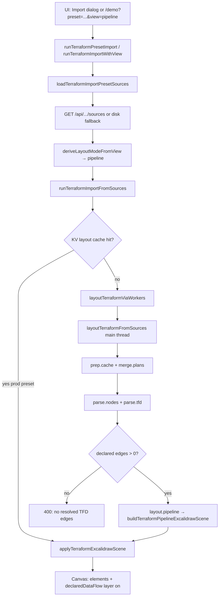

# Pipeline view import — agent handoff (flow + debugging)

Guide for another agent working on **Terraform import → pipeline layout → Excalidraw canvas**, or debugging why pipeline import fails / looks wrong.

**Start here for the full pipeline picture:** [terraform-pipeline-import-agent-guide.md](./terraform-pipeline-import-agent-guide.md) (Compact/Full, Classic/Compound, Stacked/Packed)

**Compound algorithm detail:** [terraform-pipeline-compound-import-guide.md](./terraform-pipeline-compound-import-guide.md)

Related docs:

- [terraform-import-presets-agent-handoff.md](./terraform-import-presets-agent-handoff.md) — preset DB, catalog, shared layout phases
- [staging-extended-localstack-pipeline-handoff.md](./staging-extended-localstack-pipeline-handoff.md) — largest single-root preset + `pipeline.tfd` lanes

---

## What “pipeline view” is

Pipeline view is a **declared-dataflow layout mode**. It reads:

1. **Terraform plan JSON** (+ optional state) → resource nodes
2. **`pipeline.tfd`** (or other `.tfd` files) → `bind` aliases + `->` edges
3. **Graph.dot** (carried in bundles; pipeline layout uses plan + TFD more than dot topology)

It arranges resources in **columns/hops** following resolved `.tfd` edges (blue declared dataflow). IAM/plan dependency edges may still exist but pipeline placement is driven by TFD.

**Hard requirement:** at least one `.tfd` dataflow edge must resolve to plan node keys. Otherwise import returns HTTP-style **400**:

```text
Pipeline view requires at least one resolved .tfd dataflow edge.
```

---

## End-to-end flow



### Entry points (code)

| Step | Module | Function |
| --- | --- | --- |
| Preset import | [`terraformPresetImport.ts`](../packages/excalidraw/components/terraformPresetImport.ts) | `runTerraformPresetImport` |
| View → mode | same | `deriveLayoutModeFromView` → `"pipeline"` when view is pipeline and plan/state exists |
| Load sources | [`terraformImportPresetLoader.ts`](../packages/excalidraw/components/terraformImportPresetLoader.ts) | `loadTerraformImportPresetSources` |
| Scene + cache | [`terraformSceneApply.ts`](../packages/excalidraw/components/terraformSceneApply.ts) | `runTerraformImportFromSources` |
| Layout router | [`terraformLayoutWorkerClient.ts`](../packages/excalidraw/components/terraformLayoutWorkerClient.ts) | `layoutTerraformViaWorkers` — **pipeline always main thread** |
| Core layout | [`terraformLayoutCore.ts`](../packages/excalidraw/components/terraformLayoutCore.ts) | `layoutTerraformFromSources` |
| Pipeline scene | [`terraformPipelineLayout.ts`](../packages/excalidraw/components/terraformPipelineLayout.ts) | `buildTerraformPipelineExcalidrawScene` |
| TFD overlay | [`terraformDeclaredDataFlow.ts`](../packages/excalidraw/components/terraformDeclaredDataFlow.ts) | `applyDeclaredDataFlowFromMany` |
| Apply to canvas | [`terraformSceneApply.ts`](../packages/excalidraw/components/terraformSceneApply.ts) | `applyTerraformExcalidrawScene` |

---

## Phase-by-phase (what happens inside `layoutTerraformFromSources`)

When `layoutMode === "pipeline"`, these profiler spans run in order:

| Span | What it does |
| --- | --- |
| `prep.cache` | Build prep cache fingerprint (merge metadata) |
| `merge.plans` | Merge `planDotBundles`; multi-state namespaces addresses as `stackId::`; single-root leaves bare keys |
| `parse.nodes` | `buildTerraformLocalImportNodesMap` from plan + adjacency |
| `parse.tfd` | `applyTfdOverlayToNodes` — parse binds/edges, attach to `nodes[DECLARED_DATAFLOW_ORDERED_KEY]` |
| `layout.pipeline` | `buildPipelineLayoutSceneBody` → `buildTerraformPipelineExcalidrawScene` |

Inside `buildTerraformPipelineExcalidrawScene` (simplified):

1. Collect declared edges from nodes map
2. Build pipeline clusters / columns from edge hop order
3. Place primary resource cards + satellite companions (registry-driven)
4. Emit skeleton → `convertToExcalidrawElements`
5. `mirrorAndDetachTerraformResourceLabels` + AWS icons + edge binding repair

Scene **meta** includes `layoutEngine: "pipeline"`, plus counts like `pipelineClusterCount`, `pipelineEdgeCount`, `pipelineColumnCount`.

---

## How to view pipeline import (human or agent)

### Browser — dev server (presets + API)

```bash
yarn seed:terraform-presets   # once, if dev DB empty
yarn start
```

1. Open **Import Terraform** (`Ctrl/Cmd+Shift+K`)
2. Pick a builtin preset (all three default to pipeline)
3. Select **Pipeline** view
4. **Load preset & import**

**Do not use `yarn build:preview` for preset testing** — static `vite preview` has no `/api/terraform-import-presets` (see general handoff doc).

For production-like local preview with Functions:

```bash
yarn build:pages
npx wrangler pages dev ./excalidraw-app/build
```

### Demo deep links

| URL | Expected |
| --- | --- |
| `/demo?preset=staging-multi-state-expanded` | Pipeline (25 bundles) |
| `/demo?preset=staging-localstack` | Pipeline (~722 elements) |
| `/demo?preset=staging-extended-localstack` | Pipeline (extended lanes) |
| `&view=semantic` or `&view=module` | Other layout engines (not pipeline) |

### After import — canvas layers

When `.tfd` text was imported, `enableDeclaredDataFlow` is true and **declared dataflow edges** (blue) are pinned visible via `terraformEdgeLayerPins.declaredDataFlow`.

Use the edge layer controls in the UI to toggle dependency vs declared dataflow if edges seem missing.

---

## How to debug pipeline import

### 1. Browser console — dev parse trace

In **`yarn start` (DEV only)**, `layoutTerraformFromSources` logs phases prefixed with:

```text
[terraform:local-parse]
```

Watch for objects with `phase`:

- `init` — bundle count, plan loaded
- `planParsed_through_moduleTree` — nodes map built
- `pipelineLayout` — `elementCount`, `meta` after pipeline layout

Open DevTools → Console, filter `terraform:local-parse`.

### 2. Browser — hierarchical profiler

Enable in dev:

```js
localStorage.setItem("terraformImportProfile", "1");
// reload, then import again
```

Or set env `VITE_TERRAFORM_IMPORT_PROFILE=1` when starting dev.

After import, check console for `[terraform:profile]` table — sort by `selfMs` to find slow spans (`parse.nodes`, `layout.pipeline`, etc.).

Programmatic summary (devtools console after import in dev):

```js
// only works if profiler was enabled during import
import { terraformImportProfilerSummary } from "@excalidraw/excalidraw/components/terraformImportProfiler";
terraformImportProfilerSummary();
```

### 3. Vitest — TFD binds without browser

Fastest way to verify **plan + pipeline.tfd alignment** before running full layout:

```bash
yarn vitest run packages/excalidraw/components/terraformPipelineTfdBind.test.ts
```

Pattern used in tests:

```ts
import { getTerraformImportPresetSourcesFromDb } from "../../../excalidraw-app/dev/terraformImportPresetDb.mjs";
import { buildTerraformLocalImportNodesMap } from "./terraformPlanParsing";
import { applyDeclaredDataFlowFromMany } from "./terraformDeclaredDataFlow";
import { layoutTerraformViaWorkers } from "./terraformLayoutWorkerClient";

const sources = getTerraformImportPresetSourcesFromDb("staging-localstack");
// build nodes from sources.planDotBundles[0]...
const { edges, errors, warnings } = applyDeclaredDataFlowFromMany(
  nodes,
  sources.tfdTexts,
  sources.tfdLabels,
);
expect(errors).toEqual([]); // bind resolution failures
expect(edges.length).toBeGreaterThan(0);

const body = await layoutTerraformViaWorkers(
  {
    planDotBundles: sources.planDotBundles,
    states: [],
    stateLabels: [],
    tfdTexts: sources.tfdTexts,
    tfdLabels: sources.tfdLabels,
  },
  { semanticLayout: false, layoutMode: "pipeline" }, // NOT pipelineLayout: true
);
expect(body.elements.length).toBeGreaterThan(0);
```

TFD validation helpers (cycles, orphaned binds): [`terraformTfdValidation.ts`](../packages/excalidraw/components/terraformTfdValidation.ts) + [`terraformTfdValidation.test.ts`](../packages/excalidraw/components/terraformTfdValidation.test.ts).

### 4. Vitest — profiler spans per view

```bash
VITEST_TERRAFORM_PROFILE=1 yarn vitest run packages/excalidraw/components/terraformImportPerf.views.test.ts
```

Captures span snapshots for semantic vs **pipeline** vs module.

### 5. Inspect preset sources API

Dev server:

```bash
curl -sS http://localhost:3000/api/terraform-import-presets/staging-localstack/sources | jq '.sources | keys'
curl -sS http://localhost:3000/api/terraform-import-presets/staging-localstack/sources | jq '.sources.planDotBundles | length'
curl -sS http://localhost:3000/api/terraform-import-presets/staging-localstack/sources | jq '.sources.tfdTexts | length'
```

Production / preview:

```bash
curl -sS "https://tfdraw.dev/api/terraform-import-presets/staging-localstack/sources" | head -c 500
```

### 6. Layout cache (production)

For builtin presets on **master**, pipeline scenes may come from **KV layout cache** (`fetchPresetLayoutCache` in `terraformSceneApply.ts`) instead of client layout.

If prod demo looks stale after TFD changes:

1. Push preset data to D1 if needed
2. Purge + re-seed layout cache (see [`cloudflare-deploy.md`](./cloudflare-deploy.md))

Local dev **always** runs client layout unless you mock the cache endpoint.

### 7. Import dialog progress

During import, the dialog shows `Importing… {layoutProgress}` from `onLayoutProgress` (semantic parallel jobs only; pipeline is single main-thread pass so progress may be brief).

---

## TFD resolution cheat sheet

| Concept | Detail |
| --- | --- |
| Bind syntax | `bind alias = stack-id::module.foo.aws_lambda_function.bar` |
| Edge syntax | `alias_a -> alias_b` or `alias_a -> b, c` |
| Single-root presets | Prefix is `staging-localstack::` / `staging-extended-localstack::`; plan keys are **unqualified** |
| Multi-state presets | Prefix is `{stack-dir}::`; plan keys are **qualified** after `namespacePlanDotBundles` |
| Resolution | `resolveTerraformPlanNodeKey(nodes, address)` in [`terraformPlanParsing.tsx`](../packages/excalidraw/components/terraformPlanParsing.tsx) |
| Stored edges | `nodes[DECLARED_DATAFLOW_ORDERED_KEY]` after `applyTfdOverlayToNodes` |

**Debug bind mismatch:** run `applyDeclaredDataFlowFromMany` and read `errors` — each entry names the bind alias and target address that failed to resolve.

**Debug orphaned binds:** `detectOrphanedBinds()` in `terraformTfdValidation.ts`.

**Debug cycles:** `detectTfdGraphCycles()` — pipeline layout assumes DAG-like hops.

---

## Common failures

| Symptom | Cause | Fix |
| --- | --- | --- |
| Empty preset dropdown | No API (`build:preview`) | `yarn start` or `wrangler pages dev` |
| 400: no resolved `.tfd` edges | Binds don’t match plan addresses | Fix `pipeline.tfd`; run TFD bind test |
| 400: no managed resources | Empty/corrupt plan in DB | Re-hydrate preset; re-export test fixture |
| Missing preset file double path | `stack.id/` prefixed twice on single-root | `isRootLevelArtifact` in loader |
| Empty canvas, no error in test | Used `pipelineLayout: true` | Use `layoutMode: "pipeline"` |
| Pipeline flat / one column | TFD edges not resolving | Check `errors` from `applyDeclaredDataFlowFromMany` |
| Prod demo wrong, local OK | Stale KV layout cache | Re-seed cache on master deploy |
| Semantic works, pipeline fails | Pipeline **requires** TFD edges | Add/fix `pipeline.tfd` edges |
| Import slow | Large monolithic plan | Expected; profile with `layout.pipeline` span |

---

## Builtin presets (pipeline defaults)

| Preset ID | Bundles | pipeline.tfd | Notes |
| --- | --- | --- | --- |
| `staging-multi-state-expanded` | 25 | Root `pipeline.tfd` + per-stack `use` in DB | Stack-qualified binds |
| `staging-localstack` | 1 | `staging-localstack/pipeline.tfd` | Base API/trunk topology |
| `staging-extended-localstack` | 1 | `staging-extended-localstack/pipeline.tfd` | + lake/EKS/security lanes |

---

## Key files index

| Area | Path |
| --- | --- |
| View → layout mode | `packages/excalidraw/components/terraformPresetImport.ts` |
| Import orchestration | `packages/excalidraw/components/terraformSceneApply.ts` |
| Layout router | `packages/excalidraw/components/terraformLayoutWorkerClient.ts` |
| Merge + pipeline branch | `packages/excalidraw/components/terraformLayoutCore.ts` |
| Pipeline scene builder | `packages/excalidraw/components/terraformPipelineLayout.ts` |
| TFD parse/overlay | `packages/excalidraw/components/terraformDeclaredDataFlow.ts` |
| TFD validation | `packages/excalidraw/components/terraformTfdValidation.ts` |
| Import profiler | `packages/excalidraw/components/terraformImportProfiler.ts` |
| UI hook | `packages/excalidraw/components/useTerraformImportDialog.ts` |
| Preset loader | `packages/excalidraw/components/terraformImportPresetLoader.ts` |
| Bind regression tests | `packages/excalidraw/components/terraformPipelineTfdBind.test.ts` |
| Pipeline unit tests | `packages/excalidraw/components/terraformPipelineLayout.test.ts` |
| Perf / spans | `packages/excalidraw/components/terraformImportPerf.views.test.ts` |

---

## Minimal debug playbook (copy for agents)

1. **Confirm sources load:** `curl .../api/terraform-import-presets/{id}/sources` → `planDotBundles.length >= 1`, `tfdTexts.length >= 1`
2. **Confirm TFD resolves:** run `terraformPipelineTfdBind.test.ts` for that preset id
3. **Confirm layout produces elements:** `layoutTerraformViaWorkers(..., { layoutMode: "pipeline" })`
4. **If UI-only bug:** `yarn start`, enable profiler + `[terraform:local-parse]` console
5. **If prod-only bug:** check KV layout cache + D1 preset data age

---

## Changelog

- **2026-06-03** — Initial pipeline import + debugging handoff (complements preset-specific docs).
