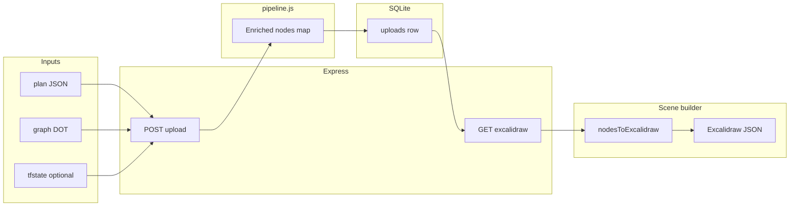

# Terraform → Excalidraw: backend architecture

This document describes how the **`@excalidraw/backend`** package turns Terraform/OpenTofu artifacts into an **Excalidraw scene** (JSON the browser loads into the canvas). The React app only uploads files and calls `GET /terraform/upload/:id/excalidraw`; all graph semantics and layout happen here.

---

## End-to-end flow

1. **Upload** — Client sends multipart: `planFile` (from `terraform show -json`), `dotFile` (`terraform graph -type=plan`), optional `stateFile`.
2. **Pipeline** — Server parses plan + DOT, walks and mutates a single in-memory **`nodes` object** (see below).
3. **Persist** — Serialized `nodes` JSON is stored in SQLite (`graph.db`, `uploads` table).
4. **Export** — `GET /terraform/upload/:id/excalidraw` loads that JSON and runs **`nodesToExcalidraw(nodes)`**, which returns Excalidraw v2 `{ elements, appState, … }`.

---

## The three inputs and what each contributes

| Input | Role |
| --- | --- |
| **Plan JSON** | Source of truth for resource addresses, `resource_changes`, configuration/module metadata, and (via `prior_state`) dependency hints. Seeds each Terraform address as a **node** with `resources[address] = resource_change`. |
| **DOT graph** | Parsed with `graphlib-dot` into an **adjacency list**. Used to compute **`edges_new`** (planned dependency reachability). Plan addresses may include `[index]`; DOT often uses stripped ids — the pipeline reconciles via **`stripIndexes`** / **`resolveCanonicalNodePath`**. |
| **State JSON (optional)** | Merges **live `values`**, instance **dependencies**, and metadata into existing nodes and **`edges_existing`**. |

Without state, you still get plan-driven nodes and DOT edges; with state, ARNs, VPC IDs, and `depends_on` fidelity improve.

---

## The `nodes` map (pipeline output)

After [`pipeline.js`](pipeline.js) finishes, **`nodes`** is a plain object:

- **Keys** — Terraform addresses (`module.x.aws_lambda_function.y`, etc.) and synthetic **`module.path`** entries for module-call vertices.
- **Values** — Objects with:
  - **`resources`** — Plan/state resource payloads keyed by address.
  - **`edges_new`** — Strings: other node keys reachable from DOT adjacency (BFS with module boundaries as **stop points** so the graph does not explode through every child resource).
  - **`edges_existing`** — Strings: prior-state / `depends_on` style edges.
  - **`edges_data_flow`** — Objects `{ target, type, label, origin, detail }` for **semantic** edges (IAM policy reads/writes, integrations, Lambda triggers, etc.), synthesized from resource attributes—not only from DOT.
  - **`terraform_module`** — Optional module chain metadata (source/version) from plan configuration.
  - Optional enrichment fields from [`enrichment.js`](enrichment.js).

Keys starting with **`__`** are **pipeline metadata** (not Terraform addresses), e.g. **`__networkingFacetStore`**: VPC/subnet facet blobs captured **before** low-level routing resources are removed.

The pipeline **prunes** the graph (omit non-allowlisted data sources, VPC plumbing types, orphans, tag-based `visual=ignore`, etc.) so the Excalidraw stage receives a **visual-sized** graph.

---

## Pipeline stages (conceptual order)

The exact sequence matches [`index.js`](index.js) `POST /terraform/upload`. In words:

1. **Load plan** — Build initial nodes from `resource_changes`.
2. **Merge state** — Augment with tfstate instances and dependency edges.
3. **Module helpers** — Inject synthetic **`terraform_module`** nodes; attach **`applyModuleMetadata`** from plan config.
4. **DOT edges** — **`buildNewEdges`** fills **`edges_new`** from the DOT adjacency list.
5. **Diffs & existing edges** — **`computeResourceDiffs`**, **`buildExistingEdges`** from `prior_state`.
6. **Refinements** — e.g. **CloudWatch metric alarms** get **`refineCloudWatchMetricAlarmEdges`** so alarms point at meaningful targets instead of noisy DOT fans. 6b. **Structural shortcut pruning** — **`pruneRedundantStructuralEdges`** removes a directed dependency edge `u → v` when `v` is already reachable from `u` via other structural edges (`edges_new` ∪ `edges_existing`). Terraform’s expanded DOT links distant modules through vars/outputs (e.g. Lambda env → queue URL → KMS key id); pruning drops those misleading shortcuts while keeping the intermediate chain for infra-style diagrams. **`edges_data_flow` is not modified.**
7. **Semantic data-flow** — **`buildDataFlowEdges`** derives integration/IAM-style edges into **`edges_data_flow`**.
8. **External stubs** — **`externalResources`** adds placeholder nodes for missing edge endpoints so layout stays connected.
9. **VPC facets** — **`extractVpcNetworkingFacetStore`** runs on the **full** graph, then **`omitVpcPlumbingNodes`** drops route-table-only noise that would clutter the diagram.
10. **Cleanup** — Orphans, IAM noise filters (`cleanUpRoleLinks`), optional **`filterVisualIgnore`**.
11. **Enrichment** — Mock (or future real) **`mockLanggraphEnrichment`** + **`applyEnrichment`** for panel text.

---

## From `nodes` to Excalidraw layout

[`excalidraw.js`](excalidraw.js) exports **`nodesToExcalidraw`**. It **orchestrates** three modules:

| Module | Responsibility |
| --- | --- |
| [`excalidraw-elements.js`](excalidraw-elements.js) | Icons (AWS `.excalidrawlib`), **tier map / tier configs** (card size + force parameters), labels, **`customData`**, account/region/VPC/subnet inference, module groups, Terraform detail payloads. |
| [`excalidraw-layout.js`](excalidraw-layout.js) | **Collapsed module model**, top-level placement via **ELK layered** (`elkLayout`, default) or legacy d3-force (`forceLayout`, `TF_LAYOUT_ENGINE=force`), **expand** module members from the collapsed anchor, **VPC perimeter snap**, facet appliance tiles on VPC edges. |
| [`excalidraw-arrows.js`](excalidraw-arrows.js) | **Dependency** edges from `edges_new` / `edges_existing`, **data-flow** from `edges_data_flow`, **pair coalescing**, binding geometry (`getCenterClippedBindingPoints`, **offset** for stacked lines). |

The sections below are the **core mechanics**: how **x/y** get assigned, and how **two edge channels** become drawable arrows.

---

### Layout: how node positions are computed

Layout is **not** a single force graph on every Terraform resource key. It mixes **semantic tiers**, **module collapsing**, an **ELK layered** top-level pass (with d3-force as a fallback engine), **hand-tuned module presets**, and **VPC perimeter correction**.

#### 1. Tier map and tier configs (`excalidraw-elements.js`)

- **`buildTierMap(nodeKeys)`** assigns each address an integer **tier**. Base value is **module nesting depth** (`module.a.module.b…`). **Important** resource types (e.g. tier-1 “hero” services) move **one tier up** (more prominent). **Low-priority** types (e.g. generic `data` reads, tier-3 noise) move **one tier down**.
- **`buildTierConfigs(tierMap, totalNodes)`** turns tiers into **pixel geometry and force knobs** for that tier: card `w`/`h`, font size, **`charge`** (many-body repulsion), **`collide`** radius, stroke width, icon size. Tiers are interpolated between “big prominent” and “small dense”; **`crowdFactor`** shrinks everything when the graph has many nodes (~after 20 nodes).

So: **tier** drives both **how big the rectangle is** and **how strongly it repels** in the simulation.

#### 2. Collapsed layout graph (`excalidraw-layout.js`)

- **`buildCollapsibleModuleSet(moduleGroups)`** picks **registry modules** (groups with a **`source`**) as candidates to collapse, avoiding nested collapse when a parent is already collapsible.
- **`buildCollapsedLayoutModel(...)`** maps every resource address to a **`layoutId`**: either its **deepest collapsible module path** or **itself** if not inside such a module. All resources under the same module share one **`layoutId`** (the module path string).
- **Simulation edges** are **deduped** at the layout level: for each directed dependency edge \(`source` → `target`\), both endpoints are replaced by their **`layoutId`**; self-loops are dropped. So dependencies _between resources in the same collapsed module_ disappear from the **link** set—those resources are laid out **relative to the module anchor** instead of pulled by inter-resource links.
- **`layoutTierMap`** assigns each **`layoutId`** the **minimum** tier among its member resources (the whole blob gets the “most prominent” tier of its contents).

#### 3. Which edges participate in the layout pass

- **`collectDirectedEdges`** builds a **directed** list from **`edges_new`** (DOT/plan) and **`edges_existing`** (state / prior deps), tagged with kinds like `planned_dependency` vs `existing_dependency`.
- The **top-level layout** uses **`directedEdgesForLayout`**: when VPC perimeter layout is on and there are perimeter nodes, **edges whose source or target is a perimeter appliance** are **removed**. Perimeter nodes (endpoints, external LBs, etc.) are positioned by **`snapVpcPerimeterResourcePositions`** instead of the global graph, so they do not distort the inner mesh.
- **`relationships = coalesceRelationshipPairs(directedEdges)`** uses the **full** `directedEdges` (not the filtered list) for **drawing dependency arrows** and for pairing logic—see **Edges** below.

#### 4. Top-level placement (`elkLayout` / `forceLayout` in `excalidraw-layout.js`)

The default engine is **ELK layered** (`elkLayout`). Selection is per request:

- **API**: `GET /terraform/upload/:id/excalidraw?layoutEngine=elk|force` (`packages/backend/index.js`).
- **Programmatic**: `nodesToExcalidraw(nodes, { layoutEngine: "elk" | "force" })`.
- **Fallback**: when no option is passed, `resolveLayoutEngine` honors the `TF_LAYOUT_ENGINE` env var, then defaults to `"elk"`.
- **UI**: the React import dialog (`packages/excalidraw/components/TerraformImportDialog.tsx`) has a radio control that drives the query param on both the post-upload fetch and the "Open saved graph" fetch. Same upload id can be re-rendered with either engine.

- Nodes passed to the layout engine are **`layoutSimulationKeys`** — normally the collapsed **`layoutNodeKeys`**, further filtered by **`filterLayoutSimulationKeys`**: if perimeter layout is enabled, a **layout vertex is dropped** when it would only contain perimeter members (so pure-perimeter modules do not get a meaningless layout vertex).
- Both engines consume the same input shape: `(nodeKeys, directedEdges, tierMap, tierConfigs, layoutSizes)` → `{ id: { x, y } }` where `(x, y)` is each node's **top-left** in a normalized coordinate space (origin shifted off negatives by ~50px). `layoutSizes[id] = { w, h }` comes from **`estimateModuleLayoutSizes`** (collapsed-module bounding box + padding); single nodes fall back to **`tierConfigs[tier]`**.

**ELK layered (default):**

- Algorithm `layered`, `direction=RIGHT` (left-to-right). Cycle breaking via `GREEDY` (so bidirectional data-flow edges don't fight the layering).
- Crossing minimization via `LAYER_SWEEP`; node placement via `NETWORK_SIMPLEX` (compact) with `BRANDES_KOEPF` `BALANCED` alignment.
- Spacing knobs: `nodeNodeBetweenLayers=140`, `nodeNode=120`, `componentComponent=200`, plus 40px frame padding. `separateConnectedComponents=true` keeps disconnected subgraphs as distinct blocks.
- Each ELK child is given the actual `(w, h)` from `layoutSizes` / tier configs, so the engine reserves real space rather than approximating with a circle.
- **Compound nesting via `options.nestingGroups`.** `nodesToExcalidraw` builds one synthetic compound per VPC group, listing the layout ids of resources/modules that share that VPC (from `accountRegionGroups`'s `vpcGroup.nodePaths` mapped through the layoutId map). With `elk.hierarchyHandling=INCLUDE_CHILDREN`, ELK lays out each compound's members together while still routing cross-compound edges (e.g. a VPC-bound Lambda → an out-of-VPC bucket). Nodes outside any VPC sit at root level. After layout, `elkLayout` walks the result tree and composes absolute positions; the synthetic group ids (`__elk_group__:vpc:<account>:<region>:<vpcKey>`) are not surfaced. Compounds with `<2` members are skipped (no benefit). The compound layout itself uses `direction=RIGHT` with tighter padding (`top=120, sides=80`).
- Compound _membership_ uses whatever `buildNodeVpcMap` decides — including its BFS fallback that tags lambdas with their nearest VPC anchor when no explicit `vpc_id` is set. So a non-VPC Lambda can still end up in the VPC compound if the existing membership inference says it's there.

**d3-force (legacy fallback):**

- **`forceLink`** uses edges between **layout ids**. Link **distance** scales with endpoint tiers (more prominent endpoints → longer ideal distance). Link **strength** is higher when endpoints span different relative tiers.
- **`forceManyBody`** charge comes from **`tierConfigs[tier].charge`** (more negative for prominent tiers → stronger repulsion).
- **`forceCollide`** radius uses `Math.max(size.w, size.h)/2 + 90` for collapsed modules (an inscribed circle, which is conservative and _under-bounds wide rectangles_) or **`tierConfigs.collide`** for single nodes — the main cause of sibling-module overlap on this engine.
- The simulation runs a fixed **300 ticks**, then positions are **normalized** so the min x/y is shifted to a margin (~50px).

#### 5. Expanding to real resource coordinates

- **`expandCollapsedModulePositions`** walks **module members**: for each module path, the **anchor** is **`layoutPositions[modulePath]`**. Each member gets **`anchor + offset`**, where **`offset`** comes from **`buildModuleInternalOffsets`**:
  - If the module matches the **Lambda registry preset**, known resource fragments get **fixed offsets** around `aws_lambda_function.this`.
  - Everything else is placed on a **small grid** (columns/rows, gaps 280×160) centered under the anchor; Lambda preset uses a different vertical baseline so IAM/log rows sit above/below the anchor as designed.
- Resources **not** inside a collapsed module copy **`layoutPositions[nodePath]`** directly.
- **`applyModulePresets`** (same Lambda offsets, applied again at the global position map stage) nudges known fragments after expansion for consistency.

#### 6. VPC perimeter snap (`snapVpcPerimeterResourcePositions`)

- For each **VPC group** in the account/region hierarchy, **interior** members (non-perimeter) define a bounding box with **padding** (horizontal/top/bottom constants). That box is the same conceptual frame as the dashed VPC rectangle.
- **Perimeter** resource paths are **bucketed by wall** (`leftWall`, `topWall`, …) via **`classifyVpcApplianceWall`** in [`vpc-perimeter.js`](vpc-perimeter.js).
- **`layoutVpcApplianceRectanglesOnFrame`** places each bucket along the corresponding edge of the frame (with corner inset), **overwriting** `positions[path]` for those nodes—so ELBs, endpoints, VPN, etc. **pin** to the VPC outline instead of floating from force alone.

#### 7. Building drawable rectangles

After `positions` is final, each resource gets a **`posMap`** entry: **x, y, w, h** from **`tierConfigs[tier]`**, plus **`rectId` / `textId`**. That map is what **arrows** use to attach to geometry.

---

### Edges: how dependency and data-flow lines are built

The pipeline stores **three** edge mechanisms on each node; the exporter turns them into **two** visual layers plus metadata for the app.

#### Pipeline → exporter bridge

| Pipeline field | Meaning |
| --- | --- |
| **`edges_new`** | Outgoing DOT reachability (planned graph). |
| **`edges_existing`** | State / `prior_state` / `depends_on` style deps. |
| **`edges_data_flow`** | Rich objects: semantic edges (IAM, integrations, triggers, …). |

#### Dependency arrows (Terraform “graph” deps)

1. **`collectDirectedEdges(nodes)`** walks every node and emits **one directed edge per unique (source, target)** from **`edges_new`** and **`edges_existing`**, tagging kinds (`planned_dependency`, `existing_dependency`) and origins (`dot`, `terraform_state`). Same logical edge can appear in both lists; kinds/origins are **unioned** on the dedupe key **`source|||target`**.
2. **`coalesceRelationshipPairs(directedEdges)`** groups by **unordered pair** \(\{A,B\}\). If both **A→B** and **B→A** exist, the pair is **bidirectional**; otherwise a default direction is chosen for drawing. Each **relationship** carries **`directions`**, **`kinds`**, **`origins`**, **`directed`**, **`bidirectional`** for **`customData.relationship`** (used by tooling and the React **explode** logic).

These arrows are **not** the same as d3 links: coalescing is for **visualization** (one line per unordered pair when possible).

#### Data-flow arrows (semantic / architecture)

1. **`collectDataFlowEdges(nodes)`** walks **`edges_data_flow`** on each source node, dedupes by **source + target + type + label**, then **merges** opposing directions on the same unordered pair into one **bidirectional_data_flow** record with combined labels/types when needed.

#### Explode graph (editor affordance)

- **`buildTerraformExplodeParentMap`** builds an **undirected adjacency**: two nodes are linked if they share **any** dependency edge or **any** data-flow edge (including internal directions on merged data-flow records). That map feeds **`customData.terraformExplodeParentKeys`** on rectangles so the client can **expand/collapse** related nodes.

#### Geometry and styling (`excalidraw.js` + `excalidraw-arrows.js`)

- **`posMap`** maps Terraform address → **rectangle position and size** (`x`, `y`, `w`, `h`, `rectId`).
- For **each dependency relationship**, the code looks up **`rectA` / `rectB`**, then **`getCenterClippedBindingPoints`**: from each card’s center, shoot a ray toward the **other card’s center** and clip to the **near side** of the rectangle; that yields **start/end** in scene coordinates and **fixedPoint** \([0–1]\) on each edge for Excalidraw **orbit** bindings.
- **Dependency** arrows use **`terraformEdgeLayer: "dependency"`**, default stroke, **no arrowheads** on the ends in the generator (relationship metadata still describes direction vs bidirectional).
- **Data-flow** arrows use **`terraformEdgeLayer: "dataFlow"`**, green stroke (`#0ca678`), thicker stroke, **arrowhead** on the end (and start if bidirectional). If the **same unordered pair** already has a **dependency** line, the data-flow segment is **offset perpendicularly** by **`offsetLineSegment(..., 18)`** so both lines remain visible; bindings use **shifted** endpoints via **`fixedPointForAbsolutePoint`**.
- **`isDeleted`** on arrows can be set when **either endpoint** is not a “primary visible” resource type—matching the overview cards’ default visibility.

#### Z-order

Final scene array is **`[ ...arrowElements, ...locationElements, ...moduleElements, ...nodeElements ]`** — **arrows first**, then geographic frames, module bands, then resource cards, so connectors paint **under** the boxes.

---

## Shared utilities

- **[`terraform-graph-utils.js`](terraform-graph-utils.js)** — Shared **plain-object / config picking** and **AWS id** parsing used by the pipeline, VPC facets, perimeter rules, and element builders so VPC/subnet extraction stays consistent.

---

## Persistence and API surface

- **[`db.js`](db.js)** — SQLite (`graph.db`) + Drizzle schema for **`uploads`** (serialized `nodes`, filenames, node count, timestamp).
- **`POST /terraform/upload`** — Runs pipeline + insert; returns **`{ id }`**.
- **`GET /terraform/upload/:id`** — Raw **`nodes`** JSON (debugging / alternate clients).
- **`GET /terraform/upload/:id/excalidraw`** — Runs **`nodesToExcalidraw`** only at request time (so you can fix renderer bugs without re-uploading).

---

## Mental model

Think of the backend as two layers:

1. **Graph compiler** — Plan + DOT (+ state) → **typed, pruned dependency graph** (`nodes` + three edge channels).
2. **Scene compiler** — `nodes` → **2D layout + Excalidraw elements** (cards, frames, arrows, `customData` for the fork’s UI).

The Terraform **graph** drives _both_ structural edges and (via resource configs) _inferred_ architecture edges; the **layout** layer adds geography (account/region/VPC) and **force-directed** placement tuned by tiers and modules.

**Layout recap:** positions come from **tier-sized** cards, **d3-force on a collapsed module graph** (with optional perimeter nodes stripped from the simulation), then **expand + presets + VPC wall snap**. **Edge recap:** **dependency** lines = DOT ∪ state, **coalesced** by unordered pair; **data-flow** lines = **`edges_data_flow`**, green and **offset** when they share a pair with a dependency edge; both use **orbit bindings** to rectangles.
