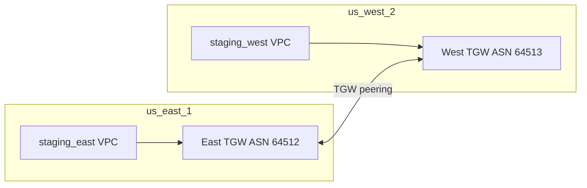
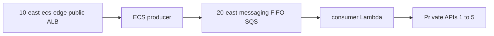
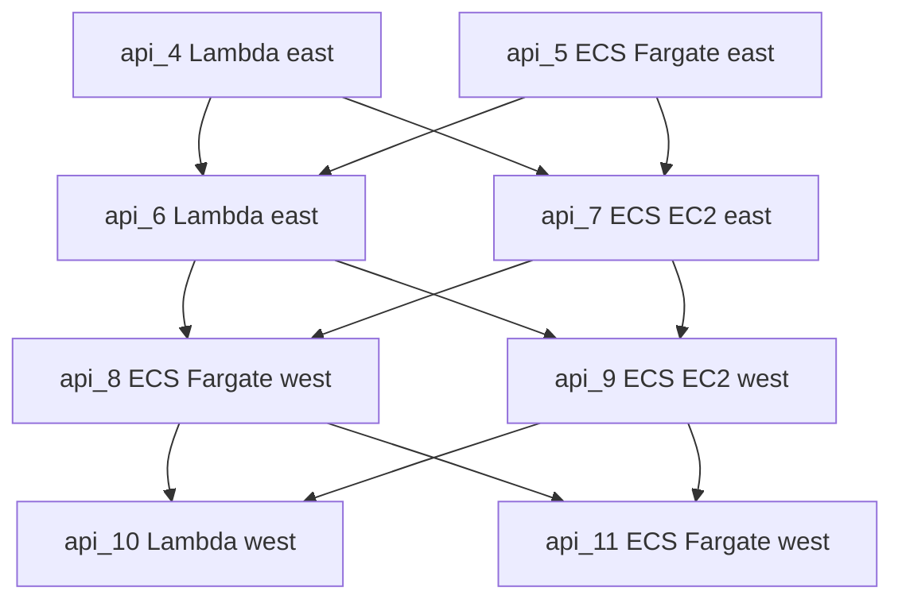
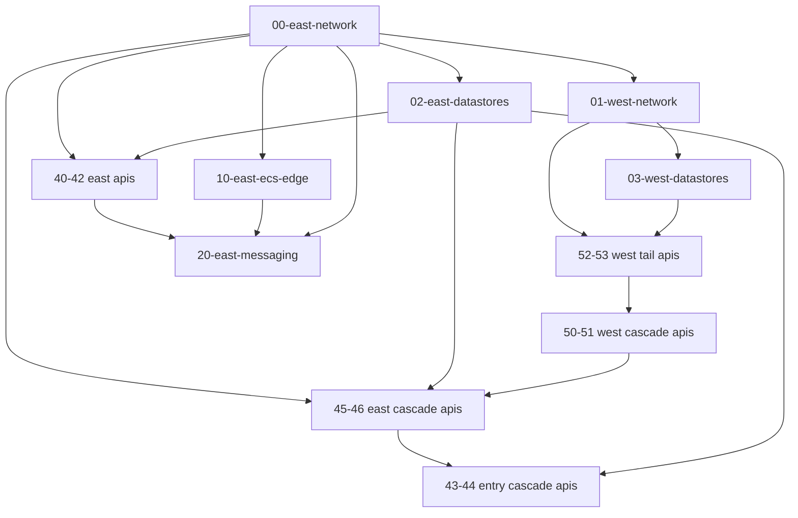

# staging-multi-state architecture

Single-account, two-region staging reference architecture for Terraform multi-state layouts, mixed compute, mixed datastores, private API Gateway fanout, and Excalidraw semantic import.

For apply commands and quick start, see [README.md](./README.md).

---

## Overview and purpose

### What it is

**staging-multi-state** is a real AWS staging environment split across **25 independent Terraform states** in one account. The import preset **`staging-multi-state-expanded`** hydrates from `import-presets.catalog.json` → 25 stacks + `pipeline.tfd` → `terraform-import-presets.db` via `yarn hydrate:terraform-preset staging-multi-state-expanded`.

Each stack keeps local state (`terraform.tfstate`) and exports `plan.json` + `graph.dot` for layout import.

### What it demonstrates

- **Multi-state Terraform** with `terraform_remote_state` (local backend, relative paths)
- **Mixed compute:** Lambda, ECS Fargate Multi-AZ, ECS on EC2 Multi-AZ
- **Mixed datastores:** DynamoDB on-demand, RDS PostgreSQL Multi-AZ, Aurora Serverless v2 Multi-AZ, encrypted S3
- **Private REST APIs** reachable only via `execute-api` VPC endpoints
- **Cross-region fanout** over Transit Gateway peering (east ↔ west)
- **Declared pipeline edges** in `pipeline.tfd` for semantic Excalidraw drawing

### What it is not

This is **production-shaped staging** in a single AWS account: multi-region networks, mixed Lambda/ECS compute, and cascade APIs—not a separate multi-account production fanout layout.

---

## Stack inventory (17 states)

Every stack lives under `packages/backend/terraform/staging-multi-state/<stack-id>/` and produces:

- `terraform.tfstate`
- `plan.json` (from `terraform show -json`)
- `graph.dot` (from `terraform graph -plan`)

| Stack ID | Region | Role | Key outputs consumed downstream |
| --- | --- | --- | --- |
| `00-east-network` | us-east-1 | East VPC (4 subnet tiers), execute-api VPCE, east TGW, east lambda artifacts bucket, APIGW CloudWatch account | `vpc_id`, subnet IDs, `execute_api_vpce_id`, `lambda_artifacts_bucket_id`, TGW IDs |
| `01-west-network` | us-west-2 | West VPC, west TGW, TGW peering to east, execute-api VPCE, west lambda artifacts, APIGW logging | Same pattern as east; peers east via TGW |
| `02-east-datastores` | us-east-1 | Dedicated stores for east APIs 1–7 plus cross-region stores for api-8 (S3) and api-9 (RDS) | Table/bucket ARNs, RDS/Aurora `secret_arn` |
| `03-west-datastores` | us-west-2 | West stores for apis 8–11 | Same as east datastores |
| `40-east-api-1` | us-east-1 | api-1: Lambda + DynamoDB | `api_invoke_url`, `api_execution_arn` |
| `41-east-api-2` | us-east-1 | api-2: ECS Fargate + RDS | Same |
| `42-east-api-3` | us-east-1 | api-3: ECS EC2 + Aurora | Same |
| `43-east-api-4` | us-east-1 | api-4: Lambda + S3; downstream → api-6, api-7 | Same + cascade |
| `44-east-api-5` | us-east-1 | api-5: ECS Fargate + DynamoDB; downstream → api-6, api-7 | Same + cascade |
| `45-east-api-6` | us-east-1 | api-6: Lambda + RDS; downstream → api-8, api-9 (west) | Same + cascade |
| `46-east-api-7` | us-east-1 | api-7: ECS EC2 + Aurora; downstream → api-8, api-9 (west) | Same + cascade |
| `50-west-api-8` | us-west-2 | api-8: ECS Fargate + S3 (west + east); downstream → api-10, api-11 | Same + cascade |
| `51-west-api-9` | us-west-2 | api-9: ECS EC2 + RDS (west + east secrets); downstream → api-10, api-11 | Same + cascade |
| `52-west-api-10` | us-west-2 | api-10: Lambda + DynamoDB | Same |
| `53-west-api-11` | us-west-2 | api-11: ECS Fargate + Aurora | Same |
| `10-east-ecs-edge` | us-east-1 | Public ALB + ECS Fargate producer (synthetic entry) | ECS task role name (SQS send policy) |
| `20-east-messaging` | us-east-1 | FIFO SQS + consumer Lambda → private APIs 1–5 | Queue ARN |

Numbering convention: `00–03` foundation, `10–20` trunk/messaging, `40–46` east APIs, `50–53` west APIs.

---

## Regional network topology

### VPC layout

Both regions use [`private_workload_network`](../modules/private_workload_network/) with **four subnet tiers** (two AZs each):

| Tier | Purpose | East CIDRs | West CIDRs |
| --- | --- | --- | --- |
| Public | NAT, public ALB (ecs-edge only) | `10.60.0.0/24`, `10.60.1.0/24` | `10.70.0.0/24`, `10.70.1.0/24` |
| Private | Lambda, ECS tasks, internal NLBs | `10.60.10.0/24`, `10.60.11.0/24` | `10.70.10.0/24`, `10.70.11.0/24` |
| Intra | VPC endpoints (execute-api, Secrets Manager, etc.) | `10.60.20.0/24`, `10.60.21.0/24` | `10.70.20.0/24`, `10.70.21.0/24` |
| Database | RDS/Aurora subnet groups | `10.60.30.0/24`, `10.60.31.0/24` | `10.70.30.0/24`, `10.70.31.0/24` |

VPC CIDRs: **east** `10.60.0.0/16`, **west** `10.70.0.0/16`.

Each VPC has a single NAT gateway (`single_nat_gateway = true`) for staging cost control.

### VPC endpoints and gateway endpoints

On private, intra, and database route tables:

- **Gateway:** S3, DynamoDB
- **Interface (intra subnets):** SSM, SQS, KMS, CloudWatch Logs, Secrets Manager
- **Interface (stack-specific):** `execute-api` VPCE in `00-east-network` and `01-west-network`

Private REST APIs bind to the regional execute-api VPCE; API resource policies restrict `execute-api:Invoke` to `aws:SourceVpce`.

### Cross-region connectivity



- West stack creates peering attachment; east stack accepts it (`01-west-network` dual-provider pattern).
- Routes on **private, intra, and database** route tables send peer VPC CIDR over the local TGW.
- Cross-region **SQL** (api-9 east RDS): instance in east database subnets; security group allows PostgreSQL from **both** VPC CIDRs; west ECS tasks reach east RDS over TGW.
- Cross-region **S3** (api-8): separate buckets in west (`03-west-datastores`) and east (`02-east-datastores`); IAM on the ECS task role lists both bucket ARNs.

---

## End-to-end dataflow

Two logical layers: the **messaging trunk** (entry) and the **API cascade** (downstream fanout).

### Trunk: ECS → SQS → consumer → APIs 1–5



1. **10-east-ecs-edge** runs a public ALB → ECS Fargate producer (mock workload).
2. Producer sends messages to encrypted FIFO SQS (`20-east-messaging`).
3. Consumer Lambda (VPC, east private subnets) receives batches and POSTs to **each** of APIs 1–5 invoke URLs.
4. Consumer IAM allows `execute-api:Invoke` on apis 1–5 execution ARNs only.

Implementation: [`20-east-messaging/src/consumer.py`](./20-east-messaging/src/consumer.py) — no SigV4 in staging consumer (URLs are VPCE-scoped private endpoints inside the VPC).

### Cascade: APIs 4/5 → 6/7 → 8/9 → 10/11



- **Entry fanout:** consumer → APIs **1–5 only** (not 6–11).
- **Cascade:** wired via `downstream_api_urls` in [`modules/private_api_lambda`](./modules/private_api_lambda/) and [`modules/private_api_ecs`](./modules/private_api_ecs/); compute IAM includes `execute-api:Invoke` for downstream private APIs.
- **Cross-region hops:** api-6/7 (east) invoke api-8/9 (west) over execute-api + TGW-backed networking.

Declared edges for drawing: [`pipeline.tfd`](./pipeline.tfd) (cascade section at bottom).

---

## Per-API assignment matrix

Each API owns **one dedicated primary store**. apis 8 and 9 also have a **second store in the other region** (not shared with any other API).

| API | Stack | Region | Compute | Primary store | Store stack / module | Cross-region store |
| --- | --- | --- | --- | --- | --- | --- |
| 1 | `40-east-api-1` | east | Lambda | DynamoDB | `02` / `api1_table` | — |
| 2 | `41-east-api-2` | east | ECS Fargate MAZ | RDS Multi-AZ | `02` / `api2_rds` | — |
| 3 | `42-east-api-3` | east | ECS EC2 MAZ | Aurora Serverless v2 MAZ | `02` / `api3_aurora` | — |
| 4 | `43-east-api-4` | east | Lambda | S3 | `02` / `api4_bucket` | — |
| 5 | `44-east-api-5` | east | ECS Fargate MAZ | DynamoDB | `02` / `api5_table` | — |
| 6 | `45-east-api-6` | east | Lambda | RDS Multi-AZ | `02` / `api6_rds` | — |
| 7 | `46-east-api-7` | east | ECS EC2 MAZ | Aurora Serverless v2 MAZ | `02` / `api7_aurora` | — |
| 8 | `50-west-api-8` | west | ECS Fargate MAZ | S3 west | `03` / `api8_west_bucket` | S3 east (`02` / `api8_east_bucket`) |
| 9 | `51-west-api-9` | west | ECS EC2 MAZ | RDS west | `03` / `api9_west_rds` | RDS east (`02` / `api9_east_rds`) |
| 10 | `52-west-api-10` | west | Lambda | DynamoDB | `03` / `api10_table` | — |
| 11 | `53-west-api-11` | west | ECS Fargate MAZ | Aurora Serverless v2 MAZ | `03` / `api11_aurora` | — |

**Compute mix:** 4× Lambda, 4× ECS Fargate, 3× ECS on EC2.

**Store mix:** 3× DynamoDB, 4× RDS Multi-AZ (`db.t4g.micro`), 3× Aurora Serverless v2 Multi-AZ (0.5–1 ACU), 3× S3.

---

## Private API invoke paths

All 11 APIs are **private REST APIs** (`endpoint_configuration.types = ["PRIVATE"]`) attached to the regional execute-api VPCE.

### Lambda APIs (1, 4, 6, 10)

Module: [`modules/private_api_lambda`](./modules/private_api_lambda/)

```text
Caller
  → execute-api VPC endpoint (private DNS)
  → API Gateway REST API (resource policy: SourceVpce)
  → aws_proxy integration
  → Lambda (VPC, private subnets)
  → optional: DynamoDB / S3 / Secrets Manager / downstream execute-api
```

Handler: [`shared/api_handler.py`](./shared/api_handler.py) (mock JSON response).

### ECS APIs (2, 3, 5, 7, 8, 9, 11)

Module: [`modules/private_api_ecs`](./modules/private_api_ecs/)

```text
Caller
  → execute-api VPC endpoint
  → API Gateway REST API
  → VPC link
  → internal Network Load Balancer (private subnets, Multi-AZ)
  → ECS service tasks (Fargate or EC2, desired_count = 2)
  → optional: datastore IAM + downstream execute-api
```

**Important:** REST API VPC links require an **NLB** target ARN, not an ALB. The module uses an internal NLB with TCP listener and HTTP health checks on `/health`.

Container: Python slim image running [`shared/api_server.py`](./shared/api_server.py) (`GET /health`, `POST /invoke`).

### Invoke URL shape

Both modules export:

```text
https://{apiId}-{executeApiVpceId}.execute-api.{region}.amazonaws.com/v1/invoke
```

Callers inside the VPC resolve this via the execute-api VPCE private DNS name.

---

## Datastore layer

### Isolation

- One dedicated store per API stack; no sharing between APIs.
- api-8 and api-9 are the only APIs with **dual-region stores**, and those extra stores are **api-specific** (not reused by other APIs).

### Shared modules (`packages/backend/terraform/modules/`)

| Module | Used for | Notes |
| --- | --- | --- |
| `dynamodb_app_table` | api-1, api-5, api-10 | PAY_PER_REQUEST, hash key `id` |
| `rds_postgres_micro` | api-2, api-6, api-9 (×2) | Postgres 16, `db.t4g.micro`, Multi-AZ, Secrets Manager |
| `aurora_serverless_v2_micro` | api-3, api-7, api-11 | Serverless v2 0.5–1 ACU, writer + reader in separate AZs |
| `s3_app_bucket` | api-4, api-8 (×2) | Wraps `encrypted_s3_bucket` (KMS, versioning) |

Datastore stacks (`02`, `03`) read network outputs for `database_subnet_ids` and VPC CIDR (SG ingress). API stacks read datastore outputs via remote state and pass ARNs/secrets into `private_api_*` modules.

### Secrets and credentials

RDS/Aurora modules create Secrets Manager secrets (host, port, dbname, username, password). Lambda/ECS task roles grant `secretsmanager:GetSecretValue` on the bound secret ARN(s). api-9 ECS tasks receive primary + `additional_db_secret_arns` for the east replica.

### Excalidraw semantic placement

When imported with `pipeline.tfd`:

- **RDS / Aurora** → database subnet tier (subnet group members)
- **DynamoDB / S3** → regional band (no subnet ENI)
- **Private REST APIs** → intra zone (execute-api VPCE resolution)
- **Lambda / ECS** → private subnet tier

---

## State wiring and dependencies

### Pattern

- **Backend:** implicit local state per stack directory (`terraform.tfstate`).
- **Cross-stack reads:** `data "terraform_remote_state"` with relative paths, e.g. `../00-east-network/terraform.tfstate`.
- **No remote backend** in staging; state files must exist on disk before dependent stacks apply.

### Dependency graph (simplified)



### Apply order

Use [`scripts/apply-and-export-all.sh`](./scripts/apply-and-export-all.sh). Order is dependency-aware:

1. `00-east-network`, `01-west-network`
2. `02-east-datastores`, `03-west-datastores`
3. `40`, `41`, `42` (east entry APIs, no cascade deps)
4. `52`, `53` (west tail — needed before 50/51 downstream URLs)
5. `50`, `51` (west cascade)
6. `45`, `46` (east cascade to west)
7. `43`, `44` (read api-6/7 invoke URLs from remote state)
8. `10-east-ecs-edge`, `20-east-messaging` (needs api 1–5 outputs)

**Why order matters:** Stacks `43` and `44` read `45-east-api-6` and `46-east-api-7` state for `downstream_api_urls`. Applying 43/44 before 45/46 will fail on missing remote state.

---

## pipeline.tfd and Excalidraw integration

### Purpose

[`pipeline.tfd`](./pipeline.tfd) declares **logical dataflow edges** that Terraform plans alone do not express (cross-stack fanout, compute→store, cascade). The Excalidraw importer uses these binds to draw pipeline arrows in semantic layout.

### Bind convention

```text
bind <alias> = <stack-id>::<terraform resource address>
```

Example:

```text
bind api2_compute = 41-east-api-2::module.api.aws_ecs_service.api
bind api2_store   = 02-east-datastores::module.api2_rds.aws_db_instance.this
```

### TFD v2 syntax

The file starts with `tfd 2` so pipeline column depth uses **adjacency-list semantics** (each edge advances one column; sibling targets from the same source share depth). Files without that header keep legacy v1 run-ordinal grouping.

| Form | Meaning |
| --- | --- |
| `src -> dst` | One column hop |
| `src -> a, b` | Parallel fanout (same depth for `a` and `b`) |
| `src --> dst` | Extra depth via auto dummy hop (`src -> __tfd_hop_N -> dst`) |
| `bind mid = @hop` | Explicit dummy node for manual `a -> mid -> b` chains |

Example:

```text
tfd 2
api6_compute -> api6_ssm_name, api6_store
```

### Edge categories

| Category | Example |
| --- | --- |
| Trunk | `ecs_producer → event_queue → queue_consumer → api1_gateway … api5_gateway` |
| Gateway → compute → SSM | `api2_gateway → api2_compute → api2_ssm_name` |
| Compute → store | `api2_compute → api2_store` |
| Cascade | `api4_compute → api6_gateway`, `api8_compute → api10_gateway` |

### Preset hydration

1. Catalog entry in [`import-presets.catalog.json`](../import-presets.catalog.json) lists all 25 stacks + `pipeline.tfd` (`staging-multi-state-expanded`).
2. `yarn seed:terraform-presets` → repo-root `terraform-import-presets.db`
3. `yarn export:terraform-presets-test-db` → test fixture for Vitest
4. Golden layout snapshots: `packages/excalidraw/components/terraformLayoutSnapshot.test.ts`

Import **Staging multi-state** in the app (semantic view) to render the full topology.

---

## Modules reference

### Staging-local (`staging-multi-state/modules/`)

| Module | Role |
| --- | --- |
| `private_api_lambda` | Private REST API + Lambda aws_proxy + SSM params + optional datastore/downstream IAM |
| `private_api_ecs` | Private REST API + VPC link + internal NLB + Multi-AZ ECS (Fargate or EC2) |

### Shared repo modules (`packages/backend/terraform/modules/`)

| Module | Used by |
| --- | --- |
| `private_workload_network` | `00`, `01` |
| `lambda_service` | Lambda APIs, messaging consumer |
| `encrypted_sqs_queue` | `20-east-messaging` |
| `dynamodb_app_table`, `rds_postgres_micro`, `aurora_serverless_v2_micro`, `s3_app_bucket` | `02`, `03` |
| `encrypted_s3_bucket` | via `s3_app_bucket` |

### Shared runtime (`staging-multi-state/shared/`)

| File             | Used by                   |
| ---------------- | ------------------------- |
| `api_handler.py` | Lambda API stacks         |
| `api_server.py`  | ECS container HTTP server |

---

## Operations

### Teardown (zero ongoing cost)

To remove all billable AWS resources while keeping Terraform code and local state for redeploy:

```bash
cd packages/backend/terraform/staging-multi-state
TF_VAR_aws_account_id=<account-id> AWS_PROFILE=admin ./scripts/destroy-all-stacks.sh
```

The script destroys in four **parallel waves** (apps → datastores → west network → east network). EC2-backed API stacks (42, 46, 51) may need a second run if ECS drain times out; scale ASGs to zero and `aws ecs delete-service --force` if needed.

After destroy, ongoing cost is **$0** (empty tfstate files remain gitignored locally).

### Apply and export all stacks

```bash
cd packages/backend/terraform/staging-multi-state
chmod +x scripts/apply-and-export-all.sh
TF_VAR_aws_account_id=<12-digit-account-id> AWS_PROFILE=admin ./scripts/apply-and-export-all.sh
```

Each stack: `terraform init` → `apply` → `plan -out` → `plan.json` + `graph.dot`.

Optional: set `terraform_deploy_role_arn` or rely on `TF_VAR_aws_account_id` + default `TerraformDeploy` role name.

### Regenerate import preset database

```bash
yarn seed:terraform-presets
yarn export:terraform-presets-test-db
```

After changing `pipeline.tfd` or stack artifacts, re-seed and update snapshots:

```bash
yarn test:app --run packages/excalidraw/components/terraformLayoutSnapshot.test.ts -u
```

---

## Cost and staging tradeoffs

Rough **24/7 idle** staging cost (single account, May 2026 pricing assumptions):

| Layer                                      | Approx. monthly   |
| ------------------------------------------ | ----------------- |
| SQL (4× RDS Multi-AZ + 3× Aurora Multi-AZ) | ~$375–395         |
| 7× internal NLBs (ECS APIs)                | ~$110             |
| ECS Fargate + EC2 Multi-AZ tasks           | ~$130             |
| NAT, TGW, VPCEs, misc.                     | ~$50+             |
| **All-in estimate**                        | **~$650–730+/mo** |

**Cost levers** (not implemented; documented for future dev tuning):

- Stop RDS/Aurora overnight
- Single-AZ instead of Multi-AZ in personal dev accounts
- Scale EC2 ASG to zero when idle
- Share NLBs (breaks per-stack isolation)

---

## Related references

- [README.md](./README.md) — quick start and apply order summary
- [import-presets.catalog.json](../import-presets.catalog.json) — preset stack manifest
- [CLAUDE.md](../../../../CLAUDE.md) — monorepo structure and Terraform import context
