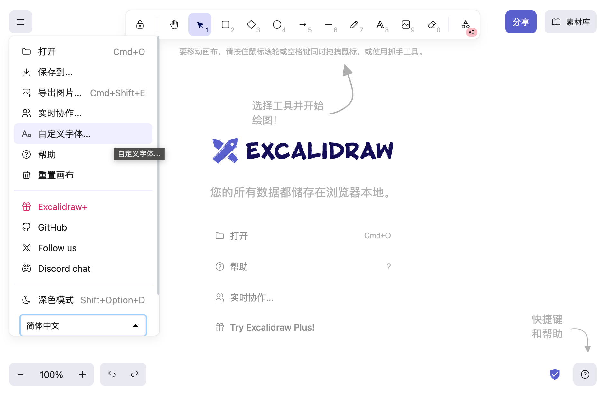
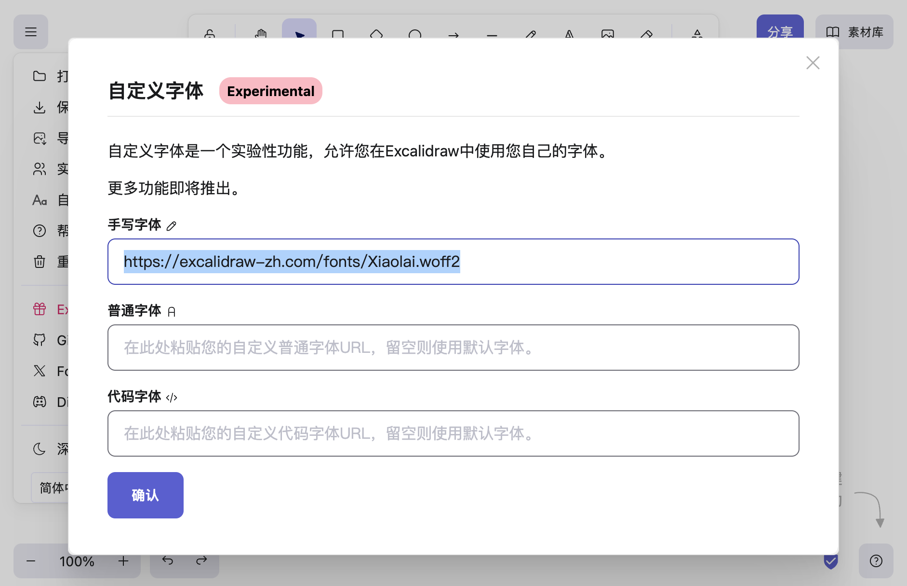
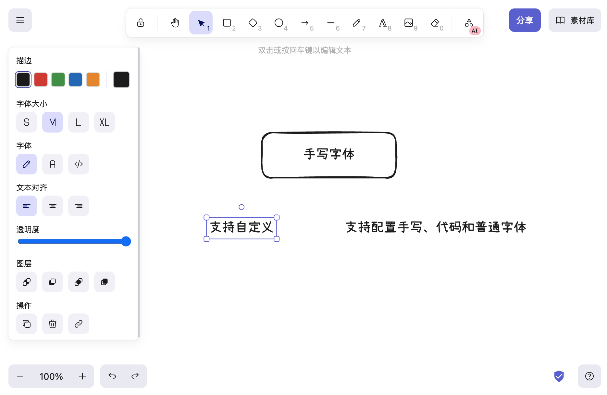

<a href="https://excalidraw-zh.com/">Excalidraw Editor(zh)</a>

`excalidraw-zh` 基于 `excalidraw`，提供`简体中文`, `繁体中文`等体验优化。

1. 支持自定义字体，包括手写字体、常规字体和代码字体。
2. 支持通过excalidraw配置入口配置自定义字体，默认中文字体为 `小赖字体 / 小賴字體 / シャオライ / Xiaolai Font`。

**如何使用** 
1. 在配置中，配置自己喜欢的字体，字体格式为woff2。
 

2. 保存配置，系统会自动尝试加载字体，加载成功后，自动重新加载站点。
 

3. 尽情使用自己的字体。
 
