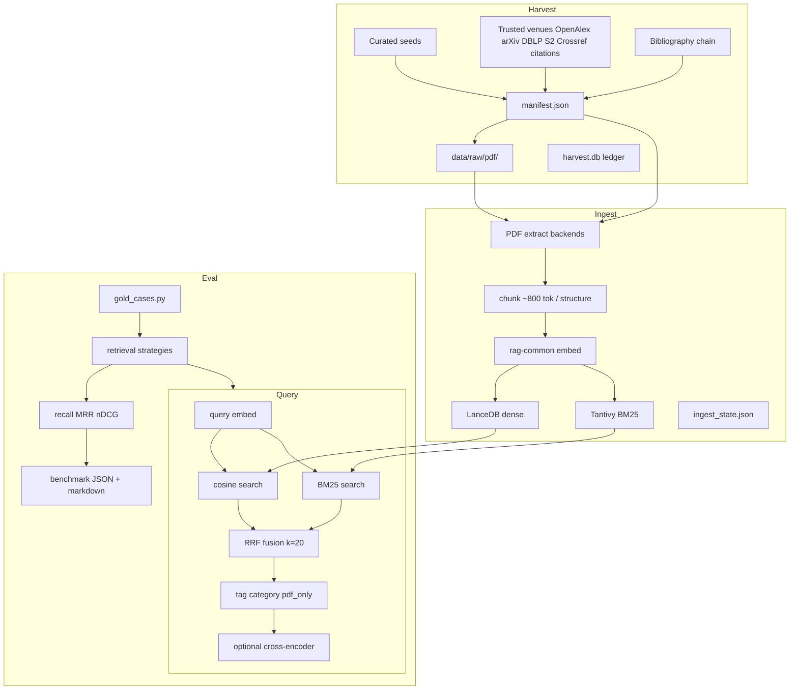

# Graph Layout RAG — Architecture Handoff

Agent-oriented reference for the graph-drawing literature RAG tool at `tools/rag-literature-rag/`. Covers harvest, PDF extraction, ingestion, hybrid query, retrieval evaluation, catalog classification, testing, and operational constraints.

**Related docs:**

- User-facing setup: [README.md](./README.md)
- Agent query workflow: [.agents/skills/rag-literature-rag/SKILL.md](../../.agents/skills/rag-literature-rag/SKILL.md)
- Pipeline layout query pack: [docs/pipeline-rag-queries.md](../../docs/pipeline-rag-queries.md)
- Retrieval evaluation report (when generated): [docs/rag-literature-rag-retrieval-evaluation.md](../../docs/rag-literature-rag-retrieval-evaluation.md)
- Shared embed stack: [tools/rag-common](../rag-common)

---

## Table of contents

1. [Purpose and mental model](#1-purpose-and-mental-model)
2. [Directory layout and on-disk artifacts](#2-directory-layout-and-on-disk-artifacts)
3. [Manifest schema](#3-manifest-schema)
4. [Harvest subsystem](#4-harvest-subsystem)
5. [PDF extraction and ingestion](#5-pdf-extraction-and-ingestion)
6. [Query subsystem](#6-query-subsystem)
7. [Catalog subsystem](#7-catalog-subsystem)
8. [Eval subsystem](#8-eval-subsystem)
9. [CLI reference](#9-cli-reference)
10. [Environment variables](#10-environment-variables)
11. [Agent operational playbook](#11-agent-operational-playbook)
12. [Testing guide](#12-testing-guide)
13. [Module index](#13-module-index)
14. [Known constraints and footguns](#14-known-constraints-and-footguns)

---

## 1. Purpose and mental model

### What this tool does

Graph-layout-rag builds a **local research corpus** of graph drawing and layout theory papers (Graphviz dot/neato, Sugiyama layering, compound graphs, stress majorization, ELK/Mermaid/dagre, VLSI compaction, etc.) and exposes it via **hybrid vector + lexical search**.

The pipeline has three phases:

```
Harvest  →  manifest.json + PDFs on disk
Ingest   →  chunk + embed + index (LanceDB + Tantivy BM25)
Query    →  hybrid retrieval + optional rerank → JSON snippets for agents
```

### Target corpus scale

| Layer | Approximate count | Use |
| --- | --- | --- |
| Catalog entries (`manifest.json`) | ~2,800 (target) | Discovery, metadata, filtering |
| Full PDFs (`status: ok`) | ~2,000–3,088 | Deep reading, accurate quotes |
| Metadata-only stubs | ~500–800 | Citations; title/abstract when present |
| Indexed chunks (full ingest) | ~60,000 | Query hits (~35 chunks/PDF avg + metadata stubs; ~770 tokens/chunk with structure-aware chunking) |

**Current production index (local):** `gemini-2-structure-v1` — Gemini Embedding 2 @ 3072, Docling extraction, structure-aware chunking (`markdown-structure-v1`), hybrid BM25. Set `RAG_EMBED_PROFILE=gemini-2-structure-v1` in `.env`.

### Relationship to rag-common

Embeddings, embed profiles, Gemini rate limiting, and cross-encoder reranking live in [`tools/rag-common`](../rag-common). Graph-layout-rag is a **consumer** that:

- Resolves profiles via `RAG_EMBED_PROFILE` / `--embed-profile`
- Writes per-profile indexes under `data/indexes/{profile}/`
- Uses env prefix `RAG_LIT_` for tool-specific overrides

### Relationship to Terraform pipeline layout research

This corpus supports agents researching **Terraform pipeline layout height** in `packages/excalidraw/components/terraformPipelineLayout*.ts`. Pipeline categories (`layer-assignment`, `compaction`, `packing`, etc.) map harvest tags and keyword classifiers to code modules. See [docs/pipeline-rag-queries.md](../../docs/pipeline-rag-queries.md) for curated query → category mappings.

### End-to-end data flow



---

## 2. Directory layout and on-disk artifacts

Package root: `tools/rag-literature-rag/` (`PKG_ROOT` in `paths.py`).

```
tools/rag-literature-rag/
├── src/rag_literature_rag/     # Python package
├── tests/                    # pytest suite (~172 tests)
├── data/                     # gitignored runtime data
│   ├── manifest.json
│   ├── harvest.db
│   ├── harvest_checkpoint.json
│   ├── harvest.log
│   ├── ingest.log
│   ├── eval/                 # benchmark JSON, transform cache, run logs
│   ├── raw/pdf/{doc_id}.pdf
│   └── indexes/{profile}/
│       ├── lancedb/          # LanceDB connection dir
│       ├── bm25/             # Tantivy lexical index
│       ├── ingest_state.json
│       └── ingest_status.json  # live ingest telemetry (per run)
├── .env                      # local config (gitignored)
├── .env.example
├── pyproject.toml
└── ARCHITECTURE.md           # this file
```

### Path reference (`paths.py`)

| Path | Role | Gitignored |
| --- | --- | --- |
| `data/manifest.json` | Catalog of all harvested works | yes |
| `data/raw/pdf/{id}.pdf` | Downloaded PDF files | yes |
| `data/raw/html/` | Scraped HTML (curated blog posts) | yes |
| `data/harvest.db` | SQLite download attempt ledger | yes |
| `data/harvest_checkpoint.json` | Harvest resume state | yes |
| `data/trusted_venue_checkpoint.json` | Incremental DROPS volume / JGAA issue state | yes |
| `data/citations.sqlite` | Canonical citation nodes/edges, provider aliases, and edge provenance | yes |
| `data/harvest.log` | Harvest structured log | yes |
| `data/ingest.log` | Ingest structured log | yes |
| `data/indexes/{profile}/lancedb/` | LanceDB vector index | yes |
| `data/indexes/{profile}/bm25/` | Tantivy BM25 index | yes |
| `data/indexes/{profile}/ingest_state.json` | Ingest checkpoint + embed metadata | yes |
| `data/indexes/{profile}/ingest_status.json` | Live ingest run telemetry (atomic progress) | yes |
| `data/eval/{profile}-benchmark.json` | Retrieval benchmark results | yes |
| `data/eval/transform_cache.json` | Cached LLM query transforms (HyDE, multi-query, step-back) | yes |

**Deprecated legacy paths** (do not use for new builds):

- `data/lancedb/` — single shared LanceDB (pre-profile indexes)
- `data/ingest_state.json` — single shared ingest state

**Override:** set `RAG_LIT_INDEXES_DIR` to relocate all profile indexes.

### Env file load order (`env.py`)

1. `tools/rag-literature-rag/.env`
2. `tools/repo-rag/.env` (sibling tool; shared API keys)
3. `.env.example` (fallback defaults only)

---

## 3. Manifest schema

**Source:** `manifest.py` **Path:** `data/manifest.json`

The manifest is the **single source of truth** for what was harvested, whether a local PDF exists, and how ingest should treat each document.

### Pydantic models

```python
ManifestStatus = Literal["ok", "metadata_only", "failed"]

class ManifestItem(BaseModel):
    id: str                    # slug from title/doi/url (max 80 chars)
    title: str
    authors: list[str]
    year: int | None
    source: str                # harvest origin tag (see below)
    url: str
    localPath: str | None      # relative to PKG_ROOT, e.g. data/raw/pdf/{id}.pdf
    contentType: str | None
    status: ManifestStatus
    tags: list[str]
    sha256: str | None         # PDF content hash when status=ok
    doi: str | None
    abstract: str | None

class Manifest(BaseModel):
    version: int = 1
    updatedAt: str             # ISO UTC timestamp
    items: list[ManifestItem]
```

### Status semantics

| Status | Meaning | Ingest behavior |
| --- | --- | --- |
| `ok` | Valid PDF on disk; passed verify checks | Extract PDF text → chunk → embed |
| `metadata_only` | Known work, no downloadable PDF | Chunk title/abstract/authors only |
| `failed` | Download attempted but no valid PDF | Skipped by ingest |

### Common `source` values

| Source | Origin |
| --- | --- |
| `graphviz.org` | Graphviz theory page crawl |
| `handbook` | GD Handbook chapter PDFs |
| `book` | Paywalled textbook metadata stubs |
| `topic-seed` | Curated topic seed harvest |
| `curated` | HN/Terrastruct and other hand-picked refs |
| `elk-bibliography` | DOIs from ELK survey paper |
| `openalex` | OpenAlex topic/concept search |
| `arxiv` | arXiv cs.CG/DS queries |
| `dblp` | DBLP API search |
| `semantic-scholar` | Semantic Scholar search |
| `crossref` | Crossref venue-targeted search (JGAA, CGTA, GD, LIPIcs) |
| `bibliography` | DOI chain from seed PDF references |
| `springer`, `monash`, etc. | Publisher-specific curated downloads |

### Helper functions

| Function | Purpose |
| --- | --- |
| `slug_id(text)` | Kebab-case ID from title/DOI/URL |
| `load_manifest()` | Read JSON → `Manifest` (empty if missing) |
| `save_manifest(manifest)` | Atomic write via `.json.tmp` + `os.replace` |
| `upsert_item(manifest, item)` | Replace by `id` or append |
| `manifest_by_id(manifest)` | Dict lookup by `id` |
| `relative_local_path(abs_path)` | Path relative to `PKG_ROOT` |

### JSON examples

**Full PDF (`ok`):**

```json
{
  "id": "gansner-tse93",
  "title": "A Technique for Drawing Directed Graphs",
  "authors": [
    "Emden R. Gansner",
    "Eleftherios Koutsofios",
    "Stephen C. North",
    "Kiem-Phong Vo"
  ],
  "year": 1993,
  "source": "graphviz.org",
  "url": "https://graphviz.org/documentation/TSE93.pdf",
  "localPath": "data/raw/pdf/gansner-tse93.pdf",
  "contentType": "application/pdf",
  "status": "ok",
  "tags": ["dot", "hierarchical", "graphviz", "rank"],
  "sha256": "a1b2c3...",
  "doi": "10.1109/32.221135",
  "abstract": null
}
```

**Metadata-only stub:**

```json
{
  "id": "di-battista-1999",
  "title": "Graph Drawing: Algorithms for the Visualization of Graphs",
  "authors": [
    "Giuseppe Di Battista",
    "Peter Eades",
    "Roberto Tamassia",
    "Ioannis G. Tolli"
  ],
  "year": 1999,
  "source": "book",
  "url": "https://doi.org/10.5555/304094.304095",
  "localPath": null,
  "status": "metadata_only",
  "tags": ["handbook", "graph-drawing"],
  "doi": "10.5555/304094.304095",
  "abstract": "Comprehensive textbook on graph drawing algorithms."
}
```

**Failed download:**

```json
{
  "id": "some-paywalled-paper",
  "title": "Example Paywalled Paper",
  "source": "openalex",
  "url": "https://doi.org/10.1145/1234567",
  "localPath": null,
  "status": "failed",
  "tags": ["crossing", "openalex"],
  "doi": "10.1145/1234567"
}
```

---

## 4. Harvest subsystem

**Entry:** `harvest/run.py` (CLI group registered in `cli.py`) **Purpose:** Discover graph-drawing literature, download open-access PDFs, build `manifest.json`.

### 4.1 CLI surface

| Command | Function | Purpose |
| --- | --- | --- |
| `rag-literature-rag harvest` | `_execute_harvest` | Full harvest pipeline (default) |
| `rag-literature-rag harvest run` | Same | Explicit alias |
| `rag-literature-rag harvest verify` | `verify_manifest` | Re-check ok PDFs on disk |
| `rag-literature-rag harvest status` | Status dump | Manifest + checkpoint + ledger summary |
| `rag-literature-rag harvest report` | Ledger query | Per-URL attempt log from SQLite |
| `rag-literature-rag harvest prune` | `plan_prune` / `apply_prune` | Precision-first corpus cleanup (destructive with `--apply`) |
| `rag-literature-rag harvest enrich` | `enrich_manifest` | Backfill missing abstracts via OpenAlex (no downloads) |

### 4.2 Harvest preset modes

Three preset profiles control caps and behavior:

| Setting | Normal (default) | `--deep-harvest` | `--pipeline-harvest` |
| --- | --- | --- | --- |
| OpenAlex max works | 200 | 4,000 | 6,000 |
| OpenAlex per topic | 30 | 80 | 120 |
| DBLP max | 120 | 400 | 0 (skipped) |
| Semantic Scholar max | 250 | 800 | 0 (skipped) |
| arXiv max | 100 | 500 | 200 |
| Crossref max | 600 | 600 | 600 |
| Forward citations max | 300 | 300 | 300 |
| Bib DOIs per pass | 300 | 1,200 | 2,000 |
| Bib passes | 1 | 3 | 3 |
| Retry passes | 1 | 3 | 3 |
| Target catalog size | none | 2,800 | 4,500 |
| Target ok PDFs | none | 2,000 | 3,088 |
| Early seed stages | run | run | **skipped** |
| `--resume` | manual | manual | **auto-enabled** |
| OpenAlex filter | layout-relevant | layout-relevant | **pipeline-relevant + strict** |

Pipeline harvest is for expanding the corpus with papers tagged to Terraform pipeline layout research threads (layer-assignment, compaction, packing, overlap, etc.).

### 4.3 Orchestration flow

```
SIGINT → save manifest + checkpoint (stage label preserved)

Setup: logging, workers, init_db(), load manifest + checkpoint

[EARLY STAGES]  skipped if --resume && early seeds exist, OR --pipeline-harvest
  graphviz_theory → handbook → book_stubs → topic_seeds → curated → elk_bibliography
  (_save_progress after each stage)

[DISCOVERY LOOP]  for pass_num in 1..max_passes (default 5):
  if target_pdfs reached → break
  if --resume && discovery_complete(prior.stage) → skip pass
  else:
    openalex → arxiv (+ cs.CG bulk) → dblp → semantic_scholar → crossref → forward-citations
    [openalex-broad if target unmet]
  save manifest + checkpoint

  if not skip_bibliography:
    for bib_num in 1..bib_passes:
      bibliography: scan → relevance → select → resolve → download

  if not skip_retry:
    retry_unresolved_multi_pass (failed + metadata_only with DOI or .pdf URL)

  stagnation: 2 consecutive passes with zero ok-PDF growth → stop loop

[POST-LOOP]
  run_deferred_retries (transient rate-limit failures, 30s cooldown)
  verify_manifest(downgrade=True)
  clear_checkpoint() if not interrupted
```

Discovery sources within each pass run **concurrently** (`_run_concurrent_discovery`): Crossref, OpenAlex, arXiv (keyword + cs.CG bulk), DBLP, Semantic Scholar, and forward-citation expansion hit different rate-limited domains in parallel. arXiv keyword search and cs.CG category pagination share one domain thread (polite). Merge and checkpoint stay single-threaded after fetch.

```
                    ┌─────────────────────────────────────┐
                    │  rag-literature-rag harvest [--flags] │
                    └─────────────────┬───────────────────┘
                                      │
                    ┌─────────────────▼───────────────────┐
                    │  Setup: logging, workers, ledger DB │
                    │  Load manifest + checkpoint       │
                    └─────────────────┬───────────────────┘
                                      │
         ┌────────────────────────────┼────────────────────────────┐
         │ EARLY SEEDS (once)         │                            │
         ▼                            │                            │
  graphviz ─► handbook ─► books     │                            │
         ─► topic_seeds ─► curated   │                            │
         ─► elk_bibliography         │                            │
         └────────────────────────────┼────────────────────────────┘
                                      │
                    ┌─────────────────▼───────────────────┐
                    │  DISCOVERY LOOP (pass 1..max_passes)  │
                    └─────────────────┬───────────────────┘
                                      │
              ┌───────────────────────┼───────────────────────┐
              ▼                       ▼                       ▼
         OpenAlex              arXiv / DBLP / S2        Crossref / forward-cite
              │                       │                       │
              └───────────────────────┼───────────────────────┘
                                      │
                    ┌─────────────────▼───────────────────┐
                    │  OpenAlex broad (if target unmet)    │
                    └─────────────────┬───────────────────┘
                                      │
                    ┌─────────────────▼───────────────────┐
                    │  BIBLIOGRAPHY PASS (× bib_passes)   │
                    │  scan seeds → relevance → resolve   │
                    └─────────────────┬───────────────────┘
                                      │
                    ┌─────────────────▼───────────────────┐
                    │  RETRY (× retry_passes)             │
                    └─────────────────┬───────────────────┘
                                      │
                    ┌─────────────────▼───────────────────┐
                    │  DEFERRED RETRY + VERIFY            │
                    └─────────────────────────────────────┘
```

### 4.4 Early seed sources

| Module | Function | `source` tag | Mechanism |
| --- | --- | --- | --- |
| `graphviz_theory.py` | `harvest_graphviz_theory` | `graphviz.org` | Crawl graphviz.org/theory/; merge `GRAPHVIZ_KNOWN_PDFS`; parallel download |
| `handbook.py` | `harvest_handbook` | `handbook` | Crawl GD Handbook index; download chapter PDFs |
| `books.py` | `book_metadata_stubs` | `book` | 3 paywalled textbook metadata stubs |
| `topic_seeds.py` | `harvest_topic_seeds` | `topic-seed`, `arxiv`, etc. | Direct PDF URLs, ~60 DOI seeds, pipeline DOI seeds, research-thread metadata |
| `curated.py` | `harvest_curated` | `curated`, `springer`, etc. | HN/Terrastruct PDFs; blog text via BeautifulSoup |
| `elk_references.py` | `harvest_elk_references` | `elk-bibliography` | ~50 DOIs from ELK survey (arXiv:2311.00533) |

Topic seeds include ELK/Mermaid, Sugiyama, Sander compound graphs, Stratisfimal, layer reassignment, constraints, compaction, packing, overlap research threads.

### 4.5 Bulk discovery sources

Discovery sources run concurrently within each pass (see §4.3). Each module returns `ManifestItem` lists merged by `_merge_items`.

| Module | Function | `source` | Strategy |
| --- | --- | --- | --- |
| `crossref.py` | `harvest_crossref` | `crossref` | Venue queries (JGAA, CGTA, GD, LIPIcs; visualization: TVCG/CGF/InfoVis/PacificVis; VLSI CAD: TCAD/DAC/ICCAD/ISPD) via Crossref API; broad journals strict-gated; DOI resolve + download |
| `trusted_venues.py` | `harvest_trusted_venues` | `drops`, `jgaa` | Complete GD 2024/2025 DROPS schema.org records, strict relevant SoCG records, and paginated JGAA archive PDFs; incremental per-volume/issue checkpoint |
| `openalex.py` | `harvest_openalex` | `openalex` | Topic queries + graph-drawing concept filter `C41217795`; cursor pagination; relevance filter |
| `arxiv.py` | `harvest_arxiv` | `arxiv` | 12 queries in cs.CG/DS/GR; Atom API; 0.5s delay |
| `arxiv_bulk.py` | `harvest_arxiv_category` | `arxiv` | Deep pagination of entire **cs.CG** category; strict layout gate (complements keyword search) |
| `dblp.py` | `harvest_dblp` | `dblp` | 14 queries; JSON API with 429 backoff |
| `semantic_scholar.py` | `harvest_semantic_scholar` | `semantic-scholar` | Independent queries in parallel through shared S2 policy |
| `citations.py` | `harvest_forward_citations` | `openalex` | OpenAlex **cites:** filter on high-signal seed DOIs (up to 40 seeds); captures newer citing work |

OpenAlex broad pass runs when target PDF count is not met after standard discovery (skipped in `--pipeline-harvest` mode).

### 4.6 Corpus prune (`prune.py`)

Precision-first cleanup for noisy OpenAlex long tail:

| Function | Purpose |
| --- | --- |
| `plan_prune(manifest)` | Read-only partition into keep/prune |
| `apply_prune(manifest, plan)` | Delete pruned PDFs, retag survivors, save manifest (requires confirmation) |
| `clean_tags(item)` | Strip leaked topic tags from discovered survivors; recompute from title/abstract |

**Keep rule:** items from `CURATED_SOURCES` (handbook, graphviz.org, topic-seed, etc.) always kept; others must pass `is_layout_relevant(..., strict=True)`.

CLI: `rag-literature-rag harvest prune` (dry plan) or `harvest prune --apply --yes` (destructive). Backs up manifest before apply.

### 4.7 Bibliography chain

**Module:** `bibliography.py`

Harvests papers **cited by** already-downloaded seed PDFs:

1. **Scan** — extract DOIs from reference sections of ok seed PDFs
2. **Relevance filter** — OpenAlex lookup + `is_layout_relevant()`; resumable in batches of 50
3. **Select** — cap at `max_bib_dois` relevant DOIs
4. **Resolve** — `resolve_doi_with_fallbacks` in batches of 30
5. **Download** — parallel PDF download; tag with `infer_harvest_tags()`

**Seed tags for bibliography scan** (`SEED_TAGS`): `layered`, `compound`, `elk-bibliography`, `sugiyama`, `handbook`, `graphviz`, `topic-seed`, `curated`, `bibliography`, `arxiv`, `compaction`, `packing`, `overlap`, `research-thread`, etc.

**Resumable sub-state** in `harvest_checkpoint.json`:

```json
{
  "bibliography": {
    "max_dois": 1200,
    "candidates": ["10.1007/...", "..."],
    "relevance": { "10.1007/...": true, "10.1029/...": false },
    "selected": ["10.1007/..."],
    "resolved_dois": ["10.1007/..."]
  }
}
```

### 4.8 Download pipeline

```
Source modules
    ↓
download_to_file()  ← rate_limit.wait_for_domain()
    ↓                  ledger.log_attempt() / classify_outcome()
parallel_map() / streaming_parallel_map() ← bounded ThreadPoolExecutor helpers
    ↓
PDF_DIR / data/raw/pdf/{id}.pdf
```

#### `download.py` — `download_to_file`

- Validates `%PDF` magic + minimum 10,000 bytes (`DEFAULT_MIN_PDF_BYTES`)
- Skips re-download if valid PDF on disk with matching `expected_sha256`
- Up to 4 attempts; retryable HTTP: `{202, 429, 500, 502, 503, 504}`
- 429 handling: `note_rate_limit()` + exponential backoff (×3 for 429)
- Every attempt logged to SQLite ledger
- `fetch_text()` for HTML crawlers (graphviz, handbook, curated blog)

#### `parallel.py`

- `set_workers(n)` / `get_workers()` — global worker count, clamped `[1, 128]`
- `parallel_map(func, items, workers, label)` — preserves order; logs ~5% progress
- `streaming_parallel_map(...)` — one persistent executor; yields results as completed

#### `rate_limit.py`

Per-domain adaptive gaps (thread-safe):

| Domain | Default gap |
| --- | --- |
| OpenAlex | Shared policy; max 100 RPS; metered work reserves daily free budget |
| Semantic Scholar | Shared policy; aggressive concurrency plus circuit-breaker cooldown |
| Unpaywall | 0.05s |
| CORE | 0.2s |
| Wayback | 0.5s |
| DBLP | 0.2s |
| doi.org | 0.1s |

Provider policies add persistent clients, concurrency semaphores, RPS pacing, typed outcomes, retries, circuit breaking, and metrics. S2 successful and terminal-not-found requests get completion markers; retryable failures resume automatically. `note_success`: decays gap toward default (×0.75).

#### `http_client.py` — `get_json`

Used by DOI resolver and archive fallbacks (not PDF downloads). 5 attempts; User-Agent includes `mailto:rag-literature-rag@excalidraw-tf.local`.

### 4.9 DOI resolution

**Validation** (`doi_validate.py`):

- `is_well_formed_doi` — regex `^10\.\d{4,9}/...`; rejects `.pdf` suffix artifacts
- `is_plausible_bibliography_doi` — blocks geophysics prefix `10.1029/`
- `filter_plausible_bibliography_dois` — batch filter

**Resolution tiers** (`doi_resolver.py` — `pick_pdf_urls`):

1. Extra URLs, arXiv, Springer, PLOS, PMC PDFs
2. OpenAlex `best_oa_location`, `primary_location`, `locations`, `open_access.oa_url`
3. Unpaywall + Semantic Scholar (skipped if OpenAlex already has OA hints)
4. Paywall guesses — ACM, IEEE (when `include_paywall_guesses=True`)
5. Archive fallbacks — CORE API + Wayback CDX (when `include_archive=True`)

**`resolve_doi_with_fallbacks`**:

- Malformed DOI → immediate `metadata_only` stub
- OpenAlex metadata enrichment (title, authors, year, abstract)
- Tries up to 12 URLs, max 6 failed attempts per item
- Transient failures → tag `rate_limited`
- Dry-run: sets first candidate URL, status `failed`

**Archive fallbacks** (`archive_fallback.py`):

- CORE API search (`CORE_API_KEY` env) → `downloadUrl`, `sourceFulltextUrls`
- Wayback CDX for archived publisher PDFs
- Publisher seed URLs by DOI prefix (Springer, Wiley, ACM, IEEE)

### 4.10 Retry passes

| Module | When | Strategy |
| --- | --- | --- |
| `retry.py` | End of each discovery loop pass | Re-resolve `failed` + `metadata_only` items with DOI or `.pdf` URL; full DOI tier chain + archive |
| `deferred_retry.py` | After all discovery passes | Query ledger for transient failures; 30s cooldown; direct re-download only |

### 4.11 Ledger (`ledger.py`)

SQLite at `data/harvest.db`.

**Tables:**

```sql
download_attempts (
  id, doc_id, doi, url, host, attempt, http_status,
  outcome, transient, bytes, retry_after, harvest_run, stage, created_at
)

documents (
  doc_id PK, final_status, winning_url, last_outcome, urls_tried, updated_at
)
```

**Outcome taxonomy** (`classify_outcome`):

| Outcome         | Transient | Meaning                  |
| --------------- | --------- | ------------------------ |
| `ok`            | no        | Valid PDF downloaded     |
| `not_pdf`       | no        | Response was not PDF     |
| `too_small`     | no        | Below 10KB minimum       |
| `network_error` | yes       | Connection/timeout error |
| `rate_limited`  | yes       | HTTP 429/503/502/504/202 |
| `forbidden`     | no        | HTTP 403/401             |
| `not_found`     | no        | HTTP 404                 |
| `http_error`    | varies    | Other HTTP errors        |
| `unknown`       | no        | Unclassified failure     |

**Key functions:** `init_db`, `log_attempt`, `update_document`, `summary`, `query_attempts`, `transient_doc_urls`.

### 4.12 Checkpoint (`checkpoint.py`)

JSON at `data/harvest_checkpoint.json`.

**Top-level fields:**

```json
{
  "stage": "openalex",
  "total": 1234,
  "ok": 800,
  "metadata_only": 300,
  "failed": 134,
  "discovery_pass": 2,
  "bib_pass": 1,
  "bibliography": {}
}
```

**Discovery complete stages** (`DISCOVERY_COMPLETE_STAGES`): `semantic-scholar`, `openalex-broad`, bibliography stages, `interrupted`.

**Resume semantics:**

- Early stages skipped when `--resume` and manifest has items from `graphviz.org`, `handbook`, `topic-seed`, `curated`, `elk-bibliography`
- Discovery pass skipped when `--resume` and `discovery_complete(prior.stage)`
- Bibliography resumes from checkpoint sub-state when `bib_pass` matches
- SIGINT saves manifest + checkpoint; re-run with `--resume`

**Constants:** `RELEVANCE_CHECKPOINT_EVERY=50`, `RESOLVE_BATCH_SIZE=30`.

### 4.13 Relevance filtering and tagging

**`relevance.py`:**

- `is_layout_relevant(title, abstract, strict=False)` — rejects off-topic keywords (genomics, clinical, etc.); requires ≥1 layout keyword (normal) or ≥2 (strict)
- `is_off_topic(title, abstract)` — off-topic keyword gate. Matches `OFF_TOPIC_KEYWORDS` at a **left word boundary** (`\b…`), so morphological variants still fire (`phylogen`→`phylogenetics`) but the keyword is not matched mid-word. This fixed a 2026-06 bias bug: a plain substring test let `rna` (RNA) match `exte`rna`l` / `inte`rna`l` / `jou`rna`l`, hard-killing core planar/upward-drawing papers at discovery (incl. "tidy trees", "Upward Planarization", and the GD symposium proceedings). Used by `layout_relevance_score` → `-100`.
- `is_pipeline_relevant(title, abstract)` — uses `categories_from_keywords` from catalog taxonomy; used in pipeline-harvest OpenAlex mode

**`tags_inference.py`:**

- `infer_harvest_tags(title, abstract, existing)` — adds `bibliography`, `graph-drawing`, pipeline categories from keywords

### 4.14 Verify step (`verify.py`)

**`verify_manifest(manifest, downgrade=True)`** checks each `status=="ok"` item:

1. `localPath` exists under `PKG_ROOT`
2. File starts with `%PDF`
3. Size ≥ 10,000 bytes
4. `is_layout_relevant(title, abstract)` — off-topic PDFs flagged

If invalid and `downgrade=True`: set `status="failed"`, clear `localPath` and `sha256`.

Also computes **orphan PDFs**: files in `PDF_DIR` not referenced by any ok manifest item.

Runs automatically at end of harvest; also available as `harvest verify`.

### 4.15 Harvest CLI flags

| Flag | Default | Purpose |
| --- | --- | --- |
| `--dry-run` | off | Discover only; no downloads |
| `--workers` | 32 | Process-wide active PDF download budget (max 128) |
| `--target` | mode-dependent | Min manifest item count |
| `--target-pdfs` | mode-dependent | Stop when ok PDF count reached |
| `--max-openalex` | preset | OpenAlex works per pass |
| `--max-openalex-per-topic` | preset | Per topic query cap |
| `--max-dblp` | preset | DBLP works cap |
| `--max-semantic-scholar` | preset | S2 works cap |
| `--max-arxiv` | preset | arXiv works cap |
| `--max-crossref` | 600 | Crossref venue-targeted works per pass |
| `--max-forward-citations` | 300 | Forward-citation works per pass |
| `--max-bib-dois` | preset | Bibliography DOI cap per pass |
| `--bib-passes` | 1 (3 deep/pipeline) | Bibliography loop iterations |
| `--retry-passes` | 1 (3 deep/pipeline) | DOI retry passes per discovery loop |
| `--max-passes` | 5 | Discovery loop iterations |
| `--skip-openalex` | off | Skip OpenAlex |
| `--skip-dblp` | off | Skip DBLP |
| `--skip-arxiv` | off | Skip arXiv |
| `--skip-crossref` | off | Skip Crossref venue discovery |
| `--skip-forward-citations` | off | Skip forward-citation expansion |
| `--skip-bibliography` | off | Skip bib chain |
| `--skip-topic-seeds` | off | Skip topic seed stage |
| `--skip-elk-bibliography` | off | Skip ELK ref harvest |
| `--skip-semantic-scholar` | off | Skip S2 |
| `--skip-retry` | off | Skip retry pass |
| `--resume` | off | Resume from checkpoint |
| `--deep-harvest` | off | High caps for ~2k PDF run |
| `--pipeline-harvest` | off | Pipeline topics only; ~3088 PDF target |
| `-v` / `--verbose` | off | DEBUG console logging |
| `--log-file` | `data/harvest.log` | Custom log path |

---

## 5. PDF extraction and ingestion

**Entry:** `ingest/run.py` **Purpose:** Extract text from PDFs (or metadata stubs), chunk, embed, index in LanceDB + Tantivy BM25.

### 5.1 Ingest flow

```
load manifest + resolve embed profile → ProfileIndexPaths
canonical_ingest_projection()  → dedupe ok PDFs by sha256; pick canonical + aliases
load ingest_state.json
  → auto-rebuild if embed config, PDF backend, or chunking fingerprint changed

scan + classify canonical docs on parent process:
  metadata-only → chunk inline
  alias of indexed canonical → skip (aliases_skipped)
  local PDF (PyMuPDF / Docling) → bounded process pool → chunk in worker
  Gemini PDF → serial document extraction (page calls already parallel)
  skip → explicit reason (missing, unchanged, status)

producer thread consumes completed PDF futures out of order:
  put ExtractionOutcome into bounded RAG_LIT_EXTRACT_QUEUE_DOCS queue

main ingest thread consumes queued outcomes:
  accumulate in batch (RAG_LIT_INGEST_DOC_BATCH docs)
  worker/extraction exception → log error + metadata chunk fallback

flush batch:
  embed texts → LanceDB upsert → BM25 upsert
  mark docs ingested in state → save checkpoint
  update ingest_status.json telemetry

update run metadata (tokens, cost, timestamps, chunking_fingerprint)
```

### 5.2 Canonical deduplication (`canonical.py`)

Before extraction, ingest builds a **duplicate-safe view** of the manifest without mutating it:

- Groups `status=ok` items by `sha256`
- Picks a **canonical** item per group (prefers trusted sources over discovery sources; richest metadata wins ties)
- Remaining items in the group become **aliases** — skipped for extraction but recorded on chunks

Alias metadata is stored on each chunk row (`alias_doc_ids`, `alias_source_urls`, `alias_dois`, `canonical_sha256`) so query results surface alternate manifest ids/DOIs for the same PDF.

Metadata-only items with DOIs already covered by a canonical PDF are also skipped as aliases.

### 5.3 Skip / include logic (`_classify_ingest_item`)

| Manifest status | Behavior |
| --- | --- |
| `ok` + `localPath` | Skip if sha256 unchanged (unless `--force`); extract PDF; fallback to title/abstract if empty |
| `metadata_only` | Skip if doc id already in state (unless `--force`); chunk metadata text only |
| Other (`failed`) | Skipped |

### 5.4 PDF extraction backends

| Backend | Module | When to use |
| --- | --- | --- |
| `pymupdf` (default) | `pdf_text.py` + `ingest/extract.py` | Production ingest |
| `docling` | `docling_text.py` | Optional ML layout; `uv sync --extra docling` |
| `gemini` | `gemini_vision_text.py` | A/B only; one vision API call per page |

Set via `RAG_LIT_PDF_BACKEND`. Changing backend invalidates both dense and BM25 indexes (different extracted text) → requires `ingest --force --rebuild`.

#### PyMuPDF pipeline (`pdf_text.py`)

- `get_text("text", sort=True)` for reading order (fixes two-column layout)
- **De-hyphenation:** only `lower-\nlower` joins (preserves `IEEE-\n1394` style breaks)
- **NFKC** normalization (folds fi/fl ligatures, CID glyphs)
- MuPDF stderr captured/suppressed; font warnings detectable via `has_font_warnings`
- Per-page failure continues extraction on remaining pages

#### Docling (`docling_text.py`)

- Cached `DocumentConverter` per process
- Pure `_pipeline_options()` configures OCR, tables, timeout, device, and worker threads
- Defaults: OCR off, tables on, 600-second timeout, auto device, 4 threads
- Invalid env values warn and fall back to defaults
- Per-page Markdown via `export_to_markdown(page_no=…)`
- Graceful degradation if `docling` not installed

#### Extraction concurrency

- `RAG_LIT_EXTRACT_WORKERS=4` by default; `0` or `1` uses serial extraction
- Process pooling applies only to local backends (`pymupdf`, `docling`)
- Pending PDF futures are bounded to `max(2 * workers, 2)` (six by default)
- Completed outcomes are bounded by `RAG_LIT_EXTRACT_QUEUE_DOCS` (default `2 * RAG_LIT_INGEST_DOC_BATCH`)
- Extraction overlaps parent-process embedding without moving index/checkpoint writes out of the parent process
- Completed PDFs may be indexed out of manifest order
- Gemini documents are excluded from the process pool

#### Gemini vision (`gemini_vision_text.py`)

- Render pages to PNG via PyMuPDF (`RAG_LIT_GEMINI_VISION_DPI`, default 200)
- Transcribe to GFM Markdown via Gemini (default `gemini-3.1-pro-preview`)
- Async concurrent transcription (`RAG_LIT_GEMINI_VISION_CONCURRENCY`, default 8; hard cap 200)
- `RAG_LIT_GEMINI_VISION_MAX_PAGES=0` → all pages
- Tracks token usage for cost estimation

#### Diagnostic subcommands

| Command | Module | Purpose |
| --- | --- | --- |
| `ingest check-pdfs` | `check_pdfs.py` | MuPDF extraction diagnostics on ok PDFs |
| `ingest compare-extract` | `compare_extract.py` | A/B metrics across backends (hyphen breaks, headings, timing, cost) |

### 5.5 Chunking (`chunk.py`)

**Strategy:** `markdown-structure-v1` — Markdown-aware structural blocks with token-budget packing (not fixed char windows).

**Constants:**

| Constant | Value | Role |
| --- | --- | --- |
| `TARGET_TOKENS` | 800 | Preferred chunk size |
| `MAX_TOKENS` | 1200 | Hard ceiling |
| `MIN_PREFERRED_TOKENS` | 200 | Merge small tail into previous chunk |
| `OVERLAP_TOKENS` | 120 | Trailing paragraph overlap between chunks |
| `DEDUPLICATION_VERSION` | `canonical-sha256-v1` | Tied to canonical ingest projection |

Legacy aliases `CHUNK_CHARS` / `OVERLAP_CHARS` (= `MAX_TOKENS * 4`) remain for test compatibility.

**Pipeline:**

1. Extract pages → `parse_markdown_blocks()` splits into structural blocks: headings, paragraphs, lists, tables, code fences, formulas
2. Track `section_path` from heading hierarchy (e.g. `Introduction > Layer Assignment`)
3. Split oversized blocks at sentence/table/list boundaries
4. Pack blocks toward `TARGET_TOKENS`; enforce `MAX_TOKENS`; overlap via trailing paragraph (~120 tokens)

**`TextChunk` fields:**

```python
@dataclass
class TextChunk:
    doc_id: str
    title: str
    text: str              # raw chunk body (stored in index)
    page: int | None       # start page
    page_end: int | None   # end page (multi-page chunks)
    chunk_index: int
    source_url: str
    year: int | None
    tags: list[str]
    authors: list[str]
    pipeline_categories: list[str]
    section_path: str = ""
    alias_doc_ids: list[str] = field(default_factory=list)
    alias_source_urls: list[str] = field(default_factory=list)
    alias_dois: list[str] = field(default_factory=list)
    canonical_sha256: str | None = None
```

**Embed text enrichment** (not stored in index `text` field):

| Function | Used for | Format |
| --- | --- | --- |
| `embed_input_text()` | Most backends | `Title: …\nSection: …\nTopics: …\nTags: …\n---\n{text}` |
| `embed_body_text()` | Gemini Embedding 2 | Section/Topics/Tags prefix only (title passed separately) |

Pipeline categories from `catalog/classify.py` merged into chunk tags and embed prefix at ingest time.

`chunking_fingerprint()` is persisted in `ingest_state.json`; changing chunk constants triggers auto-rebuild.

### 5.6 Embedding and profiles (`ingest/embed.py`)

Thin wrapper over `rag-common`:

- Env prefix: `RAG_LIT_`
- Optional extension: `{PKG_ROOT}/embed_profiles.toml`
- `prepare_embed_config()` resolves profile, calls `finalize_embed_config()`

**Profile resolution order:**

1. CLI `--embed-profile`
2. `RAG_LIT_EMBED_PROFILE`
3. `RAG_EMBED_PROFILE`
4. `"default"` (legacy env vars)

**Built-in profiles** (`rag_common/embed_profiles.toml`):

| Profile | Backend | Model | Dims | Notes |
| --- | --- | --- | --- | --- |
| `openai-large` | openai | text-embedding-3-large | 1024 | Fast cloud (~$5–7 full corpus) |
| `openai-small` | openai | text-embedding-3-small | 1024 | Cheaper cloud |
| `gemini` | gemini | gemini-embedding-001 | 768 | AI Studio key |
| `gemini-2` | gemini | gemini-embedding-2-preview | 3072 | Fixed-window baseline |
| `gemini-2-structure-v1` | gemini | gemini-embedding-2 | 3072 | Structure-aware index; Gemini API access required |
| `mlx-qwen4b` | local | Qwen/Qwen3-Embedding-4B | 1024 | MLX 4-bit; free on Apple Silicon |
| `mlx-qwen0.6b` | local | Qwen/Qwen3-Embedding-0.6B | 1024 | Faster local |
| `local-fp16-qwen4b` | local | Qwen3-4B FP16 | 1024 | Heavier RAM |

Each profile writes to `data/indexes/{profile}/` — build multiple indexes for A/B testing.

**Auto-rebuild triggers:**

- Embed backend/model/dims changed → `--rebuild` + `--force`
- PDF backend changed → clear doc entries, rebuild + force
- Chunking fingerprint changed → clear doc entries, rebuild + force

### 5.7 LanceDB indexing (`ingest/index.py`)

**Table name:** `chunks` (`CHUNKS_TABLE`)

**Row schema:**

| Field                 | Type        | Notes                               |
| --------------------- | ----------- | ----------------------------------- |
| `id`                  | string      | `{doc_id}:{chunk_index}`            |
| `doc_id`              | string      | Manifest id                         |
| `title`               | string      |                                     |
| `text`                | string      | Raw chunk body (for excerpts)       |
| `page`                | int \| null | Start page                          |
| `page_end`            | int \| null | End page                            |
| `section_path`        | string      | Heading breadcrumb                  |
| `alias_doc_ids`       | string      | Comma-joined duplicate manifest ids |
| `alias_source_urls`   | string      | Comma-joined alias URLs             |
| `alias_dois`          | string      | Comma-joined alias DOIs             |
| `canonical_sha256`    | string      | PDF content hash for dedup          |
| `chunk_index`         | int         |                                     |
| `source_url`          | string      |                                     |
| `year`                | int \| null |                                     |
| `tags`                | string      | Comma-joined                        |
| `pipeline_categories` | string      | Comma-joined                        |
| `authors`             | string      | Comma-joined                        |
| `vector`              | float[]     | Embed dims per profile              |

**Upsert semantics:**

- `--rebuild` or missing table → drop + `create_table`
- Incremental → delete by `id IN (...)`, then `table.add(rows)`
- BM25 updated in same call; BM25 failure is logged, never fails dense write

### 5.8 BM25 indexing (`ingest/bm25.py`)

**Engine:** Tantivy, one index per profile at `{profile}/bm25/`

**Schema fields:** `id`, `doc_id`, `title`, `text`, `tags`, `pipeline_categories`, `section_path`, `alias_doc_ids`, `alias_source_urls`, `alias_dois`, `canonical_sha256`, `source_url`, `year` (0 = none), `page` (-1 = none)

**Search fields:** `title`, `text`, `tags`, `pipeline_categories`, `section_path`

**Indexed text:** Same enriched body as embedding input (not raw `chunk.text`), keeping lexical/dense aligned.

**Rebuild:** `shutil.rmtree(bm25_dir)` when `rebuild=True`.

### 5.9 Ingest checkpointing and telemetry

**Checkpoint file:** `data/indexes/{profile}/ingest_state.json`

**Live telemetry:** `data/indexes/{profile}/ingest_status.json` — updated atomically during ingest (`ingest status --json` for agents).

Status fields include: `run_id`, `status`, `phase`, canonical/manifest totals, documents extracted/queued/embedding/indexed/checkpointed, queue depth/capacity/backpressure, progress percentage, elapsed time, separate extraction/embedding/LanceDB/BM25/total throughput, Gemini limiter budget/window utilization/429 count, current/last batch timing, `chunks_written`, `fallbacks`, `errors`, `checkpoint_count`, `chunking_fingerprint`, and embed/extract worker counts.

**Per-document entries:** `{doc_id: sha256}` or `"meta:{doc_id}"` for metadata-only.

**Metadata keys** (preserved across rebuild doc clears):

```
embed_backend, embed_model, embed_dims, embed_profile, embed_quant,
pdf_backend, chunking_fingerprint, total_tokens_embedded, estimated_cost_usd, last_indexed_at
```

**Batch size:** code default **25** (`RAG_LIT_INGEST_DOC_BATCH`).

**No `--resume` flag** — incremental ingest is the default. Already-indexed docs skipped when manifest `sha256` matches state.

| Goal                          | Command                                    |
| ----------------------------- | ------------------------------------------ |
| First build / new embed model | `ingest --force --rebuild -v`              |
| Resume after interrupt        | `ingest -v` (no `--force`, no `--rebuild`) |
| Re-embed all, keep table      | `ingest --force`                           |
| Drop table, fresh first batch | `ingest --rebuild`                         |

At most one in-flight batch (~≤50 docs by default) is lost on interrupt and re-embedded on resume.

**Progress logging:** `data/ingest.log`; stderr shows `embed progress: N/M texts (+Xs, total Ys)`. Scan progress every `RAG_LIT_INGEST_SCAN_LOG_EVERY` items (default 100).

**Extraction env:**

| Variable | Default | Purpose |
| --- | --- | --- |
| `RAG_LIT_EXTRACT_WORKERS` | `4` | Local PDF worker processes (`0`/`1` = serial) |
| `RAG_LIT_EXTRACT_QUEUE_DOCS` | `2 × RAG_LIT_INGEST_DOC_BATCH` | Bounded completed-outcome queue |
| `RAG_LIT_DOCLING_OCR` | `0` | Enable Docling OCR |
| `RAG_LIT_DOCLING_TABLES` | `1` | Enable Docling table structure extraction |
| `RAG_LIT_DOCLING_TIMEOUT_S` | `600` | Per-document Docling timeout |
| `RAG_LIT_DOCLING_DEVICE` | `auto` | `auto`, `cpu`, `cuda`, `mps`, or `xpu` |
| `RAG_LIT_DOCLING_THREADS` | `2` | Accelerator threads in each Docling worker |

---

## 6. Query subsystem

**Entry points:**

- `query/retrieve.py` — low-level retrieval (embed, LanceDB, BM25, RRF, filters)
- `query/search.py` — `search()` CLI wrapper (retrieve → rerank → format JSON)
- `query/transforms.py` — optional Vertex LLM query transforms for eval strategies

### 6.1 Query flow

```
Resolve embed profile → open LanceDB chunks table (cached per profile in retrieve.py)
Embed query vector (probe=False; vector cached by model+dims+query text)
Retrieve-wide pool:
  dense: LanceDB cosine search (limit=pool)
  sparse: BM25 search (limit=pool)  [if hybrid]
  fuse: reciprocal_rank_fusion or merge_rankings (RRF_K=20)
Post-fusion Python filters (tag, category, pdf_only, source, year_min)
Canonical identity resolution (DOI, SHA-256, path, provider external ids)
Per-canonical-paper diversity cap (max 5 candidates in rerank pool)
Optional cross-encoder rerank on top candidates
Group by canonical paper and retain evidence (`max_per_doc`, default 2)
Format JSON paper results (400-char evidence excerpts)
```

**Pool sizing:**

```python
selective = bool(category or pdf_only or tag or source)
pool = max(80, top * (12 if selective else 4))
```

Wider pool when filters are selective so post-fusion filtering does not silently drop all hits. The floor of 80 (raised from 40) was validated on the de-biased qrels: the deeper fused pool surfaces more distinct papers before per-canonical grouping, with no regression on either track.

### 6.2 Hybrid retrieval (`query/hybrid.py`)

**Reciprocal Rank Fusion** with `RRF_K = 20`:

```
score(chunk_id) += 1 / (20 + rank)   # for each list (sparse then dense)
```

- Key: chunk `id` (`doc_id:chunk_index`)
- Dense payload wins on field collision; sparse-only hits retained
- Adds `sparse_rank`, `dense_rank`, `fusion_score` to results
- **`merge_rankings(*lists)`** — variadic RRF for multi-query eval strategies

**Default:** hybrid on (`--hybrid`). `--no-hybrid` → dense-only. Graceful fallback to dense-only if BM25 index missing.

### 6.2a Retrieval core (`query/retrieve.py`)

| Function | Purpose |
| --- | --- |
| `resolve_retrieve_context(embed_profile)` | Open LanceDB + load embed config; cached per profile |
| `retrieve_candidates(query, …)` | Single-query dense/hybrid retrieval before rerank |
| `retrieve_multi_query(queries, …)` | Per-query hybrid retrieve + `merge_rankings` |
| `diversify_candidates(candidates, …)` | Cap chunks per canonical paper in rerank pool |
| `clear_retrieve_caches()` | Reset context + query-vector caches (eval harness) |

Query vectors are cached in-process by `(model, dimensions, query_text)` so benchmark sweeps re-embed each unique query once across strategies.

### 6.2b LLM query transforms (`query/transforms.py`)

Optional Vertex generative transforms for eval strategies (not used by default `query` CLI):

| Function | Strategy | Purpose |
| --- | --- | --- |
| `multi_query_rewrites(query, n=3)` | `multi_query` | Alternative phrasings |
| `hyde_passage(query)` | `hyde` | Hypothetical answer passage for embedding |
| `step_back_query(query)` | `step_back` | Broader abstract query |

- Model: `RAG_LIT_EVAL_LLM_MODEL` (default `gemini-2.0-flash`)
- Cache: `data/eval/transform_cache.json` keyed by `strategy::query`
- Reuses `rag_common.gemini_embed._client` (same Vertex auth as embed)

### 6.3 Filter semantics (code-as-truth)

| Filter | Where applied | Semantics |
| --- | --- | --- |
| `year_min` | LanceDB prefilter + Python | `(year >= N) OR (year IS NULL)` in dense; Python also skips `year < N` |
| `pdf_only` | Python post-fusion | Doc must be in manifest (`status=ok` + `localPath`) or catalog `has_pdf` |
| `category` | Python post-fusion | Must be in `pipeline_categories` (row field or catalog fallback) |
| `tag` | Python post-fusion | **Exact match** on comma-split tags (CLI help says "substring" but code is exact) |
| `source` | Python post-fusion | Substring in `source_url` OR in `tags` |
| `max_per_doc` | Python post-rerank | Evidence passages retained per canonical paper (default 2) |

Category must be one of `PIPELINE_CATEGORIES` or query raises `ValueError`.

**Note:** Only `year_min` is pushed into LanceDB as a SQL prefilter today. Tag, category, pdf_only, and source filters run in Python after fusion — the wide retrieval pool compensates for selective filters.

### 6.4 Reranking

Optional via `--rerank` or `RAG_RERANK_ENABLED=true`.

**Module:** `rag_common/rerank.py`

- Model: `BAAI/bge-reranker-v2-m3` (`RAG_RERANK_MODEL`)
- Truncates candidate text to 2000 chars
- Uses MPS on Darwin when available
- Graceful degradation if model unavailable
- `RAG_RERANK_TOP` overrides returned count
- **Default off** — OOM risk alongside ingest on 24 GB Mac

Rerank pool: up to 5 chunks per doc in filtered candidates, then `diverse_candidates[:max(top * max_per_doc, 50)]`.

### 6.5 JSON output schema

```json
{
  "query": "network simplex rank assignment",
  "results": [
    {
      "score": 0.63,
      "title": "A Technique for Drawing Directed Graphs",
      "excerpt": "…400 char snippet from chunk.text…",
      "source_url": "https://graphviz.org/documentation/TSE93.pdf",
      "page": 20,
      "page_end": 21,
      "tags": ["dot", "hierarchical", "graphviz"],
      "pipeline_categories": ["layer-assignment"],
      "doc_id": "gansner-tse93",
      "canonical_doc_id": "gansner-tse93",
      "section_path": "Introduction > Rank Assignment",
      "alias_doc_ids": [],
      "alias_source_urls": [],
      "alias_dois": [],
      "canonical_sha256": "a1b2c3…",
      "evidence": [
        {
          "chunk_id": "gansner-tse93:7",
          "excerpt": "…400 char snippet from chunk.text…",
          "page": 20,
          "page_end": 21,
          "section_path": "Introduction > Rank Assignment",
          "score": 0.63
        }
      ],
      "fusion_score": 0.016393,
      "dense_rank": 3,
      "sparse_rank": 1,
      "rerank_score": 0.92
    }
  ]
}
```

**Score precedence:** `rerank_score` > `fusion_score` > dense `score`.

Query returns canonical papers with evidence snippets (~400 chars). For proofs, algorithms, or quotes, deep-read the full PDF (see §10).

---

## 7. Catalog subsystem

**Purpose:** Classify harvested PDFs into **pipeline-layout categories** for filtering and ingest enrichment. Classification is **derived at query/ingest time** — not written back to manifest.

### 7.1 Taxonomy (`catalog/taxonomy.py`)

**Nine pipeline categories:**

```
layer-assignment, crossing, compound, constraints,
coordinate-assignment, routing, compaction, packing, overlap
```

**Classification sources (in order):**

1. **`TAG_TO_CATEGORIES`** — harvest tags → categories (many-to-many). Example: `vpsc` → `constraints`; `ports` → `constraints` + `routing`; `dot` → `layer-assignment`.
2. **`CATEGORY_KEYWORDS`** — title/abstract phrase lists (keyword fallback when tags insufficient)

### 7.2 Classifier (`catalog/classify.py`)

| Function | Returns |
| --- | --- |
| `classify_item(item)` | `(categories, methods)` where methods are `"tag"` or `"keyword"` per category |
| `build_catalog()` | List of `CatalogEntry` with doc_id, title, year, source, status, categories, has_pdf, tags, off_topic |
| `summarize_catalog()` | Counts by category, uncategorized, by source, off-topic |

**Optional flags:**

- `--include-orphans` — PDFs on disk missing from manifest
- `--flag-off-topic` — mark items failing `is_layout_relevant()`

### 7.3 Integration points

- **Ingest:** `classify_item()` runs during `_extract_item_chunks`; categories merged into chunk tags and embed prefix
- **Query:** Cached catalog maps for `pdf_only` and category fallback when row lacks `pipeline_categories`

---

## 8. Eval subsystem

Pluggable retrieval benchmark framework for A/B testing embed profiles, fusion modes, metadata filters, and SOTA query transforms.

**Modules:**

| Module | Role |
| --- | --- |
| `eval/gold_cases.py` | 30 labeled `EvalCase` rows (query, relevant doc_ids, category, pdf_only) |
| `eval/metrics.py` | Doc-level recall@k, MRR, nDCG@10, per-category aggregates |
| `eval/strategies/` | Pluggable retrieval strategies (offline + optional LLM) |
| `eval/benchmark.py` | Benchmark runner + `eval benchmark` CLI |
| `eval/report.py` | Markdown report generator from benchmark JSON |
| `eval/retrieval.py` | Legacy thin wrapper (`eval retrieval` → dense/hybrid/reranked) |
| `query/transforms.py` | Vertex LLM transforms (HyDE, multi-query, step-back) |

### 8.1 CLI

**Full benchmark (recommended):**

```bash
# Offline strategies only (~5–10 min with query-vector cache)
uv run rag-literature-rag eval benchmark \
  --embed-profile gemini-2-structure-v1 \
  --no-llm-transforms --report -v \
  -o data/eval/gemini-2-structure-v1-offline-benchmark.json

# Include LLM query transforms (requires Vertex generative API)
uv run rag-literature-rag eval benchmark \
  --embed-profile gemini-2-structure-v1 \
  --llm-transforms --report -v \
  -o data/eval/gemini-2-structure-v1-full-benchmark.json
```

**Legacy retrieval eval (3 modes only):**

```bash
uv run rag-literature-rag eval retrieval \
  --embed-profile gemini-2-structure-v1 \
  --mode dense --mode hybrid --mode reranked --json
```

| Command | Purpose |
| --- | --- |
| `eval benchmark` | Run gold-set sweep across strategies; write JSON + optional markdown report |
| `eval retrieval` | Back-compat: dense / hybrid / reranked only |

**Benchmark flags:**

| Flag | Purpose |
| --- | --- |
| `--embed-profile` | Required; must match a built index |
| `--strategy` | Repeatable; default all offline strategies (or all if `--llm-transforms`) |
| `--llm-transforms` / `--no-llm-transforms` | Enable HyDE, multi-query, step-back strategies |
| `-o PATH` | JSON output (default `data/eval/{profile}-benchmark.json`) |
| `--report` | Also write `.md` report next to JSON |
| `-v` | Per-strategy progress on stderr |
| `--top` | Results per case (default 20) |

**Yarn wrapper:** `yarn graph-rag:eval -- --embed-profile gemini-2-structure-v1 --report -v`

### 8.2 Gold evaluation set (`eval/gold_cases.py`)

30 pipeline-research queries with manually verified relevant `doc_id` sets, covering all nine pipeline categories plus stress-majorization and one vague agent-style query.

Each `EvalCase`:

```python
EvalCase(
    id="layer-assignment-network-simplex",
    query="network simplex rank assignment layered digraph",
    relevant_doc_ids=frozenset({"gansner-tse93", "handbook-hierarchical"}),
    category="layer-assignment",
    pdf_only=True,
)
```

Sources: original 4-case eval set, [docs/pipeline-rag-queries.md](../../docs/pipeline-rag-queries.md) starter queries, catalog verification via live search.

### 8.3 Retrieval strategies (`eval/strategies/`)

| Strategy ID | LLM? | Description |
| --- | --- | --- |
| `dense` | no | Dense-only cosine search |
| `hybrid` | no | BM25 + dense RRF (default query mode) |
| `hybrid_rerank` | no | Hybrid + cross-encoder rerank |
| `hybrid_category` | no | Hybrid + case's pipeline category filter |
| `hybrid_pdf_only` | no | Hybrid + pdf_only filter |
| `hybrid_category_rerank` | no | Category + pdf_only + rerank (recommended agent pattern) |
| `multi_query` | yes | 3 LLM rewrites → multi-query RRF |
| `hyde` | yes | Embed hypothetical passage + BM25 on original query |
| `step_back` | yes | Original + abstract query → dual retrieve RRF |
| `multi_query_rerank` | yes | Multi-query + category + rerank |

### 8.4 Metrics (`eval/metrics.py`)

Doc-level hit: any chunk from a relevant `doc_id` in top-k counts as recall.

| Metric | Description |
| --- | --- |
| `recall@5`, `recall@10`, `recall@20` | Binary: any relevant doc in top-k |
| `mrr` | Reciprocal rank of first relevant doc |
| `ndcg@10` | Binary relevance nDCG (deduped per doc_id) |
| `latency_ms_mean/p50/p95` | Per-case timing |
| `per_document_crowding` | Max chunks from one doc in top-k |
| `duplicate_result_rate` | Same `canonical_sha256` repeated in results |
| `per_category` | Mean MRR/nDCG grouped by case category |

### 8.5 Benchmark performance notes

The benchmark reuses **cached LanceDB context** and **cached query vectors** across strategies (`clear_retrieve_caches()` at run start). Query embeds use `probe=False` (no health-check API call per query).

Typical offline sweep (30 cases × 6 strategies):

- **First strategy (`dense`):** ~30 Vertex embed calls (~1–2s each) + LanceDB/BM25
- **Subsequent strategies:** ~100ms/case (cached vectors); rerank strategies add ~2–5s/case for cross-encoder
- **Total:** ~5–10 min offline; LLM transform strategies add one generative call per unique query (cached)

Use `-v` for progress; without it the CLI is silent until completion.

---

## 9. CLI reference

**Entry point:** `rag-literature-rag` → `cli.py:main`

```
rag-literature-rag
├── harvest
│   ├── (default)     Full harvest pipeline
│   ├── run           Alias for default
│   ├── verify        Re-check ok PDFs
│   ├── status        Manifest + checkpoint + ledger
│   ├── report        Per-URL attempt log
│   ├── prune         Precision-first corpus cleanup
│   └── enrich        Backfill missing abstracts via OpenAlex
├── ingest
│   ├── (default)     Full ingest pipeline
│   ├── status        Live ingest telemetry
│   ├── check-pdfs    MuPDF extraction diagnostics
│   └── compare-extract  Backend A/B comparison
├── eval
│   ├── benchmark       Full strategy sweep + JSON/markdown report
│   └── retrieval       Legacy dense/hybrid/reranked eval
├── embed
│   ├── profiles      List named embed profiles
│   └── indexes       List built per-profile indexes
├── query TEXT        Hybrid semantic search
└── catalog           Pipeline category summary/listing
```

### Yarn wrappers (repo root)

```bash
yarn graph-rag:harvest [-- extra args]
yarn graph-rag:ingest -- [--force --rebuild]
yarn graph-rag:query "…" --top 8 --json
yarn graph-rag:catalog [--category compound --limit 20]
yarn graph-rag:eval -- --embed-profile gemini-2-structure-v1 --report -v
```

Pass extra args after `--` for yarn scripts.

### Query flags

| Flag                   | Default     | Effect                                |
| ---------------------- | ----------- | ------------------------------------- |
| `--top`                | 8           | Number of results                     |
| `--max-per-doc`        | 2           | Max chunks returned per document      |
| `--tag`                | none        | Exact tag filter                      |
| `--category`           | none        | Pipeline category slug                |
| `--pdf-only`           | off         | Exclude metadata-only docs            |
| `--source`             | none        | Filter by source URL or tag substring |
| `--year-min`           | none        | Minimum publication year              |
| `--embed-profile`      | env         | Must match built index                |
| `--rerank/--no-rerank` | env default | Cross-encoder rerank                  |
| `--hybrid/--no-hybrid` | on          | Fuse BM25 + dense                     |
| `--json`               | off         | JSON output for agents                |

### Catalog flags

| Flag                                 | Effect                             |
| ------------------------------------ | ---------------------------------- |
| `--status ok\|metadata_only\|failed` | Filter by manifest status          |
| `--category SLUG`                    | Filter by pipeline category        |
| `--uncategorized`                    | Items with no category             |
| `--doc-id ID`                        | Single document detail             |
| `--limit N`                          | Cap listing                        |
| `--include-orphans`                  | PDFs on disk not in manifest       |
| `--flag-off-topic`                   | Mark off-topic via relevance check |
| `--json`                             | JSON output                        |

---

## 10. Environment variables

### Harvest

| Variable       | Purpose                                       |
| -------------- | --------------------------------------------- |
| `CORE_API_KEY` | CORE API for archive PDF fallbacks (optional) |

### Embed profiles (recommended)

| Variable | Purpose |
| --- | --- |
| `RAG_EMBED_PROFILE` | Named profile: `mlx-qwen4b`, `openai-large`, `gemini`, `gemini-2`, etc. |
| `RAG_LIT_EMBED_PROFILE` | Tool-specific override of `RAG_EMBED_PROFILE` |

### Gemini / Vertex AI

| Variable | Purpose |
| --- | --- |
| `GOOGLE_GENAI_USE_VERTEXAI` | Use Vertex AI instead of AI Studio |
| `GOOGLE_CLOUD_PROJECT` | GCP project ID |
| `GOOGLE_CLOUD_LOCATION` | e.g. `us-central1` |
| `GOOGLE_APPLICATION_CREDENTIALS` | Service account key (optional with ADC) |
| `GEMINI_API_KEY` / `GOOGLE_API_KEY` | AI Studio keys |
| `RAG_GEMINI_TOKENS_PER_MIN` | TPM cap for adaptive rate pacing |
| `RAG_GEMINI_RATE_HEADROOM` | Target fraction of TPM cap (default 0.85) |
| `RAG_GEMINI_MIN_INTERVAL_MS` | Floor between embed calls |
| `RAG_GEMINI_RATE_STATE_PATH` | Rate state cache (default `~/.cache/rag-common/gemini_rate_state.json`) |

### PDF extraction backend

| Variable | Default | Purpose |
| --- | --- | --- |
| `RAG_LIT_PDF_BACKEND` | `pymupdf` | `pymupdf`, `docling`, or `gemini` |
| `RAG_LIT_GEMINI_VISION_MODEL` | — | Vision model for gemini backend |
| `RAG_LIT_GEMINI_VISION_LOCATION` | — | e.g. `global` for gemini-3.x |
| `RAG_LIT_GEMINI_VISION_DPI` | 200 | Page render resolution |
| `RAG_LIT_GEMINI_VISION_MAX_PAGES` | 0 | Page cap per doc (0 = all) |
| `RAG_LIT_GEMINI_VISION_CONCURRENCY` | 8 | Async page pool (hard cap 200) |
| `RAG_LIT_GEMINI_VISION_TIMEOUT_MS` | 120000 | Per-request timeout |
| `RAG_LIT_GEMINI_VISION_COST_PER_MTOK` | 2.0 | Cost estimate for compare-extract |

### Legacy embed backend

| Variable                 | Purpose                             |
| ------------------------ | ----------------------------------- |
| `RAG_EMBED_BACKEND`      | `auto`, `openai`, `local`, `gemini` |
| `OPENAI_API_KEY`         | Required for OpenAI embed           |
| `RAG_OPENAI_EMBED_MODEL` | e.g. `text-embedding-3-large`       |
| `RAG_OPENAI_EMBED_DIMS`  | e.g. `1024`                         |
| `RAG_LOCAL_EMBED_MODEL`  | e.g. `Qwen/Qwen3-Embedding-4B`      |
| `RAG_LOCAL_EMBED_DIMS`   | e.g. `1024`                         |
| `RAG_LOCAL_EMBED_QUANT`  | e.g. `4bit` (MLX)                   |

### Ingest tuning

| Variable | Default | Purpose |
| --- | --- | --- |
| `RAG_LIT_INGEST_DOC_BATCH` | 25 | Docs per flush/checkpoint |
| `RAG_LIT_INGEST_SCAN_LOG_EVERY` | 100 | Scan progress log interval |
| `RAG_LIT_INGEST_PROGRESS_LOG_EVERY` | 25 | Emit progress/ETA INFO log after this many canonical documents |
| `RAG_LIT_INGEST_PROGRESS_LOG_INTERVAL_S` | 30 | Emit progress/ETA INFO log after this many seconds |
| `RAG_LIT_WORKERS` | 2 (OpenAI) / 4 (local) | Parallel embed workers |
| `RAG_LIT_INDEXES_DIR` | — | Override indexes root path |
| `RAG_MLX_ENCODE_CHUNK` / `RAG_MLX_BATCH_SIZE` | — | MLX batching |
| `RAG_MPS_ENCODE_CHUNK` / `RAG_MPS_BATCH_SIZE` | — | MPS fallback batching |
| `RAG_QWEN3_QUERY_INSTRUCT` | — | Query instruction for Qwen3 local embed |

### Reranking

| Variable | Default | Purpose |
| --- | --- | --- |
| `RAG_RERANK_ENABLED` | false | Default-on reranking |
| `RAG_RERANK_MODEL` | `BAAI/bge-reranker-v2-m3` | Cross-encoder model |
| `RAG_RERANK_TOP` | — | Override rerank result count |

### Eval / query transforms

| Variable | Default | Purpose |
| --- | --- | --- |
| `RAG_LIT_EVAL_LLM_MODEL` | `gemini-2.0-flash` | Vertex model for HyDE / multi-query / step-back |

---

## 11. Agent operational playbook

### 11.1 First-time setup

```bash
cd tools/rag-literature-rag
uv sync
cp .env.example .env
# Set RAG_EMBED_PROFILE and API keys as needed

# From repo root:
yarn graph-rag:harvest -- --deep-harvest --target-pdfs 2000 --workers 48 --resume -v
yarn graph-rag:harvest verify
yarn graph-rag:ingest -- --force --rebuild -v
```

### 11.2 Research loop (recommended)

```
1. Search     → yarn graph-rag:query "…" --top 8 --json
2. Shortlist  → pick by score, title, tags; note doc_id and page
3. Deep read  → load full PDF text if excerpt insufficient
4. Cite       → use source_url + page from query result or manifest
```

Pipeline layout queries: see [docs/pipeline-rag-queries.md](../../docs/pipeline-rag-queries.md).

```bash
yarn graph-rag:query "network simplex rank assignment" \
  --embed-profile gemini-2-structure-v1 \
  --category layer-assignment --pdf-only --rerank --json
yarn graph-rag:catalog --category compaction --limit 20
```

**Recommended query pattern for pipeline research:** `--embed-profile gemini-2-structure-v1 --category <slug> --pdf-only --rerank`

### 11.2a Retrieval evaluation

```bash
# Offline strategy benchmark
yarn graph-rag:eval -- --embed-profile gemini-2-structure-v1 --no-llm-transforms --report -v

# Quick legacy check (3 modes)
uv run rag-literature-rag eval retrieval --embed-profile gemini-2-structure-v1 --json
```

### 11.3 Resume interrupted harvest

```bash
cd tools/rag-literature-rag
uv run rag-literature-rag harvest --resume -v 2>&1 | tee -a data/harvest.log
```

Checkpoint at `data/harvest_checkpoint.json` preserves stage, discovery pass, bibliography sub-state.

### 11.4 Resume interrupted ingest

```bash
cd tools/rag-literature-rag
uv run rag-literature-rag ingest -v 2>&1 | tee -a data/ingest-run.log
```

Do **not** pass `--force` or `--rebuild` on resume. Same embed profile as original build.

Prevent sleep on long runs:

```bash
caffeinate -dims uv run rag-literature-rag ingest -v
```

### 11.5 A/B embed profiles

```bash
RAG_EMBED_PROFILE=gemini-2-structure-v1 uv run rag-literature-rag ingest --force --rebuild -v
RAG_EMBED_PROFILE=mlx-qwen4b uv run rag-literature-rag ingest --force --rebuild -v

uv run rag-literature-rag query "Sugiyama layering" --embed-profile gemini-2-structure-v1 --json
uv run rag-literature-rag query "Sugiyama layering" --embed-profile mlx-qwen4b --json
uv run rag-literature-rag embed indexes
uv run rag-literature-rag eval benchmark --embed-profile gemini-2-structure-v1 --no-llm-transforms -v
```

### 11.6 Monitor ingest progress

```bash
uv run rag-literature-rag ingest status --embed-profile gemini-2-structure-v1 --json
uv run rag-literature-rag eval benchmark --embed-profile gemini-2-structure-v1 --no-llm-transforms -v
```

### 11.7 Deep-read full papers

Query returns ~400-char excerpts. For proofs and algorithms:

**Step 1 — Resolve path from `doc_id`:**

```bash
cd tools/rag-literature-rag
uv run python3 -c "
import json
doc_id = 'gansner-tse93'
items = {i['id']: i for i in json.load(open('data/manifest.json'))['items']}
item = items[doc_id]
print('status:', item['status'])
print('localPath:', item.get('localPath'))
print('url:', item.get('url'))
print('doi:', item.get('doi'))
"
```

**Step 2 — Extract text (full doc or one page):**

```bash
cd tools/rag-literature-rag
uv run python3 -c "
from rag_literature_rag.manifest import load_manifest
from rag_literature_rag.ingest.extract import extract_pdf_pages

doc_id = 'gansner-tse93'
page_num = 20  # omit loop for full doc

item = next(i for i in load_manifest().items if i.id == doc_id)
if item.status != 'ok' or not item.localPath:
    raise SystemExit(f'No PDF for {doc_id} (status={item.status})')

pages = extract_pdf_pages(item)
if page_num:
    p = next((x for x in pages if x.page == page_num), None)
    print(p.text if p else 'page not found')
else:
    print('\n\n'.join(f'--- p.{p.page} ---\n{p.text}' for p in pages))
"
```

Agents with filesystem access may also read the PDF directly at `tools/rag-literature-rag/{localPath}`.

**Step 3 — Metadata-only fallback:**

If `status` is `metadata_only`, use `title`, `abstract`, `doi`, `url` from manifest. Do not expect local PDF. Fetch via DOI if web access available.

### 11.8 Corpus quality expectations

| Layer            | Use                                          |
| ---------------- | -------------------------------------------- |
| Full PDFs (`ok`) | Deep reading, accurate quotes                |
| Metadata only    | Discovery, citations                         |
| Failed           | Retry with `harvest --deep-harvest --resume` |

**High-signal sources:** `graphviz.org`, `handbook`, `topic-seed`, `elk-bibliography`, curated seeds. **Noisier:** OpenAlex long tail (some off-topic PDFs). Prefer top-ranked hits with layout-related tags.

---

## 12. Testing guide

### Run tests

```bash
cd tools/rag-literature-rag
uv sync --extra dev
uv run pytest
uv run pytest -v                          # verbose
uv run pytest tests/test_download.py      # single module
uv run pytest -k "doi"                    # name filter
```

**No `graph-rag:test` yarn script** — run pytest directly in the tool directory.

### Test inventory (~172 tests across 33 modules)

| Area | Test file | What it covers |
| --- | --- | --- |
| Manifest | `test_manifest.py` | `slug_id`, `upsert_item` replace semantics |
| Embed | `test_embed.py` | Local embed via rag-common (mocked SentenceTransformer) |
| OpenAlex | `test_openalex.py` | Cursor pagination |
| Relevance | `test_relevance.py` | Layout/pipeline relevance, tag inference |
| Topic seeds | `test_topic_seeds.py` | Seed counts, dry-run harvest |
| Download | `test_download.py` | PDF validation, 429 retry, HTTP errors |
| DOI validate | `test_doi_validate.py` | Well-formed DOI, geophysics blocklist |
| DOI resolver | `test_doi_resolver.py` | URL tier ordering, paywall/archive flags |
| Harvest ledger | `test_harvest_ledger.py` | Outcome classification, SQLite log/query |
| Bibliography | `test_bibliography.py` | DOI extraction from reference text |
| Bib resume | `test_bibliography_resume.py` | Checkpoint stages, relevance resume |
| Catalog | `test_catalog.py` | Tag/keyword classification for known papers |
| PDF text | `test_pdf_text.py` | De-hyphenation, NFKC, real fitz extraction |
| Docling | `test_docling_text.py` | Missing dep degradation, backend routing |
| Gemini vision | `test_gemini_vision_text.py` | Fake client transcription, concurrency |
| Compare extract | `test_compare_extract.py` | A/B metrics, CLI output |
| Structure chunking | `test_structure_chunking.py` | Markdown blocks, token budgets, overlap |
| Chunk spans | `test_chunk_spans.py` | Page spans, embed body vs input text |
| Canonical ingest | `test_canonical_ingest.py` | SHA256 dedup, alias projection |
| Ingest run | `test_ingest_run.py` | Batch checkpointing, extraction pool |
| Ingest status | `test_ingest_status.py` | Live telemetry read/write |
| Index replacement | `test_index_replacement.py` | Upsert/delete semantics |
| Hybrid BM25 | `test_hybrid_bm25.py` | Tantivy roundtrip, RRF fusion |
| Eval metrics | `test_eval_metrics.py` | recall/MRR/nDCG math, per-category aggregates |
| Eval strategies | `test_eval_strategies.py` | Strategy registry, `merge_rankings` |
| Query transforms | `test_query_transforms.py` | Transform cache, multi-query parsing |
| Index paths | `test_index_paths.py` | Profile sanitization, index discovery |
| Query smoke | `test_query_smoke.py` | Integration (skipif no built index) |
| Discovery concurrent | `test_discovery_concurrent.py` | Parallel harvest source fetch |
| arXiv bulk | `test_arxiv_bulk.py` | cs.CG category pagination |
| Citations | `test_citations.py` | Forward-citation harvest |
| Crossref | `test_crossref.py` | Venue-targeted discovery |
| Prune | `test_prune.py` | Keep/prune plan, tag cleanup |

### Test patterns

- **`tmp_path`** — temp dirs for PDFs, BM25 indexes, harvest DB
- **`monkeypatch`** — env vars, module paths
- **`unittest.mock`** — httpx, OpenAlex, bibliography filters
- **No `conftest.py`** — each file self-contained
- **No network required** — HTTP/API tests mocked
- **Real PyMuPDF** — `test_pdf_text.py`, `test_gemini_vision_text.py` create one-page PDFs

### Integration smoke tests

`test_query_smoke.py` skips unless a profile index exists at `data/indexes/*/lancedb/`. To run:

```bash
yarn graph-rag:ingest -- --force --rebuild
uv run pytest tests/test_query_smoke.py -v
```

Expect ~170 passed, 2 skipped without a built index.

### Extending tests

| Change | Add tests in |
| --- | --- |
| New harvest source | Mock HTTP responses; test item shape and `source` tag |
| New DOI tier | `test_doi_resolver.py` |
| New PDF backend | Backend routing + graceful degradation (see `test_docling_text.py`) |
| New query filter | Filter semantics with synthetic LanceDB/BM25 rows |
| New pipeline category | `test_catalog.py` with known paper title/tags |
| New embed profile | `test_index_paths.py` for path layout; smoke query after ingest |
| New retrieval strategy | `test_eval_strategies.py` with mocked `search_raw` |
| New query transform | `test_query_transforms.py` with mocked Gemini client |

---

## 13. Module index

All Python modules under `src/rag_literature_rag/`:

| Module | Responsibility |
| --- | --- |
| `__init__.py` | Package marker |
| `cli.py` | Click CLI: harvest, ingest, embed, eval, query, catalog |
| `env.py` | `.env` load order |
| `manifest.py` | Manifest Pydantic models, load/save, upsert |
| `paths.py` | PKG_ROOT, data paths, per-profile index paths |
| `pdf_text.py` | PyMuPDF extraction, de-hyphenation, NFKC, `PdfExtractResult` |
| `docling_text.py` | Docling Markdown extraction backend |
| `gemini_vision_text.py` | Gemini vision per-page transcription backend |
| **catalog/** |  |
| `catalog/__init__.py` | Package marker |
| `catalog/taxonomy.py` | Pipeline categories, tag→category map, keywords |
| `catalog/classify.py` | `classify_item`, `build_catalog`, `summarize_catalog` |
| **harvest/** |  |
| `harvest/__init__.py` | Package marker |
| `harvest/run.py` | Harvest orchestration, CLI group, preset modes |
| `harvest/graphviz_theory.py` | Graphviz theory page crawl |
| `harvest/handbook.py` | GD Handbook chapter download |
| `harvest/books.py` | Paywalled book metadata stubs |
| `harvest/topic_seeds.py` | Curated topic PDF/DOI/metadata seeds |
| `harvest/curated.py` | HN/Terrastruct curated refs |
| `harvest/elk_references.py` | ELK survey bibliography DOIs |
| `harvest/openalex.py` | OpenAlex topic/concept search |
| `harvest/arxiv.py` | arXiv cs.CG/DS keyword queries |
| `harvest/arxiv_bulk.py` | arXiv cs.CG category deep pagination |
| `harvest/dblp.py` | DBLP API search |
| `harvest/semantic_scholar.py` | Semantic Scholar search |
| `harvest/crossref.py` | Crossref venue-targeted discovery |
| `harvest/citations.py` | Forward-citation expansion via OpenAlex |
| `harvest/bibliography.py` | Reference-chain DOI harvest |
| `harvest/doi_resolver.py` | Multi-tier DOI → PDF URL resolution |
| `harvest/doi_validate.py` | DOI format validation, blocklists |
| `harvest/download.py` | PDF download with validation and retries |
| `harvest/parallel.py` | ThreadPoolExecutor parallel map |
| `harvest/http_client.py` | JSON HTTP client for APIs |
| `harvest/rate_limit.py` | Per-domain adaptive rate limiting |
| `harvest/retry.py` | Multi-pass unresolved item retry |
| `harvest/deferred_retry.py` | Transient failure re-download |
| `harvest/archive_fallback.py` | CORE + Wayback archive PDF URLs |
| `harvest/ledger.py` | SQLite download attempt ledger |
| `harvest/checkpoint.py` | Harvest resume checkpoint JSON |
| `harvest/relevance.py` | Layout/pipeline relevance filters |
| `harvest/tags_inference.py` | Post-harvest tag enrichment |
| `harvest/verify.py` | PDF validation, orphan detection |
| `harvest/prune.py` | Precision-first corpus prune |
| `harvest/enrich.py` | Backfill missing abstracts via OpenAlex |
| `harvest/log.py` | Harvest logging setup |
| **ingest/** |  |
| `ingest/__init__.py` | Package marker |
| `ingest/run.py` | Ingest orchestration, batch checkpointing |
| `ingest/extract.py` | PDF backend router, metadata fallback |
| `ingest/chunk.py` | Page-aware chunking, embed text enrichment |
| `ingest/embed.py` | rag-common embed wrapper, profile resolution |
| `ingest/index.py` | LanceDB upsert, ingest state, config mismatch |
| `ingest/bm25.py` | Tantivy BM25 index build/search |
| `ingest/log.py` | Ingest logging setup |
| `ingest/canonical.py` | SHA256 dedup projection, alias metadata |
| `ingest/status.py` | Live ingest telemetry (`ingest_status.json`) |
| `ingest/check_pdfs.py` | MuPDF extraction diagnostics CLI |
| `ingest/compare_extract.py` | Backend A/B comparison CLI |
| **eval/** |  |
| `eval/__init__.py` | Package marker |
| `eval/gold_cases.py` | 30-case gold evaluation set (`EvalCase`) |
| `eval/metrics.py` | recall@k, MRR, nDCG, per-category aggregates |
| `eval/strategies/__init__.py` | Pluggable retrieval strategies + registry |
| `eval/benchmark.py` | Benchmark runner, `eval benchmark` CLI |
| `eval/report.py` | Markdown report from benchmark JSON |
| `eval/retrieval.py` | Legacy `eval retrieval` CLI (dense/hybrid/reranked) |
| **query/** |  |
| `query/retrieve.py` | Low-level retrieval: embed, LanceDB, BM25, RRF, filters, caches |
| `query/search.py` | `search()` wrapper: retrieve → rerank → JSON format |
| `query/hybrid.py` | `reciprocal_rank_fusion`, `merge_rankings` |
| `query/transforms.py` | Vertex LLM query transforms (HyDE, multi-query, step-back) |

---

## 14. Known constraints and footguns

### Memory and concurrency

- **Do not run `query`, `eval benchmark` (rerank strategies), or `--rerank` during `ingest`** on a 24 GB Mac — loading embed model + cross-encoder twice risks OOM
- Lower `RAG_LIT_INGEST_DOC_BATCH` below 25 on memory-constrained Macs
- Gemini vision concurrency hard-capped at 200; values above are clamped

### Benchmark runtime

- Full offline benchmark (30 cases × 6 strategies) takes **~5–10 min** with query-vector caching; rerank strategies dominate after the first strategy
- Without caching (older behavior), redundant Vertex embeds + `probe=True` per query could exceed **30 min**
- Use `-v` for progress; benchmark is silent otherwise until completion
- LLM transform strategies (`--llm-transforms`) add one Vertex generative call per unique query (cached in `data/eval/transform_cache.json`)

### Embed profile compatibility

- Query and ingest **must use the same embed profile** (or matching backend/model/dims)
- Switching profiles requires `ingest --force --rebuild` for the new profile
- Vector spaces are incompatible across profiles — do not mix indexes

### Resume semantics

- **Harvest resume:** `--resume` flag; checkpoint at `data/harvest_checkpoint.json`
- **Ingest resume:** no `--resume` flag; just run `ingest -v` without `--force`/`--rebuild`
- **`ingest --force --rebuild` on resume re-does everything** — avoid after interrupt

### Data expectations

- **Not every manifest entry has a PDF** — always check `status` before deep-read
- Query `excerpt` is ~400 chars — not the full paper
- Metadata-only entries have title/abstract only
- OpenAlex long tail may include off-topic PDFs; verify step downgrades some

### Index compatibility

- BM25/hybrid retrieval requires ingest with current code that builds Tantivy index
- Old indexes without `bm25/` dir fall back to dense-only when `--hybrid` (default on)
- Changing `RAG_LIT_PDF_BACKEND` invalidates both dense and BM25 text
- Changing chunking strategy/constants invalidates indexes (check `chunking_fingerprint` in ingest state)

### Documentation vs code discrepancies

| Topic | README/SKILL says | Code does |
| --- | --- | --- |
| Ingest batch size | default 10 | default **25** (`RAG_LIT_INGEST_DOC_BATCH`) |
| `--tag` filter | "substring" in CLI help | **exact** tag match on comma-split tags |
| Dense prefilters | tag/category pushed into LanceDB | only **`year_min`** prefiltered in dense search |
| Chunk size | "~4k chars" in older docs | **~800 target tokens** (`markdown-structure-v1`) |

### Git and copyright

- **Never commit:** `data/raw/`, `data/indexes/`, `data/manifest.json`, logs, `.env`
- Harvest attempts legal open-access downloads only
- Paywalled books remain metadata stubs

### Progress metrics

- Trust **manifest items ingested** (scan progress in log every 100 items), not guessed chunk %
- Early handbook/Graphviz PDFs are chunk-dense
- Full corpus timing: MLX 4-bit ~10–15+ hours; OpenAI ~30–90 min; query cost ~$0 after build
